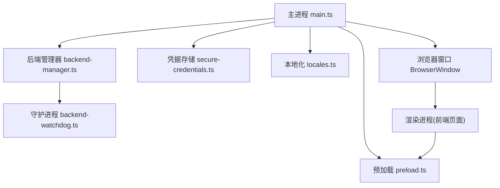
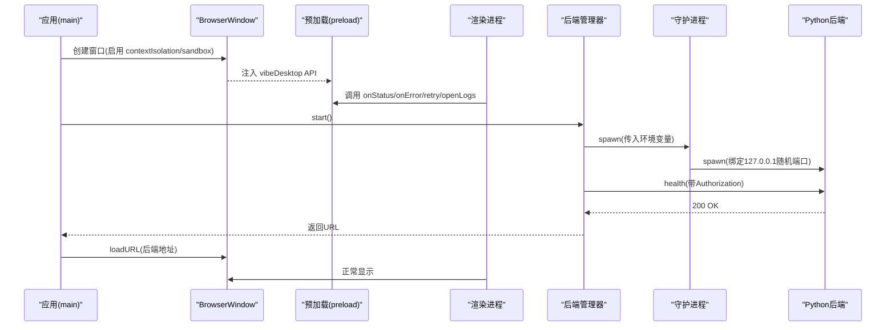
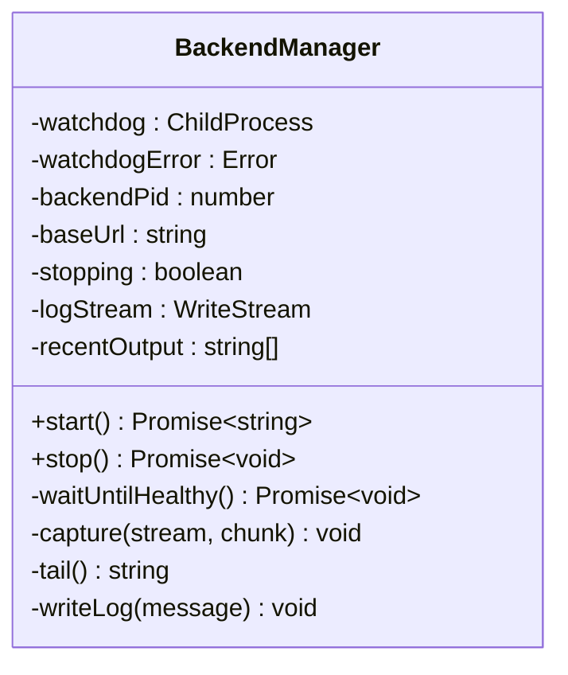
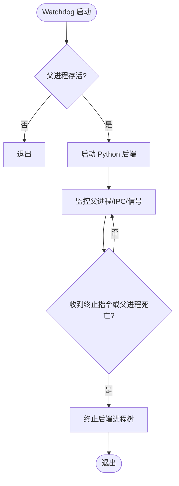
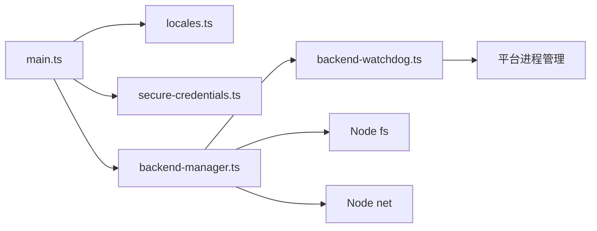

# Electron 架构设计

<cite>
**本文引用的文件**
- [main.ts](file://desktop/electron/src/main.ts)
- [preload.ts](file://desktop/electron/src/preload.ts)
- [backend-manager.ts](file://desktop/electron/src/backend-manager.ts)
- [backend-watchdog.ts](file://desktop/electron/src/backend-watchdog.ts)
- [secure-credentials.ts](file://desktop/electron/src/secure-credentials.ts)
- [locales.ts](file://desktop/electron/src/locales.ts)
- [package.json](file://desktop/electron/package.json)
- [THREAT_MODEL.md](file://desktop/electron/THREAT_MODEL.md)
</cite>

## 目录
1. [简介](#简介)
2. [项目结构](#项目结构)
3. [核心组件](#核心组件)
4. [架构总览](#架构总览)
5. [详细组件分析](#详细组件分析)
6. [依赖关系分析](#依赖关系分析)
7. [性能与可靠性](#性能与可靠性)
8. [故障排查指南](#故障排查指南)
9. [结论](#结论)
10. [附录：最佳实践与示例路径](#附录最佳实践与示例路径)

## 简介
本技术文档面向使用 Electron 构建桌面应用的开发者，围绕主进程与渲染进程的分离机制、进程生命周期管理、内存隔离、IPC 通信协议、安全配置（contextIsolation、nodeIntegration、sandbox）、后端服务管理（BackendManager）以及预加载脚本的安全边界进行系统化说明。文档同时提供错误处理、异常恢复策略和实际代码片段的路径指引，帮助读者在受限环境中安全地暴露必要 API，并实现稳健的窗口创建、事件监听与消息传递。

## 项目结构
Electron 桌面端位于 desktop/electron 目录，采用 TypeScript 编写，打包产物由 electron-builder 生成。关键入口与模块如下：
- 主进程入口：src/main.ts
- 预加载脚本：src/preload.ts
- 后端服务管理器：src/backend-manager.ts
- 守护进程（watchdog）：src/backend-watchdog.ts
- 凭据安全存储：src/secure-credentials.ts
- 本地化与消息模板：src/locales.ts
- 应用元数据与构建配置：package.json
- 威胁模型与安全约束：THREAT_MODEL.md

图表来源
- [main.ts:65-117](file://desktop/electron/src/main.ts#L65-L117)
- [preload.ts:1-18](file://desktop/electron/src/preload.ts#L1-L18)
- [backend-manager.ts:52-146](file://desktop/electron/src/backend-manager.ts#L52-L146)
- [backend-watchdog.ts:31-68](file://desktop/electron/src/backend-watchdog.ts#L31-L68)
- [secure-credentials.ts:68-123](file://desktop/electron/src/secure-credentials.ts#L68-L123)
- [locales.ts:61-131](file://desktop/electron/src/locales.ts#L61-L131)

章节来源
- [main.ts:1-285](file://desktop/electron/src/main.ts#L1-L285)
- [package.json:1-86](file://desktop/electron/package.json#L1-L86)

## 核心组件
- 主进程（main.ts）：负责应用生命周期、窗口创建、安全策略、IPC 注册、菜单、日志、错误上报、后端启动与关闭。
- 预加载脚本（preload.ts）：通过 contextBridge 向渲染进程暴露最小化的桌面能力（状态、错误、重试、打开日志、重启后端、凭据状态读写）。
- 后端管理器（backend-manager.ts）：封装后端可执行文件的解析、端口分配、子进程启动、健康检查、日志采集、优雅关闭与强制终止。
- 守护进程（backend-watchdog.ts）：独立 Node 进程，负责启动 Python 后端、监控父进程存活、处理 IPC 指令、清理进程树。
- 凭据存储（secure-credentials.ts）：基于 safeStorage 加密存储受信任的环境变量键值，支持迁移与原子写入。
- 本地化（locales.ts）：多语言消息模板与格式化，用于用户可见提示与错误信息。

章节来源
- [main.ts:22-63](file://desktop/electron/src/main.ts#L22-L63)
- [preload.ts:1-18](file://desktop/electron/src/preload.ts#L1-L18)
- [backend-manager.ts:16-61](file://desktop/electron/src/backend-manager.ts#L16-L61)
- [backend-watchdog.ts:1-36](file://desktop/electron/src/backend-watchdog.ts#L1-L36)
- [secure-credentials.ts:68-123](file://desktop/electron/src/secure-credentials.ts#L68-L123)
- [locales.ts:3-37](file://desktop/electron/src/locales.ts#L3-L37)

## 架构总览
Electron 应用遵循“主进程 + 沙箱渲染进程”的分离模式。主进程持有敏感密钥与系统资源访问权限；渲染进程运行在沙箱中，默认禁用 Node.js 集成，仅能通过预加载脚本暴露的最小 API 集与主进程通信。后端服务以独立子进程运行，并通过守护进程确保生命周期健壮性。

图表来源
- [main.ts:65-117](file://desktop/electron/src/main.ts#L65-L117)
- [preload.ts:1-18](file://desktop/electron/src/preload.ts#L1-L18)
- [backend-manager.ts:63-146](file://desktop/electron/src/backend-manager.ts#L63-L146)
- [backend-watchdog.ts:31-68](file://desktop/electron/src/backend-watchdog.ts#L31-L68)

## 详细组件分析

### 主进程与渲染进程分离、生命周期与内存隔离
- 进程分离：主进程负责系统级操作（菜单、窗口、文件系统、子进程），渲染进程仅负责 UI 与业务交互。
- 生命周期：
  - 应用就绪后初始化本地化、主题、凭据存储，创建窗口并注册 IPC，随后启动后端服务。
  - 窗口关闭时触发优雅关闭流程：通知状态、停止后端、退出应用。
  - 单实例锁保证仅一个应用实例运行。
- 内存隔离：
  - 渲染进程启用 contextIsolation 与 sandbox，禁用 nodeIntegration，避免直接访问 Node API。
  - 会话级别设置拒绝所有权限请求，限制外部导航到新窗口，仅允许安全的 http/https 链接。
  - 针对本地后端请求自动注入 Authorization 头，且仅当请求 origin 与当前后端一致时才注入。

章节来源
- [main.ts:33-63](file://desktop/electron/src/main.ts#L33-L63)
- [main.ts:65-117](file://desktop/electron/src/main.ts#L65-L117)
- [main.ts:249-285](file://desktop/electron/src/main.ts#L249-L285)
- [THREAT_MODEL.md:60-88](file://desktop/electron/THREAT_MODEL.md#L60-L88)

### BrowserWindow 安全配置选项
- contextIsolation: true —— 启用上下文隔离，防止渲染进程直接访问主进程对象。
- nodeIntegration: false —— 禁止渲染进程直接使用 Node.js 能力。
- sandbox: true —— 启用 Chromium 沙箱，进一步限制渲染进程权限。
- devTools: !app.isPackaged —— 仅在开发环境开放开发者工具。
- partition: "persist:vibe-trading-desktop" —— 使用独立的持久化分区，隔离 Cookie、缓存等。
- webRequest 拦截：对本地后端请求自动注入 Authorization 头，限制跨域访问。

章节来源
- [main.ts:76-98](file://desktop/electron/src/main.ts#L76-L98)
- [THREAT_MODEL.md:76-88](file://desktop/electron/THREAT_MODEL.md#L76-L88)

### BackendManager 类设计与模式
- 职责：
  - 解析后端可执行文件（支持覆盖、打包路径、源码发现、PATH 回退）。
  - 分配空闲端口，启动守护进程，转发环境变量（含认证密钥、工作目录、参数）。
  - 健康检查等待后端就绪，记录日志，处理意外退出。
  - 优雅关闭：先调用后端 shutdown 接口，再请求守护进程终止，最后强制结束进程树。
- 设计要点：
  - 单一职责：将后端生命周期与主进程解耦。
  - 可观测性：实时捕获 stdout/stderr，保留最近输出用于错误诊断。
  - 健壮性：超时保护、错误传播、进程树清理。

图表来源
- [backend-manager.ts:52-266](file://desktop/electron/src/backend-manager.ts#L52-L266)

章节来源
- [backend-manager.ts:52-266](file://desktop/electron/src/backend-manager.ts#L52-L266)

### 守护进程（Watchdog）与后端进程生命周期
- 启动顺序：主进程启动 watchdog，watchdog 校验父进程存活后启动 Python 后端。
- 监控机制：
  - 定时轮询父进程 PID 是否存活。
  - 监听 IPC 断开与 SIGTERM/SIGINT，触发终止后端。
  - 向后端发送 terminate-backend 指令，必要时使用 taskkill /T /F 或 kill(SIGKILL) 清理进程树。
- 通信协议：
  - 主进程与 watchdog 通过 IPC message 通信（如 terminate-backend）。
  - watchdog 与主进程通过 process.send 报告后端启动、错误、退出等信息。

图表来源
- [backend-watchdog.ts:31-117](file://desktop/electron/src/backend-watchdog.ts#L31-L117)

章节来源
- [backend-watchdog.ts:1-167](file://desktop/electron/src/backend-watchdog.ts#L1-L167)

### 预加载脚本的作用与安全边界
- 作用：通过 contextBridge.exposeInMainWorld 暴露最小 API 集合（vibeDesktop），包括：
  - 状态订阅（onStatus）、错误订阅（onError）
  - 重试（retry）、打开日志（openLogs）
  - 重启后端（restartBackend）
  - 凭据状态查询与写入（get/set credential）
- 安全边界：
  - 渲染进程无法直接访问 Node API 或主进程对象。
  - 所有 IPC 调用均经过主进程校验（如发送者必须是主窗口 WebContents）。
  - 凭据写入需通过白名单校验，且不会将明文值返回给渲染进程。

章节来源
- [preload.ts:1-18](file://desktop/electron/src/preload.ts#L1-L18)
- [main.ts:119-146](file://desktop/electron/src/main.ts#L119-L146)
- [secure-credentials.ts:105-137](file://desktop/electron/src/secure-credentials.ts#L105-L137)

### 进程间通信（IPC）最佳实践
- 单向广播：主进程通过 webContents.send 推送状态与错误到渲染进程。
- 双向调用：渲染进程通过 ipcRenderer.invoke 调用主进程方法（如重启后端、获取凭据状态）。
- 安全校验：主进程对所有 IPC 进行发送者校验（assertMainWindowSender），防止非预期来源调用。
- 最小暴露面：仅暴露必要的 API，避免泄露内部实现细节。

章节来源
- [main.ts:119-146](file://desktop/electron/src/main.ts#L119-L146)
- [preload.ts:1-18](file://desktop/electron/src/preload.ts#L1-L18)

### 错误处理与异常恢复
- 启动失败：捕获异常并弹窗提示，保持加载页展示以便重试。
- 后端异常退出：watchdog 报告退出码或信号，主进程通过 onUnexpectedExit 回调通知渲染进程。
- 健康检查超时：若后端未在限定时间内响应健康检查，抛出包含最近日志的错误。
- 优雅关闭：优先调用后端 shutdown 接口，超时后请求 watchdog 终止，最终强制结束进程树。
- 未捕获异常：全局 uncaughtException 弹窗提示，避免静默崩溃。

章节来源
- [main.ts:44-63](file://desktop/electron/src/main.ts#L44-L63)
- [main.ts:184-210](file://desktop/electron/src/main.ts#L184-L210)
- [backend-manager.ts:148-187](file://desktop/electron/src/backend-manager.ts#L148-L187)
- [backend-manager.ts:261-286](file://desktop/electron/src/backend-manager.ts#L261-L286)
- [main.ts:282-285](file://desktop/electron/src/main.ts#L282-L285)

## 依赖关系分析
- 主进程依赖：
  - Electron API（app、BrowserWindow、ipcMain、Menu、shell、nativeTheme）
  - 本地化模块（locales.ts）
  - 凭据存储（secure-credentials.ts）
  - 后端管理器（backend-manager.ts）
- 后端管理器依赖：
  - Node.js 子进程（child_process）
  - 文件系统（fs）
  - 网络（net 端口探测）
  - 本地化（locales.ts）
- 守护进程依赖：
  - Node.js 子进程（child_process）
  - 环境变量解析与校验
  - 平台相关进程终止命令（taskkill/kill）

图表来源
- [main.ts:1-21](file://desktop/electron/src/main.ts#L1-L21)
- [backend-manager.ts:1-14](file://desktop/electron/src/backend-manager.ts#L1-L14)
- [backend-watchdog.ts:1-12](file://desktop/electron/src/backend-watchdog.ts#L1-L12)

章节来源
- [main.ts:1-21](file://desktop/electron/src/main.ts#L1-L21)
- [backend-manager.ts:1-14](file://desktop/electron/src/backend-manager.ts#L1-L14)
- [backend-watchdog.ts:1-12](file://desktop/electron/src/backend-watchdog.ts#L1-L12)

## 性能与可靠性
- 端口分配：使用临时服务器快速查找空闲端口，减少冲突风险。
- 健康检查：轮询后端健康接口，设置合理超时，避免长时间阻塞。
- 日志采集：按天滚动写入日志文件，保留最近输出便于定位问题。
- 进程清理：优雅关闭优先，超时后强制终止，确保资源释放。
- 安全隔离：渲染进程沙箱化，限制权限与导航，降低攻击面。

[本节为通用指导，不直接分析具体文件]

## 故障排查指南
- 后端未找到：检查 VIBE_TRADING_EXECUTABLE 或 PATH 中是否存在 vibe-trading.exe。
- 端口不可用：确认无其他进程占用随机端口，或重试启动。
- 健康检查超时：查看最近日志尾部，确认后端是否正常启动。
- 凭据加密不可用：确认 Windows 用户会话支持 safeStorage。
- 意外退出：根据 watchdog 报告的退出码或信号定位原因。
- 启动失败弹窗：查看错误消息并尝试重试或打开日志文件夹。

章节来源
- [backend-manager.ts:310-339](file://desktop/electron/src/backend-manager.ts#L310-L339)
- [backend-manager.ts:413-429](file://desktop/electron/src/backend-manager.ts#L413-L429)
- [backend-manager.ts:261-286](file://desktop/electron/src/backend-manager.ts#L261-L286)
- [secure-credentials.ts:84-95](file://desktop/electron/src/secure-credentials.ts#L84-L95)
- [main.ts:206-210](file://desktop/electron/src/main.ts#L206-L210)

## 结论
该 Electron 桌面应用通过严格的主进程与渲染进程分离、沙箱化渲染、最小化预加载 API 暴露、健壮的后端生命周期管理与完善的错误处理机制，实现了高安全性与高可靠性的桌面体验。开发者可据此模式扩展功能，同时保持安全边界清晰、可维护性强。

[本节为总结，不直接分析具体文件]

## 附录：最佳实践与示例路径
- 窗口创建与安全配置
  - 参考路径：[main.ts:65-117](file://desktop/electron/src/main.ts#L65-L117)
- IPC 注册与调用
  - 主进程注册：[main.ts:119-146](file://desktop/electron/src/main.ts#L119-L146)
  - 渲染进程调用：[preload.ts:1-18](file://desktop/electron/src/preload.ts#L1-L18)
- 后端启动与健康检查
  - 启动流程：[backend-manager.ts:63-146](file://desktop/electron/src/backend-manager.ts#L63-L146)
  - 健康检查：[backend-manager.ts:261-286](file://desktop/electron/src/backend-manager.ts#L261-L286)
- 守护进程生命周期
  - 启动与监控：[backend-watchdog.ts:31-117](file://desktop/electron/src/backend-watchdog.ts#L31-L117)
- 凭据安全存储
  - 初始化与写入：[secure-credentials.ts:84-123](file://desktop/electron/src/secure-credentials.ts#L84-L123)
- 本地化与消息
  - 多语言消息：[locales.ts:61-131](file://desktop/electron/src/locales.ts#L61-L131)
- 构建与打包
  - 应用元数据：[package.json:1-86](file://desktop/electron/package.json#L1-L86)
- 安全威胁模型
  - 控制措施与边界：[THREAT_MODEL.md:51-170](file://desktop/electron/THREAT_MODEL.md#L51-L170)