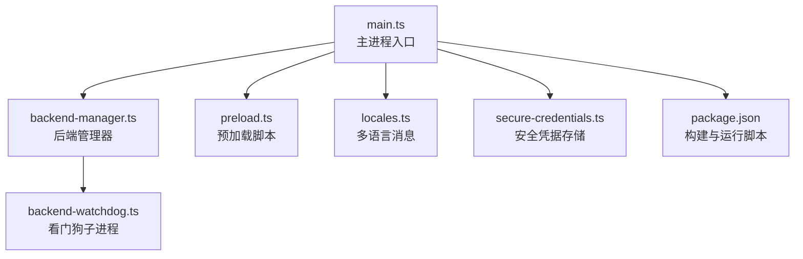
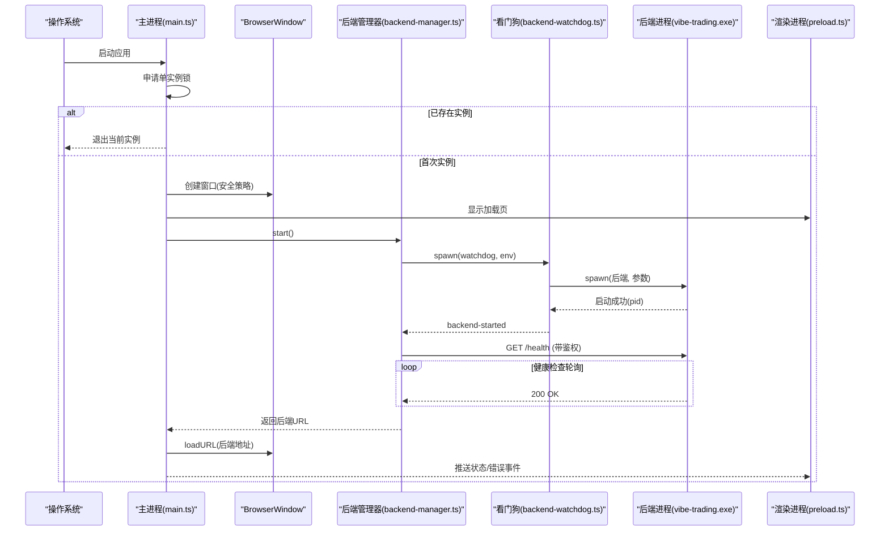
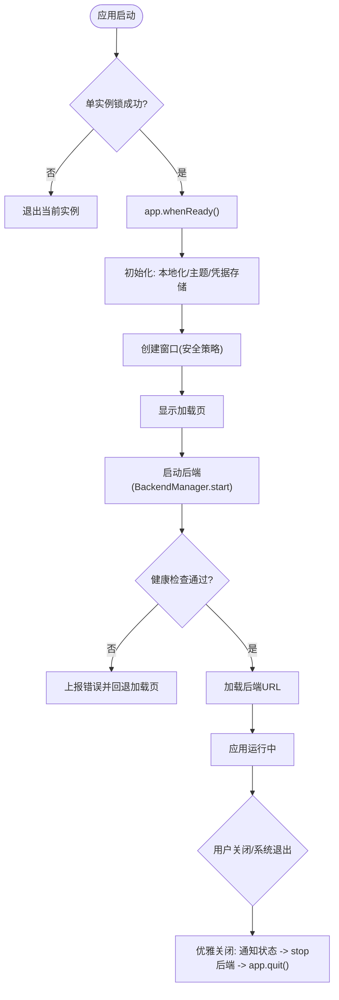
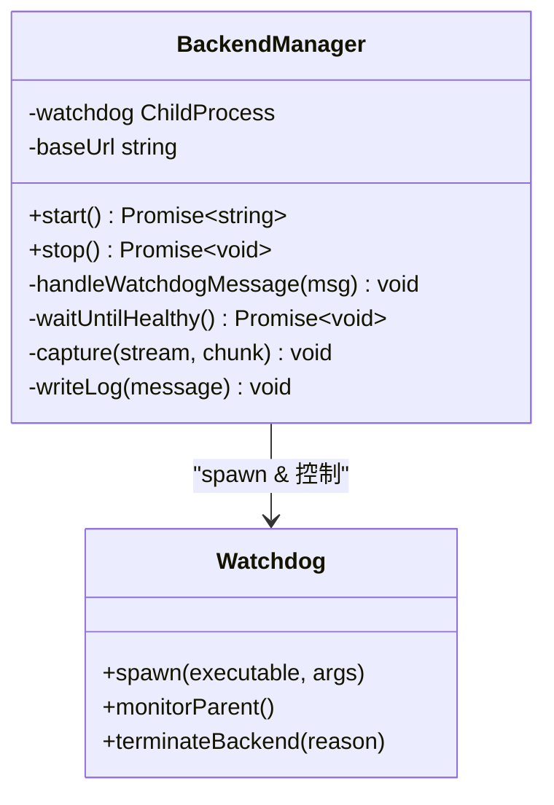
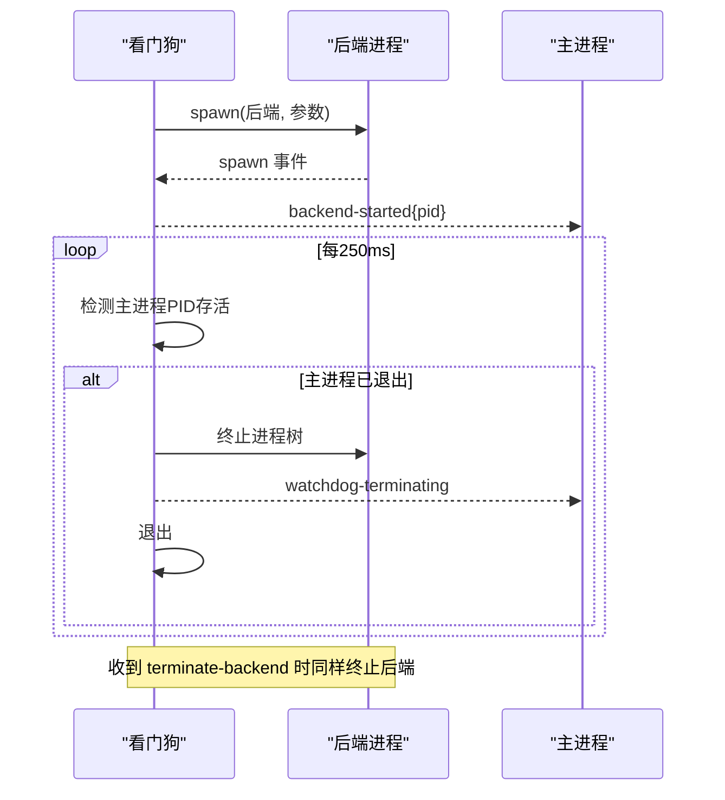
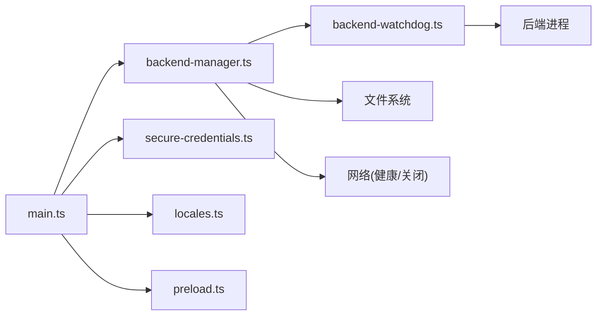

# 主进程生命周期管理

<cite>
**本文引用的文件**
- [desktop/electron/src/main.ts](file://desktop/electron/src/main.ts)
- [desktop/electron/src/backend-manager.ts](file://desktop/electron/src/backend-manager.ts)
- [desktop/electron/src/backend-watchdog.ts](file://desktop/electron/src/backend-watchdog.ts)
- [desktop/electron/src/preload.ts](file://desktop/electron/src/preload.ts)
- [desktop/electron/src/locales.ts](file://desktop/electron/src/locales.ts)
- [desktop/electron/src/secure-credentials.ts](file://desktop/electron/src/secure-credentials.ts)
- [desktop/electron/package.json](file://desktop/electron/package.json)
</cite>

## 目录
1. [简介](#简介)
2. [项目结构](#项目结构)
3. [核心组件](#核心组件)
4. [架构总览](#架构总览)
5. [详细组件分析](#详细组件分析)
6. [依赖关系分析](#依赖关系分析)
7. [性能考量](#性能考量)
8. [故障排查指南](#故障排查指南)
9. [结论](#结论)
10. [附录](#附录)

## 简介
本文件面向需要深入理解 Electron 应用架构与主进程生命周期的开发者，系统化梳理本项目的启动流程、单实例锁机制、窗口创建与安全配置、后端服务（Python）的启动与管理、关闭与资源清理、异常处理与恢复策略。文档以代码级为依据，提供流程图与时序图，帮助读者快速定位关键路径并掌握最佳实践。

## 项目结构
Electron 桌面端位于 desktop/electron 目录，主入口为 dist/main.js（源码在 src/main.ts），通过 TypeScript 编译后由 electron-builder 打包。主进程负责：
- 应用初始化与单实例锁
- 渲染进程窗口创建与安全策略
- 本地后端服务的发现、启动、健康检查与优雅关闭
- IPC 通道暴露能力给渲染进程
- 国际化与日志输出

图表来源
- [desktop/electron/src/main.ts:1-47](file://desktop/electron/src/main.ts#L1-L47)
- [desktop/electron/src/backend-manager.ts:63-146](file://desktop/electron/src/backend-manager.ts#L63-L146)
- [desktop/electron/src/backend-watchdog.ts:31-68](file://desktop/electron/src/backend-watchdog.ts#L31-L68)
- [desktop/electron/src/preload.ts:1-18](file://desktop/electron/src/preload.ts#L1-L18)
- [desktop/electron/src/locales.ts:61-131](file://desktop/electron/src/locales.ts#L61-L131)
- [desktop/electron/src/secure-credentials.ts:68-95](file://desktop/electron/src/secure-credentials.ts#L68-L95)
- [desktop/electron/package.json:9-23](file://desktop/electron/package.json#L9-L23)

章节来源
- [desktop/electron/src/main.ts:1-47](file://desktop/electron/src/main.ts#L1-L47)
- [desktop/electron/package.json:9-23](file://desktop/electron/package.json#L9-L23)

## 核心组件
- 主进程（main.ts）
  - 应用初始化、单实例锁、窗口创建、IPC 注册、菜单、错误上报、退出流程
- 后端管理器（backend-manager.ts）
  - 后端可执行文件解析、端口分配、子进程（看门狗）启动、健康检查、日志记录、优雅关闭
- 看门狗（backend-watchdog.ts）
  - 启动实际后端进程、监控父进程存活、统一终止树、向主进程汇报状态
- 预加载脚本（preload.ts）
  - 向渲染进程暴露受限 API（状态、错误、重试、重启后端、凭据操作）
- 国际化（locales.ts）
  - 多语言消息模板与格式化
- 安全凭据存储（secure-credentials.ts）
  - 使用系统加密存储凭据，迁移旧格式，注入环境变量到后端

章节来源
- [desktop/electron/src/main.ts:49-192](file://desktop/electron/src/main.ts#L49-L192)
- [desktop/electron/src/backend-manager.ts:52-266](file://desktop/electron/src/backend-manager.ts#L52-L266)
- [desktop/electron/src/backend-watchdog.ts:1-167](file://desktop/electron/src/backend-watchdog.ts#L1-L167)
- [desktop/electron/src/preload.ts:1-18](file://desktop/electron/src/preload.ts#L1-L18)
- [desktop/electron/src/locales.ts:1-51](file://desktop/electron/src/locales.ts#L1-L51)
- [desktop/electron/src/secure-credentials.ts:68-123](file://desktop/electron/src/secure-credentials.ts#L68-L123)

## 架构总览
下图展示了从应用启动到后端就绪的完整时序，包括单实例锁、窗口创建、后端发现与启动、健康检查、以及错误处理。

图表来源
- [desktop/electron/src/main.ts:35-63](file://desktop/electron/src/main.ts#L35-L63)
- [desktop/electron/src/main.ts:65-117](file://desktop/electron/src/main.ts#L65-L117)
- [desktop/electron/src/main.ts:159-192](file://desktop/electron/src/main.ts#L159-L192)
- [desktop/electron/src/backend-manager.ts:63-146](file://desktop/electron/src/backend-manager.ts#L63-L146)
- [desktop/electron/src/backend-manager.ts:261-286](file://desktop/electron/src/backend-manager.ts#L261-L286)
- [desktop/electron/src/backend-watchdog.ts:31-68](file://desktop/electron/src/backend-watchdog.ts#L31-L68)
- [desktop/electron/src/preload.ts:3-17](file://desktop/electron/src/preload.ts#L3-L17)

## 详细组件分析

### 主进程生命周期（main.ts）
- 启动与单实例锁
  - 设置应用名称、用户数据路径（测试模式）、生成 API 鉴权密钥
  - 使用 requestSingleInstanceLock 确保仅一个实例运行；若失败直接退出
  - 监听 second-instance 事件，将焦点切换到已有窗口
- whenReady 与 ready
  - 解析本地化、设置主题、初始化安全凭据存储、创建窗口、注册 IPC、创建菜单、显示加载页、调用 boot
- 窗口创建与安全
  - BrowserWindow 启用 contextIsolation、禁用 nodeIntegration、开启 sandbox，限制 devTools 仅在开发环境
  - 会话权限全部拒绝，拦截外部导航，仅允许 http/https 外链
  - 自动隐藏菜单栏，最小尺寸约束
- 后端启动与错误处理
  - 通过 BackendManager 启动后端，等待健康检查通过后加载 URL
  - 捕获异常并回退到加载页，推送错误事件
- IPC 与菜单
  - 暴露重试、打开日志、重启后端、凭据状态查询与设置等能力
  - 菜单项支持重启服务、打开日志、刷新、缩放、全屏、退出
- 关闭流程
  - 阻止默认关闭，触发优雅关闭：发送“正在关闭”状态、停止后端、退出应用
  - 全局未捕获异常弹窗提示

图表来源
- [desktop/electron/src/main.ts:35-63](file://desktop/electron/src/main.ts#L35-L63)
- [desktop/electron/src/main.ts:65-117](file://desktop/electron/src/main.ts#L65-L117)
- [desktop/electron/src/main.ts:159-192](file://desktop/electron/src/main.ts#L159-L192)
- [desktop/electron/src/main.ts:249-255](file://desktop/electron/src/main.ts#L249-L255)

章节来源
- [desktop/electron/src/main.ts:35-63](file://desktop/electron/src/main.ts#L35-L63)
- [desktop/electron/src/main.ts:65-117](file://desktop/electron/src/main.ts#L65-L117)
- [desktop/electron/src/main.ts:119-146](file://desktop/electron/src/main.ts#L119-L146)
- [desktop/electron/src/main.ts:159-192](file://desktop/electron/src/main.ts#L159-L192)
- [desktop/electron/src/main.ts:212-238](file://desktop/electron/src/main.ts#L212-L238)
- [desktop/electron/src/main.ts:249-255](file://desktop/electron/src/main.ts#L249-L255)
- [desktop/electron/src/main.ts:278-284](file://desktop/electron/src/main.ts#L278-L284)

### 后端服务管理（backend-manager.ts）
- 后端可执行文件解析
  - 优先使用环境变量覆盖，其次查找打包产物或源码环境中的 vibe-trading.exe
  - 根据平台与部署方式决定前缀参数与是否追加 serve 命令
- 端口与健康检查
  - 动态分配空闲端口，构造基础 URL
  - 循环调用 /health 接口进行健康检查，超时抛出错误并附带最近日志片段
- 子进程与日志
  - 启动看门狗子进程，继承必要的环境变量（包含凭据与环境开关）
  - 捕获 stdout/stderr，写入按日期分片的日志文件，保留最近若干行用于错误上下文
- 优雅关闭
  - 先尝试通过 HTTP 调用 system/shutdown 接口优雅关闭后端
  - 若未退出，则通过 IPC 通知看门狗终止后端进程树
  - 最后强制终止看门狗及其子进程树，确保资源释放

图表来源
- [desktop/electron/src/backend-manager.ts:52-266](file://desktop/electron/src/backend-manager.ts#L52-L266)
- [desktop/electron/src/backend-manager.ts:310-411](file://desktop/electron/src/backend-manager.ts#L310-L411)
- [desktop/electron/src/backend-manager.ts:373-421](file://desktop/electron/src/backend-manager.ts#L373-L421)

章节来源
- [desktop/electron/src/backend-manager.ts:63-146](file://desktop/electron/src/backend-manager.ts#L63-L146)
- [desktop/electron/src/backend-manager.ts:148-187](file://desktop/electron/src/backend-manager.ts#L148-L187)
- [desktop/electron/src/backend-manager.ts:237-306](file://desktop/electron/src/backend-manager.ts#L237-L306)
- [desktop/electron/src/backend-manager.ts:310-411](file://desktop/electron/src/backend-manager.ts#L310-L411)
- [desktop/electron/src/backend-manager.ts:373-421](file://desktop/electron/src/backend-manager.ts#L373-L421)

### 看门狗（backend-watchdog.ts）
- 职责
  - 读取主进程传入的环境变量，启动实际后端进程
  - 定期检测主进程存活，若主进程退出则终止后端
  - 接收 terminate-backend 指令，统一终止后端进程树
  - 向主进程发送后端启动、错误、退出等消息
- 终止策略
  - Windows 使用 taskkill /T /F 终止进程树
  - 非 Windows 使用 SIGKILL 终止进程树
  - 超时保护：等待后端退出超过阈值后仍强制退出

图表来源
- [desktop/electron/src/backend-watchdog.ts:7-13](file://desktop/electron/src/backend-watchdog.ts#L7-L13)
- [desktop/electron/src/backend-watchdog.ts:31-68](file://desktop/electron/src/backend-watchdog.ts#L31-L68)
- [desktop/electron/src/backend-watchdog.ts:74-101](file://desktop/electron/src/backend-watchdog.ts#L74-L101)
- [desktop/electron/src/backend-watchdog.ts:103-117](file://desktop/electron/src/backend-watchdog.ts#L103-L117)

章节来源
- [desktop/electron/src/backend-watchdog.ts:7-13](file://desktop/electron/src/backend-watchdog.ts#L7-L13)
- [desktop/electron/src/backend-watchdog.ts:31-68](file://desktop/electron/src/backend-watchdog.ts#L31-L68)
- [desktop/electron/src/backend-watchdog.ts:74-101](file://desktop/electron/src/backend-watchdog.ts#L74-L101)
- [desktop/electron/src/backend-watchdog.ts:103-117](file://desktop/electron/src/backend-watchdog.ts#L103-L117)

### 预加载脚本与 IPC（preload.ts）
- 暴露能力
  - onStatus/onError：订阅主进程推送的状态与错误消息
  - retry：请求主进程重新引导后端
  - openLogs：打开日志目录
  - restartBackend：异步重启后端
  - getCredentialStatus/setCredential：查询与设置安全凭据
- 安全边界
  - 仅通过 contextBridge 暴露有限方法，避免直接访问 Node/Electron API

章节来源
- [desktop/electron/src/preload.ts:1-18](file://desktop/electron/src/preload.ts#L1-L18)
- [desktop/electron/src/main.ts:119-146](file://desktop/electron/src/main.ts#L119-L146)

### 安全设置与窗口配置
- contextIsolation: true
  - 隔离渲染进程与主进程上下文，防止直接访问 Node API
- nodeIntegration: false
  - 禁止在渲染进程中直接使用 Node 模块，降低攻击面
- sandbox: true
  - 启用沙箱，进一步限制渲染进程权限
- 其他安全加固
  - 会话权限检查与请求处理器一律拒绝
  - 仅允许 http/https 外链，拦截内部导航到非信任域
  - 对 localhost 请求自动注入 Authorization 头（基于后端 origin）

章节来源
- [desktop/electron/src/main.ts:65-117](file://desktop/electron/src/main.ts#L65-L117)

### 凭据与环境注入（secure-credentials.ts）
- 功能
  - 使用 safeStorage 加密存储受支持的凭据键
  - 迁移 .env 与 JSON 字段到安全存储
  - 导出解密后的环境变量供后端进程使用
- 安全
  - 白名单校验允许的凭据键
  - 原子写入临时文件再重命名，避免损坏
- 集成
  - 主进程初始化后注入 credentialEnvironment 到后端子进程环境

章节来源
- [desktop/electron/src/secure-credentials.ts:68-123](file://desktop/electron/src/secure-credentials.ts#L68-L123)
- [desktop/electron/src/secure-credentials.ts:139-164](file://desktop/electron/src/secure-credentials.ts#L139-L164)
- [desktop/electron/src/secure-credentials.ts:166-219](file://desktop/electron/src/secure-credentials.ts#L166-L219)
- [desktop/electron/src/main.ts:56-57](file://desktop/electron/src/main.ts#L56-L57)
- [desktop/electron/src/backend-manager.ts:108-123](file://desktop/electron/src/backend-manager.ts#L108-L123)

### 国际化与用户提示（locales.ts）
- 支持多语言（en、zh-CN、ja、ko、ar）
- 提供加载页、错误、菜单等用户可见文案
- 格式化模板字符串，便于动态插入端口号、退出码等信息

章节来源
- [desktop/electron/src/locales.ts:1-51](file://desktop/electron/src/locales.ts#L1-L51)
- [desktop/electron/src/locales.ts:61-131](file://desktop/electron/src/locales.ts#L61-L131)
- [desktop/electron/src/locales.ts:239-279](file://desktop/electron/src/locales.ts#L239-L279)

## 依赖关系分析
- 主进程依赖
  - BackendManager：后端生命周期管理
  - SecureCredentialStore：凭据安全存储与环境注入
  - Locales：多语言消息
  - Preload：IPC 桥接
- 后端管理器依赖
  - 文件系统：日志写入、目录创建
  - 网络：健康检查、优雅关闭
  - 子进程：看门狗与实际后端
- 看门狗依赖
  - 子进程：实际后端
  - 系统工具：taskkill（Windows）或 kill（Unix）

图表来源
- [desktop/electron/src/main.ts:13-20](file://desktop/electron/src/main.ts#L13-L20)
- [desktop/electron/src/backend-manager.ts:1-14](file://desktop/electron/src/backend-manager.ts#L1-L14)
- [desktop/electron/src/backend-watchdog.ts:1-12](file://desktop/electron/src/backend-watchdog.ts#L1-L12)

章节来源
- [desktop/electron/src/main.ts:13-20](file://desktop/electron/src/main.ts#L13-L20)
- [desktop/electron/src/backend-manager.ts:1-14](file://desktop/electron/src/backend-manager.ts#L1-L14)
- [desktop/electron/src/backend-watchdog.ts:1-12](file://desktop/electron/src/backend-watchdog.ts#L1-L12)

## 性能考量
- 健康检查轮询间隔短（约100ms），避免长时间阻塞启动，同时设置总超时（约180秒）防止无限等待
- 日志写入采用流式追加，限制最近输出行数，减少内存占用
- 端口分配通过临时服务器绑定随机端口，避免冲突
- 看门狗定时检测主进程存活（250ms），及时回收资源
- 优雅关闭使用 HTTP 超时（2秒）与强制终止兜底，平衡用户体验与可靠性

[本节为通用性能讨论，不直接分析具体文件]

## 故障排查指南
- 启动失败
  - 检查单实例锁是否被占用（重复启动会退出）
  - 查看加载页错误消息与日志目录，确认后端可执行文件是否找到
- 后端意外退出
  - 关注“后端意外退出”消息与最近日志片段
  - 检查端口是否可用、健康检查是否超时
  - 查看看门狗是否收到 terminate 指令或父进程退出
- 凭据问题
  - 确认安全存储可用（Windows 用户会话需支持加密）
  - 检查凭据键是否在白名单内
  - 查看迁移日志，确认旧凭据是否成功迁移
- 无法外链或导航被拦截
  - 确认目标协议为 http/https
  - 检查是否尝试导航到非信任域

章节来源
- [desktop/electron/src/main.ts:35-47](file://desktop/electron/src/main.ts#L35-L47)
- [desktop/electron/src/main.ts:159-192](file://desktop/electron/src/main.ts#L159-L192)
- [desktop/electron/src/backend-manager.ts:261-286](file://desktop/electron/src/backend-manager.ts#L261-L286)
- [desktop/electron/src/backend-watchdog.ts:45-68](file://desktop/electron/src/backend-watchdog.ts#L45-L68)
- [desktop/electron/src/secure-credentials.ts:84-95](file://desktop/electron/src/secure-credentials.ts#L84-L95)

## 结论
本项目的主进程生命周期管理围绕“单实例锁 + 安全窗口 + 后端服务管理 + 优雅关闭”展开，通过看门狗解耦后端进程的生命周期，结合健康检查与日志追踪，提供了稳定可靠的桌面端体验。开发者可据此扩展更多生命周期钩子、增强错误恢复策略，或在不同平台上优化进程树终止行为。

[本节为总结性内容，不直接分析具体文件]

## 附录
- 常用生命周期钩子与事件
  - app.whenReady：应用准备就绪后执行初始化
  - app.second-instance：处理重复启动，聚焦已有窗口
  - window-all-closed：在非 macOS 平台退出应用
  - process.uncaughtException：捕获未处理异常并弹窗
- IPC 示例（渲染进程侧）
  - 订阅状态与错误：onStatus/onError
  - 重试与重启：retry/restartBackend
  - 打开日志：openLogs
  - 凭据操作：getCredentialStatus/setCredential
- 构建与运行
  - npm run build：TypeScript 编译与静态资源复制
  - npm start：构建后启动 Electron
  - npm run pack:win：打包 Windows 目录分发
  - npm run runtime:win：构建后端运行时（Windows）

章节来源
- [desktop/electron/src/main.ts:278-284](file://desktop/electron/src/main.ts#L278-L284)
- [desktop/electron/src/preload.ts:3-17](file://desktop/electron/src/preload.ts#L3-L17)
- [desktop/electron/package.json:9-23](file://desktop/electron/package.json#L9-L23)