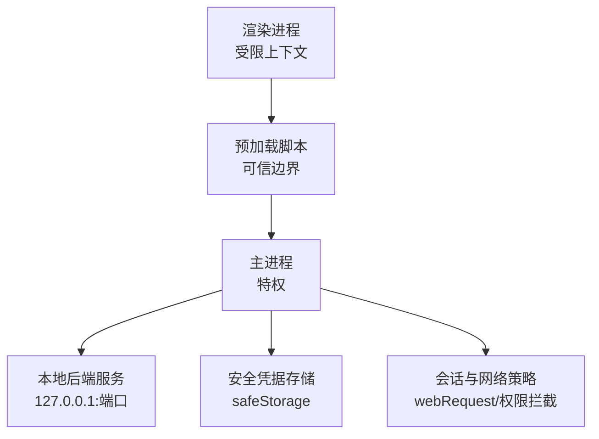
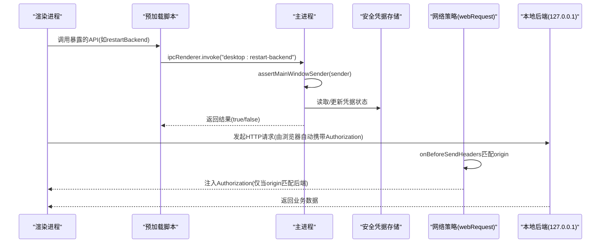
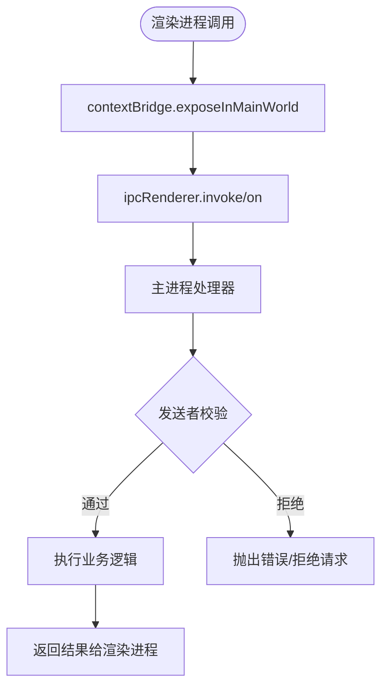
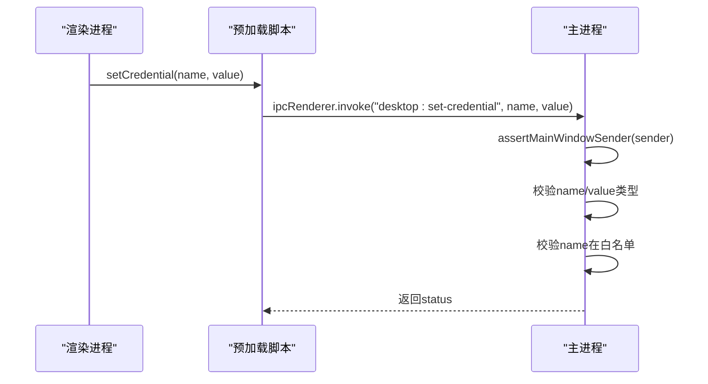
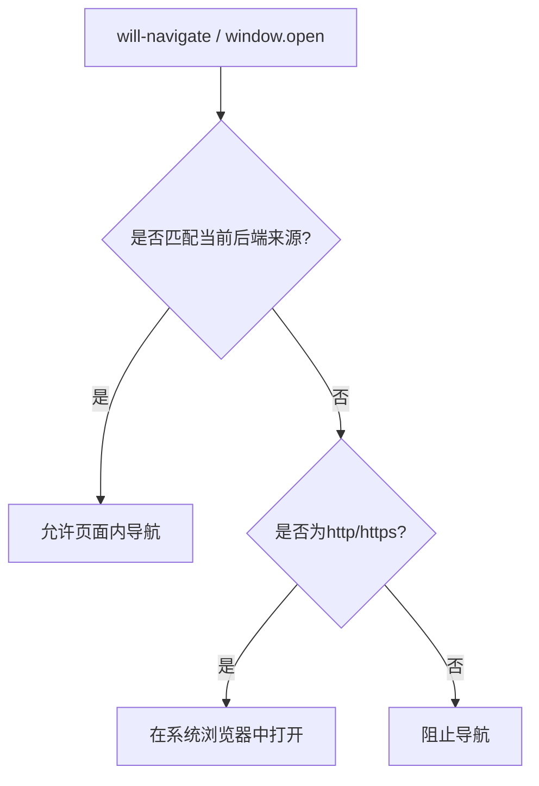
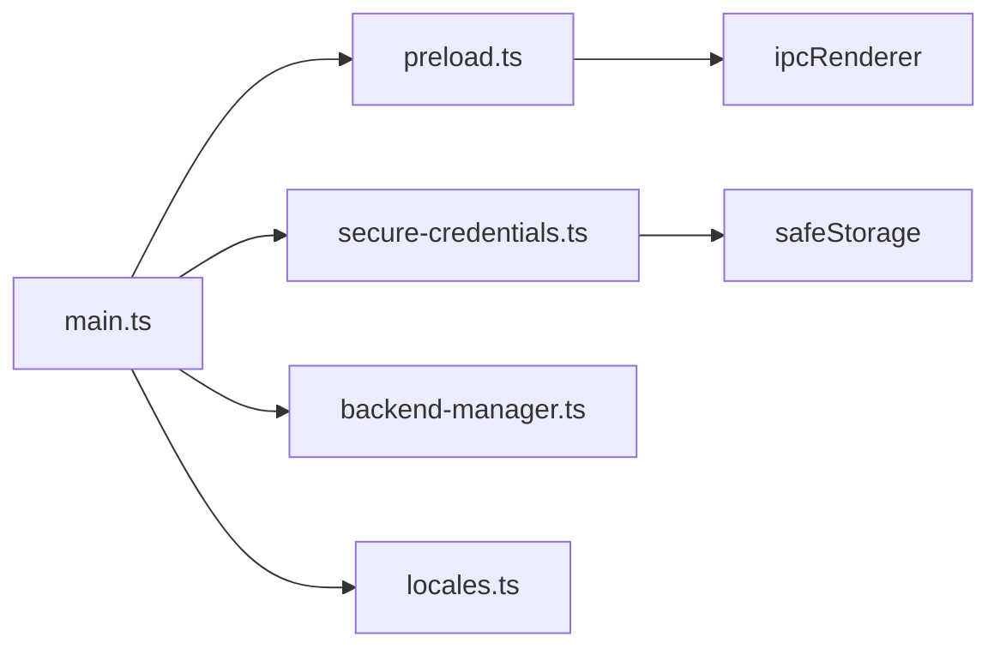

# IPC 通信安全

<cite>
**本文引用的文件**
- [main.ts](file://desktop/electron/src/main.ts)
- [preload.ts](file://desktop/electron/src/preload.ts)
- [secure-credentials.ts](file://desktop/electron/src/secure-credentials.ts)
- [package.json](file://desktop/electron/package.json)
- [THREAT_MODEL.md](file://desktop/electron/THREAT_MODEL.md)
</cite>

## 目录
1. [简介](#简介)
2. [项目结构](#项目结构)
3. [核心组件](#核心组件)
4. [架构总览](#架构总览)
5. [详细组件分析](#详细组件分析)
6. [依赖关系分析](#依赖关系分析)
7. [性能与安全权衡](#性能与安全权衡)
8. [故障排查指南](#故障排查指南)
9. [结论](#结论)
10. [附录：安全实践清单](#附录安全实践清单)

## 简介
本技术文档聚焦于 Electron 主进程与渲染进程之间的安全通信机制，围绕“预加载脚本作为唯一可信边界”的核心思想，系统阐述以下主题：
- IPC 通道注册、权限控制与消息验证
- 上下文隔离（contextIsolation）的安全边界与可信执行环境
- 外部 URL 访问的安全控制（协议白名单、来源验证、导航拦截）
- 实际安全的 IPC 通信模式（请求校验、响应处理、错误处理）
- 结合威胁模型的安全设计要点与残余风险

目标读者为关注桌面应用安全的开发者，旨在提供可落地的最佳实践与排障指引。

## 项目结构
Electron 桌面端的关键安全实现集中在 desktop/electron 目录：
- 主进程入口与窗口、IPC、网络策略等：src/main.ts
- 预加载脚本（仅暴露最小 API 到渲染进程）：src/preload.ts
- 凭据安全存储（加密、迁移、持久化）：src/secure-credentials.ts
- 打包与构建配置（启用沙箱、禁用 Node 集成等）：package.json
- 威胁模型与信任边界说明：THREAT_MODEL.md

图表来源
- [main.ts:65-117](file://desktop/electron/src/main.ts#L65-L117)
- [preload.ts:1-18](file://desktop/electron/src/preload.ts#L1-L18)
- [secure-credentials.ts:68-164](file://desktop/electron/src/secure-credentials.ts#L68-L164)
- [THREAT_MODEL.md:31-88](file://desktop/electron/THREAT_MODEL.md#L31-L88)

章节来源
- [main.ts:65-117](file://desktop/electron/src/main.ts#L65-L117)
- [preload.ts:1-18](file://desktop/electron/src/preload.ts#L1-L18)
- [secure-credentials.ts:68-164](file://desktop/electron/src/secure-credentials.ts#L68-L164)
- [package.json:24-35](file://desktop/electron/package.json#L24-L35)
- [THREAT_MODEL.md:31-88](file://desktop/electron/THREAT_MODEL.md#L31-L88)

## 核心组件
- 主进程（main.ts）
  - 创建 BrowserWindow，启用 contextIsolation、sandbox，禁用 nodeIntegration
  - 注册 IPC 通道并严格校验发送者身份
  - 设置 webRequest 拦截器，仅在匹配后端来源时注入认证头
  - 拦截新窗口打开与页面内导航，限制为安全协议或当前后端来源
- 预加载脚本（preload.ts）
  - 通过 contextBridge.exposeInMainWorld 暴露最小 API 集合
  - 所有 IPC 调用均经过类型约束与白名单通道
- 安全凭据存储（secure-credentials.ts）
  - 使用 safeStorage 加密/解密凭据，仅允许白名单键名
  - 持久化采用临时文件+原子重命名，避免部分写入
  - 支持从 .env 与配置文件迁移至安全存储
- 威胁模型（THREAT_MODEL.md）
  - 明确信任边界、控制措施与残余风险
  - 强调渲染进程不可直接持有原始密钥，仅能通过受控通道访问后端

章节来源
- [main.ts:119-146](file://desktop/electron/src/main.ts#L119-L146)
- [preload.ts:3-17](file://desktop/electron/src/preload.ts#L3-L17)
- [secure-credentials.ts:105-164](file://desktop/electron/src/secure-credentials.ts#L105-L164)
- [THREAT_MODEL.md:60-88](file://desktop/electron/THREAT_MODEL.md#L60-L88)

## 架构总览
下图展示了主进程、预加载脚本、渲染进程与本地后端之间的安全通信流程，以及关键的安全控制点。

图表来源
- [preload.ts:11-16](file://desktop/electron/src/preload.ts#L11-L16)
- [main.ts:128-145](file://desktop/electron/src/main.ts#L128-L145)
- [main.ts:88-98](file://desktop/electron/src/main.ts#L88-L98)
- [secure-credentials.ts:97-123](file://desktop/electron/src/secure-credentials.ts#L97-L123)

章节来源
- [preload.ts:1-18](file://desktop/electron/src/preload.ts#L1-L18)
- [main.ts:88-145](file://desktop/electron/src/main.ts#L88-L145)
- [secure-credentials.ts:97-123](file://desktop/electron/src/secure-credentials.ts#L97-L123)

## 详细组件分析

### 预加载脚本作为安全边界
- 作用
  - 在渲染进程中以受限上下文运行，但可通过 contextBridge 暴露有限能力
  - 将 IPC 通道封装为强类型方法，避免渲染进程直接构造任意 IPC 调用
- 实现要点
  - 仅暴露必要方法：状态订阅、错误订阅、重试、日志目录、重启后端、凭据查询与设置
  - 所有 invoke/on 调用均绑定到主进程已注册的通道，形成白名单
- 为什么是唯一的可信执行环境
  - 渲染进程被沙箱化且禁用 Node 集成，无法直接访问系统资源
  - 预加载脚本运行在主进程侧的受限桥接中，具备最小权限原则下的可信执行能力

图表来源
- [preload.ts:3-17](file://desktop/electron/src/preload.ts#L3-L17)
- [main.ts:119-145](file://desktop/electron/src/main.ts#L119-L145)
- [main.ts:240-242](file://desktop/electron/src/main.ts#L240-L242)

章节来源
- [preload.ts:3-17](file://desktop/electron/src/preload.ts#L3-L17)
- [main.ts:119-145](file://desktop/electron/src/main.ts#L119-L145)
- [main.ts:240-242](file://desktop/electron/src/main.ts#L240-L242)

### IPC 通道注册与管理
- 事件监听器与处理器
  - 使用 ipcMain.on 处理单向事件（如重试、打开日志）
  - 使用 ipcMain.handle 处理双向请求（如重启后端、凭据状态与设置）
- 权限控制
  - 每个处理器首先调用 assertMainWindowSender(event.sender)，确保请求来自当前主窗口的 WebContents
  - 对凭据设置进行参数类型校验（name 必须为字符串，value 为字符串或 null），否则抛出错误
- 消息验证
  - 对敏感操作（如设置凭据）进行严格的输入类型检查
  - 凭据名称必须在白名单中，否则拒绝

图表来源
- [preload.ts:14-16](file://desktop/electron/src/preload.ts#L14-L16)
- [main.ts:137-145](file://desktop/electron/src/main.ts#L137-L145)
- [secure-credentials.ts:105-137](file://desktop/electron/src/secure-credentials.ts#L105-L137)

章节来源
- [main.ts:119-145](file://desktop/electron/src/main.ts#L119-L145)
- [secure-credentials.ts:105-137](file://desktop/electron/src/secure-credentials.ts#L105-L137)

### 上下文隔离（contextIsolation）与安全边界
- 配置
  - BrowserWindow 启用 contextIsolation 与 sandbox，禁用 nodeIntegration
  - 使用独立 partition 隔离渲染会话，避免与其他页面共享状态
- 效果
  - 渲染进程无法直接访问 Node API 或全局对象
  - 只能通过预加载脚本暴露的最小 API 与主进程通信
- 为什么预加载是唯一可信执行环境
  - 预加载脚本运行在受限桥接中，具备访问主进程 IPC 的能力
  - 渲染进程处于沙箱中，不具备直接系统访问能力

章节来源
- [main.ts:65-84](file://desktop/electron/src/main.ts#L65-L84)
- [THREAT_MODEL.md:76-88](file://desktop/electron/THREAT_MODEL.md#L76-L88)

### 外部 URL 访问的安全控制
- 协议白名单
  - 新窗口打开仅允许 http: 与 https: 协议，其他协议一律拒绝
- 来源验证
  - 页面内导航仅允许跳转到当前后端来源；否则阻止并在系统浏览器中打开
- 导航拦截策略
  - 使用 will-navigate 与 setWindowOpenHandler 双重拦截
  - 对非安全或跨来源的导航进行阻止，并通过 shell.openExternal 安全打开

图表来源
- [main.ts:107-116](file://desktop/electron/src/main.ts#L107-L116)
- [main.ts:257-264](file://desktop/electron/src/main.ts#L257-L264)

章节来源
- [main.ts:107-116](file://desktop/electron/src/main.ts#L107-L116)
- [main.ts:257-264](file://desktop/electron/src/main.ts#L257-L264)

### 网络请求与认证注入
- 会话级权限控制
  - 默认拒绝所有权限检查与请求
- 认证头注入
  - 对 http://127.0.0.1/* 的请求，在发送前检查请求 origin 是否与当前后端 origin 完全一致
  - 若匹配，则注入 Authorization: Bearer <随机密钥>
- 目的
  - 防止渲染进程直接访问任意本地地址获取敏感信息
  - 确保只有合法的后端来源能携带认证头

章节来源
- [main.ts:85-98](file://desktop/electron/src/main.ts#L85-L98)
- [THREAT_MODEL.md:60-74](file://desktop/electron/THREAT_MODEL.md#L60-L74)

### 凭据安全存储与注入
- 加密与持久化
  - 使用 safeStorage 加密/解密凭据值
  - 持久化采用临时文件+原子重命名，权限设置为 0o600
- 白名单与迁移
  - 仅允许配置的键名写入；支持从 .env 与配置文件迁移
  - 迁移后移除明文字段，避免残留
- 注入方式
  - 解密后的凭据仅注入到后端子进程的环境变量中，不返回给渲染进程

章节来源
- [secure-credentials.ts:68-164](file://desktop/electron/src/secure-credentials.ts#L68-L164)
- [THREAT_MODEL.md:163-179](file://desktop/electron/THREAT_MODEL.md#L163-L179)

## 依赖关系分析
- 主进程依赖
  - Electron 模块：app、BrowserWindow、ipcMain、shell、nativeTheme 等
  - 自定义模块：BackendManager、SecureCredentialStore、locales
- 预加载脚本依赖
  - Electron 模块：contextBridge、ipcRenderer
- 安全存储依赖
  - Electron 模块：safeStorage
  - Node 模块：fs、os、path

图表来源
- [main.ts:1-20](file://desktop/electron/src/main.ts#L1-L20)
- [preload.ts:1-2](file://desktop/electron/src/preload.ts#L1-L2)
- [secure-credentials.ts:1-5](file://desktop/electron/src/secure-credentials.ts#L1-L5)

章节来源
- [main.ts:1-20](file://desktop/electron/src/main.ts#L1-L20)
- [preload.ts:1-2](file://desktop/electron/src/preload.ts#L1-L2)
- [secure-credentials.ts:1-5](file://desktop/electron/src/secure-credentials.ts#L1-L5)

## 性能与安全权衡
- 上下文隔离与沙箱
  - 提升安全性，可能带来少量性能开销（隔离上下文、权限检查）
- webRequest 拦截
  - 每次请求需解析 origin 并比较，影响轻微；建议限制匹配范围（如仅 127.0.0.1）
- 凭据加密/解密
  - 使用 safeStorage 加解密，开销可控；避免频繁调用，缓存状态
- 导航拦截
  - 每次导航需解析 URL 并比较来源；建议缓存当前后端 origin 以减少计算

[本节为通用指导，无需具体文件引用]

## 故障排查指南
- 常见错误与定位
  - “Desktop request rejected”：IPC 发送者不是当前主窗口，检查是否多窗口或多实例
  - “Credential encryption unavailable”：safeStorage 不可用，检查平台与用户会话
  - “Credential file unsupported”：凭据文件格式不匹配，检查版本与结构
  - “Credential key unsupported”：键名不在白名单，检查传入的 name
- 调试步骤
  - 确认 BrowserWindow 的 webPreferences 配置正确（contextIsolation、sandbox、nodeIntegration=false）
  - 检查 webRequest 拦截器是否正确注入 Authorization 头
  - 验证 will-navigate 与 setWindowOpenHandler 是否按预期工作
  - 查看日志目录与错误消息，定位启动失败原因

章节来源
- [main.ts:240-247](file://desktop/electron/src/main.ts#L240-L247)
- [secure-credentials.ts:84-137](file://desktop/electron/src/secure-credentials.ts#L84-L137)
- [main.ts:206-210](file://desktop/electron/src/main.ts#L206-L210)

## 结论
该 Electron 应用在 IPC 通信安全方面采用了多层防护：
- 通过 contextIsolation 与 sandbox 限制渲染进程能力
- 以预加载脚本为唯一可信边界，暴露最小 API
- 严格校验 IPC 发送者与参数类型，实施白名单控制
- 通过 webRequest 拦截器精确注入认证头，限制来源
- 对外部 URL 访问实施协议白名单与来源验证
- 凭据安全存储与注入，避免泄露到渲染进程

这些措施共同构建了健壮的安全边界，有效降低渲染进程被利用的风险。同时，威胁模型明确了残余风险，指导后续加固与审计。

[本节为总结性内容，无需具体文件引用]

## 附录：安全实践清单
- 始终启用 contextIsolation 与 sandbox，禁用 nodeIntegration
- 预加载脚本仅暴露必要 API，避免直接传递敏感数据
- 对所有 IPC 处理器进行发送者校验与参数类型校验
- 使用白名单管理敏感操作（如凭据键名）
- 通过 webRequest 拦截器精确注入认证头，限制来源
- 拦截新窗口打开与页面内导航，仅允许安全协议与当前来源
- 使用 safeStorage 加密凭据，避免明文存储
- 定期审查威胁模型与代码变更，确保安全措施持续有效

[本节为通用指导，无需具体文件引用]