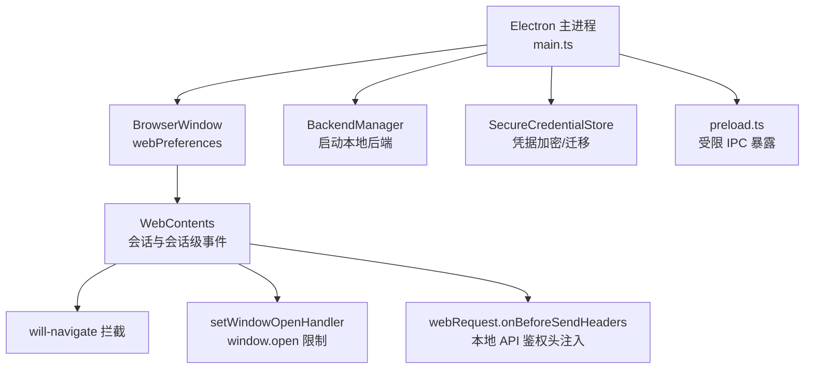
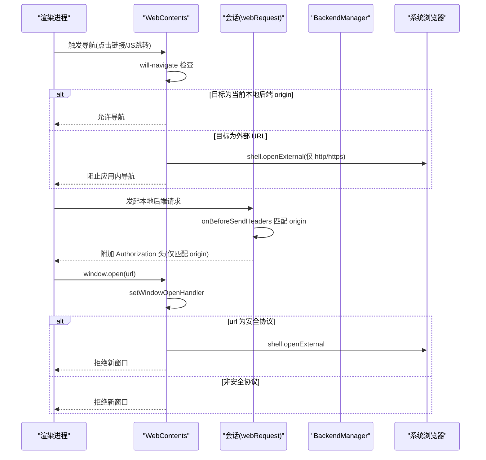
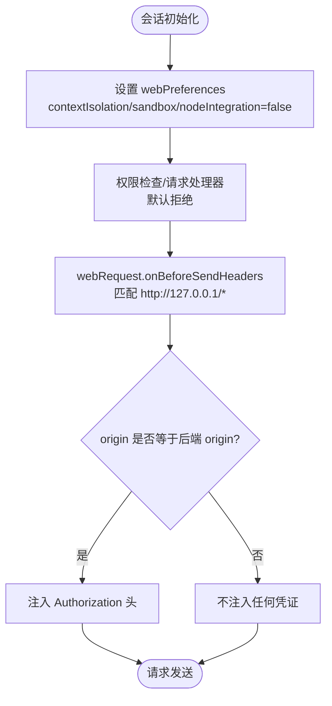
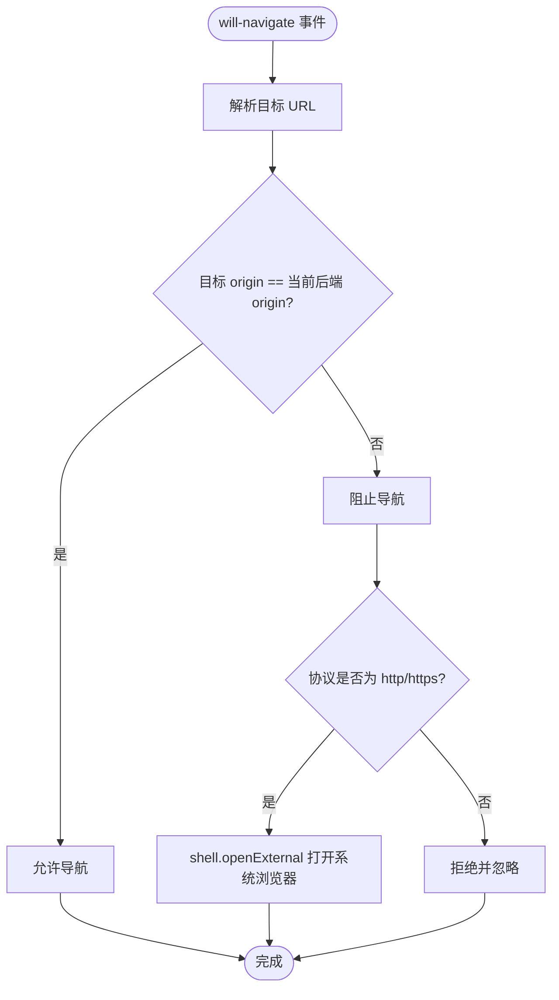
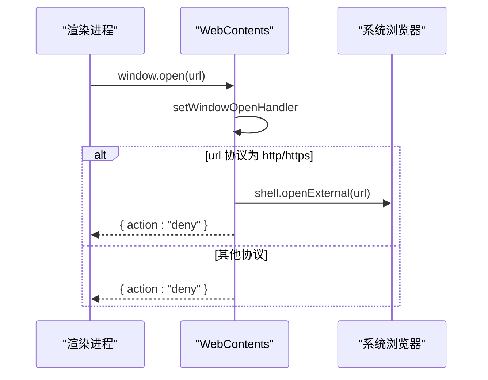
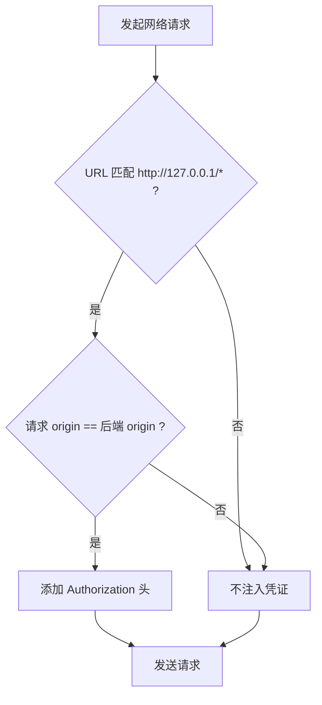
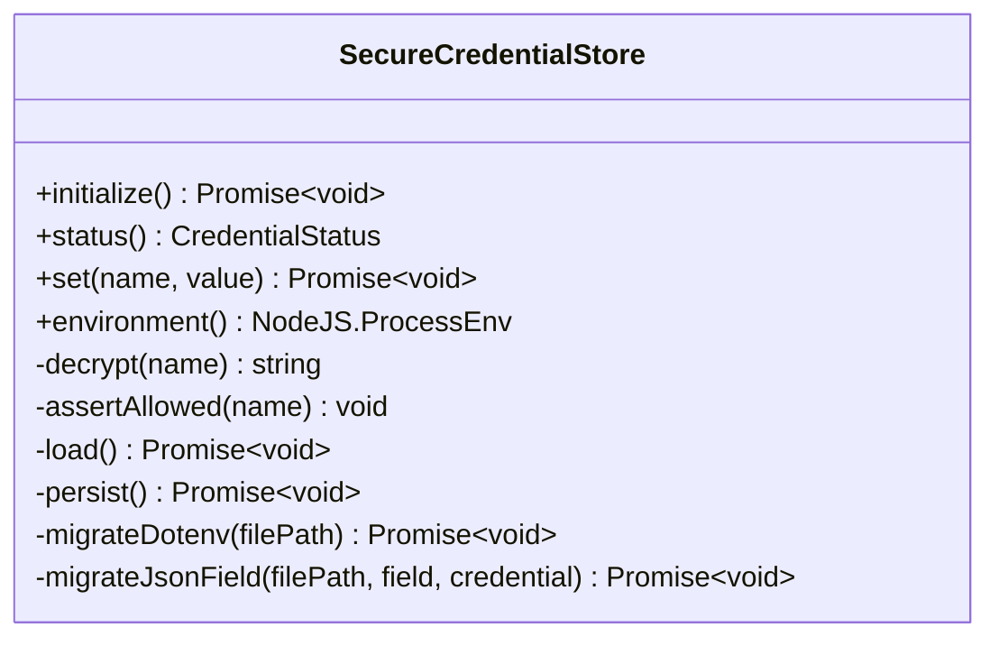
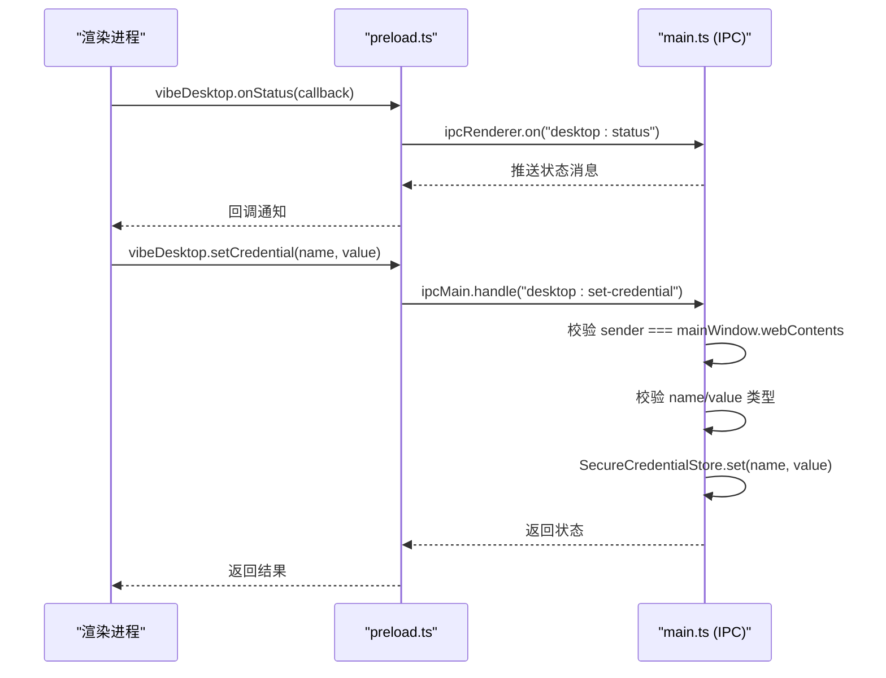
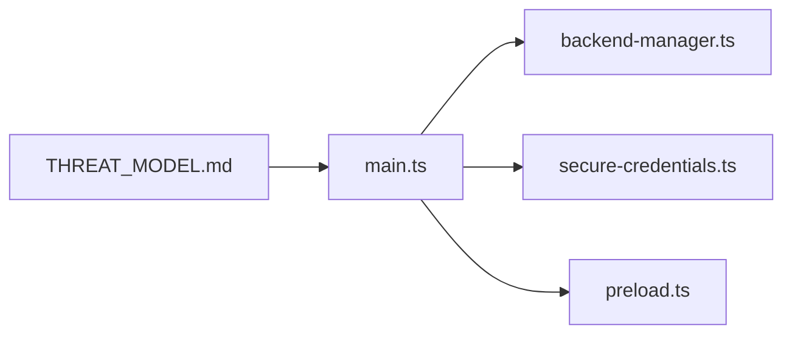

# URL 访问控制

<cite>
**本文引用的文件**
- [main.ts](file://desktop/electron/src/main.ts)
- [preload.ts](file://desktop/electron/src/preload.ts)
- [backend-manager.ts](file://desktop/electron/src/backend-manager.ts)
- [secure-credentials.ts](file://desktop/electron/src/secure-credentials.ts)
- [THREAT_MODEL.md](file://desktop/electron/THREAT_MODEL.md)
</cite>

## 目录
1. [简介](#简介)
2. [项目结构](#项目结构)
3. [核心组件](#核心组件)
4. [架构总览](#架构总览)
5. [详细组件分析](#详细组件分析)
6. [依赖关系分析](#依赖关系分析)
7. [性能考虑](#性能考虑)
8. [故障排查指南](#故障排查指南)
9. [结论](#结论)
10. [附录](#附录)

## 简介
本技术文档聚焦于 Electron 桌面端的 URL 访问控制，围绕 WebContents 生命周期、导航拦截、外部链接安全策略、新窗口创建限制以及本地后端 API 的安全注入进行系统化说明。目标是帮助需要处理用户输入链接的桌面应用开发者构建安全的 URL 访问边界，防止恶意链接劫持与敏感信息泄露。

## 项目结构
本项目在 desktop/electron 目录下实现 Electron 主进程、预加载脚本、后端进程管理与凭据安全存储等关键能力。URL 访问控制的核心逻辑集中在主进程的 BrowserWindow 初始化与会话配置中，并通过 preload 暴露受限的 IPC 接口给渲染进程使用。

图示来源
- [main.ts:65-117](file://desktop/electron/src/main.ts#L65-L117)
- [backend-manager.ts:63-146](file://desktop/electron/src/backend-manager.ts#L63-L146)
- [secure-credentials.ts:68-123](file://desktop/electron/src/secure-credentials.ts#L68-L123)
- [preload.ts:1-18](file://desktop/electron/src/preload.ts#L1-L18)

章节来源
- [main.ts:65-117](file://desktop/electron/src/main.ts#L65-L117)
- [backend-manager.ts:63-146](file://desktop/electron/src/backend-manager.ts#L63-L146)
- [secure-credentials.ts:68-123](file://desktop/electron/src/secure-credentials.ts#L68-L123)
- [preload.ts:1-18](file://desktop/electron/src/preload.ts#L1-L18)

## 核心组件
- WebContents 生命周期与会话配置：通过 BrowserWindow.webPreferences 启用 contextIsolation、nodeIntegration=false、sandbox=true，并使用独立 partition 隔离渲染器网络状态。
- 导航拦截：监听 will-navigate，仅允许当前本地后端 origin 的导航；其他导航被阻止并尝试以系统浏览器打开安全的外部链接。
- 新窗口权限控制：使用 setWindowOpenHandler 拒绝所有 window.open 调用，若目标为安全协议则转由系统浏览器打开。
- 本地 API 安全注入：通过 webRequest.onBeforeSendHeaders 对匹配到本地后端 origin 的请求自动附加 Authorization 头，避免跨域或远程请求误带凭证。
- 凭据安全存储：SecureCredentialStore 提供受支持的凭据键白名单、加密存储与迁移能力，确保敏感值不泄露至渲染器。

章节来源
- [main.ts:76-98](file://desktop/electron/src/main.ts#L76-L98)
- [main.ts:107-116](file://desktop/electron/src/main.ts#L107-L116)
- [main.ts:257-272](file://desktop/electron/src/main.ts#L257-L272)
- [secure-credentials.ts:12-44](file://desktop/electron/src/secure-credentials.ts#L12-L44)
- [secure-credentials.ts:105-123](file://desktop/electron/src/secure-credentials.ts#L105-L123)

## 架构总览
下图展示了从页面导航到新窗口创建再到本地 API 调用的整体流程与安全边界。

图示来源
- [main.ts:88-98](file://desktop/electron/src/main.ts#L88-L98)
- [main.ts:107-116](file://desktop/electron/src/main.ts#L107-L116)
- [main.ts:257-272](file://desktop/electron/src/main.ts#L257-L272)
- [backend-manager.ts:63-146](file://desktop/electron/src/backend-manager.ts#L63-L146)

## 详细组件分析

### WebContents 生命周期与会话安全
- 启用严格沙箱：contextIsolation=true、nodeIntegration=false、sandbox=true，禁用开发工具（打包后），使用独立 partition 隔离缓存与 Cookie。
- 权限默认拒绝：通过 setPermissionCheckHandler 和 setPermissionRequestHandler 拒绝所有浏览器权限请求，降低攻击面。
- 本地 API 请求头注入：仅当请求 origin 与当前后端 origin 完全一致时，才注入 Authorization 头，避免将凭证发送到不可信站点。

图示来源
- [main.ts:76-98](file://desktop/electron/src/main.ts#L76-L98)

章节来源
- [main.ts:76-98](file://desktop/electron/src/main.ts#L76-L98)

### 导航拦截机制（will-navigate）
- 仅允许在当前本地后端 origin 内的导航；其他导航将被阻止。
- 对于外部 URL，若协议为 http 或 https，则通过系统浏览器打开，避免在应用内执行未知内容。
- 该策略有效防止恶意链接劫持与应用内资源泄露。

图示来源
- [main.ts:111-116](file://desktop/electron/src/main.ts#L111-L116)
- [main.ts:257-272](file://desktop/electron/src/main.ts#L257-L272)

章节来源
- [main.ts:111-116](file://desktop/electron/src/main.ts#L111-L116)
- [main.ts:257-272](file://desktop/electron/src/main.ts#L257-L272)

### 新窗口创建权限控制（window.open）
- 使用 setWindowOpenHandler 统一拦截所有 window.open 调用。
- 仅允许安全协议（http/https）的外部链接通过系统浏览器打开；其余一律拒绝，避免在应用内创建不受控的新窗口。

图示来源
- [main.ts:107-110](file://desktop/electron/src/main.ts#L107-L110)
- [main.ts:257-272](file://desktop/electron/src/main.ts#L257-L272)

章节来源
- [main.ts:107-110](file://desktop/electron/src/main.ts#L107-L110)
- [main.ts:257-272](file://desktop/electron/src/main.ts#L257-L272)

### 本地后端 API 安全注入与混合内容防护
- 仅对匹配到本地后端 origin 的请求注入 Authorization 头，避免向任意站点泄露凭证。
- 通过独立 partition 隔离渲染器网络状态，减少跨站数据污染风险。
- 未显式实现混合内容警告；建议结合前端策略提示不安全资源加载。

图示来源
- [main.ts:88-98](file://desktop/electron/src/main.ts#L88-L98)

章节来源
- [main.ts:88-98](file://desktop/electron/src/main.ts#L88-L98)

### 凭据安全存储与注入
- SecureCredentialStore 维护受支持的凭据键白名单，仅允许写入/读取这些键。
- 凭据值通过 safeStorage 加密存储，仅在注入到后端子进程环境时解密，不会返回给渲染器。
- 支持从 .env 与 QVeris JSON 迁移到加密存储，并在迁移后移除明文字段。

图示来源
- [secure-credentials.ts:68-123](file://desktop/electron/src/secure-credentials.ts#L68-L123)
- [secure-credentials.ts:139-219](file://desktop/electron/src/secure-credentials.ts#L139-L219)

章节来源
- [secure-credentials.ts:12-44](file://desktop/electron/src/secure-credentials.ts#L12-L44)
- [secure-credentials.ts:68-123](file://desktop/electron/src/secure-credentials.ts#L68-L123)
- [secure-credentials.ts:139-219](file://desktop/electron/src/secure-credentials.ts#L139-L219)

### 预加载脚本与受限 IPC
- preload 通过 contextBridge 暴露最小化的 API：状态订阅、错误订阅、重试、打开日志、重启后端、凭据状态查询与设置。
- 所有 IPC 调用在主进程中校验发送者为主窗口 WebContents，防止伪造消息。

图示来源
- [preload.ts:1-18](file://desktop/electron/src/preload.ts#L1-L18)
- [main.ts:119-146](file://desktop/electron/src/main.ts#L119-L146)
- [main.ts:240-247](file://desktop/electron/src/main.ts#L240-L247)

章节来源
- [preload.ts:1-18](file://desktop/electron/src/preload.ts#L1-L18)
- [main.ts:119-146](file://desktop/electron/src/main.ts#L119-L146)
- [main.ts:240-247](file://desktop/electron/src/main.ts#L240-L247)

## 依赖关系分析
- main.ts 依赖 BackendManager 启动本地后端，并通过 webRequest 注入鉴权头。
- main.ts 依赖 SecureCredentialStore 管理凭据，确保敏感值不泄露。
- preload.ts 依赖 ipcRenderer 与 contextBridge 暴露受限 API。
- THREAT_MODEL.md 描述了信任边界与控制措施，包括渲染器限制、新窗口拒绝、导航限制与本地 API 认证。

图示来源
- [main.ts:65-117](file://desktop/electron/src/main.ts#L65-L117)
- [backend-manager.ts:63-146](file://desktop/electron/src/backend-manager.ts#L63-L146)
- [secure-credentials.ts:68-123](file://desktop/electron/src/secure-credentials.ts#L68-L123)
- [preload.ts:1-18](file://desktop/electron/src/preload.ts#L1-L18)
- [THREAT_MODEL.md:60-88](file://desktop/electron/THREAT_MODEL.md#L60-L88)

章节来源
- [main.ts:65-117](file://desktop/electron/src/main.ts#L65-L117)
- [backend-manager.ts:63-146](file://desktop/electron/src/backend-manager.ts#L63-L146)
- [secure-credentials.ts:68-123](file://desktop/electron/src/secure-credentials.ts#L68-L123)
- [preload.ts:1-18](file://desktop/electron/src/preload.ts#L1-L18)
- [THREAT_MODEL.md:60-88](file://desktop/electron/THREAT_MODEL.md#L60-L88)

## 性能考虑
- 导航拦截在新窗口与 will-navigate 事件中执行，开销极小，主要成本在于 URL 解析与协议判断。
- webRequest.onBeforeSendHeaders 仅对匹配到的本地后端 origin 注入头部，避免全局过滤带来的额外开销。
- 独立 partition 隔离网络状态，有助于减少跨站数据污染与缓存冲突。

[本节为通用指导，无需特定文件引用]

## 故障排查指南
- 如果外部链接无法在系统浏览器中打开，检查 isSafeExternalUrl 的判断逻辑与协议白名单。
- 如果本地 API 请求未携带鉴权头，确认请求 origin 是否与当前后端 origin 完全一致。
- 如果凭据设置失败，检查 SecureCredentialStore 的键白名单与类型校验。
- 如果渲染器无法收到状态或错误消息，确认 preload 的 IPC 监听与主进程的消息发送路径。

章节来源
- [main.ts:107-116](file://desktop/electron/src/main.ts#L107-L116)
- [main.ts:88-98](file://desktop/electron/src/main.ts#L88-L98)
- [secure-credentials.ts:105-123](file://desktop/electron/src/secure-credentials.ts#L105-L123)
- [preload.ts:1-18](file://desktop/electron/src/preload.ts#L1-L18)

## 结论
本项目通过严格的 WebContents 生命周期管理、导航拦截、新窗口权限控制与本地 API 安全注入，构建了稳健的 URL 访问控制边界。结合凭据安全存储与受限 IPC，有效防止了恶意链接劫持与敏感信息泄露。建议在业务层进一步实现混合内容警告与更细粒度的域名白名单策略，以提升用户体验与安全性。

[本节为总结性内容，无需特定文件引用]

## 附录
- 参考威胁模型文档了解信任边界与控制措施的详细说明。
- 如需自定义协议处理，可在 isSafeExternalUrl 中扩展协议白名单，并结合系统协议注册机制实现。
- 跨域资源共享（CORS）应由后端服务配置，前端可通过安全策略提示混合内容风险。

章节来源
- [THREAT_MODEL.md:60-88](file://desktop/electron/THREAT_MODEL.md#L60-L88)