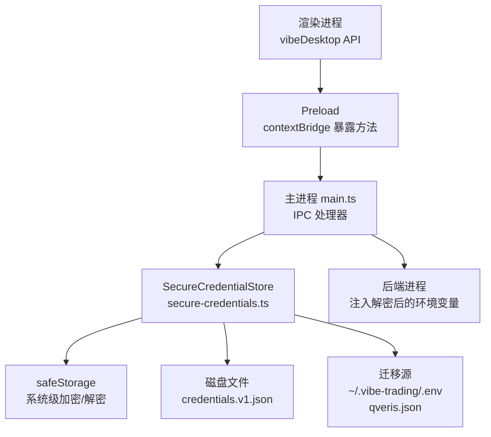
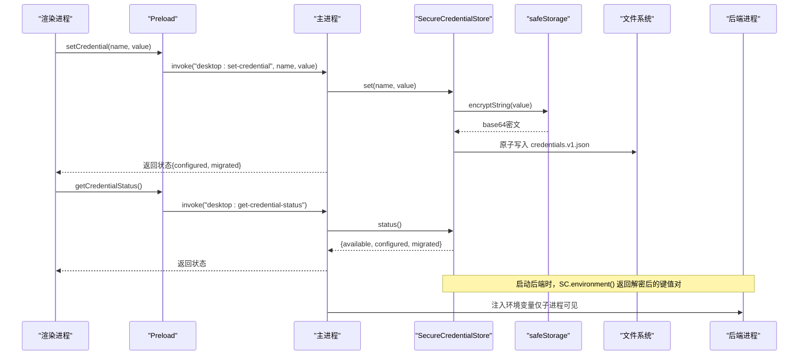
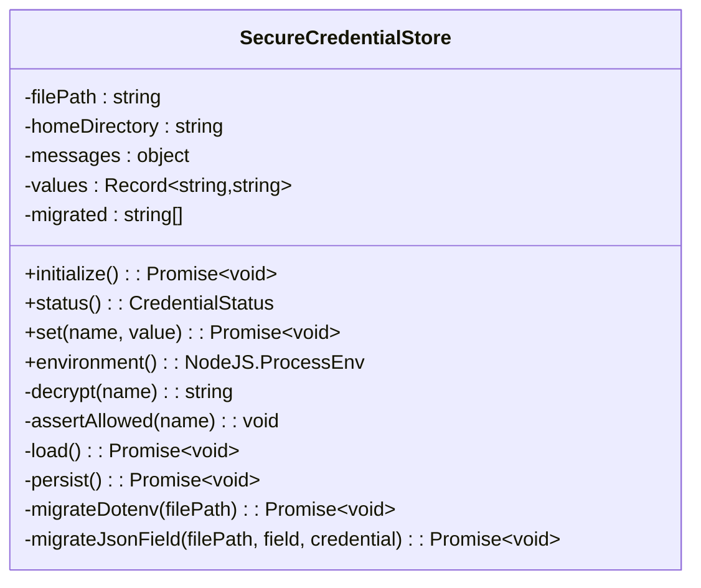
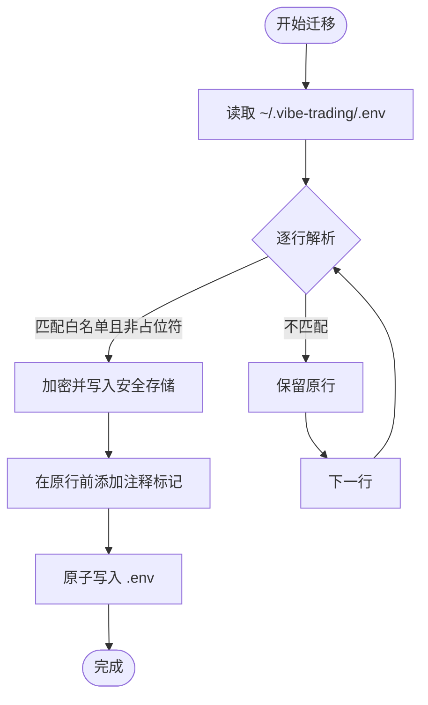
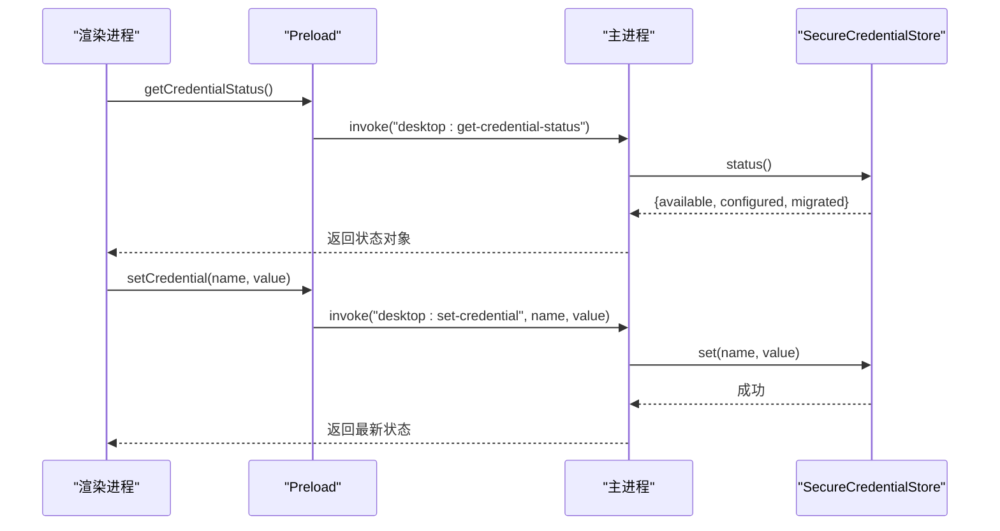
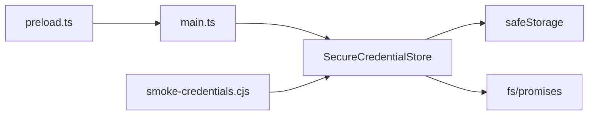

# 凭据存储机制

<cite>
**本文引用的文件**
- [secure-credentials.ts](file://desktop/electron/src/secure-credentials.ts)
- [main.ts](file://desktop/electron/src/main.ts)
- [preload.ts](file://desktop/electron/src/preload.ts)
- [smoke-credentials.cjs](file://desktop/electron/scripts/smoke-credentials.cjs)
- [THREAT_MODEL.md](file://desktop/electron/THREAT_MODEL.md)
- [README.md](file://desktop/electron/README.md)
- [desktop.d.ts](file://frontend/src/desktop.d.ts)
</cite>

## 目录
1. [简介](#简介)
2. [项目结构](#项目结构)
3. [核心组件](#核心组件)
4. [架构总览](#架构总览)
5. [详细组件分析](#详细组件分析)
6. [依赖关系分析](#依赖关系分析)
7. [性能与安全考量](#性能与安全考量)
8. [故障排查指南](#故障排查指南)
9. [结论](#结论)
10. [附录：使用示例与最佳实践](#附录使用示例与最佳实践)

## 简介
本技术文档聚焦于 Electron 桌面端的凭据存储机制，围绕 SecureCredentialStore 类的设计模式、实现原理与安全策略展开。该机制基于 Electron 的 safeStorage 提供系统级加密存储，支持对一组受信任的凭据键（白名单）进行加密写入与解密读取；同时提供从 .env 与 JSON 配置文件的自动迁移能力，确保敏感信息以密文形式持久化，并在启动后端进程时安全注入环境变量。文档还涵盖凭据文件版本控制、原子写入、错误处理、状态查询以及前端通过 IPC 调用主进程的完整流程，为需要处理敏感数据的桌面应用开发者提供可操作的指导。

## 项目结构
Electron 桌面端的安全凭据管理由以下关键部分组成：
- 主进程：负责初始化 SecureCredentialStore、注册 IPC 接口、将解密后的凭据注入后端进程环境。
- 渲染进程：通过 preload 暴露受限 API，允许设置或查询凭据状态，但不直接访问明文凭据。
- 持久化层：使用安全的 JSON 文件存储 Base64 编码的密文，并维护版本字段用于未来扩展。
- 迁移层：在首次初始化时扫描用户目录中的 .env 与特定 JSON 配置文件，将受信任的凭据迁移到安全存储，并清理明文字段。
- 测试脚本：通过隔离临时目录验证迁移、持久化、明文移除、白名单校验、替换与清空等场景。

图表来源
- [main.ts:119-145](file://desktop/electron/src/main.ts#L119-L145)
- [preload.ts:1-17](file://desktop/electron/src/preload.ts#L1-L17)
- [secure-credentials.ts:68-219](file://desktop/electron/src/secure-credentials.ts#L68-L219)

章节来源
- [README.md:1-35](file://desktop/electron/README.md#L1-L35)
- [THREAT_MODEL.md:163-179](file://desktop/electron/THREAT_MODEL.md#L163-L179)

## 核心组件
- SecureCredentialStore：封装凭据的加载、持久化、加密/解密、白名单校验与迁移逻辑。
- 主进程 IPC：提供 getCredentialStatus 与 setCredential 两个只读/写接口，严格限制发送者并返回最小必要信息。
- Preload 桥接：向渲染进程暴露受限 API，禁止明文凭据回传。
- 迁移模块：一次性从 .env 与 qveris.json 迁移受信任凭据，并删除明文字段。
- 测试脚本：端到端验证迁移、持久化、明文移除、白名单、替换与清空行为。

章节来源
- [secure-credentials.ts:68-219](file://desktop/electron/src/secure-credentials.ts#L68-L219)
- [main.ts:119-145](file://desktop/electron/src/main.ts#L119-L145)
- [preload.ts:1-17](file://desktop/electron/src/preload.ts#L1-L17)
- [smoke-credentials.cjs:13-133](file://desktop/electron/scripts/smoke-credentials.cjs#L13-L133)

## 架构总览
下图展示了凭据从设置到注入后端的完整时序：

图表来源
- [main.ts:119-145](file://desktop/electron/src/main.ts#L119-L145)
- [secure-credentials.ts:84-123](file://desktop/electron/src/secure-credentials.ts#L84-L123)
- [preload.ts:1-17](file://desktop/electron/src/preload.ts#L1-L17)

## 详细组件分析

### SecureCredentialStore 设计与实现
- 设计要点
  - 白名单机制：仅允许 ENV_CREDENTIALS 集合中的键名被设置和读取，防止任意环境变量泄露或污染。
  - 加密存储：使用 safeStorage.encryptString 对值进行加密，并以 base64 字符串形式持久化到 JSON 文件。
  - 版本控制：文件包含 version 字段，当前为 1，便于未来格式演进。
  - 原子写入：先写入同目录临时文件再 rename，避免崩溃导致数据损坏。
  - 迁移策略：初始化时扫描 ~/.vibe-trading/.env 与 qveris.json，将受信任且非占位符的值迁移至安全存储，并注释或删除明文字段。
  - 错误处理：忽略 ENOENT 等“不存在”错误；非法键名抛出明确错误消息；解密失败返回空串以避免中断。

- 数据结构
  - 文件结构：{ version: 1, values: Record<string, string> }，values 中保存 base64 密文。
  - 内存状态：values 映射键到密文字符串；migrated 记录本次迁移的键名列表。

- 复杂度与性能
  - 读写操作均为 O(n) 级别（n 为已配置的凭据数量），通常很小。
  - 加密/解密调用系统 API，开销可控。
  - 原子写入保证一致性，代价是额外一次磁盘 I/O。

图表来源
- [secure-credentials.ts:68-219](file://desktop/electron/src/secure-credentials.ts#L68-L219)

章节来源
- [secure-credentials.ts:12-34](file://desktop/electron/src/secure-credentials.ts#L12-L34)
- [secure-credentials.ts:84-164](file://desktop/electron/src/secure-credentials.ts#L84-L164)
- [secure-credentials.ts:166-219](file://desktop/electron/src/secure-credentials.ts#L166-L219)

### 白名单与占位符过滤
- 白名单键集：包括多种 LLM、数据源与平台 API Key/Token，如 OPENAI_API_KEY、ANTHROPIC_API_KEY、TUSHARE_TOKEN、QVERIS_API_KEY 等。
- 占位符过滤：初始化迁移时跳过明显占位值（例如空串或模板占位符），避免误迁移无效密钥。

章节来源
- [secure-credentials.ts:12-44](file://desktop/electron/src/secure-credentials.ts#L12-L44)

### 凭据文件版本控制与迁移
- 版本字段：version 固定为 1，加载时校验版本与 values 类型，不匹配则拒绝加载。
- .env 迁移：解析每行 KEY=VALUE，若键在白名单且值非占位符，则加密存入安全存储，并在原文件中添加注释说明该键已由桌面安全存储管理。
- JSON 字段迁移：针对 qveris.json 的 api_key 字段，若存在有效值则迁移到 QVERIS_API_KEY，并从 JSON 中删除该字段。
- 原子更新：迁移完成后对 .env 与 JSON 进行原子写入，避免部分写入导致的损坏。

图表来源
- [secure-credentials.ts:166-196](file://desktop/electron/src/secure-credentials.ts#L166-L196)

章节来源
- [secure-credentials.ts:139-164](file://desktop/electron/src/secure-credentials.ts#L139-L164)
- [secure-credentials.ts:166-219](file://desktop/electron/src/secure-credentials.ts#L166-L219)

### 加密存储与解密过程
- 加密：safeStorage.encryptString(value) 生成系统级密文，再以 base64 字符串形式持久化。
- 解密：读取 base64 密文并调用 safeStorage.decryptString(Buffer.from(base64)) 还原明文；异常时返回空串，避免影响整体流程。
- 安全写入：使用临时文件 + rename 的方式写入，权限设置为 0o600，减少并发与崩溃风险。

章节来源
- [secure-credentials.ts:105-131](file://desktop/electron/src/secure-credentials.ts#L105-L131)
- [secure-credentials.ts:155-164](file://desktop/electron/src/secure-credentials.ts#L155-L164)

### IPC 集成与前后端交互
- Preload 暴露 API：getCredentialStatus、setCredential、onStatus、onError、restartBackend 等，限制渲染进程只能执行受控操作。
- 主进程 IPC：
  - desktop:get-credential-status：返回可用性与已配置键列表。
  - desktop:set-credential：校验参数类型与白名单，调用 store.set 并返回最新状态。
- 安全边界：仅允许来自主窗口的请求，拒绝其他来源；不向渲染进程返回明文凭据。

图表来源
- [preload.ts:1-17](file://desktop/electron/src/preload.ts#L1-L17)
- [main.ts:119-145](file://desktop/electron/src/main.ts#L119-L145)

章节来源
- [preload.ts:1-17](file://desktop/electron/src/preload.ts#L1-L17)
- [main.ts:119-145](file://desktop/electron/src/main.ts#L119-L145)
- [desktop.d.ts:1-21](file://frontend/src/desktop.d.ts#L1-L21)

### 端到端测试与验证
- smoke-credentials.cjs 使用隔离临时目录模拟用户环境，创建 .env 与 qveris.json，验证：
  - 迁移是否成功（键出现在 environment 输出）。
  - 状态是否正确（configured 与 migrated 列表）。
  - 持久化文件不包含明文。
  - .env 中原有明文被注释掉，JSON 中敏感字段被删除。
  - 重新加载后仍可正确解密。
  - 设置新值与清空值的行为符合预期。
  - 不支持的键名会抛出错误。

章节来源
- [smoke-credentials.cjs:13-133](file://desktop/electron/scripts/smoke-credentials.cjs#L13-L133)

## 依赖关系分析
- 外部依赖
  - Electron safeStorage：系统级加密/解密能力。
  - Node.js fs/promises：异步文件读写。
  - os/path：路径与用户目录解析。
- 内部依赖
  - main.ts：初始化 SecureCredentialStore、注册 IPC、注入后端环境变量。
  - preload.ts：暴露受限 API。
  - 测试脚本：独立运行，验证迁移与持久化。

图表来源
- [main.ts:119-145](file://desktop/electron/src/main.ts#L119-L145)
- [secure-credentials.ts:1-5](file://desktop/electron/src/secure-credentials.ts#L1-L5)
- [smoke-credentials.cjs:1-11](file://desktop/electron/scripts/smoke-credentials.cjs#L1-L11)

章节来源
- [secure-credentials.ts:1-5](file://desktop/electron/src/secure-credentials.ts#L1-L5)
- [main.ts:119-145](file://desktop/electron/src/main.ts#L119-L145)
- [smoke-credentials.cjs:1-11](file://desktop/electron/scripts/smoke-credentials.cjs#L1-L11)

## 性能与安全考量
- 性能
  - 小量凭据的读写与加密/解密开销极低。
  - 原子写入带来额外 I/O，但提升可靠性。
- 安全
  - 白名单限制可写入键名，降低误用风险。
  - 明文仅在内存中短暂出现，并通过 safeStorage 加密持久化。
  - 迁移后删除明文字段，减少残留风险。
  - IPC 严格校验发送者与参数类型，避免越权。
  - 威胁模型指出：safeStorage 保护当前用户会话下的静态数据，不防调试器或同等权限进程；迁移无法清除备份或历史日志中的明文。

章节来源
- [THREAT_MODEL.md:163-179](file://desktop/electron/THREAT_MODEL.md#L163-L179)

## 故障排查指南
- 加密不可用
  - 现象：初始化抛出“加密不可用”错误。
  - 原因：当前系统或用户会话未提供 safeStorage 能力。
  - 处理：检查操作系统与 Electron 环境；必要时提示用户升级或切换环境。
- 文件格式不支持
  - 现象：加载凭证文件时报错。
  - 原因：version 不为 1 或 values 结构不符合预期。
  - 处理：删除或修复 credentials.v1.json，让系统重建。
- 不受支持的键名
  - 现象：设置未知键名抛出错误。
  - 原因：不在 ENV_CREDENTIALS 白名单内。
  - 处理：确认键名是否在白名单；如需新增，请谨慎评估安全风险。
- 解密失败
  - 现象：读取某个键返回空串。
  - 原因：base64 解码或解密异常。
  - 处理：检查文件完整性；必要时重置该键。
- 迁移未生效
  - 现象：.env 或 JSON 中的密钥未被迁移。
  - 原因：键不在白名单或值为占位符。
  - 处理：检查键名与值；确保值非占位符后再尝试迁移。

章节来源
- [secure-credentials.ts:84-137](file://desktop/electron/src/secure-credentials.ts#L84-L137)
- [secure-credentials.ts:139-164](file://desktop/electron/src/secure-credentials.ts#L139-L164)
- [secure-credentials.ts:166-219](file://desktop/electron/src/secure-credentials.ts#L166-L219)

## 结论
SecureCredentialStore 通过白名单、系统级加密、原子写入与一次性迁移，构建了稳健的桌面端凭据管理机制。它在不暴露明文的前提下，将受信任的 API Key/Token 安全地注入后端进程环境，满足敏感数据处理需求。结合严格的 IPC 边界与完善的测试覆盖，该方案为桌面应用提供了可信赖的凭据管理能力。

## 附录：使用示例与最佳实践
- 初始化与状态检查
  - 在主进程启动时创建 SecureCredentialStore 并调用 initialize，随后通过 IPC 暴露 getCredentialStatus 供前端查询。
  - 参考路径：[main.ts:49-63](file://desktop/electron/src/main.ts#L49-L63)、[main.ts:133-136](file://desktop/electron/src/main.ts#L133-L136)
- 设置凭据
  - 前端调用 vibeDesktop.setCredential(name, value)，主进程校验白名单并持久化密文。
  - 参考路径：[preload.ts:14-16](file://desktop/electron/src/preload.ts#L14-L16)、[main.ts:137-145](file://desktop/electron/src/main.ts#L137-L145)
- 获取解密后的环境变量
  - 后端启动时，主进程通过 store.environment() 获取解密后的键值对并注入子进程环境。
  - 参考路径：[main.ts:177-178](file://desktop/electron/src/main.ts#L177-L178)、[secure-credentials.ts:116-123](file://desktop/electron/src/secure-credentials.ts#L116-L123)
- 迁移与清理
  - 首次运行会自动迁移 .env 与 qveris.json 中的受信任凭据，并删除明文字段。
  - 参考路径：[secure-credentials.ts:84-95](file://desktop/electron/src/secure-credentials.ts#L84-L95)、[secure-credentials.ts:166-219](file://desktop/electron/src/secure-credentials.ts#L166-L219)
- 验证与回归
  - 使用 smoke-credentials.cjs 进行端到端验证，确保迁移、持久化、明文移除、白名单、替换与清空均符合预期。
  - 参考路径：[smoke-credentials.cjs:13-133](file://desktop/electron/scripts/smoke-credentials.cjs#L13-L133)

章节来源
- [main.ts:49-63](file://desktop/electron/src/main.ts#L49-L63)
- [main.ts:133-145](file://desktop/electron/src/main.ts#L133-L145)
- [main.ts:177-178](file://desktop/electron/src/main.ts#L177-L178)
- [preload.ts:14-16](file://desktop/electron/src/preload.ts#L14-L16)
- [secure-credentials.ts:84-95](file://desktop/electron/src/secure-credentials.ts#L84-L95)
- [secure-credentials.ts:116-123](file://desktop/electron/src/secure-credentials.ts#L116-L123)
- [secure-credentials.ts:166-219](file://desktop/electron/src/secure-credentials.ts#L166-L219)
- [smoke-credentials.cjs:13-133](file://desktop/electron/scripts/smoke-credentials.cjs#L13-L133)