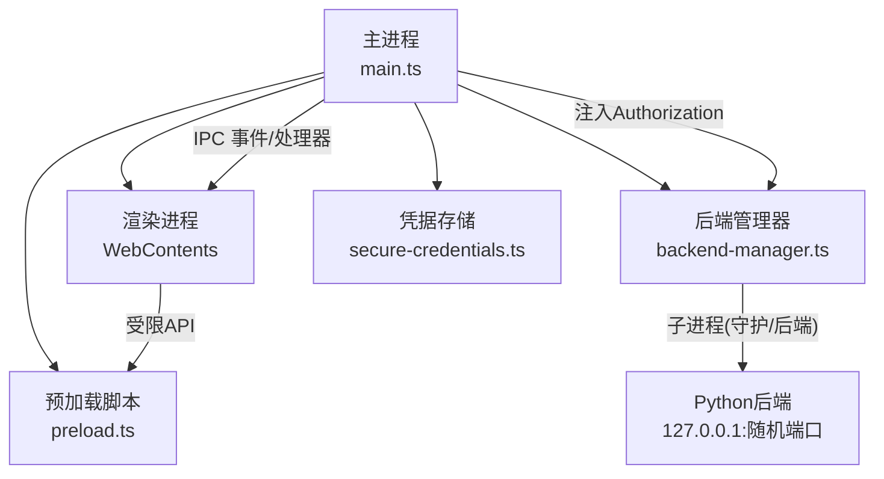
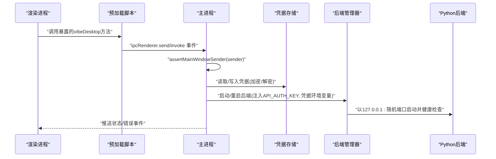
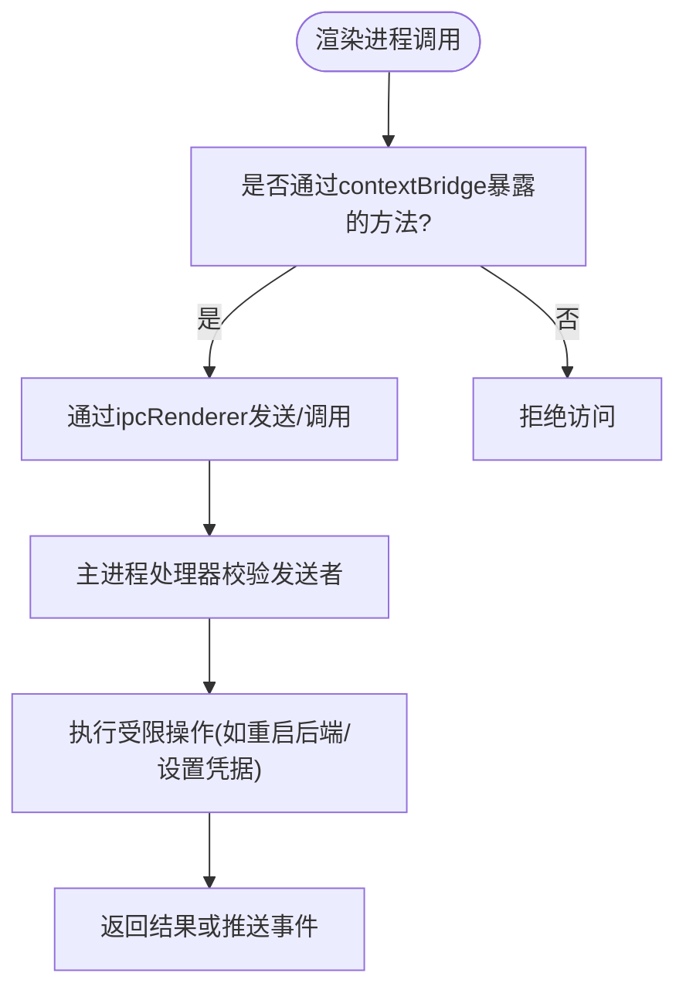
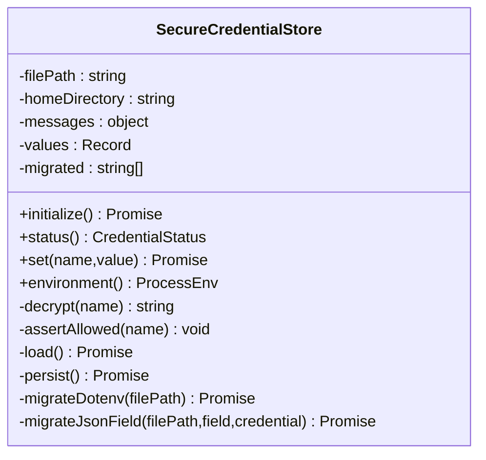
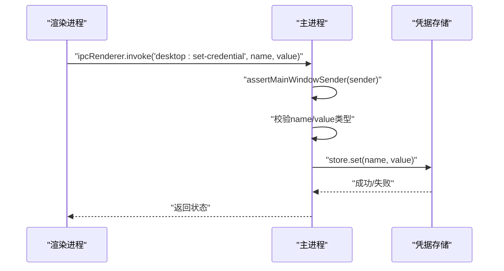
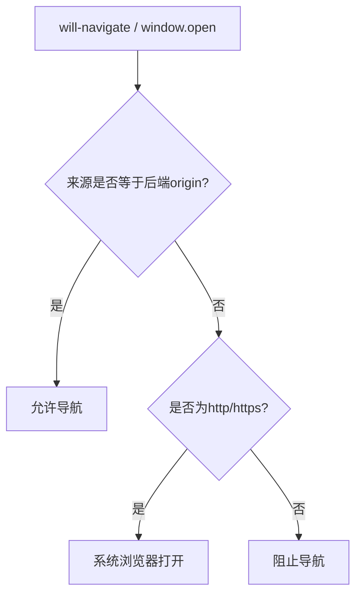
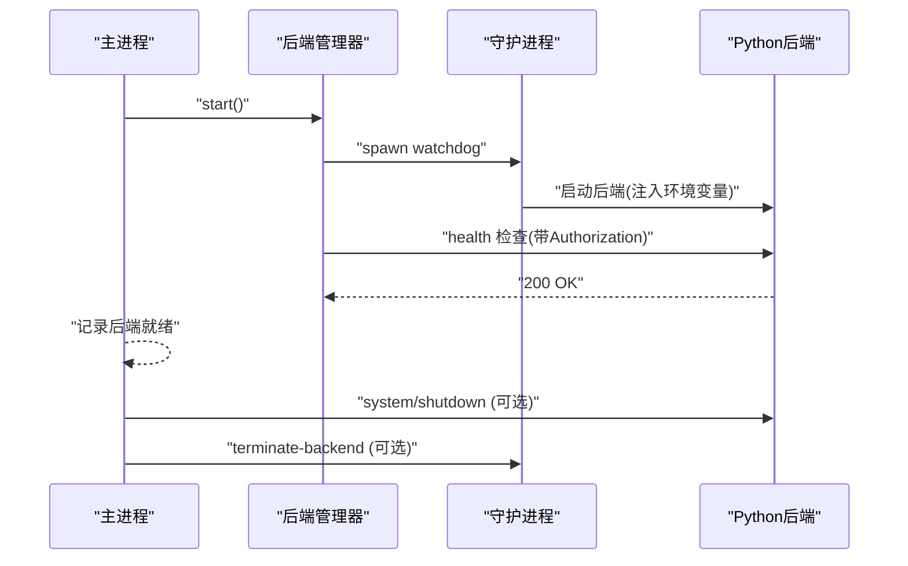
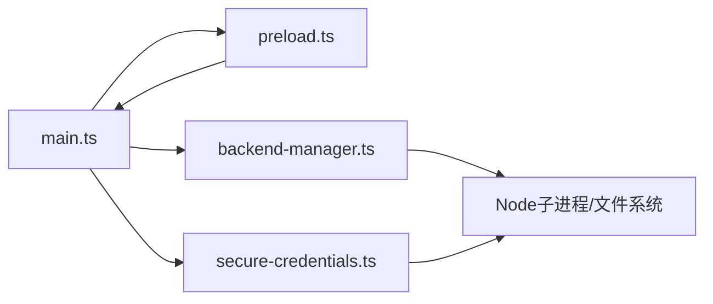

# 安全架构设计

<cite>
**本文引用的文件**
- [main.ts](file://desktop/electron/src/main.ts)
- [preload.ts](file://desktop/electron/src/preload.ts)
- [secure-credentials.ts](file://desktop/electron/src/secure-credentials.ts)
- [backend-manager.ts](file://desktop/electron/src/backend-manager.ts)
- [package.json](file://desktop/electron/package.json)
- [THREAT_MODEL.md](file://desktop/electron/THREAT_MODEL.md)
</cite>

## 目录
1. [简介](#简介)
2. [项目结构](#项目结构)
3. [核心组件](#核心组件)
4. [架构总览](#架构总览)
5. [详细组件分析](#详细组件分析)
6. [依赖关系分析](#依赖关系分析)
7. [性能与安全权衡](#性能与安全权衡)
8. [故障排查指南](#故障排查指南)
9. [结论](#结论)
10. [附录：最佳实践与示例路径](#附录最佳实践与示例路径)

## 简介
本技术文档聚焦于 Electron 桌面端的安全架构，围绕以下目标展开：
- 上下文隔离（contextIsolation）的实现原理与安全边界
- 预加载脚本的作用与受限环境下的 API 访问控制
- SecureCredentialStore 类的设计模式：凭据存储、加密机制、环境变量注入
- IPC 通信的安全验证：发送者校验、权限检查、请求过滤
- 外部 URL 访问的安全控制：协议白名单、来源验证、导航拦截
- 实际代码示例路径，覆盖敏感数据保护、输入验证与异常处理

该架构通过最小暴露面、严格来源校验、受控的本地回环通信以及系统级凭据加密，构建了一个面向桌面应用的安全基线。

## 项目结构
Electron 桌面端由主进程、渲染进程、预加载脚本和后端管理器组成，关键文件职责如下：
- main.ts：主进程入口，窗口创建、IPC 注册、URL 导航拦截、会话权限策略、后端启动与生命周期管理
- preload.ts：预加载脚本，仅暴露最小化 API 到渲染进程
- secure-credentials.ts：凭据安全存储，基于 safeStorage 加密，支持迁移与环境变量注入
- backend-manager.ts：后端进程发现、启动、健康检查、优雅关闭与强制终止
- package.json：打包配置、语言资源、asar 等
- THREAT_MODEL.md：威胁模型与控制措施说明

图表来源
- [main.ts:65-117](file://desktop/electron/src/main.ts#L65-L117)
- [preload.ts:1-18](file://desktop/electron/src/preload.ts#L1-L18)
- [backend-manager.ts:63-146](file://desktop/electron/src/backend-manager.ts#L63-L146)
- [secure-credentials.ts:68-123](file://desktop/electron/src/secure-credentials.ts#L68-L123)

章节来源
- [main.ts:1-285](file://desktop/electron/src/main.ts#L1-L285)
- [package.json:1-86](file://desktop/electron/package.json#L1-L86)

## 核心组件
- 上下文隔离与沙箱：启用 contextIsolation、sandbox，禁用 nodeIntegration；渲染进程无 Node 能力，仅通过预加载暴露的最小 API 与主进程交互
- 预加载脚本：使用 contextBridge.exposeInMainWorld 暴露有限方法（状态订阅、错误订阅、重试、打开日志、重启后端、凭据状态与设置），不暴露敏感值
- 凭据存储：SecureCredentialStore 使用 safeStorage 加密存储，支持 .env 与 JSON 字段迁移，输出仅包含允许的环境变量名与解密后的值，供后端子进程注入
- IPC 安全：所有 IPC 处理器均进行发送者校验（assertMainWindowSender），并对参数类型进行严格校验；权限检查默认拒绝
- 外部 URL 控制：新窗口打开被拒绝，仅允许 http/https 在系统浏览器中打开；页面内导航限制为当前后端来源

章节来源
- [main.ts:65-117](file://desktop/electron/src/main.ts#L65-L117)
- [preload.ts:1-18](file://desktop/electron/src/preload.ts#L1-L18)
- [secure-credentials.ts:68-123](file://desktop/electron/src/secure-credentials.ts#L68-L123)
- [THREAT_MODEL.md:76-88](file://desktop/electron/THREAT_MODEL.md#L76-L88)

## 架构总览
下图展示了从渲染进程到主进程再到后端进程的完整调用链与安全边界：

图表来源
- [preload.ts:3-17](file://desktop/electron/src/preload.ts#L3-L17)
- [main.ts:119-146](file://desktop/electron/src/main.ts#L119-L146)
- [backend-manager.ts:63-146](file://desktop/electron/src/backend-manager.ts#L63-L146)
- [secure-credentials.ts:105-123](file://desktop/electron/src/secure-credentials.ts#L105-L123)

## 详细组件分析

### 上下文隔离与预加载脚本
- 上下文隔离与沙箱：BrowserWindow 配置启用 contextIsolation、sandbox，禁用 nodeIntegration，确保渲染进程无法直接访问 Node API
- 预加载脚本仅暴露最小 API：
  - onStatus/onError：订阅主进程事件
  - retry/openLogs/restartBackend：触发主进程操作
  - getCredentialStatus/setCredential：查询凭据状态与设置允许列表中的凭据
- 安全边界：渲染进程不能读取凭据明文，也不能执行任意 Node 代码

图表来源
- [preload.ts:3-17](file://desktop/electron/src/preload.ts#L3-L17)
- [main.ts:119-146](file://desktop/electron/src/main.ts#L119-L146)

章节来源
- [preload.ts:1-18](file://desktop/electron/src/preload.ts#L1-L18)
- [main.ts:65-117](file://desktop/electron/src/main.ts#L65-L117)
- [THREAT_MODEL.md:76-88](file://desktop/electron/THREAT_MODEL.md#L76-L88)

### SecureCredentialStore 设计与实现
- 设计模式：单例式初始化，提供 status()/set()/environment() 接口；内部维护 values 与 migrated 列表
- 加密机制：使用 safeStorage.encryptString/decryptString，磁盘仅保存 Base64 密文
- 环境变量注入：environment() 返回仅包含允许键名的明文映射，供后端子进程注入
- 迁移逻辑：
  - 从 ~/.vibe-trading/.env 迁移受信任键到安全存储，并在原文件中注释掉已迁移项
  - 从 QVeris 配置文件迁移 api_key 到 QVERIS_API_KEY
- 持久化：原子写入（临时文件 + rename），权限 0o600

图表来源
- [secure-credentials.ts:68-220](file://desktop/electron/src/secure-credentials.ts#L68-L220)

章节来源
- [secure-credentials.ts:68-220](file://desktop/electron/src/secure-credentials.ts#L68-L220)
- [THREAT_MODEL.md:163-179](file://desktop/electron/THREAT_MODEL.md#L163-L179)

### IPC 通信安全验证
- 发送者验证：每个 IPC 处理器调用 assertMainWindowSender(event.sender)，确保来自主窗口 WebContents
- 权限检查：默认拒绝所有权限请求（setPermissionCheckHandler/setPermissionRequestHandler 返回 false）
- 请求过滤：对本地回环请求添加 Authorization 头，仅当请求来源与后端 origin 完全匹配时注入

图表来源
- [main.ts:119-146](file://desktop/electron/src/main.ts#L119-L146)
- [secure-credentials.ts:105-114](file://desktop/electron/src/secure-credentials.ts#L105-L114)

章节来源
- [main.ts:119-146](file://desktop/electron/src/main.ts#L119-L146)
- [main.ts:85-98](file://desktop/electron/src/main.ts#L85-L98)

### 外部 URL 访问安全控制
- 新窗口打开：setWindowOpenHandler 统一拒绝，仅允许 isSafeExternalUrl 的 http/https 链接在系统浏览器中打开
- 页面内导航：will-navigate 拦截，仅允许导航到当前后端 origin；否则阻止并尝试在系统浏览器中打开
- 协议白名单：isSafeExternalUrl 仅允许 http/https

图表来源
- [main.ts:107-116](file://desktop/electron/src/main.ts#L107-L116)
- [main.ts:257-264](file://desktop/electron/src/main.ts#L257-L264)

章节来源
- [main.ts:107-116](file://desktop/electron/src/main.ts#L107-L116)
- [THREAT_MODEL.md:76-88](file://desktop/electron/THREAT_MODEL.md#L76-L88)

### 后端进程与认证注入
- 后端发现：优先环境变量覆盖，其次打包路径、标记源码根、PATH 查找
- 启动参数：固定 host=127.0.0.1，随机端口；注入 API_AUTH_KEY 与 VIBE_TRADING_DESKTOP_SECURE_CREDENTIALS
- 健康检查：轮询 health 路由，超时抛出错误
- 优雅关闭：先 POST system/shutdown，再请求守护进程终止，最后 taskkill 树终止

图表来源
- [backend-manager.ts:63-146](file://desktop/electron/src/backend-manager.ts#L63-L146)
- [backend-manager.ts:148-187](file://desktop/electron/src/backend-manager.ts#L148-L187)
- [backend-manager.ts:261-286](file://desktop/electron/src/backend-manager.ts#L261-L286)

章节来源
- [backend-manager.ts:63-146](file://desktop/electron/src/backend-manager.ts#L63-L146)
- [backend-manager.ts:148-187](file://desktop/electron/src/backend-manager.ts#L148-L187)
- [backend-manager.ts:261-286](file://desktop/electron/src/backend-manager.ts#L261-L286)

## 依赖关系分析
- 主进程依赖：
  - 预加载脚本：通过 BrowserWindow.webPreferences.preload 注入
  - 凭据存储：SecureCredentialStore 提供 environment() 注入到后端子进程
  - 后端管理器：负责后端发现、启动、健康检查与生命周期
- 渲染进程依赖：
  - 仅通过 contextBridge 暴露的 API 与主进程交互
- 外部依赖：
  - Electron 框架（safeStorage、ipcMain/ipcRenderer、BrowserWindow）
  - Node.js 文件系统与子进程模块

图表来源
- [main.ts:65-117](file://desktop/electron/src/main.ts#L65-L117)
- [backend-manager.ts:1-15](file://desktop/electron/src/backend-manager.ts#L1-L15)
- [secure-credentials.ts:1-5](file://desktop/electron/src/secure-credentials.ts#L1-L5)

章节来源
- [package.json:1-86](file://desktop/electron/package.json#L1-L86)
- [main.ts:1-285](file://desktop/electron/src/main.ts#L1-L285)

## 性能与安全权衡
- 上下文隔离与沙箱带来一定开销，但显著降低攻击面
- 凭据加密与迁移增加 I/O 成本，但保障静态数据安全
- 健康检查轮询存在延迟，采用超时与最近日志尾部提升可观测性
- 原子写入避免部分写入导致的损坏，代价是额外磁盘操作

[本节为通用指导，无需特定文件引用]

## 故障排查指南
- 启动失败：
  - 检查后端是否找到并健康：查看健康检查与超时错误信息
  - 确认环境变量 API_AUTH_KEY 与凭据注入是否正确
- 凭据问题：
  - 检查 safeStorage 是否可用（Windows 用户会话）
  - 确认 .env 与 QVeris 配置迁移是否成功
- 导航拦截：
  - 确认 will-navigate 与 setWindowOpenHandler 行为是否符合预期
- 进程生命周期：
  - 观察守护进程消息与退出码，必要时使用 taskkill 清理残留进程

章节来源
- [backend-manager.ts:261-286](file://desktop/electron/src/backend-manager.ts#L261-L286)
- [secure-credentials.ts:84-95](file://desktop/electron/src/secure-credentials.ts#L84-L95)
- [main.ts:107-116](file://desktop/electron/src/main.ts#L107-L116)

## 结论
该 Electron 安全架构通过严格的上下文隔离、最小化的预加载 API、系统级凭据加密、来源校验与回环认证，构建了稳健的安全边界。尽管渲染进程仍可调用已认证的本地 API，但通过限制暴露面与强化来源校验，有效降低了风险。建议在生产环境中持续监控健康检查与凭据迁移流程，并确保开发环境与打包环境的差异得到妥善处理。

[本节为总结，无需特定文件引用]

## 附录：最佳实践与示例路径
- 敏感数据保护：
  - 使用 safeStorage 加密凭据，避免明文落盘
  - 仅将解密后的值注入后端子进程环境变量
  - 参考路径：[secure-credentials.ts:105-123](file://desktop/electron/src/secure-credentials.ts#L105-L123)
- 输入验证：
  - 对 IPC 参数进行类型校验，拒绝非法输入
  - 参考路径：[main.ts:137-145](file://desktop/electron/src/main.ts#L137-L145)
- 异常处理：
  - 捕获 safeStorage 解密异常，返回空值或降级处理
  - 健康检查超时与早期退出报告
  - 参考路径：[secure-credentials.ts:125-131](file://desktop/electron/src/secure-credentials.ts#L125-L131)、[backend-manager.ts:261-286](file://desktop/electron/src/backend-manager.ts#L261-L286)
- 外部 URL 安全：
  - 仅允许 http/https 在系统浏览器中打开
  - 页面内导航限制为当前后端来源
  - 参考路径：[main.ts:107-116](file://desktop/electron/src/main.ts#L107-L116)、[main.ts:257-264](file://desktop/electron/src/main.ts#L257-L264)
- 预加载最小暴露：
  - 仅暴露必要 API，不返回敏感值
  - 参考路径：[preload.ts:3-17](file://desktop/electron/src/preload.ts#L3-L17)

章节来源
- [secure-credentials.ts:105-131](file://desktop/electron/src/secure-credentials.ts#L105-L131)
- [main.ts:107-145](file://desktop/electron/src/main.ts#L107-L145)
- [preload.ts:3-17](file://desktop/electron/src/preload.ts#L3-L17)