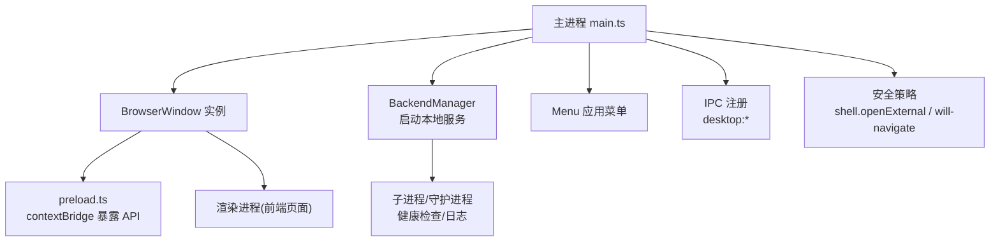
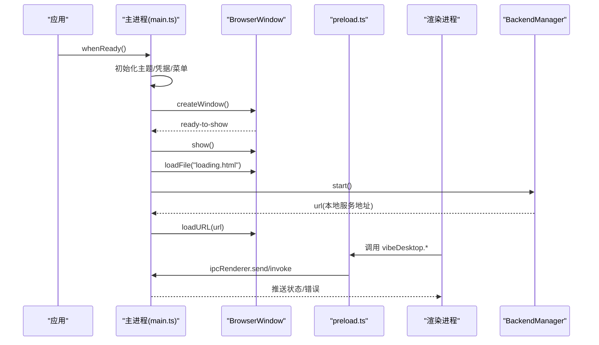
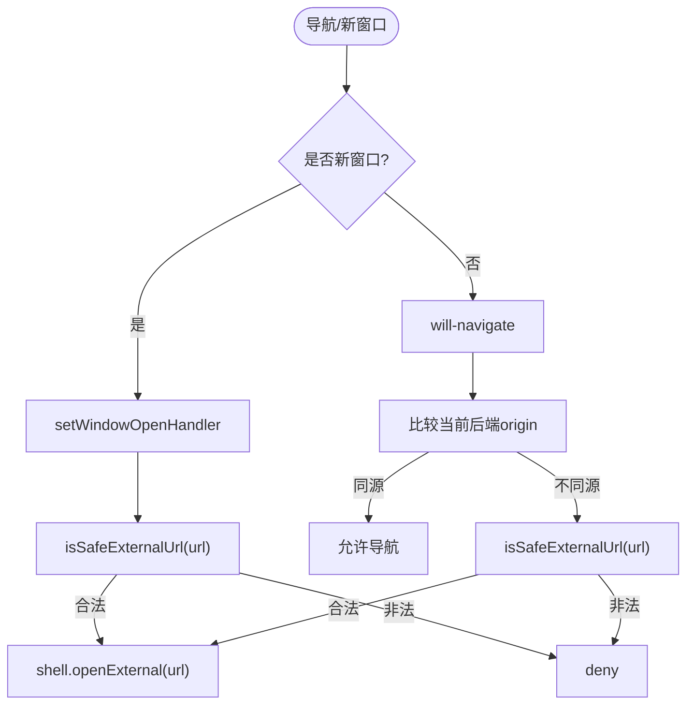
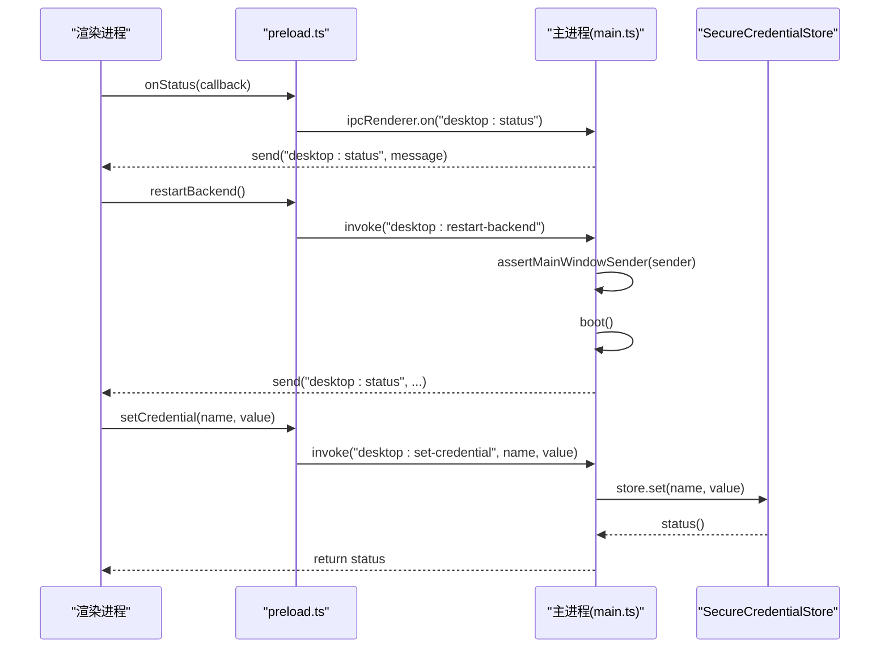
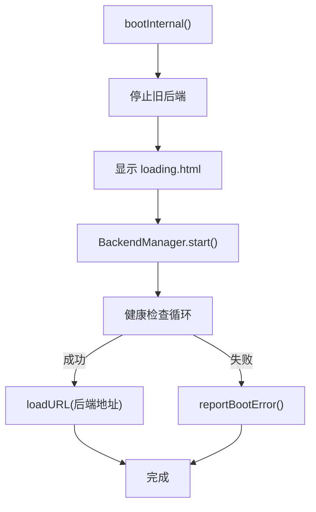
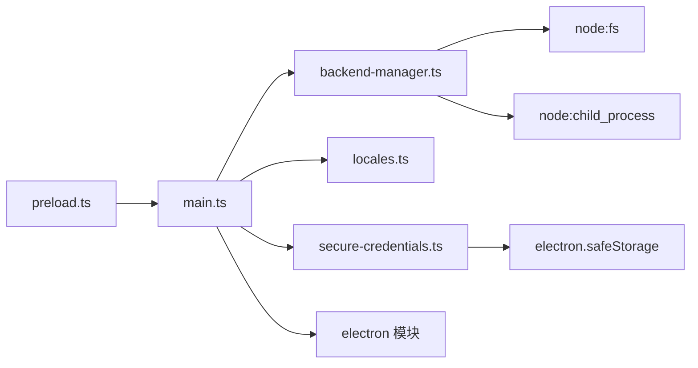

# 窗口管理系统

<cite>
**本文引用的文件**
- [main.ts](file://desktop/electron/src/main.ts)
- [preload.ts](file://desktop/electron/src/preload.ts)
- [backend-manager.ts](file://desktop/electron/src/backend-manager.ts)
- [locales.ts](file://desktop/electron/src/locales.ts)
- [secure-credentials.ts](file://desktop/electron/src/secure-credentials.ts)
- [package.json](file://desktop/electron/package.json)
</cite>

## 目录
1. [简介](#简介)
2. [项目结构](#项目结构)
3. [核心组件](#核心组件)
4. [架构总览](#架构总览)
5. [详细组件分析](#详细组件分析)
6. [依赖关系分析](#依赖关系分析)
7. [性能考虑](#性能考虑)
8. [故障排查指南](#故障排查指南)
9. [结论](#结论)
10. [附录：常见操作模式与示例路径](#附录：常见操作模式与示例路径)

## 简介
本技术文档聚焦于 Electron 窗口管理子系统，围绕 BrowserWindow 的创建与配置、生命周期事件处理、窗口状态管理、外部链接安全打开机制，以及主进程与渲染进程间的 IPC 通信进行系统化说明。该实现以单窗口为主，结合加载页与本地后端服务启动流程，提供稳定、可诊断、可扩展的桌面应用窗口体验。

## 项目结构
Electron 桌面端位于 desktop/electron 目录，关键源码集中在 src 下：
- main.ts：主进程入口，负责应用初始化、窗口创建、菜单、IPC、生命周期事件、外部链接安全控制等。
- preload.ts：预加载脚本，通过 contextBridge 暴露受限 API 给渲染进程。
- backend-manager.ts：本地后端服务（HTTP）的启动、健康检查、日志、优雅关闭与进程守护。
- locales.ts：多语言消息与国际化支持。
- secure-credentials.ts：凭据的安全存储与迁移。
- package.json：构建与打包配置，包含产物名称、语言包、Windows 安装器选项等。

图表来源
- [main.ts:65-117](file://desktop/electron/src/main.ts#L65-L117)
- [preload.ts:1-17](file://desktop/electron/src/preload.ts#L1-L17)
- [backend-manager.ts:63-146](file://desktop/electron/src/backend-manager.ts#L63-L146)

章节来源
- [main.ts:1-285](file://desktop/electron/src/main.ts#L1-L285)
- [package.json:1-86](file://desktop/electron/package.json#L1-L86)

## 核心组件
- 主进程窗口管理器：负责 BrowserWindow 的创建、显示、隐藏、焦点控制、最小化恢复、关闭行为、外部链接拦截与安全打开。
- 预加载桥接层：向渲染进程暴露受控 API（状态订阅、错误订阅、重试、打开日志、重启后端、凭据读写）。
- 后端管理器：发现并启动本地后端服务，健康检查，日志记录，优雅关闭，异常退出上报。
- 国际化与消息：统一的多语言文案，用于 UI 提示、菜单项、错误信息等。
- 安全凭据存储：使用系统级加密能力安全保存敏感键值，并提供迁移能力。

章节来源
- [main.ts:65-117](file://desktop/electron/src/main.ts#L65-L117)
- [preload.ts:1-17](file://desktop/electron/src/preload.ts#L1-L17)
- [backend-manager.ts:63-146](file://desktop/electron/src/backend-manager.ts#L63-L146)
- [locales.ts:61-131](file://desktop/electron/src/locales.ts#L61-L131)
- [secure-credentials.ts:68-123](file://desktop/electron/src/secure-credentials.ts#L68-L123)

## 架构总览
整体流程：应用启动 → 初始化主题与凭据 → 创建窗口 → 显示加载页 → 启动本地后端 → 加载业务 URL → 建立 IPC 通道 → 渲染进程通过预加载 API 与主进程交互。

图表来源
- [main.ts:49-63](file://desktop/electron/src/main.ts#L49-L63)
- [main.ts:65-117](file://desktop/electron/src/main.ts#L65-L117)
- [main.ts:148-192](file://desktop/electron/src/main.ts#L148-L192)
- [preload.ts:1-17](file://desktop/electron/src/preload.ts#L1-L17)
- [backend-manager.ts:63-146](file://desktop/electron/src/backend-manager.ts#L63-L146)

## 详细组件分析

### BrowserWindow 创建与配置
- 尺寸与最小尺寸：初始宽高与最小宽高分别设置，确保在不同分辨率下的可用布局。
- 背景色与标题栏：设置深色背景色与应用标题；启用自动隐藏菜单栏以提升沉浸感。
- 安全与隔离：启用上下文隔离、禁用 Node 集成、开启沙箱；仅在生产环境关闭开发者工具；使用独立 partition 隔离存储。
- 权限控制：拒绝所有权限请求，避免渲染进程直接获取系统权限。
- 网络头注入：对特定本地域名的请求自动附加鉴权头，保障前后端通信安全。
- 首次显示：在 ready-to-show 事件中显示窗口，避免白屏闪烁。

章节来源
- [main.ts:65-117](file://desktop/electron/src/main.ts#L65-L117)

### 窗口生命周期事件处理
- ready-to-show：窗口准备就绪后显示，提升首屏体验。
- close：阻止默认关闭行为，触发优雅关闭流程（停止后端、退出应用），保证资源释放。
- window-all-closed：在非 macOS 平台关闭窗口时退出应用，符合平台惯例。
- second-instance：重复启动时聚焦并恢复已有窗口，避免多实例。

章节来源
- [main.ts:35-47](file://desktop/electron/src/main.ts#L35-L47)
- [main.ts:99-116](file://desktop/electron/src/main.ts#L99-L116)
- [main.ts:249-280](file://desktop/electron/src/main.ts#L249-L280)

### 窗口状态管理（显示/隐藏、焦点、最小化恢复）
- 显示/隐藏：通过 ready-to-show 控制首次显示；可通过后续逻辑扩展 show/hide。
- 焦点控制：second-instance 中 restore + show + focus，确保新实例聚焦到已有窗口。
- 最小化恢复：在重复实例时若窗口最小化则恢复并聚焦。
- 关闭流程：自定义 close 处理器，统一走 shutdownAndQuit，避免后台进程残留。

章节来源
- [main.ts:35-47](file://desktop/electron/src/main.ts#L35-L47)
- [main.ts:99-116](file://desktop/electron/src/main.ts#L99-L116)
- [main.ts:249-280](file://desktop/electron/src/main.ts#L249-L280)

### 外部链接处理与安全验证
- 新窗口拦截：setWindowOpenHandler 拦截新窗口打开，仅允许安全协议（http/https）并通过 shell.openExternal 在浏览器打开。
- 导航拦截：will-navigate 拦截跨域或非法导航，限制为同源或安全外部链接。
- 安全校验：isSafeExternalUrl 严格校验协议；safeOrigin 提取 origin 用于同源判断。
- 自动鉴权：对本地后端域名的请求自动注入 Authorization 头，防止未授权访问。

图表来源
- [main.ts:107-116](file://desktop/electron/src/main.ts#L107-L116)
- [main.ts:257-272](file://desktop/electron/src/main.ts#L257-L272)

章节来源
- [main.ts:107-116](file://desktop/electron/src/main.ts#L107-L116)
- [main.ts:257-272](file://desktop/electron/src/main.ts#L257-L272)

### IPC 通信与窗口间状态同步
- 预加载暴露 API：vibeDesktop.onStatus/onError/retry/openLogs/restartBackend/getCredentialStatus/setCredential。
- 主进程注册处理器：ipcMain.on/handle 对应事件，执行安全校验（限定发送者为当前主窗口），调用后端管理或凭据存储。
- 状态推送：主进程通过 webContents.send 推送状态与错误信息，渲染进程订阅更新。
- 安全边界：所有 IPC 均经过发送者校验，防止恶意页面伪造主进程调用。

图表来源
- [preload.ts:1-17](file://desktop/electron/src/preload.ts#L1-L17)
- [main.ts:119-146](file://desktop/electron/src/main.ts#L119-L146)
- [secure-credentials.ts:68-123](file://desktop/electron/src/secure-credentials.ts#L68-L123)

章节来源
- [preload.ts:1-17](file://desktop/electron/src/preload.ts#L1-L17)
- [main.ts:119-146](file://desktop/electron/src/main.ts#L119-L146)
- [secure-credentials.ts:68-123](file://desktop/electron/src/secure-credentials.ts#L68-L123)

### 后端服务管理与窗口加载流程
- 启动流程：查找并启动本地后端，分配端口，写入日志，等待健康检查通过，返回 URL。
- 加载页面：先加载 loading.html，再切换到业务 URL；失败时回退到 loading 并推送错误。
- 健康检查：轮询 health 接口，超时抛出错误并附带最近日志片段。
- 优雅关闭：POST 关闭接口，等待退出，必要时强制终止进程树。

图表来源
- [main.ts:159-192](file://desktop/electron/src/main.ts#L159-L192)
- [backend-manager.ts:63-146](file://desktop/electron/src/backend-manager.ts#L63-L146)
- [backend-manager.ts:261-286](file://desktop/electron/src/backend-manager.ts#L261-L286)

章节来源
- [main.ts:159-192](file://desktop/electron/src/main.ts#L159-L192)
- [backend-manager.ts:63-146](file://desktop/electron/src/backend-manager.ts#L63-L146)
- [backend-manager.ts:261-286](file://desktop/electron/src/backend-manager.ts#L261-L286)

### 多窗口管理与窗口间通信（实践建议）
当前实现为单窗口设计。如需扩展多窗口：
- 窗口集合：维护一个 Map<id, BrowserWindow>，统一管理生命周期与状态。
- 窗口间通信：通过 BrowserWindow.webContents.postMessage 或共享 channel 进行消息传递。
- 状态同步：在主进程集中维护窗口状态，按需提供查询与变更接口。
- 安全策略：复用 isSafeExternalUrl/safeOrigin 校验，限制跨窗口跳转。

[本节为概念性指导，不直接分析具体代码文件]

## 依赖关系分析
- main.ts 依赖：
  - electron 模块：app、BrowserWindow、dialog、ipcMain、Menu、nativeTheme、shell。
  - 内部模块：BackendManager、locales、SecureCredentialStore。
- preload.ts 依赖：electron 的 contextBridge、ipcRenderer。
- backend-manager.ts 依赖：node 子进程、文件系统、网络、路径工具。
- locales.ts：纯文本与格式化函数，无外部依赖。
- secure-credentials.ts：electron safeStorage、fs、os、path。

图表来源
- [main.ts:1-21](file://desktop/electron/src/main.ts#L1-L21)
- [preload.ts:1-17](file://desktop/electron/src/preload.ts#L1-L17)
- [backend-manager.ts:1-14](file://desktop/electron/src/backend-manager.ts#L1-L14)
- [secure-credentials.ts:1-5](file://desktop/electron/src/secure-credentials.ts#L1-L5)

章节来源
- [main.ts:1-21](file://desktop/electron/src/main.ts#L1-L21)
- [backend-manager.ts:1-14](file://desktop/electron/src/backend-manager.ts#L1-L14)
- [secure-credentials.ts:1-5](file://desktop/electron/src/secure-credentials.ts#L1-L5)

## 性能考虑
- 窗口首次显示延迟：使用 ready-to-show 控制显示，避免渲染阻塞导致白屏。
- 权限拒绝：默认拒绝所有权限请求，减少不必要的系统调用开销。
- 网络头注入：仅对本地后端域名注入鉴权头，降低全局请求处理成本。
- 健康检查轮询：采用短间隔轮询并设置超时，避免长时间阻塞启动流程。
- 日志输出：限制最近输出长度，避免内存增长过大。

[本节提供通用优化建议，不直接分析具体代码文件]

## 故障排查指南
- 启动失败：
  - 现象：弹窗提示启动失败。
  - 原因：应用初始化或后端启动异常。
  - 处理：查看日志文件夹，定位错误堆栈；尝试重启服务。
  - 参考路径：[main.ts:35-47](file://desktop/electron/src/main.ts#L35-L47)、[main.ts:206-210](file://desktop/electron/src/main.ts#L206-L210)
- 后端意外退出：
  - 现象：渲染进程收到错误消息。
  - 原因：后端进程崩溃或提前退出。
  - 处理：检查健康检查日志与最近输出；确认端口占用与环境变量。
  - 参考路径：[backend-manager.ts:131-146](file://desktop/electron/src/backend-manager.ts#L131-L146)、[backend-manager.ts:261-286](file://desktop/electron/src/backend-manager.ts#L261-L286)
- 凭据不可用：
  - 现象：提示凭据加密不可用或格式不支持。
  - 原因：系统安全存储不可用或文件格式不匹配。
  - 处理：确认 Windows 用户会话支持加密；检查 credentials.v1.json 版本与字段。
  - 参考路径：[secure-credentials.ts:84-95](file://desktop/electron/src/secure-credentials.ts#L84-L95)、[secure-credentials.ts:139-153](file://desktop/electron/src/secure-credentials.ts#L139-L153)
- 外部链接被拦截：
  - 现象：点击链接无响应或被拒绝。
  - 原因：非 http/https 协议或不在同源白名单。
  - 处理：校验链接协议；调整同源策略或添加信任来源。
  - 参考路径：[main.ts:107-116](file://desktop/electron/src/main.ts#L107-L116)、[main.ts:257-272](file://desktop/electron/src/main.ts#L257-L272)

章节来源
- [main.ts:35-47](file://desktop/electron/src/main.ts#L35-L47)
- [main.ts:206-210](file://desktop/electron/src/main.ts#L206-L210)
- [backend-manager.ts:131-146](file://desktop/electron/src/backend-manager.ts#L131-L146)
- [backend-manager.ts:261-286](file://desktop/electron/src/backend-manager.ts#L261-L286)
- [secure-credentials.ts:84-95](file://desktop/electron/src/secure-credentials.ts#L84-L95)
- [secure-credentials.ts:139-153](file://desktop/electron/src/secure-credentials.ts#L139-L153)
- [main.ts:107-116](file://desktop/electron/src/main.ts#L107-L116)
- [main.ts:257-272](file://desktop/electron/src/main.ts#L257-L272)

## 结论
该窗口管理系统以单窗口为核心，结合加载页与本地后端启动流程，提供了稳定的窗口生命周期管理、安全的导航控制、可靠的 IPC 通信与完善的错误诊断能力。通过严格的权限拒绝与外部链接校验，保障了应用安全性；通过预加载桥接与主进程集中管理，实现了清晰的职责划分与可扩展性。对于需要定制桌面界面的开发者，可在现有基础上扩展多窗口、窗口间通信与状态同步，以满足更复杂的业务场景。

## 附录：常见操作模式与示例路径
- 创建并显示窗口：
  - 参考路径：[main.ts:65-117](file://desktop/electron/src/main.ts#L65-L117)
- 处理窗口关闭与退出：
  - 参考路径：[main.ts:102-106](file://desktop/electron/src/main.ts#L102-L106)、[main.ts:249-280](file://desktop/electron/src/main.ts#L249-L280)
- 打开外部链接（安全校验）：
  - 参考路径：[main.ts:107-116](file://desktop/electron/src/main.ts#L107-L116)、[main.ts:257-272](file://desktop/electron/src/main.ts#L257-L272)
- 渲染进程订阅状态与错误：
  - 参考路径：[preload.ts:1-17](file://desktop/electron/src/preload.ts#L1-L17)
- 重启后端服务：
  - 参考路径：[main.ts:128-132](file://desktop/electron/src/main.ts#L128-L132)、[backend-manager.ts:63-146](file://desktop/electron/src/backend-manager.ts#L63-L146)
- 安全凭据读写：
  - 参考路径：[main.ts:133-145](file://desktop/electron/src/main.ts#L133-L145)、[secure-credentials.ts:68-123](file://desktop/electron/src/secure-credentials.ts#L68-L123)