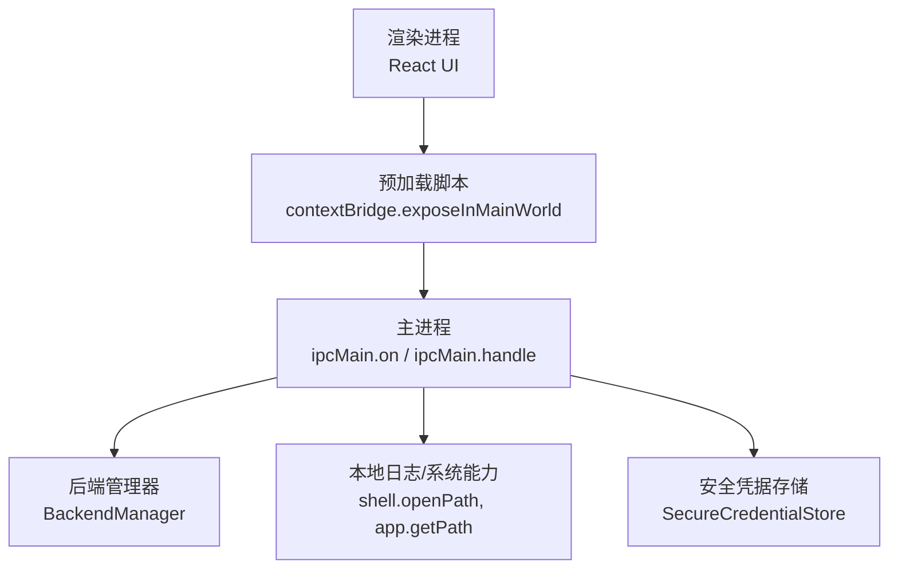
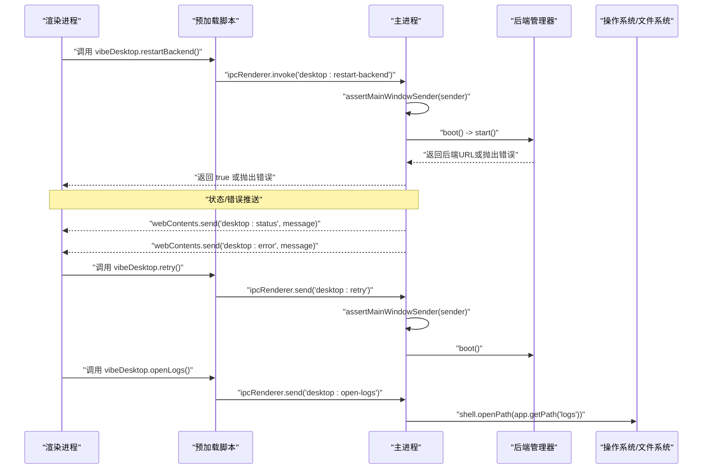
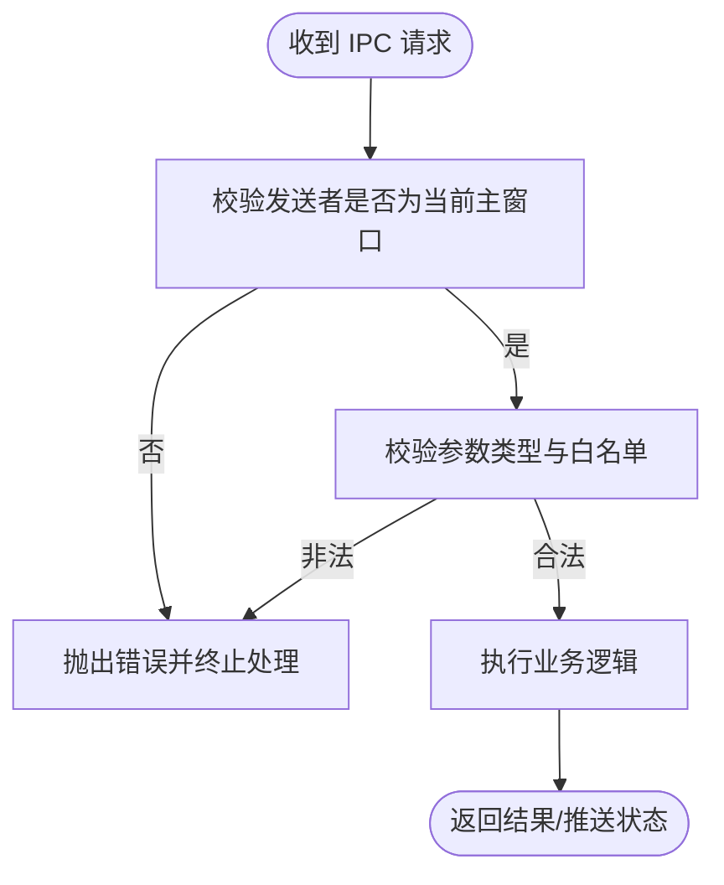
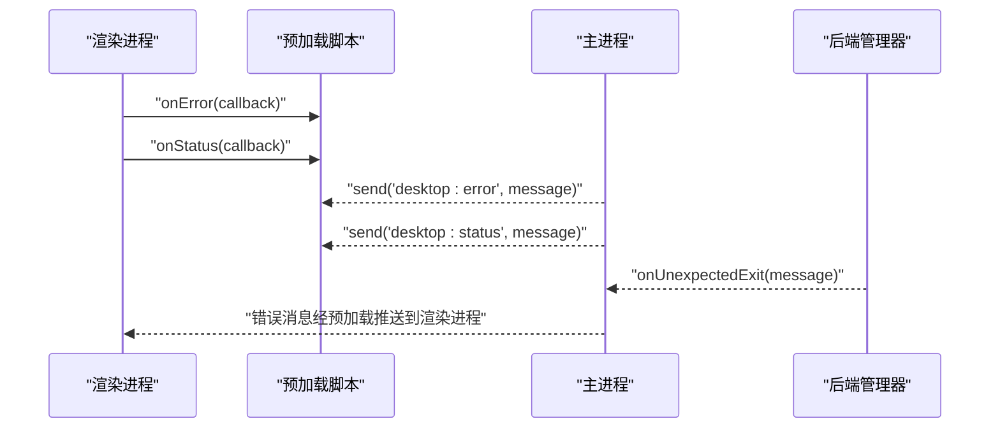
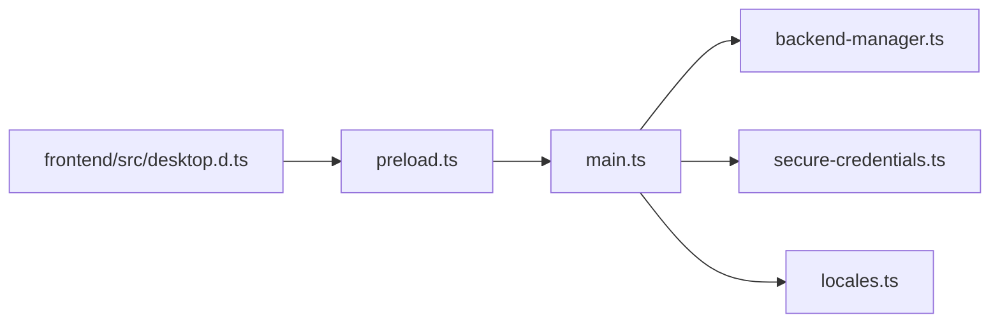

# 进程间通信机制

<cite>
**本文引用的文件**
- [main.ts](file://desktop/electron/src/main.ts)
- [preload.ts](file://desktop/electron/src/preload.ts)
- [backend-manager.ts](file://desktop/electron/src/backend-manager.ts)
- [secure-credentials.ts](file://desktop/electron/src/secure-credentials.ts)
- [locales.ts](file://desktop/electron/src/locales.ts)
- [desktop.d.ts](file://frontend/src/desktop.d.ts)
</cite>

## 目录
1. [简介](#简介)
2. [项目结构](#项目结构)
3. [核心组件](#核心组件)
4. [架构总览](#架构总览)
5. [详细组件分析](#详细组件分析)
6. [依赖关系分析](#依赖关系分析)
7. [性能考量](#性能考量)
8. [故障排查指南](#故障排查指南)
9. [结论](#结论)
10. [附录](#附录)

## 简介
本文件面向需要在 Electron 主进程与渲染进程之间实现安全、可靠通信的开发者，系统性梳理本项目中的 IPC 机制。内容涵盖：
- ipcMain 与 ipcRenderer 的使用模式（同步/异步、事件与请求-响应）
- 自定义事件定义与处理（如 'desktop:retry'、'desktop:open-logs'、'desktop:restart-backend'）
- 消息验证与权限检查（发送者校验函数 assertMainWindowSender）
- 错误处理与异常传播（跨进程错误捕获与上报）
- 最佳实践示例（消息格式设计、错误处理模式、性能优化技巧）

## 项目结构
Electron 桌面端由三个关键部分组成：
- 主进程入口与 IPC 注册：负责窗口创建、后端生命周期管理、IPC 监听与处理
- 预加载脚本：通过 contextBridge 暴露安全的 API 给渲染进程
- 前端类型声明：为渲染进程提供 TypeScript 类型提示

图表来源
- [preload.ts:3-17](file://desktop/electron/src/preload.ts#L3-L17)
- [main.ts:119-146](file://desktop/electron/src/main.ts#L119-L146)
- [backend-manager.ts:52-146](file://desktop/electron/src/backend-manager.ts#L52-L146)
- [secure-credentials.ts:68-123](file://desktop/electron/src/secure-credentials.ts#L68-L123)

章节来源
- [main.ts:49-146](file://desktop/electron/src/main.ts#L49-L146)
- [preload.ts:1-17](file://desktop/electron/src/preload.ts#L1-L17)
- [desktop.d.ts:1-22](file://frontend/src/desktop.d.ts#L1-L22)

## 核心组件
- 主进程 IPC 注册器：集中注册所有 IPC 通道，统一进行发送者校验与业务编排
- 预加载桥接层：将受限的 ipcRenderer 封装为安全的 window.vibeDesktop 接口
- 后端管理器：启动/停止 Python 后端，健康检查，状态与错误上报
- 安全凭据存储：加密存储敏感配置，迁移旧格式，限制可写入键名
- 本地化消息：统一的错误与状态文案，便于国际化展示

章节来源
- [main.ts:119-146](file://desktop/electron/src/main.ts#L119-L146)
- [preload.ts:3-17](file://desktop/electron/src/preload.ts#L3-L17)
- [backend-manager.ts:52-146](file://desktop/electron/src/backend-manager.ts#L52-L146)
- [secure-credentials.ts:68-123](file://desktop/electron/src/secure-credentials.ts#L68-L123)
- [locales.ts:61-179](file://desktop/electron/src/locales.ts#L61-L179)

## 架构总览
下图展示了从渲染进程到主进程的完整调用链，包括事件与请求-响应两种模式，以及后端管理与错误上报路径。

图表来源
- [preload.ts:5-16](file://desktop/electron/src/preload.ts#L5-L16)
- [main.ts:119-146](file://desktop/electron/src/main.ts#L119-L146)
- [backend-manager.ts:63-146](file://desktop/electron/src/backend-manager.ts#L63-L146)

## 详细组件分析

### IPC 通道与使用模式
- 事件型（单向）：
  - 'desktop:retry'：触发重启后端流程
  - 'desktop:open-logs'：打开系统日志目录
- 请求-响应型（双向）：
  - 'desktop:restart-backend'：异步重启后端并返回布尔结果
  - 'desktop:get-credential-status'：查询凭据存储状态
  - 'desktop:set-credential'：设置受保护的凭据项

说明：
- 事件型使用 ipcMain.on + ipcRenderer.send，适合“通知”场景
- 请求-响应型使用 ipcMain.handle + ipcRenderer.invoke，适合需要返回值或异常回传的场景

章节来源
- [preload.ts:5-16](file://desktop/electron/src/preload.ts#L5-L16)
- [main.ts:119-146](file://desktop/electron/src/main.ts#L119-L146)

### 自定义事件定义与处理逻辑
- 'desktop:retry'
  - 作用：重新执行应用引导流程，尝试启动后端并加载界面
  - 处理：校验发送者后调用 boot()
- 'desktop:open-logs'
  - 作用：打开系统日志目录，便于用户查看崩溃与运行日志
  - 处理：校验发送者后调用 shell.openPath(app.getPath("logs"))
- 'desktop:restart-backend'
  - 作用：在保持当前窗口的情况下重启后端服务
  - 处理：校验发送者后调用 boot()，成功后返回 true

章节来源
- [main.ts:119-146](file://desktop/electron/src/main.ts#L119-L146)

### 消息验证与权限检查
- 发送者校验函数 assertMainWindowSender
  - 目的：确保 IPC 请求仅来自受信任的主窗口渲染上下文，防止恶意页面或第三方页面劫持
  - 行为：比较 event.sender 与 mainWindow.webContents，不一致则抛出错误
- 参数校验
  - 对 set-credential 的 name/value 进行类型检查，非法输入直接拒绝并返回错误信息
- 最小权限原则
  - 预加载脚本仅暴露必要方法，避免直接暴露 ipcRenderer 实例
  - 主进程对所有敏感操作均先做发送者校验

图表来源
- [main.ts:240-247](file://desktop/electron/src/main.ts#L240-L247)
- [main.ts:137-145](file://desktop/electron/src/main.ts#L137-L145)

章节来源
- [main.ts:240-247](file://desktop/electron/src/main.ts#L240-L247)
- [main.ts:137-145](file://desktop/electron/src/main.ts#L137-L145)

### 错误处理与异常传播
- 主进程全局未捕获异常
  - 通过 process.on("uncaughtException") 捕获并弹窗展示，避免静默失败
- 启动失败与后端异常
  - 启动失败时显示加载页并通过 'desktop:error' 推送错误消息
  - 后端意外退出时通过回调上报错误信息
- 预加载与渲染侧
  - 通过 onStatus/onError 订阅主进程推送的状态与错误，用于 UI 反馈
- 凭据存储异常
  - 加密不可用或文件格式不支持时抛出明确错误，阻止后续操作

图表来源
- [preload.ts:5-10](file://desktop/electron/src/preload.ts#L5-L10)
- [main.ts:206-210](file://desktop/electron/src/main.ts#L206-L210)
- [backend-manager.ts:131-140](file://desktop/electron/src/backend-manager.ts#L131-L140)
- [main.ts:282-284](file://desktop/electron/src/main.ts#L282-L284)

章节来源
- [main.ts:206-210](file://desktop/electron/src/main.ts#L206-L210)
- [main.ts:282-284](file://desktop/electron/src/main.ts#L282-L284)
- [backend-manager.ts:131-140](file://desktop/electron/src/backend-manager.ts#L131-L140)
- [preload.ts:5-10](file://desktop/electron/src/preload.ts#L5-L10)

### 最佳实践与代码示例指引
- 消息格式设计
  - 事件型：仅包含必要字段，避免携带大对象；例如重试与打开日志无需额外载荷
  - 请求-响应型：严格校验入参类型与取值范围，返回结构化结果（如布尔或状态对象）
- 错误处理模式
  - 主进程统一捕获并格式化错误文本，通过 'desktop:error' 推送
  - 渲染进程订阅 onError 并在 UI 中友好展示
- 性能优化技巧
  - 使用 handle/invoke 替代频繁 send/on 以减少事件风暴
  - 启动流程去重：boot() 内部缓存 Promise，避免重复启动
  - 健康检查采用轮询+超时，避免长时间阻塞
  - 日志输出按天滚动，控制最近输出长度，降低内存占用

章节来源
- [main.ts:159-163](file://desktop/electron/src/main.ts#L159-L163)
- [backend-manager.ts:261-286](file://desktop/electron/src/backend-manager.ts#L261-L286)
- [backend-manager.ts:288-304](file://desktop/electron/src/backend-manager.ts#L288-L304)

## 依赖关系分析
- 主进程依赖
  - BackendManager：负责后端进程生命周期、端口分配、健康检查、日志记录
  - SecureCredentialStore：提供加密凭据存取与环境变量注入
  - locales：提供多语言错误与状态文案
- 预加载脚本依赖
  - contextBridge：安全暴露 API
  - ipcRenderer：与主进程通信
- 前端依赖
  - desktop.d.ts：类型声明，约束 vibeDesktop 接口

图表来源
- [main.ts:119-146](file://desktop/electron/src/main.ts#L119-L146)
- [preload.ts:3-17](file://desktop/electron/src/preload.ts#L3-L17)
- [desktop.d.ts:9-21](file://frontend/src/desktop.d.ts#L9-L21)

章节来源
- [main.ts:119-146](file://desktop/electron/src/main.ts#L119-L146)
- [preload.ts:3-17](file://desktop/electron/src/preload.ts#L3-L17)
- [desktop.d.ts:9-21](file://frontend/src/desktop.d.ts#L9-L21)

## 性能考量
- 启动流程幂等与防抖
  - 通过缓存 bootPromise 避免并发启动导致资源竞争
- 健康检查与超时
  - 使用固定超时与短间隔轮询，避免长时间阻塞主线程
- 日志与内存
  - 仅保留最近若干行输出，定期落盘，减少内存占用
- 安全与开销平衡
  - 预加载仅暴露最小 API，减少 IPC 暴露面
  - 发送者校验在每次敏感操作前执行，保证安全的同时开销可控

[本节为通用指导，不直接分析具体文件]

## 故障排查指南
- 常见问题定位
  - 启动失败：查看 'desktop:error' 推送的消息，确认后端是否可用、端口是否被占用
  - 后端意外退出：检查后端日志与退出码，必要时打开日志目录
  - 凭据设置失败：检查键名是否在白名单，值是否为字符串或 null
- 调试建议
  - 启用开发工具，观察 IPC 事件与错误堆栈
  - 使用环境变量覆盖后端可执行路径，隔离环境问题
  - 在主进程全局异常处理器中捕获未预期错误

章节来源
- [main.ts:206-210](file://desktop/electron/src/main.ts#L206-L210)
- [main.ts:282-284](file://desktop/electron/src/main.ts#L282-L284)
- [backend-manager.ts:131-140](file://desktop/electron/src/backend-manager.ts#L131-L140)
- [secure-credentials.ts:105-137](file://desktop/electron/src/secure-credentials.ts#L105-L137)

## 结论
本项目通过严格的发送者校验、最小化的预加载暴露面、规范的事件与请求-响应通道设计，实现了安全可靠的进程间通信。结合后端管理器的健壮生命周期管理与错误上报机制，确保了用户体验与系统稳定性。遵循本文的最佳实践，可在类似 Electron 应用中快速构建高内聚、低耦合的前后端通信方案。

[本节为总结性内容，不直接分析具体文件]

## 附录

### IPC 通道清单与语义
- 'desktop:retry'（事件）
  - 用途：触发重启后端
  - 参数：无
  - 返回：无
- 'desktop:open-logs'（事件）
  - 用途：打开系统日志目录
  - 参数：无
  - 返回：无
- 'desktop:restart-backend'（请求-响应）
  - 用途：重启后端服务
  - 参数：无
  - 返回：boolean（成功）
- 'desktop:get-credential-status'（请求-响应）
  - 用途：查询凭据存储状态
  - 参数：无
  - 返回：{ available, configured, migrated }
- 'desktop:set-credential'（请求-响应）
  - 用途：设置受保护凭据
  - 参数：name(string), value(string|null)
  - 返回：{ available, configured, migrated }

章节来源
- [preload.ts:5-16](file://desktop/electron/src/preload.ts#L5-L16)
- [main.ts:119-146](file://desktop/electron/src/main.ts#L119-L146)
- [desktop.d.ts:9-21](file://frontend/src/desktop.d.ts#L9-L21)

### 安全边界与权限模型
- 预加载层：仅暴露必要方法，禁止直接访问 Node.js 与 ipcRenderer
- 主进程层：所有敏感操作均需通过 assertMainWindowSender 校验
- 网络层：同域请求自动附加认证头，外部导航受控

章节来源
- [preload.ts:3-17](file://desktop/electron/src/preload.ts#L3-L17)
- [main.ts:240-247](file://desktop/electron/src/main.ts#L240-L247)