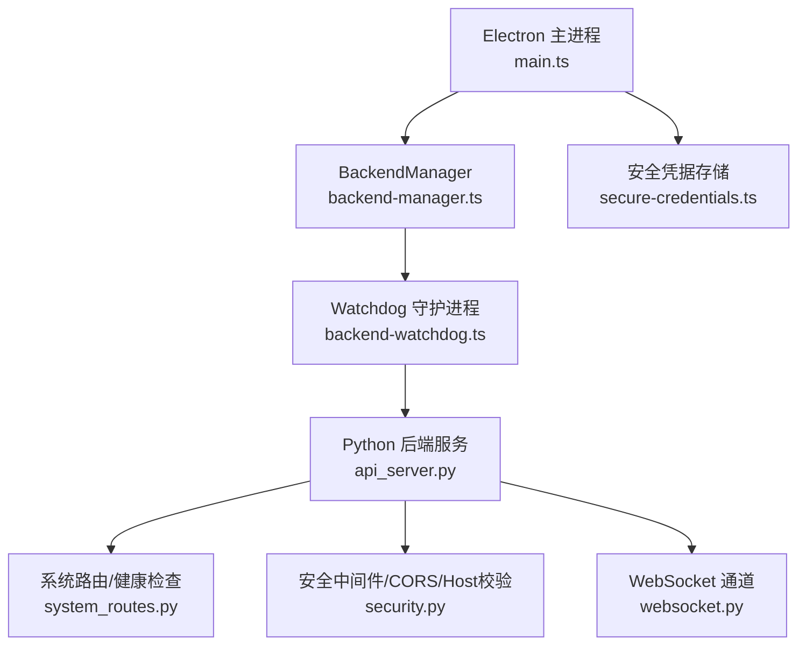
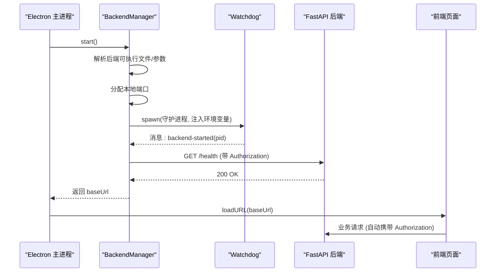
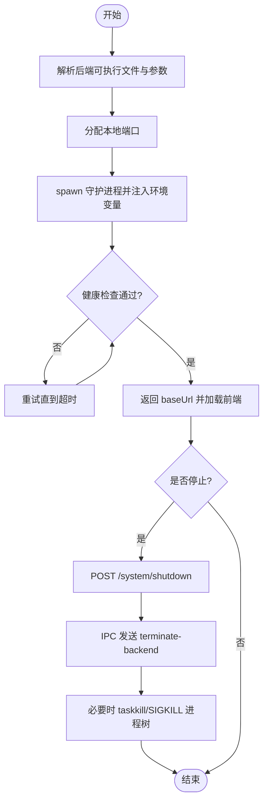
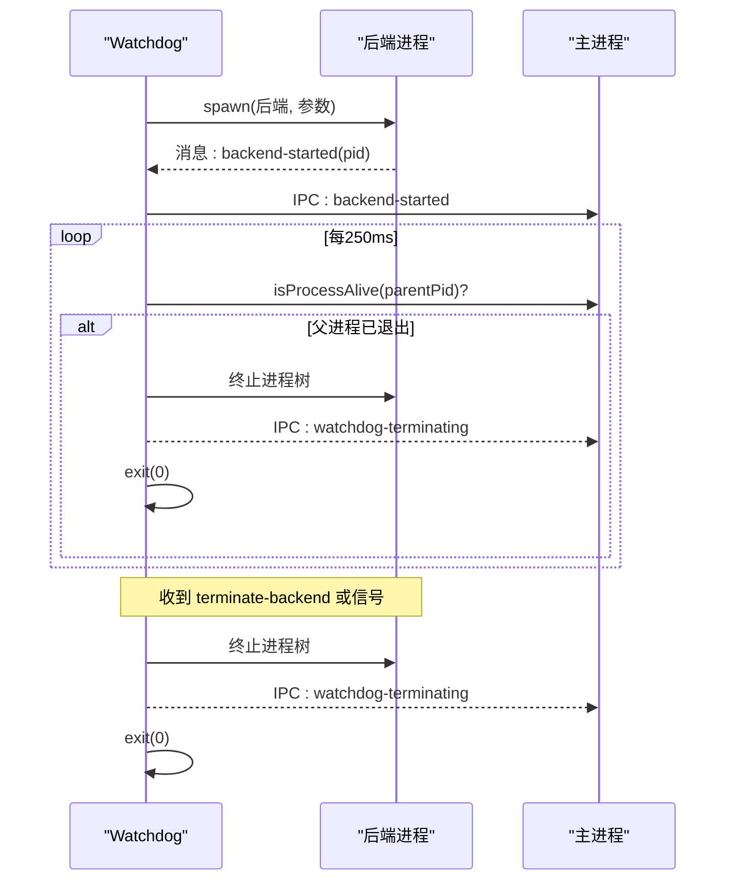
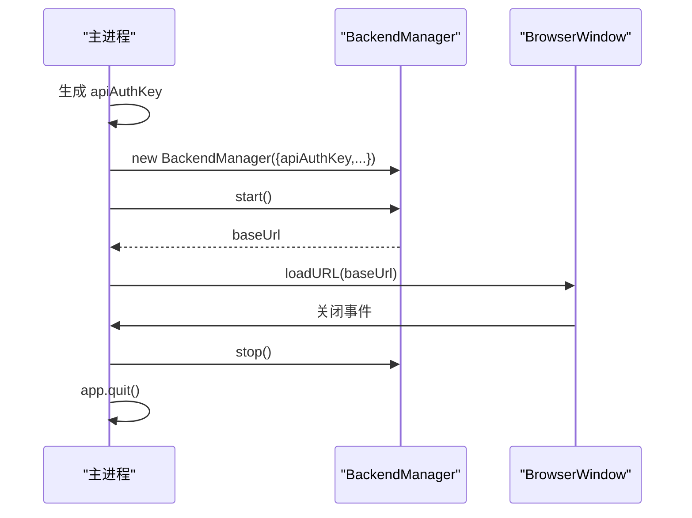
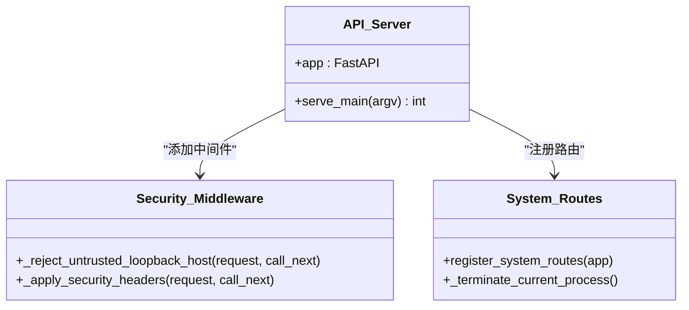
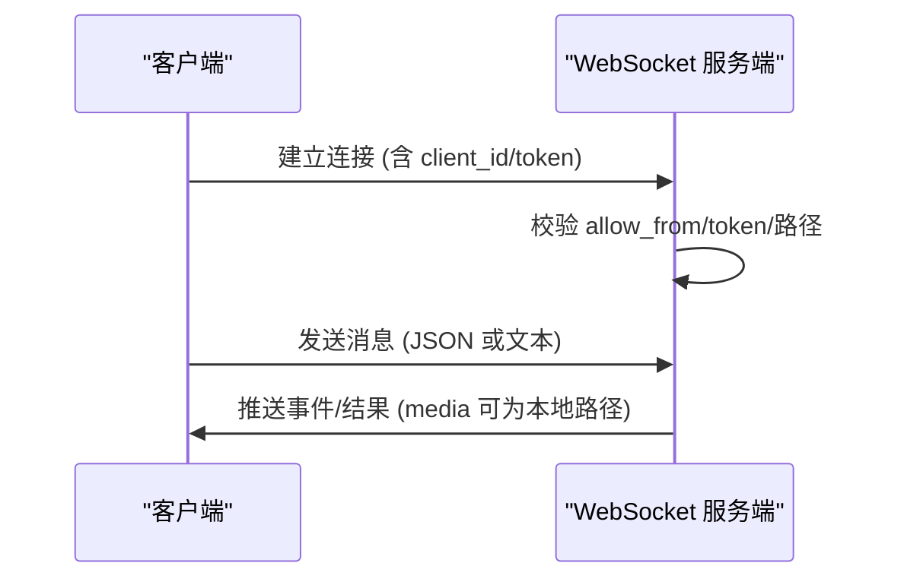
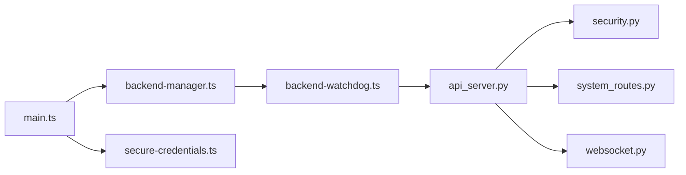

# 后端集成

<cite>
**本文引用的文件**
- [backend-manager.ts](file://desktop/electron/src/backend-manager.ts)
- [backend-watchdog.ts](file://desktop/electron/src/backend-watchdog.ts)
- [main.ts](file://desktop/electron/src/main.ts)
- [secure-credentials.ts](file://desktop/electron/src/secure-credentials.ts)
- [api_server.py](file://agent/api_server.py)
- [security.py](file://agent/src/api/security.py)
- [system_routes.py](file://agent/src/api/system_routes.py)
- [websocket.py](file://agent/src/channels/websocket.py)
- [env_schema.py](file://agent/src/config/env_schema.py)
</cite>

## 目录
1. [简介](#简介)
2. [项目结构](#项目结构)
3. [核心组件](#核心组件)
4. [架构总览](#架构总览)
5. [详细组件分析](#详细组件分析)
6. [依赖关系分析](#依赖关系分析)
7. [性能考虑](#性能考虑)
8. [故障排查指南](#故障排查指南)
9. [结论](#结论)
10. [附录](#附录)

## 简介
本技术文档面向“桌面应用与后端集成”的实现，重点解释 BackendManager 的设计模式与实现原理，涵盖进程管理、端口分配、生命周期控制；前后端通信协议（HTTP API、WebSocket、错误处理）；环境变量配置（认证信息传递、服务地址、调试开关）；进程间通信（标准输入输出、信号处理、资源清理）；健康检查与故障恢复（心跳检测、自动重启、降级）；日志收集与分析；以及性能监控与优化建议。文末提供实际集成示例与调试技巧。

## 项目结构
本项目由 Electron 桌面主进程、守护进程（watchdog）、Python 后端 FastAPI 服务组成：
- 桌面主进程负责启动后端、注入安全头、加载前端页面、处理用户交互与菜单。
- 守护进程负责拉起并监控后端进程，转发其 stdout/stderr，并在父进程退出或收到终止信号时清理子进程树。
- Python 后端基于 FastAPI 暴露 REST API 与 WebSocket 通道，内置安全中间件、CORS、限流与健康检查。

**图表来源**
- [main.ts:1-285](file://desktop/electron/src/main.ts#L1-L285)
- [backend-manager.ts:1-426](file://desktop/electron/src/backend-manager.ts#L1-L426)
- [backend-watchdog.ts:1-167](file://desktop/electron/src/backend-watchdog.ts#L1-L167)
- [api_server.py:1-400](file://agent/api_server.py#L1-L400)
- [security.py:1-200](file://agent/src/api/security.py#L1-L200)
- [system_routes.py:1-200](file://agent/src/api/system_routes.py#L1-L200)
- [websocket.py:1-200](file://agent/src/channels/websocket.py#L1-L200)
- [secure-credentials.ts:1-240](file://desktop/electron/src/secure-credentials.ts#L1-L240)

**章节来源**
- [main.ts:1-285](file://desktop/electron/src/main.ts#L1-L285)
- [backend-manager.ts:1-426](file://desktop/electron/src/backend-manager.ts#L1-L426)
- [backend-watchdog.ts:1-167](file://desktop/electron/src/backend-watchdog.ts#L1-L167)
- [api_server.py:1-400](file://agent/api_server.py#L1-L400)

## 核心组件
- BackendManager：封装后端可执行文件的发现、参数组装、端口分配、进程启动、健康检查、日志采集与优雅关闭。
- Watchdog：独立 Node 进程，负责拉起后端、透传 I/O、监听父进程存活、响应终止指令、清理进程树。
- Electron 主进程：生成 API 鉴权密钥、注入 Authorization 头到本地请求、加载 UI、注册 IPC、菜单与关闭流程。
- Python 后端：FastAPI 应用装配、路由挂载、安全中间件、系统路由（健康、关闭）、WebSocket 通道。
- 安全凭据存储：使用系统级加密存储敏感环境变量，启动时迁移旧配置并注入到后端进程环境。

**章节来源**
- [backend-manager.ts:1-426](file://desktop/electron/src/backend-manager.ts#L1-L426)
- [backend-watchdog.ts:1-167](file://desktop/electron/src/backend-watchdog.ts#L1-L167)
- [main.ts:1-285](file://desktop/electron/src/main.ts#L1-L285)
- [api_server.py:1-400](file://agent/api_server.py#L1-L400)
- [secure-credentials.ts:1-240](file://desktop/electron/src/secure-credentials.ts#L1-L240)

## 架构总览
整体采用“主进程 + 守护进程 + 后端服务”的三层架构：
- 主进程仅做编排与安全注入，不直接运行后端逻辑。
- 守护进程隔离后端生命周期，避免主进程崩溃影响后端，也避免后端异常拖垮主进程。
- 后端通过 HTTP 与 WebSocket 对外提供服务，受安全中间件保护。

**图表来源**
- [backend-manager.ts:63-145](file://desktop/electron/src/backend-manager.ts#L63-L145)
- [backend-watchdog.ts:31-68](file://desktop/electron/src/backend-watchdog.ts#L31-L68)
- [main.ts:159-191](file://desktop/electron/src/main.ts#L159-L191)
- [api_server.py:321-395](file://agent/api_server.py#L321-L395)

## 详细组件分析

### BackendManager 设计与实现
- 设计模式
  - 工厂式后端解析：根据打包路径、源码路径、PATH 等策略定位可执行文件，支持覆盖与环境变量切换。
  - 观察者回调：onStatus/onUnexpectedExit 将状态与异常上报给主进程。
  - 资源管理器：集中管理日志流、最近输出缓存、进程句柄与 URL。
- 关键能力
  - 端口分配：创建临时 TCP 服务器绑定 127.0.0.1:0，获取可用端口后关闭，确保无冲突。
  - 进程管理：spawn 守护进程，设置 stdio 管道与 IPC，捕获 stdout/stderr 并写入按日切分的日志文件。
  - 生命周期控制：start 等待健康检查通过；stop 先调用后端 shutdown 接口，再向 watchdog 发送 terminate-backend，最后强制 kill 进程树。
  - 健康检查：轮询 /health，超时抛出异常并附带尾部日志。
- 错误处理
  - 守护进程错误与退出事件均被捕获，记录日志并通过回调通知主进程。
  - 停止流程中 graceful 失败不影响后续强制终止。

**图表来源**
- [backend-manager.ts:63-187](file://desktop/electron/src/backend-manager.ts#L63-L187)
- [backend-manager.ts:261-286](file://desktop/electron/src/backend-manager.ts#L261-L286)
- [backend-manager.ts:373-421](file://desktop/electron/src/backend-manager.ts#L373-L421)

**章节来源**
- [backend-manager.ts:1-426](file://desktop/electron/src/backend-manager.ts#L1-L426)

### Watchdog 守护进程
- 职责
  - 读取环境变量（后端可执行路径、工作目录、参数），清理 Electron 相关环境变量后拉起后端。
  - 透传后端 stdout/stderr 到自身标准输出/错误，便于主进程统一采集。
  - 周期性检测父进程存活，断开则终止后端并退出。
  - 接收 IPC 指令 terminate-backend，有序终止后端进程树。
  - 处理 SIGTERM/SIGINT，保证资源释放。
- 进程树清理
  - Windows 使用 taskkill /T /F，Unix 使用 SIGKILL。
- 健壮性
  - 对 parent disconnect、后端 error/exit 等事件进行防护，避免僵尸进程。

**图表来源**
- [backend-watchdog.ts:7-36](file://desktop/electron/src/backend-watchdog.ts#L7-L36)
- [backend-watchdog.ts:43-101](file://desktop/electron/src/backend-watchdog.ts#L43-L101)
- [backend-watchdog.ts:103-117](file://desktop/electron/src/backend-watchdog.ts#L103-L117)

**章节来源**
- [backend-watchdog.ts:1-167](file://desktop/electron/src/backend-watchdog.ts#L1-L167)

### Electron 主进程集成
- 安全注入
  - 生成随机 API_AUTH_KEY，作为 Bearer Token 注入到所有发往后端本地的请求头中。
  - 限制外部链接打开为 http/https 白名单。
- 生命周期
  - 启动时显示 loading 页，随后 bootInternal 启动后端并加载 URL。
  - 关闭时触发 shutdownAndQuit，确保后端优雅关闭。
- IPC 与菜单
  - 提供重试、重启后端、打开日志、凭据管理等 IPC。
  - 菜单项支持重启服务、打开日志、开发者工具等。

**图表来源**
- [main.ts:22-63](file://desktop/electron/src/main.ts#L22-L63)
- [main.ts:85-116](file://desktop/electron/src/main.ts#L85-L116)
- [main.ts:159-191](file://desktop/electron/src/main.ts#L159-L191)
- [main.ts:249-255](file://desktop/electron/src/main.ts#L249-L255)

**章节来源**
- [main.ts:1-285](file://desktop/electron/src/main.ts#L1-L285)

### Python 后端服务（FastAPI）
- 启动与装配
  - serve_main 解析 --host/--port/--dev，挂载静态前端或启动 Vite 开发服务器，安装访问日志脱敏过滤器，最终 uvicorn.run。
- 安全中间件
  - CORS 默认允许本地开发端口，支持额外来源扩展。
  - Host/Origin 校验防止 DNS 重绑定攻击。
  - 安全头（CSP、权限策略）限制浏览器能力。
- 系统路由
  - /health 返回服务就绪状态（轻量，不阻塞网络）。
  - /system/shutdown 触发优雅关闭（后台任务后发送 SIGTERM）。
- 其他模块
  - 会话、运行、设置、上传、渠道、Swarm、实盘、Alpha、期权、认证、定时研究等路由按需注册。

**图表来源**
- [api_server.py:321-395](file://agent/api_server.py#L321-L395)
- [security.py:166-173](file://agent/src/api/security.py#L166-L173)
- [system_routes.py:51-55](file://agent/src/api/system_routes.py#L51-L55)

**章节来源**
- [api_server.py:1-400](file://agent/api_server.py#L1-L400)
- [security.py:1-200](file://agent/src/api/security.py#L1-L200)
- [system_routes.py:1-200](file://agent/src/api/system_routes.py#L1-L200)

### WebSocket 通道
- 配置模型
  - 支持 host/port/unix socket/path/token/token_issue_path/token_ttl_s/streaming/ping_interval/ping_timeout/ssl 等。
  - 当 host 为 0.0.0.0 或 :: 时必须配置 token 或 token_issue_secret，防止未授权访问。
- 连接与认证
  - 客户端通过 ws://{host}:{port}{path}?client_id=...&token=... 连接。
  - 支持静态 token 或短时效 token（通过 HTTP 接口颁发）。
- 消息与媒体
  - 入站消息支持 JSON 信封与文本回退。
  - 出站消息 media 字段包含本地文件路径，远端需共享文件系统或 HTTP 文件服务。

**图表来源**
- [websocket.py:53-94](file://agent/src/channels/websocket.py#L53-L94)
- [websocket.py:164-201](file://agent/src/channels/websocket.py#L164-L201)

**章节来源**
- [websocket.py:1-200](file://agent/src/channels/websocket.py#L1-L200)

### 环境变量与配置
- 安全凭据存储
  - 使用系统安全存储加密保存敏感键（如 OPENAI_API_KEY、TUSHARE_TOKEN 等），启动时从 .env/qveris.json 迁移。
  - environment() 方法解密后注入到后端进程环境。
- 后端服务配置
  - 通过 Pydantic 模型集中定义环境变量（LLM、数据源、API 等），支持类型校验与默认值。
  - 支持额外 CORS 来源、循环主机白名单、代理禁用等。
- 桌面侧注入
  - 主进程注入 API_AUTH_KEY、VIBE_TRADING_DESKTOP_SECURE_CREDENTIALS、PYTHONUTF8/PYTHONUNBUFFERED、ELECTRON_RUN_AS_NODE、父进程 PID、后端可执行路径与参数等。

**章节来源**
- [secure-credentials.ts:12-34](file://desktop/electron/src/secure-credentials.ts#L12-L34)
- [secure-credentials.ts:84-123](file://desktop/electron/src/secure-credentials.ts#L84-L123)
- [env_schema.py:1-200](file://agent/src/config/env_schema.py#L1-L200)
- [backend-manager.ts:108-123](file://desktop/electron/src/backend-manager.ts#L108-L123)

## 依赖关系分析
- 组件耦合
  - 主进程依赖 BackendManager 与 SecureCredentialStore。
  - BackendManager 依赖操作系统进程管理与网络端口分配。
  - Watchdog 依赖 Node 子进程与 IPC。
  - 后端依赖 FastAPI、安全中间件、系统路由与 WebSocket 通道。
- 外部依赖
  - Uvicorn 作为 ASGI 服务器。
  - websockets 库用于 WebSocket 服务端。
  - 系统安全存储（Electron safeStorage）。

**图表来源**
- [main.ts:1-285](file://desktop/electron/src/main.ts#L1-L285)
- [backend-manager.ts:1-426](file://desktop/electron/src/backend-manager.ts#L1-L426)
- [backend-watchdog.ts:1-167](file://desktop/electron/src/backend-watchdog.ts#L1-L167)
- [api_server.py:1-400](file://agent/api_server.py#L1-L400)
- [security.py:1-200](file://agent/src/api/security.py#L1-L200)
- [system_routes.py:1-200](file://agent/src/api/system_routes.py#L1-L200)
- [websocket.py:1-200](file://agent/src/channels/websocket.py#L1-L200)
- [secure-credentials.ts:1-240](file://desktop/electron/src/secure-credentials.ts#L1-L240)

**章节来源**
- [main.ts:1-285](file://desktop/electron/src/main.ts#L1-L285)
- [backend-manager.ts:1-426](file://desktop/electron/src/backend-manager.ts#L1-L426)
- [backend-watchdog.ts:1-167](file://desktop/electron/src/backend-watchdog.ts#L1-L167)
- [api_server.py:1-400](file://agent/api_server.py#L1-L400)

## 性能考虑
- 内存与 CPU
  - 后端使用异步框架（FastAPI/Uvicorn），合理设置 worker 数与并发上限。
  - 对计算密集型接口（如相关性分析）启用滑动窗口限流，避免单客户端滥用。
- 网络延迟
  - 健康检查与关闭接口设置超时，避免阻塞主线程。
  - WebSocket ping/pong 间隔可调，保持长连接活跃。
- I/O 与日志
  - 日志按日切分，限制最近输出缓存大小，减少内存占用。
  - 访问日志中脱敏敏感查询参数，降低磁盘 I/O 与泄露风险。
- 资源清理
  - 守护进程在父进程退出或收到终止信号时立即清理后端进程树，避免僵尸进程占用资源。

[本节为通用指导，无需特定文件引用]

## 故障排查指南
- 后端无法启动
  - 检查可执行文件解析与 PATH 环境变量。
  - 查看守护进程与后端 stdout/stderr 日志（按日期命名）。
  - 确认健康检查 /health 可达且鉴权头正确。
- 端口冲突
  - BackendManager 会尝试分配 127.0.0.1:0 的端口，若失败会抛出错误；检查是否有残留进程占用。
- 鉴权失败
  - 确认主进程已将 Authorization 头注入到本地请求。
  - 检查后端安全中间件是否拒绝不可信 Host/Origin。
- 进程未退出
  - 检查 /system/shutdown 是否成功；必要时通过 watchdog IPC 或 taskkill/SIGKILL 强制终止。
- WebSocket 连接失败
  - 校验 path、token、allow_from 配置；若 host 为 0.0.0.0 或 ::，必须配置 token 或 token_issue_secret。

**章节来源**
- [backend-manager.ts:63-187](file://desktop/electron/src/backend-manager.ts#L63-L187)
- [backend-manager.ts:261-286](file://desktop/electron/src/backend-manager.ts#L261-L286)
- [backend-watchdog.ts:43-101](file://desktop/electron/src/backend-watchdog.ts#L43-L101)
- [security.py:166-173](file://agent/src/api/security.py#L166-L173)
- [websocket.py:53-94](file://agent/src/channels/websocket.py#L53-L94)

## 结论
该集成方案通过“主进程 + 守护进程 + 后端服务”的分层架构，实现了安全的进程隔离、可靠的端口分配与生命周期管理、健壮的通信协议与错误处理、完善的配置与凭据管理、以及可扩展的健康检查与故障恢复机制。结合日志与限流策略，可在生产环境中稳定运行并提供良好的用户体验。

[本节为总结，无需特定文件引用]

## 附录

### 实际集成示例与调试技巧
- 启动顺序
  - 运行 Electron 主进程，自动启动后端并加载前端。
  - 若需要开发模式，后端可启动 Vite 开发服务器以热重载前端。
- 调试步骤
  - 打开日志目录查看后端输出与错误堆栈。
  - 使用浏览器开发者工具检查本地请求是否携带 Authorization 头。
  - 通过菜单“重启服务”或 IPC 触发重新引导后端。
- 常见问题
  - 若后端提前退出，查看健康检查超时信息与尾部日志。
  - 若 WebSocket 连接失败，检查 token 与 allow_from 配置。

**章节来源**
- [main.ts:159-191](file://desktop/electron/src/main.ts#L159-L191)
- [api_server.py:321-395](file://agent/api_server.py#L321-L395)
- [backend-manager.ts:261-286](file://desktop/electron/src/backend-manager.ts#L261-L286)