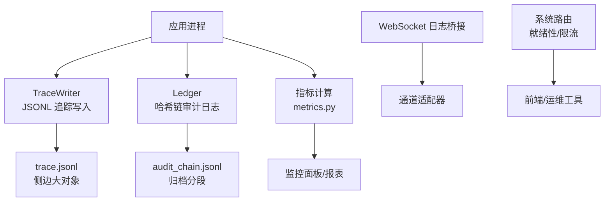
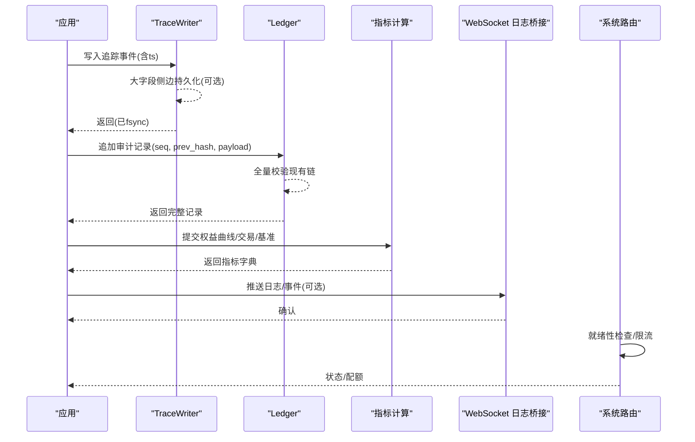
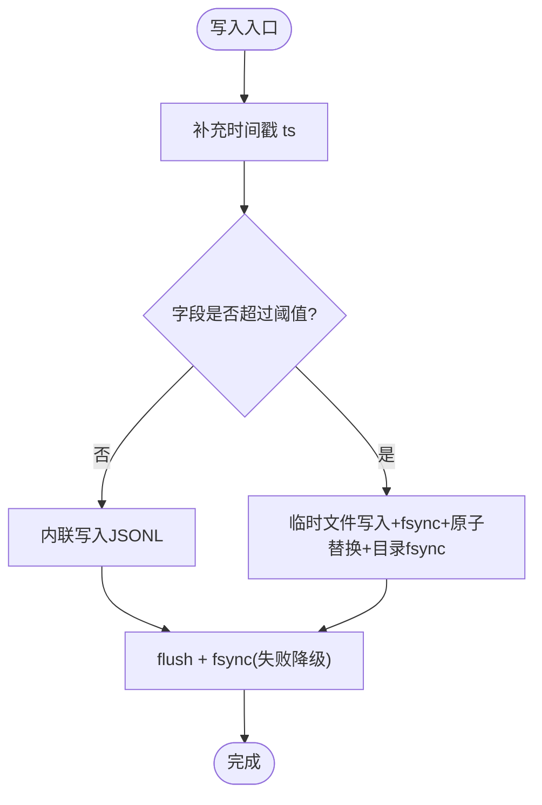
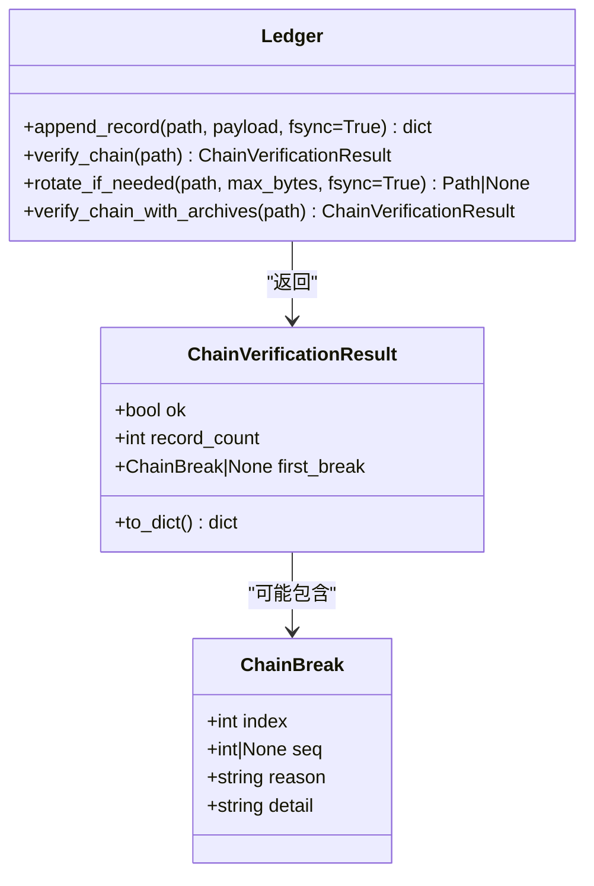
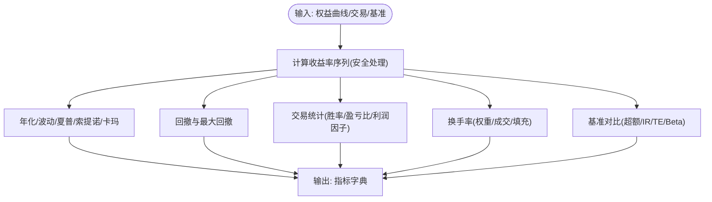
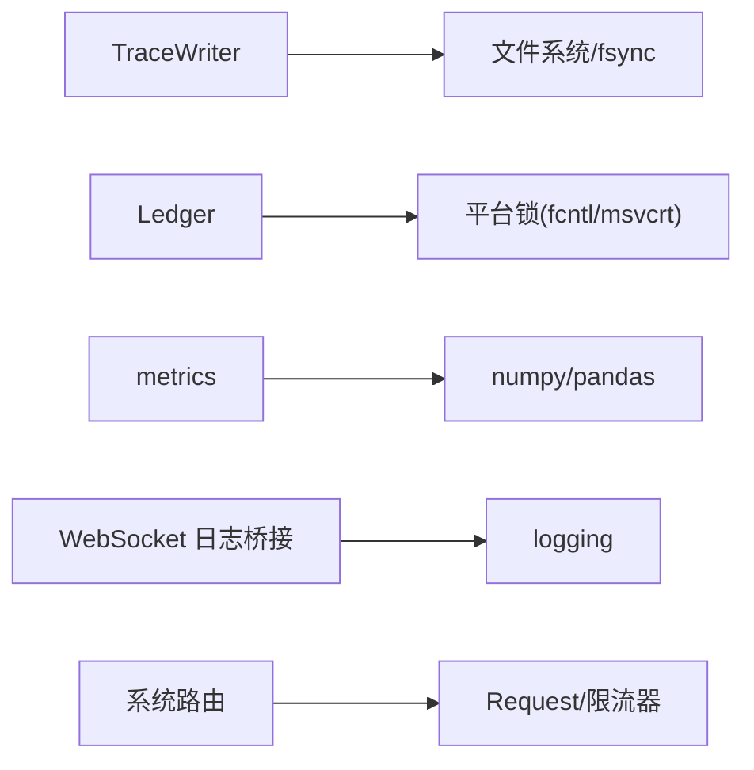

# 日志与监控

<cite>
**本文引用的文件**
- [agent/src/agent/trace.py](file://agent/src/agent/trace.py)
- [agent/src/governance/ledger.py](file://agent/src/governance/ledger.py)
- [agent/backtest/metrics.py](file://agent/backtest/metrics.py)
- [agent/src/channelsui/websocket_logging.py](file://agent/src/channelsui/websocket_logging.py)
- [agent/src/api/system_routes.py](file://agent/src/api/system_routes.py)
- [agent/src/memory/persistent.py](file://agent/src/memory/persistent.py)
</cite>

## 目录
1. [简介](#简介)
2. [项目结构](#项目结构)
3. [核心组件](#核心组件)
4. [架构总览](#架构总览)
5. [详细组件分析](#详细组件分析)
6. [依赖关系分析](#依赖关系分析)
7. [性能考量](#性能考量)
8. [故障排查指南](#故障排查指南)
9. [结论](#结论)
10. [附录](#附录)

## 简介
本技术文档聚焦桌面应用“日志收集与监控系统”，围绕以下目标展开：
- 日志采集机制：标准输出捕获、错误日志记录、日志级别控制。
- 日志文件格式与轮转策略：时间戳格式、日志分割、存储空间管理。
- 实时监控：进程状态监控、性能指标收集、告警机制。
- 日志分析与可视化：搜索、过滤、统计报表。
- 远程日志上报：传输协议、批量上传、断点续传。
- 性能监控与优化：内存使用分析、CPU 占用监控、网络延迟测量。
- 实际查看与监控示例。

本项目在代码层面提供了两类关键能力：
- 可恢复的追踪与审计日志：基于 JSONL 的 crash-safe 写入、侧边大字段持久化、哈希链校验与分段归档。
- 回测与运行期指标计算：年化、波动率、夏普、最大回撤、换手率等，便于构建监控与报表。

## 项目结构
与日志和监控直接相关的模块分布如下：
- 追踪写入器：负责将结构化事件以 JSONL 形式落盘，支持 fsync、侧边大对象存储、读取时按需回填。
- 治理账本：提供带哈希链的不可变审计日志，支持分段归档与跨段验证。
- 指标计算：统一回测指标口径，支撑监控面板与报表。
- WebSocket 日志桥接：为通道适配器暴露统一的日志命名空间。
- 系统路由：包含轻量级健康检查与限流实现，可用于就绪性探测与防抖。
- 持久化记忆：用于生成带元数据的 Markdown 条目（含时间戳），可作为辅助审计或知识沉淀。

**图示来源**
- [agent/src/agent/trace.py:64-113](file://agent/src/agent/trace.py#L64-L113)
- [agent/src/governance/ledger.py:368-469](file://agent/src/governance/ledger.py#L368-L469)
- [agent/backtest/metrics.py:461-626](file://agent/backtest/metrics.py#L461-L626)
- [agent/src/channelsui/websocket_logging.py:1-8](file://agent/src/channelsui/websocket_logging.py#L1-L8)
- [agent/src/api/system_routes.py:108-144](file://agent/src/api/system_routes.py#L108-L144)

**章节来源**
- [agent/src/agent/trace.py:64-113](file://agent/src/agent/trace.py#L64-L113)
- [agent/src/governance/ledger.py:368-469](file://agent/src/governance/ledger.py#L368-L469)
- [agent/backtest/metrics.py:461-626](file://agent/backtest/metrics.py#L461-L626)
- [agent/src/channelsui/websocket_logging.py:1-8](file://agent/src/channelsui/websocket_logging.py#L1-L8)
- [agent/src/api/system_routes.py:108-144](file://agent/src/api/system_routes.py#L108-L144)

## 核心组件
- TraceWriter：每行一条 JSON 记录的追踪写入器，保证每次写入 flush 并 fsync；对大文本采用“临时文件 + fsync + 原子替换 + 目录 fsync”的侧边存储策略；支持按字段阈值内联或落盘；提供读取接口并可选择性回填侧边内容。
- Ledger：哈希链式 JSONL 审计日志，每条记录包含 seq、prev_record_hash、record_hash；追加前会全量校验现有链；支持分段归档与跨段验证；默认不删除历史，仅滚动活跃文件。
- metrics：统一回测指标计算，包括年化因子、收益序列、交易统计、换手率、基准对比（信息比率、跟踪误差、Beta）等。
- WebSocket 日志桥接：定义专用 logger 名称，便于通道适配器集中输出到 WebSocket 通道。
- 系统路由：滑动窗口限流器与轻量就绪性检查，可用于服务健康探测与保护后端。
- 持久化记忆：生成带 frontmatter 的 Markdown 条目，包含创建/更新时间戳与访问计数等元数据。

**章节来源**
- [agent/src/agent/trace.py:64-113](file://agent/src/agent/trace.py#L64-L113)
- [agent/src/governance/ledger.py:368-469](file://agent/src/governance/ledger.py#L368-L469)
- [agent/backtest/metrics.py:461-626](file://agent/backtest/metrics.py#L461-L626)
- [agent/src/channelsui/websocket_logging.py:1-8](file://agent/src/channelsui/websocket_logging.py#L1-L8)
- [agent/src/api/system_routes.py:108-144](file://agent/src/api/system_routes.py#L108-L144)
- [agent/src/memory/persistent.py:533-567](file://agent/src/memory/persistent.py#L533-L567)

## 架构总览
下图展示了日志与监控的整体数据流：应用事件通过 TraceWriter 写入 trace.jsonl，大字段落盘至侧边文件；审计事件通过 Ledger 写入哈希链，并在达到阈值后归档；指标计算模块消费运行结果，输出可被前端或报表消费的指标；WebSocket 日志桥接可将日志转发给前端；系统路由提供就绪性与限流能力。

**图示来源**
- [agent/src/agent/trace.py:92-113](file://agent/src/agent/trace.py#L92-L113)
- [agent/src/governance/ledger.py:368-469](file://agent/src/governance/ledger.py#L368-L469)
- [agent/backtest/metrics.py:461-626](file://agent/backtest/metrics.py#L461-L626)
- [agent/src/channelsui/websocket_logging.py:1-8](file://agent/src/channelsui/websocket_logging.py#L1-L8)
- [agent/src/api/system_routes.py:108-144](file://agent/src/api/system_routes.py#L108-L144)

## 详细组件分析

### 追踪写入器（TraceWriter）
- 功能要点
  - 每写一行即 flush 并尝试 fsync，确保崩溃安全；若 fsync 失败则降级为仅 flush，并仅警告一次。
  - 自动注入时间戳 ts（Unix 时间）。
  - 大文本字段根据阈值选择内联或落盘到侧边文件；侧边文件采用“临时文件 -> fsync -> os.replace -> 目录 fsync”的原子持久化流程。
  - 提供读取接口，可选择是否回填侧边字段，避免一次性加载大对象。
  - 提供查找追踪目录的工具方法，支持 session/run 两种路径。
- 数据结构与复杂度
  - 写入 O(1)（不计入侧边 IO），侧边写入取决于文本长度；读取可按需回填，避免不必要 IO。
- 错误处理
  - fsync 失败降级并告警；侧边写入异常清理临时文件；读取时对无效路径进行安全校验。
- 性能影响
  - 单条 fsync 带来一定开销，但追踪事件频率低，整体可接受；侧边文件减少主文件体积，提升读取效率。

**图示来源**
- [agent/src/agent/trace.py:92-113](file://agent/src/agent/trace.py#L92-L113)
- [agent/src/agent/trace.py:185-267](file://agent/src/agent/trace.py#L185-L267)

**章节来源**
- [agent/src/agent/trace.py:64-113](file://agent/src/agent/trace.py#L64-L113)
- [agent/src/agent/trace.py:185-267](file://agent/src/agent/trace.py#L185-L267)
- [agent/src/agent/trace.py:302-370](file://agent/src/agent/trace.py#L302-L370)

### 治理账本（Ledger）
- 功能要点
  - 哈希链不可变日志：每条记录包含 seq、prev_record_hash、record_hash；追加前会全量校验现有链，拒绝扩展损坏链。
  - 并发安全：使用平台相关独占锁（POSIX flock 或 Windows 字节范围锁）保护读尾+追加临界区。
  - 分段归档：当活跃文件达到阈值时，将其重命名为归档段，新文件继续从上一段末尾的 record_hash 接续；默认不删除任何历史。
  - 导出与离线验证：可构建自包含导出包，并独立验证其完整性。
- 数据结构与复杂度
  - 追加前全量校验 O(n)，适合低频高可靠场景；归档段合并验证同样线性。
- 错误处理
  - 检测到损坏链抛出特定异常；fsync 失败降级并告警；归档前校验失败拒绝滚动。
- 性能影响
  - 单次追加代价较高，但审计日志写入频率低，权衡后可接受。

**图示来源**
- [agent/src/governance/ledger.py:152-206](file://agent/src/governance/ledger.py#L152-L206)
- [agent/src/governance/ledger.py:368-469](file://agent/src/governance/ledger.py#L368-L469)
- [agent/src/governance/ledger.py:614-662](file://agent/src/governance/ledger.py#L614-L662)
- [agent/src/governance/ledger.py:665-739](file://agent/src/governance/ledger.py#L665-L739)

**章节来源**
- [agent/src/governance/ledger.py:368-469](file://agent/src/governance/ledger.py#L368-L469)
- [agent/src/governance/ledger.py:614-662](file://agent/src/governance/ledger.py#L614-L662)
- [agent/src/governance/ledger.py:665-739](file://agent/src/governance/ledger.py#L665-L739)

### 指标计算（metrics）
- 功能要点
  - 年化因子映射：不同市场/数据源的交易日与日内 bar 数映射，支持多种周期。
  - 收益序列：安全处理零/负价格导致的收益率未定义问题。
  - 交易统计：胜率、盈亏比、连续亏损次数、平均持仓 bar、利润因子等。
  - 换手率：基于权重变化、成交明细、执行填充的多视角换手率。
  - 基准对比：超额收益、信息比率、跟踪误差、基准 Beta。
- 数据结构与复杂度
  - 主要操作为向量化计算，时间复杂度近似 O(n)。
- 错误处理
  - 对非有限值、极小样本、溢出等进行防护，保证指标稳定。
- 性能影响
  - 指标计算适合批处理或定时刷新，避免高频阻塞。

**图示来源**
- [agent/backtest/metrics.py:245-302](file://agent/backtest/metrics.py#L245-L302)
- [agent/backtest/metrics.py:266-342](file://agent/backtest/metrics.py#L266-L342)
- [agent/backtest/metrics.py:441-531](file://agent/backtest/metrics.py#L441-L531)
- [agent/backtest/metrics.py:461-626](file://agent/backtest/metrics.py#L461-L626)

**章节来源**
- [agent/backtest/metrics.py:245-302](file://agent/backtest/metrics.py#L245-L302)
- [agent/backtest/metrics.py:266-342](file://agent/backtest/metrics.py#L266-L342)
- [agent/backtest/metrics.py:441-531](file://agent/backtest/metrics.py#L441-L531)
- [agent/backtest/metrics.py:461-626](file://agent/backtest/metrics.py#L461-L626)

### WebSocket 日志桥接
- 作用：为通道适配器提供统一的日志命名空间，便于将日志推送到 WebSocket 客户端。
- 使用方式：通过获取指定 logger 名称，即可将日志定向到该通道。

**章节来源**
- [agent/src/channelsui/websocket_logging.py:1-8](file://agent/src/channelsui/websocket_logging.py#L1-L8)

### 系统路由（就绪性与限流）
- 就绪性检查：提供轻量级的服务可用性探测，无外部网络依赖。
- 限流：滑动窗口限流器，限制单位时间内请求数，保护后端资源。

**章节来源**
- [agent/src/api/system_routes.py:108-144](file://agent/src/api/system_routes.py#L108-L144)

### 持久化记忆（辅助审计）
- 作用：生成带 frontmatter 的 Markdown 条目，包含创建/更新时间戳、访问计数等元数据，可用于辅助审计或知识沉淀。
- 特点：文件名与内容清洗、锁定写入、超时告警。

**章节来源**
- [agent/src/memory/persistent.py:533-567](file://agent/src/memory/persistent.py#L533-L567)

## 依赖关系分析
- TraceWriter 依赖文件系统与操作系统 fsync；侧边文件路径需安全校验，防止越界访问。
- Ledger 依赖平台锁机制（POSIX/Windows）保障并发安全；归档与验证逻辑强耦合。
- metrics 依赖 numpy/pandas 进行向量化计算；对边界条件有严格防护。
- WebSocket 日志桥接依赖 Python logging 框架。
- 系统路由依赖 FastAPI Request 模型与内置数据结构。

**图示来源**
- [agent/src/agent/trace.py:219-267](file://agent/src/agent/trace.py#L219-L267)
- [agent/src/governance/ledger.py:327-352](file://agent/src/governance/ledger.py#L327-L352)
- [agent/backtest/metrics.py:11-14](file://agent/backtest/metrics.py#L11-L14)
- [agent/src/channelsui/websocket_logging.py:1-8](file://agent/src/channelsui/websocket_logging.py#L1-L8)
- [agent/src/api/system_routes.py:108-144](file://agent/src/api/system_routes.py#L108-L144)

**章节来源**
- [agent/src/agent/trace.py:219-267](file://agent/src/agent/trace.py#L219-L267)
- [agent/src/governance/ledger.py:327-352](file://agent/src/governance/ledger.py#L327-L352)
- [agent/backtest/metrics.py:11-14](file://agent/backtest/metrics.py#L11-L14)
- [agent/src/channelsui/websocket_logging.py:1-8](file://agent/src/channelsui/websocket_logging.py#L1-L8)
- [agent/src/api/system_routes.py:108-144](file://agent/src/api/system_routes.py#L108-L144)

## 性能考量
- 写入延迟与可靠性权衡
  - TraceWriter 每条记录 fsync 提供强持久性，适合低吞吐高可靠场景；若追求更高吞吐，可在上层做批量缓冲（需谨慎保证顺序与一致性）。
  - Ledger 追加前全量校验 O(n)，适合低频审计；可通过归档降低活跃文件大小，缩短校验时间。
- 大字段处理
  - 侧边文件避免主文件膨胀，提高读取效率；建议合理设置阈值，平衡内联与落盘成本。
- 指标计算
  - 向量化计算高效；建议在后台任务中定期刷新，避免阻塞主流程。
- 监控与告警
  - 利用系统路由的就绪性检查与限流，保护后端；结合指标计算结果设置阈值告警（如最大回撤、夏普异常）。

[本节为通用指导，无需具体文件引用]

## 故障排查指南
- 追踪日志缺失或不完整
  - 检查 fsync 是否失败（降级为 flush-only），查看日志中的首次 fsync 失败警告。
  - 确认侧边文件路径安全且存在；读取时可启用字段回填。
- 审计链损坏
  - 使用验证函数检查链完整性；若发现损坏，停止追加并隔离文件，定位破坏点。
  - 归档前会校验链，若失败需先修复再归档。
- 指标异常
  - 检查输入数据是否存在零/负价格、NaN/Inf；确认年化参数与数据源匹配。
  - 小样本情况下，部分指标可能被置零或受限，注意解读。
- 服务不可用或过载
  - 通过就绪性检查确认服务状态；观察限流器是否触发，调整阈值或扩容。

**章节来源**
- [agent/src/agent/trace.py:286-300](file://agent/src/agent/trace.py#L286-L300)
- [agent/src/governance/ledger.py:208-221](file://agent/src/governance/ledger.py#L208-L221)
- [agent/src/governance/ledger.py:614-662](file://agent/src/governance/ledger.py#L614-L662)
- [agent/backtest/metrics.py:245-302](file://agent/backtest/metrics.py#L245-L302)
- [agent/src/api/system_routes.py:108-144](file://agent/src/api/system_routes.py#L108-L144)

## 结论
本项目提供了企业级的日志与监控基础能力：
- 追踪日志具备崩溃安全与大字段处理能力，适合诊断与回溯。
- 审计日志通过哈希链与归档机制，满足合规与取证需求。
- 指标计算统一口径，便于构建监控面板与报表。
- 系统路由提供就绪性与限流，保障服务稳定性。
在实际部署中，建议结合前端可视化与告警规则，形成闭环的日志与监控体系。

[本节为总结，无需具体文件引用]

## 附录

### 日志文件格式与轮转策略
- 追踪日志
  - 格式：每行一条 JSON 记录，包含自动注入的时间戳 ts。
  - 轮转：当前实现未内置按时间轮转；可通过外部工具按大小或时间切割，并结合侧边文件管理。
- 审计日志
  - 格式：JSONL，包含 seq、prev_record_hash、record_hash 与业务 payload。
  - 轮转：达到阈值后归档为分段文件，活跃文件继续追加；默认不删除历史。
- 时间戳
  - 追踪日志使用 Unix 时间；持久化记忆使用 ISO 时间字符串。

**章节来源**
- [agent/src/agent/trace.py:92-113](file://agent/src/agent/trace.py#L92-L113)
- [agent/src/governance/ledger.py:368-469](file://agent/src/governance/ledger.py#L368-L469)
- [agent/src/memory/persistent.py:533-567](file://agent/src/memory/persistent.py#L533-L567)

### 实时监控与告警
- 进程状态监控：通过系统路由的就绪性检查判断服务可用。
- 性能指标收集：基于指标计算模块，定期产出夏普、回撤、换手率等。
- 告警机制：建议基于指标阈值（如最大回撤、夏普低于阈值）触发告警；可结合 WebSocket 日志桥接实时推送。

**章节来源**
- [agent/src/api/system_routes.py:108-144](file://agent/src/api/system_routes.py#L108-L144)
- [agent/backtest/metrics.py:461-626](file://agent/backtest/metrics.py#L461-L626)
- [agent/src/channelsui/websocket_logging.py:1-8](file://agent/src/channelsui/websocket_logging.py#L1-L8)

### 日志分析与可视化
- 搜索与过滤：读取追踪日志时可按字段筛选，避免加载大字段；审计日志可通过 seq 与时间戳过滤。
- 统计报表：基于指标计算结果生成日报/周报，展示收益、风险、换手等维度。
- 可视化建议：前端渲染时序图（权益曲线、回撤）、柱状图（换手率）、仪表盘（夏普、索提诺）。

**章节来源**
- [agent/src/agent/trace.py:302-370](file://agent/src/agent/trace.py#L302-L370)
- [agent/backtest/metrics.py:461-626](file://agent/backtest/metrics.py#L461-L626)

### 远程日志上报
- 传输协议：可使用 WebSocket 日志桥接将日志实时推送至前端或远端；也可基于 HTTP 接口批量上报。
- 批量上传：建议对追踪日志进行批处理，减少网络开销；对审计日志保持逐条追加以保证顺序与完整性。
- 断点续传：服务端应记录已接收的最大 seq 或时间戳，重启后从断点继续；审计日志的哈希链可帮助校验完整性。

[本节为通用设计建议，无需具体文件引用]

### 性能监控与优化建议
- 内存使用分析：关注侧边文件数量与大小，避免过多大字段导致内存压力；读取时按需回填。
- CPU 占用监控：指标计算应在后台任务执行，避免阻塞主循环；必要时引入批处理与缓存。
- 网络延迟测量：对远程上报增加耗时埋点，结合重试与退避策略，提升鲁棒性。

[本节为通用指导，无需具体文件引用]

### 实际查看与监控示例
- 查看追踪日志
  - 定位会话或运行目录，读取 trace.jsonl；如需大字段，启用字段回填。
- 验证审计链
  - 调用验证函数检查链完整性；若归档，使用跨段验证函数。
- 生成指标报表
  - 提交权益曲线、交易记录与基准，获取指标字典；前端渲染图表。
- 监控服务健康
  - 调用就绪性检查接口；观察限流器是否触发。

**章节来源**
- [agent/src/agent/trace.py:302-370](file://agent/src/agent/trace.py#L302-L370)
- [agent/src/governance/ledger.py:309-324](file://agent/src/governance/ledger.py#L309-L324)
- [agent/src/governance/ledger.py:665-739](file://agent/src/governance/ledger.py#L665-L739)
- [agent/backtest/metrics.py:461-626](file://agent/backtest/metrics.py#L461-L626)
- [agent/src/api/system_routes.py:108-144](file://agent/src/api/system_routes.py#L108-L144)