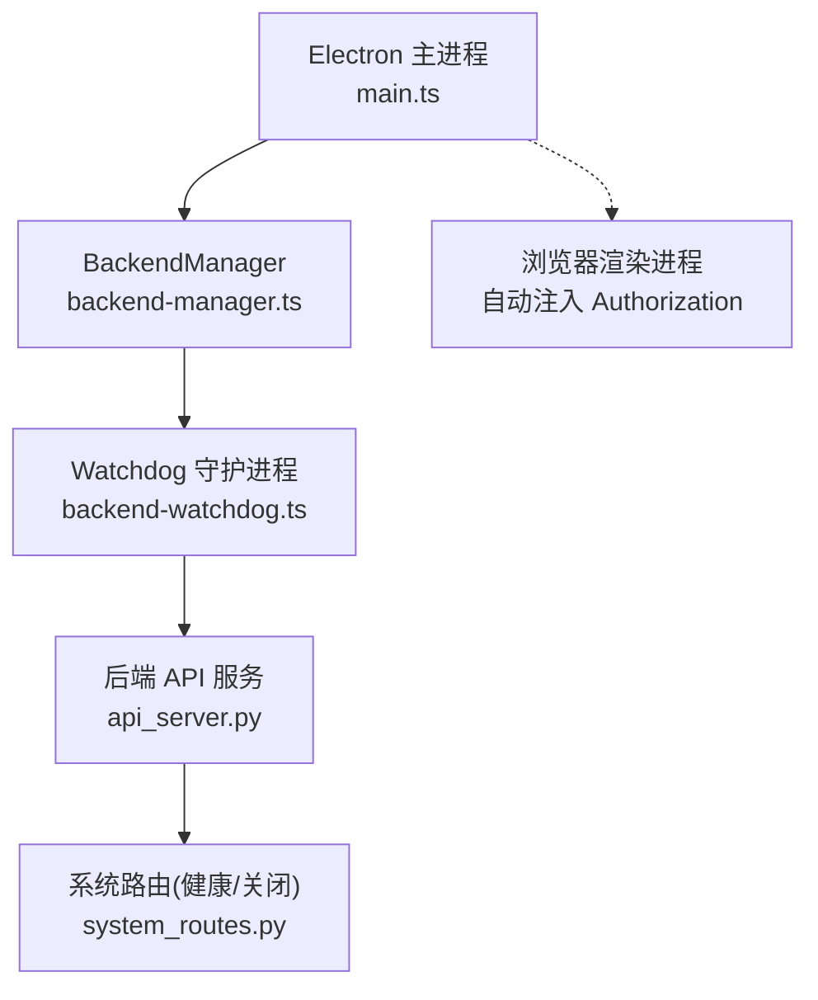
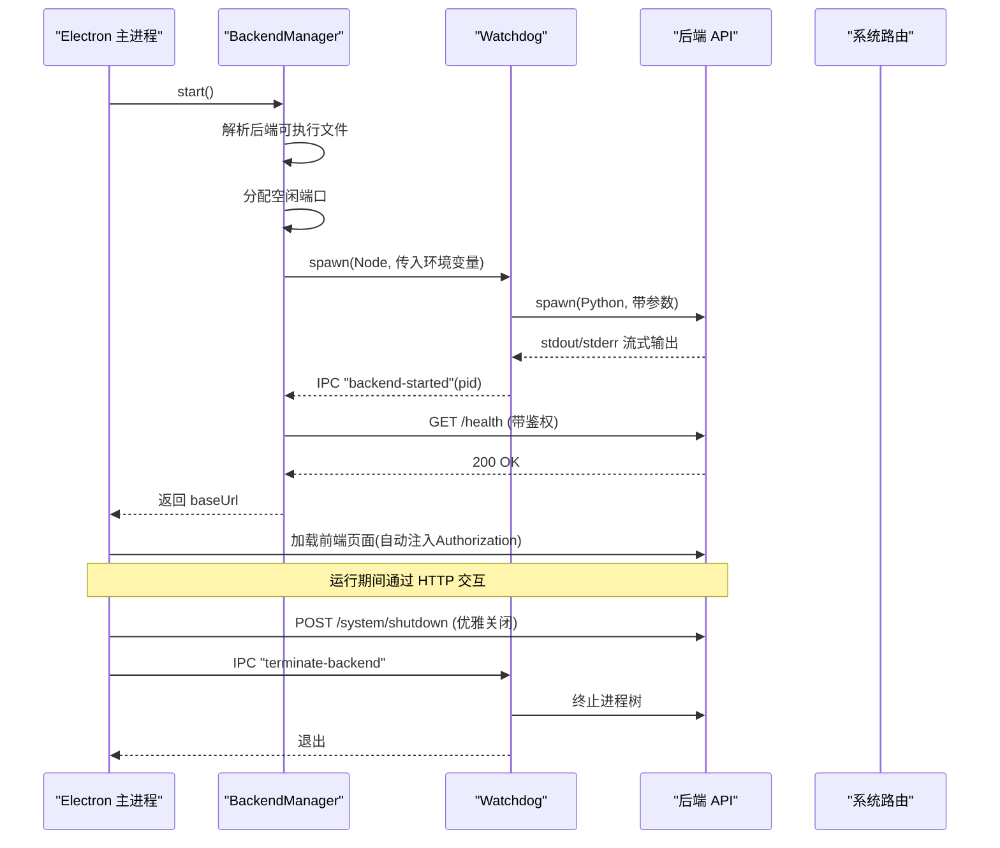
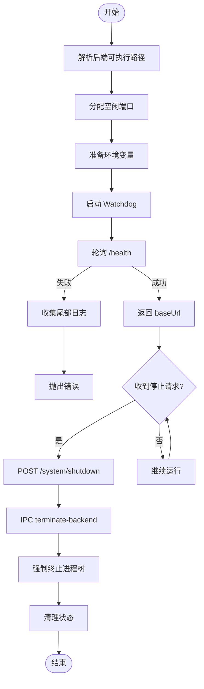
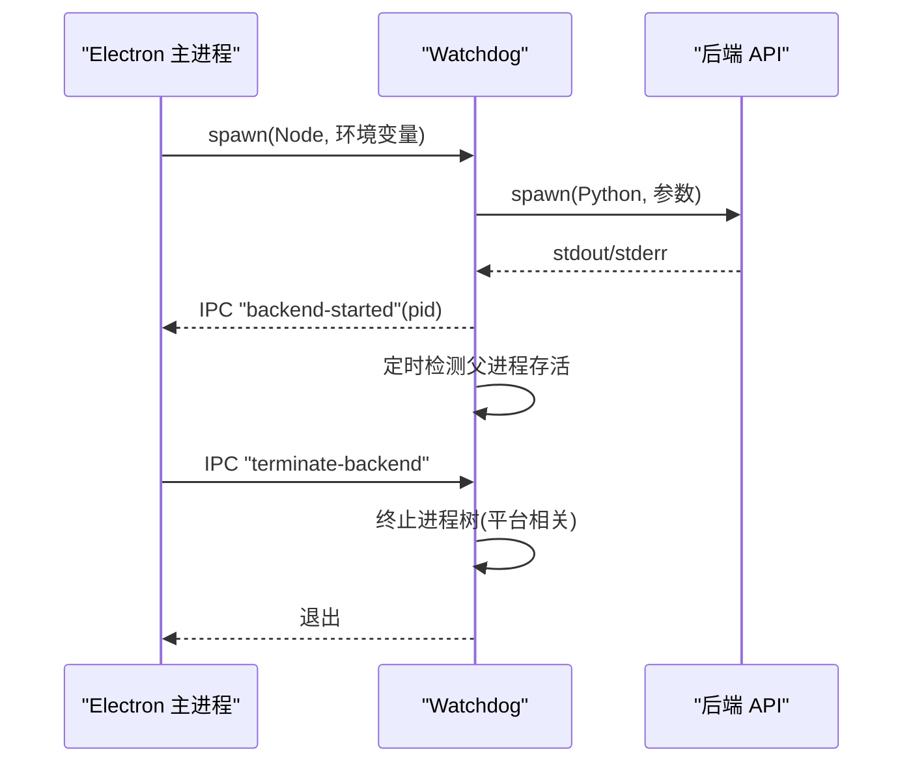

# 进程管理

<cite>
**本文引用的文件**
- [backend-manager.ts](file://desktop/electron/src/backend-manager.ts)
- [backend-watchdog.ts](file://desktop/electron/src/backend-watchdog.ts)
- [main.ts](file://desktop/electron/src/main.ts)
- [api_server.py](file://agent/api_server.py)
- [system_routes.py](file://agent/src/api/system_routes.py)
</cite>

## 目录
1. [简介](#简介)
2. [项目结构](#项目结构)
3. [核心组件](#核心组件)
4. [架构总览](#架构总览)
5. [详细组件分析](#详细组件分析)
6. [依赖关系分析](#依赖关系分析)
7. [性能考量](#性能考量)
8. [故障排查指南](#故障排查指南)
9. [结论](#结论)
10. [附录](#附录)

## 简介
本技术文档聚焦桌面应用的后端进程管理，围绕 BackendManager 的进程生命周期（启动、监控、停止）、Watchdog 守护进程的健壮性设计（健康检查、异常处理、自动终止/重启策略）、进程间通信协议（IPC、标准流、信号）、端口分配与冲突解决、错误处理与故障恢复、跨平台兼容（Windows/Linux/macOS）等主题进行系统化说明。同时提供调试技巧与实际使用示例，帮助读者快速定位问题并优化系统稳定性。

## 项目结构
桌面端 Electron 主进程通过 BackendManager 负责后端 Python API 服务的发现、启动、健康检查与优雅关闭；通过独立的 Watchdog 子进程托管后端进程，实现父子进程解耦与资源清理。Electron 主进程还负责注入安全头、本地回环访问控制、日志打开与菜单操作等。后端服务基于 FastAPI/Uvicorn，暴露 health 与 system/shutdown 等关键端点。

图表来源
- [main.ts:148-192](file://desktop/electron/src/main.ts#L148-L192)
- [backend-manager.ts:63-146](file://desktop/electron/src/backend-manager.ts#L63-L146)
- [backend-watchdog.ts:31-68](file://desktop/electron/src/backend-watchdog.ts#L31-L68)
- [api_server.py:321-395](file://agent/api_server.py#L321-L395)
- [system_routes.py:197-200](file://agent/src/api/system_routes.py#L197-L200)

章节来源
- [main.ts:148-192](file://desktop/electron/src/main.ts#L148-L192)
- [backend-manager.ts:63-146](file://desktop/electron/src/backend-manager.ts#L63-L146)
- [backend-watchdog.ts:31-68](file://desktop/electron/src/backend-watchdog.ts#L31-L68)
- [api_server.py:321-395](file://agent/api_server.py#L321-L395)
- [system_routes.py:197-200](file://agent/src/api/system_routes.py#L197-L200)

## 核心组件
- BackendManager：负责后端可执行文件的解析、动态端口选择、环境变量注入、Watchdog 启动、健康检查、日志捕获、优雅关闭与强制终止。
- Watchdog：独立 Node.js 子进程，负责启动后端、转发标准输出/错误、监控父进程存活、接收终止指令、清理进程树。
- Electron 主进程：创建窗口、注册 IPC、注入安全头、加载后端 URL、菜单与日志入口、统一错误上报。
- 后端 API：FastAPI + Uvicorn，提供 health 与 system/shutdown 等端点，支持开发模式与生产静态资源挂载。

章节来源
- [backend-manager.ts:52-266](file://desktop/electron/src/backend-manager.ts#L52-L266)
- [backend-watchdog.ts:1-167](file://desktop/electron/src/backend-watchdog.ts#L1-L167)
- [main.ts:49-192](file://desktop/electron/src/main.ts#L49-L192)
- [api_server.py:321-395](file://agent/api_server.py#L321-L395)

## 架构总览
整体采用“主进程 -> 守护进程 -> 后端服务”的分层架构，通过环境变量传递配置，通过 HTTP 进行健康检查与优雅关闭，通过 IPC 进行终止控制，通过标准流进行日志采集。

图表来源
- [backend-manager.ts:63-146](file://desktop/electron/src/backend-manager.ts#L63-L146)
- [backend-manager.ts:148-187](file://desktop/electron/src/backend-manager.ts#L148-L187)
- [backend-manager.ts:261-286](file://desktop/electron/src/backend-manager.ts#L261-L286)
- [backend-watchdog.ts:31-68](file://desktop/electron/src/backend-watchdog.ts#L31-L68)
- [backend-watchdog.ts:74-101](file://desktop/electron/src/backend-watchdog.ts#L74-L101)
- [api_server.py:321-395](file://agent/api_server.py#L321-L395)
- [system_routes.py:51-55](file://agent/src/api/system_routes.py#L51-L55)

## 详细组件分析

### BackendManager 进程生命周期管理
- 启动流程
  - 解析后端可执行路径：优先环境变量覆盖，其次打包产物路径，再尝试源码工程根下的 .venv，最后 PATH 查找。
  - 动态端口选择：绑定 127.0.0.1:0 获取空闲端口后释放，避免冲突。
  - 环境准备：写入 API_AUTH_KEY、桌面专用标志、工作目录、GTK 二进制路径等。
  - 启动 Watchdog：以 Node 子进程方式启动，stdio 管道捕获输出，IPC 监听消息。
  - 健康检查：轮询 /health，超时保护，失败时收集尾部日志。
- 停止流程
  - 先尝试调用 /system/shutdown 优雅关闭后端。
  - 等待 Watchdog 退出或超时，若仍在运行则发送 IPC 终止命令。
  - 强制终止：非 Windows 使用 SIGKILL，Windows 使用 taskkill /T /F 终止进程树。
  - 清理状态：重置 PID、URL、日志流等。

图表来源
- [backend-manager.ts:63-146](file://desktop/electron/src/backend-manager.ts#L63-L146)
- [backend-manager.ts:148-187](file://desktop/electron/src/backend-manager.ts#L148-L187)
- [backend-manager.ts:261-286](file://desktop/electron/src/backend-manager.ts#L261-L286)
- [backend-manager.ts:413-429](file://desktop/electron/src/backend-manager.ts#L413-L429)

章节来源
- [backend-manager.ts:63-146](file://desktop/electron/src/backend-manager.ts#L63-L146)
- [backend-manager.ts:148-187](file://desktop/electron/src/backend-manager.ts#L148-L187)
- [backend-manager.ts:261-286](file://desktop/electron/src/backend-manager.ts#L261-L286)
- [backend-manager.ts:413-429](file://desktop/electron/src/backend-manager.ts#L413-L429)

### Watchdog 守护进程设计与实现
- 职责
  - 启动后端进程，透传标准输出/错误到 Watchdog 的标准流。
  - 周期性检测父进程存活，若父进程退出则终止后端。
  - 接收 IPC “terminate-backend”，通知后端并清理进程树。
  - 监听 SIGTERM/SIGINT，统一走终止流程。
- 健康与异常
  - 后端启动成功后向父进程发送 “backend-started”。
  - 后端 error/exit 事件上报父进程，并在必要时退出自身。
- 终止策略
  - 优雅终止：先发送 IPC 给父进程表示正在终止，随后按平台终止进程树（Windows 用 taskkill，Unix 用 SIGKILL）。
  - 超时保护：等待后端退出超过阈值后仍强制退出。

图表来源
- [backend-watchdog.ts:31-68](file://desktop/electron/src/backend-watchdog.ts#L31-L68)
- [backend-watchdog.ts:74-101](file://desktop/electron/src/backend-watchdog.ts#L74-L101)
- [backend-watchdog.ts:103-117](file://desktop/electron/src/backend-watchdog.ts#L103-L117)

章节来源
- [backend-watchdog.ts:31-68](file://desktop/electron/src/backend-watchdog.ts#L31-L68)
- [backend-watchdog.ts:74-101](file://desktop/electron/src/backend-watchdog.ts#L74-L101)
- [backend-watchdog.ts:103-117](file://desktop/electron/src/backend-watchdog.ts#L103-L117)

### 进程间通信协议
- 环境变量传递
  - 父进程向 Watchdog 传递后端可执行路径、工作目录、编码后的参数数组、父进程 PID、桌面专用标志等。
  - Watchdog 清理不需要的桌面/测试相关环境变量后再启动后端。
- IPC 消息
  - Watchdog -> 父进程：backend-started、backend-error、backend-exited、watchdog-terminating。
  - 父进程 -> Watchdog：terminate-backend。
- 标准输入输出流
  - Watchdog 将后端 stdout/stderr 管道到自身 stdout/stderr，便于日志聚合。
- 信号处理
  - Watchdog 监听 SIGTERM/SIGINT，统一进入终止流程。
  - 后端通过 /system/shutdown 触发优雅关闭，最终由系统路由发送 SIGTERM 终止当前进程。

章节来源
- [backend-manager.ts:102-137](file://desktop/electron/src/backend-manager.ts#L102-L137)
- [backend-manager.ts:237-259](file://desktop/electron/src/backend-manager.ts#L237-L259)
- [backend-watchdog.ts:16-36](file://desktop/electron/src/backend-watchdog.ts#L16-L36)
- [backend-watchdog.ts:74-86](file://desktop/electron/src/backend-watchdog.ts#L74-L86)
- [system_routes.py:51-55](file://agent/src/api/system_routes.py#L51-L55)

### 端口分配策略与冲突解决
- 动态端口选择：通过创建临时 TCP 服务器绑定 127.0.0.1:0 获取空闲端口，立即释放，确保无竞争。
- 绑定地址限制：默认仅绑定 127.0.0.1，避免外部网络访问。
- 冲突检测：仅在分配阶段检测占用，运行时不再重复检测；若后端启动失败，健康检查会超时并上报错误。
- 资源清理：停止流程中无论是否成功关闭后端，都会尝试强制终止进程树，避免僵尸进程占用端口。

章节来源
- [backend-manager.ts:413-429](file://desktop/electron/src/backend-manager.ts#L413-L429)
- [backend-manager.ts:148-187](file://desktop/electron/src/backend-manager.ts#L148-L187)
- [api_server.py:360-374](file://agent/api_server.py#L360-L374)

### 错误处理与故障恢复
- 健康检查超时：在限定时间内轮询 /health，失败时收集尾部日志并抛出错误。
- 意外退出：Watchdog 退出时若未处于停止流程，则上报“后端意外退出”消息。
- 日志收集：实时捕获 Watchdog 的 stdout/stderr，保留最近若干行用于诊断。
- 状态同步：通过 IPC 消息保持父子进程状态一致（启动、错误、退出、终止中）。
- 优雅关闭：优先调用 /system/shutdown，失败则降级为强制终止。

章节来源
- [backend-manager.ts:261-286](file://desktop/electron/src/backend-manager.ts#L261-L286)
- [backend-manager.ts:131-140](file://desktop/electron/src/backend-manager.ts#L131-L140)
- [backend-manager.ts:288-304](file://desktop/electron/src/backend-manager.ts#L288-L304)
- [backend-watchdog.ts:57-68](file://desktop/electron/src/backend-watchdog.ts#L57-L68)
- [system_routes.py:51-55](file://agent/src/api/system_routes.py#L51-L55)

### 跨平台兼容性处理
- 路径解析
  - 打包环境下 __dirname 位于 asar 内，Node 无法直接作为 cwd，因此设置 resourcesPath 作为 Watchdog 的工作目录。
  - GTK 二进制目录动态加入 PATH 与 WEASYPRINT_DLL_DIRECTORIES，确保 PDF 渲染能力。
- 权限与安全
  - 仅允许本地回环访问，渲染进程对后端请求自动注入 Authorization。
  - 非打包模式下允许从源码工程根发现后端，便于开发调试。
- 进程终止
  - Windows 使用 taskkill /T /F 终止进程树；其他平台使用 SIGKILL。
- 编码与缓冲
  - 设置 PYTHONUTF8=1、PYTHONUNBUFFERED=1，保证日志输出正确且即时。

章节来源
- [backend-manager.ts:129-137](file://desktop/electron/src/backend-manager.ts#L129-L137)
- [backend-manager.ts:107-127](file://desktop/electron/src/backend-manager.ts#L107-L127)
- [backend-manager.ts:520-537](file://desktop/electron/src/backend-manager.ts#L520-L537)
- [main.ts:85-98](file://desktop/electron/src/main.ts#L85-L98)

### 实际示例与调试技巧
- 启动与停止
  - 启动：调用 BackendManager.start()，等待健康检查通过后加载 URL。
  - 停止：调用 BackendManager.stop()，先优雅关闭再强制终止。
- 观察日志
  - 打开应用日志目录，查看当日 desktop-YYYYMMDD.log，关注 WATCHDOG 与 SHUTDOWN 标签。
- 健康检查
  - 手动访问 http://127.0.0.1:{port}/health 并携带 Authorization: Bearer {key}，验证后端就绪。
- 强制回收
  - 若后端卡死，可通过任务管理器或命令行工具终止 Watchdog 及其进程树。
- 开发模式
  - 在非打包模式下，允许从源码工程根发现后端，便于热更新与调试。

章节来源
- [main.ts:148-192](file://desktop/electron/src/main.ts#L148-L192)
- [backend-manager.ts:63-146](file://desktop/electron/src/backend-manager.ts#L63-L146)
- [backend-manager.ts:148-187](file://desktop/electron/src/backend-manager.ts#L148-L187)

## 依赖关系分析
- 模块耦合
  - main.ts 依赖 BackendManager 完成后端生命周期管理。
  - BackendManager 依赖文件系统、网络、child_process 与本地端口分配。
  - Watchdog 依赖 child_process、信号与 IPC。
  - 后端 API 依赖 FastAPI/Uvicorn 与系统路由。
- 外部依赖
  - 操作系统进程管理（taskkill/SIGKILL）。
  - 网络栈（HTTP/localhost）。
  - 文件系统（日志、资源路径）。

图表来源
- [main.ts:148-192](file://desktop/electron/src/main.ts#L148-L192)
- [backend-manager.ts:63-146](file://desktop/electron/src/backend-manager.ts#L63-L146)
- [backend-watchdog.ts:31-68](file://desktop/electron/src/backend-watchdog.ts#L31-L68)
- [api_server.py:321-395](file://agent/api_server.py#L321-L395)
- [system_routes.py:197-200](file://agent/src/api/system_routes.py#L197-L200)

章节来源
- [main.ts:148-192](file://desktop/electron/src/main.ts#L148-L192)
- [backend-manager.ts:63-146](file://desktop/electron/src/backend-manager.ts#L63-L146)
- [backend-watchdog.ts:31-68](file://desktop/electron/src/backend-watchdog.ts#L31-L68)
- [api_server.py:321-395](file://agent/api_server.py#L321-L395)
- [system_routes.py:197-200](file://agent/src/api/system_routes.py#L197-L200)

## 性能考量
- 健康检查频率与超时：短间隔轮询（100ms）与合理超时（180s），避免阻塞启动。
- 日志写入：按行追加写入，限制内存中的最近输出长度，减少 I/O 压力。
- 端口分配：仅绑定一次临时服务器，最小化网络开销。
- 进程树终止：平台差异化终止策略，避免长时间挂起。
- 开发模式：可选启动 Vite 开发服务器，便于前端联调。

[本节为通用指导，无需具体文件引用]

## 故障排查指南
- 后端未启动
  - 检查健康检查是否超时，查看尾部日志与 Watchdog 消息。
  - 确认端口未被占用，重新分配。
- 后端意外退出
  - 查看 Watchdog 的 backend-exited 消息，结合后端日志定位崩溃原因。
- 无法关闭后端
  - 确认 /system/shutdown 是否可达，必要时强制终止进程树。
- 日志缺失
  - 确认日志目录存在且可写，检查 stdout/stderr 管道是否正常。
- 跨平台问题
  - Windows 下确认 taskkill 可用；macOS/Linux 下确认 SIGKILL 生效。

章节来源
- [backend-manager.ts:261-286](file://desktop/electron/src/backend-manager.ts#L261-L286)
- [backend-manager.ts:131-140](file://desktop/electron/src/backend-manager.ts#L131-L140)
- [backend-manager.ts:148-187](file://desktop/electron/src/backend-manager.ts#L148-L187)
- [backend-watchdog.ts:57-68](file://desktop/electron/src/backend-watchdog.ts#L57-L68)

## 结论
该进程管理系统通过 BackendManager 与 Watchdog 的协作，实现了后端服务的可靠启动、健康检查、优雅关闭与强制回收。借助 IPC、环境变量与标准流，系统在多平台上具备良好的一致性与可维护性。配合严格的本地回环访问控制与安全的鉴权注入，保障了桌面端与后端之间的安全通信。建议在生产环境中持续监控健康检查与日志，及时识别并处理异常，以提升整体稳定性。

[本节为总结，无需具体文件引用]

## 附录
- 关键端点
  - GET /health：健康检查，需携带 Authorization。
  - POST /system/shutdown：优雅关闭后端，需携带 Authorization。
- 环境变量要点
  - API_AUTH_KEY：后端鉴权密钥。
  - VIBE_TRADING_DESKTOP_*：桌面端专用标志与参数。
  - PYTHONUTF8/PYTHONUNBUFFERED：日志编码与缓冲控制。
- 调试入口
  - 打开日志目录：通过菜单或 IPC 打开应用日志文件夹。
  - 重启后端：通过菜单或 IPC 触发重启流程。

章节来源
- [system_routes.py:51-55](file://agent/src/api/system_routes.py#L51-L55)
- [backend-manager.ts:102-137](file://desktop/electron/src/backend-manager.ts#L102-L137)
- [main.ts:119-146](file://desktop/electron/src/main.ts#L119-L146)