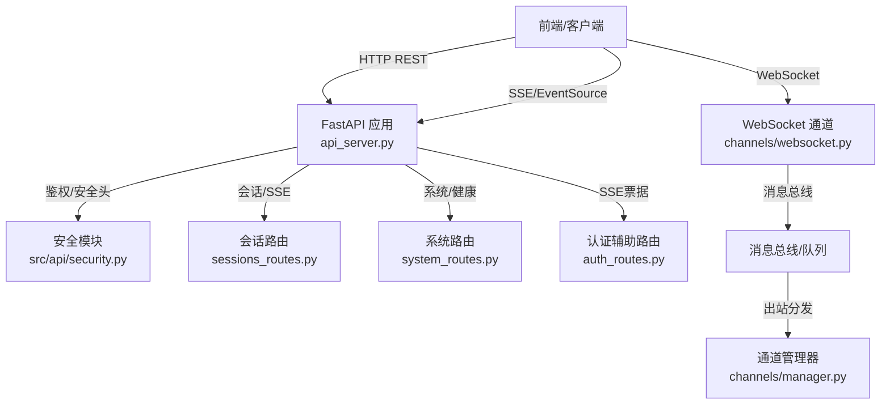
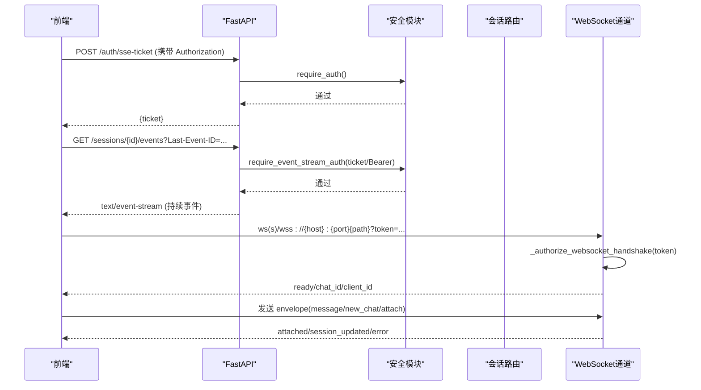
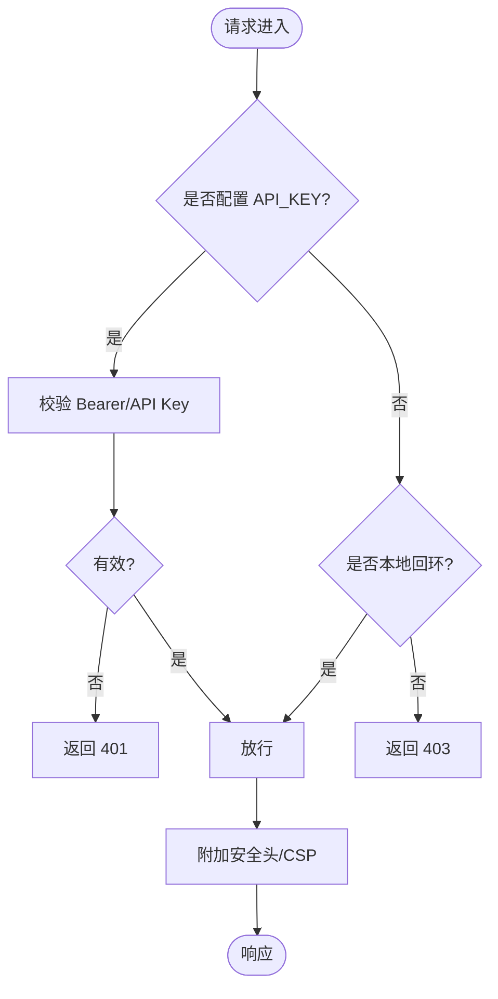
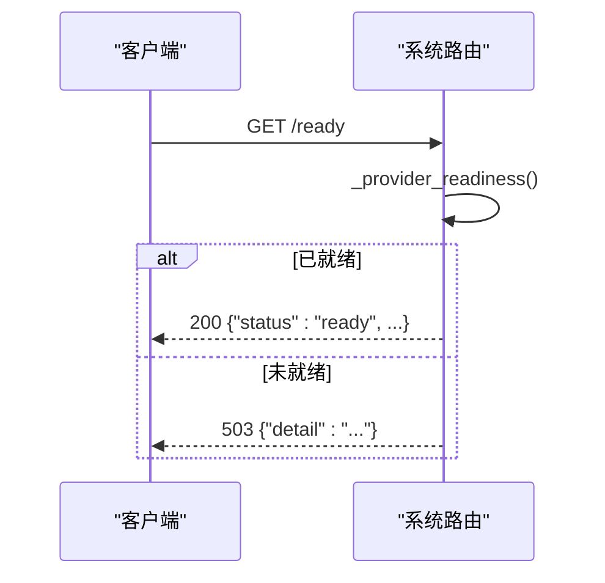
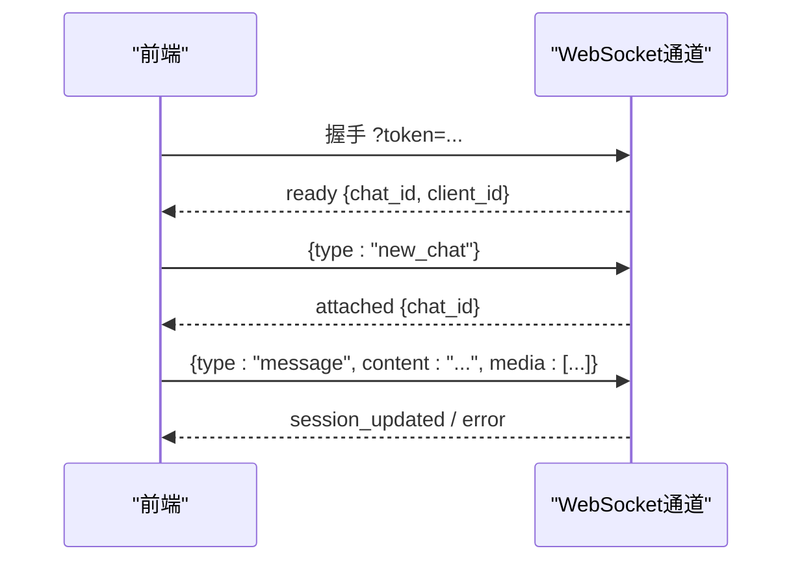
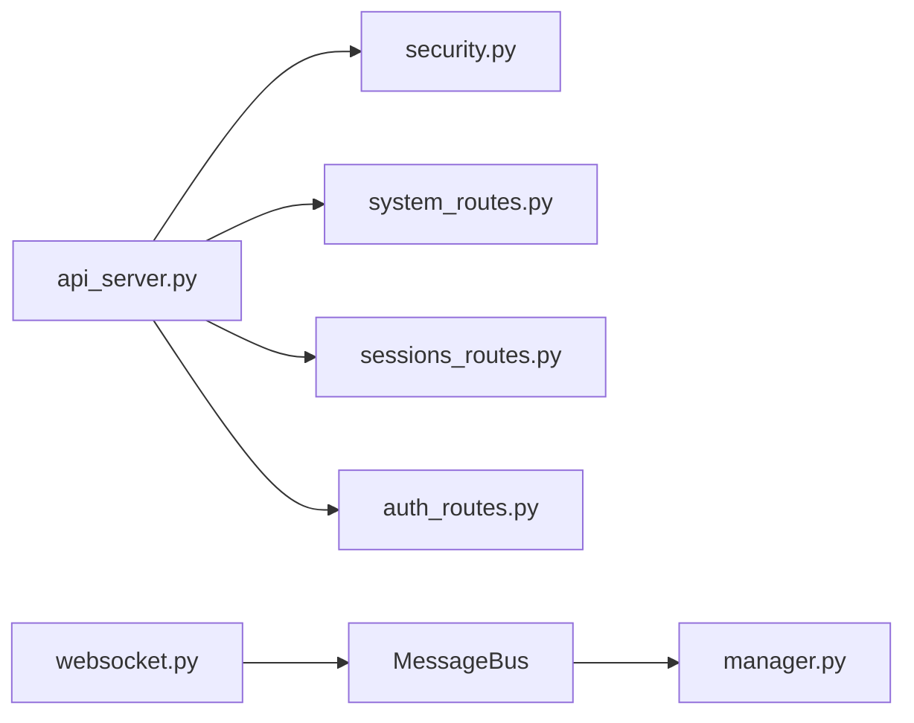

# 通信协议

<cite>
**本文引用的文件**
- [api_server.py](file://agent/api_server.py)
- [security.py](file://agent/src/api/security.py)
- [auth_routes.py](file://agent/src/api/auth_routes.py)
- [system_routes.py](file://agent/src/api/system_routes.py)
- [sessions_routes.py](file://agent/src/api/sessions_routes.py)
- [websocket.py](file://agent/src/channels/websocket.py)
- [base.py](file://agent/src/channels/base.py)
- [manager.py](file://agent/src/channels/manager.py)
- [accessor.py](file://agent/src/config/accessor.py)
</cite>

## 目录
1. [简介](#简介)
2. [项目结构](#项目结构)
3. [核心组件](#核心组件)
4. [架构总览](#架构总览)
5. [详细组件分析](#详细组件分析)
6. [依赖关系分析](#依赖关系分析)
7. [性能与负载均衡](#性能与负载均衡)
8. [故障排查指南](#故障排查指南)
9. [结论](#结论)
10. [附录：API 契约与示例](#附录api-契约与示例)

## 简介
本技术文档聚焦前后端通信协议，覆盖以下方面：
- HTTP API 通信机制：RESTful 接口设计、请求/响应格式、错误处理策略
- 认证与安全：Bearer Token 验证、API Key 管理、安全头设置、跨域策略
- WebSocket 实时通信：连接建立、消息格式、事件类型、重连机制
- 健康检查与状态同步：心跳检测、服务状态查询、故障转移
- 错误处理与重试：网络异常、超时控制、降级策略
- 性能优化与负载均衡：连接池、请求合并、缓存策略
- 实际通信示例与调试方法

## 项目结构
后端采用 FastAPI 作为 HTTP 服务入口，统一挂载各功能路由模块；同时内置 WebSocket 通道用于实时交互。安全能力集中在安全模块中，提供鉴权、CORS、安全头等通用中间件。

**图表来源**
- [api_server.py:166-185](file://agent/api_server.py#L166-L185)
- [security.py:166-253](file://agent/src/api/security.py#L166-L253)
- [system_routes.py:235-272](file://agent/src/api/system_routes.py#L235-L272)
- [sessions_routes.py:752-800](file://agent/src/api/sessions_routes.py#L752-L800)
- [websocket.py:447-528](file://agent/src/channels/websocket.py#L447-L528)
- [manager.py:394-530](file://agent/src/channels/manager.py#L394-L530)

**章节来源**
- [api_server.py:166-185](file://agent/api_server.py#L166-L185)
- [security.py:166-253](file://agent/src/api/security.py#L166-L253)

## 核心组件
- HTTP 服务装配器：创建 FastAPI 应用、注册中间件（CORS、安全头、本地主机校验）、挂载各路由模块
- 安全与鉴权：支持 Bearer Token、API Key、SSE 一次性票据、跨站请求防护、CSP/权限策略
- 会话与 SSE：会话 CRUD、目标事件流（SSE）推送、Last-Event-ID 断点续传
- WebSocket 通道：独立 WS 服务器，支持 token 签发路径、握手鉴权、消息信封、媒体上传限制、订阅/广播
- 通道管理器：出站消息去重、流式增量合并、指数退避重试、多通道分发

**章节来源**
- [api_server.py:166-185](file://agent/api_server.py#L166-L185)
- [security.py:347-622](file://agent/src/api/security.py#L347-L622)
- [sessions_routes.py:335-800](file://agent/src/api/sessions_routes.py#L335-L800)
- [websocket.py:53-143](file://agent/src/channels/websocket.py#L53-L143)
- [manager.py:254-419](file://agent/src/channels/manager.py#L254-L419)

## 架构总览
整体通信由三类通道组成：
- REST API：用于资源操作、配置、运行控制等
- SSE：用于长连接事件推送（如会话事件），支持 Last-Event-ID 重放
- WebSocket：用于双向实时通信（聊天、媒体、工作区范围控制等）

**图表来源**
- [auth_routes.py:46-55](file://agent/src/api/auth_routes.py#L46-L55)
- [security.py:571-622](file://agent/src/api/security.py#L571-L622)
- [sessions_routes.py:752-800](file://agent/src/api/sessions_routes.py#L752-L800)
- [websocket.py:417-453](file://agent/src/channels/websocket.py#L417-L453)
- [websocket.py:530-589](file://agent/src/channels/websocket.py#L530-L589)

## 详细组件分析

### HTTP 认证与安全
- 认证方式
  - Bearer Token：通过 HTTPAuthorizationCredentials 解析 Authorization 头
  - API Key：从环境变量读取并比较，未配置时允许本地回环访问
  - SSE 票据：浏览器无法发送 Authorization 头，需先 POST /auth/sse-ticket 换取一次性 ticket，再在 SSE URL 中以 ?ticket= 传递
- 安全头与跨域
  - 强制 CSP、X-Content-Type-Options、X-Frame-Options、Permissions-Policy、Referrer-Policy
  - CORS 白名单可配置，禁止 credentialed 的 * 通配
  - 拒绝跨站浏览器请求（基于 sec-fetch-site 和 origin/host 校验）
- 日志脱敏
  - 对访问日志中的 api_key=/ticket= 值进行脱敏，避免泄露

**图表来源**
- [security.py:347-622](file://agent/src/api/security.py#L347-L622)
- [security.py:166-253](file://agent/src/api/security.py#L166-L253)
- [security.py:260-297](file://agent/src/api/security.py#L260-L297)

**章节来源**
- [security.py:347-622](file://agent/src/api/security.py#L347-L622)
- [security.py:166-253](file://agent/src/api/security.py#L166-L253)
- [auth_routes.py:46-55](file://agent/src/api/auth_routes.py#L46-L55)

### REST API 设计与错误处理
- 健康检查
  - GET /live：进程存活探针，无条件返回 healthy
  - GET /health：兼容别名
  - GET /ready：就绪探针，检查 LLM 提供商配置与凭据可用性，不可用返回 503
- 会话与事件
  - 会话 CRUD：/sessions、/sessions/{id}
  - 目标管理：/sessions/{id}/goal、/sessions/{id}/goal/evidence、/sessions/{id}/goal/status
  - 消息发送：POST /sessions/{id}/messages
  - 取消执行：POST /sessions/{id}/cancel
  - 事件流：GET /sessions/{id}/events（SSE），支持 Last-Event-ID 重放
- 错误处理
  - 参数校验失败：400
  - 资源不存在：404
  - 冲突（如会话忙）：409
  - 上游失败：502/500
  - 限流：429（如 /correlation 相关接口）

**图表来源**
- [system_routes.py:235-272](file://agent/src/api/system_routes.py#L235-L272)

**章节来源**
- [system_routes.py:235-360](file://agent/src/api/system_routes.py#L235-L360)
- [sessions_routes.py:335-800](file://agent/src/api/sessions_routes.py#L335-L800)

### WebSocket 实时通信
- 连接建立
  - 支持 ws/wss，可通过静态 token 或动态 token_issue_path 获取短期 token
  - 握手阶段校验 token，未配置且要求 token 则拒绝
  - 连接成功后下发 ready 事件，包含 chat_id、client_id
- 消息格式
  - 新式信封：JSON 对象含 type 字段，支持 new_chat、attach、message、transcribe_audio、set_workspace_scope、fork_chat 等
  - 旧式文本：直接发送文本内容，自动解析 content/text/message 字段
  - 媒体附件：data_url base64，限制图片/视频数量与大小，MIME 白名单校验
- 事件类型
  - attached：成功附着到某个 chat_id
  - session_updated：会话元数据更新（如工作区范围）
  - error：错误提示（如 invalid chat_id、missing content、image_rejected）
- 重连机制
  - 客户端应实现指数退避重连，并在重连时带上 Last-Event-ID（适用于 SSE）
  - WebSocket 侧通过订阅/广播维持状态，重连后根据 chat_id 恢复上下文

**图表来源**
- [websocket.py:417-453](file://agent/src/channels/websocket.py#L417-L453)
- [websocket.py:530-589](file://agent/src/channels/websocket.py#L530-L589)
- [websocket.py:671-810](file://agent/src/channels/websocket.py#L671-L810)

**章节来源**
- [websocket.py:53-143](file://agent/src/channels/websocket.py#L53-L143)
- [websocket.py:254-262](file://agent/src/channels/websocket.py#L254-L262)
- [websocket.py:417-453](file://agent/src/channels/websocket.py#L417-L453)
- [websocket.py:530-589](file://agent/src/channels/websocket.py#L530-L589)
- [websocket.py:671-810](file://agent/src/channels/websocket.py#L671-L810)

### 健康检查与状态同步
- 健康检查
  - /live：进程级存活
  - /health：兼容别名
  - /ready：服务就绪（LLM 提供商配置与凭据可用）
- 状态同步
  - SSE：/sessions/{id}/events 推送 agent 事件，支持 Last-Event-ID 断点续传
  - WebSocket：connected 后下发 ready，后续通过事件驱动状态更新（attached、session_updated 等）

**章节来源**
- [system_routes.py:235-272](file://agent/src/api/system_routes.py#L235-L272)
- [sessions_routes.py:752-800](file://agent/src/api/sessions_routes.py#L752-L800)
- [websocket.py:530-589](file://agent/src/channels/websocket.py#L530-L589)

### 错误处理与重试机制
- 网络异常与超时
  - 数据加载器层提供 retry_with_budget，按预算与退避策略重试瞬态错误
  - Telegram 通道实现超时与 Flood Control 的重试逻辑
- 出站消息重试
  - 通道管理器对 send 失败进行指数退避重试（默认多次尝试）
  - 流式增量合并减少重复调用
- 降级策略
  - 就绪探针不阻塞网络，仅检查配置与凭据
  - 文档页面在 keyless 模式下受限，防止未授权暴露

**章节来源**
- [backtest/loaders/base.py:381-414](file://agent/backtest/loaders/base.py#L381-L414)
- [telegram.py:860-880](file://agent/src/channels/telegram.py#L860-L880)
- [manager.py:532-563](file://agent/src/channels/manager.py#L532-L563)
- [system_routes.py:235-272](file://agent/src/api/system_routes.py#L235-L272)

### 性能优化与负载均衡
- 连接池管理
  - 外部平台（如 Telegram）使用独立的 HTTPXRequest 连接池，区分轮询与发送池，避免饥饿
- 请求合并
  - 出站消息对连续 _stream_delta 进行合并，降低下游调用次数
- 缓存策略
  - 配置层使用单例 EnvConfig 缓存，避免重复解析环境
  - 速率限制：/correlation 系列接口使用滑动窗口限流器保护计算密集型端点
- 负载均衡
  - 当前为单机进程内限流；如需横向扩展，可在反向代理层做负载均衡，结合无状态 API 设计

**章节来源**
- [telegram.py:516-542](file://agent/src/channels/telegram.py#L516-L542)
- [manager.py:482-530](file://agent/src/channels/manager.py#L482-L530)
- [accessor.py:52-76](file://agent/src/config/accessor.py#L52-L76)
- [system_routes.py:62-129](file://agent/src/api/system_routes.py#L62-L129)

## 依赖关系分析
- 路由模块依赖安全模块提供的鉴权依赖（require_auth、require_event_stream_auth）
- 会话路由依赖事件总线与存储，提供 SSE 事件流
- WebSocket 通道依赖网关服务（会话、工作区、媒体、转录等）
- 通道管理器依赖消息总线，负责出站分发与重试

**图表来源**
- [api_server.py:185-303](file://agent/api_server.py#L185-L303)
- [security.py:571-622](file://agent/src/api/security.py#L571-L622)
- [sessions_routes.py:752-800](file://agent/src/api/sessions_routes.py#L752-L800)
- [websocket.py:447-528](file://agent/src/channels/websocket.py#L447-L528)
- [manager.py:394-530](file://agent/src/channels/manager.py#L394-L530)

**章节来源**
- [api_server.py:185-303](file://agent/api_server.py#L185-L303)
- [security.py:571-622](file://agent/src/api/security.py#L571-L622)
- [sessions_routes.py:752-800](file://agent/src/api/sessions_routes.py#L752-L800)
- [websocket.py:447-528](file://agent/src/channels/websocket.py#L447-L528)
- [manager.py:394-530](file://agent/src/channels/manager.py#L394-L530)

## 性能与负载均衡
- 建议实践
  - 将 /ready 作为就绪探针，/live 作为存活探针，配合编排系统进行滚动升级
  - 对 SSE 客户端实现指数退避重连与 Last-Event-ID 续传
  - 对 WebSocket 客户端实现握手失败重试与 token 刷新
  - 在高并发场景下，结合反向代理进行负载均衡，并确保无状态化
  - 对计算密集接口（如相关性矩阵）启用限流，避免过载
- 监控指标
  - 关注 /ready 返回码变化、SSE 连接数、WebSocket 活跃连接数、出站消息重试次数

[本节为通用指导，无需特定文件引用]

## 故障排查指南
- 常见问题
  - 401 未认证：检查 Authorization 头或 ticket 是否有效
  - 403 跨站被拒：检查 Origin/sec-fetch-site 与 Host 匹配
  - 404 资源不存在：确认 session_id 是否正确
  - 409 冲突：会话正在运行，等待或取消后再试
  - 429 限流：降低请求频率或等待窗口过期
  - 503 未就绪：检查 LLM 提供商配置与凭据
- 调试方法
  - 使用 /openapi.json（需鉴权）查看完整接口定义
  - 使用 /docs 或 /redoc（keyless 开发模式）交互式测试
  - 观察日志中的脱敏信息，避免敏感字段泄露
  - 对 SSE/WebSocket 抓包，核对事件序列与 Last-Event-ID

**章节来源**
- [system_routes.py:423-468](file://agent/src/api/system_routes.py#L423-L468)
- [security.py:260-297](file://agent/src/api/security.py#L260-L297)

## 结论
本系统通过统一的 FastAPI 入口提供 REST、SSE 与 WebSocket 三种通信方式，具备完善的鉴权与安全机制，支持健康检查与状态同步，具备健壮的错误处理与重试策略，并通过连接池、请求合并与限流等手段保障性能。生产部署建议结合反向代理与编排系统进行负载均衡与健康探测，客户端实现稳健的重连与续传逻辑。

[本节为总结性内容，无需特定文件引用]

## 附录：API 契约与示例

### 健康检查
- GET /live
  - 响应：{ status: "healthy", service: "Vibe-Trading API", timestamp: "..." }
- GET /health
  - 同上（兼容别名）
- GET /ready
  - 200：{ status: "ready", service: "Vibe-Trading API", timestamp: "..." }
  - 503：{ detail: "LLM provider not configured" }

**章节来源**
- [system_routes.py:235-272](file://agent/src/api/system_routes.py#L235-L272)

### 认证与票据
- POST /auth/sse-ticket
  - 请求头：Authorization: Bearer <API_KEY>
  - 响应：{ ticket: "<一次性票据>" }
- SSE 连接：GET /sessions/{id}/events?ticket=<票据> 或 Authorization: Bearer <API_KEY>
  - 支持 Last-Event-ID 续传

**章节来源**
- [auth_routes.py:46-55](file://agent/src/api/auth_routes.py#L46-L55)
- [security.py:571-622](file://agent/src/api/security.py#L571-L622)
- [sessions_routes.py:752-800](file://agent/src/api/sessions_routes.py#L752-L800)

### 会话与消息
- POST /sessions
  - 请求体：{ title: "...", config: {...} }
  - 响应：SessionResponse
- POST /sessions/{id}/messages
  - 请求体：{ content: "自然语言策略描述" }
  - 响应：MessageResponse
- GET /sessions/{id}/messages
  - 查询参数：limit
  - 响应：List[MessageResponse]
- GET /sessions/{id}/events
  - 查询参数：Last-Event-ID
  - 响应：text/event-stream

**章节来源**
- [sessions_routes.py:335-800](file://agent/src/api/sessions_routes.py#L335-L800)

### WebSocket 消息格式
- 握手：ws(s)://{host}:{port}{path}?token=<静态或短期令牌>
- 入站信封示例
  - new_chat：{ type: "new_chat" }
  - attach：{ type: "attach", chat_id: "..." }
  - message：{ type: "message", chat_id: "...", content: "...", media: [...] }
- 出站事件示例
  - ready：{ event: "ready", chat_id: "...", client_id: "..." }
  - attached：{ event: "attached", chat_id: "..." }
  - session_updated：{ event: "session_updated", chat_id: "...", scope: "metadata", workspace_scope: {...} }
  - error：{ event: "error", detail: "...", reason: "..." }

**章节来源**
- [websocket.py:417-453](file://agent/src/channels/websocket.py#L417-L453)
- [websocket.py:530-589](file://agent/src/channels/websocket.py#L530-L589)
- [websocket.py:671-810](file://agent/src/channels/websocket.py#L671-L810)