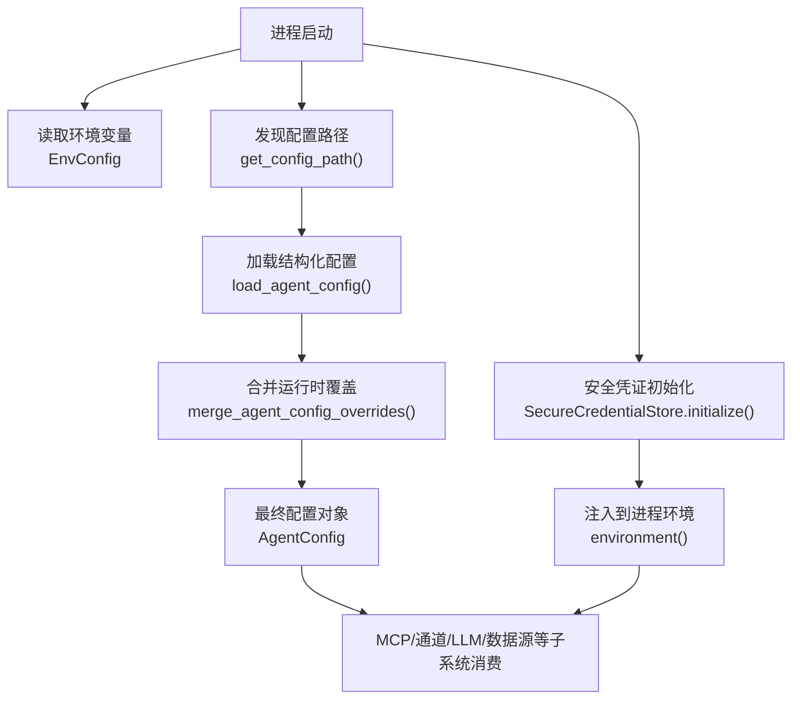
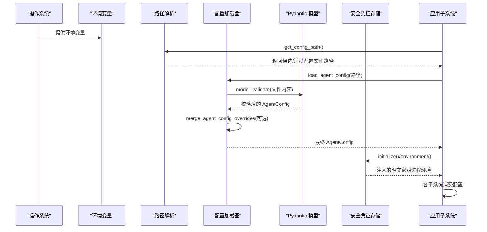
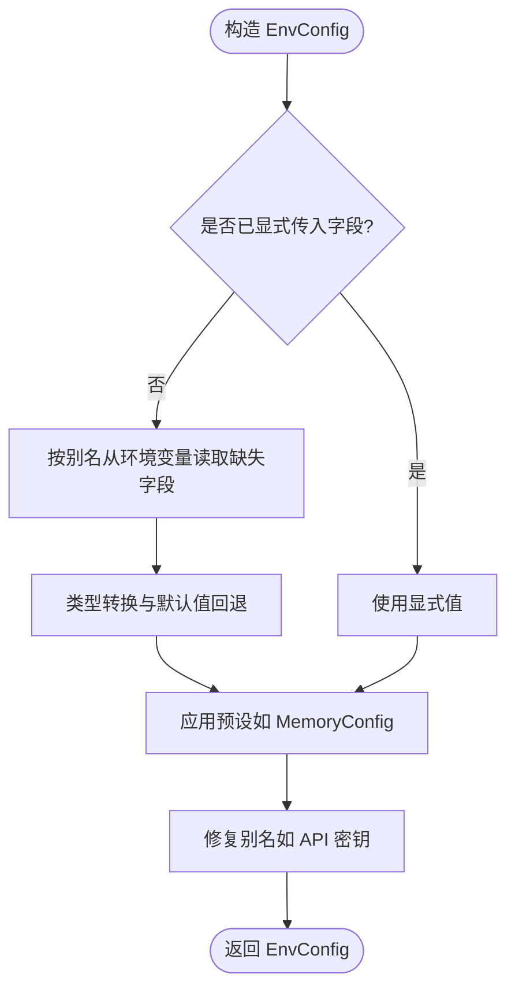
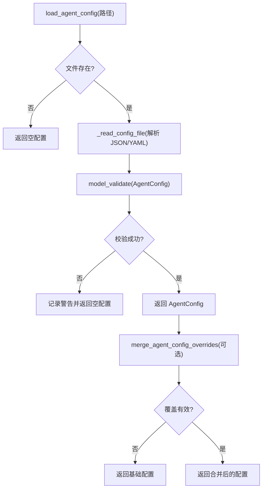
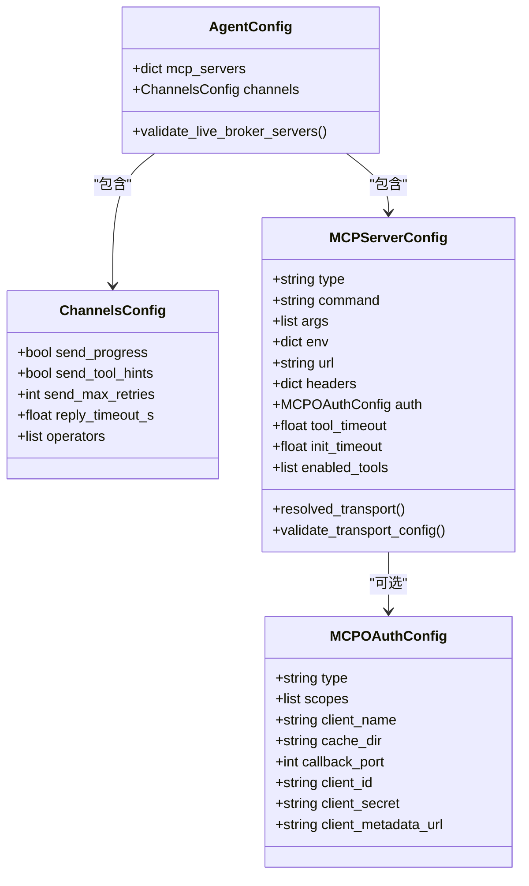
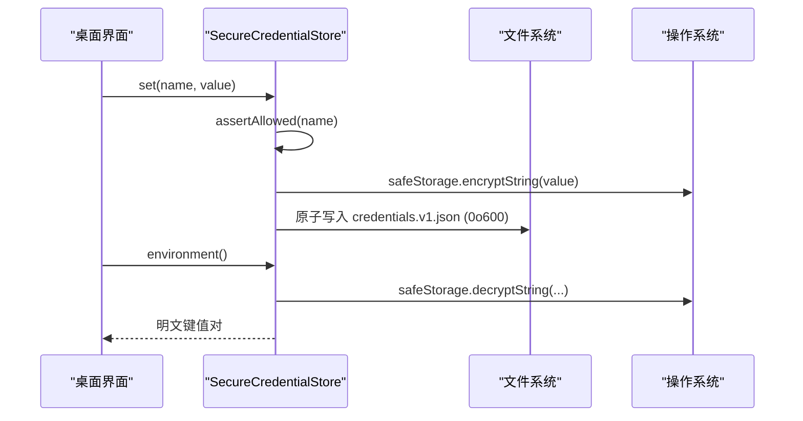
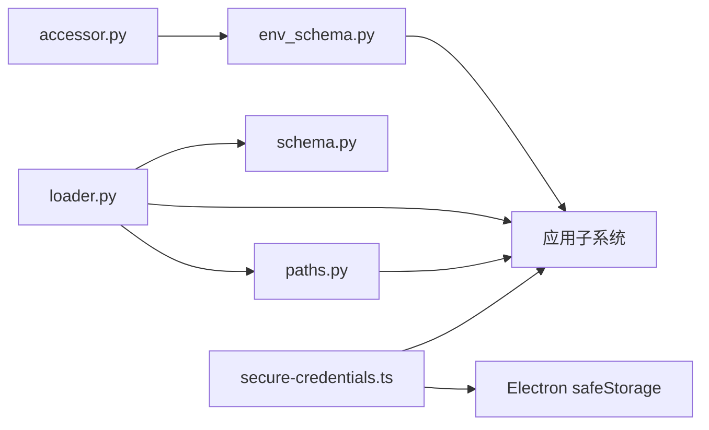

# 配置管理

<cite>
**本文引用的文件**
- [agent/src/config/__init__.py](file://agent/src/config/__init__.py)
- [agent/src/config/loader.py](file://agent/src/config/loader.py)
- [agent/src/config/schema.py](file://agent/src/config/schema.py)
- [agent/src/config/env_schema.py](file://agent/src/config/env_schema.py)
- [agent/src/config/paths.py](file://agent/src/config/paths.py)
- [agent/src/config/accessor.py](file://agent/src/config/accessor.py)
- [desktop/electron/src/secure-credentials.ts](file://desktop/electron/src/secure-credentials.ts)
</cite>

## 目录
1. [简介](#简介)
2. [项目结构](#项目结构)
3. [核心组件](#核心组件)
4. [架构总览](#架构总览)
5. [详细组件分析](#详细组件分析)
6. [依赖关系分析](#依赖关系分析)
7. [性能考量](#性能考量)
8. [故障排查指南](#故障排查指南)
9. [结论](#结论)
10. [附录：示例与最佳实践](#附录示例与最佳实践)

## 简介
本技术文档聚焦桌面应用（Electron）与后端 Agent 的配置管理体系，覆盖以下主题：
- 环境变量配置系统：定义、默认值、类型校验、布尔解析、别名兼容。
- 安全凭证管理：敏感信息加密存储、迁移、访问控制与最小权限原则。
- 配置文件结构：YAML/JSON 规范、层级组织、继承与覆盖机制。
- 配置热重载：运行时读取、缓存失效与动态更新。
- 多环境支持：开发/测试/生产的差异化配置策略。
- 配置验证与错误处理：格式校验、依赖检查、回退与回滚建议。
- 实际配置示例与最佳实践。

## 项目结构
配置体系由“结构化配置加载”“环境变量集中建模”“路径与运行时根”“安全凭证存储”四大模块组成：
- 结构化配置加载：负责从磁盘读取 agent.json/agent.yaml/yml，合并运行时覆盖，并严格校验。
- 环境变量建模：以 Pydantic 模型统一声明所有环境变量、默认值、类型约束与别名。
- 路径与运行时根：确定用户态数据目录、会话/运行产物目录、工作区等。
- 安全凭证存储：Electron 端使用 safeStorage 对敏感密钥进行本地加密持久化，并提供迁移能力。

**图示来源**
- [agent/src/config/env_schema.py:685-716](file://agent/src/config/env_schema.py#L685-L716)
- [agent/src/config/paths.py:57-87](file://agent/src/config/paths.py#L57-L87)
- [agent/src/config/loader.py:28-55](file://agent/src/config/loader.py#L28-L55)
- [agent/src/config/loader.py:57-100](file://agent/src/config/loader.py#L57-L100)
- [desktop/electron/src/secure-credentials.ts:84-123](file://desktop/electron/src/secure-credentials.ts#L84-L123)

**章节来源**
- [agent/src/config/__init__.py:1-25](file://agent/src/config/__init__.py#L1-L25)
- [agent/src/config/loader.py:28-100](file://agent/src/config/loader.py#L28-L100)
- [agent/src/config/env_schema.py:685-716](file://agent/src/config/env_schema.py#L685-L716)
- [agent/src/config/paths.py:13-87](file://agent/src/config/paths.py#L13-L87)
- [desktop/electron/src/secure-credentials.ts:84-123](file://desktop/electron/src/secure-credentials.ts#L84-L123)

## 核心组件
- 环境变量集中建模（EnvConfig 及子模型）
  - 提供统一的字段名、别名、默认值、类型约束与布尔解析。
  - 支持按功能域分组：LLM、数据源、API、Swarm、Agent 调优、路径、OCR、内存特性开关等。
- 结构化配置加载（loader）
  - 支持 JSON/YAML，失败时回退为默认空配置；支持运行时覆盖合并，含 MCP 服务器级细粒度覆盖。
  - 提供会话级覆盖清洗，防止非受信任调用者注入执行级能力（如 mcpServers）。
- 路径与运行时根（paths）
  - 通过 VIBE_TRADING_HOME 或默认 ~/.vibe-trading 定位运行时根；自动创建必要目录。
- 安全凭证存储（secure-credentials）
  - 使用 Electron safeStorage 加密保存密钥，支持从 .env 与旧 JSON 字段迁移，仅允许白名单键写入。

**章节来源**
- [agent/src/config/env_schema.py:132-593](file://agent/src/config/env_schema.py#L132-L593)
- [agent/src/config/loader.py:28-100](file://agent/src/config/loader.py#L28-L100)
- [agent/src/config/paths.py:13-113](file://agent/src/config/paths.py#L13-L113)
- [desktop/electron/src/secure-credentials.ts:68-164](file://desktop/electron/src/secure-credentials.ts#L68-L164)

## 架构总览
下图展示配置在进程生命周期中的装配顺序与数据流向：

**图示来源**
- [agent/src/config/paths.py:57-87](file://agent/src/config/paths.py#L57-L87)
- [agent/src/config/loader.py:28-100](file://agent/src/config/loader.py#L28-L100)
- [desktop/electron/src/secure-credentials.ts:84-123](file://desktop/electron/src/secure-credentials.ts#L84-L123)

## 详细组件分析

### 环境变量配置系统（EnvConfig）
- 设计要点
  - 单一事实来源：所有环境变量在 env_schema.py 中集中定义，避免分散的 os.getenv。
  - 类型与默认值：每个字段具备明确类型、默认值与范围约束（如 ge/le/gt）。
  - 布尔解析：统一接受 "1"/"true"/"yes"/"on" 等真值字符串，兼容大小写。
  - 别名兼容：部分变量存在新旧名称，通过 helper 或 validator 做兼容映射。
  - 预设模式：MemoryConfig 支持 VT_MEMORY=off|on|full 一键切换，并可被单标志覆盖。
- 关键流程
  - 构造 EnvConfig 时，若未显式传入字段，则从 os.environ 按字段别名填充缺失项。
  - 数值型环境变量若无法解析，会静默回退到默认值，避免启动期崩溃。
  - API 密钥别名：当仅设置 VIBE_TRADING_API_KEY 时，会自动复制到 api_auth_key，保证 CLI 与服务端一致。

**图示来源**
- [agent/src/config/env_schema.py:81-125](file://agent/src/config/env_schema.py#L81-L125)
- [agent/src/config/env_schema.py:601-677](file://agent/src/config/env_schema.py#L601-L677)
- [agent/src/config/env_schema.py:705-716](file://agent/src/config/env_schema.py#L705-L716)

**章节来源**
- [agent/src/config/env_schema.py:47-74](file://agent/src/config/env_schema.py#L47-L74)
- [agent/src/config/env_schema.py:81-125](file://agent/src/config/env_schema.py#L81-L125)
- [agent/src/config/env_schema.py:132-593](file://agent/src/config/env_schema.py#L132-L593)

### 结构化配置加载与合并（loader）
- 文件发现与读取
  - 支持 agent.json、agent.yaml、agent.yml；不支持的扩展名或 YAML 缺失时会报错。
  - 读取失败或校验失败时，记录警告并回退为空配置，确保健壮性。
- 运行时覆盖
  - 支持将 session 级别的覆盖合并到基础配置，先以部分模型校验再深度合并。
  - 针对 MCP 服务器，支持按 server key 替换或增量覆盖；传输类型变更时会重置不兼容字段。
- 安全清洗
  - 会话级覆盖默认剥离 mcpServers/mcp_servers，除非显式开启 ALLOW_SESSION_MCP_SERVERS。
- Swarm 专用配置
  - 优先使用环境变量指定路径，其次查找 swarm-agent.json，最后回退到主 agent 配置。

**图示来源**
- [agent/src/config/loader.py:28-55](file://agent/src/config/loader.py#L28-L55)
- [agent/src/config/loader.py:57-100](file://agent/src/config/loader.py#L57-L100)
- [agent/src/config/loader.py:232-259](file://agent/src/config/loader.py#L232-L259)
- [agent/src/config/loader.py:262-345](file://agent/src/config/loader.py#L262-L345)

**章节来源**
- [agent/src/config/loader.py:28-100](file://agent/src/config/loader.py#L28-L100)
- [agent/src/config/loader.py:154-229](file://agent/src/config/loader.py#L154-L229)
- [agent/src/config/loader.py:232-345](file://agent/src/config/loader.py#L232-L345)

### 配置模式与校验（schema）
- 顶层模型
  - AgentConfig：包含 mcp_servers 与 channels；对“实盘券商”的 enabled_tools 进行强校验，禁止通配符滥用。
  - ChannelsConfig：全局发送行为与操作者白名单。
- MCP 服务器模型
  - MCPServerConfig：支持 stdio/sse/streamableHttp 三种传输；根据字段推断传输类型，并进行互斥校验（如 OAuth 必须 HTTPS 且不可同时设置静态 headers）。
  - 实时券商检测：通过配置键或 URL 主机后缀识别，限制 wildcard 工具列表，必要时仅允许只读探测。
- 覆盖模型
  - MCPServerConfigOverride/AgentConfigOverride：用于运行时层叠，忽略未知键以避免误伤有效覆盖。

**图示来源**
- [agent/src/config/schema.py:301-513](file://agent/src/config/schema.py#L301-L513)

**章节来源**
- [agent/src/config/schema.py:11-50](file://agent/src/config/schema.py#L11-L50)
- [agent/src/config/schema.py:301-513](file://agent/src/config/schema.py#L301-L513)

### 路径与运行时根（paths）
- 运行时根
  - 优先使用显式配置文件的父目录；否则使用 VIBE_TRADING_HOME；最后回退到 ~/.vibe-trading。
  - 拒绝 UNC 路径，避免跨网络共享带来的安全风险。
- 常用目录
  - sessions、runs、swarm/runs、uploads、workspace 等均在运行时根下派生并懒创建。
- 配置候选
  - 按优先级返回 agent.json / agent.yaml / agent.yml 的第一个存在项；若无则返回推荐默认 JSON 路径。

**章节来源**
- [agent/src/config/paths.py:13-113](file://agent/src/config/paths.py#L13-L113)

### 安全凭证管理（Desktop）
- 加密存储
  - 使用 Electron safeStorage 对密钥进行加密，并以 v1 版本 JSON 持久化，文件权限 0o600。
  - 仅允许白名单键写入（如各类 LLM/数据源 API Key），其他键将被拒绝。
- 迁移能力
  - 启动时扫描 ~/.vibe-trading/.env，将符合条件的明文密钥迁移至安全存储，并在原文件中注释掉。
  - 支持从 qveris.json 的特定字段迁移至安全存储。
- 运行时注入
  - environment() 方法解密后输出键值对，供进程环境使用；解密失败返回空串，避免泄露。

**图示来源**
- [desktop/electron/src/secure-credentials.ts:68-164](file://desktop/electron/src/secure-credentials.ts#L68-L164)
- [desktop/electron/src/secure-credentials.ts:166-219](file://desktop/electron/src/secure-credentials.ts#L166-L219)

**章节来源**
- [desktop/electron/src/secure-credentials.ts:12-67](file://desktop/electron/src/secure-credentials.ts#L12-L67)
- [desktop/electron/src/secure-credentials.ts:68-164](file://desktop/electron/src/secure-credentials.ts#L68-L164)
- [desktop/electron/src/secure-credentials.ts:166-219](file://desktop/electron/src/secure-credentials.ts#L166-L219)

### 配置热重载机制
- 环境变量热重载
  - 通过 accessor.get_env_config() 获取线程安全的单例 EnvConfig；修改 os.environ 后调用 reset_env_config() 使下一次读取生效。
  - 适用于 Settings API 等运行时修改场景。
- 结构化配置热重载
  - loader 每次调用都会重新读取文件并校验；如需“监听文件变更并动态更新”，可在上层实现文件监听，触发 reload。
  - 当前实现未内置文件系统监听，但提供了幂等的加载接口以便外部驱动热重载。

**章节来源**
- [agent/src/config/accessor.py:52-93](file://agent/src/config/accessor.py#L52-L93)
- [agent/src/config/loader.py:28-55](file://agent/src/config/loader.py#L28-L55)

### 多环境配置支持
- 基于环境变量
  - 不同环境通过设置不同的环境变量（如 API 密钥、超时、开关）来差异化行为。
  - 可通过 VIBE_TRADING_HOME 切换运行时根，从而隔离不同环境的配置与数据。
- 基于配置文件
  - 通过放置不同环境的 agent.json/agent.yaml 到对应运行时根，或使用 VIBE_TRADING_SWARM_AGENT_CONFIG 指定 Swarm 专用配置。
- 基于运行时覆盖
  - 在会话或服务启动时传入 overrides，叠加到基础配置之上，适合 CI/沙箱等临时覆盖。

**章节来源**
- [agent/src/config/env_schema.py:685-716](file://agent/src/config/env_schema.py#L685-L716)
- [agent/src/config/paths.py:13-34](file://agent/src/config/paths.py#L13-L34)
- [agent/src/config/loader.py:154-229](file://agent/src/config/loader.py#L154-L229)

### 配置验证与错误处理
- 格式校验
  - JSON/YAML 解析失败或类型不符时，记录警告并回退到默认配置，避免启动失败。
- 依赖检查
  - 对 MCP 服务器的传输类型与字段组合进行强校验（如 HTTP 必须带 type，OAuth 必须 HTTPS 且不能同时设置 headers）。
  - 对“实盘券商”启用 enabled_tools 通配符进行拒绝，除非满足严格的只读探测条件。
- 回滚机制建议
  - 建议在外部维护配置的“快照/备份”，在热重载前保存，失败时恢复上一版本。
  - 对关键路径（如 mcpServers）采用“最小权限”默认策略，需显式开启才允许注入。

**章节来源**
- [agent/src/config/loader.py:28-55](file://agent/src/config/loader.py#L28-L55)
- [agent/src/config/schema.py:395-457](file://agent/src/config/schema.py#L395-L457)
- [agent/src/config/schema.py:508-548](file://agent/src/config/schema.py#L508-L548)

## 依赖关系分析
- 模块耦合
  - loader 依赖 schema 进行模型校验，依赖 paths 进行路径解析。
  - accessor 延迟导入 env_schema，避免循环依赖与启动开销。
  - desktop secure-credentials 独立于 Python 侧，通过进程环境向后端注入密钥。
- 外部依赖
  - Pydantic：用于类型校验与默认值管理。
  - PyYAML：可选依赖，缺失时 YAML 配置不可用。
  - Electron safeStorage：平台提供的加密存储能力。

**图示来源**
- [agent/src/config/accessor.py:52-76](file://agent/src/config/accessor.py#L52-L76)
- [agent/src/config/loader.py:1-15](file://agent/src/config/loader.py#L1-L15)
- [agent/src/config/env_schema.py:685-716](file://agent/src/config/env_schema.py#L685-L716)
- [desktop/electron/src/secure-credentials.ts:84-123](file://desktop/electron/src/secure-credentials.ts#L84-L123)

**章节来源**
- [agent/src/config/accessor.py:1-149](file://agent/src/config/accessor.py#L1-L149)
- [agent/src/config/loader.py:1-15](file://agent/src/config/loader.py#L1-L15)
- [agent/src/config/env_schema.py:685-716](file://agent/src/config/env_schema.py#L685-L716)
- [desktop/electron/src/secure-credentials.ts:84-123](file://desktop/electron/src/secure-credentials.ts#L84-L123)

## 性能考量
- 启动性能
  - 延迟导入 Pydantic 模型，减少冷启动开销。
  - 环境变量读取仅在首次访问时构建单例，后续直接复用。
- I/O 与并发
  - 安全凭证文件写入采用原子写入（临时文件+rename），降低损坏风险。
  - 配置加载失败快速回退，避免阻塞启动。
- 资源限制
  - 工具结果长度限制（TOOL_RESULT_LIMIT）防止超大响应影响模型上下文。

**章节来源**
- [agent/src/config/accessor.py:52-76](file://agent/src/config/accessor.py#L52-L76)
- [desktop/electron/src/secure-credentials.ts:155-164](file://desktop/electron/src/secure-credentials.ts#L155-L164)
- [agent/src/config/limits.py:1-49](file://agent/src/config/limits.py#L1-L49)

## 故障排查指南
- 常见错误与定位
  - YAML 缺失导致无法解析：确认已安装 PyYAML 或改用 JSON。
  - 环境变量类型不合法：数值型字段无法解析时会静默回退默认值，检查日志与最终配置。
  - MCP 服务器配置冲突：HTTP 传输必须显式 type；OAuth 必须 HTTPS 且不可同时设置 headers。
  - 实盘券商通配符被拒：需改为显式只读工具列表，或使用官方种子配置。
  - 桌面端加密不可用：Windows 用户会话不支持 safeStorage 时抛出错误，需更换用户或环境。
- 调试步骤
  - 打印 EnvConfig 实例，核对环境变量是否按预期生效。
  - 检查活动配置文件路径与内容，确认覆盖是否正确。
  - 查看安全凭证状态（configured/migrated），确认迁移是否完成。

**章节来源**
- [agent/src/config/loader.py:232-259](file://agent/src/config/loader.py#L232-L259)
- [agent/src/config/schema.py:395-457](file://agent/src/config/schema.py#L395-L457)
- [agent/src/config/schema.py:508-548](file://agent/src/config/schema.py#L508-L548)
- [desktop/electron/src/secure-credentials.ts:84-103](file://desktop/electron/src/secure-credentials.ts#L84-L103)

## 结论
该配置体系通过“环境变量集中建模 + 结构化配置加载 + 安全凭证加密存储”的组合，实现了：
- 高内聚、可验证、可回退的配置管理。
- 面向多环境与运行时覆盖的灵活部署能力。
- 面向桌面端的本地安全存储与迁移能力。
建议在生产环境中结合外部配置快照与最小权限策略，进一步提升稳定性与安全性。

## 附录：示例与最佳实践
- 环境变量最佳实践
  - 使用 EnvConfig 统一管理，避免散落 os.getenv。
  - 布尔值使用约定真值集合，保持跨平台一致。
  - 利用 VT_MEMORY 预设快速切换记忆系统能力。
- 配置文件最佳实践
  - 使用 JSON 作为默认格式，YAML 用于可读性要求更高的场景。
  - 对 MCP 服务器使用显式 enabled_tools 列表，避免通配符。
  - 通过运行时覆盖注入临时参数，不污染基础配置。
- 安全凭证最佳实践
  - 使用桌面端安全存储保存敏感密钥，不在仓库中提交明文。
  - 定期轮换密钥，并通过迁移脚本平滑过渡。
  - 遵循最小权限原则，仅暴露必要的 API Key。

[本节为概念性指导，不直接分析具体文件]