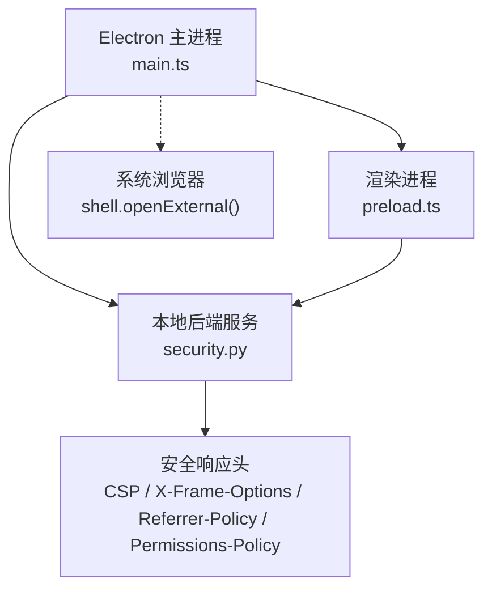
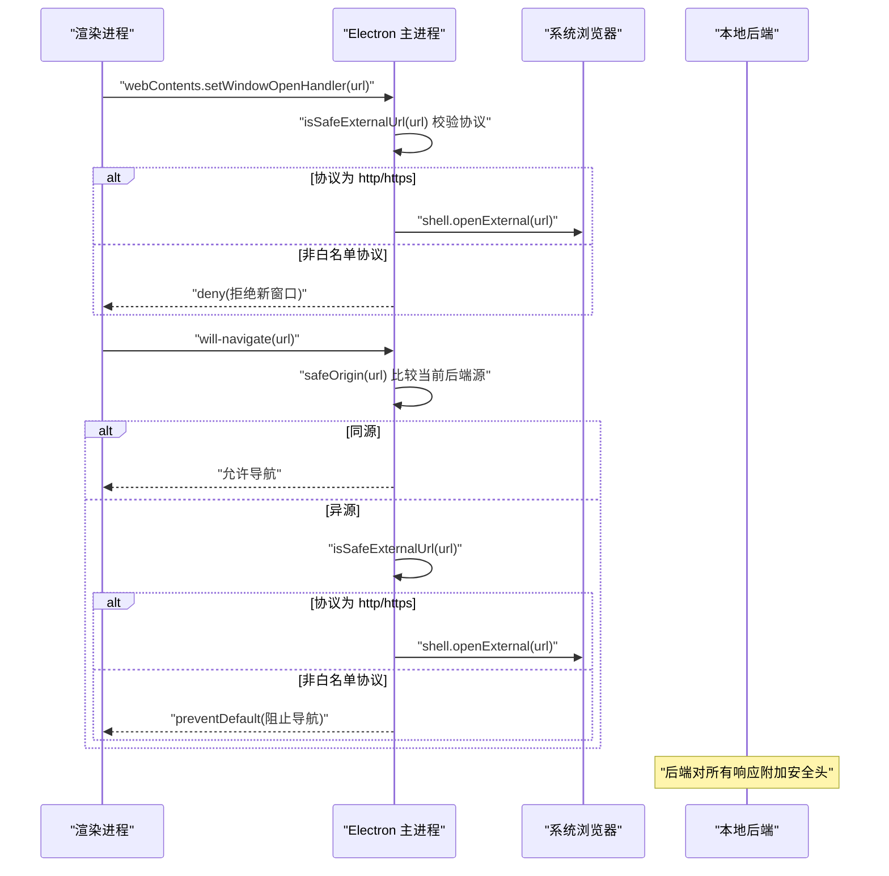
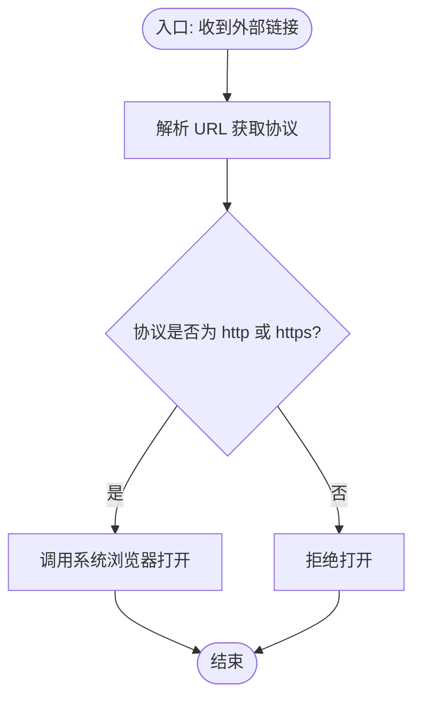
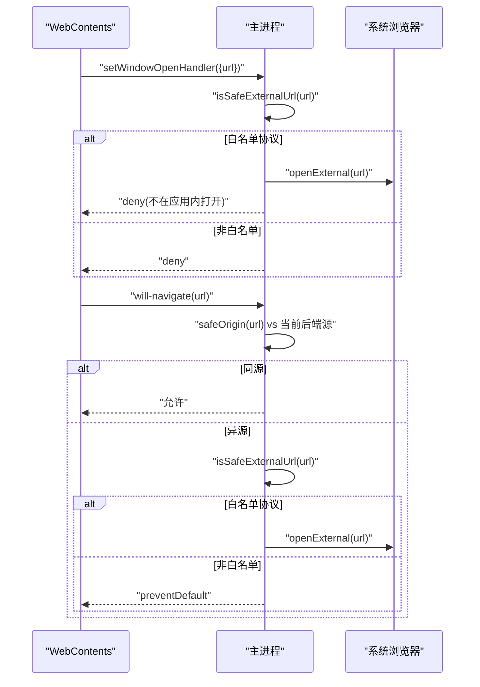
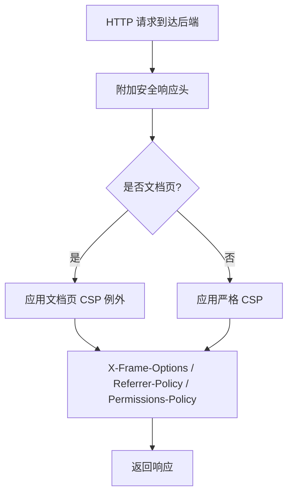
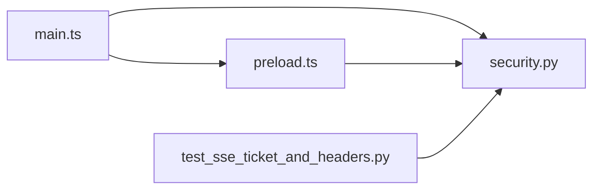

# URL 访问控制

<cite>
**本文引用的文件**
- [desktop/electron/src/main.ts](file://desktop/electron/src/main.ts)
- [desktop/electron/src/preload.ts](file://desktop/electron/src/preload.ts)
- [desktop/electron/THREAT_MODEL.md](file://desktop/electron/THREAT_MODEL.md)
- [agent/src/api/security.py](file://agent/src/api/security.py)
- [agent/tests/test_sse_ticket_and_headers.py](file://agent/tests/test_sse_ticket_and_headers.py)
</cite>

## 目录
1. [简介](#简介)
2. [项目结构](#项目结构)
3. [核心组件](#核心组件)
4. [架构总览](#架构总览)
5. [详细组件分析](#详细组件分析)
6. [依赖关系分析](#依赖关系分析)
7. [性能考虑](#性能考虑)
8. [故障排查指南](#故障排查指南)
9. [结论](#结论)
10. [附录](#附录)

## 简介
本技术文档聚焦桌面应用中的“URL 访问控制”，覆盖外部链接打开策略、浏览器窗口安全配置、Web 视图安全设置、用户代理字符串管理，以及恶意链接防护与用户体验优化建议。内容基于仓库中 Electron 主进程、预加载脚本、后端安全中间件与安全测试用例的实现进行系统化梳理，帮助读者理解并落地一套可验证的桌面端 URL 安全方案。

## 项目结构
与 URL 访问控制直接相关的代码主要分布在以下位置：
- 桌面端（Electron）
  - 主进程：负责创建 BrowserWindow、拦截新窗口与导航、限制权限、注入本地 API 认证头、白名单放行外部链接等。
  - 预加载脚本：向渲染进程暴露最小能力集，避免 Node 集成与敏感 API 泄露。
  - 威胁模型：明确信任边界、控制措施与残留风险。
- 后端（FastAPI）
  - 安全中间件：统一附加安全响应头（CSP、X-Frame-Options、Referrer-Policy、Permissions-Policy），并提供仅对文档页放宽的 CSP 例外。
  - 安全测试：验证默认严格策略、报告模式开关、文档页与应用的 CSP 隔离。

**图示来源**
- [desktop/electron/src/main.ts:65-116](file://desktop/electron/src/main.ts#L65-L116)
- [desktop/electron/src/preload.ts:1-18](file://desktop/electron/src/preload.ts#L1-L18)
- [agent/src/api/security.py:235-253](file://agent/src/api/security.py#L235-L253)

**章节来源**
- [desktop/electron/src/main.ts:65-116](file://desktop/electron/src/main.ts#L65-L116)
- [desktop/electron/src/preload.ts:1-18](file://desktop/electron/src/preload.ts#L1-L18)
- [agent/src/api/security.py:235-253](file://agent/src/api/security.py#L235-L253)

## 核心组件
- 外部链接白名单与协议限制
  - 仅允许 http/https 协议的外部链接通过系统浏览器打开；其他协议一律拒绝。
  - 使用 URL 解析与协议校验实现最小化白名单。
- 新窗口与导航限制
  - 禁止在应用内创建新窗口；所有新窗口请求被拒绝。
  - 页面内导航若离开当前本地后端源，将被阻止并尝试以系统浏览器打开（前提是协议在白名单内）。
- 权限与插件控制
  - 默认拒绝所有浏览器权限请求；未显式允许的权限一律不可用。
  - 通过隔离的持久化 partition 隔离渲染进程会话，避免共享默认浏览器状态。
- Web 视图安全设置（后端侧）
  - 为所有响应附加严格的安全响应头：CSP、X-Frame-Options、Referrer-Policy、Permissions-Policy。
  - 文档页（/docs、/redoc）拥有受限的 CSP 例外，不泄漏到应用页面。
- 用户代理字符串管理
  - 通过环境变量或 Provider 能力层注入兼容的 User-Agent，避免裸 UA 被第三方拒绝，同时隐藏具体版本信息。
  - 相关行为由 Provider 能力层与测试用例共同约束，确保 UA 不被重复透传密钥。

**章节来源**
- [desktop/electron/src/main.ts:86-116](file://desktop/electron/src/main.ts#L86-L116)
- [desktop/electron/src/main.ts:257-272](file://desktop/electron/src/main.ts#L257-L272)
- [agent/src/api/security.py:235-253](file://agent/src/api/security.py#L235-L253)
- [agent/tests/test_sse_ticket_and_headers.py:140-154](file://agent/tests/test_sse_ticket_and_headers.py#L140-L154)

## 架构总览
下图展示了从渲染进程发起导航到新窗口、再到主进程拦截与放行的完整流程，以及后端安全头的注入路径。

**图示来源**
- [desktop/electron/src/main.ts:107-116](file://desktop/electron/src/main.ts#L107-L116)
- [desktop/electron/src/main.ts:257-272](file://desktop/electron/src/main.ts#L257-L272)
- [agent/src/api/security.py:235-253](file://agent/src/api/security.py#L235-L253)

## 详细组件分析

### 外部链接打开策略（白名单机制与协议限制）
- 白名单范围
  - 仅允许 http 与 https 协议的外部链接通过系统浏览器打开。
  - 非法或未知协议一律拒绝，防止任意协议调用（如 file、javascript、自定义协议）造成风险。
- 实现要点
  - 使用 URL 解析提取协议字段，失败时视为非法。
  - 将校验逻辑封装为独立函数，便于复用与测试。
- 安全收益
  - 避免通过应用触发危险协议。
  - 降低 XSS 或恶意页面利用 window.open 劫持系统能力的风险。

**图示来源**
- [desktop/electron/src/main.ts:257-264](file://desktop/electron/src/main.ts#L257-L264)

**章节来源**
- [desktop/electron/src/main.ts:257-264](file://desktop/electron/src/main.ts#L257-L264)

### 新窗口创建与导航限制
- 新窗口拦截
  - 通过 setWindowOpenHandler 拦截所有新窗口请求，仅当协议在白名单内才交由系统浏览器打开，否则拒绝。
- 页面内导航限制
  - will-navigate 事件中比较目标 URL 的 origin 与当前后端 origin，仅允许同源导航。
  - 异源导航时，再次执行协议白名单检查，合法则转系统浏览器打开，否则阻止。
- 权限与插件控制
  - 默认拒绝所有权限请求；未显式允许的权限一律不可用。
  - 使用隔离的持久化 partition，避免与默认浏览器会话共享数据。

**图示来源**
- [desktop/electron/src/main.ts:86-116](file://desktop/electron/src/main.ts#L86-L116)
- [desktop/electron/src/main.ts:257-272](file://desktop/electron/src/main.ts#L257-L272)

**章节来源**
- [desktop/electron/src/main.ts:86-116](file://desktop/electron/src/main.ts#L86-L116)
- [desktop/electron/src/main.ts:257-272](file://desktop/electron/src/main.ts#L257-L272)

### Web 视图安全设置（内容安全策略、脚本执行限制、插件控制）
- 内容安全策略（CSP）
  - 默认严格策略：仅允许同源脚本、样式、字体与连接；禁止帧祖先嵌入；限制 base-uri 与 form-action。
  - 文档页（/docs、/redoc）拥有受限的 CSP 例外，允许特定 CDN 资源，但不影响应用页面。
  - 支持“仅报告”模式切换，用于灰度验证而不阻断正常流量。
- 其他安全头
  - X-Content-Type-Options: nosniff
  - X-Frame-Options: DENY
  - Referrer-Policy: strict-origin-when-cross-origin
  - Permissions-Policy: 禁用地理定位等敏感能力
- 安全收益
  - 有效缓解 XSS、点击劫持、跨站引用与敏感能力滥用。
  - 通过“仅报告”模式降低上线风险。

**图示来源**
- [agent/src/api/security.py:235-253](file://agent/src/api/security.py#L235-L253)
- [agent/tests/test_sse_ticket_and_headers.py:140-154](file://agent/tests/test_sse_ticket_and_headers.py#L140-L154)

**章节来源**
- [agent/src/api/security.py:235-253](file://agent/src/api/security.py#L235-L253)
- [agent/tests/test_sse_ticket_and_headers.py:140-154](file://agent/tests/test_sse_ticket_and_headers.py#L140-L154)

### 用户代理字符串管理（隐私保护、标识符过滤、版本隐藏）
- 策略概述
  - 通过 Provider 能力层注入兼容的 User-Agent，避免裸 UA 被第三方拒绝。
  - 使用带版本号的兼容 UA 处理特定供应商要求，同时避免泄露过多客户端细节。
  - 测试覆盖不同 Provider 的 UA 行为，确保不会重复透传密钥或引入多余头部。
- 实践建议
  - 集中管理 UA 模板，按 Provider 能力选择合适值。
  - 避免在日志或错误信息中输出完整 UA。
  - 定期审计 UA 变更，防止引入新的指纹识别点。

**章节来源**
- [agent/tests/test_provider_diagnostics.py:191-206](file://agent/tests/test_provider_diagnostics.py#L191-L206)

### 恶意链接防护方案
- 协议白名单
  - 仅允许 http/https，拒绝 file、javascript、data、自定义协议等高风险协议。
- 导航同源校验
  - 页面内导航仅允许当前后端源，防止跳转到恶意站点。
- 新窗口拦截
  - 禁止在应用内创建新窗口，避免绕过导航限制。
- 权限最小化
  - 默认拒绝所有权限请求，减少攻击面。
- 安全头加固
  - 通过 CSP、X-Frame-Options、Referrer-Policy、Permissions-Policy 强化浏览器侧防护。

**章节来源**
- [desktop/electron/src/main.ts:86-116](file://desktop/electron/src/main.ts#L86-L116)
- [desktop/electron/src/main.ts:257-272](file://desktop/electron/src/main.ts#L257-L272)
- [agent/src/api/security.py:235-253](file://agent/src/api/security.py#L235-L253)

### 用户体验优化建议
- 友好的外部链接提示
  - 当检测到外部链接时，提供清晰提示并询问用户是否前往系统浏览器打开。
- 快速重试与恢复
  - 提供“重试”按钮以重新加载本地后端页面，提升容错体验。
- 日志与诊断
  - 提供“打开日志”功能，便于问题定位。
- 渐进式降级
  - 在 CSP 仅报告模式下，先观察阻断情况再决定是否收紧策略。

**章节来源**
- [desktop/electron/src/preload.ts:3-17](file://desktop/electron/src/preload.ts#L3-L17)
- [desktop/electron/src/main.ts:119-146](file://desktop/electron/src/main.ts#L119-L146)

## 依赖关系分析
- 主进程依赖
  - Electron API：BrowserWindow、shell、ipcMain、webRequest 等。
  - 安全函数：isSafeExternalUrl、safeOrigin 用于 URL 校验与源比较。
- 预加载脚本依赖
  - contextBridge.exposeInMainWorld 暴露最小能力集给渲染进程。
- 后端依赖
  - FastAPI 中间件附加安全响应头；文档页拥有受限 CSP 例外。
  - 测试用例验证安全头与 CSP 行为。

**图示来源**
- [desktop/electron/src/main.ts:65-116](file://desktop/electron/src/main.ts#L65-L116)
- [desktop/electron/src/preload.ts:1-18](file://desktop/electron/src/preload.ts#L1-L18)
- [agent/src/api/security.py:235-253](file://agent/src/api/security.py#L235-L253)
- [agent/tests/test_sse_ticket_and_headers.py:140-154](file://agent/tests/test_sse_ticket_and_headers.py#L140-L154)

**章节来源**
- [desktop/electron/src/main.ts:65-116](file://desktop/electron/src/main.ts#L65-L116)
- [desktop/electron/src/preload.ts:1-18](file://desktop/electron/src/preload.ts#L1-L18)
- [agent/src/api/security.py:235-253](file://agent/src/api/security.py#L235-L253)
- [agent/tests/test_sse_ticket_and_headers.py:140-154](file://agent/tests/test_sse_ticket_and_headers.py#L140-L154)

## 性能考虑
- 最小化 URL 解析开销
  - 仅在必要时解析 URL 并缓存结果（例如当前后端 origin）。
- 减少不必要的系统浏览器调用
  - 优先在同源范围内完成导航，避免频繁跳转至系统浏览器。
- CSP 与权限策略的平衡
  - 使用“仅报告”模式逐步收紧，避免误伤正常业务。
- 日志与诊断
  - 记录关键拦截事件（如外部链接、导航阻止）以便性能与安全问题定位。

[本节为通用指导，不直接分析具体文件]

## 故障排查指南
- 外部链接无法打开
  - 检查协议是否在白名单内（http/https）。
  - 确认 isSafeExternalUrl 是否正确解析 URL。
- 页面导航被阻止
  - 检查 will-navigate 中的同源比较逻辑。
  - 确认当前后端 origin 是否正确获取。
- 安全头未生效
  - 检查后端中间件是否附加了安全响应头。
  - 确认文档页与应用页面的 CSP 是否按预期分离。
- 权限请求被拒绝
  - 确认是否期望该权限；如需启用，需显式允许。
- 用户代理相关问题
  - 检查 Provider 能力层是否正确注入 UA。
  - 避免重复透传密钥或不必要的头部。

**章节来源**
- [desktop/electron/src/main.ts:86-116](file://desktop/electron/src/main.ts#L86-L116)
- [desktop/electron/src/main.ts:257-272](file://desktop/electron/src/main.ts#L257-L272)
- [agent/src/api/security.py:235-253](file://agent/src/api/security.py#L235-L253)
- [agent/tests/test_sse_ticket_and_headers.py:140-154](file://agent/tests/test_sse_ticket_and_headers.py#L140-L154)

## 结论
本方案通过严格的协议白名单、同源导航限制、新窗口拦截、权限最小化与后端安全头加固，构建了端到端的 URL 访问控制体系。结合“仅报告”模式的 CSP 与清晰的日志诊断能力，可在保障安全的同时兼顾用户体验与可维护性。建议在发布前运行相关测试用例，确保策略符合预期且无副作用。

[本节为总结，不直接分析具体文件]

## 附录
- 配置示例（概念性说明）
  - 外部链接白名单：仅允许 http/https。
  - 导航限制：仅允许当前后端源。
  - 权限策略：默认拒绝所有权限请求。
  - CSP 策略：应用严格策略；文档页受限例外；支持仅报告模式。
- 常见威胁与防御
  - 协议滥用：通过白名单与解析校验防御。
  - 点击劫持：通过 X-Frame-Options 与 CSP frame-ancestors 防御。
  - 跨站脚本：通过 CSP script-src 与 connect-src 限制。
  - 敏感能力滥用：通过 Permissions-Policy 禁用地理定位等。
- 参考实现路径
  - 外部链接白名单与导航限制：[desktop/electron/src/main.ts:86-116](file://desktop/electron/src/main.ts#L86-L116)、[desktop/electron/src/main.ts:257-272](file://desktop/electron/src/main.ts#L257-L272)
  - 安全响应头与 CSP：[agent/src/api/security.py:235-253](file://agent/src/api/security.py#L235-L253)
  - 安全头验证测试：[agent/tests/test_sse_ticket_and_headers.py:140-154](file://agent/tests/test_sse_ticket_and_headers.py#L140-L154)

**章节来源**
- [desktop/electron/src/main.ts:86-116](file://desktop/electron/src/main.ts#L86-L116)
- [desktop/electron/src/main.ts:257-272](file://desktop/electron/src/main.ts#L257-L272)
- [agent/src/api/security.py:235-253](file://agent/src/api/security.py#L235-L253)
- [agent/tests/test_sse_ticket_and_headers.py:140-154](file://agent/tests/test_sse_ticket_and_headers.py#L140-L154)