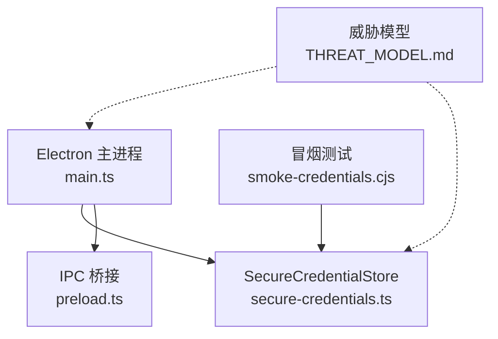
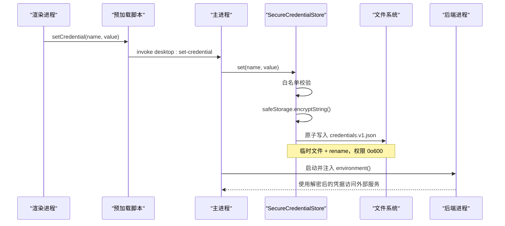
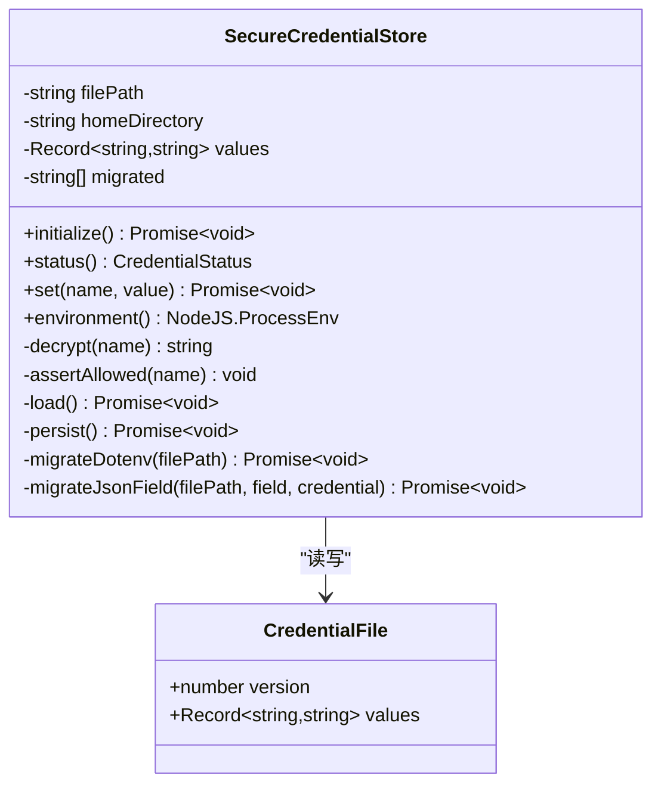
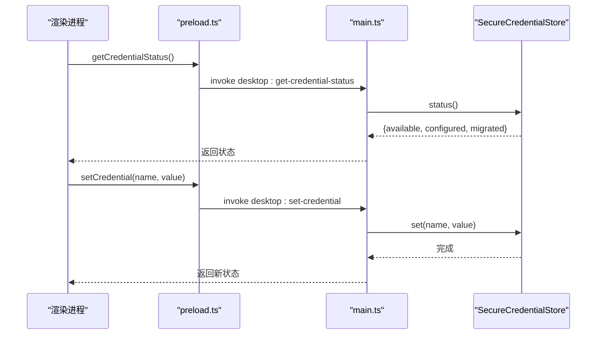
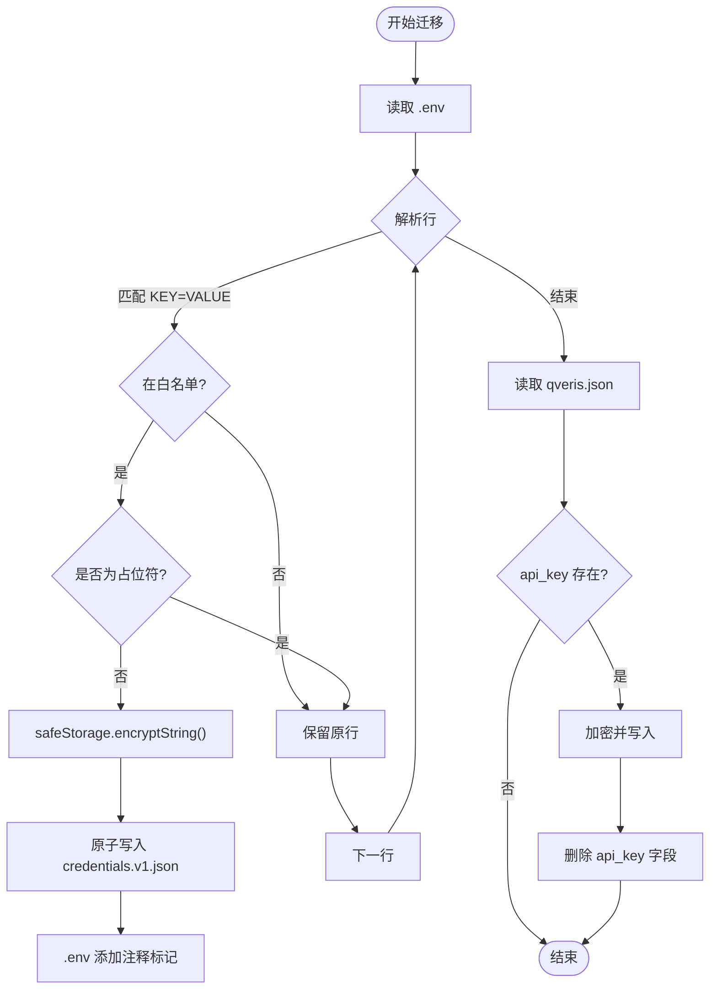
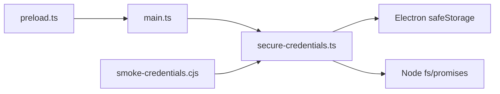

# 凭据管理

<cite>
**本文引用的文件**
- [secure-credentials.ts](file://desktop/electron/src/secure-credentials.ts)
- [main.ts](file://desktop/electron/src/main.ts)
- [preload.ts](file://desktop/electron/src/preload.ts)
- [smoke-credentials.cjs](file://desktop/electron/scripts/smoke-credentials.cjs)
- [THREAT_MODEL.md](file://desktop/electron/THREAT_MODEL.md)
- [package.json](file://desktop/electron/package.json)
</cite>

## 目录
1. [简介](#简介)
2. [项目结构](#项目结构)
3. [核心组件](#核心组件)
4. [架构总览](#架构总览)
5. [详细组件分析](#详细组件分析)
6. [依赖关系分析](#依赖关系分析)
7. [性能与可靠性](#性能与可靠性)
8. [故障排除指南](#故障排除指南)
9. [结论](#结论)
10. [附录：配置示例与最佳实践](#附录配置示例与最佳实践)

## 简介
本技术文档聚焦桌面应用凭据管理子系统，围绕 SecureCredentialStore 类展开，系统阐述其基于 Electron safeStorage 的加密存储机制、凭据类型白名单校验、原子写入与权限控制、版本化文件格式、从 .env 与 qveris.json 的自动迁移流程、Base64 编码策略、状态检查与错误处理等关键安全特性。同时提供企业级凭据管理的最佳实践与安全建议，帮助读者在本地安全地保存并注入敏感信息到后端进程环境。

## 项目结构
凭据管理相关代码位于 Electron 主进程与渲染进程桥接层中，核心实现集中在 secure-credentials.ts；主进程通过 main.ts 初始化并暴露 IPC 接口；渲染进程通过 preload.ts 暴露受限能力；smoke-credentials.cjs 提供端到端冒烟测试；THREAT_MODEL.md 给出威胁模型与边界说明；package.json 定义构建与脚本入口。

图表来源
- [main.ts:19-63](file://desktop/electron/src/main.ts#L19-L63)
- [secure-credentials.ts:68-114](file://desktop/electron/src/secure-credentials.ts#L68-L114)
- [preload.ts:1-18](file://desktop/electron/src/preload.ts#L1-L18)
- [smoke-credentials.cjs:1-133](file://desktop/electron/scripts/smoke-credentials.cjs#L1-L133)
- [THREAT_MODEL.md:163-179](file://desktop/electron/THREAT_MODEL.md#L163-L179)

章节来源
- [main.ts:19-63](file://desktop/electron/src/main.ts#L19-L63)
- [secure-credentials.ts:68-114](file://desktop/electron/src/secure-credentials.ts#L68-L114)
- [preload.ts:1-18](file://desktop/electron/src/preload.ts#L1-L18)
- [smoke-credentials.cjs:1-133](file://desktop/electron/scripts/smoke-credentials.cjs#L1-L133)
- [THREAT_MODEL.md:163-179](file://desktop/electron/THREAT_MODEL.md#L163-L179)

## 核心组件
- SecureCredentialStore：负责凭据的加载、加密存储、解密读取、迁移、持久化与状态查询。
- 主进程集成：在应用启动时初始化 SecureCredentialStore，并通过 IPC 暴露设置与查询能力。
- 渲染进程桥接：仅暴露受限 API（设置凭据、获取状态），不返回明文凭据。
- 冒烟测试：验证迁移、持久化、明文删除、白名单、替换与清空等行为。

章节来源
- [secure-credentials.ts:68-238](file://desktop/electron/src/secure-credentials.ts#L68-L238)
- [main.ts:56-145](file://desktop/electron/src/main.ts#L56-L145)
- [preload.ts:1-18](file://desktop/electron/src/preload.ts#L1-L18)
- [smoke-credentials.cjs:14-133](file://desktop/electron/scripts/smoke-credentials.cjs#L14-L133)

## 架构总览
下图展示了凭据从用户输入到后端进程的完整生命周期：用户在渲染界面设置凭据，经 IPC 进入主进程，由 SecureCredentialStore 进行白名单校验、加密与原子写入；后端启动时，主进程将解密后的凭据注入子进程环境变量，确保敏感值不出现在磁盘明文或渲染进程中。

图表来源
- [preload.ts:13-16](file://desktop/electron/src/preload.ts#L13-L16)
- [main.ts:137-145](file://desktop/electron/src/main.ts#L137-L145)
- [secure-credentials.ts:105-164](file://desktop/electron/src/secure-credentials.ts#L105-L164)
- [secure-credentials.ts:116-131](file://desktop/electron/src/secure-credentials.ts#L116-L131)

## 详细组件分析

### SecureCredentialStore 类设计
- 数据模型
  - 文件版本：固定为 1，包含 values 映射（键名 -> Base64 密文）。
  - 内存态：values 记录当前已配置的键名与密文；migrated 记录本次迁移过的键名。
- 初始化流程
  - 检查 safeStorage.isEncryptionAvailable()，不可用时抛出错误。
  - 加载现有凭证文件（若不存在则忽略）。
  - 执行迁移：从 .vibe-trading/.env 和 .vibe-trading/qveris.json 迁移受支持的密钥。
- 白名单校验
  - 仅允许 ENV_CREDENTIALS 集合中的键名，否则抛出“不受支持”的错误。
- 加密与存储
  - 写入前使用 safeStorage.encryptString() 加密，并以 Base64 字符串形式落盘。
  - 持久化采用原子写入：先写同目录临时文件（权限 0o600），再 rename 覆盖目标文件。
- 解密与环境导出
  - 读取时按 key 解密，失败返回空串。
  - environment() 返回一个仅包含有效键名的明文环境对象，供后端进程注入。
- 迁移逻辑
  - dotenv 迁移：解析 KEY=VALUE 行，跳过占位符值，将受支持且非空的密钥迁移至安全存储，并在原文件中添加注释标记。
  - JSON 字段迁移：从 qveris.json 的 api_key 字段迁移到 QVERIS_API_KEY，成功后删除该字段。

图表来源
- [secure-credentials.ts:7-10](file://desktop/electron/src/secure-credentials.ts#L7-L10)
- [secure-credentials.ts:68-238](file://desktop/electron/src/secure-credentials.ts#L68-L238)

章节来源
- [secure-credentials.ts:68-238](file://desktop/electron/src/secure-credentials.ts#L68-L238)

### 主进程集成与 IPC 暴露
- 启动阶段
  - 创建 SecureCredentialStore 实例并调用 initialize()，完成加载与迁移。
  - 将 environment() 结果作为 credentialEnvironment 传入后端管理器，用于注入子进程环境变量。
- IPC 接口
  - desktop:get-credential-status：返回可用性与已配置键列表。
  - desktop:set-credential：接收 name/value，进行类型校验后调用 store.set()，返回最新状态。
- 安全边界
  - 渲染进程无法直接读取凭据明文；仅能设置或查询状态。
  - 主进程对 IPC 发送者进行来源校验，拒绝非法请求。

图表来源
- [main.ts:133-145](file://desktop/electron/src/main.ts#L133-L145)
- [preload.ts:13-16](file://desktop/electron/src/preload.ts#L13-L16)
- [secure-credentials.ts:97-114](file://desktop/electron/src/secure-credentials.ts#L97-L114)

章节来源
- [main.ts:56-145](file://desktop/electron/src/main.ts#L56-L145)
- [preload.ts:1-18](file://desktop/electron/src/preload.ts#L1-L18)

### 迁移机制详解
- 源位置
  - ~/.vibe-trading/.env：逐行解析 KEY=VALUE，识别受支持键名并跳过占位符值。
  - ~/.vibe-trading/qveris.json：读取 api_key 字段，迁移到 QVERIS_API_KEY。
- 迁移行为
  - 将明文密钥加密后写入 credentials.v1.json。
  - 在 .env 中对应行添加注释标记，表示该密钥已由桌面安全存储接管。
  - 从 qveris.json 删除已迁移字段，避免重复泄露。
- 幂等性
  - 若目标键已存在，则不会重复迁移。
  - 迁移失败（如文件不存在或格式错误）会被安全忽略。

图表来源
- [secure-credentials.ts:166-219](file://desktop/electron/src/secure-credentials.ts#L166-L219)

章节来源
- [secure-credentials.ts:166-219](file://desktop/electron/src/secure-credentials.ts#L166-L219)

### 加密存储格式与原子写入
- 文件格式
  - 顶层 version: 1，values: 键名到 Base64 密文的映射。
  - 仅包含受白名单校验通过的键名。
- 编码方式
  - 使用 safeStorage.encryptString() 生成平台安全的密文字节，再以 Base64 字符串形式落盘。
- 原子写入
  - 先写入同目录临时文件（含进程 PID 后缀），设置权限 0o600（仅所有者可读写），再通过 rename 原子替换目标文件，避免部分写入导致的损坏。
- 权限控制
  - 文件模式 0o600，确保只有当前用户可读写。

章节来源
- [secure-credentials.ts:139-164](file://desktop/electron/src/secure-credentials.ts#L139-L164)
- [secure-credentials.ts:234-238](file://desktop/electron/src/secure-credentials.ts#L234-L238)

### 状态检查、可用性验证与错误处理
- 可用性检查
  - 初始化时检测 safeStorage.isEncryptionAvailable()，不可用即抛错。
  - status() 返回 available 标志，便于前端展示。
- 白名单校验
  - set() 前调用 assertAllowed()，不在白名单的键名会抛出“不受支持”的错误。
- 错误处理
  - 加载文件失败（非 ENOENT）向上抛出。
  - 解密失败返回空串，避免中断后续流程。
  - 迁移过程中遇到非致命错误（如 JSON 语法错误、文件不存在）被安全忽略。

章节来源
- [secure-credentials.ts:84-137](file://desktop/electron/src/secure-credentials.ts#L84-L137)
- [secure-credentials.ts:139-153](file://desktop/electron/src/secure-credentials.ts#L139-L153)

### 冒烟测试与验证要点
- 验证项
  - 迁移：从 .env 与 qveris.json 迁移受支持密钥。
  - 持久化：credentials.v1.json 不包含明文。
  - 明文删除：.env 中原密钥被注释，qveris.json 中字段被删除。
  - 白名单：不支持的键名写入被拒绝。
  - 替换与清空：更新与清除操作生效。
- 运行方式
  - 通过 package.json 脚本 npm run smoke:credentials 执行。

章节来源
- [smoke-credentials.cjs:14-133](file://desktop/electron/scripts/smoke-credentials.cjs#L14-L133)
- [package.json:17-18](file://desktop/electron/package.json#L17-L18)

## 依赖关系分析
- 模块耦合
  - main.ts 依赖 SecureCredentialStore 提供凭据环境与状态。
  - preload.ts 仅暴露最小能力，降低渲染进程攻击面。
  - smoke-credentials.cjs 直接依赖 SecureCredentialStore 进行端到端验证。
- 外部依赖
  - Electron safeStorage：平台级加密/解密。
  - Node.js fs/promises：文件 I/O 与原子写入。
  - os/path：路径与用户目录解析。
- 潜在风险
  - 渲染进程可设置凭据但无法读取明文，需关注恶意设置的风险。
  - safeStorage 保护的是当前用户会话下的静态数据，不防调试器或同等权限进程。

图表来源
- [main.ts:19-63](file://desktop/electron/src/main.ts#L19-L63)
- [preload.ts:1-18](file://desktop/electron/src/preload.ts#L1-L18)
- [secure-credentials.ts:1-5](file://desktop/electron/src/secure-credentials.ts#L1-L5)
- [smoke-credentials.cjs:1-10](file://desktop/electron/scripts/smoke-credentials.cjs#L1-L10)

章节来源
- [main.ts:19-63](file://desktop/electron/src/main.ts#L19-L63)
- [preload.ts:1-18](file://desktop/electron/src/preload.ts#L1-L18)
- [secure-credentials.ts:1-5](file://desktop/electron/src/secure-credentials.ts#L1-L5)
- [smoke-credentials.cjs:1-10](file://desktop/electron/scripts/smoke-credentials.cjs#L1-L10)

## 性能与可靠性
- 性能
  - 加密/解密开销由 safeStorage 承担，通常较低。
  - 原子写入减少竞争条件与崩溃恢复成本。
- 可靠性
  - 迁移过程对缺失文件或格式错误具备容错。
  - 解密失败降级为空串，避免阻断环境导出。
- 可扩展性
  - 白名单集中管理，新增凭据只需扩展集合。
  - 版本化文件便于未来升级迁移。

[本节为通用指导，不直接分析具体文件]

## 故障排除指南
- 加密不可用
  - 现象：初始化时报错提示加密不可用。
  - 排查：确认当前用户会话是否支持 safeStorage（Windows 特定限制）。
  - 参考：初始化时的可用性检查与错误消息。
- 不受支持的键名
  - 现象：设置凭据时报错“不受支持”。
  - 排查：检查键名是否在白名单集合中。
  - 参考：白名单校验逻辑。
- 文件损坏或格式错误
  - 现象：加载凭据文件失败。
  - 排查：检查 credentials.v1.json 结构与版本；必要时重建。
  - 参考：加载逻辑与错误分支。
- 迁移未生效
  - 现象：.env 或 qveris.json 仍保留明文。
  - 排查：确认迁移路径正确、值非占位符；查看迁移日志或重新运行冒烟测试。
  - 参考：dotenv 与 JSON 字段迁移逻辑。

章节来源
- [secure-credentials.ts:84-137](file://desktop/electron/src/secure-credentials.ts#L84-L137)
- [secure-credentials.ts:139-153](file://desktop/electron/src/secure-credentials.ts#L139-L153)
- [secure-credentials.ts:166-219](file://desktop/electron/src/secure-credentials.ts#L166-L219)

## 结论
SecureCredentialStore 以 Electron safeStorage 为核心，结合严格的白名单校验、原子写入与权限控制，实现了本地凭据的安全存储与注入。通过一次性迁移机制，平滑地从 .env 与 qveris.json 过渡到加密存储，既保障安全性又兼顾用户体验。配合主进程的 IPC 隔离与渲染进程的最小权限暴露，整体方案在企业级场景中具备较高的安全基线与可维护性。

[本节为总结性内容，不直接分析具体文件]

## 附录：配置示例与最佳实践

### 支持的凭据类型（白名单）
- LLM/推理服务：OPENROUTER_API_KEY、REQUESTY_API_KEY、OPENAI_API_KEY、ANTHROPIC_API_KEY、DEEPSEEK_API_KEY、SILICONFLOW_API_KEY、SILICONFLOW_GLOBAL_API_KEY、NVIDIA_API_KEY、GEMINI_API_KEY、GROQ_API_KEY、DASHSCOPE_API_KEY、ZHIPU_API_KEY、MOONSHOT_API_KEY、KIMI_CODING_API_KEY、MINIMAX_API_KEY、MIMO_API_KEY、MODELSCOPE_API_KEY、SPARK_API_KEY、ZAI_API_KEY
- 数据服务：TUSHARE_TOKEN、QVERIS_API_KEY

章节来源
- [secure-credentials.ts:12-34](file://desktop/electron/src/secure-credentials.ts#L12-L34)

### 迁移日志与观察点
- .env 中受迁移的键将被添加注释标记，表明已由桌面安全存储接管。
- qveris.json 中已迁移的 api_key 字段将被删除。
- 可通过冒烟测试输出与文件内容验证迁移结果。

章节来源
- [secure-credentials.ts:166-219](file://desktop/electron/src/secure-credentials.ts#L166-L219)
- [smoke-credentials.cjs:72-94](file://desktop/electron/scripts/smoke-credentials.cjs#L72-L94)

### 企业级最佳实践与安全建议
- 最小权限原则
  - 仅暴露必要的 IPC 接口；渲染进程不可读取明文凭据。
- 白名单治理
  - 严格限定可存储的键名；新增凭据需评审与审计。
- 存储与传输
  - 使用 safeStorage 进行静态加密；仅在需要时解密并注入子进程环境。
  - 禁止将明文凭据写入日志、配置文件或浏览器存储。
- 原子性与权限
  - 所有写操作采用原子写入；文件权限设置为 0o600。
- 迁移与清理
  - 迁移完成后移除明文字段；定期扫描备份与历史快照。
- 监控与审计
  - 记录迁移与设置事件；异常时告警并回滚。
- 进程边界
  - 后端绑定 127.0.0.1，仅本地访问；每次启动使用新的认证密钥。
- 合规与培训
  - 制定凭据管理制度；对开发者进行安全意识培训。

章节来源
- [THREAT_MODEL.md:60-88](file://desktop/electron/THREAT_MODEL.md#L60-L88)
- [THREAT_MODEL.md:163-179](file://desktop/electron/THREAT_MODEL.md#L163-L179)
- [secure-credentials.ts:155-164](file://desktop/electron/src/secure-credentials.ts#L155-L164)