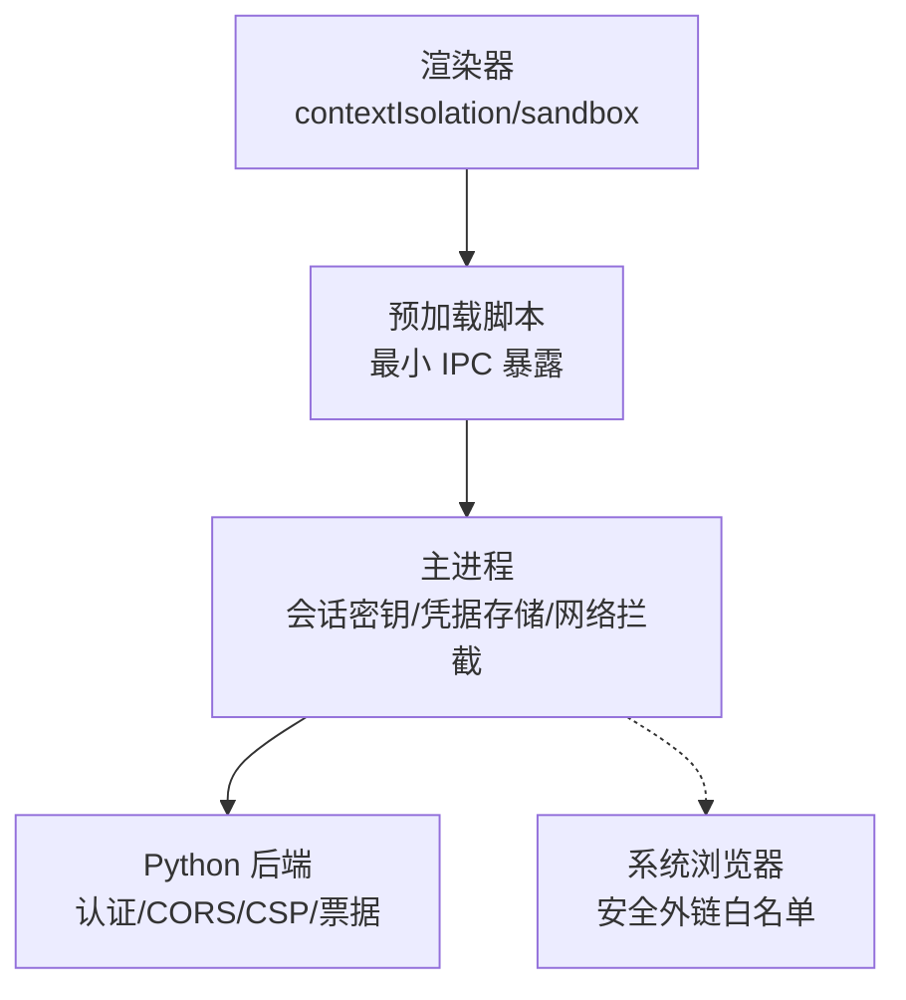
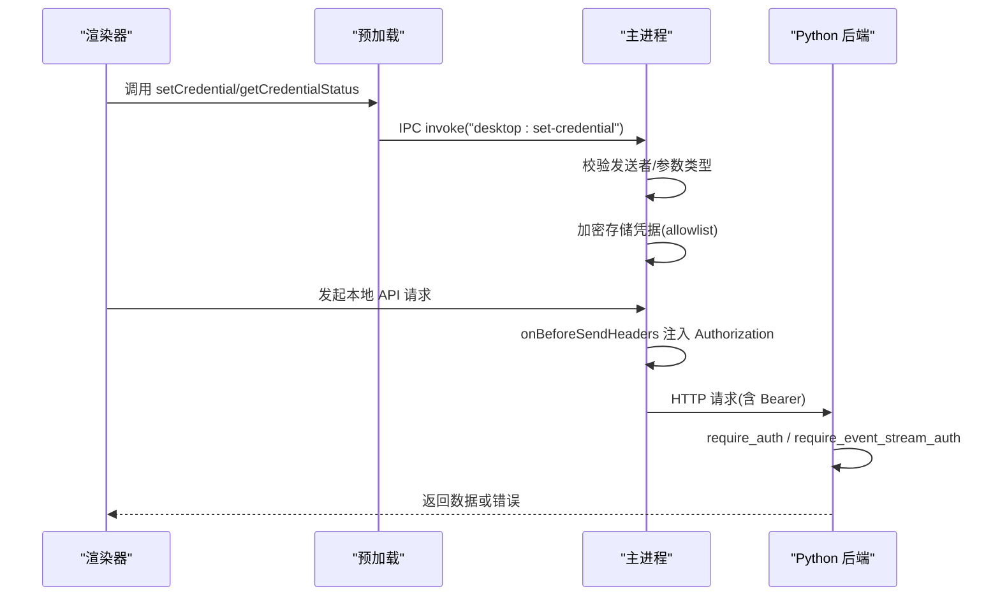
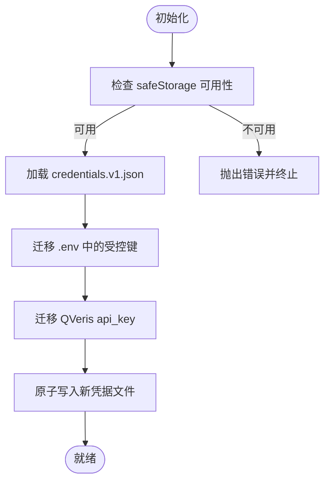
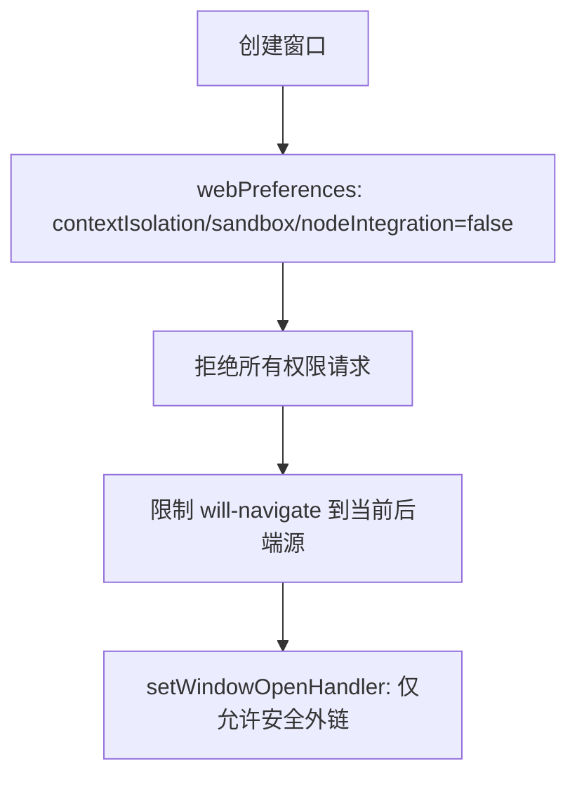
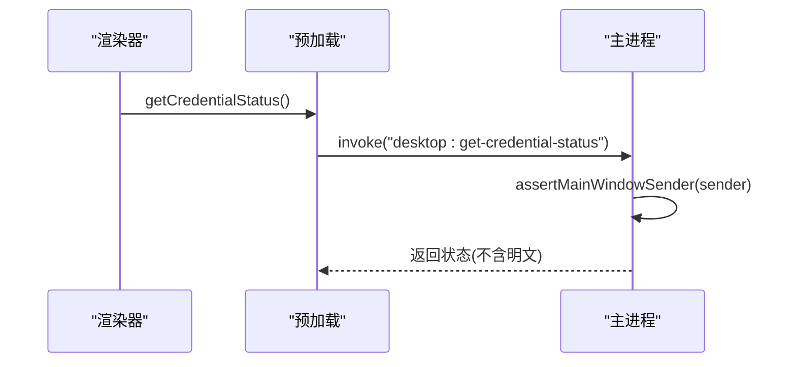
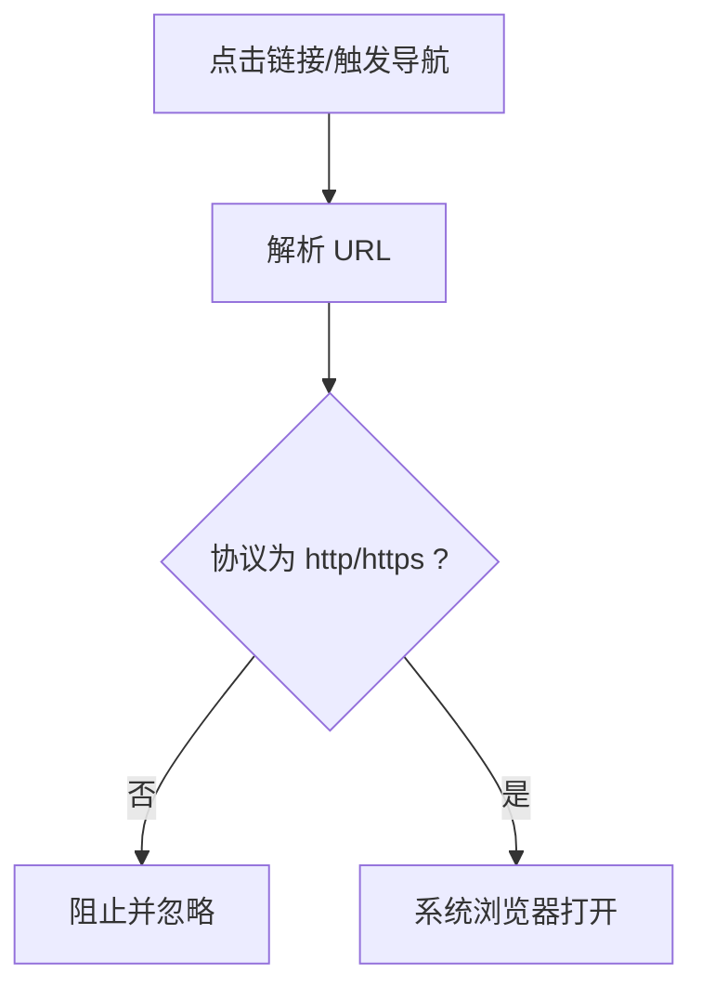
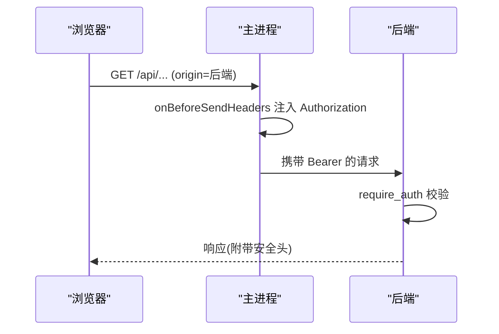
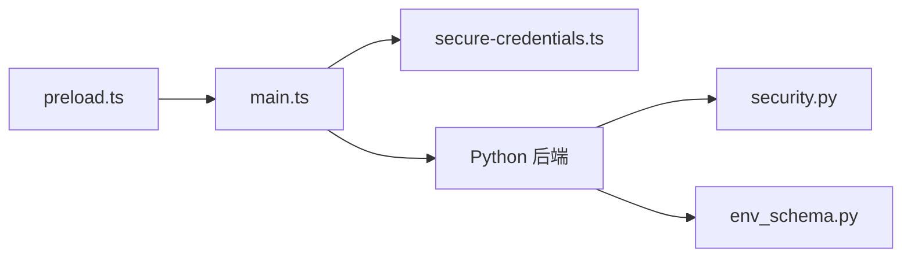

# 安全机制

<cite>
**本文引用的文件**
- [main.ts](file://desktop/electron/src/main.ts)
- [preload.ts](file://desktop/electron/src/preload.ts)
- [secure-credentials.ts](file://desktop/electron/src/secure-credentials.ts)
- [THREAT_MODEL.md](file://desktop/electron/THREAT_MODEL.md)
- [security.py](file://agent/src/api/security.py)
- [auth_routes.py](file://agent/src/api/auth_routes.py)
- [env_schema.py](file://agent/src/config/env_schema.py)
- [network.py](file://agent/src/security/network.py)
- [workspace_access.py](file://agent/src/security/workspace_access.py)
- [SECURITY.md](file://SECURITY.md)
</cite>

## 目录
1. [简介](#简介)
2. [项目结构](#项目结构)
3. [核心组件](#核心组件)
4. [架构总览](#架构总览)
5. [详细组件分析](#详细组件分析)
6. [依赖关系分析](#依赖关系分析)
7. [性能与安全权衡](#性能与安全权衡)
8. [故障排查指南](#故障排查指南)
9. [结论](#结论)
10. [附录：配置与测试示例](#附录配置与测试示例)

## 简介
本文件面向企业级桌面应用的安全设计与实现，覆盖凭据存储、沙箱隔离、IPC 通信、外部 URL 访问控制、网络安全策略以及最佳实践与测试方法。文档基于仓库中 Electron 主进程、预加载脚本、后端 API 安全模块与环境配置等源码进行系统化梳理，并提供可操作的部署建议与验证步骤。

## 项目结构
本项目在桌面端采用“Electron 主进程 + 沙箱渲染器”的架构，并通过本地 Python 后端提供受保护的 API。关键安全边界如下：
- Electron 主进程：持有会话级 API 密钥、管理凭据加密存储、注入本地请求头、限制导航与外链。
- 渲染器（沙箱）：禁用 Node.js 集成、启用上下文隔离与权限拒绝默认策略，仅通过预加载暴露最小能力。
- Python 后端：实现认证、CORS、CSP、DNS 重绑定防护、SSE 票据、日志脱敏等。

图表来源
- [main.ts:65-117](file://desktop/electron/src/main.ts#L65-L117)
- [preload.ts:1-18](file://desktop/electron/src/preload.ts#L1-L18)
- [security.py:166-253](file://agent/src/api/security.py#L166-L253)

章节来源
- [main.ts:65-117](file://desktop/electron/src/main.ts#L65-L117)
- [preload.ts:1-18](file://desktop/electron/src/preload.ts#L1-L18)
- [THREAT_MODEL.md:31-88](file://desktop/electron/THREAT_MODEL.md#L31-L88)

## 核心组件
- 凭据存储：使用系统级安全存储对允许列表内的凭据进行加密持久化，支持从旧配置文件迁移，并以原子写入保证一致性。
- 沙箱隔离：渲染器禁用 Node 集成、启用上下文隔离与沙箱；默认拒绝所有浏览器权限；限制窗口打开与页面内导航。
- IPC 通信：预加载仅暴露必要接口；主进程对所有 IPC 进行发送者校验与参数类型检查；敏感操作需授权。
- 外部 URL 访问：仅允许 http/https 协议的外部链接，并在系统浏览器中打开；页面内导航限制到当前后端源。
- 网络安全：后端强制 CSP、X-Frame-Options、Permissions-Policy、Referrer-Policy；严格 CORS 白名单；禁止带凭证的通配符；SSE 票据防泄露；访问日志脱敏。

章节来源
- [secure-credentials.ts:68-164](file://desktop/electron/src/secure-credentials.ts#L68-L164)
- [main.ts:65-117](file://desktop/electron/src/main.ts#L65-L117)
- [security.py:166-253](file://agent/src/api/security.py#L166-L253)

## 架构总览
下图展示从渲染器到后端的完整安全链路：渲染器通过预加载调用主进程 IPC；主进程在发起本地后端请求时注入会话级 Authorization；后端通过 Bearer/API Key 或一次性 SSE 票据完成鉴权，并施加严格的跨域与安全响应头。

图表来源
- [preload.ts:1-18](file://desktop/electron/src/preload.ts#L1-L18)
- [main.ts:119-145](file://desktop/electron/src/main.ts#L119-L145)
- [main.ts:85-98](file://desktop/electron/src/main.ts#L85-L98)
- [security.py:571-622](file://agent/src/api/security.py#L571-L622)

## 详细组件分析

### 凭据存储安全
- 加密算法与密钥管理：使用 Electron safeStorage 进行加解密；密钥由操作系统安全存储提供，不落地明文。
- 存储位置保护：凭据以 JSON 形式保存在用户数据目录，仅包含 Base64 密文；写入采用临时文件+rename 原子操作，权限设置为 0o600。
- 白名单与迁移：仅允许配置的键名写入；启动时扫描旧 .env 与特定 JSON 字段，将明文值迁移至安全存储并移除原文。
- 生命周期：仅在需要时将解密后的值注入后端子进程环境，不会回写到 dotenv。

图表来源
- [secure-credentials.ts:84-164](file://desktop/electron/src/secure-credentials.ts#L84-L164)

章节来源
- [secure-credentials.ts:68-220](file://desktop/electron/src/secure-credentials.ts#L68-L220)
- [THREAT_MODEL.md:163-179](file://desktop/electron/THREAT_MODEL.md#L163-L179)

### 沙箱隔离与权限控制
- 渲染器安全：禁用 nodeIntegration，启用 contextIsolation 与 sandbox；默认拒绝所有浏览器权限；开发者工具在非打包模式下才可用。
- 导航与外链：页面内导航限制到当前后端源；新窗口一律拒绝，安全外链在系统浏览器中打开。
- 会话隔离：使用独立 partition 避免与默认浏览器会话共享状态。

图表来源
- [main.ts:65-117](file://desktop/electron/src/main.ts#L65-L117)

章节来源
- [main.ts:65-117](file://desktop/electron/src/main.ts#L65-L117)
- [THREAT_MODEL.md:76-88](file://desktop/electron/THREAT_MODEL.md#L76-L88)

### IPC 通信安全
- 发送者验证：所有 IPC 处理器均校验 sender 是否为主窗口 webContents，防止恶意页面劫持。
- 参数类型检查：如设置凭据接口严格校验 name/value 类型，非法输入直接拒绝。
- 最小暴露面：预加载仅暴露状态监听、重试、日志、重启后端与凭据写入/查询等有限能力。

图表来源
- [preload.ts:1-18](file://desktop/electron/src/preload.ts#L1-L18)
- [main.ts:119-145](file://desktop/electron/src/main.ts#L119-L145)

章节来源
- [preload.ts:1-18](file://desktop/electron/src/preload.ts#L1-L18)
- [main.ts:119-145](file://desktop/electron/src/main.ts#L119-L145)

### 外部 URL 访问控制
- 外链白名单：仅允许 http/https 协议；其他协议一律拒绝。
- 打开方式：通过系统浏览器打开外链，避免在应用内执行未知资源。
- 页面内导航：仅允许跳转到当前后端源，防止中间人跳转或钓鱼页面。

图表来源
- [main.ts:107-116](file://desktop/electron/src/main.ts#L107-L116)
- [main.ts:257-264](file://desktop/electron/src/main.ts#L257-L264)

章节来源
- [main.ts:107-116](file://desktop/electron/src/main.ts#L107-L116)
- [main.ts:257-264](file://desktop/electron/src/main.ts#L257-L264)

### 网络安全措施
- 请求头注入：仅当请求 origin 与当前后端 origin 完全匹配时，自动注入 Authorization Bearer 令牌，避免跨站泄露。
- 来源验证：后端通过 Host/Origin 校验与 DNS 重绑定防护，拒绝不受信任的本地主机头。
- CORS 配置：默认仅允许开发常用本地源；禁止带凭证的通配符；支持追加额外可信源。
- 安全响应头：强制 CSP、X-Content-Type-Options、X-Frame-Options、Permissions-Policy、Referrer-Policy。
- SSE 票据：浏览器无法发送 Authorization 头时使用一次性票据，票据短时效且单次使用，避免长密钥进入 URL。
- 日志脱敏：访问日志中对敏感查询参数值进行脱敏，防止密钥泄露。

图表来源
- [main.ts:85-98](file://desktop/electron/src/main.ts#L85-L98)
- [security.py:166-253](file://agent/src/api/security.py#L166-L253)
- [security.py:571-622](file://agent/src/api/security.py#L571-L622)

章节来源
- [main.ts:85-98](file://desktop/electron/src/main.ts#L85-L98)
- [security.py:166-253](file://agent/src/api/security.py#L166-L253)
- [security.py:571-622](file://agent/src/api/security.py#L571-L622)

### 工作区与网络目标校验
- 工作区范围：通过工作区作用元数据与异常类型，确保路径访问在允许范围内。
- 网络目标校验：通道适配器复用统一的 URL 目标与解析校验，防止任意地址访问。

章节来源
- [workspace_access.py:1-15](file://agent/src/security/workspace_access.py#L1-L15)
- [network.py:1-11](file://agent/src/security/network.py#L1-L11)

## 依赖关系分析
- 主进程依赖预加载暴露的最小 IPC 能力，并对所有 IPC 进行强校验。
- 主进程通过 session 拦截器向本地后端注入认证头，依赖后端 require_auth 完成最终鉴权。
- 后端安全模块集中处理 CORS、CSP、票据、日志脱敏与主机头校验，被 API 路由统一引用。
- 环境变量配置集中定义，API 密钥、CORS、Docker 环回信任等开关由单一入口读取。

图表来源
- [preload.ts:1-18](file://desktop/electron/src/preload.ts#L1-L18)
- [main.ts:119-145](file://desktop/electron/src/main.ts#L119-L145)
- [security.py:571-622](file://agent/src/api/security.py#L571-L622)
- [env_schema.py:326-375](file://agent/src/config/env_schema.py#L326-L375)

章节来源
- [main.ts:119-145](file://desktop/electron/src/main.ts#L119-L145)
- [security.py:571-622](file://agent/src/api/security.py#L571-L622)
- [env_schema.py:326-375](file://agent/src/config/env_schema.py#L326-L375)

## 性能与安全权衡
- 渲染器沙箱与权限拒绝默认策略带来更小的攻击面，但可能增加调试成本；建议在打包构建中关闭开发者工具。
- 每次后端启动生成新的会话密钥，提升安全性但要求前端正确获取与传递；可通过健康检查与重试机制提升鲁棒性。
- 原子写入凭据文件与一次性 SSE 票据会增加少量 I/O 与内存开销，但在企业环境中换取更高的机密性与抗重放能力。

[本节为通用指导，无需代码来源]

## 故障排查指南
- 凭据加密不可用：若系统安全存储不可用，初始化将失败；检查运行环境与用户会话权限。
- 凭据写入失败：确认键名在白名单内；检查文件权限与磁盘空间；查看迁移逻辑是否成功清理明文。
- IPC 被拒绝：确认发送者为主窗口；检查预加载暴露的方法是否正确调用。
- 后端认证失败：检查 Authorization 头是否注入；确认后端 require_auth 配置与 API 密钥一致；核对 CORS 与 Host 白名单。
- 外链被阻止：确认协议为 http/https；检查 will-navigate 是否被拦截。

章节来源
- [secure-credentials.ts:84-164](file://desktop/electron/src/secure-credentials.ts#L84-L164)
- [main.ts:119-145](file://desktop/electron/src/main.ts#L119-L145)
- [security.py:571-622](file://agent/src/api/security.py#L571-L622)

## 结论
该桌面应用通过多层安全边界保障企业级使用需求：凭据加密存储、渲染器沙箱隔离、严格的 IPC 校验、受限的外链与导航、以及后端全面的网络安全策略。结合环境变量集中管理与日志脱敏，形成端到端的安全闭环。建议在生产环境启用 API 密钥、严格 CORS 白名单与 CSP 强制模式，并定期审计配置与依赖。

[本节为总结，无需代码来源]

## 附录：配置与测试示例

### 安全配置要点
- 启用 API 密钥：设置 API_AUTH_KEY 或 VIBE_TRADING_API_KEY，使非本地客户端必须携带有效凭据。
- 限定 CORS：仅配置必要的本地开发源；如需扩展，使用 VIBE_TRADING_EXTRA_CORS_ORIGINS 追加，禁止通配符。
- 主机头白名单：通过 API_ALLOWED_HOSTS 与 VIBE_TRADING_MCP_ALLOWED_HOSTS 限制可信 Host/Origin。
- Docker 环回信任：仅在明确信任网关 IP 时开启 VIBE_TRADING_TRUST_DOCKER_LOOPBACK。
- CSP 报告模式：VIBE_TRADING_CSP_REPORT_ONLY=1 用于灰度发布时的只报模式。

章节来源
- [env_schema.py:326-375](file://agent/src/config/env_schema.py#L326-L375)
- [security.py:30-103](file://agent/src/api/security.py#L30-L103)

### 测试方法
- 凭据迁移与持久化：使用隔离临时用户数据目录，验证迁移、持久化、明文删除、替换与清空流程。
- 会话密钥轮换：重启应用后验证旧密钥失效，新密钥生效。
- 外链与导航：尝试打开不同协议与同源/跨源链接，验证拦截与放行行为。
- 后端认证：分别使用 Bearer 与 SSE 票据访问流式接口，验证一次性票据的有效性与过期行为。
- 日志脱敏：构造包含敏感查询参数的请求，验证访问日志中值被脱敏。

章节来源
- [THREAT_MODEL.md:163-179](file://desktop/electron/THREAT_MODEL.md#L163-L179)
- [auth_routes.py:21-56](file://agent/src/api/auth_routes.py#L21-L56)
- [security.py:300-341](file://agent/src/api/security.py#L300-L341)

### 漏洞披露与合规
- 遵循仓库安全政策，通过 GitHub Security Advisory 私有报告漏洞。
- 生成回测代码作为本地代码对待，谨慎审查后再执行；注意其网络能力与受限的环境变量继承。

章节来源
- [SECURITY.md:9-28](file://SECURITY.md#L9-L28)