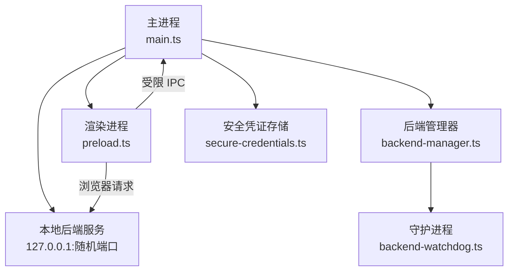
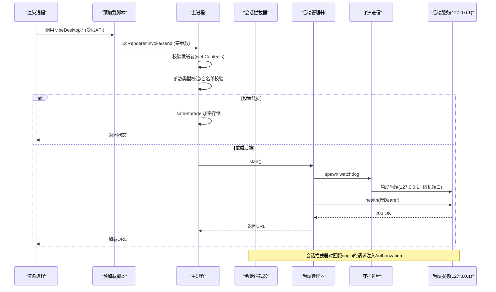
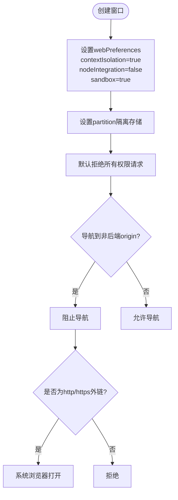
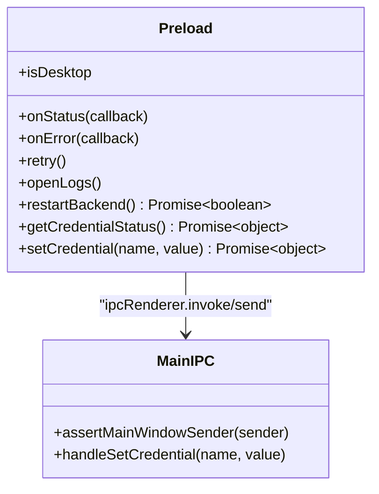
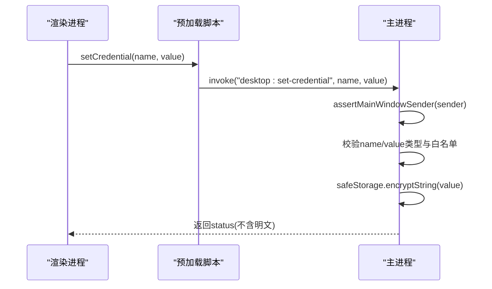
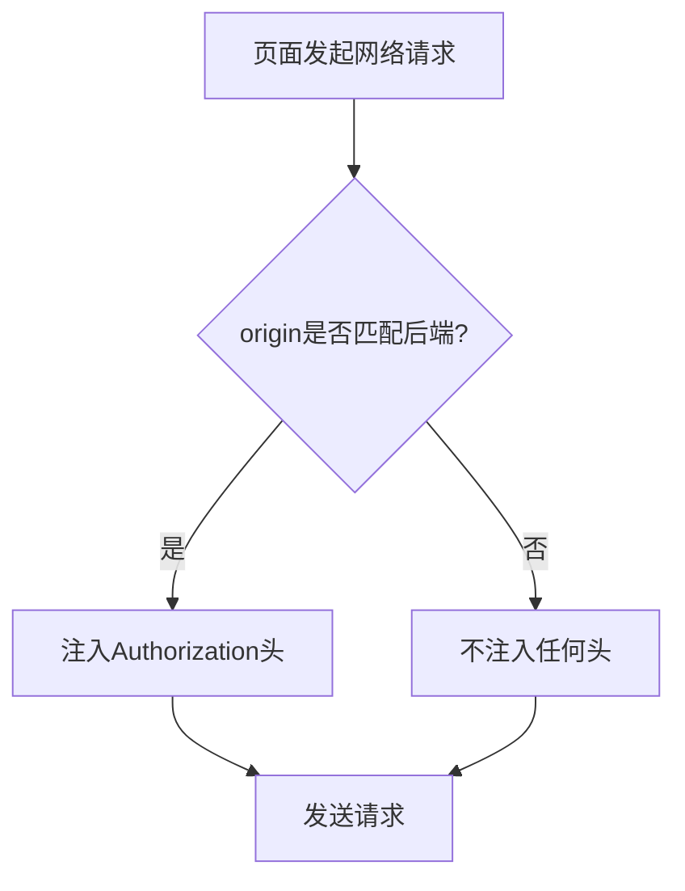
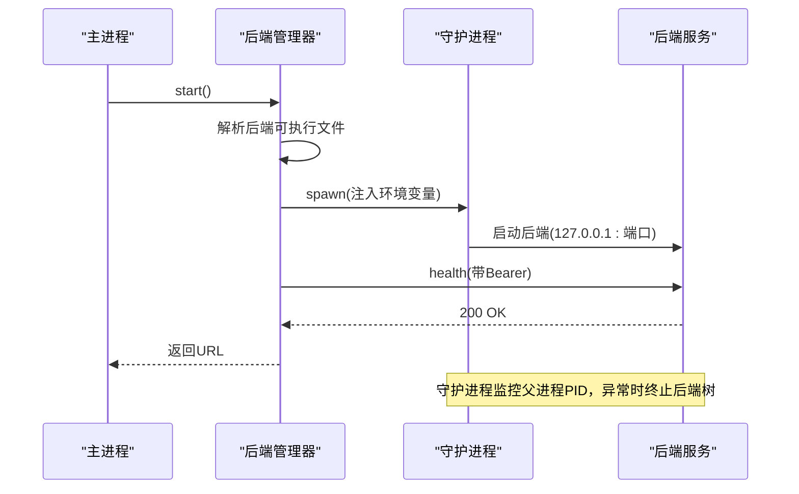
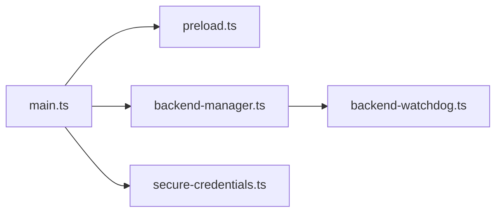

# 沙箱隔离

<cite>
**本文引用的文件**
- [main.ts](file://desktop/electron/src/main.ts)
- [preload.ts](file://desktop/electron/src/preload.ts)
- [package.json](file://desktop/electron/package.json)
- [THREAT_MODEL.md](file://desktop/electron/THREAT_MODEL.md)
- [REVIEW_NOTES.md](file://desktop/electron/REVIEW_NOTES.md)
- [secure-credentials.ts](file://desktop/electron/src/secure-credentials.ts)
- [backend-manager.ts](file://desktop/electron/src/backend-manager.ts)
- [backend-watchdog.ts](file://desktop/electron/src/backend-watchdog.ts)
</cite>

## 目录
1. [简介](#简介)
2. [项目结构](#项目结构)
3. [核心组件](#核心组件)
4. [架构总览](#架构总览)
5. [详细组件分析](#详细组件分析)
6. [依赖关系分析](#依赖关系分析)
7. [性能考虑](#性能考虑)
8. [故障排查指南](#故障排查指南)
9. [结论](#结论)
10. [附录：安全配置清单与示例路径](#附录：安全配置清单与示例路径)

## 简介
本技术文档聚焦于桌面应用（Electron）的沙箱隔离机制，围绕主进程安全配置、渲染进程权限控制、IPC 通信边界、外部资源加载策略以及凭证与后端进程生命周期管理进行系统化说明。目标是帮助开发者理解并落地“最小权限、默认拒绝”的安全模型，同时兼顾可维护性与性能。

## 项目结构
本项目在 desktop/electron 目录下实现 Electron 桌面壳层，包含主进程、预加载脚本、后端管理器、守护进程与安全凭证存储等模块。关键文件职责如下：
- main.ts：主进程入口，负责窗口创建、安全选项配置、会话权限拦截、导航限制、IPC 注册与后端启动。
- preload.ts：预加载脚本，通过 contextBridge 暴露最小 API 给渲染进程，屏蔽 Node.js 直接访问。
- backend-manager.ts：后端进程发现、启动、健康检查、日志采集与优雅关闭。
- backend-watchdog.ts：独立子进程，负责监控父进程存活、终止后端进程树，避免孤儿进程。
- secure-credentials.ts：使用 safeStorage 加密存储受信任的环境变量（凭据），并提供迁移与注入能力。
- package.json：打包与构建配置，启用 asar、限定语言包、输出产物等。
- THREAT_MODEL.md / REVIEW_NOTES.md：威胁模型与审查记录，明确信任边界、控制措施与已知风险。

图表来源
- [main.ts:65-117](file://desktop/electron/src/main.ts#L65-L117)
- [preload.ts:1-18](file://desktop/electron/src/preload.ts#L1-L18)
- [backend-manager.ts:63-146](file://desktop/electron/src/backend-manager.ts#L63-L146)
- [backend-watchdog.ts:1-167](file://desktop/electron/src/backend-watchdog.ts#L1-L167)
- [secure-credentials.ts:68-123](file://desktop/electron/src/secure-credentials.ts#L68-L123)

章节来源
- [main.ts:65-117](file://desktop/electron/src/main.ts#L65-L117)
- [package.json:33-87](file://desktop/electron/package.json#L33-L87)

## 核心组件
- 主进程安全配置
  - 启用 contextIsolation、禁用 nodeIntegration、启用 sandbox，配合 Chromium 沙箱运行渲染进程。
  - 使用独立的持久化 partition 隔离 Cookie/缓存/IndexedDB 等。
  - 默认拒绝所有浏览器权限请求；仅允许安全的 HTTP(S) 外链打开系统浏览器。
  - 对 to-localhost 的出站请求自动注入认证头，但严格匹配 origin。
- 预加载脚本与渲染进程权限
  - 仅通过 contextBridge 暴露必要方法（状态订阅、错误上报、重试、打开日志、重启后端、凭据写入）。
  - 不暴露 Node.js 或文件系统 API；渲染进程无法直接读取凭据值。
- IPC 通信边界
  - 所有 IPC 调用均校验发送者是否为主窗口 webContents。
  - 参数类型强校验（如凭据名称必须为字符串，值为字符串或 null）。
  - 敏感操作（设置凭据）仅在主进程完成白名单校验与加密存储。
- 外部资源加载
  - 新窗口打开被拒绝，仅允许 http/https 外链由系统浏览器打开。
  - 页面内导航限制到当前后端 origin，防止跳转到恶意站点。
  - 未在主进程中显式设置 CSP；CSP 由后端服务响应头控制（见威胁模型与测试用例）。
- 后端进程与凭据注入
  - 后端绑定 127.0.0.1 随机端口，仅本机可达。
  - 每次启动生成新的 API 密钥，仅存在于主进程内存与子进程环境。
  - 凭据通过 safeStorage 加密存储，按需解密后注入子进程环境变量。

章节来源
- [main.ts:65-117](file://desktop/electron/src/main.ts#L65-L117)
- [main.ts:119-146](file://desktop/electron/src/main.ts#L119-L146)
- [preload.ts:1-18](file://desktop/electron/src/preload.ts#L1-L18)
- [backend-manager.ts:63-146](file://desktop/electron/src/backend-manager.ts#L63-L146)
- [secure-credentials.ts:68-123](file://desktop/electron/src/secure-credentials.ts#L68-L123)
- [THREAT_MODEL.md:60-88](file://desktop/electron/THREAT_MODEL.md#L60-L88)

## 架构总览
下图展示了从渲染进程到主进程再到后端服务的完整调用链，包括 IPC 验证、凭据注入、会话级认证头注入与导航限制。

图表来源
- [main.ts:119-146](file://desktop/electron/src/main.ts#L119-L146)
- [main.ts:85-98](file://desktop/electron/src/main.ts#L85-L98)
- [backend-manager.ts:63-146](file://desktop/electron/src/backend-manager.ts#L63-L146)
- [backend-watchdog.ts:1-167](file://desktop/electron/src/backend-watchdog.ts#L1-L167)

## 详细组件分析

### 主进程安全配置（contextIsolation、nodeIntegration、sandbox）
- 窗口创建时启用 contextIsolation、禁用 nodeIntegration、启用 sandbox，确保渲染进程无 Node 访问且处于 Chromium 沙箱中。
- 使用自定义 partition 隔离存储域，避免与全局浏览器会话共享数据。
- 默认拒绝所有权限请求，并通过 setPermissionCheckHandler/setPermissionRequestHandler 统一拦截。
- 对外部链接打开进行协议白名单校验，仅允许 http/https，并通过系统浏览器打开。
- 页面内导航限制到当前后端 origin，阻止跳转到未知站点。

图表来源
- [main.ts:65-117](file://desktop/electron/src/main.ts#L65-L117)

章节来源
- [main.ts:65-117](file://desktop/electron/src/main.ts#L65-L117)
- [THREAT_MODEL.md:76-88](file://desktop/electron/THREAT_MODEL.md#L76-L88)

### 预加载脚本的作用域限制与 API 访问控制
- 仅通过 contextBridge.exposeInMainWorld 暴露最小集合的方法，包括状态订阅、错误回调、重试、打开日志、重启后端、获取/设置凭据状态。
- 所有方法封装了 ipcRenderer 调用，渲染进程无法直接访问 Node 或文件系统。
- 凭据写入接口仅接受白名单键名与合法类型，返回值不包含明文凭据。

图表来源
- [preload.ts:1-18](file://desktop/electron/src/preload.ts#L1-L18)
- [main.ts:119-146](file://desktop/electron/src/main.ts#L119-L146)

章节来源
- [preload.ts:1-18](file://desktop/electron/src/preload.ts#L1-L18)
- [main.ts:119-146](file://desktop/electron/src/main.ts#L119-L146)

### IPC 通信的安全边界
- 发送者校验：每个 IPC 处理器首先断言 event.sender 等于主窗口的 webContents，否则拒绝。
- 参数类型检查：例如凭据名称必须为字符串，值必须为字符串或 null。
- 授权流程：凭据写入前进行白名单校验，并使用 safeStorage 加密存储；不会将明文返回给渲染进程。
- 事件通道：主进程通过 webContents.send 推送状态与错误信息，渲染进程仅消费。

图表来源
- [main.ts:119-146](file://desktop/electron/src/main.ts#L119-L146)
- [secure-credentials.ts:105-123](file://desktop/electron/src/secure-credentials.ts#L105-L123)

章节来源
- [main.ts:119-146](file://desktop/electron/src/main.ts#L119-L146)
- [secure-credentials.ts:105-123](file://desktop/electron/src/secure-credentials.ts#L105-L123)

### 外部资源加载的安全控制
- 新窗口打开：统一拒绝，仅允许 http/https 外链由系统浏览器打开。
- 页面内导航：限制到当前后端 origin，防止跳转到恶意站点。
- 出站请求：对匹配后端 origin 的请求自动注入 Authorization 头，其他请求不注入。
- CSP 策略：未在 Electron 主进程侧设置 CSP；CSP 由后端服务响应头控制（参见威胁模型与测试用例）。

图表来源
- [main.ts:85-98](file://desktop/electron/src/main.ts#L85-L98)
- [THREAT_MODEL.md:60-74](file://desktop/electron/THREAT_MODEL.md#L60-L74)

章节来源
- [main.ts:85-98](file://desktop/electron/src/main.ts#L85-L98)
- [THREAT_MODEL.md:60-74](file://desktop/electron/THREAT_MODEL.md#L60-L74)

### 后端进程与凭据注入的生命周期
- 后端发现：优先使用环境变量覆盖，其次查找打包路径下的固定位置，再尝试源码模式标记根目录，最后回退 PATH。
- 启动流程：选择随机端口，启动守护进程，注入 API_AUTH_KEY 与受信任凭据环境变量，等待健康检查成功。
- 守护进程：持续监控父进程 PID，若断开则终止后端进程树；支持优雅关闭与强制终止。
- 凭据存储：使用 safeStorage 加密，文件以原子方式写入；迁移旧明文字段并删除明文。

图表来源
- [backend-manager.ts:63-146](file://desktop/electron/src/backend-manager.ts#L63-L146)
- [backend-watchdog.ts:1-167](file://desktop/electron/src/backend-watchdog.ts#L1-L167)
- [secure-credentials.ts:68-123](file://desktop/electron/src/secure-credentials.ts#L68-L123)

章节来源
- [backend-manager.ts:63-146](file://desktop/electron/src/backend-manager.ts#L63-L146)
- [backend-watchdog.ts:1-167](file://desktop/electron/src/backend-watchdog.ts#L1-L167)
- [secure-credentials.ts:68-123](file://desktop/electron/src/secure-credentials.ts#L68-L123)

## 依赖关系分析
- 主进程依赖预加载脚本暴露的最小 API 与后端管理器。
- 后端管理器依赖守护进程与文件系统（日志）、网络（健康检查）。
- 守护进程依赖操作系统工具（taskkill）与进程信号处理。
- 安全凭证存储依赖 safeStorage 与文件系统原子写入。

图表来源
- [main.ts:65-117](file://desktop/electron/src/main.ts#L65-L117)
- [backend-manager.ts:63-146](file://desktop/electron/src/backend-manager.ts#L63-L146)
- [backend-watchdog.ts:1-167](file://desktop/electron/src/backend-watchdog.ts#L1-L167)
- [secure-credentials.ts:68-123](file://desktop/electron/src/secure-credentials.ts#L68-L123)

章节来源
- [main.ts:65-117](file://desktop/electron/src/main.ts#L65-L117)
- [backend-manager.ts:63-146](file://desktop/electron/src/backend-manager.ts#L63-L146)
- [backend-watchdog.ts:1-167](file://desktop/electron/src/backend-watchdog.ts#L1-L167)
- [secure-credentials.ts:68-123](file://desktop/electron/src/secure-credentials.ts#L68-L123)

## 性能考虑
- 渲染进程沙箱与上下文隔离会增加少量开销，但显著提升安全性；建议保持开启。
- 会话级请求头注入仅针对匹配 origin 的请求，避免不必要的计算。
- 健康检查采用轮询+超时，避免阻塞启动；可根据后端启动速度调整超时与间隔。
- 日志写入采用追加模式与最近 N 行缓存，减少 I/O 压力。
- 凭据文件写入使用临时文件+rename 原子操作，降低损坏风险。

[本节提供通用指导，不直接分析具体文件]

## 故障排查指南
- 启动失败
  - 检查后端可执行文件是否按优先级正确解析（环境变量、打包路径、源码标记根、PATH）。
  - 查看守护进程消息与健康检查日志，确认后端是否监听本机端口。
- 凭据相关
  - 确认 safeStorage 可用；若不可用，初始化会抛出错误。
  - 检查凭据键是否在白名单；写入后会加密存储，不会返回明文。
- 导航与新窗口
  - 若页面跳转被阻止，检查目标 URL 是否匹配后端 origin；外链需为 http/https。
- 权限请求
  - 默认拒绝所有权限；如需特定权限，应在主进程中进行细粒度放行。

章节来源
- [backend-manager.ts:63-146](file://desktop/electron/src/backend-manager.ts#L63-L146)
- [secure-credentials.ts:84-95](file://desktop/electron/src/secure-credentials.ts#L84-L95)
- [main.ts:107-116](file://desktop/electron/src/main.ts#L107-L116)
- [main.ts:85-88](file://desktop/electron/src/main.ts#L85-L88)

## 结论
本项目通过严格的 Electron 安全配置（contextIsolation、nodeIntegration=false、sandbox=true）、最小化的预加载 API、严格的 IPC 校验与参数类型检查、受限的导航与外链策略、以及基于本机回环地址的后端服务与凭据注入，构建了较为完善的沙箱隔离体系。结合威胁模型中的信任边界与控制措施，能够有效降低渲染进程被利用时的影响面，并保障本地数据与凭据的安全性。建议在后续迭代中继续遵循“默认拒绝、最小权限”的原则，并对 CSP 策略进行更细粒度的服务端配置与审计。

[本节总结性内容，不直接分析具体文件]

## 附录：安全配置清单与示例路径
- 主进程安全选项
  - contextIsolation: true
  - nodeIntegration: false
  - sandbox: true
  - partition: "persist:vibe-trading-desktop"
  - 参考路径
    - [main.ts:65-84](file://desktop/electron/src/main.ts#L65-L84)
- 预加载脚本暴露 API
  - 仅暴露状态订阅、错误回调、重试、打开日志、重启后端、凭据状态与写入
  - 参考路径
    - [preload.ts:1-18](file://desktop/electron/src/preload.ts#L1-L18)
- IPC 校验与参数类型检查
  - 发送者断言、白名单校验、类型检查
  - 参考路径
    - [main.ts:119-146](file://desktop/electron/src/main.ts#L119-L146)
- 外部资源加载控制
  - 新窗口拒绝、外链协议白名单、页面内导航限制
  - 参考路径
    - [main.ts:107-116](file://desktop/electron/src/main.ts#L107-L116)
- 会话级认证头注入
  - 仅对匹配后端 origin 的请求注入 Authorization
  - 参考路径
    - [main.ts:85-98](file://desktop/electron/src/main.ts#L85-L98)
- 后端进程与凭据注入
  - 随机端口、健康检查、环境变量注入、守护进程监控
  - 参考路径
    - [backend-manager.ts:63-146](file://desktop/electron/src/backend-manager.ts#L63-L146)
    - [backend-watchdog.ts:1-167](file://desktop/electron/src/backend-watchdog.ts#L1-L167)
    - [secure-credentials.ts:68-123](file://desktop/electron/src/secure-credentials.ts#L68-L123)
- 威胁模型与审查记录
  - 信任边界、控制措施、残留风险与非目标
  - 参考路径
    - [THREAT_MODEL.md:22-151](file://desktop/electron/THREAT_MODEL.md#L22-L151)
    - [REVIEW_NOTES.md:74-107](file://desktop/electron/REVIEW_NOTES.md#L74-L107)