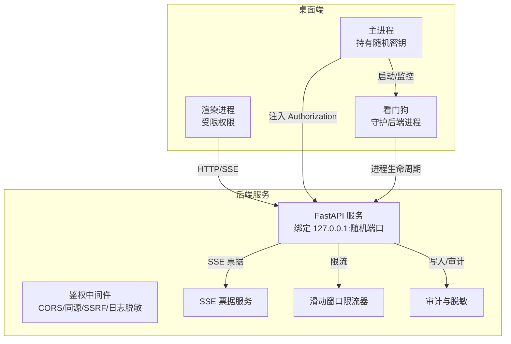
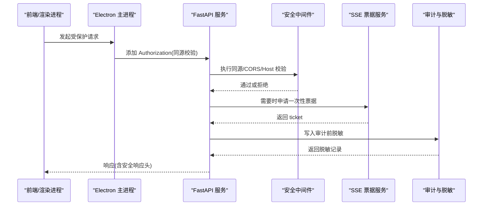
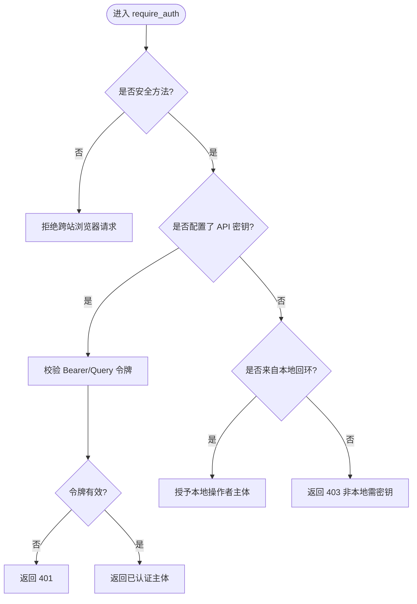
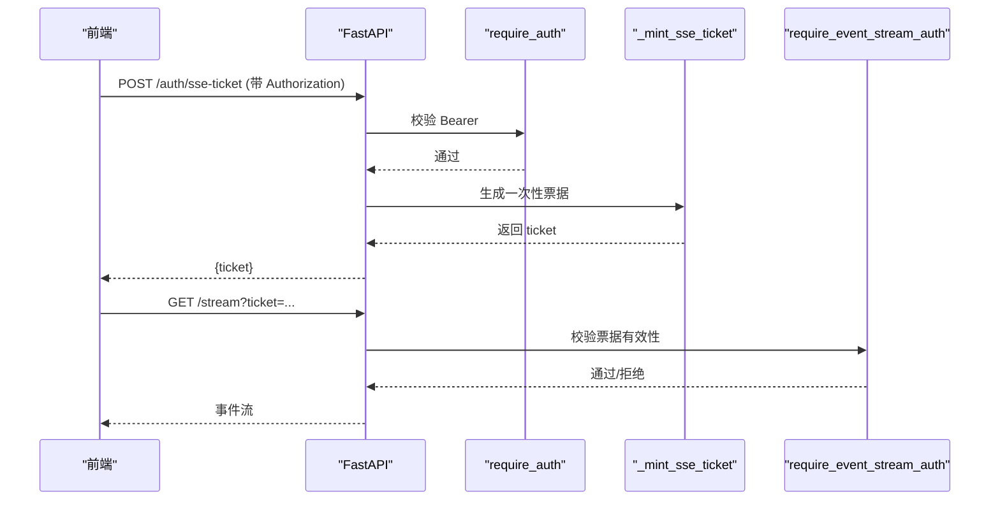
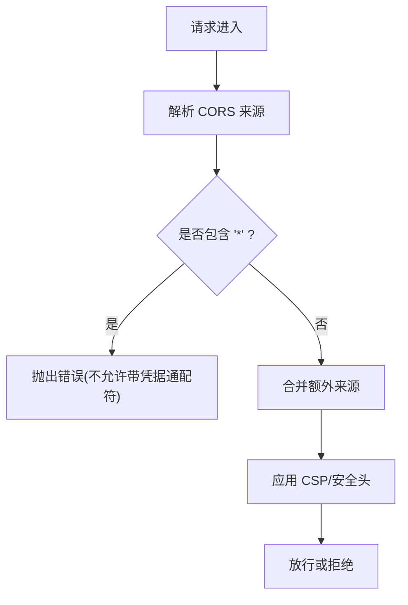
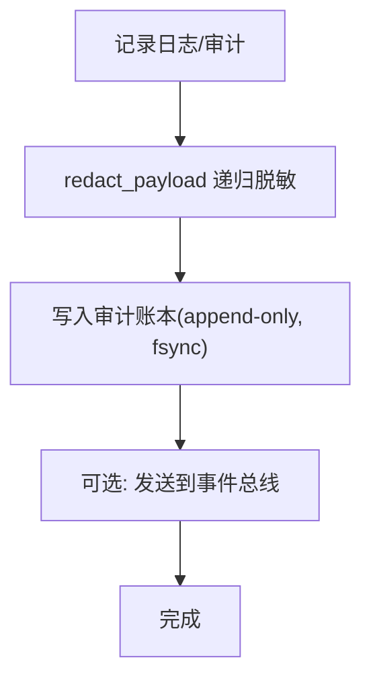
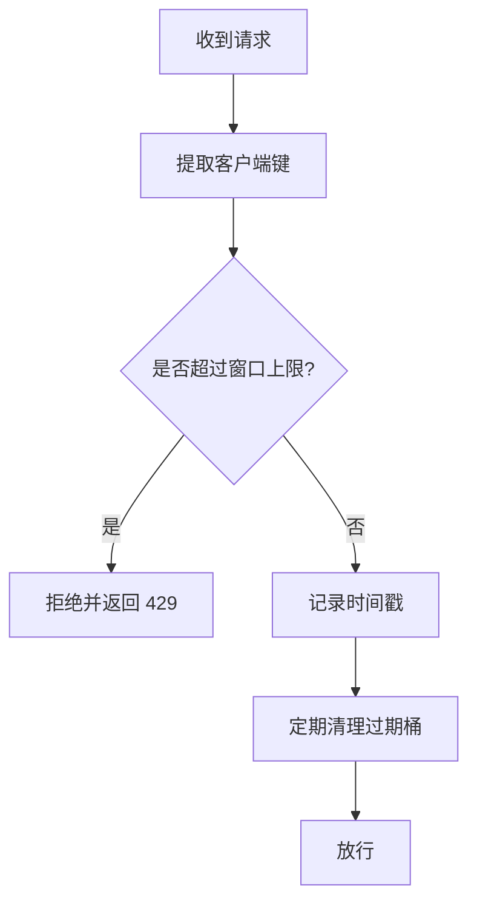
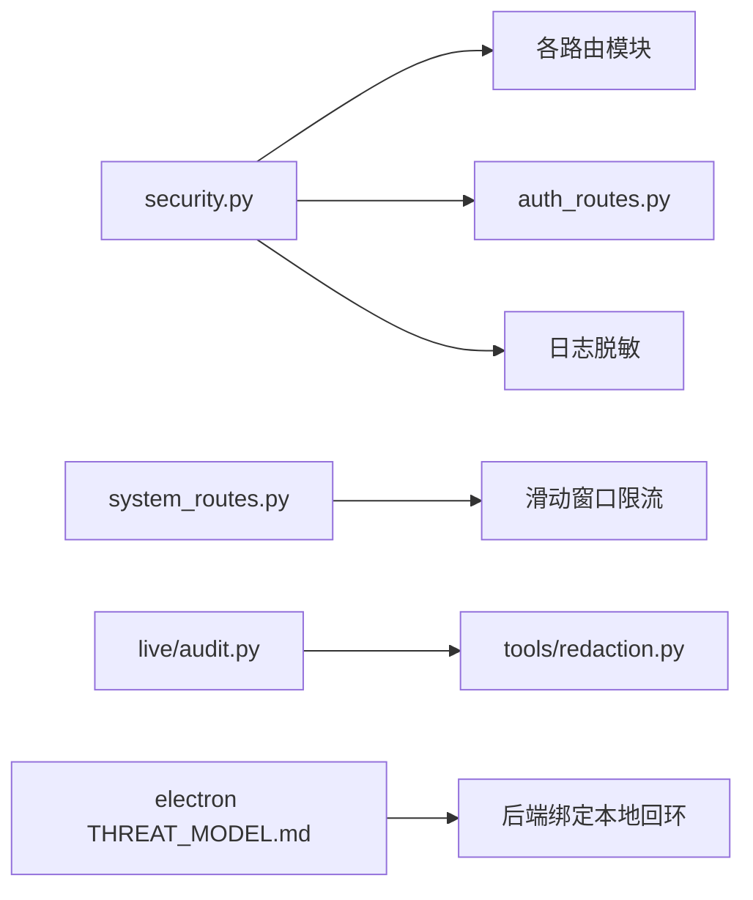

# 通信安全

<cite>
**本文引用的文件**
- [agent/src/api/security.py](file://agent/src/api/security.py)
- [agent/src/api/auth_routes.py](file://agent/src/api/auth_routes.py)
- [agent/src/api/system_routes.py](file://agent/src/api/system_routes.py)
- [agent/src/live/audit.py](file://agent/src/live/audit.py)
- [agent/src/tools/redaction.py](file://agent/src/tools/redaction.py)
- [desktop/electron/THREAT_MODEL.md](file://desktop/electron/THREAT_MODEL.md)
- [agent/tests/test_url_target_security.py](file://agent/tests/test_url_target_security.py)
- [agent/tests/test_rate_limiter_memory.py](file://agent/tests/test_rate_limiter_memory.py)
</cite>

## 目录
1. [简介](#简介)
2. [项目结构](#项目结构)
3. [核心组件](#核心组件)
4. [架构总览](#架构总览)
5. [详细组件分析](#详细组件分析)
6. [依赖关系分析](#依赖关系分析)
7. [性能考量](#性能考量)
8. [故障排查指南](#故障排查指南)
9. [结论](#结论)
10. [附录](#附录)

## 简介
本技术文档聚焦桌面应用与后端服务之间的通信安全，覆盖以下方面：
- IPC 通信的安全验证机制：发送者身份验证、消息签名/令牌校验、参数类型检查等。
- 网络请求安全控制：请求头注入防护、来源验证（同源/CORS）、CORS 配置、SSL/TLS 证书验证策略。
- API 调用认证：令牌管理、会话保持、请求频率限制。
- 数据传输加密与完整性：敏感信息脱敏、传输层加密、数据完整性校验。
- 安全配置示例、攻击防护方案、监控审计机制。
- 常见通信安全威胁的防御策略与测试方法。

## 项目结构
本项目在“桌面端 Electron”和“后端 Python API”之间通过本地回环接口进行通信，并通过统一的鉴权与安全中间件保护所有敏感路径。关键位置如下：
- 后端安全与鉴权：FastAPI 安全中间件、CORS、访问日志脱敏、SSE 票据、速率限制。
- 桌面端进程边界：Electron 主进程负责密钥生成、注入、仅对同源请求附加 Authorization 头；Python 后端绑定 127.0.0.1 随机端口并接收密钥。
- 审计与脱敏：统一的数据脱敏工具与审计账本，确保敏感字段不落地、不出网、不入日志。

图表来源
- [desktop/electron/THREAT_MODEL.md:31-74](file://desktop/electron/THREAT_MODEL.md#L31-L74)
- [agent/src/api/security.py:166-173](file://agent/src/api/security.py#L166-L173)
- [agent/src/api/security.py:235-253](file://agent/src/api/security.py#L235-L253)
- [agent/src/api/security.py:300-340](file://agent/src/api/security.py#L300-L340)
- [agent/src/api/system_routes.py:62-78](file://agent/src/api/system_routes.py#L62-L78)

章节来源
- [desktop/electron/THREAT_MODEL.md:31-74](file://desktop/electron/THREAT_MODEL.md#L31-L74)
- [agent/src/api/security.py:166-173](file://agent/src/api/security.py#L166-L173)
- [agent/src/api/security.py:235-253](file://agent/src/api/security.py#L235-L253)
- [agent/src/api/security.py:300-340](file://agent/src/api/security.py#L300-L340)
- [agent/src/api/system_routes.py:62-78](file://agent/src/api/system_routes.py#L62-L78)

## 核心组件
- 鉴权与同源控制：基于共享密钥的 Bearer 认证、同源校验、跨站请求拒绝、DNS 重绑定 Host 校验。
- CORS 与 CSP：严格默认允许列表、禁止带凭据的通配符、为文档路由提供最小化例外。
- SSE 票据：浏览器无法发送 Authorization 头时，使用一次性短效票据建立事件流。
- 访问日志脱敏：自动隐藏查询串中的 api_key/ticket 等敏感值。
- 速率限制：进程内滑动窗口限流，按客户端键控，避免资源耗尽。
- 审计与脱敏：统一 redact_payload，将敏感字段替换为占位符，再写入审计账本或事件总线。
- 桌面端进程边界：主进程持有随机密钥，仅向同源后端注入 Authorization；后端绑定本地回环地址。

章节来源
- [agent/src/api/security.py:30-103](file://agent/src/api/security.py#L30-L103)
- [agent/src/api/security.py:166-173](file://agent/src/api/security.py#L166-L173)
- [agent/src/api/security.py:235-253](file://agent/src/api/security.py#L235-L253)
- [agent/src/api/security.py:300-340](file://agent/src/api/security.py#L300-L340)
- [agent/src/api/security.py:264-298](file://agent/src/api/security.py#L264-L298)
- [agent/src/api/system_routes.py:62-78](file://agent/src/api/system_routes.py#L62-L78)
- [agent/src/live/audit.py:23-43](file://agent/src/live/audit.py#L23-L43)
- [agent/src/tools/redaction.py:1-24](file://agent/src/tools/redaction.py#L1-L24)
- [desktop/electron/THREAT_MODEL.md:62-74](file://desktop/electron/THREAT_MODEL.md#L62-L74)

## 架构总览
下图展示从前端到后端的完整安全链路：同源校验、CSP/CORS、鉴权、SSE 票据、日志脱敏、审计与限流。

图表来源
- [agent/src/api/security.py:166-173](file://agent/src/api/security.py#L166-L173)
- [agent/src/api/security.py:235-253](file://agent/src/api/security.py#L235-L253)
- [agent/src/api/auth_routes.py:44-55](file://agent/src/api/auth_routes.py#L44-L55)
- [agent/src/live/audit.py:248-271](file://agent/src/live/audit.py#L248-L271)

## 详细组件分析

### 组件A：API 鉴权与同源控制
- 共享密钥认证：支持 Bearer 头或受限场景下的查询参数；未配置密钥时仅信任本地回环来源。
- 同源校验：校验 Origin 与 Host/Port 匹配，拒绝 cross-site 请求。
- DNS 重绑定防护：对本地可信 Host 白名单进行校验，防止恶意 Host 绕过。
- 安全响应头：强制 CSP、X-Frame-Options、X-Content-Type-Options、Permissions-Policy、Referrer-Policy。

图表来源
- [agent/src/api/security.py:463-504](file://agent/src/api/security.py#L463-L504)
- [agent/src/api/security.py:423-431](file://agent/src/api/security.py#L423-L431)
- [agent/src/api/security.py:166-173](file://agent/src/api/security.py#L166-L173)
- [agent/src/api/security.py:235-253](file://agent/src/api/security.py#L235-L253)

章节来源
- [agent/src/api/security.py:463-504](file://agent/src/api/security.py#L463-L504)
- [agent/src/api/security.py:423-431](file://agent/src/api/security.py#L423-L431)
- [agent/src/api/security.py:166-173](file://agent/src/api/security.py#L166-L173)
- [agent/src/api/security.py:235-253](file://agent/src/api/security.py#L235-L253)

### 组件B：SSE 票据与事件流认证
- 浏览器 EventSource 无法携带 Authorization 头，因此先通过受保护的 /auth/sse-ticket 获取一次性票据。
- 票据有效期短且单次使用，首次消费即失效，防止重放。
- 事件流连接既支持 Bearer 也支持 ticket，但绝不接受长寿命密钥出现在 URL 中。

图表来源
- [agent/src/api/auth_routes.py:44-55](file://agent/src/api/auth_routes.py#L44-L55)
- [agent/src/api/security.py:300-340](file://agent/src/api/security.py#L300-L340)
- [agent/src/api/security.py:591-622](file://agent/src/api/security.py#L591-L622)

章节来源
- [agent/src/api/auth_routes.py:44-55](file://agent/src/api/auth_routes.py#L44-L55)
- [agent/src/api/security.py:300-340](file://agent/src/api/security.py#L300-L340)
- [agent/src/api/security.py:591-622](file://agent/src/api/security.py#L591-L622)

### 组件C：CORS 与 CSP 配置
- CORS：默认仅允许本地开发站点；禁止带凭据时使用通配符；支持额外来源追加。
- CSP：严格默认策略，仅对文档路由放宽至必要 CDN；禁止帧嵌套、限制 base-uri/form-action。
- 安全响应头：统一设置 X-Frame-Options、X-Content-Type-Options、Permissions-Policy、Referrer-Policy。

图表来源
- [agent/src/api/security.py:69-103](file://agent/src/api/security.py#L69-L103)
- [agent/src/api/security.py:147-158](file://agent/src/api/security.py#L147-L158)
- [agent/src/api/security.py:181-225](file://agent/src/api/security.py#L181-L225)
- [agent/src/api/security.py:235-253](file://agent/src/api/security.py#L235-L253)

章节来源
- [agent/src/api/security.py:69-103](file://agent/src/api/security.py#L69-L103)
- [agent/src/api/security.py:147-158](file://agent/src/api/security.py#L147-L158)
- [agent/src/api/security.py:181-225](file://agent/src/api/security.py#L181-L225)
- [agent/src/api/security.py:235-253](file://agent/src/api/security.py#L235-L253)

### 组件D：访问日志脱敏与审计
- 访问日志：自动替换查询串中的 api_key/ticket 等敏感值，避免泄露。
- 审计账本：统一 redact_payload 对结构化数据进行递归脱敏后再写入审计与事件总线。
- 防篡改链：审计记录附带哈希链，增强可追溯性。

图表来源
- [agent/src/api/security.py:264-298](file://agent/src/api/security.py#L264-L298)
- [agent/src/live/audit.py:23-43](file://agent/src/live/audit.py#L23-L43)
- [agent/src/live/audit.py:248-271](file://agent/src/live/audit.py#L248-L271)
- [agent/src/tools/redaction.py:1-24](file://agent/src/tools/redaction.py#L1-L24)

章节来源
- [agent/src/api/security.py:264-298](file://agent/src/api/security.py#L264-L298)
- [agent/src/live/audit.py:23-43](file://agent/src/live/audit.py#L23-L43)
- [agent/src/live/audit.py:248-271](file://agent/src/live/audit.py#L248-L271)
- [agent/src/tools/redaction.py:1-24](file://agent/src/tools/redaction.py#L1-L24)

### 组件E：请求频率限制
- 进程内滑动窗口限流：按客户端键控，线程安全，单调时钟避免时间跳跃影响。
- 内存泄漏防护：过期桶清理，空桶及时回收，避免无界增长。

图表来源
- [agent/src/api/system_routes.py:62-78](file://agent/src/api/system_routes.py#L62-L78)
- [agent/tests/test_rate_limiter_memory.py:35-99](file://agent/tests/test_rate_limiter_memory.py#L35-L99)

章节来源
- [agent/src/api/system_routes.py:62-78](file://agent/src/api/system_routes.py#L62-L78)
- [agent/tests/test_rate_limiter_memory.py:35-99](file://agent/tests/test_rate_limiter_memory.py#L35-L99)

### 组件F：桌面端进程边界与 IPC 安全
- 后端绑定 127.0.0.1 随机端口，仅本地可达。
- 主进程生成随机密钥，仅当请求 Origin 与后端一致时才注入 Authorization。
- 健康检查与关闭流程均需认证；异常退出由看门狗清理子进程树。
- 凭证存储使用系统级安全存储，仅以密文落盘，迁移后删除明文。

章节来源
- [desktop/electron/THREAT_MODEL.md:62-74](file://desktop/electron/THREAT_MODEL.md#L62-L74)
- [desktop/electron/THREAT_MODEL.md:96-131](file://desktop/electron/THREAT_MODEL.md#L96-L131)

## 依赖关系分析
- 安全模块依赖 FastAPI 的 Security/Request 模型，集中处理鉴权、同源、CORS、CSP、日志脱敏。
- 审计模块依赖统一脱敏工具，确保所有输出面（日志、账本、事件）均不含敏感信息。
- 速率限制模块独立实现，避免引入外部依赖，保证单进程部署下的稳定性。
- 桌面端与后端通过严格的同源与认证约束形成最小信任域。

图表来源
- [agent/src/api/security.py:166-173](file://agent/src/api/security.py#L166-L173)
- [agent/src/api/auth_routes.py:44-55](file://agent/src/api/auth_routes.py#L44-L55)
- [agent/src/api/system_routes.py:62-78](file://agent/src/api/system_routes.py#L62-L78)
- [agent/src/live/audit.py:248-271](file://agent/src/live/audit.py#L248-L271)
- [agent/src/tools/redaction.py:1-24](file://agent/src/tools/redaction.py#L1-L24)
- [desktop/electron/THREAT_MODEL.md:62-74](file://desktop/electron/THREAT_MODEL.md#L62-L74)

章节来源
- [agent/src/api/security.py:166-173](file://agent/src/api/security.py#L166-L173)
- [agent/src/api/auth_routes.py:44-55](file://agent/src/api/auth_routes.py#L44-L55)
- [agent/src/api/system_routes.py:62-78](file://agent/src/api/system_routes.py#L62-L78)
- [agent/src/live/audit.py:248-271](file://agent/src/live/audit.py#L248-L271)
- [agent/src/tools/redaction.py:1-24](file://agent/src/tools/redaction.py#L1-L24)
- [desktop/electron/THREAT_MODEL.md:62-74](file://desktop/electron/THREAT_MODEL.md#L62-L74)

## 性能考量
- 鉴权与同源校验为轻量计算，开销极低。
- 滑动窗口限流使用内存队列，适合单机部署；在高并发下需评估内存占用与清理频率。
- 审计写入采用 append-only + fsync，保障持久性与一致性，可能带来 I/O 延迟；建议结合异步写入与批处理优化吞吐。
- 日志脱敏使用正则匹配，注意在极高日志量场景下进行基准测试。

[本节为通用指导，无需特定文件引用]

## 故障排查指南
- 401/403 错误：
  - 检查是否配置了 API_AUTH_KEY；未配置时仅本地回环可访问。
  - 确认 Origin/Host 是否匹配，是否存在跨站请求被拒。
  - 检查 DNS 重绑定 Host 是否在白名单内。
- SSE 连接失败：
  - 确认已通过 /auth/sse-ticket 获取一次性票据。
  - 票据已被消费或过期会导致连接被拒绝。
- 日志泄露风险：
  - 确认已安装访问日志脱敏过滤器，避免 api_key/ticket 落入日志。
- 审计缺失：
  - 检查审计写入路径权限与 fsync 行为，确保 append-only 模式生效。

章节来源
- [agent/src/api/security.py:463-504](file://agent/src/api/security.py#L463-L504)
- [agent/src/api/security.py:591-622](file://agent/src/api/security.py#L591-L622)
- [agent/src/api/security.py:264-298](file://agent/src/api/security.py#L264-L298)
- [agent/src/live/audit.py:248-271](file://agent/src/live/audit.py#L248-L271)

## 结论
本项目通过多层安全控制保障通信安全：
- 严格的同源与 CORS/CSP 策略，防止跨站与脚本注入。
- 共享密钥认证与 SSE 票据机制，兼顾安全性与浏览器兼容性。
- 访问日志与审计的统一脱敏，确保敏感信息不泄露。
- 进程内限流与本地回环绑定，降低滥用与越权风险。
- 桌面端进程边界设计，最小化密钥暴露面。

[本节为总结，无需特定文件引用]

## 附录

### 安全配置示例（要点）
- 启用 API_AUTH_KEY：生产环境必须配置，禁用本地回环免密。
- CORS_ORIGINS：仅列出实际 Web UI 来源，禁止通配符。
- VIBE_TRADING_EXTRA_CORS_ORIGINS：按需追加可信来源。
- VIBE_TRADING_CSP_REPORT_ONLY：仅在调试阶段开启报告模式。
- 桌面端：后端绑定 127.0.0.1，随机端口；主进程仅对同源注入 Authorization。

章节来源
- [agent/src/api/security.py:30-103](file://agent/src/api/security.py#L30-L103)
- [agent/src/api/security.py:147-158](file://agent/src/api/security.py#L147-L158)
- [agent/src/api/security.py:181-225](file://agent/src/api/security.py#L181-L225)
- [desktop/electron/THREAT_MODEL.md:62-74](file://desktop/electron/THREAT_MODEL.md#L62-L74)

### 攻击防护方案
- SSRF 防护：对外部目标 URL 进行私有/内部 IP 拦截，阻止云元数据与回环地址访问。
- 同源与跨站：拒绝 sec-fetch-site=cross-site 的请求，校验 Origin 与 Host/Port。
- 日志泄露：自动脱敏查询串中的敏感参数。
- 票据重放：SSE 票据一次性使用，过期即失效。

章节来源
- [agent/tests/test_url_target_security.py:24-66](file://agent/tests/test_url_target_security.py#L24-L66)
- [agent/src/api/security.py:423-431](file://agent/src/api/security.py#L423-L431)
- [agent/src/api/security.py:264-298](file://agent/src/api/security.py#L264-L298)
- [agent/src/api/security.py:300-340](file://agent/src/api/security.py#L300-L340)

### 测试方法
- 限流器内存泄漏：验证过期桶清理与空桶回收。
- 审计脱敏：断言敏感键被替换为占位符，结果预览不包含秘密。
- 同源与跨站：构造跨站请求应被拒绝。
- SSE 票据：验证一次性使用与过期行为。

章节来源
- [agent/tests/test_rate_limiter_memory.py:35-99](file://agent/tests/test_rate_limiter_memory.py#L35-L99)
- [agent/tests/test_swarm_m4_e2e.py:490-506](file://agent/tests/test_swarm_m4_e2e.py#L490-L506)
- [agent/tests/test_url_target_security.py:24-66](file://agent/tests/test_url_target_security.py#L24-L66)
- [agent/src/api/security.py:300-340](file://agent/src/api/security.py#L300-L340)