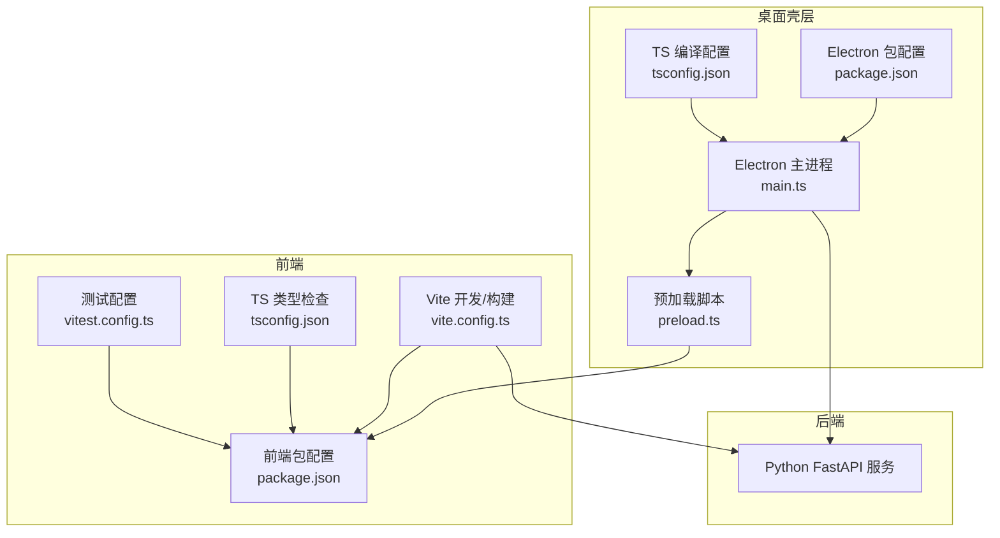
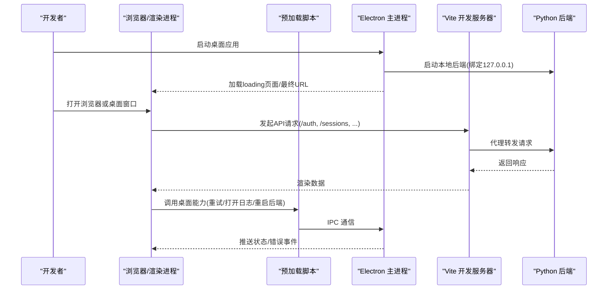
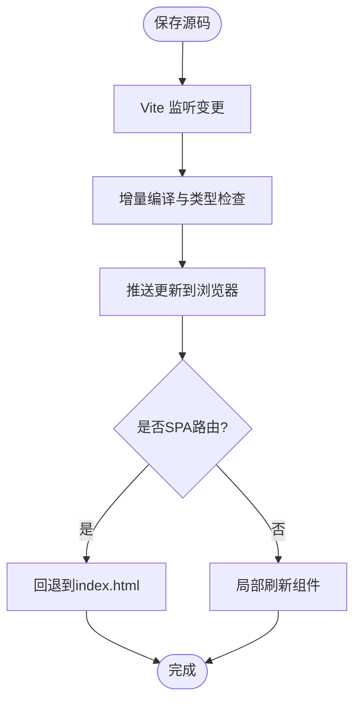
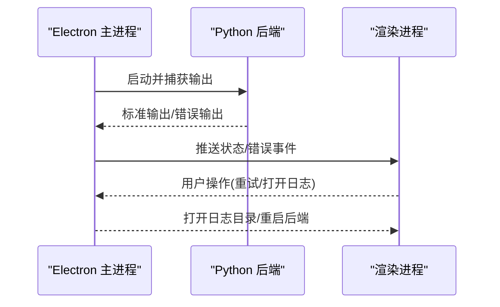
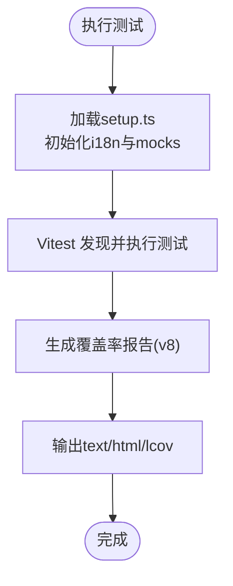
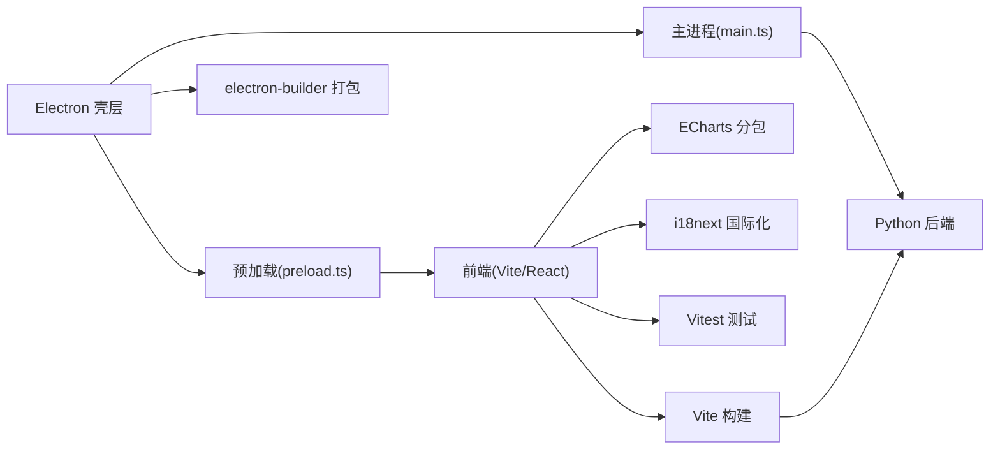

# 开发与调试

<cite>
**本文引用的文件**
- [desktop/electron/package.json](file://desktop/electron/package.json)
- [desktop/electron/tsconfig.json](file://desktop/electron/tsconfig.json)
- [desktop/electron/src/main.ts](file://desktop/electron/src/main.ts)
- [desktop/electron/src/preload.ts](file://desktop/electron/src/preload.ts)
- [desktop/electron/README.md](file://desktop/electron/README.md)
- [frontend/package.json](file://frontend/package.json)
- [frontend/vite.config.ts](file://frontend/vite.config.ts)
- [frontend/tsconfig.json](file://frontend/tsconfig.json)
- [frontend/vitest.config.ts](file://frontend/vitest.config.ts)
- [frontend/src/tests/setup.ts](file://frontend/src/tests/setup.ts)
</cite>

## 目录
1. [简介](#简介)
2. [项目结构](#项目结构)
3. [核心组件](#核心组件)
4. [架构总览](#架构总览)
5. [详细组件分析](#详细组件分析)
6. [依赖关系分析](#依赖关系分析)
7. [性能考虑](#性能考虑)
8. [故障排除指南](#故障排除指南)
9. [结论](#结论)
10. [附录](#附录)

## 简介
本指南面向桌面应用开发者，覆盖从环境搭建、构建与打包，到调试、热重载、日志与错误追踪、测试与覆盖率、以及性能优化的完整流程。本项目由三层组成：
- Electron 桌面壳层（Node/TypeScript）：负责进程管理、安全隔离、本地后端启动与生命周期控制。
- React 前端（Vite + TypeScript）：提供用户界面与交互，开发时通过代理访问后端 API。
- Python 后端（FastAPI）：业务逻辑与数据服务，被 Electron 在本地以子进程方式启动并守护。

## 项目结构
- desktop/electron：Electron 主进程与渲染进程桥接代码、打包脚本与 Windows 安装器配置。
- frontend：React 前端工程，使用 Vite 进行开发与构建，Vitest 进行单元测试与覆盖率统计。
- agent：Python 后端与 CLI、工具链等（本指南聚焦桌面开发与调试，不展开其内部细节）。

**图示来源**
- [desktop/electron/src/main.ts:1-120](file://desktop/electron/src/main.ts#L1-L120)
- [desktop/electron/src/preload.ts:1-18](file://desktop/electron/src/preload.ts#L1-L18)
- [desktop/electron/package.json:1-86](file://desktop/electron/package.json#L1-L86)
- [desktop/electron/tsconfig.json:1-16](file://desktop/electron/tsconfig.json#L1-L16)
- [frontend/package.json:1-58](file://frontend/package.json#L1-L58)
- [frontend/vite.config.ts:1-71](file://frontend/vite.config.ts#L1-L71)
- [frontend/tsconfig.json:1-25](file://frontend/tsconfig.json#L1-L25)
- [frontend/vitest.config.ts:1-24](file://frontend/vitest.config.ts#L1-L24)

**章节来源**
- [desktop/electron/README.md:1-93](file://desktop/electron/README.md#L1-L93)
- [desktop/electron/package.json:1-86](file://desktop/electron/package.json#L1-L86)
- [frontend/package.json:1-58](file://frontend/package.json#L1-L58)

## 核心组件
- Electron 主进程：创建窗口、管理本地后端进程、注入安全头、处理 IPC 与菜单、错误上报与日志路径设置。
- 预加载脚本：向渲染进程暴露受限 API（状态、错误、重试、打开日志、重启后端、凭据管理等），保持上下文隔离。
- 前端开发服务器：Vite 提供热重载、端口 5899、对后端 API 的代理转发、SPA 路由回退与分包优化。
- 测试框架：Vitest 基于 jsdom，支持全局 mocks、i18n 初始化、覆盖率统计（v8 提供者）。

**章节来源**
- [desktop/electron/src/main.ts:1-285](file://desktop/electron/src/main.ts#L1-L285)
- [desktop/electron/src/preload.ts:1-18](file://desktop/electron/src/preload.ts#L1-L18)
- [frontend/vite.config.ts:1-71](file://frontend/vite.config.ts#L1-L71)
- [frontend/vitest.config.ts:1-24](file://frontend/vitest.config.ts#L1-L24)
- [frontend/src/tests/setup.ts:1-32](file://frontend/src/tests/setup.ts#L1-L32)

## 架构总览
下图展示了开发时的典型调用链：用户在浏览器中操作 UI，Vite 开发服务器将 API 请求代理到本地后端；Electron 主进程启动并守护后端，注入认证头，并在渲染进程中通过预加载脚本暴露能力。

**图示来源**
- [desktop/electron/src/main.ts:49-117](file://desktop/electron/src/main.ts#L49-L117)
- [desktop/electron/src/main.ts:119-146](file://desktop/electron/src/main.ts#L119-L146)
- [desktop/electron/src/preload.ts:1-18](file://desktop/electron/src/preload.ts#L1-L18)
- [frontend/vite.config.ts:22-57](file://frontend/vite.config.ts#L22-L57)

## 详细组件分析

### 开发环境与基础设置
- Node.js 版本要求：前端工程指定最低 Node 版本为 22.22.0。
- 依赖安装：
  - 前端：进入 frontend 目录执行包管理器命令安装依赖后构建。
  - Electron：进入 desktop/electron 目录执行包管理器命令安装依赖后构建与运行。
- TypeScript 编译配置：
  - 前端：目标 ES2020，模块 ESNext，严格模式，无输出（由 Vite 处理），包含 src，排除测试文件。
  - Electron：目标 ES2022，CommonJS，输出至 dist，启用 sourceMap，严格模式。

**章节来源**
- [frontend/package.json:6-15](file://frontend/package.json#L6-L15)
- [frontend/tsconfig.json:1-25](file://frontend/tsconfig.json#L1-L25)
- [desktop/electron/tsconfig.json:1-16](file://desktop/electron/tsconfig.json#L1-L16)
- [desktop/electron/package.json:9-22](file://desktop/electron/package.json#L9-L22)

### 调试工具与断点调试
- Chrome DevTools 集成：Electron 在非打包模式下启用 devTools，便于在渲染进程中进行断点调试与网络分析。
- 断点调试建议：
  - 在 main.ts 中设置断点观察窗口创建、IPC 注册与后端启动流程。
  - 在 preload.ts 中观察 ipcRenderer 调用与事件监听。
  - 在前端 Vite 开发服务器中利用浏览器 DevTools 进行断点与性能分析。
- 性能分析与内存泄漏检测：
  - 使用浏览器 Performance 面板记录关键交互，定位渲染瓶颈。
  - 使用 Memory 面板进行堆快照对比，识别未释放引用与闭包泄漏。
  - 结合 ECharts 等大型库的分包策略，评估首屏与交互性能。

**章节来源**
- [desktop/electron/src/main.ts:65-84](file://desktop/electron/src/main.ts#L65-L84)
- [desktop/electron/src/main.ts:119-146](file://desktop/electron/src/main.ts#L119-L146)
- [frontend/vite.config.ts:35-57](file://frontend/vite.config.ts#L35-L57)

### 热重载机制
- 源码监听：Vite 默认监听 src 下文件变更，自动触发增量编译与刷新。
- 自动编译：构建阶段使用 tsc 进行类型检查，Vite 负责打包与热更新。
- 页面刷新：开发服务器在收到变更通知后刷新页面，保持状态最小化中断。
- SPA 路由回退：针对特定路由（如 /runs/{id}、/correlation、/options）在浏览器导航时回退到 index.html，确保前端路由正常工作。

**图示来源**
- [frontend/vite.config.ts:22-57](file://frontend/vite.config.ts#L22-L57)
- [frontend/package.json:9-15](file://frontend/package.json#L9-L15)

**章节来源**
- [frontend/vite.config.ts:22-57](file://frontend/vite.config.ts#L22-L57)
- [frontend/package.json:9-15](file://frontend/package.json#L9-L15)

### 日志收集与错误追踪
- 控制台日志：Electron 主进程将后端输出写入用户日志目录，并提供菜单项打开日志文件夹。
- 文件输出：主进程设置应用日志路径，捕获后端标准输出与错误输出。
- 远程上报：当前实现通过 IPC 向渲染进程推送状态与错误消息，前端可据此展示或上报。
- 错误处理：主进程捕获未捕获异常并弹窗提示；启动失败时显示加载页并发送错误事件。

**图示来源**
- [desktop/electron/src/main.ts:49-63](file://desktop/electron/src/main.ts#L49-L63)
- [desktop/electron/src/main.ts:119-146](file://desktop/electron/src/main.ts#L119-L146)
- [desktop/electron/src/main.ts:206-210](file://desktop/electron/src/main.ts#L206-L210)
- [desktop/electron/src/main.ts:278-285](file://desktop/electron/src/main.ts#L278-L285)

**章节来源**
- [desktop/electron/src/main.ts:49-63](file://desktop/electron/src/main.ts#L49-L63)
- [desktop/electron/src/main.ts:119-146](file://desktop/electron/src/main.ts#L119-L146)
- [desktop/electron/src/main.ts:206-210](file://desktop/electron/src/main.ts#L206-L210)
- [desktop/electron/src/main.ts:278-285](file://desktop/electron/src/main.ts#L278-L285)

### 单元测试与集成测试
- 测试框架：Vitest 基于 jsdom，提供全局 API 与 DOM 模拟。
- 配置要点：
  - 启用 globals，设置 environment 为 jsdom。
  - 初始化 i18n，避免翻译字符串不稳定。
  - 提供 ResizeObserver 与 matchMedia 的全局 mock，适配图表与布局组件。
  - 覆盖率统计使用 v8 提供者，输出文本、HTML 与 LCOV。
- 运行命令：
  - 运行测试：npm test 或 npm run test:run。
  - 生成覆盖率：npm run test:coverage。

**图示来源**
- [frontend/vitest.config.ts:1-24](file://frontend/vitest.config.ts#L1-L24)
- [frontend/src/tests/setup.ts:1-32](file://frontend/src/tests/setup.ts#L1-L32)

**章节来源**
- [frontend/vitest.config.ts:1-24](file://frontend/vitest.config.ts#L1-L24)
- [frontend/src/tests/setup.ts:1-32](file://frontend/src/tests/setup.ts#L1-L32)

### 性能优化技巧
- 资源懒加载：Vite 通过 manualChunks 将 react/react-dom/react-router 与 echarts 拆分为独立 vendor 包，提升缓存命中与并行加载。
- 内存池管理：前端避免长生命周期对象持有大数组或图表实例；后端注意连接池与任务队列的生命周期管理。
- 渲染优化：减少重排与重绘，合理使用虚拟列表与按需加载；图表库按需引入与销毁。
- 网络优化：合理设置代理与缓存策略，减少重复请求；对大数据集采用分页与增量更新。

**章节来源**
- [frontend/vite.config.ts:68-78](file://frontend/vite.config.ts#L68-L78)

## 依赖关系分析
- 前端依赖：React、ECharts、i18next、TailwindCSS、Vite、Vitest 等。
- Electron 依赖：Electron、electron-builder、TypeScript。
- 构建与打包：Vite 负责前端构建，electron-builder 负责桌面应用打包与资源嵌入。

**图示来源**
- [frontend/package.json:17-55](file://frontend/package.json#L17-L55)
- [desktop/electron/package.json:24-84](file://desktop/electron/package.json#L24-L84)
- [frontend/vite.config.ts:35-68](file://frontend/vite.config.ts#L35-L68)
- [desktop/electron/src/main.ts:1-20](file://desktop/electron/src/main.ts#L1-L20)
- [desktop/electron/src/preload.ts:1-18](file://desktop/electron/src/preload.ts#L1-L18)

**章节来源**
- [frontend/package.json:17-55](file://frontend/package.json#L17-L55)
- [desktop/electron/package.json:24-84](file://desktop/electron/package.json#L24-L84)

## 性能考虑
- 首屏优化：拆分 vendor 包，减少主包体积；按需加载大型图表与第三方库。
- 运行时优化：避免在主线程执行阻塞任务；使用 Web Workers 或后台任务处理耗时计算。
- 内存管理：及时释放不再使用的对象与监听器；监控内存增长趋势，定位潜在泄漏。
- 网络优化：合理设置代理与缓存；对频繁请求进行合并与去抖。

[本节为通用指导，无需具体文件来源]

## 故障排除指南
- 启动失败：
  - 检查 Electron 主进程是否正确启动后端并等待健康检查。
  - 查看日志目录中的后端输出，确认端口占用与认证密钥。
- 无法访问后端：
  - 确认 Vite 代理配置与后端地址一致。
  - 检查渲染进程是否被限制访问非本地源。
- 权限与安全：
  - 确认上下文隔离与沙箱已启用，避免直接 nodeIntegration。
  - 验证外部链接白名单与导航拦截策略。
- 测试失败：
  - 检查 jsdom 环境下的全局 API 是否补齐（ResizeObserver、matchMedia）。
  - 确认 i18n 初始化与翻译键存在。

**章节来源**
- [desktop/electron/src/main.ts:65-117](file://desktop/electron/src/main.ts#L65-L117)
- [desktop/electron/src/main.ts:148-192](file://desktop/electron/src/main.ts#L148-L192)
- [frontend/vite.config.ts:22-57](file://frontend/vite.config.ts#L22-L57)
- [frontend/src/tests/setup.ts:1-32](file://frontend/src/tests/setup.ts#L1-L32)

## 结论
本项目提供了完整的桌面应用开发与调试基础设施：Electron 壳层保障安全与生命周期管理，Vite 提供高效的前端开发与热重载，Vitest 保证代码质量与覆盖率。通过合理的性能优化与故障排除策略，开发者可以高效地迭代与维护桌面应用。

[本节为总结性内容，无需具体文件来源]

## 附录
- 常用命令参考：
  - 前端开发：进入 frontend 目录执行开发服务器命令。
  - 前端构建：执行构建命令生成静态资源。
  - Electron 开发：进入 desktop/electron 目录执行构建与运行命令。
  - 测试与覆盖率：执行 Vitest 命令生成报告。
- 环境变量与配置：
  - 前端代理目标可通过环境变量配置。
  - Electron 主进程支持测试用户数据路径与环境变量覆盖。

**章节来源**
- [frontend/package.json:9-15](file://frontend/package.json#L9-L15)
- [desktop/electron/package.json:9-22](file://desktop/electron/package.json#L9-L22)
- [frontend/vite.config.ts:24-27](file://frontend/vite.config.ts#L24-L27)
- [desktop/electron/src/main.ts:33-34](file://desktop/electron/src/main.ts#L33-L34)