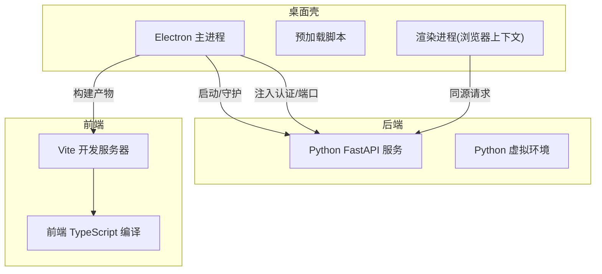
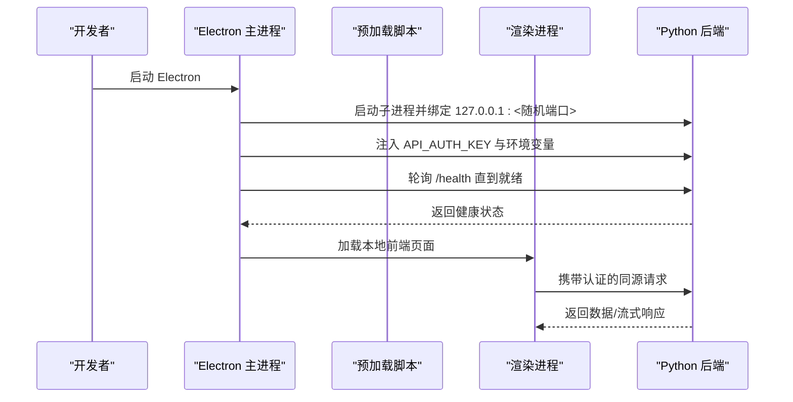
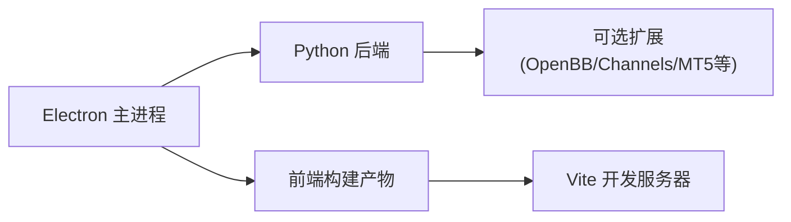

# 开发环境搭建

<cite>
**本文引用的文件**
- [pyproject.toml](file://pyproject.toml)
- [frontend/package.json](file://frontend/package.json)
- [desktop/electron/package.json](file://desktop/electron/package.json)
- [desktop/electron/tsconfig.json](file://desktop/electron/tsconfig.json)
- [frontend/tsconfig.json](file://frontend/tsconfig.json)
- [.devcontainer/devcontainer.json](file://.devcontainer/devcontainer.json)
- [start.bat](file://start.bat)
- [desktop/electron/README.md](file://desktop/electron/README.md)
- [desktop/electron/WINDOWS_PACKAGING.md](file://desktop/electron/WINDOWS_PACKAGING.md)
- [CONTRIBUTING.md](file://CONTRIBUTING.md)
</cite>

## 目录
1. [简介](#简介)
2. [项目结构](#项目结构)
3. [核心组件](#核心组件)
4. [架构总览](#架构总览)
5. [详细组件分析](#详细组件分析)
6. [依赖关系分析](#依赖关系分析)
7. [性能与构建注意事项](#性能与构建注意事项)
8. [故障排查指南](#故障排查指南)
9. [结论](#结论)
10. [附录](#附录)

## 简介
本指南面向希望在本地快速搭建可运行的桌面应用开发环境的开发者，覆盖以下目标：
- Node.js 版本要求（基于前端 engines 字段）与 npm/yarn 包管理器配置
- TypeScript 编译环境设置（前端与 Electron 主进程）
- Electron 开发环境的特殊配置（主进程、渲染进程调试、预加载脚本）
- Python 后端服务集成（虚拟环境、依赖安装、环境变量）
- 开发工具链（VS Code 调试、任务运行器、代码格式化）
- 跨平台注意事项（尤其是 Windows 的特殊要求与依赖管理）
- 常见环境问题解决方案（权限、路径、网络代理等）

## 项目结构
本项目由三大部分组成：
- Python 后端（FastAPI + Agent 逻辑）：通过 pyproject 管理依赖与可选功能
- Web 前端（React + Vite + TypeScript）：Node 版本受 engines 约束
- Electron 桌面壳（TypeScript）：负责启动并守护后端进程、安全注入认证信息、打包发布

图表来源
- [desktop/electron/package.json:9-22](file://desktop/electron/package.json#L9-L22)
- [desktop/electron/README.md:37-75](file://desktop/electron/README.md#L37-L75)
- [frontend/package.json:9-15](file://frontend/package.json#L9-L15)
- [pyproject.toml:84-90](file://pyproject.toml#L84-L90)

章节来源
- [desktop/electron/README.md:37-75](file://desktop/electron/README.md#L37-L75)
- [frontend/package.json:9-15](file://frontend/package.json#L9-L15)
- [pyproject.toml:84-90](file://pyproject.toml#L84-L90)

## 核心组件
- Python 后端
  - 使用 pyproject 声明运行时 Python 版本范围与依赖
  - 提供 CLI 入口与 API 服务，支持可选扩展（如 OpenBB、MT5、channels 等）
- 前端
  - 使用 Vite + React + TypeScript，Node 版本受 engines 约束
  - 提供开发、构建、预览与测试脚本
- Electron 桌面壳
  - 使用 TypeScript 编写主进程与预加载脚本
  - 负责启动后端、选择随机回环端口、注入认证密钥、等待健康检查后加载 UI
  - 提供 Windows 打包流程与安全存储（safeStorage）

章节来源
- [pyproject.toml:1-23](file://pyproject.toml#L1-L23)
- [frontend/package.json:6-15](file://frontend/package.json#L6-L15)
- [desktop/electron/package.json:9-22](file://desktop/electron/package.json#L9-L22)
- [desktop/electron/README.md:11-35](file://desktop/electron/README.md#L11-L35)

## 架构总览
下图展示了桌面端启动时各组件的交互顺序：Electron 主进程启动后端、注入认证、等待健康检查，随后渲染进程加载前端。

图表来源
- [desktop/electron/README.md:11-35](file://desktop/electron/README.md#L11-L35)
- [desktop/electron/THREAT_MODEL.md:31-53](file://desktop/electron/THREAT_MODEL.md#L31-L53)

## 详细组件分析

### Node.js 与前端开发环境
- Node.js 版本
  - 前端 package.json 中 engines 指定最低 Node 版本，确保构建与依赖解析一致
- 包管理器
  - 推荐使用 npm（也可用 yarn），在 frontend 目录执行安装与构建
- TypeScript 编译
  - 前端 tsconfig 启用严格模式、模块解析为 bundler，无 emit（由 Vite 处理）
- 常用脚本
  - 开发：vite dev
  - 构建：tsc -b && vite build
  - 预览：vite preview
  - 测试：vitest / vitest run / coverage

章节来源
- [frontend/package.json:6-15](file://frontend/package.json#L6-L15)
- [frontend/tsconfig.json:1-24](file://frontend/tsconfig.json#L1-L24)

### Electron 桌面壳与主/渲染进程调试
- 主进程与预加载
  - 主进程负责生命周期管理、后端进程守护、安全注入认证、等待健康检查
  - 预加载脚本用于桥接渲染进程与主进程的安全能力（如凭据写入）
- 调试建议
  - 主进程：使用 Node 调试器附加到 Electron 主进程
  - 渲染进程：使用 Chrome DevTools 打开渲染进程进行断点调试
  - 预加载脚本：作为渲染进程的增强上下文，可在 DevTools 中查看作用域
- 构建与启动
  - 构建 TypeScript 到 dist，复制静态资源，然后启动 Electron
  - 开发模式下可通过环境变量指定后端可执行路径

章节来源
- [desktop/electron/package.json:9-22](file://desktop/electron/package.json#L9-L22)
- [desktop/electron/tsconfig.json:1-15](file://desktop/electron/tsconfig.json#L1-L15)
- [desktop/electron/README.md:37-75](file://desktop/electron/README.md#L37-L75)

### Python 后端服务集成
- 虚拟环境
  - 建议使用 venv 创建隔离环境，避免污染系统 Python
- 依赖安装
  - 使用 pyproject 中的依赖声明；可选功能通过 extras 安装（如 mt5、openbb、channels 等）
  - 也可参考 requirements.txt 进行基础依赖安装
- 环境变量
  - 后端通过环境变量接收 API 认证密钥与凭据（由 Electron 注入或 .env 文件）
  - 用户级数据目录默认位于 ~/.vibe-trading，可通过环境变量迁移
- 启动方式
  - 直接运行 api_server.py（Windows 可使用 start.bat 一键启动前后端）
  - 或通过 CLI 命令启动服务

章节来源
- [pyproject.toml:1-23](file://pyproject.toml#L1-L23)
- [pyproject.toml:84-90](file://pyproject.toml#L84-L90)
- [start.bat:10-19](file://start.bat#L10-L19)
- [desktop/electron/README.md:86-97](file://desktop/electron/README.md#L86-L97)

### 开发工具链与 VS Code 配置
- Dev Container
  - 提供 Python 3.11 镜像与 Node 20 特性，自动安装后端与前端依赖
  - 暴露端口 8899（API）与 5899（前端），便于远程访问
- VS Code 扩展与设置
  - 推荐安装 Python、Pylance、ESLint、Prettier 等扩展
  - 设置默认解释器指向容器内 Python
- 任务运行器
  - 可将前端 dev/build/test 与后端 serve 注册为 VS Code 任务，实现一键启动
- 代码格式化
  - Python：black 与 ruff（见 CONTRIBUTING）
  - 前端：ESLint + Prettier（Dev Container 已包含）

章节来源
- [.devcontainer/devcontainer.json:1-39](file://.devcontainer/devcontainer.json#L1-L39)
- [CONTRIBUTING.md:140-150](file://CONTRIBUTING.md#L140-L150)

### 跨平台注意事项（Windows）
- 后端与前端
  - 使用 start.bat 一键启动后端与前端开发服务
- Electron 打包
  - 使用 Electron Builder 生成 NSIS 安装包
  - 使用 checksum-pinned 的嵌入式 Python 运行时与锁定的依赖
  - 使用 safeStorage 对敏感凭据进行加密存储与迁移
- 签名与审核
  - 审核构建为未签名产物，发布需使用 Authenticode 签名
  - 签名证书与密码必须来自外部机密存储，不得提交至仓库

章节来源
- [start.bat:10-19](file://start.bat#L10-L19)
- [desktop/electron/WINDOWS_PACKAGING.md:23-60](file://desktop/electron/WINDOWS_PACKAGING.md#L23-L60)
- [desktop/electron/WINDOWS_PACKAGING.md:74-110](file://desktop/electron/WINDOWS_PACKAGING.md#L74-L110)

## 依赖关系分析
- Python 后端
  - 运行时 Python 版本范围由 pyproject 声明
  - 核心依赖包括 LLM 编排、数据处理、文档读取、机器学习、数据提供者、REST/SSE、MCP 等
  - 可选依赖通过 extras 按需安装（如 mt5、openbb、channels、anthropic 等）
- 前端
  - Node 版本受 engines 约束
  - 依赖 React、ECharts、i18next、Tailwind、Zustand 等
  - 开发依赖包含 Vite、TypeScript、Vitest、PostCSS 等
- Electron
  - 依赖 Electron、Electron Builder、TypeScript
  - 构建脚本将 TypeScript 编译为 JS，并复制静态资源

图表来源
- [pyproject.toml:24-69](file://pyproject.toml#L24-L69)
- [pyproject.toml:105-237](file://pyproject.toml#L105-L237)
- [frontend/package.json:17-55](file://frontend/package.json#L17-L55)
- [desktop/electron/package.json:24-29](file://desktop/electron/package.json#L24-L29)

章节来源
- [pyproject.toml:24-69](file://pyproject.toml#L24-L69)
- [pyproject.toml:105-237](file://pyproject.toml#L105-L237)
- [frontend/package.json:17-55](file://frontend/package.json#L17-L55)
- [desktop/electron/package.json:24-29](file://desktop/electron/package.json#L24-L29)

## 性能与构建注意事项
- 前端构建
  - 使用 Vite 的增量构建与缓存，减少冷启动时间
  - 生产构建前执行 TypeScript 类型检查（tsc -b）
- 后端依赖
  - 使用锁定依赖（requirements-lock.txt 或 Windows 专用锁）保证可重复构建
  - 可选依赖按需安装，减小运行时体积
- Electron 打包
  - 使用压缩级别控制构建时间
  - 仅包含必要资源，避免冗余依赖进入安装包

[本节为通用指导，不直接分析具体文件]

## 故障排查指南
- 权限问题
  - Windows 下安装或写入用户目录时请以管理员权限运行终端
  - 使用 venv 隔离环境，避免系统权限冲突
- 路径配置
  - 通过环境变量指定后端可执行路径（例如 VIBE_TRADING_EXECUTABLE）
  - 用户数据目录默认位于 ~/.vibe-trading，可通过环境变量迁移
- 网络代理
  - 部分数据提供者支持 HTTP_PROXY/HTTPS_PROXY/ALL_PROXY 环境变量
  - 若遇到连接超时或速率限制，检查代理设置与网络连通性
- 端口占用
  - 后端默认绑定回环地址与随机端口，如遇端口冲突请调整或重启服务
  - 前端开发服务器默认端口 5899，可通过环境变量或配置修改
- 依赖解析失败
  - 使用锁定依赖文件重新安装
  - 清理 node_modules 与 pip cache 后重试

章节来源
- [desktop/electron/README.md:86-97](file://desktop/electron/README.md#L86-L97)
- [CONTRIBUTING.md:140-150](file://CONTRIBUTING.md#L140-L150)

## 结论
通过本指南，你可以在本地快速搭建一个完整的桌面应用开发环境：
- 使用 Node.js 满足前端版本要求，安装并运行 Vite 开发服务器
- 使用 Python 虚拟环境安装后端依赖，启动 FastAPI 服务
- 使用 Electron 主进程守护后端、注入认证、等待健康检查并加载前端
- 借助 VS Code 与 Dev Container 提升开发与调试效率
- 在 Windows 平台上遵循打包与安全存储的最佳实践

[本节为总结，不直接分析具体文件]

## 附录
- 快速启动（Windows）
  - 双击 start.bat 启动后端与前端开发服务
  - 浏览器访问 http://localhost:5899
- 开发模式（跨平台）
  - 后端：python -m venv .venv && pip install -e ".[dev]"
  - 前端：cd frontend && npm ci && npm run dev
  - Electron：cd desktop/electron && npm ci && npm start
- 调试
  - 主进程：附加 Node 调试器
  - 渲染进程：Chrome DevTools
  - 预加载脚本：在 DevTools 中查看作用域

[本节为补充说明，不直接分析具体文件]