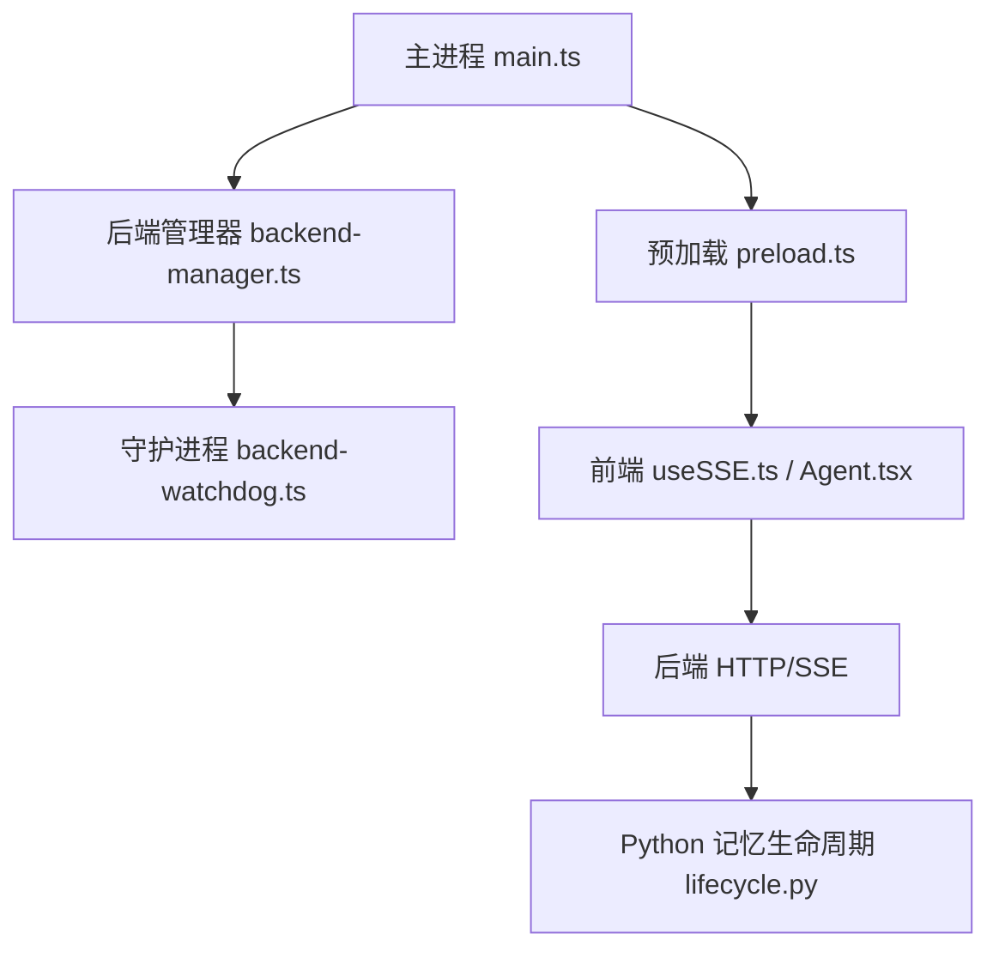
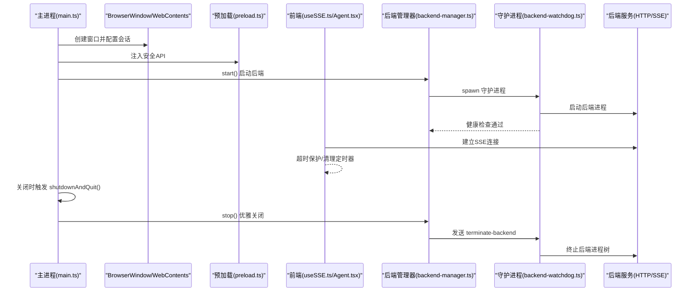
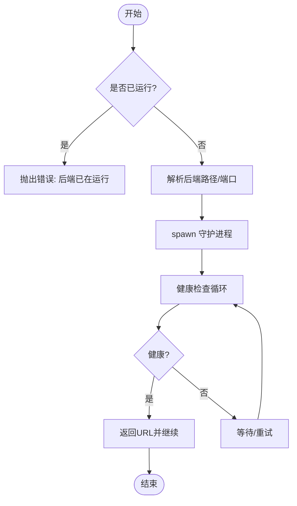
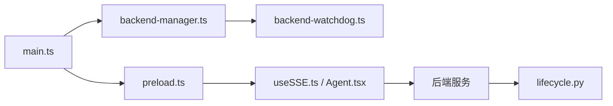

# 内存管理优化

<cite>
**本文引用的文件**
- [main.ts](file://desktop/electron/src/main.ts)
- [preload.ts](file://desktop/electron/src/preload.ts)
- [backend-manager.ts](file://desktop/electron/src/backend-manager.ts)
- [backend-watchdog.ts](file://desktop/electron/src/backend-watchdog.ts)
- [package.json](file://desktop/electron/package.json)
- [useSSE.ts](file://frontend/src/hooks/useSSE.ts)
- [Agent.tsx](file://frontend/src/pages/Agent.tsx)
- [lifecycle.py](file://agent/src/memory/lifecycle.py)
</cite>

## 目录
1. [简介](#简介)
2. [项目结构](#项目结构)
3. [核心组件](#核心组件)
4. [架构总览](#架构总览)
5. [详细组件分析](#详细组件分析)
6. [依赖关系分析](#依赖关系分析)
7. [性能考量](#性能考量)
8. [故障排查指南](#故障排查指南)
9. [结论](#结论)
10. [附录](#附录)

## 简介
本指南聚焦于桌面应用（Electron）的内存管理优化，围绕主进程与渲染进程的内存生命周期、事件监听器与定时器清理、大对象处理策略、垃圾回收调优与监控、以及关键 Electron 对象的正确释放进行系统化说明。结合本项目代码，给出可操作的实践建议与可视化流程，帮助在长时运行的桌面应用中避免内存泄漏并提升稳定性。

## 项目结构
本项目包含 Electron 桌面端（desktop/electron）、前端页面（frontend）与后端服务（agent）。Electron 主进程负责窗口管理、IPC、子进程（后端守护）生命周期；预加载脚本暴露安全桥接；前端通过 SSE 与后端交互；Python 侧提供持久化记忆的生命周期管理与压缩归档等能力。

图表来源
- [main.ts:65-117](file://desktop/electron/src/main.ts#L65-L117)
- [preload.ts:3-17](file://desktop/electron/src/preload.ts#L3-L17)
- [backend-manager.ts:63-146](file://desktop/electron/src/backend-manager.ts#L63-L146)
- [backend-watchdog.ts:31-68](file://desktop/electron/src/backend-watchdog.ts#L31-L68)
- [useSSE.ts:178-181](file://frontend/src/hooks/useSSE.ts#L178-L181)
- [Agent.tsx:1384-1400](file://frontend/src/pages/Agent.tsx#L1384-L1400)
- [lifecycle.py:183-273](file://agent/src/memory/lifecycle.py#L183-L273)

章节来源
- [main.ts:65-117](file://desktop/electron/src/main.ts#L65-L117)
- [package.json:33-86](file://desktop/electron/package.json#L33-L86)

## 核心组件
- 主进程窗口与 IPC：创建 BrowserWindow、配置 WebContents 会话、注册 IPC 通道、处理关闭与重启逻辑。
- 预加载桥接：向渲染进程暴露受限 API，封装 IPC 调用。
- 后端管理器：启动/停止外部后端进程，健康检查，日志捕获，优雅关闭与强制终止。
- 守护进程：监控父进程存活、转发后端输出、响应终止指令、清理进程树。
- 前端 SSE：建立/关闭 EventSource，超时保护与重连，清理定时器与引用。
- Python 记忆生命周期：质量评分、重要性衰减、GC 归档/删除、压缩流水线。

章节来源
- [main.ts:119-146](file://desktop/electron/src/main.ts#L119-L146)
- [preload.ts:3-17](file://desktop/electron/src/preload.ts#L3-L17)
- [backend-manager.ts:63-187](file://desktop/electron/src/backend-manager.ts#L63-L187)
- [backend-watchdog.ts:43-101](file://desktop/electron/src/backend-watchdog.ts#L43-L101)
- [useSSE.ts:178-181](file://frontend/src/hooks/useSSE.ts#L178-L181)
- [Agent.tsx:1384-1400](file://frontend/src/pages/Agent.tsx#L1384-L1400)
- [lifecycle.py:183-273](file://agent/src/memory/lifecycle.py#L183-L273)

## 架构总览
下图展示从主进程到前端、再到后端的完整数据与控制流，标注了关键的内存相关点（窗口、WebContents、IPC、子进程、SSE 连接、日志流）。

图表来源
- [main.ts:65-117](file://desktop/electron/src/main.ts#L65-L117)
- [main.ts:249-255](file://desktop/electron/src/main.ts#L249-L255)
- [backend-manager.ts:63-146](file://desktop/electron/src/backend-manager.ts#L63-L146)
- [backend-manager.ts:148-187](file://desktop/electron/src/backend-manager.ts#L148-L187)
- [backend-watchdog.ts:31-68](file://desktop/electron/src/backend-watchdog.ts#L31-L68)
- [backend-watchdog.ts:74-101](file://desktop/electron/src/backend-watchdog.ts#L74-L101)
- [useSSE.ts:178-181](file://frontend/src/hooks/useSSE.ts#L178-L181)
- [Agent.tsx:1384-1400](file://frontend/src/pages/Agent.tsx#L1384-L1400)

## 详细组件分析

### 主进程与窗口生命周期（BrowserWindow/WebContents）
- 窗口创建与配置：启用沙箱、上下文隔离、禁用 Node 集成，设置自定义 partition 隔离存储，减少跨页面状态污染。
- 导航与外链控制：拦截 will-navigate 与 setWindowOpenHandler，防止意外导航导致资源泄漏。
- 关闭流程：阻止默认关闭行为，进入统一关闭流程，确保后端优雅退出后再退出应用。
- 内存要点：
  - 避免在 close 中直接 app.quit()，应先停止后端再退出，防止残留子进程占用内存。
  - 使用 once("ready-to-show") 显示窗口，减少首屏渲染期间的阻塞。
  - 对 webRequest 仅绑定必要处理器，避免长期持有大对象。

章节来源
- [main.ts:65-117](file://desktop/electron/src/main.ts#L65-L117)
- [main.ts:249-255](file://desktop/electron/src/main.ts#L249-L255)

### IPC 安全桥与事件清理
- 预加载层通过 contextBridge 暴露最小 API，将 IPC 调用封装为函数，降低渲染进程直接操作主进程的风险。
- 事件订阅：onStatus/onError 使用 ipcRenderer.on，需确保在组件卸载或不再需要时移除监听，避免累积。
- 最佳实践：
  - 在 useEffect 返回清理函数中移除监听，或使用一次性监听。
  - 避免在高频回调中创建闭包引用大对象。

章节来源
- [preload.ts:3-17](file://desktop/electron/src/preload.ts#L3-L17)

### 后端管理器与守护进程（子进程内存管理）
- 启动流程：解析后端可执行路径，分配端口，创建日志流，启动守护进程并通过健康检查确认就绪。
- 优雅关闭：先尝试 HTTP 关闭接口，等待退出；若未退出则通过 IPC 通知守护进程终止后端进程树；必要时强制 kill。
- 守护职责：监控父进程存活，转发标准输出/错误，响应 terminate-backend，清理进程树并退出。
- 内存要点：
  - 日志流 WriteStream 在 stop 中显式 end，避免句柄泄漏。
  - 子进程 error/exit 事件必须处理，避免悬挂进程。
  - 健康检查使用 AbortSignal.timeout，避免长时间占用连接。

图表来源
- [backend-manager.ts:63-146](file://desktop/electron/src/backend-manager.ts#L63-L146)
- [backend-manager.ts:261-286](file://desktop/electron/src/backend-manager.ts#L261-L286)

章节来源
- [backend-manager.ts:63-187](file://desktop/electron/src/backend-manager.ts#L63-L187)
- [backend-watchdog.ts:31-101](file://desktop/electron/src/backend-watchdog.ts#L31-L101)

### 前端 SSE 连接与定时器清理
- 连接建立与关闭：useSSE 维护 EventSource 引用，在清理阶段主动 close，并重置状态标志，避免重复连接。
- 超时保护：Agent 页面在 streaming 状态下设置定时器，若无事件到达则刷新状态并归档部分结果，防止“假活”连接占用内存。
- 内存要点：
  - 每次重连前关闭旧连接，避免多路 SSE 同时存在。
  - 清理 setInterval/clearTimeout，避免定时器累积。
  - 使用 ref 记录最新 generation，忽略过期回调，减少无用计算。

章节来源
- [useSSE.ts:178-181](file://frontend/src/hooks/useSSE.ts#L178-L181)
- [Agent.tsx:1384-1400](file://frontend/src/pages/Agent.tsx#L1384-L1400)

### Python 记忆生命周期与 GC 策略
- 质量评分与访问追踪：根据任务成功/失败、用户确认/拒绝等事件调整条目质量分，限制单次会话增量上限。
- 重要性衰减与 GC：基于质量分、访问次数、最近访问时间计算重要性，低于阈值进行归档或删除；支持 dry-run 审计。
- 压缩流水线：对老化条目进行压缩并回写 frontmatter，减少磁盘与内存占用。
- 内存要点：
  - 所有写操作受文件级锁保护，避免并发写入导致损坏。
  - GC 与压缩可独立开关，便于在生产环境按需启用。
  - 归档目录与索引重建保证一致性。

章节来源
- [lifecycle.py:183-273](file://agent/src/memory/lifecycle.py#L183-L273)
- [lifecycle.py:275-318](file://agent/src/memory/lifecycle.py#L275-L318)
- [lifecycle.py:323-421](file://agent/src/memory/lifecycle.py#L323-L421)

## 依赖关系分析
- 主进程依赖预加载桥接与后端管理器；后端管理器依赖守护进程；前端通过 SSE 与后端通信；Python 记忆模块提供持久化与压缩能力。
- 构建产物与打包：asars 压缩、额外资源打包、语言资源等影响运行时内存与 I/O。

图表来源
- [main.ts:65-117](file://desktop/electron/src/main.ts#L65-L117)
- [backend-manager.ts:63-146](file://desktop/electron/src/backend-manager.ts#L63-L146)
- [backend-watchdog.ts:31-68](file://desktop/electron/src/backend-watchdog.ts#L31-L68)
- [useSSE.ts:178-181](file://frontend/src/hooks/useSSE.ts#L178-L181)
- [lifecycle.py:183-273](file://agent/src/memory/lifecycle.py#L183-L273)

章节来源
- [package.json:33-86](file://desktop/electron/package.json#L33-L86)

## 性能考量
- 窗口与 WebContents：
  - 使用沙箱与上下文隔离，减少渲染进程权限与内存面。
  - 合理设置窗口尺寸与最小尺寸，避免不必要的重排。
  - 仅在开发环境开启 DevTools，生产环境关闭以减少开销。
- IPC 与事件：
  - 避免在主进程与渲染进程间传递超大对象，采用分块或流式传输。
  - 及时移除事件监听器，避免闭包引用导致无法释放。
- 子进程与日志：
  - 日志流按天滚动并显式关闭，避免句柄泄漏。
  - 健康检查与关闭请求带超时，避免阻塞主线程。
- 前端 SSE：
  - 严格关闭旧连接，避免多路连接造成内存增长。
  - 使用超时保护，断开无响应的连接并清理定时器。
- Python 记忆：
  - 启用 GC 与压缩，定期归档低重要性条目，减少内存与磁盘压力。
  - 使用 dry-run 评估 GC 效果，避免误删重要数据。

[本节为通用指导，不直接分析具体文件]

## 故障排查指南
- 常见症状：
  - 应用长时间运行后内存持续增长：检查是否有未清理的事件监听器、定时器、SSE 连接。
  - 关闭窗口后仍有后台进程：检查后端管理器与守护进程的关闭流程是否完整。
  - 日志文件未关闭：确认 WriteStream 在 stop 中被 end。
- 定位方法：
  - 使用 Chrome DevTools Memory 面板录制堆快照，比较不同阶段的对象保留树，查找异常增长的对象。
  - 使用 Electron 内置性能分析器（Performance）观察主线程与渲染线程活动。
  - 检查后端健康检查与关闭接口是否可达，确认网络与鉴权头是否正确。
- 修复建议：
  - 在组件卸载时移除所有事件监听器与定时器。
  - 确保后端管理器 stop 流程覆盖 HTTP 关闭、IPC 终止、进程树清理。
  - 对大对象采用分块加载与流式处理，避免一次性驻留内存。

章节来源
- [backend-manager.ts:148-187](file://desktop/electron/src/backend-manager.ts#L148-L187)
- [backend-watchdog.ts:74-101](file://desktop/electron/src/backend-watchdog.ts#L74-L101)
- [useSSE.ts:178-181](file://frontend/src/hooks/useSSE.ts#L178-L181)
- [Agent.tsx:1384-1400](file://frontend/src/pages/Agent.tsx#L1384-L1400)

## 结论
通过在主进程、预加载层、前端与后端各层实施严格的对象生命周期管理、事件与定时器清理、子进程优雅关闭、以及 Python 侧的记忆 GC 与压缩，可以显著降低 Electron 桌面应用的内存泄漏风险并提升稳定性。建议在生产环境中持续使用内存分析工具进行监控与回归测试，确保变更不会引入新的泄漏点。

[本节为总结性内容，不直接分析具体文件]

## 附录
- 大对象处理策略：
  - 数据分块加载：将大数据集拆分为小块，逐块处理并释放中间结果。
  - 流式处理：使用流式 API（如 SSE、ReadableStream）逐步消费数据，避免整段驻留。
  - 内存映射文件：对超大文件使用内存映射（mmap）技术，按需读取片段，降低内存峰值。
- 垃圾回收调优：
  - 手动触发时机：在批量数据处理完成后、页面切换时、空闲时段触发 GC。
  - 监控指标：RSS、JS Heap Size、DOM Nodes、EventListeners 数量、定时器数量。
  - 检测工具：Chrome DevTools Memory 面板、Electron 性能分析器、Node.js --inspect 调试。
- 示例参考路径（不直接展示代码）：
  - 主进程窗口与 IPC：[main.ts:65-117](file://desktop/electron/src/main.ts#L65-L117)、[main.ts:119-146](file://desktop/electron/src/main.ts#L119-L146)
  - 预加载桥接：[preload.ts:3-17](file://desktop/electron/src/preload.ts#L3-L17)
  - 后端管理器与守护：[backend-manager.ts:63-187](file://desktop/electron/src/backend-manager.ts#L63-L187)、[backend-watchdog.ts:31-101](file://desktop/electron/src/backend-watchdog.ts#L31-L101)
  - 前端 SSE 与超时保护：[useSSE.ts:178-181](file://frontend/src/hooks/useSSE.ts#L178-L181)、[Agent.tsx:1384-1400](file://frontend/src/pages/Agent.tsx#L1384-L1400)
  - Python 记忆生命周期与 GC：[lifecycle.py:183-273](file://agent/src/memory/lifecycle.py#L183-L273)

[本节为补充信息，不直接分析具体文件]