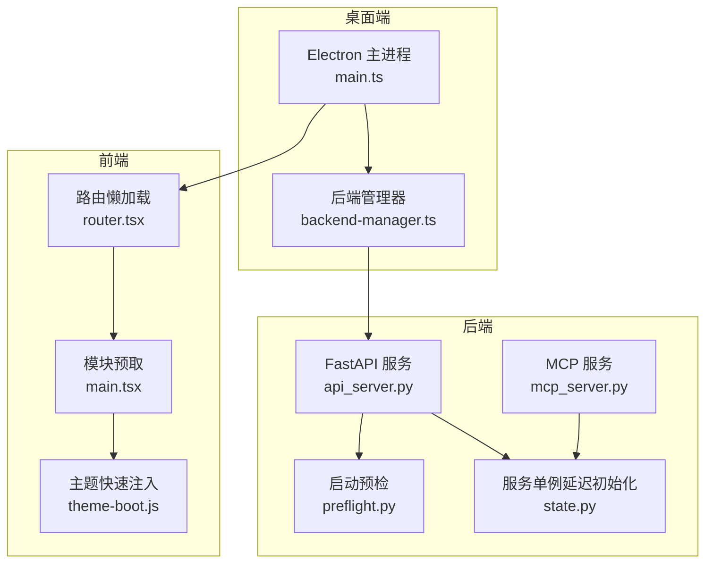
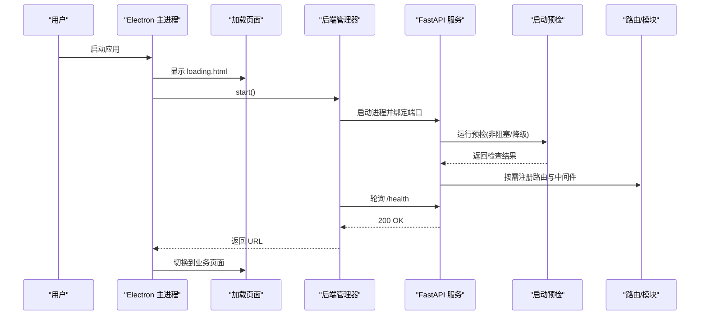
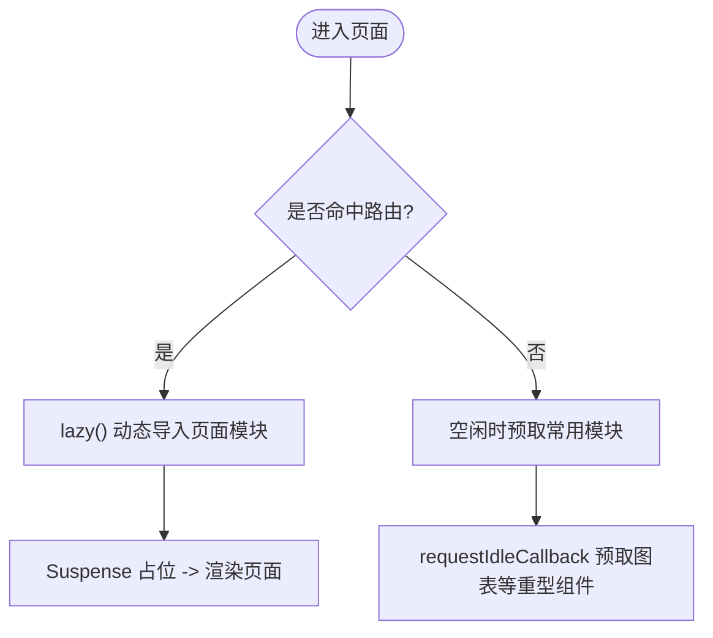
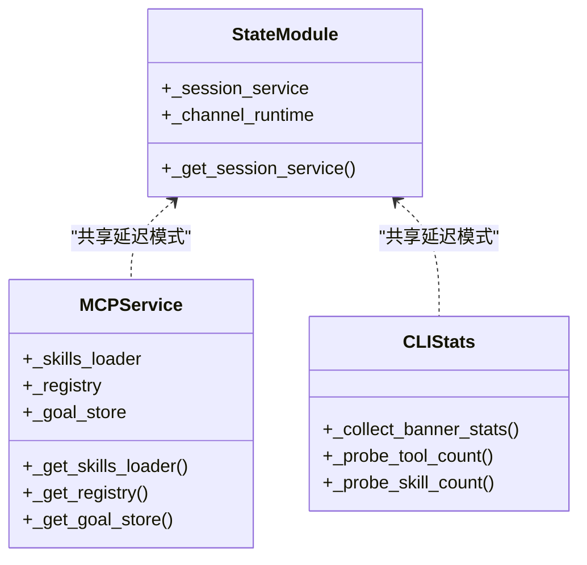
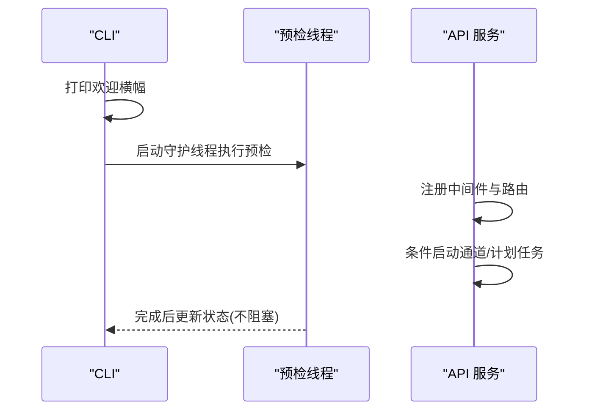
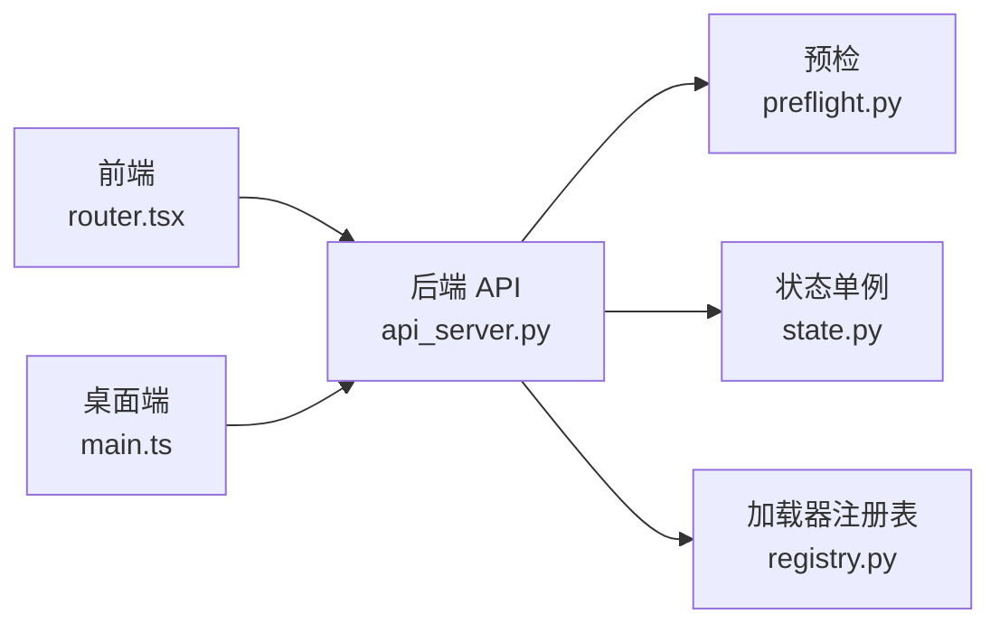

# 启动性能优化

<cite>
**本文引用的文件**
- [agent/api_server.py](file://agent/api_server.py)
- [agent/mcp_server.py](file://agent/mcp_server.py)
- [agent/src/preflight.py](file://agent/src/preflight.py)
- [agent/src/api/state.py](file://agent/src/api/state.py)
- [desktop/electron/src/main.ts](file://desktop/electron/src/main.ts)
- [desktop/electron/src/backend-manager.ts](file://desktop/electron/src/backend-manager.ts)
- [frontend/src/main.tsx](file://frontend/src/main.tsx)
- [frontend/src/router.tsx](file://frontend/src/router.tsx)
- [frontend/public/theme-boot.js](file://frontend/public/theme-boot.js)
- [agent/cli/main.py](file://agent/cli/main.py)
- [agent/scripts/bench_performance.py](file://agent/scripts/bench_performance.py)
</cite>

## 目录
1. [简介](#简介)
2. [项目结构](#项目结构)
3. [核心组件](#核心组件)
4. [架构总览](#架构总览)
5. [详细组件分析](#详细组件分析)
6. [依赖分析](#依赖分析)
7. [性能考量](#性能考量)
8. [故障排查指南](#故障排查指南)
9. [结论](#结论)
10. [附录](#附录)

## 简介
本指南聚焦于 Vibe-Trading 应用的启动性能优化，覆盖渐进式启动、按需加载、依赖延迟初始化、启动流程优化、监控与测试等主题。文档基于仓库中的实际实现进行梳理，给出可落地的策略与最佳实践，帮助在桌面端、Web 前端与后端服务三个层面降低冷/热启动时间、减少首屏阻塞并提升整体响应性。

## 项目结构
应用由三部分组成：
- 桌面端（Electron）：负责进程管理、后端生命周期、本地安全与 UI 展示。
- Web 前端（React + Vite）：提供用户界面，采用路由级懒加载与空闲时预取。
- 后端（Python FastAPI/MCP）：提供研究、回测、数据访问等能力，支持 CLI、API Server 与 MCP 服务。

图表来源
- [desktop/electron/src/main.ts:49-192](file://desktop/electron/src/main.ts#L49-L192)
- [desktop/electron/src/backend-manager.ts:63-146](file://desktop/electron/src/backend-manager.ts#L63-L146)
- [frontend/src/router.tsx:1-73](file://frontend/src/router.tsx#L1-L73)
- [frontend/src/main.tsx:11-35](file://frontend/src/main.tsx#L11-L35)
- [frontend/public/theme-boot.js:1-24](file://frontend/public/theme-boot.js#L1-L24)
- [agent/api_server.py:127-171](file://agent/api_server.py#L127-L171)
- [agent/src/preflight.py:284-337](file://agent/src/preflight.py#L284-L337)
- [agent/src/api/state.py:1-45](file://agent/src/api/state.py#L1-L45)

章节来源
- [desktop/electron/src/main.ts:49-192](file://desktop/electron/src/main.ts#L49-L192)
- [desktop/electron/src/backend-manager.ts:63-146](file://desktop/electron/src/backend-manager.ts#L63-L146)
- [frontend/src/router.tsx:1-73](file://frontend/src/router.tsx#L1-L73)
- [frontend/src/main.tsx:11-35](file://frontend/src/main.tsx#L11-L35)
- [frontend/public/theme-boot.js:1-24](file://frontend/public/theme-boot.js#L1-L24)
- [agent/api_server.py:127-171](file://agent/api_server.py#L127-L171)
- [agent/src/preflight.py:284-337](file://agent/src/preflight.py#L284-L337)
- [agent/src/api/state.py:1-45](file://agent/src/api/state.py#L1-L45)

## 核心组件
- 桌面端启动器：创建窗口、显示加载页、启动后端并等待健康检查通过。
- 后端服务：FastAPI 应用装配、中间件注册、路由按需引入、启动前检查与后台任务调度。
- 前端入口：最小化初始包体，路由级懒加载，空闲时预取关键模块，立即注入主题避免闪烁。
- 启动预检：校验 LLM 提供商与数据源可用性，区分关键与非关键失败。
- 服务单例延迟初始化：会话、通道、运行时等仅在启用且首次使用时构建。

章节来源
- [desktop/electron/src/main.ts:49-192](file://desktop/electron/src/main.ts#L49-L192)
- [agent/api_server.py:127-171](file://agent/api_server.py#L127-L171)
- [frontend/src/router.tsx:1-73](file://frontend/src/router.tsx#L1-L73)
- [frontend/src/main.tsx:11-35](file://frontend/src/main.tsx#L11-L35)
- [agent/src/preflight.py:284-337](file://agent/src/preflight.py#L284-L337)
- [agent/src/api/state.py:1-45](file://agent/src/api/state.py#L1-L45)

## 架构总览
下图展示了从 Electron 主进程到后端服务的完整启动链路，以及前后端的并行优化点。

图表来源
- [desktop/electron/src/main.ts:49-192](file://desktop/electron/src/main.ts#L49-L192)
- [desktop/electron/src/backend-manager.ts:63-146](file://desktop/electron/src/backend-manager.ts#L63-L146)
- [agent/api_server.py:127-171](file://agent/api_server.py#L127-L171)
- [agent/src/preflight.py:284-337](file://agent/src/preflight.py#L284-L337)

## 详细组件分析

### 渐进式启动策略
- 启动画面优化
  - 桌面端：先渲染轻量 loading.html，再异步启动后端与健康检查，避免白屏。
  - 前端：使用 theme-boot.js 在 React 渲染前设置主题类名，防止样式闪烁。
  - 后端：FastAPI 的 lifespan 中执行预检与可选的通道/调度器启动，保证错误不阻塞主流程。
- 后台任务延迟执行
  - 预检在独立线程或异步阶段执行，不影响首帧呈现。
  - 定时研究与通道运行时按配置条件启动，未启用则跳过。
- 关键路径资源优先加载
  - 前端仅加载路由骨架与必要样式，页面组件通过 lazy 动态导入。
  - 使用 requestIdleCallback 在空闲时预取图表等重型组件。

章节来源
- [desktop/electron/src/main.ts:49-192](file://desktop/electron/src/main.ts#L49-L192)
- [frontend/public/theme-boot.js:1-24](file://frontend/public/theme-boot.js#L1-L24)
- [agent/api_server.py:127-171](file://agent/api_server.py#L127-L171)
- [frontend/src/main.tsx:11-35](file://frontend/src/main.tsx#L11-L35)

### 按需加载机制设计
- 模块懒加载
  - 前端路由全部使用 React.lazy 包裹，配合 Suspense 占位，仅在路由命中时加载对应页面。
  - 后端路由模块在应用启动后按功能分组 import，避免一次性导入所有依赖。
- 插件动态加载
  - MCP 工具与服务单例通过函数封装，首次调用时才构建实例，减少启动开销。
  - 数据源加载器通过注册表按需导入，避免无关库常驻内存。
- 功能特性开关
  - 会话运行时、通道自动启动、计划任务等通过配置项控制，默认关闭则不参与启动流程。

图表来源
- [frontend/src/router.tsx:1-73](file://frontend/src/router.tsx#L1-L73)
- [frontend/src/main.tsx:11-35](file://frontend/src/main.tsx#L11-L35)
- [agent/mcp_server.py:319-344](file://agent/mcp_server.py#L319-L344)
- [agent/backtest/loaders/registry.py:88-116](file://agent/backtest/loaders/registry.py#L88-L116)

章节来源
- [frontend/src/router.tsx:1-73](file://frontend/src/router.tsx#L1-L73)
- [frontend/src/main.tsx:11-35](file://frontend/src/main.tsx#L11-L35)
- [agent/mcp_server.py:319-344](file://agent/mcp_server.py#L319-L344)
- [agent/backtest/loaders/registry.py:88-116](file://agent/backtest/loaders/registry.py#L88-L116)

### 依赖延迟初始化技术
- 第三方库延迟引入
  - 后端路由与工具模块在需要时 import，避免启动期全量加载。
  - MCP 服务将技能加载器、工具注册表、目标存储等封装为惰性获取函数。
- 重型计算延后执行
  - 统计信息（如工具数量、技能数量）在交互启动时以“探测”方式计算，失败时回退到缓存值，不阻塞启动。
- 数据库连接延迟建立
  - 会话服务、通道运行时等单例在启用且首次请求时建立连接，未启用直接返回空。

图表来源
- [agent/src/api/state.py:1-45](file://agent/src/api/state.py#L1-L45)
- [agent/mcp_server.py:319-344](file://agent/mcp_server.py#L319-L344)
- [agent/cli/main.py:144-211](file://agent/cli/main.py#L144-L211)

章节来源
- [agent/src/api/state.py:1-45](file://agent/src/api/state.py#L1-L45)
- [agent/mcp_server.py:319-344](file://agent/mcp_server.py#L319-L344)
- [agent/cli/main.py:144-211](file://agent/cli/main.py#L144-L211)

### 启动流程优化方法
- 并行启动任务
  - 桌面端在显示加载页的同时启动后端；后端在 lifespan 中并行执行预检与可选任务。
  - CLI 启动时将预检放入守护线程，确保欢迎信息立即输出。
- 启动顺序优化
  - 先完成最小可用状态（UI 就绪、后端健康），再逐步加载高级功能（通道、计划任务）。
  - 路由与模块按功能分组导入，避免长链依赖阻塞。
- 启动失败回退机制
  - 预检对非关键失败记录警告，关键失败阻断启动并提示修复步骤。
  - 统计探针失败时回退到缓存计数，保证界面正常显示。

图表来源
- [agent/cli/main.py:518-537](file://agent/cli/main.py#L518-L537)
- [agent/api_server.py:127-171](file://agent/api_server.py#L127-L171)
- [agent/src/preflight.py:284-337](file://agent/src/preflight.py#L284-L337)

章节来源
- [agent/cli/main.py:518-537](file://agent/cli/main.py#L518-L537)
- [agent/api_server.py:127-171](file://agent/api_server.py#L127-L171)
- [agent/src/preflight.py:284-337](file://agent/src/preflight.py#L284-L337)

### 启动性能监控与分析
- 启动时间分解
  - 桌面端：测量 showLoadingPage 到后端健康检查通过的耗时。
  - 前端：测量路由懒加载与模块预取的触发时机与耗时。
  - 后端：记录 lifespan 中各阶段耗时（预检、路由注册、任务启动）。
- 瓶颈识别
  - 通过日志与指标定位慢启动环节（网络探测、重型模块导入、数据库连接）。
  - 使用性能基准脚本对比不同实现路径的性能差异。
- 性能基线建立
  - 在 CI 中固定数据集与随机种子，记录关键操作的中位数耗时，设定回归阈值。

章节来源
- [desktop/electron/src/backend-manager.ts:261-286](file://desktop/electron/src/backend-manager.ts#L261-L286)
- [agent/scripts/bench_performance.py:19-134](file://agent/scripts/bench_performance.py#L19-L134)

### 具体优化案例
- 冷启动优化
  - 桌面端：先显示加载页，再启动后端并轮询健康接口，避免长时间无反馈。
  - 前端：主题即时注入，路由懒加载，空闲时预取图表组件。
  - 后端：预检与可选任务分离，关键失败阻断，非关键失败降级。
- 热启动优化
  - 复用已加载模块与连接（如 requests.Session、数据库连接），减少重复初始化。
  - 路由与模块按需加载，避免每次启动都全量导入。
- 不同平台调优
  - Windows：后端管理器处理 GTK 二进制路径与 taskkill 清理。
  - macOS/Linux：使用信号终止进程树，确保优雅退出。

章节来源
- [desktop/electron/src/main.ts:49-192](file://desktop/electron/src/main.ts#L49-L192)
- [desktop/electron/src/backend-manager.ts:63-146](file://desktop/electron/src/backend-manager.ts#L63-L146)
- [frontend/src/router.tsx:1-73](file://frontend/src/router.tsx#L1-L73)
- [frontend/src/main.tsx:11-35](file://frontend/src/main.tsx#L11-L35)
- [agent/api_server.py:127-171](file://agent/api_server.py#L127-L171)

### 启动性能测试与自动化集成
- 基准测试
  - 使用 bench_performance.py 对比不同实现路径的性能，记录向量计算与循环路径的差异。
  - 在测试中固定随机种子与数据集规模，确保结果可复现。
- 自动化测试
  - 在 CI 中运行性能回归测试，超过阈值的变更需人工评审。
  - 结合单元测试验证懒加载与延迟初始化逻辑的正确性。

章节来源
- [agent/scripts/bench_performance.py:19-134](file://agent/scripts/bench_performance.py#L19-L134)

## 依赖分析
- 组件耦合与内聚
  - 桌面端与后端通过 HTTP 通信，职责清晰；前端与后端解耦，通过路由懒加载降低耦合。
  - 后端内部通过模块化路由与惰性单例提高内聚性。
- 直接/间接依赖
  - 前端依赖 React Router、Vite；后端依赖 FastAPI、Uvicorn；桌面端依赖 Electron。
  - 数据源加载器通过注册表间接依赖，避免启动期全量导入。
- 外部依赖与集成点
  - LLM 提供商、市场数据源、消息通道等通过配置与环境变量接入。
- 接口契约与实现细节
  - 健康检查接口用于后端就绪判定；路由模块暴露统一的注册函数。

图表来源
- [frontend/src/router.tsx:1-73](file://frontend/src/router.tsx#L1-L73)
- [agent/api_server.py:127-171](file://agent/api_server.py#L127-L171)
- [agent/src/preflight.py:284-337](file://agent/src/preflight.py#L284-L337)
- [agent/src/api/state.py:1-45](file://agent/src/api/state.py#L1-L45)
- [agent/backtest/loaders/registry.py:88-116](file://agent/backtest/loaders/registry.py#L88-L116)

章节来源
- [frontend/src/router.tsx:1-73](file://frontend/src/router.tsx#L1-L73)
- [agent/api_server.py:127-171](file://agent/api_server.py#L127-L171)
- [agent/src/preflight.py:284-337](file://agent/src/preflight.py#L284-L337)
- [agent/src/api/state.py:1-45](file://agent/src/api/state.py#L1-L45)
- [agent/backtest/loaders/registry.py:88-116](file://agent/backtest/loaders/registry.py#L88-L116)

## 性能考量
- 减少启动期 I/O 与网络请求，必要时异步化与超时保护。
- 避免在启动路径中进行重型计算，将其移至空闲或按需触发。
- 使用懒加载与模块分割降低首包体积与解析时间。
- 合理设置重试与回退策略，确保启动鲁棒性。

## 故障排查指南
- 启动失败
  - 检查 LLM 提供商配置与网络连通性，查看预检结果。
  - 确认后端健康检查接口可达，查看桌面端日志与后端输出。
- 性能退化
  - 使用基准脚本对比不同实现路径，定位回归点。
  - 检查是否有新增的全量导入或同步阻塞调用。
- 常见问题
  - 主题闪烁：确认 theme-boot.js 正确执行。
  - 路由加载缓慢：检查懒加载模块大小与依赖关系。
  - 后端启动慢：检查预检中的网络探测与数据库连接。

章节来源
- [agent/src/preflight.py:284-337](file://agent/src/preflight.py#L284-L337)
- [desktop/electron/src/backend-manager.ts:261-286](file://desktop/electron/src/backend-manager.ts#L261-L286)
- [frontend/public/theme-boot.js:1-24](file://frontend/public/theme-boot.js#L1-L24)

## 结论
通过在桌面端、前端与后端分别实施渐进式启动、按需加载、依赖延迟初始化与并行任务，Vibe-Trading 实现了更短的冷/热启动时间与更流畅的用户体验。结合启动监控与自动化测试，可以持续发现并规避性能回归，确保系统在演进过程中保持稳定与高效。

## 附录
- 建议的实践清单
  - 始终在启动路径中保持最小化工作集。
  - 将重型初始化推迟到首次使用或空闲时段。
  - 为关键路径添加健康检查与超时保护。
  - 在 CI 中加入性能基准测试，防止退化。
- 参考实现位置
  - 桌面端启动与后端管理：[desktop/electron/src/main.ts](file://desktop/electron/src/main.ts)、[desktop/electron/src/backend-manager.ts](file://desktop/electron/src/backend-manager.ts)
  - 前端懒加载与预取：[frontend/src/router.tsx](file://frontend/src/router.tsx)、[frontend/src/main.tsx](file://frontend/src/main.tsx)
  - 后端启动与预检：[agent/api_server.py](file://agent/api_server.py)、[agent/src/preflight.py](file://agent/src/preflight.py)
  - 服务单例延迟初始化：[agent/src/api/state.py](file://agent/src/api/state.py)
  - 性能基准脚本：[agent/scripts/bench_performance.py](file://agent/scripts/bench_performance.py)