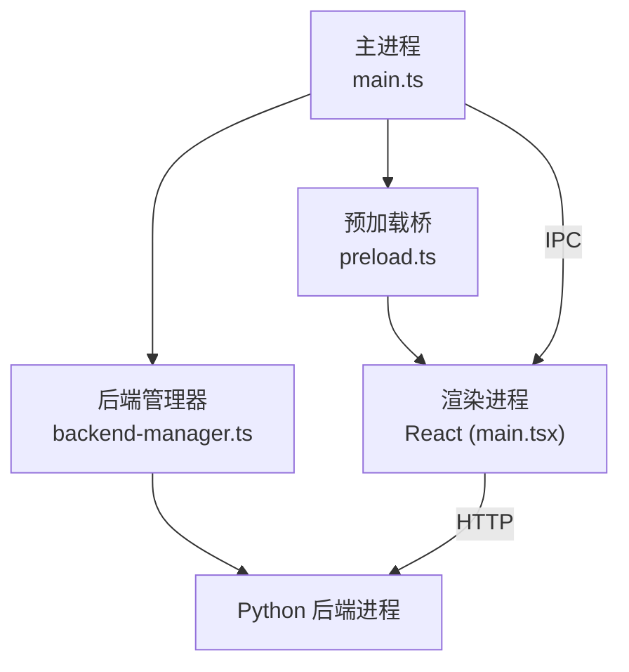
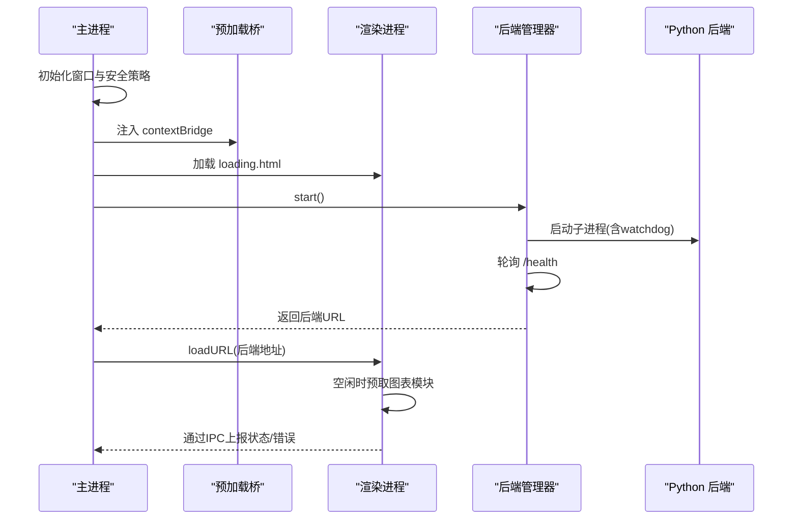
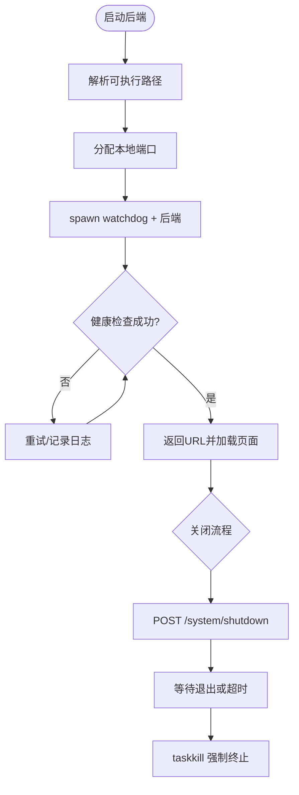
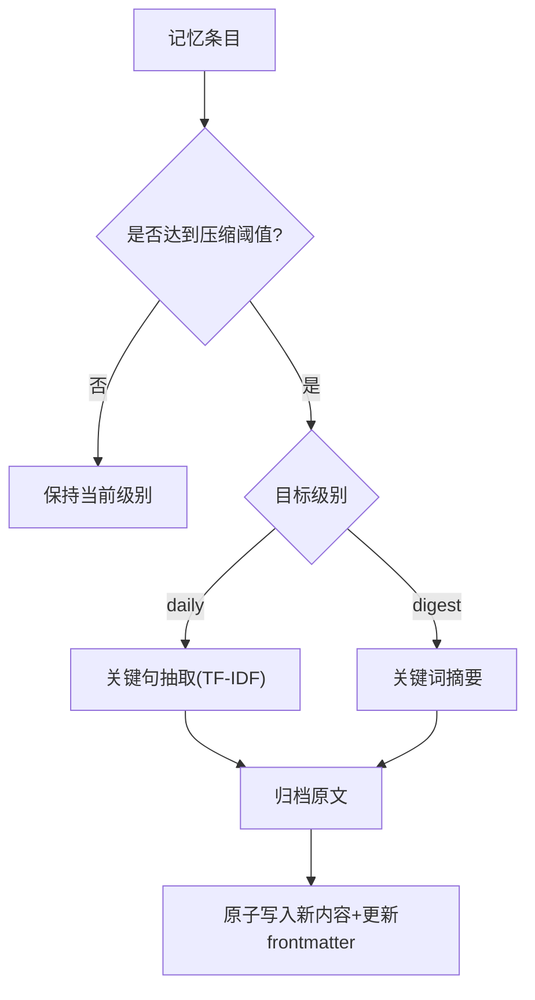
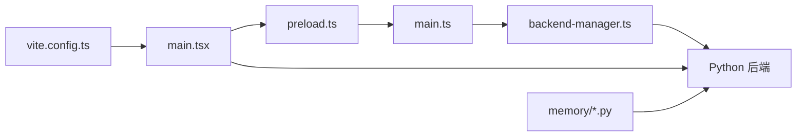

# 性能优化技巧

<cite>
**本文引用的文件**
- [desktop/electron/src/main.ts](file://desktop/electron/src/main.ts)
- [desktop/electron/src/preload.ts](file://desktop/electron/src/preload.ts)
- [desktop/electron/src/backend-manager.ts](file://desktop/electron/src/backend-manager.ts)
- [frontend/src/main.tsx](file://frontend/src/main.tsx)
- [frontend/vite.config.ts](file://frontend/vite.config.ts)
- [agent/scripts/bench_performance.py](file://agent/scripts/bench_performance.py)
- [agent/src/memory/compression.py](file://agent/src/memory/compression.py)
- [agent/src/memory/lifecycle.py](file://agent/src/memory/lifecycle.py)
- [agent/src/config/limits.py](file://agent/src/config/limits.py)
</cite>

## 目录
1. [简介](#简介)
2. [项目结构](#项目结构)
3. [核心组件](#核心组件)
4. [架构总览](#架构总览)
5. [详细组件分析](#详细组件分析)
6. [依赖关系分析](#依赖关系分析)
7. [性能考量](#性能考量)
8. [故障排查指南](#故障排查指南)
9. [结论](#结论)
10. [附录](#附录)

## 简介
本指南面向桌面应用（Electron + React 前端 + Python 后端）的性能优化，覆盖内存管理、渲染性能、主进程与渲染进程平衡、资源加载、启动性能、监控分析与测试基准。文档基于仓库中实际实现进行提炼，提供可操作的策略与图示，帮助读者在真实工程中落地优化。

## 项目结构
本项目采用“主进程（Electron）— 预加载桥 — 渲染进程（React）— 本地后端（Python）”的分层架构：
- 主进程负责窗口生命周期、安全隔离、IPC 路由、后端子进程管理与健康检查。
- 预加载脚本通过 contextBridge 暴露最小 API 给渲染进程。
- 渲染进程使用 Vite 构建，按需懒加载图表等重型模块。
- 后端以独立子进程运行，主进程通过 HTTP 健康端点轮询完成启动就绪。

**图表来源**
- [desktop/electron/src/main.ts:49-117](file://desktop/electron/src/main.ts#L49-L117)
- [desktop/electron/src/preload.ts:1-18](file://desktop/electron/src/preload.ts#L1-L18)
- [desktop/electron/src/backend-manager.ts:63-146](file://desktop/electron/src/backend-manager.ts#L63-L146)
- [frontend/src/main.tsx:11-35](file://frontend/src/main.tsx#L11-L35)

**章节来源**
- [desktop/electron/src/main.ts:49-117](file://desktop/electron/src/main.ts#L49-L117)
- [desktop/electron/src/backend-manager.ts:63-146](file://desktop/electron/src/backend-manager.ts#L63-L146)
- [frontend/src/main.tsx:11-35](file://frontend/src/main.tsx#L11-L35)
- [frontend/vite.config.ts:68-78](file://frontend/vite.config.ts#L68-L78)

## 核心组件
- 主进程与窗口管理：创建 BrowserWindow、设置安全策略、拦截导航、注入 preload、显示加载页、注册 IPC。
- 后端管理：解析可执行路径、分配端口、启动 watchdog、日志捕获、健康检查、优雅关闭与强制终止。
- 预加载桥：向渲染进程暴露 onStatus/onError/retry/openLogs/restartBackend/getCredentialStatus/setCredential。
- 前端启动与懒加载：使用 requestIdleCallback 延迟预取 MiniEquityChart 模块；Vite 配置拆分 vendor-chunks。
- 内存压缩与生命周期：三级压缩（raw/daily/digest）、重要性衰减、垃圾回收归档/删除、原子写入与锁。
- 工具结果限长：统一截断工具输出，避免大对象阻塞模型与 UI。

**章节来源**
- [desktop/electron/src/main.ts:65-146](file://desktop/electron/src/main.ts#L65-L146)
- [desktop/electron/src/preload.ts:1-18](file://desktop/electron/src/preload.ts#L1-L18)
- [desktop/electron/src/backend-manager.ts:63-146](file://desktop/electron/src/backend-manager.ts#L63-L146)
- [frontend/src/main.tsx:11-35](file://frontend/src/main.tsx#L11-L35)
- [frontend/vite.config.ts:68-78](file://frontend/vite.config.ts#L68-L78)
- [agent/src/memory/compression.py:163-337](file://agent/src/memory/compression.py#L163-L337)
- [agent/src/memory/lifecycle.py:183-273](file://agent/src/memory/lifecycle.py#L183-L273)
- [agent/src/config/limits.py:22-49](file://agent/src/config/limits.py#L22-L49)

## 架构总览
下图展示启动与健康检查流程，体现主进程、预加载、渲染进程与后端的协作关系。

**图表来源**
- [desktop/electron/src/main.ts:49-117](file://desktop/electron/src/main.ts#L49-L117)
- [desktop/electron/src/backend-manager.ts:63-146](file://desktop/electron/src/backend-manager.ts#L63-L146)
- [frontend/src/main.tsx:11-35](file://frontend/src/main.tsx#L11-L35)

## 详细组件分析

### 主进程与后端管理（内存与进程稳定性）
- 单实例锁与二次实例聚焦：避免重复启动，减少内存占用。
- 安全上下文隔离：禁用 nodeIntegration、启用 sandbox、仅允许安全外链打开。
- 本地请求鉴权：对 127.0.0.1 的请求自动注入 Authorization，避免额外认证开销。
- 后端子进程管理：
  - 动态端口分配，避免冲突。
  - 通过 watchdog 子进程托管后端，捕获 stdout/stderr，限制最近日志行数。
  - 健康检查循环，超时抛出明确错误信息。
  - 优雅关闭：先调用系统 shutdown 接口，再等待退出，必要时 taskkill 终止进程树。

**图表来源**
- [desktop/electron/src/backend-manager.ts:63-146](file://desktop/electron/src/backend-manager.ts#L63-L146)
- [desktop/electron/src/backend-manager.ts:148-187](file://desktop/electron/src/backend-manager.ts#L148-L187)
- [desktop/electron/src/backend-manager.ts:261-286](file://desktop/electron/src/backend-manager.ts#L261-L286)
- [desktop/electron/src/backend-manager.ts:373-421](file://desktop/electron/src/backend-manager.ts#L373-L421)

**章节来源**
- [desktop/electron/src/main.ts:35-47](file://desktop/electron/src/main.ts#L35-L47)
- [desktop/electron/src/main.ts:65-117](file://desktop/electron/src/main.ts#L65-L117)
- [desktop/electron/src/backend-manager.ts:63-146](file://desktop/electron/src/backend-manager.ts#L63-L146)
- [desktop/electron/src/backend-manager.ts:148-187](file://desktop/electron/src/backend-manager.ts#L148-L187)
- [desktop/electron/src/backend-manager.ts:261-286](file://desktop/electron/src/backend-manager.ts#L261-L286)
- [desktop/electron/src/backend-manager.ts:373-421](file://desktop/electron/src/backend-manager.ts#L373-L421)

### 渲染进程与前端性能（虚拟滚动、懒加载、图片优化、动画）
- 懒加载与预取：使用 requestIdleCallback 在空闲时预取 MiniEquityChart，降低首屏压力。
- 代码分割：Vite 将 react/react-dom/react-router 与 echarts 拆分为 vendor chunks，提升缓存命中与并行加载。
- 建议实践（通用指导）：
  - 列表数据量大时使用虚拟滚动（仅渲染可视区域）。
  - 图片使用 WebP/AVIF、响应式 srcset、懒加载 IntersectionObserver。
  - 动画优先使用 CSS transform/opacity，避免重排重绘。
  - 大数据表格分页/增量更新，避免一次性挂载大量节点。

**章节来源**
- [frontend/src/main.tsx:11-35](file://frontend/src/main.tsx#L11-L35)
- [frontend/vite.config.ts:68-78](file://frontend/vite.config.ts#L68-L78)

### 内存管理与压缩（对象池、泄漏预防、GC 调优、大对象处理）
- 三级压缩管线：
  - raw → daily：按句子 TF-IDF 评分保留关键句，附带关键词头，体积约减半。
  - daily → digest：提取高频重要词形成要点摘要，体积降至 10-20%。
  - 压缩前自动归档原始内容，原子写入防止损坏。
- 生命周期管理：
  - 质量分更新与访问计数追踪（受开关控制）。
  - 重要性衰减与容量阈值触发归档/删除（默认归档模式）。
  - 压缩周期在 GC 阶段触发，写入 frontmatter 的 compression_level 与 updated_at。
- 大对象处理：
  - 工具结果统一截断至固定字符上限，避免过大响应阻塞模型与 UI。
  - 日志最近行缓冲限制，防止内存无限增长。

**图表来源**
- [agent/src/memory/compression.py:163-337](file://agent/src/memory/compression.py#L163-L337)
- [agent/src/memory/lifecycle.py:183-273](file://agent/src/memory/lifecycle.py#L183-L273)
- [agent/src/config/limits.py:22-49](file://agent/src/config/limits.py#L22-L49)

**章节来源**
- [agent/src/memory/compression.py:163-337](file://agent/src/memory/compression.py#L163-L337)
- [agent/src/memory/lifecycle.py:183-273](file://agent/src/memory/lifecycle.py#L183-L273)
- [agent/src/config/limits.py:22-49](file://agent/src/config/limits.py#L22-L49)

### 主进程与渲染进程的性能平衡（任务分发、线程池、IPC 优化）
- 任务分发：
  - 主进程负责后端生命周期与系统级操作，渲染进程专注 UI 与交互。
  - 通过 IPC 暴露有限能力（状态订阅、错误上报、重启后端、凭据管理），减少主进程暴露面。
- 线程/进程：
  - 后端作为独立子进程运行，避免阻塞主事件循环。
  - 健康检查使用短轮询与超时保护，避免长时间阻塞。
- IPC 优化：
  - 使用 contextBridge 暴露最小 API，避免直接 Node 集成。
  - 状态推送采用单向事件（onStatus/onError），减少请求-应答开销。

**章节来源**
- [desktop/electron/src/preload.ts:1-18](file://desktop/electron/src/preload.ts#L1-L18)
- [desktop/electron/src/main.ts:119-146](file://desktop/electron/src/main.ts#L119-L146)
- [desktop/electron/src/backend-manager.ts:63-146](file://desktop/electron/src/backend-manager.ts#L63-L146)

### 资源加载优化（静态资源压缩、CDN、缓存、预加载）
- 构建期优化：
  - Vite 手动分包（vendor-react、vendor-charts），提高缓存命中率。
  - 开发代理集中转发到后端，减少跨域与配置复杂度。
- 运行时优化：
  - 空闲时预取图表模块，降低首次交互延迟。
  - 建议结合 CDN 与浏览器缓存策略（Cache-Control、ETag）进一步提升加载速度。
  - 图片与字体等资源建议使用现代格式与响应式加载。

**章节来源**
- [frontend/vite.config.ts:22-68](file://frontend/vite.config.ts#L22-L68)
- [frontend/src/main.tsx:11-35](file://frontend/src/main.tsx#L11-L35)

### 启动性能优化（渐进式启动、按需加载、依赖延迟初始化）
- 渐进式启动：
  - 先显示 loading.html，后台启动后端并轮询健康，完成后切换至业务页面。
  - 主进程在 ready-to-show 时才显示窗口，避免白屏闪烁。
- 按需加载：
  - 图表等重型模块在空闲时预取，减少首包体积与初始渲染时间。
- 依赖延迟初始化：
  - 工具注册与 MCP 服务按需发现与连接，失败隔离不影响整体可用性。

**章节来源**
- [desktop/electron/src/main.ts:49-117](file://desktop/electron/src/main.ts#L49-L117)
- [frontend/src/main.tsx:11-35](file://frontend/src/main.tsx#L11-L35)

### 性能监控与分析工具（指标收集、瓶颈识别、效果评估）
- 内置监控：
  - 主进程捕获后端 stdout/stderr 并写入日志，限制最近输出行数，便于定位问题。
  - 健康检查与超时提示，快速识别后端启动异常。
- 基准测试：
  - 提供算子与权益计算基准脚本，对比向量化与循环路径，评估优化收益。
- 建议补充：
  - 前端使用 Performance API、Performance Observer 采集关键指标（FCP、LCP、INP）。
  - 后端增加慢查询与耗时统计，结合日志聚合平台进行分析。

**章节来源**
- [desktop/electron/src/backend-manager.ts:288-304](file://desktop/electron/src/backend-manager.ts#L288-L304)
- [desktop/electron/src/backend-manager.ts:261-286](file://desktop/electron/src/backend-manager.ts#L261-L286)
- [agent/scripts/bench_performance.py:19-134](file://agent/scripts/bench_performance.py#L19-L134)

## 依赖关系分析
- 主进程依赖后端管理器，后者通过子进程与 HTTP 与后端通信。
- 渲染进程通过预加载桥与主进程交互，并通过 HTTP 访问后端。
- 前端构建依赖 Vite 插件与分包策略，影响最终产物大小与缓存命中。
- 后端内存子系统（压缩、生命周期）通过环境开关控制，避免不必要的开销。

**图表来源**
- [desktop/electron/src/main.ts:49-117](file://desktop/electron/src/main.ts#L49-L117)
- [desktop/electron/src/backend-manager.ts:63-146](file://desktop/electron/src/backend-manager.ts#L63-L146)
- [frontend/src/main.tsx:11-35](file://frontend/src/main.tsx#L11-L35)
- [frontend/vite.config.ts:68-78](file://frontend/vite.config.ts#L68-L78)
- [agent/src/memory/compression.py:163-337](file://agent/src/memory/compression.py#L163-L337)

**章节来源**
- [desktop/electron/src/main.ts:49-117](file://desktop/electron/src/main.ts#L49-L117)
- [desktop/electron/src/backend-manager.ts:63-146](file://desktop/electron/src/backend-manager.ts#L63-L146)
- [frontend/src/main.tsx:11-35](file://frontend/src/main.tsx#L11-L35)
- [frontend/vite.config.ts:68-78](file://frontend/vite.config.ts#L68-L78)
- [agent/src/memory/compression.py:163-337](file://agent/src/memory/compression.py#L163-L337)

## 性能考量
- 内存管理
  - 使用对象池复用频繁创建的对象（如网络请求、序列化缓冲区），减少 GC 压力。
  - 及时释放监听器与定时器，避免闭包引用导致的内存泄漏。
  - 合理设置 GC 频率与堆大小，避免频繁 Full GC。
  - 大对象（如大数组、大文本）尽量流式处理或分块处理，避免一次性加载。
- 渲染性能
  - 列表虚拟化、图片懒加载、WebP/AVIF 与响应式图片。
  - 动画使用 transform/opacity，避免 layout thrashing。
  - 使用 requestIdleCallback 或 Web Workers 执行非关键任务。
- 主/渲染进程平衡
  - 主进程只做系统级任务，渲染进程专注 UI；IPC 消息精简且批量发送。
  - 后端健康检查与日志捕获需设置超时与限流，避免阻塞。
- 资源加载
  - 构建期分包与 Tree-shaking；CDN 加速与强缓存策略。
  - 预加载关键资源，懒加载非关键资源。
- 启动性能
  - 渐进式启动、按需加载、依赖延迟初始化。
  - 首屏最小化 JS/CSS，关键路径内联必要样式。
- 监控与分析
  - 前端采集 FCP/LCP/INP；后端记录慢请求与热点路径。
  - 建立基线，持续回归验证优化效果。

[本节为通用指导，不直接分析具体文件]

## 故障排查指南
- 后端启动失败
  - 检查健康检查超时与最近日志片段，确认端口占用与可执行路径解析。
  - 若 watchdog 异常退出，查看其 stderr 输出与退出码。
- 渲染卡顿
  - 检查是否一次性渲染大量节点；引入虚拟滚动与分页。
  - 使用浏览器性能面板定位长任务与重排重绘。
- 内存泄漏
  - 排查未移除的事件监听器、全局变量与闭包引用。
  - 观察堆快照，定位持续增长的对象图。
- 工具结果过大
  - 确认是否触发了统一截断逻辑；必要时调整参数或分页获取。

**章节来源**
- [desktop/electron/src/backend-manager.ts:261-286](file://desktop/electron/src/backend-manager.ts#L261-L286)
- [desktop/electron/src/backend-manager.ts:288-304](file://desktop/electron/src/backend-manager.ts#L288-L304)
- [agent/src/config/limits.py:22-49](file://agent/src/config/limits.py#L22-L49)

## 结论
通过在主进程与后端管理、渲染进程懒加载与分包、内存压缩与生命周期管理、以及统一的工具结果限长等方面实施优化，可显著提升桌面应用的启动速度、运行流畅度与内存效率。配合完善的监控与基准测试，能够持续验证优化效果并发现新的瓶颈。

[本节为总结性内容，不直接分析具体文件]

## 附录
- 常用命令与入口
  - 前端开发服务器端口与代理配置见构建脚本。
  - 后端健康检查与关闭接口由后端管理器调用。
- 环境变量与开关
  - 内存质量评分、GC、衰减与压缩均支持通过配置开关控制。
  - 工具结果截断长度可通过统一常量调整。

**章节来源**
- [frontend/vite.config.ts:22-68](file://frontend/vite.config.ts#L22-L68)
- [agent/src/memory/lifecycle.py:35-53](file://agent/src/memory/lifecycle.py#L35-L53)
- [agent/src/config/limits.py:22-49](file://agent/src/config/limits.py#L22-L49)