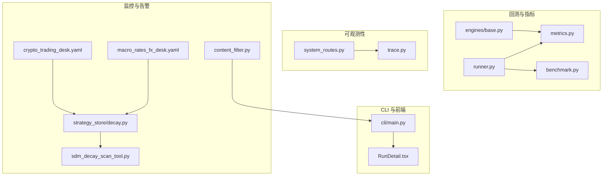
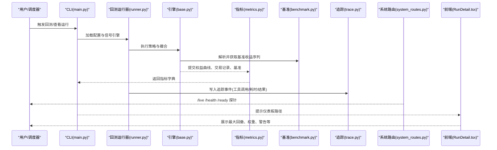
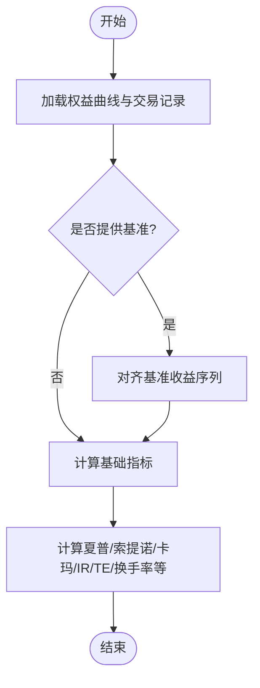
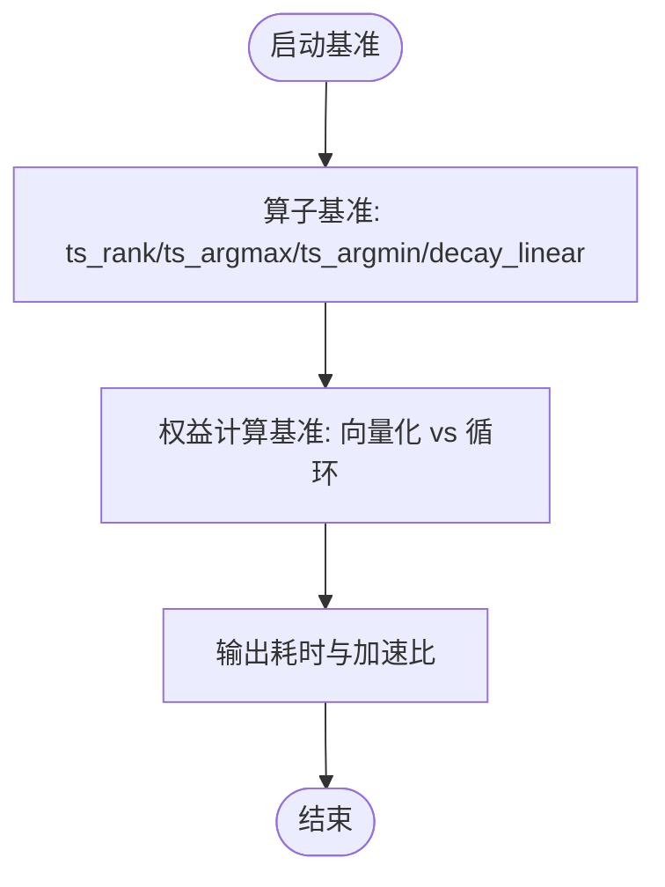
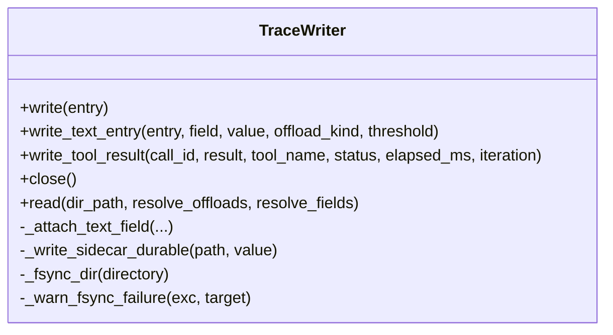
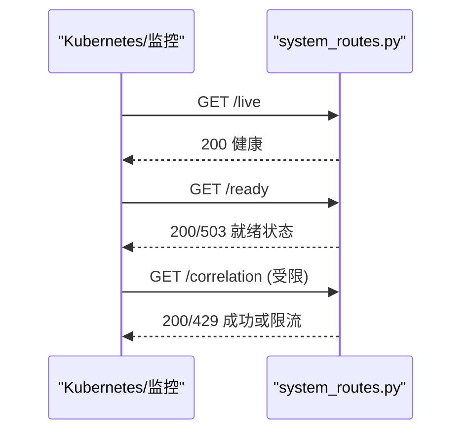
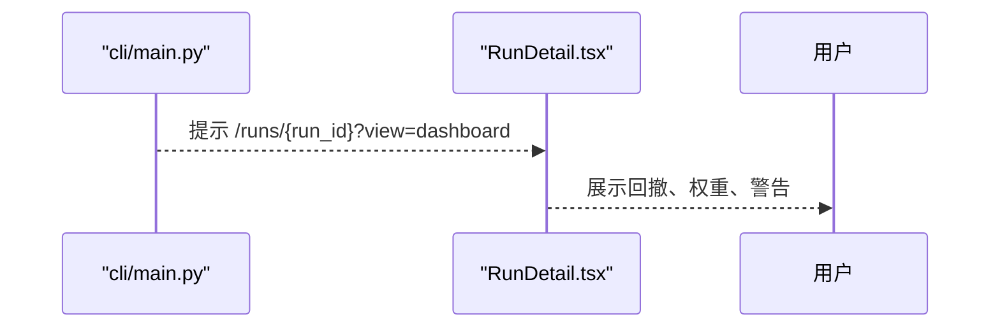
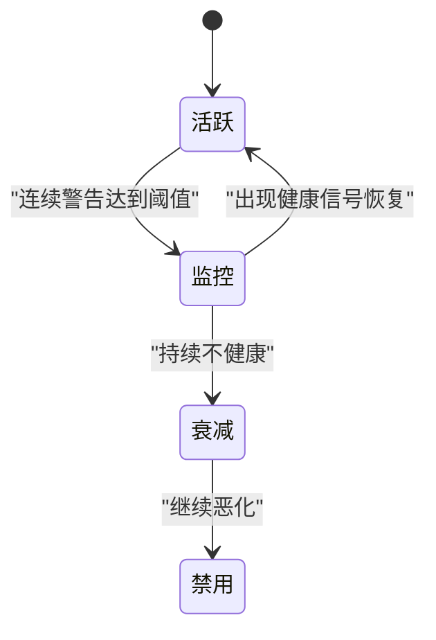
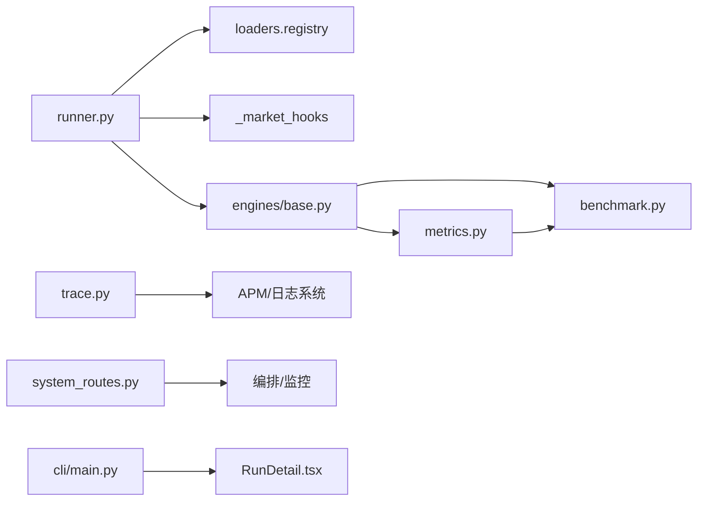

# 性能监控与分析

<cite>
**本文引用的文件**
- [agent/scripts/bench_performance.py](file://agent/scripts/bench_performance.py)
- [agent/backtest/metrics.py](file://agent/backtest/metrics.py)
- [agent/backtest/benchmark.py](file://agent/backtest/benchmark.py)
- [agent/backtest/runner.py](file://agent/backtest/runner.py)
- [agent/backtest/engines/base.py](file://agent/backtest/engines/base.py)
- [agent/src/agent/trace.py](file://agent/src/agent/trace.py)
- [agent/src/api/system_routes.py](file://agent/src/api/system_routes.py)
- [agent/cli/main.py](file://agent/cli/main.py)
- [frontend/src/pages/RunDetail.tsx](file://frontend/src/pages/RunDetail.tsx)
- [agent/src/strategy_store/decay.py](file://agent/src/strategy_store/decay.py)
- [agent/src/tools/sdm_decay_scan_tool.py](file://agent/src/tools/sdm_decay_scan_tool.py)
- [agent/src/providers/content_filter.py](file://agent/src/providers/content_filter.py)
- [agent/src/swarm/presets/crypto_trading_desk.yaml](file://agent/src/swarm/presets/crypto_trading_desk.yaml)
- [agent/src/swarm/presets/macro_rates_fx_desk.yaml](file://agent/src/swarm/presets/macro_rates_fx_desk.yaml)
</cite>

## 目录
1. [引言](#引言)
2. [项目结构](#项目结构)
3. [核心组件](#核心组件)
4. [架构总览](#架构总览)
5. [详细组件分析](#详细组件分析)
6. [依赖关系分析](#依赖关系分析)
7. [性能考量](#性能考量)
8. [故障排查指南](#故障排查指南)
9. [结论](#结论)
10. [附录](#附录)

## 引言
本指南面向交易系统的性能监控与分析，覆盖指标定义、采集方法、可视化展示、APM 集成与自定义埋点、日志分析体系、基准测试建立、问题诊断流程、优化效果验证（A/B 测试、回归测试、阈值监控）、仪表板设计与告警规则配置，以及最佳实践与常见问题。内容基于仓库中已有的回测指标计算、基准数据获取、追踪写入、系统健康检查、前端运行详情展示等实现进行系统化梳理与扩展建议。

## 项目结构
围绕性能监控与分析的关键代码分布在以下模块：
- 回测指标与基准：backtest/metrics.py、backtest/benchmark.py、backtest/engines/base.py、backtest/runner.py
- 性能基准脚本：scripts/bench_performance.py
- 追踪与可观测性：src/agent/trace.py
- 系统健康与限流：src/api/system_routes.py
- CLI 输出与仪表板入口提示：cli/main.py
- 前端运行详情与指标展示：frontend/src/pages/RunDetail.tsx
- 策略衰减与监控状态机：src/strategy_store/decay.py、src/tools/sdm_decay_scan_tool.py
- 内容过滤告警：src/providers/content_filter.py
- 预设任务中的阈值与监控要点：swarm/presets/*.yaml

图表来源
- [agent/backtest/metrics.py:1-641](file://agent/backtest/metrics.py#L1-L641)
- [agent/backtest/benchmark.py:1-208](file://agent/backtest/benchmark.py#L1-L208)
- [agent/backtest/engines/base.py:735-761](file://agent/backtest/engines/base.py#L735-L761)
- [agent/backtest/runner.py:1-800](file://agent/backtest/runner.py#L1-L800)
- [agent/src/agent/trace.py:1-408](file://agent/src/agent/trace.py#L1-L408)
- [agent/src/api/system_routes.py:1-469](file://agent/src/api/system_routes.py#L1-L469)
- [agent/cli/main.py:799-830](file://agent/cli/main.py#L799-L830)
- [frontend/src/pages/RunDetail.tsx:630-659](file://frontend/src/pages/RunDetail.tsx#L630-L659)
- [agent/src/strategy_store/decay.py:187-218](file://agent/src/strategy_store/decay.py#L187-L218)
- [agent/src/tools/sdm_decay_scan_tool.py:71-112](file://agent/src/tools/sdm_decay_scan_tool.py#L71-L112)
- [agent/src/providers/content_filter.py:66-102](file://agent/src/providers/content_filter.py#L66-L102)
- [agent/src/swarm/presets/crypto_trading_desk.yaml:162-186](file://agent/src/swarm/presets/crypto_trading_desk.yaml#L162-L186)
- [agent/src/swarm/presets/macro_rates_fx_desk.yaml:183-210](file://agent/src/swarm/presets/macro_rates_fx_desk.yaml#L183-L210)

章节来源
- [agent/backtest/metrics.py:1-641](file://agent/backtest/metrics.py#L1-L641)
- [agent/backtest/benchmark.py:1-208](file://agent/backtest/benchmark.py#L1-L208)
- [agent/backtest/engines/base.py:735-761](file://agent/backtest/engines/base.py#L735-L761)
- [agent/backtest/runner.py:1-800](file://agent/backtest/runner.py#L1-L800)
- [agent/src/agent/trace.py:1-408](file://agent/src/agent/trace.py#L1-L408)
- [agent/src/api/system_routes.py:1-469](file://agent/src/api/system_routes.py#L1-L469)
- [agent/cli/main.py:799-830](file://agent/cli/main.py#L799-L830)
- [frontend/src/pages/RunDetail.tsx:630-659](file://frontend/src/pages/RunDetail.tsx#L630-L659)
- [agent/src/strategy_store/decay.py:187-218](file://agent/src/strategy_store/decay.py#L187-L218)
- [agent/src/tools/sdm_decay_scan_tool.py:71-112](file://agent/src/tools/sdm_decay_scan_tool.py#L71-L112)
- [agent/src/providers/content_filter.py:66-102](file://agent/src/providers/content_filter.py#L66-L102)
- [agent/src/swarm/presets/crypto_trading_desk.yaml:162-186](file://agent/src/swarm/presets/crypto_trading_desk.yaml#L162-L186)
- [agent/src/swarm/presets/macro_rates_fx_desk.yaml:183-210](file://agent/src/swarm/presets/macro_rates_fx_desk.yaml#L183-L210)

## 核心组件
- 回测指标计算：提供年化因子映射、收益序列处理、夏普/索提诺/卡玛/信息比率/跟踪误差/换手率等完整指标集，支持基准对比与空数据兜底。
- 基准数据解析：按市场类型自动选择或显式指定基准，拉取基准收益率并参与指标计算。
- 引擎集成：在引擎执行过程中注入基准收益曲线，统一进入指标计算管线。
- 追踪写入：崩溃安全的 JSONL 追踪记录，大字段旁路存储，原子化落盘与目录同步，便于事后分析与 APM 对接。
- 系统健康与限流：提供 /live、/health、/ready 探针，内置滑动窗口限流保护重计算接口。
- CLI 与前端：CLI 打印关键指标并提示仪表板路径；前端 RunDetail 页面展示回撤、权重、警告等信息。
- 策略衰减监控：基于历史基准结果的状态机（活跃→监控→衰减→禁用），配合扫描工具统计健康度。
- 内容过滤告警：根据 LLM 响应被拦截比例生成告警，辅助评估模型质量与稳定性。

章节来源
- [agent/backtest/metrics.py:1-641](file://agent/backtest/metrics.py#L1-L641)
- [agent/backtest/benchmark.py:1-208](file://agent/backtest/benchmark.py#L1-L208)
- [agent/backtest/engines/base.py:735-761](file://agent/backtest/engines/base.py#L735-L761)
- [agent/src/agent/trace.py:1-408](file://agent/src/agent/trace.py#L1-L408)
- [agent/src/api/system_routes.py:1-469](file://agent/src/api/system_routes.py#L1-L469)
- [agent/cli/main.py:799-830](file://agent/cli/main.py#L799-L830)
- [frontend/src/pages/RunDetail.tsx:630-659](file://frontend/src/pages/RunDetail.tsx#L630-L659)
- [agent/src/strategy_store/decay.py:187-218](file://agent/src/strategy_store/decay.py#L187-L218)
- [agent/src/tools/sdm_decay_scan_tool.py:71-112](file://agent/src/tools/sdm_decay_scan_tool.py#L71-L112)
- [agent/src/providers/content_filter.py:66-102](file://agent/src/providers/content_filter.py#L66-L102)

## 架构总览
下图展示了从回测执行到指标计算、基准对比、追踪记录、系统健康检查与前端展示的端到端链路。

图表来源
- [agent/cli/main.py:799-830](file://agent/cli/main.py#L799-L830)
- [agent/backtest/runner.py:1-800](file://agent/backtest/runner.py#L1-L800)
- [agent/backtest/engines/base.py:735-761](file://agent/backtest/engines/base.py#L735-L761)
- [agent/backtest/benchmark.py:1-208](file://agent/backtest/benchmark.py#L1-L208)
- [agent/backtest/metrics.py:1-641](file://agent/backtest/metrics.py#L1-L641)
- [agent/src/agent/trace.py:1-408](file://agent/src/agent/trace.py#L1-L408)
- [agent/src/api/system_routes.py:1-469](file://agent/src/api/system_routes.py#L1-L469)
- [frontend/src/pages/RunDetail.tsx:630-659](file://frontend/src/pages/RunDetail.tsx#L630-L659)

## 详细组件分析

### 回测指标与基准对比
- 指标体系：年化因子按数据源与周期映射；收益序列安全处理避免零/负价格导致的异常；综合指标包括总收益、年化收益、最大回撤、夏普、索提诺、卡玛、胜率、盈亏比、利润因子、连续亏损次数、平均持仓期、交易次数、基准收益、超额收益、信息比率、跟踪误差、基准贝塔、平均/累计换手率。
- 基准解析：按市场类型推断或显式指定基准代码，优先使用配置的 loader，否则回退到 yfinance；离线模式严格关闭网络回退。
- 引擎集成：在引擎内部将基准收益序列对齐到权益曲线时间轴后进入指标计算。

图表来源
- [agent/backtest/metrics.py:1-641](file://agent/backtest/metrics.py#L1-L641)
- [agent/backtest/benchmark.py:1-208](file://agent/backtest/benchmark.py#L1-L208)
- [agent/backtest/engines/base.py:735-761](file://agent/backtest/engines/base.py#L735-L761)

章节来源
- [agent/backtest/metrics.py:1-641](file://agent/backtest/metrics.py#L1-L641)
- [agent/backtest/benchmark.py:1-208](file://agent/backtest/benchmark.py#L1-L208)
- [agent/backtest/engines/base.py:735-761](file://agent/backtest/engines/base.py#L735-L761)

### 性能基准测试
- 算子基准：对时序算子（如排名、极值、衰减）进行多次运行计时，评估向量化路径与循环路径的性能差异。
- 权益计算基准：对比向量化的权益计算与强制循环路径的耗时，给出加速比。
- 环境检测：报告瓶颈库可用性与相关开关，便于定位性能瓶颈。

图表来源
- [agent/scripts/bench_performance.py:1-134](file://agent/scripts/bench_performance.py#L1-L134)

章节来源
- [agent/scripts/bench_performance.py:1-134](file://agent/scripts/bench_performance.py#L1-L134)

### 追踪与日志分析
- 崩溃安全：每条追踪记录 flush+fsync，大文本通过旁路文件原子写入并 fsync，确保记录与引用一致。
- 字段控制：支持按需解析侧边文件字段，避免不必要的大对象加载。
- 工具结果追踪：记录工具名称、状态、耗时、预览与完整结果路径，便于 APM 聚合与回溯。

图表来源
- [agent/src/agent/trace.py:1-408](file://agent/src/agent/trace.py#L1-L408)

章节来源
- [agent/src/agent/trace.py:1-408](file://agent/src/agent/trace.py#L1-L408)

### 系统健康与限流
- 健康探针：/live 与 /health 用于进程存活检查；/ready 检查 LLM 提供商配置与凭据可用性，未就绪时返回 503。
- 限流保护：对重计算接口（如相关性矩阵）实施滑动窗口限流，防止滥用。

图表来源
- [agent/src/api/system_routes.py:1-469](file://agent/src/api/system_routes.py#L1-L469)

章节来源
- [agent/src/api/system_routes.py:1-469](file://agent/src/api/system_routes.py#L1-L469)

### 前端仪表板与运行详情
- CLI 提示：打印关键指标并提示通过服务访问运行仪表板的路径。
- 前端展示：运行详情页展示最大回撤、权重表、警告信息等，便于快速定位问题。

图表来源
- [agent/cli/main.py:799-830](file://agent/cli/main.py#L799-L830)
- [frontend/src/pages/RunDetail.tsx:630-659](file://frontend/src/pages/RunDetail.tsx#L630-L659)

章节来源
- [agent/cli/main.py:799-830](file://agent/cli/main.py#L799-L830)
- [frontend/src/pages/RunDetail.tsx:630-659](file://frontend/src/pages/RunDetail.tsx#L630-L659)

### 策略衰减监控与告警
- 状态机：活跃→监控→衰减→禁用的状态迁移，依据连续信号与健康判定。
- 扫描工具：统计扫描数量、健康/警告/衰减/临界/数据不足等计数，并生成逐策略明细。
- 内容过滤告警：当 LLM 响应被拦截比例超过阈值时生成告警，提示调整提供商或策略。

图表来源
- [agent/src/strategy_store/decay.py:187-218](file://agent/src/strategy_store/decay.py#L187-L218)
- [agent/src/tools/sdm_decay_scan_tool.py:71-112](file://agent/src/tools/sdm_decay_scan_tool.py#L71-L112)
- [agent/src/providers/content_filter.py:66-102](file://agent/src/providers/content_filter.py#L66-L102)

章节来源
- [agent/src/strategy_store/decay.py:187-218](file://agent/src/strategy_store/decay.py#L187-L218)
- [agent/src/tools/sdm_decay_scan_tool.py:71-112](file://agent/src/tools/sdm_decay_scan_tool.py#L71-L112)
- [agent/src/providers/content_filter.py:66-102](file://agent/src/providers/content_filter.py#L66-L102)

### 预设任务中的阈值与监控要点
- 加密货币桌面预设：要求列出需关注的关键指标与具体告警阈值，明确突破阈值后的行动与复评触发条件；强调阈值应基于历史分布而非经验数字。
- 宏观利率外汇桌面预设：要求列出需跟踪的宏观指标与阈值、行动与再平衡触发日期。

章节来源
- [agent/src/swarm/presets/crypto_trading_desk.yaml:162-186](file://agent/src/swarm/presets/crypto_trading_desk.yaml#L162-L186)
- [agent/src/swarm/presets/macro_rates_fx_desk.yaml:183-210](file://agent/src/swarm/presets/macro_rates_fx_desk.yaml#L183-L210)

## 依赖关系分析
- 回测运行器依赖数据源注册表与市场探测钩子，动态选择 loader 并执行引擎。
- 引擎在计算权益前解析基准收益序列，随后统一进入指标计算。
- 指标模块依赖基准模块提供的收益序列，并与交易记录、权益曲线共同产出最终指标。
- 追踪模块独立于业务逻辑，仅接收事件并持久化，供外部系统消费。
- 系统路由提供健康与限流能力，支撑编排与监控平台。
- 前端通过 CLI 提示路径读取运行结果，展示关键指标与警告。

图表来源
- [agent/backtest/runner.py:1-800](file://agent/backtest/runner.py#L1-L800)
- [agent/backtest/engines/base.py:735-761](file://agent/backtest/engines/base.py#L735-L761)
- [agent/backtest/benchmark.py:1-208](file://agent/backtest/benchmark.py#L1-L208)
- [agent/backtest/metrics.py:1-641](file://agent/backtest/metrics.py#L1-L641)
- [agent/src/agent/trace.py:1-408](file://agent/src/agent/trace.py#L1-L408)
- [agent/src/api/system_routes.py:1-469](file://agent/src/api/system_routes.py#L1-L469)
- [agent/cli/main.py:799-830](file://agent/cli/main.py#L799-L830)
- [frontend/src/pages/RunDetail.tsx:630-659](file://frontend/src/pages/RunDetail.tsx#L630-L659)

章节来源
- [agent/backtest/runner.py:1-800](file://agent/backtest/runner.py#L1-L800)
- [agent/backtest/engines/base.py:735-761](file://agent/backtest/engines/base.py#L735-L761)
- [agent/backtest/benchmark.py:1-208](file://agent/backtest/benchmark.py#L1-L208)
- [agent/backtest/metrics.py:1-641](file://agent/backtest/metrics.py#L1-L641)
- [agent/src/agent/trace.py:1-408](file://agent/src/agent/trace.py#L1-L408)
- [agent/src/api/system_routes.py:1-469](file://agent/src/api/system_routes.py#L1-L469)
- [agent/cli/main.py:799-830](file://agent/cli/main.py#L799-L830)
- [frontend/src/pages/RunDetail.tsx:630-659](file://frontend/src/pages/RunDetail.tsx#L630-L659)

## 性能考量
- 指标计算复杂度：主要受权益曲线长度、交易笔数与基准对齐影响；向量化路径显著优于循环路径，基准脚本已提供对比方法。
- 基准数据获取：优先使用配置的 loader，离线模式禁止网络回退，避免不可控延迟与失败。
- 追踪写入开销：每条记录 fsync 保证可靠性，但会带来 I/O 成本；大字段旁路存储减少主记录体积。
- 系统限流：对重计算接口设置合理限流，避免资源耗尽。
- 前端渲染：运行详情页面以表格与面板展示关键指标，注意大数据量下的渲染性能。

[本节为通用指导，无需特定文件来源]

## 故障排查指南
- 基准缺失或为空：检查基准代码解析与市场推断是否正确；确认数据源可用性与时间范围；离线模式下禁止网络回退。
- 指标异常（NaN/Inf）：检查权益曲线是否存在零或负价格导致收益序列异常；确认年化因子与样本量是否合理。
- 追踪丢失或不完整：确认 fsync 是否受文件系统限制；检查旁路文件是否成功原子写入；必要时启用字段白名单解析。
- 健康探针失败：/ready 返回 503 表示 LLM 提供商或凭据未配置；检查环境变量与 OAuth 登录状态。
- 限流触发：若频繁收到 429，降低请求频率或扩大窗口；检查客户端 IP 键是否稳定。
- 策略衰减告警：结合扫描工具的统计与状态机迁移原因，定位信号退化或数据不足的问题。
- 内容过滤告警：若拦截比例过高，考虑更换提供商或调整策略输入，避免过度过滤影响分析。

章节来源
- [agent/backtest/benchmark.py:1-208](file://agent/backtest/benchmark.py#L1-L208)
- [agent/backtest/metrics.py:1-641](file://agent/backtest/metrics.py#L1-L641)
- [agent/src/agent/trace.py:1-408](file://agent/src/agent/trace.py#L1-L408)
- [agent/src/api/system_routes.py:1-469](file://agent/src/api/system_routes.py#L1-L469)
- [agent/src/tools/sdm_decay_scan_tool.py:71-112](file://agent/src/tools/sdm_decay_scan_tool.py#L71-L112)
- [agent/src/providers/content_filter.py:66-102](file://agent/src/providers/content_filter.py#L66-L102)

## 结论
本指南基于仓库现有实现，构建了从指标计算、基准对比、追踪记录、系统健康到前端展示的完整性能监控与分析框架。通过基准脚本、状态机监控与限流保护，形成了可观测、可比较、可治理的性能闭环。建议在生产环境中结合 APM 与日志系统，完善实时大屏、告警规则与自动化报告，持续提升策略与系统的稳定性与效率。

[本节为总结，无需特定文件来源]

## 附录
- 关键指标定义参考：年化因子映射、收益序列安全处理、风险调整后指标（夏普、索提诺、卡玛、信息比率、跟踪误差、贝塔）。
- 基准选择建议：不同市场类型的默认基准代码与获取方式。
- 监控阈值设定：基于历史分布与风险度量（VaR/CVaR、最大回撤）设定阈值，避免主观经验。
- 仪表板设计建议：实时大屏聚焦权益曲线、回撤、换手率、基准对比；异常告警通知包含指标越界、追踪错误、健康探针失败；性能报告自动生成包含指标摘要、基准对比、衰减状态与内容过滤告警。

[本节为补充说明，无需特定文件来源]