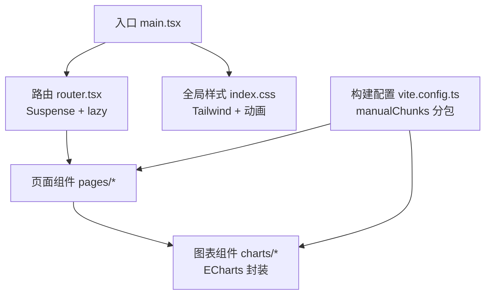
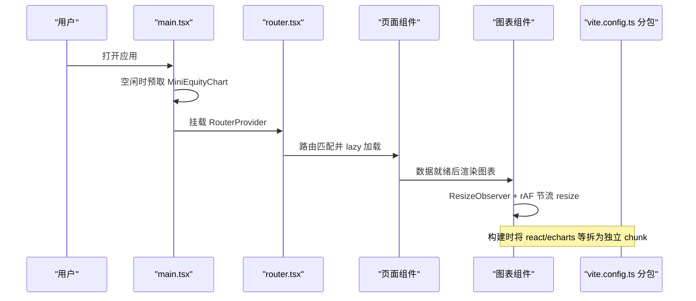
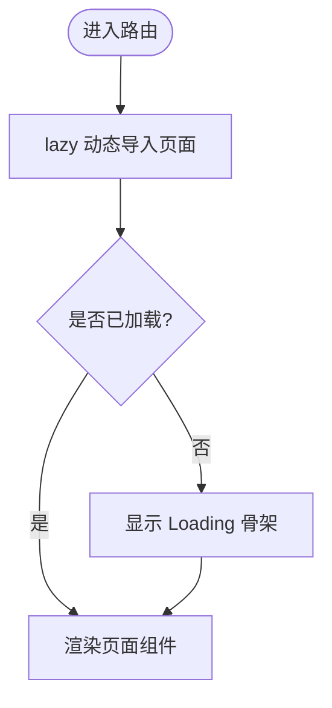
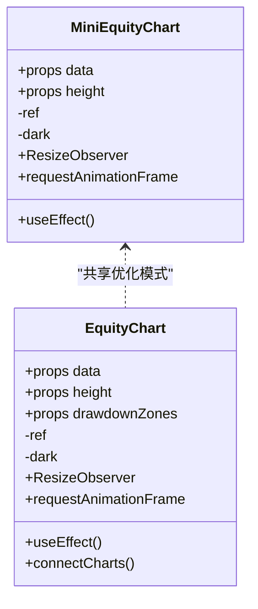
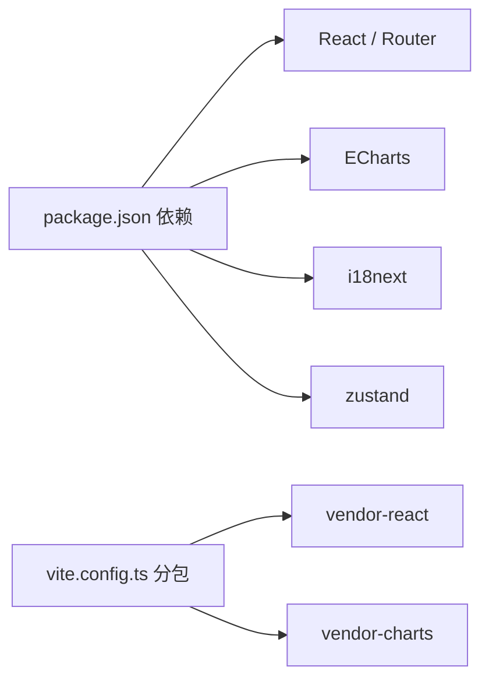

# 渲染性能优化

<cite>
**本文引用的文件**
- [frontend/src/main.tsx](file://frontend/src/main.tsx)
- [frontend/src/router.tsx](file://frontend/src/router.tsx)
- [frontend/vite.config.ts](file://frontend/vite.config.ts)
- [frontend/package.json](file://frontend/package.json)
- [frontend/src/index.css](file://frontend/src/index.css)
- [frontend/src/components/charts/MiniEquityChart.tsx](file://frontend/src/components/charts/MiniEquityChart.tsx)
- [frontend/src/components/charts/EquityChart.tsx](file://frontend/src/components/charts/EquityChart.tsx)
</cite>

## 目录
1. [简介](#简介)
2. [项目结构](#项目结构)
3. [核心组件](#核心组件)
4. [架构总览](#架构总览)
5. [详细组件分析](#详细组件分析)
6. [依赖关系分析](#依赖关系分析)
7. [性能考量](#性能考量)
8. [故障排查指南](#故障排查指南)
9. [结论](#结论)
10. [附录](#附录)

## 简介
本指南聚焦前端渲染性能优化，围绕以下主题展开：虚拟滚动与长列表渲染、懒加载（图片懒加载、组件按需加载、路由级代码分割）、图片优化策略、动画性能优化技巧、React 组件性能优化最佳实践，以及性能监控方法与工具使用。文档结合仓库中的实际实现，给出可落地的方案与图示说明。

## 项目结构
前端采用 Vite + React 技术栈，通过路由级懒加载与构建期分包提升首屏与交互性能；图表基于 ECharts 封装，配合 ResizeObserver 与 requestAnimationFrame 优化重绘；全局样式使用 Tailwind CSS，并提供暗色主题与动画增强。

**图示来源**
- [frontend/src/main.tsx:1-36](file://frontend/src/main.tsx#L1-L36)
- [frontend/src/router.tsx:1-73](file://frontend/src/router.tsx#L1-L73)
- [frontend/vite.config.ts:1-71](file://frontend/vite.config.ts#L1-L71)
- [frontend/src/index.css:1-123](file://frontend/src/index.css#L1-L123)

**章节来源**
- [frontend/src/main.tsx:1-36](file://frontend/src/main.tsx#L1-L36)
- [frontend/src/router.tsx:1-73](file://frontend/src/router.tsx#L1-L73)
- [frontend/vite.config.ts:1-71](file://frontend/vite.config.ts#L1-L71)
- [frontend/package.json:1-58](file://frontend/package.json#L1-L58)
- [frontend/src/index.css:1-123](file://frontend/src/index.css#L1-L123)

## 核心组件
- 应用入口与资源预取：在应用启动时利用空闲回调预取关键图表模块，降低首次交互延迟。
- 路由级代码分割：所有页面通过 Suspense + lazy 包裹，按路由按需加载，减少初始包体积。
- 构建期分包：将 React 生态与图表库拆分为独立 chunk，提升缓存命中与并行下载效率。
- 图表组件：基于 ECharts 的轻量封装，使用 ResizeObserver + requestAnimationFrame 节流 resize，避免频繁重排。

**章节来源**
- [frontend/src/main.tsx:11-26](file://frontend/src/main.tsx#L11-L26)
- [frontend/src/router.tsx:1-73](file://frontend/src/router.tsx#L1-L73)
- [frontend/vite.config.ts:68-77](file://frontend/vite.config.ts#L68-L77)
- [frontend/src/components/charts/MiniEquityChart.tsx:1-59](file://frontend/src/components/charts/MiniEquityChart.tsx#L1-L59)
- [frontend/src/components/charts/EquityChart.tsx:1-141](file://frontend/src/components/charts/EquityChart.tsx#L1-L141)

## 架构总览
下图展示从应用启动到页面渲染的关键路径，包括懒加载、分包与图表初始化流程。

**图示来源**
- [frontend/src/main.tsx:11-26](file://frontend/src/main.tsx#L11-L26)
- [frontend/src/router.tsx:1-73](file://frontend/src/router.tsx#L1-L73)
- [frontend/vite.config.ts:68-77](file://frontend/vite.config.ts#L68-L77)
- [frontend/src/components/charts/MiniEquityChart.tsx:40-53](file://frontend/src/components/charts/MiniEquityChart.tsx#L40-L53)
- [frontend/src/components/charts/EquityChart.tsx:120-133](file://frontend/src/components/charts/EquityChart.tsx#L120-L133)

## 详细组件分析

### 路由级懒加载与 Suspense 骨架
- 所有页面通过 lazy 动态导入，并在路由层统一用 Suspense 包裹，提供 Loading 占位，避免阻塞首屏。
- 建议：对超大页面或重型子树继续拆分至更细粒度懒加载点，进一步降低主包体积。

**图示来源**
- [frontend/src/router.tsx:1-73](file://frontend/src/router.tsx#L1-L73)

**章节来源**
- [frontend/src/router.tsx:1-73](file://frontend/src/router.tsx#L1-L73)

### 构建期分包策略
- 将 React、react-dom、react-router 合并为 vendor-react 包，将 ECharts 单独拆出为 vendor-charts 包，利于浏览器缓存与并行加载。
- 建议：根据业务模块继续细化分包（如“报表”“回测”“设置”），并结合路由懒加载形成“路由级 + 模块级”双层分包。

**章节来源**
- [frontend/vite.config.ts:68-77](file://frontend/vite.config.ts#L68-L77)
- [frontend/package.json:17-38](file://frontend/package.json#L17-L38)

### 图表组件性能优化
- 使用 ResizeObserver 监听容器尺寸变化，并通过 requestAnimationFrame 节流 chart.resize，避免高频重绘。
- 在组件卸载时释放 ResizeObserver 与销毁图表实例，防止内存泄漏。
- 小图（迷你权益曲线）仅在数据足够时渲染，减少无效计算。

**图示来源**
- [frontend/src/components/charts/MiniEquityChart.tsx:1-59](file://frontend/src/components/charts/MiniEquityChart.tsx#L1-L59)
- [frontend/src/components/charts/EquityChart.tsx:1-141](file://frontend/src/components/charts/EquityChart.tsx#L1-L141)

**章节来源**
- [frontend/src/components/charts/MiniEquityChart.tsx:1-59](file://frontend/src/components/charts/MiniEquityChart.tsx#L1-L59)
- [frontend/src/components/charts/EquityChart.tsx:1-141](file://frontend/src/components/charts/EquityChart.tsx#L1-L141)

### 动画与样式优化
- 全局样式中定义了消息入场动画与平滑滚动条，同时尊重 prefers-reduced-motion 以减少动画对敏感用户的影响。
- 建议使用 transform 与 opacity 进行动画，以启用 GPU 加速，避免触发布局重排。

**章节来源**
- [frontend/src/index.css:83-123](file://frontend/src/index.css#L83-L123)

## 依赖关系分析
- 运行时依赖：React、react-router、ECharts、i18next、zustand 等。
- 开发依赖：Vite、TypeScript、Tailwind、Vitest 等。
- 构建产物：vendor-react、vendor-charts 等分包，提升缓存命中率。

**图示来源**
- [frontend/package.json:17-55](file://frontend/package.json#L17-L55)
- [frontend/vite.config.ts:68-77](file://frontend/vite.config.ts#L68-L77)

**章节来源**
- [frontend/package.json:1-58](file://frontend/package.json#L1-L58)
- [frontend/vite.config.ts:1-71](file://frontend/vite.config.ts#L1-L71)

## 性能考量
- 虚拟滚动与长列表
  - 场景：大量行数据的表格或列表（如运行记录、因子列表）。
  - 方案：仅渲染可视区域节点，结合固定高度与虚拟化容器，显著降低 DOM 节点数量与重排成本。
  - 建议：若引入第三方虚拟化库，优先选择支持稳定 key、受控滚动与无障碍的版本；自定义实现时注意回收节点与事件绑定。
- 懒加载机制
  - 图片懒加载：使用 IntersectionObserver 检测可见性后再加载图片，避免首屏带宽浪费。
  - 组件按需加载：对重型组件（如图表、编辑器）使用动态 import，必要时结合 Suspense 展示骨架。
  - 路由级代码分割：已在项目中落地，建议继续细化到功能模块级。
- 图片优化策略
  - 格式选择：优先 WebP/AVIF，兼容 fallback PNG/JPG；矢量图使用 SVG。
  - 尺寸优化：按设备 DPR 提供多分辨率，或使用 srcset/picture 自适应。
  - CDN 加速：开启静态资源 CDN，配置 Gzip/Brotli 压缩与 HTTP/2。
  - 缓存策略：对带哈希的资源设置长期缓存，HTML 与接口响应使用短缓存或协商缓存。
- 动画性能优化
  - 使用 transform 与 opacity 驱动动画，避免触发布局与绘制。
  - 使用 requestAnimationFrame 调度动画帧，确保与屏幕刷新同步。
  - 启用 GPU 加速：合理使用 will-change、translate3d 等提示，但避免滥用导致显存压力。
- React 组件性能优化
  - useMemo/useCallback：仅对昂贵计算或作为依赖传递给子组件时使用，避免无谓引用变化。
  - 组件重渲染优化：拆分大组件、使用 memo 包裹纯展示组件、避免在渲染函数内创建新对象/数组。
  - 状态管理优化：将频繁更新的状态下沉到局部 state，或将无关状态拆分到不同 store，减少跨组件广播。
- 性能监控与诊断
  - React Profiler：记录组件渲染耗时与原因，定位重渲染热点。
  - Chrome Performance 面板：录制时间线，观察长任务、掉帧与脚本执行占比。
  - Lighthouse/WebPageTest：评估首屏、可交互性与资源加载瀑布流。
  - 指标建议：FCP/LCP/CLS/TBT/INP，结合真实用户监控（RUM）持续追踪。

[本节为通用指导，不直接分析具体文件]

## 故障排查指南
- 图表闪烁或卡顿
  - 检查是否在每次数据变更时重复 init/destroy，应复用实例并使用 setOption。
  - 确认 ResizeObserver 与 rAF 节流是否正确生效，避免高频 resize。
- 内存泄漏
  - 组件卸载时务必断开 ResizeObserver 并销毁图表实例。
- 路由懒加载白屏
  - 确认 Suspense fallback 正常显示；检查网络请求与 chunk 加载失败重试逻辑。
- 首屏过大
  - 审查 manualChunks 与路由懒加载是否覆盖全部重型依赖；考虑进一步拆分模块。

**章节来源**
- [frontend/src/components/charts/MiniEquityChart.tsx:40-53](file://frontend/src/components/charts/MiniEquityChart.tsx#L40-L53)
- [frontend/src/components/charts/EquityChart.tsx:120-133](file://frontend/src/components/charts/EquityChart.tsx#L120-L133)
- [frontend/src/router.tsx:52-66](file://frontend/src/router.tsx#L52-L66)

## 结论
本项目已通过路由级懒加载、构建期分包与图表组件的渲染节流，奠定了良好的性能基础。建议在长列表场景引入虚拟滚动，完善图片懒加载与 CDN 缓存策略，持续使用 React Profiler 与 Chrome Performance 面板进行度量与优化，逐步将性能指标纳入质量门禁。

## 附录
- 相关配置与入口参考
  - 应用入口与空闲预取：[frontend/src/main.tsx:11-26](file://frontend/src/main.tsx#L11-L26)
  - 路由懒加载与骨架：[frontend/src/router.tsx:1-73](file://frontend/src/router.tsx#L1-L73)
  - 构建分包策略：[frontend/vite.config.ts:68-77](file://frontend/vite.config.ts#L68-L77)
  - 图表组件优化：[frontend/src/components/charts/MiniEquityChart.tsx:1-59](file://frontend/src/components/charts/MiniEquityChart.tsx#L1-L59)、[frontend/src/components/charts/EquityChart.tsx:1-141](file://frontend/src/components/charts/EquityChart.tsx#L1-L141)
  - 全局样式与动画：[frontend/src/index.css:83-123](file://frontend/src/index.css#L83-L123)
  - 依赖清单：[frontend/package.json:17-55](file://frontend/package.json#L17-L55)