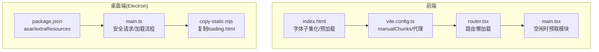
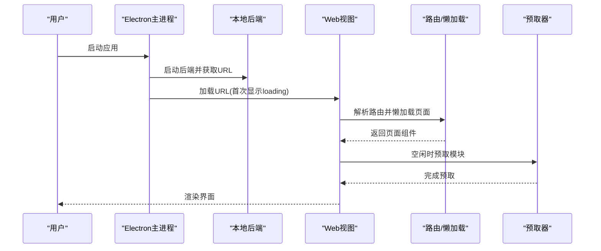
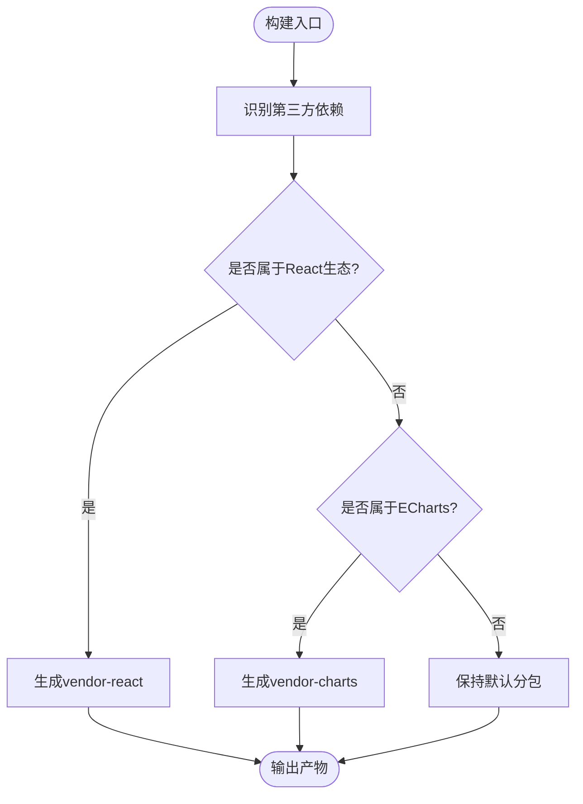
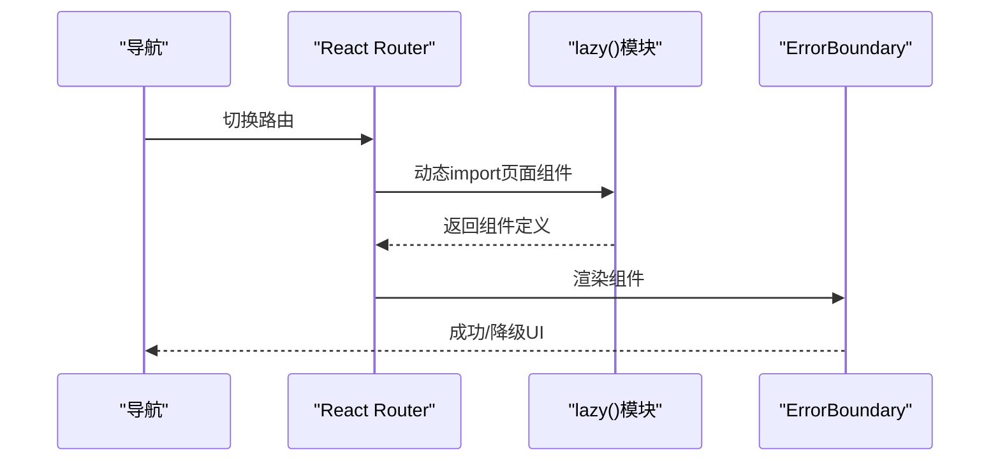
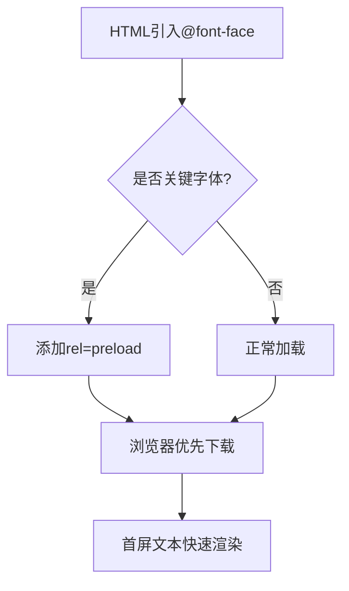
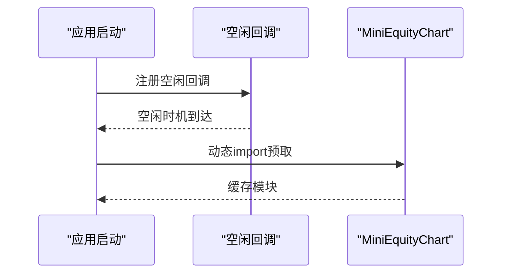
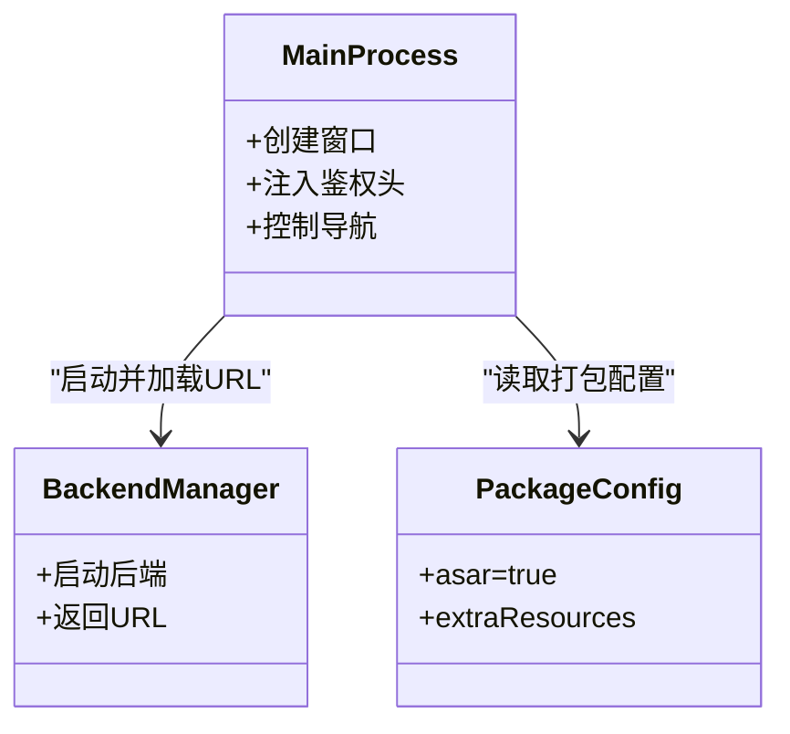
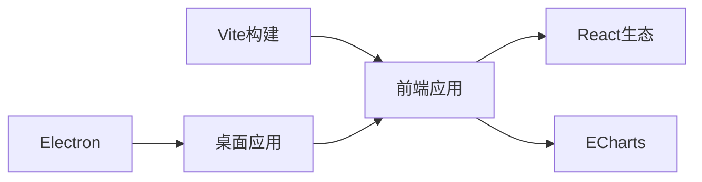

# 资源加载优化

<cite>
**本文引用的文件**
- [frontend/package.json](file://frontend/package.json)
- [frontend/vite.config.ts](file://frontend/vite.config.ts)
- [frontend/index.html](file://frontend/index.html)
- [frontend/src/main.tsx](file://frontend/src/main.tsx)
- [frontend/src/router.tsx](file://frontend/src/router.tsx)
- [desktop/electron/package.json](file://desktop/electron/package.json)
- [desktop/electron/src/main.ts](file://desktop/electron/src/main.ts)
- [desktop/electron/scripts/copy-static.mjs](file://desktop/electron/scripts/copy-static.mjs)
</cite>

## 目录
1. [简介](#简介)
2. [项目结构](#项目结构)
3. [核心组件](#核心组件)
4. [架构总览](#架构总览)
5. [详细组件分析](#详细组件分析)
6. [依赖关系分析](#依赖关系分析)
7. [性能考量](#性能考量)
8. [故障排查指南](#故障排查指南)
9. [结论](#结论)
10. [附录](#附录)

## 简介
本指南聚焦于 Vibe-Trading 项目的资源加载性能优化，覆盖静态资源压缩与优化、CDN 加速策略、浏览器缓存机制、预加载与预取、Electron 打包优化以及监控与分析工具的使用。文档基于仓库中的前端构建配置、路由懒加载、字体子集化、Electron 主进程安全与资源管理、以及打包脚本等实际实现，提供可落地的优化方案与评估方法。

## 项目结构
本项目包含 Web 前端（Vite + React）、桌面端（Electron）与后端服务。资源加载优化主要涉及：
- 前端构建与分包：通过 Vite 的 manualChunks 将 React、ECharts 等第三方库独立分包，提升缓存命中与并行下载效率。
- 字体子集化与预加载：在 HTML 中声明 @font-face 并限定 unicode-range，配合 rel=preload 提前加载关键字体。
- 路由级代码分割：页面组件使用 lazy() 按需加载，减少首屏体积。
- Electron 打包：启用 asar 压缩、仅打包必要产物、复制 loading 页到 dist，并通过主进程注入鉴权头访问本地后端。

**图表来源**
- [frontend/index.html:1-149](file://frontend/index.html#L1-L149)
- [frontend/vite.config.ts:1-71](file://frontend/vite.config.ts#L1-L71)
- [frontend/src/router.tsx:1-73](file://frontend/src/router.tsx#L1-L73)
- [frontend/src/main.tsx:1-36](file://frontend/src/main.tsx#L1-L36)
- [desktop/electron/package.json:1-86](file://desktop/electron/package.json#L1-L86)
- [desktop/electron/src/main.ts:1-285](file://desktop/electron/src/main.ts#L1-L285)
- [desktop/electron/scripts/copy-static.mjs:1-8](file://desktop/electron/scripts/copy-static.mjs#L1-L8)

**章节来源**
- [frontend/package.json:1-58](file://frontend/package.json#L1-L58)
- [frontend/vite.config.ts:1-71](file://frontend/vite.config.ts#L1-L71)
- [frontend/index.html:1-149](file://frontend/index.html#L1-L149)
- [desktop/electron/package.json:1-86](file://desktop/electron/package.json#L1-L86)
- [desktop/electron/src/main.ts:1-285](file://desktop/electron/src/main.ts#L1-L285)
- [desktop/electron/scripts/copy-static.mjs:1-8](file://desktop/electron/scripts/copy-static.mjs#L1-L8)

## 核心组件
- 构建与分包：Vite 配置中将 react/react-dom/react-router 合并为 vendor-react，echarts 单独为 vendor-charts，利于长期缓存与并行加载。
- 路由懒加载：所有页面组件通过 lazy() 包裹，仅在路由进入时加载对应 chunk。
- 字体优化：使用 woff2 格式并按 unicode-range 拆分拉丁与扩展字符集，减少首屏字体体积；对关键字体使用 rel=preload。
- 空闲预取：启动后在空闲回调中预取 MiniEquityChart 模块，降低后续交互延迟。
- Electron 安全与资源：主进程为本地后端请求注入 Authorization 头，限制导航与外链打开；打包启用 asar，仅拷贝必要资源。

**章节来源**
- [frontend/vite.config.ts:68-77](file://frontend/vite.config.ts#L68-L77)
- [frontend/src/router.tsx:1-73](file://frontend/src/router.tsx#L1-L73)
- [frontend/index.html:9-140](file://frontend/index.html#L9-L140)
- [frontend/src/main.tsx:11-26](file://frontend/src/main.tsx#L11-L26)
- [desktop/electron/src/main.ts:85-98](file://desktop/electron/src/main.ts#L85-L98)
- [desktop/electron/package.json:33-68](file://desktop/electron/package.json#L33-L68)

## 架构总览
下图展示从用户启动到页面渲染的关键路径，包括 Electron 主进程初始化、本地后端启动、前端资源加载与路由懒加载、以及空闲时的模块预取。

**图表来源**
- [desktop/electron/src/main.ts:49-63](file://desktop/electron/src/main.ts#L49-L63)
- [desktop/electron/src/main.ts:159-192](file://desktop/electron/src/main.ts#L159-L192)
- [frontend/src/router.tsx:1-73](file://frontend/src/router.tsx#L1-L73)
- [frontend/src/main.tsx:11-26](file://frontend/src/main.tsx#L11-L26)

## 详细组件分析

### 前端构建与分包（Vite）
- 分包策略：将 React 生态与图表库分别打包为独立 chunk，提高缓存命中率与并行下载能力。
- 开发代理：将多个 API 前缀代理至后端，便于本地开发与跨域处理。
- 建议：生产环境开启 gzip/br 压缩（由部署层或 CDN 提供），并对静态资源设置强缓存与版本化文件名。

**图表来源**
- [frontend/vite.config.ts:68-77](file://frontend/vite.config.ts#L68-L77)

**章节来源**
- [frontend/vite.config.ts:1-71](file://frontend/vite.config.ts#L1-L71)

### 路由懒加载与错误边界
- 路由懒加载：每个页面使用 lazy() 动态 import，仅在进入路由时加载对应代码块，显著降低首屏体积。
- 错误边界：全局 ErrorBoundary 捕获渲染期异常，避免白屏。
- 建议：结合 Suspense 展示轻量骨架屏，提升感知性能。

**图表来源**
- [frontend/src/router.tsx:1-73](file://frontend/src/router.tsx#L1-L73)
- [frontend/src/components/common/ErrorBoundary.tsx:1-27](file://frontend/src/components/common/ErrorBoundary.tsx#L1-L27)

**章节来源**
- [frontend/src/router.tsx:1-73](file://frontend/src/router.tsx#L1-L73)
- [frontend/src/components/common/ErrorBoundary.tsx:1-27](file://frontend/src/components/common/ErrorBoundary.tsx#L1-L27)

### 字体子集化与预加载
- 字体子集化：按 unicode-range 拆分拉丁与扩展字符集，仅加载所需字形，减少字体体积。
- 预加载：对关键字体使用 rel=preload 提前发起请求，缩短首屏渲染时间。
- 建议：在生产环境中将字体托管至 CDN，并开启 HTTP 缓存与 Brotli/Gzip。

**图表来源**
- [frontend/index.html:9-140](file://frontend/index.html#L9-L140)

**章节来源**
- [frontend/index.html:9-140](file://frontend/index.html#L9-L140)

### 空闲时模块预取
- 启动后利用 requestIdleCallback 在空闲时预取 MiniEquityChart 模块，降低后续交互的首次加载延迟。
- 建议：根据用户行为预测热点模块，进一步细化预取策略（如首屏后、滚动到可视区域前）。

**图表来源**
- [frontend/src/main.tsx:11-26](file://frontend/src/main.tsx#L11-L26)

**章节来源**
- [frontend/src/main.tsx:11-26](file://frontend/src/main.tsx#L11-L26)

### Electron 资源打包与安全
- 打包配置：启用 asar 压缩，仅打包 dist 与 package.json，额外资源（后端、许可证）通过 extraResources 嵌入。
- 安全策略：主进程拦截对本地后端的请求，自动注入 Authorization 头；限制外部链接打开与页面跳转。
- 资源复制：构建时将 loading.html 复制到 dist，确保首次加载可用。

**图表来源**
- [desktop/electron/src/main.ts:65-117](file://desktop/electron/src/main.ts#L65-L117)
- [desktop/electron/src/main.ts:159-192](file://desktop/electron/src/main.ts#L159-L192)
- [desktop/electron/package.json:33-68](file://desktop/electron/package.json#L33-L68)
- [desktop/electron/scripts/copy-static.mjs:1-8](file://desktop/electron/scripts/copy-static.mjs#L1-L8)

**章节来源**
- [desktop/electron/src/main.ts:65-117](file://desktop/electron/src/main.ts#L65-L117)
- [desktop/electron/src/main.ts:159-192](file://desktop/electron/src/main.ts#L159-L192)
- [desktop/electron/package.json:33-68](file://desktop/electron/package.json#L33-L68)
- [desktop/electron/scripts/copy-static.mjs:1-8](file://desktop/electron/scripts/copy-static.mjs#L1-L8)

## 依赖关系分析
- 前端依赖：React、ECharts、i18next、Tailwind 等，通过 Vite 构建并分包。
- 桌面端依赖：Electron、electron-builder，负责打包与运行。
- 构建产物：vendor-react、vendor-charts 等独立 chunk，配合路由懒加载实现按需加载。

**图表来源**
- [frontend/package.json:17-55](file://frontend/package.json#L17-L55)
- [desktop/electron/package.json:24-29](file://desktop/electron/package.json#L24-L29)
- [frontend/vite.config.ts:68-77](file://frontend/vite.config.ts#L68-L77)

**章节来源**
- [frontend/package.json:17-55](file://frontend/package.json#L17-L55)
- [desktop/electron/package.json:24-29](file://desktop/electron/package.json#L24-L29)
- [frontend/vite.config.ts:68-77](file://frontend/vite.config.ts#L68-L77)

## 性能考量
- 静态资源压缩与优化
  - JS/CSS 压缩：由构建工具与部署层（CDN/服务器）提供 gzip/br 压缩。
  - 图片优化：建议使用现代格式（WebP/AVIF），按需尺寸与懒加载。
  - 字体子集化：已按 unicode-range 拆分，减少首屏字体体积。
  - 资源合并：通过 manualChunks 将常用库合并为稳定缓存单元。
- CDN 加速
  - 静态资源托管：将构建产物与字体托管至 CDN，开启边缘缓存。
  - 缓存策略：对带哈希的文件设置长期缓存，HTML 设置短缓存或 no-cache。
  - 全球分发：利用 CDN 多节点就近分发，降低首包延迟。
- 浏览器缓存
  - HTTP 缓存头：对静态资源设置 Cache-Control 与 ETag。
  - Service Worker：可缓存关键资源与离线场景（需额外实现）。
  - IndexedDB：适合存储结构化大对象（如历史数据），减轻网络压力。
- 预加载与预取
  - 关键资源预加载：已在 HTML 中对关键字体使用 rel=preload。
  - 依赖预取：通过 lazy() 与空闲预取降低交互延迟。
  - 智能预加载：基于用户行为与路由预测，提前加载可能用到的模块。
- Electron 打包优化
  - asar 包结构：启用 asar 压缩，减少安装体积与启动开销。
  - 资源去重：避免重复依赖，合理划分 extraResources。
  - 按需加载：路由懒加载与模块预取结合，减少首屏负载。
- 监控与分析
  - 网络请求监控：使用浏览器开发者工具的 Network 面板观察请求时序与大小。
  - 加载时间分析：关注 LCP、FID、CLS 等指标，定位瓶颈。
  - 带宽统计：对比不同优化前后的传输字节数与耗时。

[本节为通用指导，不直接分析具体文件]

## 故障排查指南
- 首屏加载慢
  - 检查是否启用了路由懒加载与手动分包。
  - 确认字体是否按 unicode-range 拆分并预加载。
  - 验证 CDN 是否正确缓存与压缩。
- 运行时崩溃或白屏
  - 查看全局 ErrorBoundary 是否捕获异常并降级展示。
  - 检查 Electron 主进程的安全策略是否误拦截了合法请求。
- 本地后端通信失败
  - 确认主进程是否注入了 Authorization 头，且目标 origin 匹配。
  - 检查路由代理配置是否与后端一致。

**章节来源**
- [frontend/src/components/common/ErrorBoundary.tsx:1-27](file://frontend/src/components/common/ErrorBoundary.tsx#L1-L27)
- [desktop/electron/src/main.ts:85-98](file://desktop/electron/src/main.ts#L85-L98)
- [frontend/vite.config.ts:40-56](file://frontend/vite.config.ts#L40-L56)

## 结论
本项目在前端构建、路由懒加载、字体子集化与预加载、Electron 打包与安全等方面已具备良好基础。进一步优化可从 CDN 缓存策略、Service Worker 与 IndexedDB 缓存、更精细的预取算法入手，并结合监控指标持续评估效果。建议在发布流水线中加入性能门禁，确保优化收益不被回退。

[本节为总结性内容，不直接分析具体文件]

## 附录
- 相关配置与实现路径
  - 前端构建与分包：[frontend/vite.config.ts:68-77](file://frontend/vite.config.ts#L68-L77)
  - 字体子集化与预加载：[frontend/index.html:9-140](file://frontend/index.html#L9-L140)
  - 路由懒加载：[frontend/src/router.tsx:1-73](file://frontend/src/router.tsx#L1-L73)
  - 空闲预取：[frontend/src/main.tsx:11-26](file://frontend/src/main.tsx#L11-L26)
  - Electron 打包与安全：[desktop/electron/package.json:33-68](file://desktop/electron/package.json#L33-L68)、[desktop/electron/src/main.ts:65-117](file://desktop/electron/src/main.ts#L65-L117)
  - 静态资源复制：[desktop/electron/scripts/copy-static.mjs:1-8](file://desktop/electron/scripts/copy-static.mjs#L1-L8)

[本节为参考信息，不直接分析具体文件]