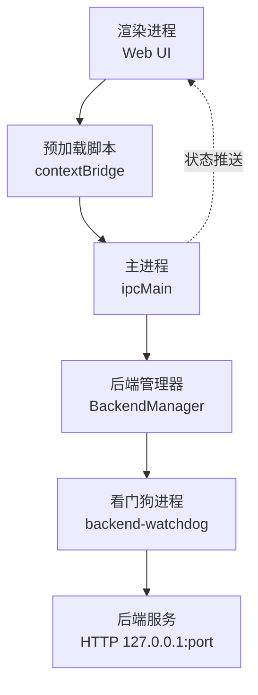
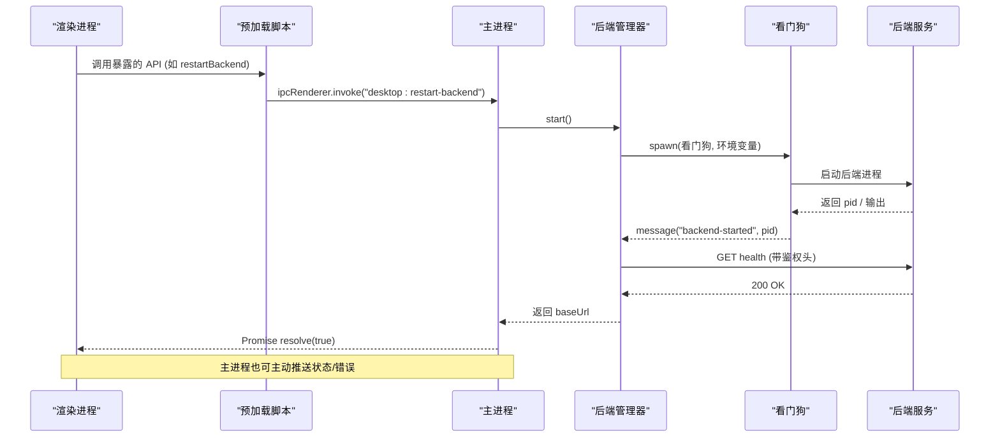
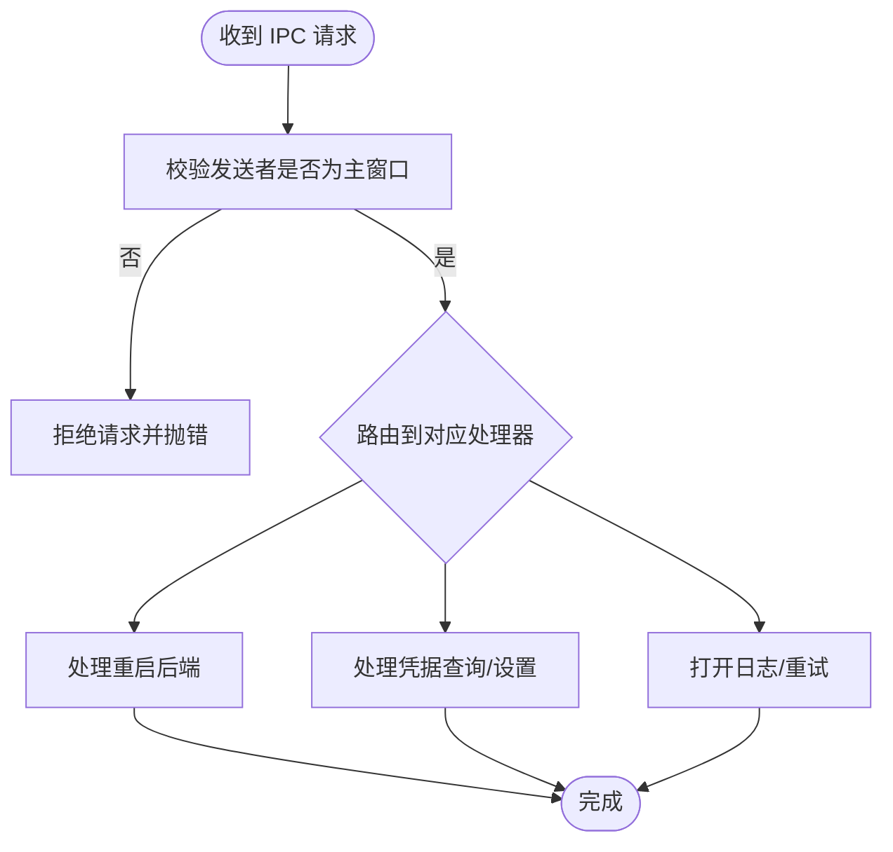
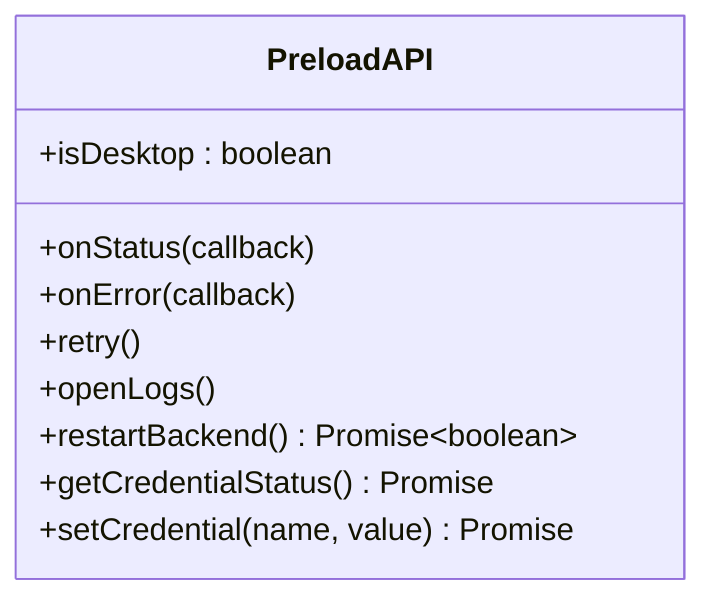
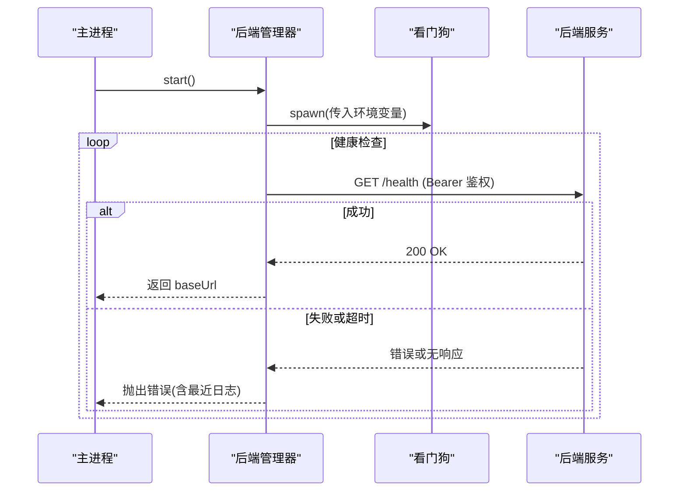
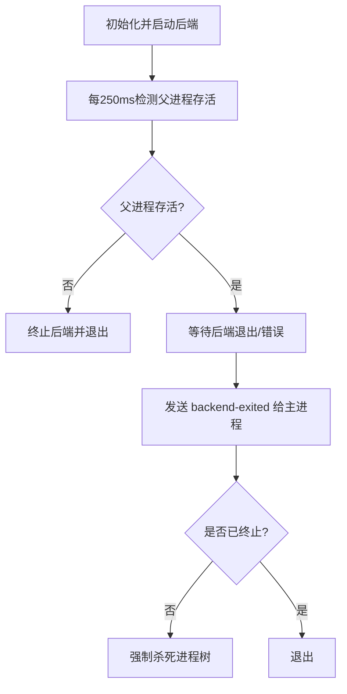
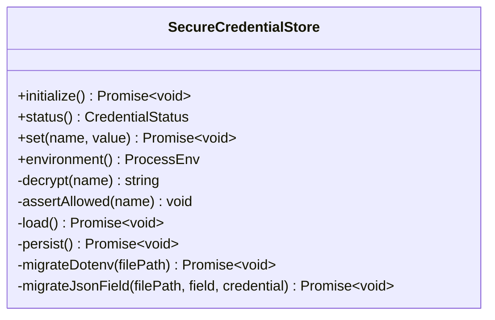
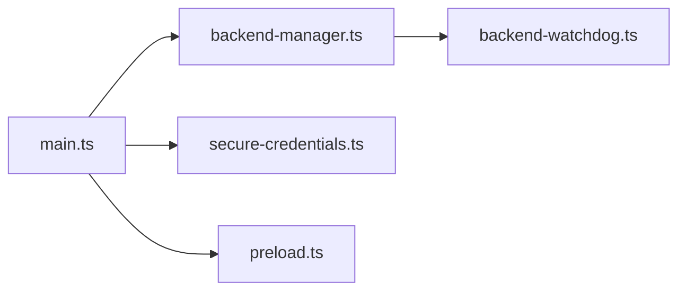

# 进程通信优化

<cite>
**本文引用的文件**
- [main.ts](file://desktop/electron/src/main.ts)
- [preload.ts](file://desktop/electron/src/preload.ts)
- [backend-manager.ts](file://desktop/electron/src/backend-manager.ts)
- [backend-watchdog.ts](file://desktop/electron/src/backend-watchdog.ts)
- [secure-credentials.ts](file://desktop/electron/src/secure-credentials.ts)
- [package.json](file://desktop/electron/package.json)
- [bench_performance.py](file://agent/scripts/bench_performance.py)
</cite>

## 目录
1. [简介](#简介)
2. [项目结构](#项目结构)
3. [核心组件](#核心组件)
4. [架构总览](#架构总览)
5. [详细组件分析](#详细组件分析)
6. [依赖关系分析](#依赖关系分析)
7. [性能考量](#性能考量)
8. [故障排查指南](#故障排查指南)
9. [结论](#结论)
10. [附录](#附录)

## 简介
本指南聚焦于 Electron 主进程与渲染进程之间的 IPC 通信优化，结合仓库中的桌面端实现，系统阐述：
- 同步与异步 IPC 的性能差异、序列化开销与大量数据传输优化策略
- 预加载脚本的安全上下文隔离、API 暴露策略与权限控制
- 跨进程状态管理最佳实践（共享状态同步、事件驱动、消息队列）
- WebAssembly 在进程通信中的应用场景（二进制传输、计算卸载）
- 性能测试方法与基准建立（延迟、吞吐、内存）
- 常见通信问题诊断与解决方案（死锁检测、消息丢失、重试机制）

## 项目结构
桌面端采用“主进程 + 预加载 + 后端子进程”的三层架构：
- 主进程负责窗口生命周期、安全策略、IPC 路由、后端启动与健康检查
- 预加载脚本通过 contextBridge 向渲染进程暴露最小化 API
- 后端以独立子进程运行并通过本地 HTTP 提供服务，主进程通过健康检查确认就绪

图表来源
- [main.ts:65-117](file://desktop/electron/src/main.ts#L65-L117)
- [preload.ts:1-18](file://desktop/electron/src/preload.ts#L1-L18)
- [backend-manager.ts:63-146](file://desktop/electron/src/backend-manager.ts#L63-L146)
- [backend-watchdog.ts:31-68](file://desktop/electron/src/backend-watchdog.ts#L31-L68)

章节来源
- [main.ts:1-285](file://desktop/electron/src/main.ts#L1-L285)
- [package.json:1-86](file://desktop/electron/package.json#L1-L86)

## 核心组件
- 主进程 IPC 路由：集中注册事件与处理器，严格校验发送者来源，避免任意页面调用
- 预加载桥接：仅暴露必要方法，使用 invoke/on 模式进行异步通信与事件订阅
- 后端管理器：发现并启动后端、分配端口、健康检查、日志采集、优雅关闭
- 看门狗：监控父进程存活、转发后端生命周期事件、统一终止流程
- 凭证存储：加密持久化敏感信息，限制可配置键集，提供环境注入

章节来源
- [main.ts:119-146](file://desktop/electron/src/main.ts#L119-L146)
- [preload.ts:1-18](file://desktop/electron/src/preload.ts#L1-L18)
- [backend-manager.ts:52-266](file://desktop/electron/src/backend-manager.ts#L52-L266)
- [backend-watchdog.ts:1-167](file://desktop/electron/src/backend-watchdog.ts#L1-L167)
- [secure-credentials.ts:68-220](file://desktop/electron/src/secure-credentials.ts#L68-L220)

## 架构总览
下图展示从渲染进程到后端的完整调用链，包括 IPC、健康检查与错误上报。

图表来源
- [preload.ts:13-16](file://desktop/electron/src/preload.ts#L13-L16)
- [main.ts:128-132](file://desktop/electron/src/main.ts#L128-L132)
- [backend-manager.ts:63-146](file://desktop/electron/src/backend-manager.ts#L63-L146)
- [backend-manager.ts:261-286](file://desktop/electron/src/backend-manager.ts#L261-L286)
- [backend-watchdog.ts:50-68](file://desktop/electron/src/backend-watchdog.ts#L50-L68)

## 详细组件分析

### 主进程 IPC 路由与安全
- 使用 ipcMain.on/handle 注册事件与处理器，所有请求均通过 assertMainWindowSender 校验 sender 是否为主窗口，防止恶意页面劫持
- 对敏感操作（设置凭据）进行参数类型校验，失败时抛出明确错误
- 通过 webRequest 拦截本地后端请求，自动注入 Authorization 头，减少前端负担

图表来源
- [main.ts:119-146](file://desktop/electron/src/main.ts#L119-L146)
- [main.ts:240-247](file://desktop/electron/src/main.ts#L240-L247)

章节来源
- [main.ts:119-146](file://desktop/electron/src/main.ts#L119-L146)
- [main.ts:240-247](file://desktop/electron/src/main.ts#L240-L247)

### 预加载脚本与上下文隔离
- 启用 contextIsolation、nodeIntegration=false、sandbox=true，确保渲染进程无法直接访问 Node API
- 通过 contextBridge.exposeInMainWorld 暴露最小 API 集合：onStatus、onError、retry、openLogs、restartBackend、getCredentialStatus、setCredential
- 使用 ipcRenderer.on 订阅主进程推送的状态/错误事件；使用 invoke 发起一次性请求

图表来源
- [preload.ts:1-18](file://desktop/electron/src/preload.ts#L1-L18)

章节来源
- [preload.ts:1-18](file://desktop/electron/src/preload.ts#L1-L18)

### 后端管理与健康检查
- 动态查找并启动后端可执行文件，分配空闲端口，写入日志，传递安全环境变量
- 通过健康检查接口轮询直到后端就绪，超时则报告错误
- 优雅关闭：先尝试 HTTP 关闭，再通知看门狗终止，最后强制杀进程树

图表来源
- [backend-manager.ts:63-146](file://desktop/electron/src/backend-manager.ts#L63-L146)
- [backend-manager.ts:261-286](file://desktop/electron/src/backend-manager.ts#L261-L286)

章节来源
- [backend-manager.ts:63-146](file://desktop/electron/src/backend-manager.ts#L63-L146)
- [backend-manager.ts:261-286](file://desktop/electron/src/backend-manager.ts#L261-L286)

### 看门狗进程与生命周期
- 周期性检测主进程存活，异常时终止后端
- 监听后端退出信号，向主进程发送退出原因
- 支持外部指令 terminate-backend，统一终止流程

图表来源
- [backend-watchdog.ts:45-68](file://desktop/electron/src/backend-watchdog.ts#L45-L68)
- [backend-watchdog.ts:88-117](file://desktop/electron/src/backend-watchdog.ts#L88-L117)

章节来源
- [backend-watchdog.ts:1-167](file://desktop/electron/src/backend-watchdog.ts#L1-L167)

### 安全凭据存储与环境注入
- 使用 safeStorage 加密存储，限制允许设置的键名白名单
- 启动时将解密后的凭据注入后端进程环境，避免明文传递
- 迁移旧格式凭据（dotenv/json），保证平滑升级

图表来源
- [secure-credentials.ts:68-220](file://desktop/electron/src/secure-credentials.ts#L68-L220)

章节来源
- [secure-credentials.ts:68-220](file://desktop/electron/src/secure-credentials.ts#L68-L220)

## 依赖关系分析
- 主进程依赖 BackendManager 管理后端生命周期，依赖 SecureCredentialStore 管理凭据
- 预加载脚本仅依赖 electron 的 contextBridge/ipcRenderer，保持轻量
- 看门狗通过环境变量获取后端可执行路径与参数，解耦主进程与后端细节

图表来源
- [main.ts:13-20](file://desktop/electron/src/main.ts#L13-L20)
- [backend-manager.ts:1-14](file://desktop/electron/src/backend-manager.ts#L1-L14)
- [backend-watchdog.ts:1-12](file://desktop/electron/src/backend-watchdog.ts#L1-L12)

章节来源
- [main.ts:1-285](file://desktop/electron/src/main.ts#L1-L285)
- [backend-manager.ts:1-426](file://desktop/electron/src/backend-manager.ts#L1-L426)
- [backend-watchdog.ts:1-167](file://desktop/electron/src/backend-watchdog.ts#L1-L167)
- [preload.ts:1-18](file://desktop/electron/src/preload.ts#L1-L18)
- [secure-credentials.ts:1-240](file://desktop/electron/src/secure-credentials.ts#L1-L240)

## 性能考量
- IPC 通信模型
  - 优先使用异步 invoke/on，避免阻塞渲染线程；将耗时逻辑放在主进程或后端
  - 批量数据建议通过后端 HTTP 流式传输或分片下载，避免大对象 JSON 序列化
- 序列化与带宽
  - 大数组/二进制数据考虑 ArrayBuffer 或分块传输；JSON 体积过大时压缩或分页
- 健康检查与重试
  - 健康检查采用短轮询+超时，避免长时间阻塞；失败时提供重试入口
- 资源隔离
  - 启用 sandbox、contextIsolation、禁用 nodeIntegration，降低攻击面与意外副作用
- 日志与观测
  - 主进程捕获子进程 stdout/stderr，限制最近日志长度，避免内存增长

[本节为通用指导，不直接分析具体文件]

## 故障排查指南
- 启动失败
  - 检查后端可执行文件是否存在、端口是否被占用、健康检查是否超时
  - 查看主进程日志与最近输出，定位后端启动错误
- 意外退出
  - 看门狗会检测父进程存活，若主进程崩溃则终止后端；关注 backend-exited 消息
- 凭据相关
  - 确认 safeStorage 可用；检查允许的键名白名单；迁移旧格式后重试
- 网络与鉴权
  - 主进程自动注入 Authorization 头至后端请求；确认后端鉴权生效
- 重试与恢复
  - 提供 retry/restart 入口；主进程可触发重新引导后端

章节来源
- [backend-manager.ts:148-187](file://desktop/electron/src/backend-manager.ts#L148-L187)
- [backend-manager.ts:261-286](file://desktop/electron/src/backend-manager.ts#L261-L286)
- [backend-watchdog.ts:45-68](file://desktop/electron/src/backend-watchdog.ts#L45-L68)
- [secure-credentials.ts:84-123](file://desktop/electron/src/secure-credentials.ts#L84-L123)

## 结论
本项目通过严格的 IPC 路由、安全的预加载桥接、健壮的后端管理与看门狗机制，构建了高性能且安全的桌面端通信体系。结合健康检查、日志采集与凭据加密，可在复杂环境下稳定运行。建议在业务层继续遵循异步优先、最小暴露、批量传输与可观测性原则，持续优化用户体验与系统可靠性。

## 附录

### IPC 延迟与吞吐量测试建议
- 延迟测试
  - 在渲染进程循环调用 expose 的 invoke 方法，统计往返时间分布（p50/p95/p99）
  - 对比不同负载下（后台任务、大日志输出）的延迟变化
- 吞吐量测试
  - 并发发送大量小消息与大消息，观察主进程队列与渲染帧率影响
  - 将大对象改为后端流式接口，比较前后吞吐差异
- 内存分析
  - 使用 Chrome DevTools 内存快照，关注 IPC 消息对象与日志缓存
  - 监控主进程日志最近输出缓冲区大小，避免无限增长

[本节为通用指导，不直接分析具体文件]

### 现有基准脚本参考
- 后端性能基准脚本可用于评估算法路径与向量化效果，可作为 IPC 优化前后的对照基线

章节来源
- [bench_performance.py:1-134](file://agent/scripts/bench_performance.py#L1-L134)