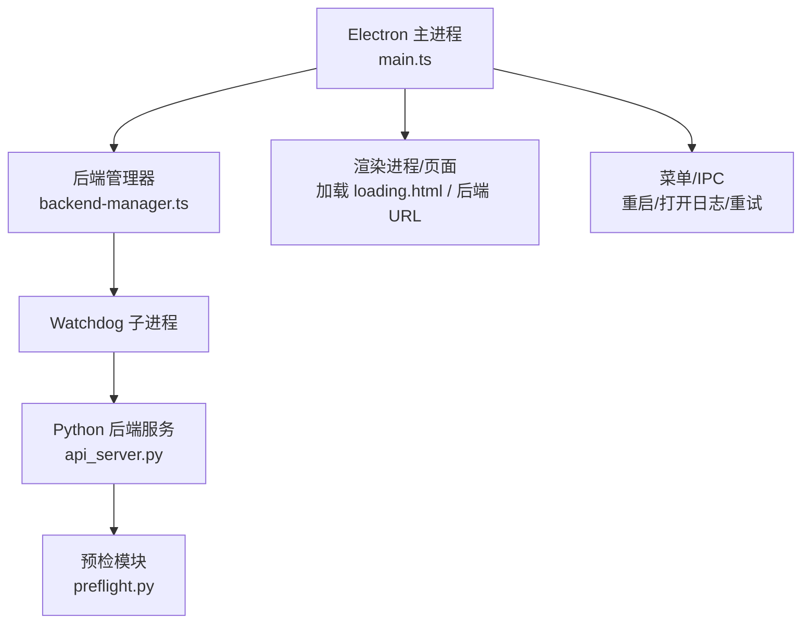
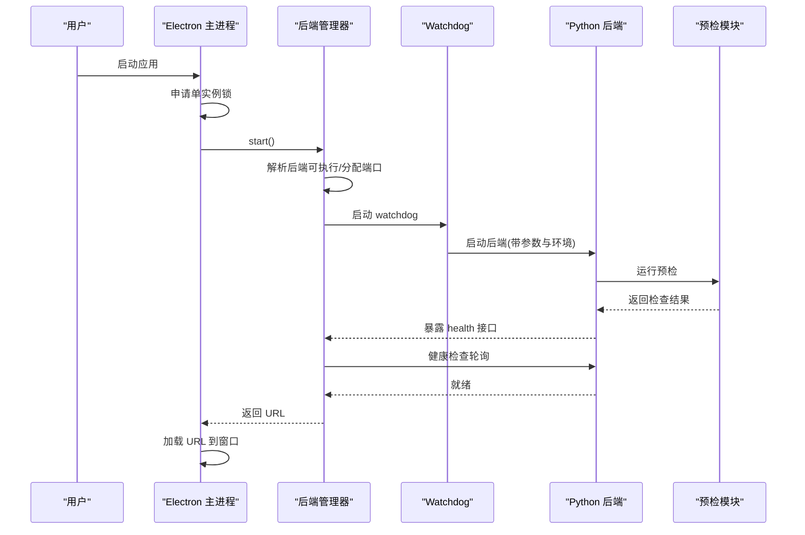
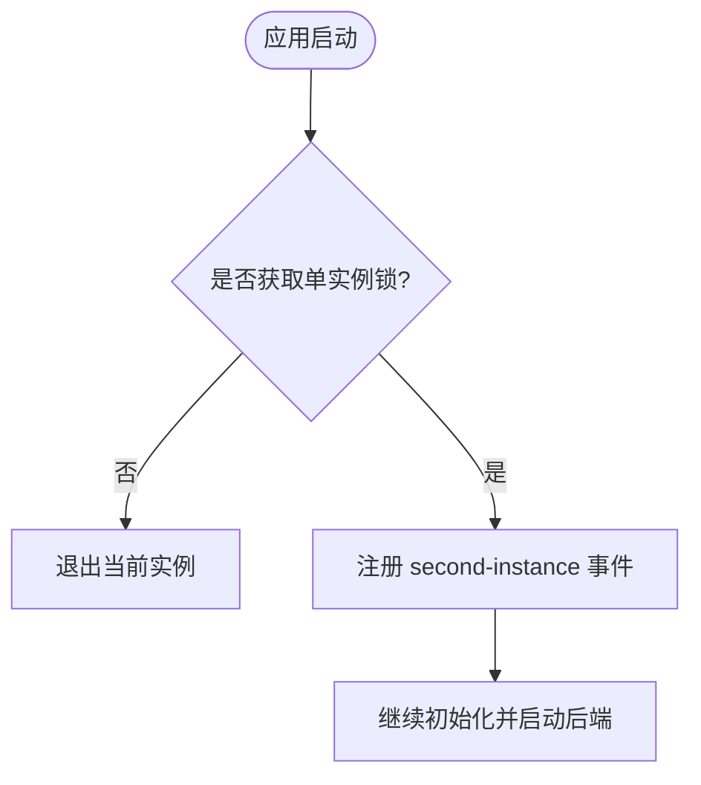
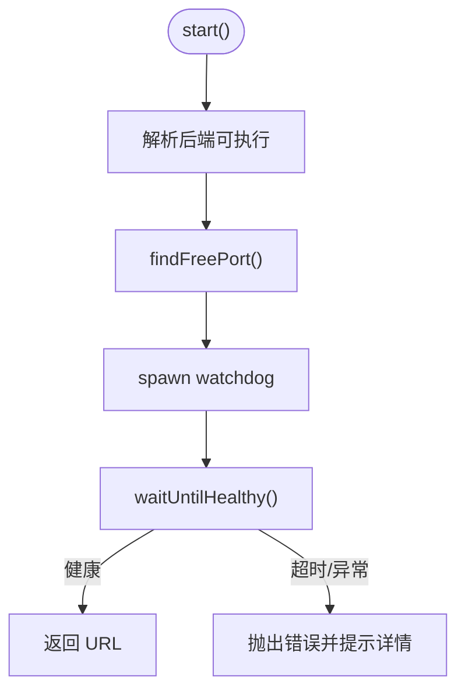
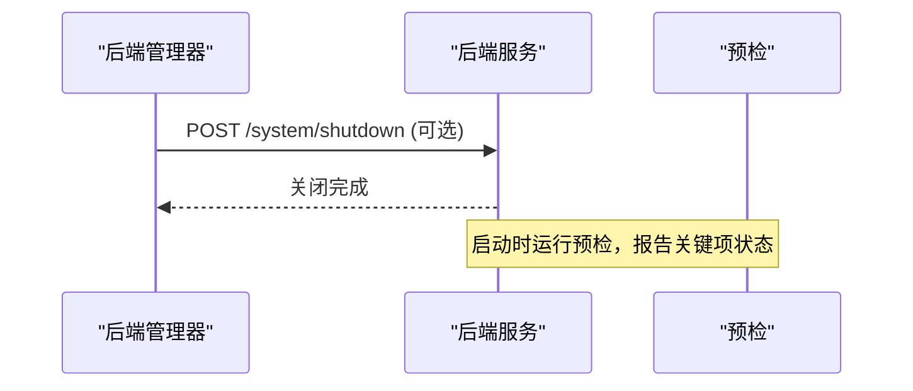
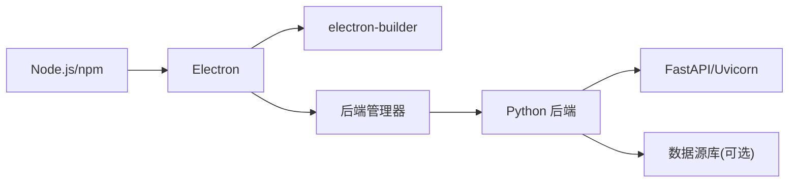

# 启动问题诊断

<cite>
**本文引用的文件**
- [desktop/electron/src/main.ts](file://desktop/electron/src/main.ts)
- [desktop/electron/src/backend-manager.ts](file://desktop/electron/src/backend-manager.ts)
- [desktop/electron/package.json](file://desktop/electron/package.json)
- [agent/api_server.py](file://agent/api_server.py)
- [agent/src/preflight.py](file://agent/src/preflight.py)
- [agent/src/config/env_schema.py](file://agent/src/config/env_schema.py)
- [desktop/electron/src/locales.ts](file://desktop/electron/src/locales.ts)
- [start.bat](file://start.bat)
</cite>

## 目录
1. [简介](#简介)
2. [项目结构](#项目结构)
3. [核心组件](#核心组件)
4. [架构总览](#架构总览)
5. [详细组件分析](#详细组件分析)
6. [依赖关系分析](#依赖关系分析)
7. [性能与稳定性考虑](#性能与稳定性考虑)
8. [故障排查指南](#故障排查指南)
9. [结论](#结论)
10. [附录：常见错误消息与处理步骤](#附录常见错误消息与处理步骤)

## 简介
本指南面向桌面应用（Electron）与后端服务（Python FastAPI）的启动问题诊断。覆盖以下主题：
- 依赖包缺失、Node.js/Electron 版本不兼容、打包产物缺失导致的启动失败
- 后端服务启动失败：端口占用、配置文件错误、环境变量缺失、LLM 配置不可用等
- 权限相关问题：文件系统访问、网络请求、系统 API 调用
- 单实例锁机制与多进程冲突：多实例启动、用户数据目录冲突
- 日志分析方法：主进程日志、后端服务日志、IPC 通信错误定位与修复
- 常见错误消息示例与对应解决步骤

## 项目结构
本项目由三部分组成：
- Electron 桌面端：负责单实例锁、本地后端管理、窗口与 IPC、安全凭据存储、日志输出
- Python 后端服务：FastAPI 应用，提供健康检查、关闭接口、预检（preflight）与环境校验
- 前端资源：开发模式或构建产物由后端在开发/生产模式下提供

图表来源
- [desktop/electron/src/main.ts:35-63](file://desktop/electron/src/main.ts#L35-L63)
- [desktop/electron/src/backend-manager.ts:63-146](file://desktop/electron/src/backend-manager.ts#L63-L146)
- [agent/api_server.py:127-171](file://agent/api_server.py#L127-L171)
- [agent/src/preflight.py:284-337](file://agent/src/preflight.py#L284-L337)

章节来源
- [desktop/electron/package.json:9-22](file://desktop/electron/package.json#L9-L22)
- [desktop/electron/src/main.ts:35-63](file://desktop/electron/src/main.ts#L35-L63)
- [agent/api_server.py:321-395](file://agent/api_server.py#L321-L395)

## 核心组件
- 单实例锁与主流程控制：通过 Electron 的单实例锁避免重复启动；二次实例聚焦已有窗口
- 后端生命周期管理：自动发现可执行文件、分配空闲端口、启动 Watchdog、健康检查、优雅关闭
- 预检与环境校验：启动时检查 LLM 提供商、数据源可用性、代理/超时等关键环境
- 权限与安全：禁用浏览器权限请求、限制外部链接协议、注入本地 API 鉴权头
- 日志与诊断：按天写入日志、捕获子进程输出、提供“打开日志”入口

章节来源
- [desktop/electron/src/main.ts:35-47](file://desktop/electron/src/main.ts#L35-L47)
- [desktop/electron/src/backend-manager.ts:63-146](file://desktop/electron/src/backend-manager.ts#L63-L146)
- [agent/src/preflight.py:284-337](file://agent/src/preflight.py#L284-L337)
- [desktop/electron/src/main.ts:85-98](file://desktop/electron/src/main.ts#L85-L98)

## 架构总览

图表来源
- [desktop/electron/src/main.ts:159-191](file://desktop/electron/src/main.ts#L159-L191)
- [desktop/electron/src/backend-manager.ts:63-146](file://desktop/electron/src/backend-manager.ts#L63-L146)
- [agent/api_server.py:127-171](file://agent/api_server.py#L127-L171)
- [agent/src/preflight.py:284-337](file://agent/src/preflight.py#L284-L337)

## 详细组件分析

### 单实例锁与多进程冲突
- 行为：首次实例成功获取锁后继续启动；若已存在实例，则聚焦并显示已有窗口
- 触发点：应用初始化阶段尝试获取单实例锁
- 常见问题：
  - 双击多次导致多个窗口出现但仅一个后端实例
  - 用户数据目录被覆盖或共享导致状态异常（可通过测试环境变量隔离）

图表来源
- [desktop/electron/src/main.ts:35-47](file://desktop/electron/src/main.ts#L35-L47)

章节来源
- [desktop/electron/src/main.ts:35-47](file://desktop/electron/src/main.ts#L35-L47)

### 后端管理器与端口/健康检查
- 功能：
  - 解析后端可执行路径（支持打包产物、源码工程、PATH 中命令）
  - 动态分配空闲端口（避免端口占用）
  - 启动 Watchdog 子进程监控后端生命周期
  - 循环健康检查直到后端就绪或超时
- 关键点：
  - 注入 API 鉴权密钥与环境变量（如 PYTHONUTF8、PYTHONUNBUFFERED）
  - 将 stdout/stderr 重定向到按日命名的日志文件
  - 优雅关闭：先调用后端 shutdown 接口，再终止进程树

图表来源
- [desktop/electron/src/backend-manager.ts:63-146](file://desktop/electron/src/backend-manager.ts#L63-L146)
- [desktop/electron/src/backend-manager.ts:261-286](file://desktop/electron/src/backend-manager.ts#L261-L286)
- [desktop/electron/src/backend-manager.ts:413-429](file://desktop/electron/src/backend-manager.ts#L413-L429)

章节来源
- [desktop/electron/src/backend-manager.ts:63-146](file://desktop/electron/src/backend-manager.ts#L63-L146)
- [desktop/electron/src/backend-manager.ts:261-286](file://desktop/electron/src/backend-manager.ts#L261-L286)
- [desktop/electron/src/backend-manager.ts:413-429](file://desktop/electron/src/backend-manager.ts#L413-L429)

### 后端服务启动与预检
- 启动流程：
  - 解析命令行参数（默认监听 127.0.0.1:8000）
  - 挂载中间件与安全头
  - 启动时运行预检（LLM、数据源、代理等），如有关键项失败将影响使用
- 健康与关闭：
  - 暴露 health 接口供桌面端探测
  - 提供 system/shutdown 接口用于优雅关闭

图表来源
- [agent/api_server.py:321-395](file://agent/api_server.py#L321-L395)
- [agent/api_server.py:127-171](file://agent/api_server.py#L127-L171)
- [agent/src/preflight.py:284-337](file://agent/src/preflight.py#L284-L337)

章节来源
- [agent/api_server.py:321-395](file://agent/api_server.py#L321-L395)
- [agent/src/preflight.py:284-337](file://agent/src/preflight.py#L284-L337)

### 权限与安全
- 浏览器权限：
  - 拒绝所有权限请求（麦克风、摄像头、通知等）
  - 仅允许 http/https 外部链接
- 本地通信：
  - 对 localhost 请求自动注入 Authorization 头（基于后端 origin）
- 文件系统：
  - 日志目录按需创建并追加写入
  - 凭据存储依赖平台能力（Windows DPAPI 等）

章节来源
- [desktop/electron/src/main.ts:85-98](file://desktop/electron/src/main.ts#L85-L98)
- [desktop/electron/src/main.ts:257-271](file://desktop/electron/src/main.ts#L257-L271)
- [desktop/electron/src/backend-manager.ts:94-100](file://desktop/electron/src/backend-manager.ts#L94-L100)

### 日志与诊断
- 日志位置：应用日志目录（可通过菜单或 IPC 打开）
- 内容：
  - 后端 stdout/stderr 逐行记录
  - Watchdog 状态与退出码
  - 健康检查与错误堆栈摘要
- 建议：
  - 首次启动较慢属正常，关注健康检查是否通过
  - 若后端提前退出，查看最近日志尾部以定位原因

章节来源
- [desktop/electron/src/main.ts:124-127](file://desktop/electron/src/main.ts#L124-L127)
- [desktop/electron/src/backend-manager.ts:94-100](file://desktop/electron/src/backend-manager.ts#L94-L100)
- [desktop/electron/src/backend-manager.ts:288-304](file://desktop/electron/src/backend-manager.ts#L288-L304)

## 依赖关系分析
- Electron 依赖：
  - Node.js 与 npm/yarn（用于开发与构建）
  - Electron 与 electron-builder（打包与安装器）
- Python 后端依赖：
  - FastAPI/Uvicorn、Rich、Pydantic、requests 等
  - 可选数据源库（yfinance、ccxt、akshare、tushare 等）
- 运行时资源：
  - 打包产物中的 backend/runtime 目录
  - 前端构建产物（开发模式由 Vite 提供）

图表来源
- [desktop/electron/package.json:24-28](file://desktop/electron/package.json#L24-L28)
- [agent/api_server.py:166-185](file://agent/api_server.py#L166-L185)
- [agent/src/preflight.py:284-337](file://agent/src/preflight.py#L284-L337)

章节来源
- [desktop/electron/package.json:24-28](file://desktop/electron/package.json#L24-L28)
- [agent/api_server.py:166-185](file://agent/api_server.py#L166-L185)

## 性能与稳定性考虑
- 健康检查间隔短、超时较长，避免误报
- 日志追加写入，避免频繁 I/O 开销
- 优雅关闭顺序：先 HTTP 关闭，再强制终止，确保资源释放
- 预检失败分级：关键项（LLM）阻断使用，非关键项降级提示

[本节为通用指导，无需特定文件引用]

## 故障排查指南

### 一、依赖包缺失与版本不兼容
- 现象：
  - 无法找到 vibe-trading.exe 或 python.exe
  - 构建脚本失败、TypeScript 编译错误
  - Python 导入失败（缺少 yfinance/ccxt/akshare/tushare 等）
- 排查步骤：
  - 确认已安装 Node.js 与 npm，且版本满足 Electron 要求
  - 在 desktop/electron 目录下执行构建与准备脚本
  - 确认后端可执行路径可被解析（环境变量或 PATH）
  - 在 agent 环境中安装依赖，必要时使用虚拟环境
- 参考实现：
  - 后端可执行解析逻辑与搜索路径
  - 预检中对可选依赖的检查与提示

章节来源
- [desktop/electron/src/backend-manager.ts:310-339](file://desktop/electron/src/backend-manager.ts#L310-L339)
- [desktop/electron/src/backend-manager.ts:350-373](file://desktop/electron/src/backend-manager.ts#L350-L373)
- [agent/src/preflight.py:184-271](file://agent/src/preflight.py#L184-L271)

### 二、后端服务启动失败（端口占用、配置错误、环境变量缺失）
- 现象：
  - 健康检查超时
  - 后端提前退出
  - 无法绑定到指定地址/端口
- 排查步骤：
  - 查看后端日志尾部，确认健康检查是否通过
  - 检查是否有其他进程占用端口（管理器会自动选择空闲端口）
  - 确认环境变量（如 LLM 提供商、模型名、base_url、代理等）正确设置
  - 开发模式下确认前端构建或 Vite 服务可用
- 参考实现：
  - 健康检查与超时处理
  - 端口分配与绑定
  - 预检中对 LLM 与数据源的连通性检查

章节来源
- [desktop/electron/src/backend-manager.ts:261-286](file://desktop/electron/src/backend-manager.ts#L261-L286)
- [desktop/electron/src/backend-manager.ts:413-429](file://desktop/electron/src/backend-manager.ts#L413-L429)
- [agent/api_server.py:321-395](file://agent/api_server.py#L321-L395)
- [agent/src/preflight.py:32-153](file://agent/src/preflight.py#L32-L153)

### 三、权限相关问题（文件系统、网络、系统 API）
- 现象：
  - 无法写入日志目录
  - 凭据加密不可用（Windows 会话限制）
  - 外部链接被拦截或请求被拒绝
- 排查步骤：
  - 确保应用有写入日志目录的权限
  - 在 Windows 上确认当前用户会话支持凭据加密
  - 检查外部链接协议是否为 http/https
- 参考实现：
  - 日志目录创建与写入
  - 凭据存储能力检测
  - 权限请求处理器与外部链接白名单

章节来源
- [desktop/electron/src/backend-manager.ts:94-100](file://desktop/electron/src/backend-manager.ts#L94-L100)
- [desktop/electron/src/locales.ts:73-77](file://desktop/electron/src/locales.ts#L73-L77)
- [desktop/electron/src/main.ts:85-98](file://desktop/electron/src/main.ts#L85-L98)
- [desktop/electron/src/main.ts:257-271](file://desktop/electron/src/main.ts#L257-L271)

### 四、单实例锁与多进程冲突
- 现象：
  - 双击多次仍只有一个后端实例
  - 用户数据目录被覆盖或共享导致状态异常
- 排查步骤：
  - 确认单实例锁生效（二次实例会聚焦已有窗口）
  - 如需隔离测试，可使用测试环境变量指定独立 userData 目录
- 参考实现：
  - 单实例锁与 second-instance 事件处理
  - 测试 userData 路径覆盖

章节来源
- [desktop/electron/src/main.ts:35-47](file://desktop/electron/src/main.ts#L35-L47)
- [desktop/electron/src/main.ts:30-34](file://desktop/electron/src/main.ts#L30-L34)

### 五、日志分析与 IPC 错误定位
- 日志位置：
  - 应用日志目录（菜单或 IPC 打开）
  - 后端 stdout/stderr 按日记录
- 分析要点：
  - 关注健康检查是否通过
  - 关注 Watchdog 退出码与信号
  - 关注预检结果（LLM、数据源、代理）
- IPC 错误：
  - 主进程与渲染进程间通信需通过 IPC 通道
  - 若后端未就绪，IPC 可能返回错误或空响应

章节来源
- [desktop/electron/src/main.ts:124-132](file://desktop/electron/src/main.ts#L124-L132)
- [desktop/electron/src/backend-manager.ts:288-304](file://desktop/electron/src/backend-manager.ts#L288-L304)
- [agent/src/preflight.py:284-337](file://agent/src/preflight.py#L284-L337)

## 结论
- 启动失败通常源于：后端可执行不可达、端口/网络问题、环境变量缺失、权限受限、单实例冲突
- 优先检查：后端日志、健康检查、预检结果、环境变量与权限
- 通过菜单或 IPC 快速打开日志并重试，结合健康检查与 Watchdog 信息定位根因

[本节为总结，无需特定文件引用]

## 附录：常见错误消息与处理步骤
- “后端进程已经在运行”
  - 含义：检测到已有后端实例
  - 处理：关闭已有实例或等待其就绪
- “找不到 vibe-trading.exe”
  - 含义：未解析到后端可执行
  - 处理：安装后端或设置 VIBE_TRADING_EXECUTABLE
- “无法分配本地端口”
  - 含义：系统无法分配空闲端口
  - 处理：检查防火墙/代理/端口池，或重启应用
- “后端在就绪前退出”
  - 含义：后端启动后崩溃或提前退出
  - 处理：查看日志尾部，检查依赖与配置
- “等待后端就绪超时”
  - 含义：健康检查长时间失败
  - 处理：检查网络、代理、LLM base_url、凭据
- “凭据加密不可用”
  - 含义：当前会话不支持凭据加密
  - 处理：切换用户会话或使用替代方案
- “后端尚未启动”
  - 含义：后端未成功启动
  - 处理：重试启动并查看日志

章节来源
- [desktop/electron/src/locales.ts:61-131](file://desktop/electron/src/locales.ts#L61-L131)