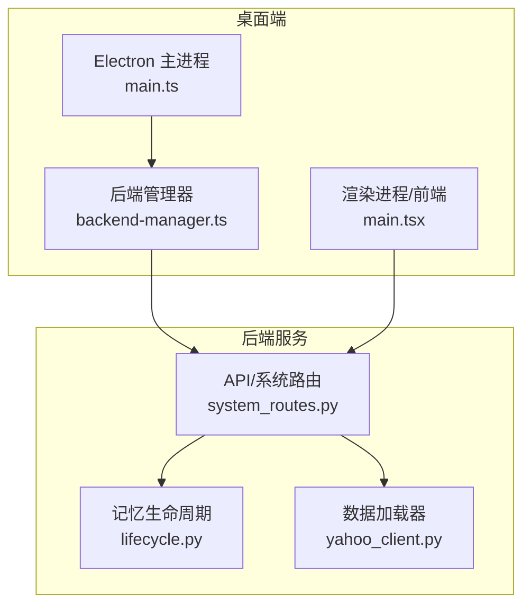
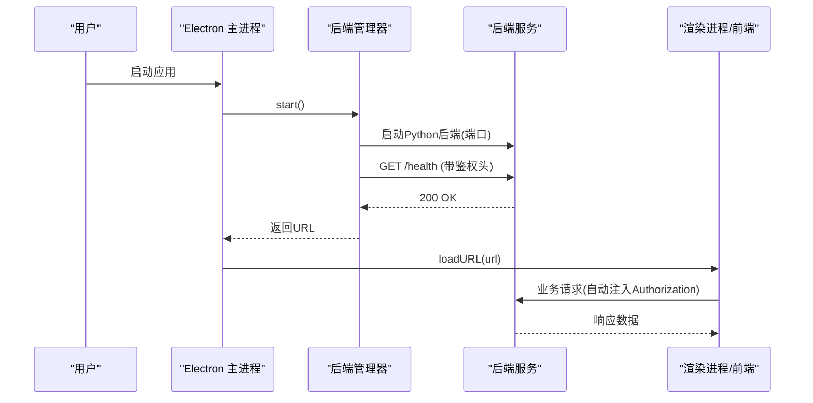
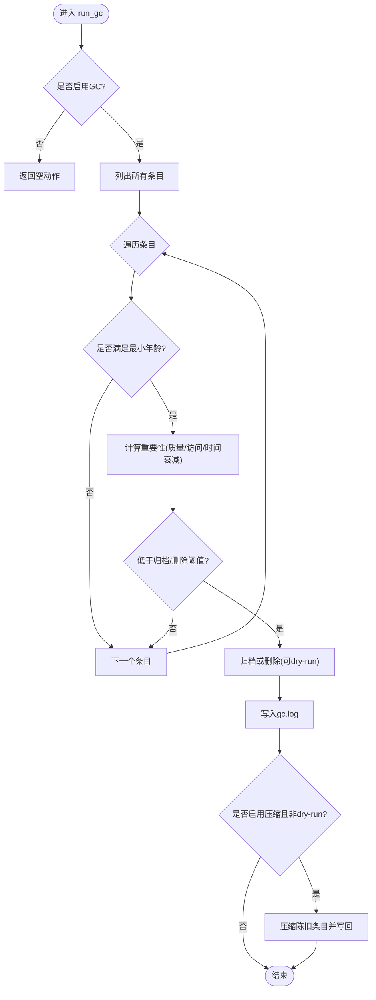
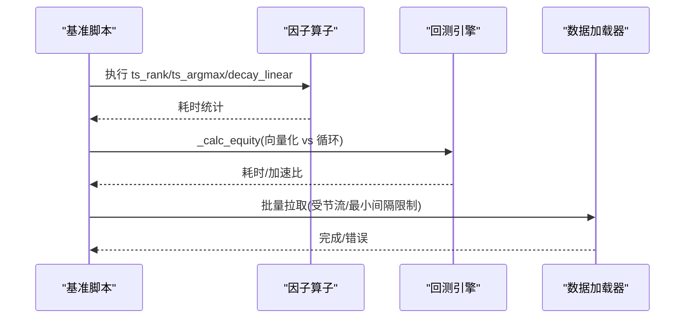
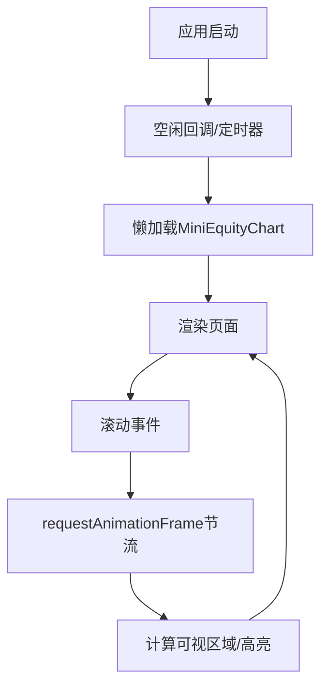
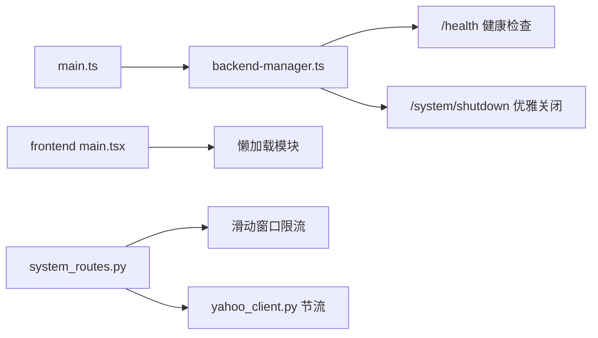

# 性能问题优化

<cite>
**本文引用的文件**
- [agent/src/memory/lifecycle.py](file://agent/src/memory/lifecycle.py)
- [desktop/electron/src/main.ts](file://desktop/electron/src/main.ts)
- [desktop/electron/src/backend-manager.ts](file://desktop/electron/src/backend-manager.ts)
- [frontend/src/main.tsx](file://frontend/src/main.tsx)
- [agent/scripts/bench_performance.py](file://agent/scripts/bench_performance.py)
- [agent/tests/test_signal_alignment_perf.py](file://agent/tests/test_signal_alignment_perf.py)
- [agent/src/api/system_routes.py](file://agent/src/api/system_routes.py)
- [agent/backtest/loaders/yahoo_client.py](file://agent/backtest/loaders/yahoo_client.py)
- [frontend/package.json](file://frontend/package.json)
- [desktop/electron/package.json](file://desktop/electron/package.json)
</cite>

## 目录
1. [简介](#简介)
2. [项目结构](#项目结构)
3. [核心组件](#核心组件)
4. [架构总览](#架构总览)
5. [详细组件分析](#详细组件分析)
6. [依赖关系分析](#依赖关系分析)
7. [性能考量](#性能考量)
8. [故障排查指南](#故障排查指南)
9. [结论](#结论)
10. [附录](#附录)

## 简介
本指南面向 Vibe-Trading 桌面与后端系统，聚焦性能问题的诊断与优化。内容覆盖：
- 内存泄漏检测与修复（Electron 主进程、渲染进程、对象生命周期）
- CPU 占用过高原因分析与优化（长时间计算、频繁 DOM 操作、不必要重渲染）
- 界面响应缓慢的排查工具（React 组件性能分析、事件处理优化、大数据量渲染）
- 磁盘 I/O 优化（文件读写、缓存策略、数据库查询）
- 性能监控指标定义与采集（内存趋势、CPU 使用率、网络耗时）
- 性能测试方法与基准对比工具使用

## 项目结构
本项目由三部分组成：
- Electron 桌面壳层：负责启动/管理 Python 后端、渲染 UI、安全与日志
- Python 后端服务：提供交易、回测、数据加载、记忆管理等能力
- React 前端：基于 Vite + React 构建，负责交互与可视化

**图表来源**
- [desktop/electron/src/main.ts:65-117](file://desktop/electron/src/main.ts#L65-L117)
- [desktop/electron/src/backend-manager.ts:63-145](file://desktop/electron/src/backend-manager.ts#L63-L145)
- [frontend/src/main.tsx:28-35](file://frontend/src/main.tsx#L28-L35)
- [agent/src/api/system_routes.py:108-144](file://agent/src/api/system_routes.py#L108-L144)
- [agent/src/memory/lifecycle.py:71-101](file://agent/src/memory/lifecycle.py#L71-L101)
- [agent/backtest/loaders/yahoo_client.py:44-61](file://agent/backtest/loaders/yahoo_client.py#L44-L61)

**章节来源**
- [desktop/electron/src/main.ts:65-117](file://desktop/electron/src/main.ts#L65-L117)
- [desktop/electron/src/backend-manager.ts:63-145](file://desktop/electron/src/backend-manager.ts#L63-L145)
- [frontend/src/main.tsx:28-35](file://frontend/src/main.tsx#L28-L35)
- [agent/src/api/system_routes.py:108-144](file://agent/src/api/system_routes.py#L108-L144)
- [agent/src/memory/lifecycle.py:71-101](file://agent/src/memory/lifecycle.py#L71-L101)
- [agent/backtest/loaders/yahoo_client.py:44-61](file://agent/backtest/loaders/yahoo_client.py#L44-L61)

## 核心组件
- Electron 主进程：创建窗口、注入鉴权头、监听关闭事件、启动/停止后端、记录日志
- 后端管理器：解析并启动 Python 后端、健康检查、优雅关闭、子进程守护
- 记忆生命周期：质量评分、访问追踪、重要性衰减、垃圾回收与压缩
- 数据加载器：HTTP 请求节流与最小间隔控制，避免过载
- 前端入口：懒加载关键模块，减少首屏开销

**章节来源**
- [desktop/electron/src/main.ts:159-192](file://desktop/electron/src/main.ts#L159-L192)
- [desktop/electron/src/backend-manager.ts:63-145](file://desktop/electron/src/backend-manager.ts#L63-L145)
- [agent/src/memory/lifecycle.py:71-101](file://agent/src/memory/lifecycle.py#L71-L101)
- [agent/backtest/loaders/yahoo_client.py:44-61](file://agent/backtest/loaders/yahoo_client.py#L44-L61)
- [frontend/src/main.tsx:11-26](file://frontend/src/main.tsx#L11-L26)

## 架构总览
下图展示了从 Electron 到后端的关键调用链与健康检查流程，以及前端对后端的鉴权注入。

**图表来源**
- [desktop/electron/src/main.ts:159-192](file://desktop/electron/src/main.ts#L159-L192)
- [desktop/electron/src/backend-manager.ts:63-145](file://desktop/electron/src/backend-manager.ts#L63-L145)
- [desktop/electron/src/main.ts:85-98](file://desktop/electron/src/main.ts#L85-L98)

## 详细组件分析

### 内存管理与泄漏防护（Electron 主进程/渲染进程/后端）
- Electron 主进程
  - 单实例锁：防止重复启动导致资源竞争
  - 窗口关闭时触发优雅关闭：先通知后端 shutdown，再退出
  - IPC 白名单与外部链接限制：降低意外打开导致的内存增长
- 后端管理器
  - 健康检查循环：超时保护，避免阻塞主线程
  - 优雅关闭：先 POST /system/shutdown，再等待退出；必要时强制终止进程树
  - 日志流：限制最近输出长度，避免无限增长
- 后端服务
  - 滑动窗口限流器：按客户端 IP 维护桶，定期清理过期条目，防止内存无界增长
- 记忆生命周期
  - 质量评分与访问计数：通过 frontmatter 原子写入更新，避免并发写冲突
  - GC 阈值与归档：低重要性条目归档或删除，释放磁盘与索引空间
  - 压缩流水线：对陈旧条目进行压缩，降低存储与读取成本

**图表来源**
- [agent/src/memory/lifecycle.py:183-273](file://agent/src/memory/lifecycle.py#L183-L273)

**章节来源**
- [desktop/electron/src/main.ts:102-117](file://desktop/electron/src/main.ts#L102-L117)
- [desktop/electron/src/backend-manager.ts:148-187](file://desktop/electron/src/backend-manager.ts#L148-L187)
- [agent/src/api/system_routes.py:108-144](file://agent/src/api/system_routes.py#L108-L144)
- [agent/src/memory/lifecycle.py:183-273](file://agent/src/memory/lifecycle.py#L183-L273)

### CPU 占用过高：长时间计算与热点路径
- 因子算子与权益计算
  - 向量化工具可用性与禁用开关：通过配置决定是否启用底层加速库
  - 基准脚本对比新旧路径，量化提速效果
- 信号对齐与回测引擎
  - 大规模数据对齐的性能门控：中位数目标 < 50ms，保障高吞吐场景下的稳定性
- 数据加载节流
  - Yahoo 等外部接口统一节流与最小间隔，避免突发请求造成 CPU 抖动

**图表来源**
- [agent/scripts/bench_performance.py:19-134](file://agent/scripts/bench_performance.py#L19-L134)
- [agent/tests/test_signal_alignment_perf.py:445-475](file://agent/tests/test_signal_alignment_perf.py#L445-L475)
- [agent/backtest/loaders/yahoo_client.py:44-61](file://agent/backtest/loaders/yahoo_client.py#L44-L61)

**章节来源**
- [agent/scripts/bench_performance.py:19-134](file://agent/scripts/bench_performance.py#L19-L134)
- [agent/tests/test_signal_alignment_perf.py:445-475](file://agent/tests/test_signal_alignment_perf.py#L445-L475)
- [agent/backtest/loaders/yahoo_client.py:44-61](file://agent/backtest/loaders/yahoo_client.py#L44-L61)

### 界面响应缓慢：React 组件与大数据渲染
- 首屏与懒加载
  - 使用 requestIdleCallback 延迟加载图表模块，减少首屏阻塞
- 列表与滚动
  - 仅保留最近用户消息索引，结合 requestAnimationFrame 节流滚动计算，降低重排
- 状态与渲染
  - 使用 memo/useMemo 减少不必要的重渲染
- 构建与依赖
  - 前端依赖包含图表库与国际化，按需引入可降低包体与初始化开销

**图表来源**
- [frontend/src/main.tsx:11-26](file://frontend/src/main.tsx#L11-L26)
- [frontend/src/components/chat/ConversationTimeline.tsx:10-39](file://frontend/src/components/chat/ConversationTimeline.tsx#L10-L39)
- [frontend/package.json:17-38](file://frontend/package.json#L17-L38)

**章节来源**
- [frontend/src/main.tsx:11-26](file://frontend/src/main.tsx#L11-L26)
- [frontend/src/components/chat/ConversationTimeline.tsx:10-39](file://frontend/src/components/chat/ConversationTimeline.tsx#L10-L39)
- [frontend/package.json:17-38](file://frontend/package.json#L17-L38)

### 磁盘 I/O 优化：文件读写、缓存与查询
- 原子写入与临时文件
  - 通过 .tmp 写入后 os.replace 原子替换，避免崩溃导致损坏
- 压缩与归档
  - 对陈旧条目进行压缩，减少磁盘占用与 I/O 放大
- 索引重建
  - 在归档/删除后重建索引，保证检索效率
- 日志与尾部输出
  - 限制最近输出条数，避免日志无限增长影响 I/O

**章节来源**
- [agent/src/memory/lifecycle.py:323-421](file://agent/src/memory/lifecycle.py#L323-L421)
- [desktop/electron/src/backend-manager.ts:288-304](file://desktop/electron/src/backend-manager.ts#L288-L304)

## 依赖关系分析
- Electron 主进程依赖后端管理器以启动/停止 Python 后端，并通过 IPC 与渲染进程通信
- 后端管理器依赖健康检查与优雅关闭逻辑，确保进程生命周期可控
- 后端服务中的限流器与数据加载器共同控制外部请求频率，降低 CPU/网络压力
- 前端通过懒加载与节流手段降低渲染压力

**图表来源**
- [desktop/electron/src/main.ts:159-192](file://desktop/electron/src/main.ts#L159-L192)
- [desktop/electron/src/backend-manager.ts:63-145](file://desktop/electron/src/backend-manager.ts#L63-L145)
- [frontend/src/main.tsx:11-26](file://frontend/src/main.tsx#L11-L26)
- [agent/src/api/system_routes.py:108-144](file://agent/src/api/system_routes.py#L108-L144)
- [agent/backtest/loaders/yahoo_client.py:44-61](file://agent/backtest/loaders/yahoo_client.py#L44-L61)

**章节来源**
- [desktop/electron/src/main.ts:159-192](file://desktop/electron/src/main.ts#L159-L192)
- [desktop/electron/src/backend-manager.ts:63-145](file://desktop/electron/src/backend-manager.ts#L63-L145)
- [frontend/src/main.tsx:11-26](file://frontend/src/main.tsx#L11-L26)
- [agent/src/api/system_routes.py:108-144](file://agent/src/api/system_routes.py#L108-L144)
- [agent/backtest/loaders/yahoo_client.py:44-61](file://agent/backtest/loaders/yahoo_client.py#L44-L61)

## 性能考量
- 内存
  - 启用记忆 GC 与压缩，设置合理的归档/删除阈值，避免长期累积
  - 限制后端管理器最近输出长度，防止日志内存膨胀
  - 使用滑动窗口限流器，定期清理过期键，避免内存无界增长
- CPU
  - 使用向量化路径与基准脚本验证性能回归
  - 对大数据对齐设置性能门控，确保中位数在目标范围内
  - 数据加载统一节流，避免突发请求导致 CPU 尖峰
- I/O
  - 原子写入与压缩减少损坏风险与磁盘占用
  - 日志滚动与尾部限制降低 I/O 压力
- 前端
  - 懒加载与节流减少首屏与滚动时的卡顿
  - 合理拆分依赖，按需引入图表与国际化资源

[本节为通用指导，不直接分析具体文件]

## 故障排查指南
- 启动失败/后端异常
  - 检查健康检查超时与最近日志尾部，定位后端启动失败原因
  - 确认端口分配与防火墙/代理未拦截本地回环地址
- 进程未正确退出
  - 使用优雅关闭流程，若失败则强制终止进程树
  - 验证父进程死亡时子进程是否被清理
- 内存持续增长
  - 开启记忆 GC，观察归档/删除动作与 gc.log
  - 检查限流器是否定期清理过期键
- 界面卡顿
  - 使用浏览器性能面板分析长任务与重绘
  - 检查滚动节流与懒加载是否生效
- 数据加载慢
  - 调整最小间隔与节流策略，避免触发远端限速
  - 检查网络与代理配置

**章节来源**
- [desktop/electron/src/backend-manager.ts:261-286](file://desktop/electron/src/backend-manager.ts#L261-L286)
- [desktop/electron/src/backend-manager.ts:148-187](file://desktop/electron/src/backend-manager.ts#L148-L187)
- [agent/src/memory/lifecycle.py:183-273](file://agent/src/memory/lifecycle.py#L183-L273)
- [agent/src/api/system_routes.py:108-144](file://agent/src/api/system_routes.py#L108-L144)
- [agent/backtest/loaders/yahoo_client.py:44-61](file://agent/backtest/loaders/yahoo_client.py#L44-L61)

## 结论
通过 Electron 主进程的健壮生命周期管理、后端服务的限流与 GC、前端的懒加载与节流，以及完善的基准测试与监控，可以系统性识别并解决内存、CPU、I/O 与界面响应等性能问题。建议在生产环境持续运行基准与监控，及时捕获性能回归。

[本节为总结性内容，不直接分析具体文件]

## 附录
- 性能测试方法
  - 使用基准脚本对比新旧实现，关注中位数耗时与加速比
  - 对信号对齐等热点路径设置性能门控，纳入 CI 检查
- 监控指标建议
  - 内存：进程 RSS、堆大小、GC 次数与耗时
  - CPU：主线程占用、后台任务耗时分布
  - 网络：请求耗时、失败率、节流触发次数
  - I/O：日志大小、压缩比例、归档/删除数量
- 工具与配置
  - 前端：Vite + Vitest，按需引入图表与国际化
  - 桌面：Electron + electron-builder，打包与发布脚本完善

**章节来源**
- [agent/scripts/bench_performance.py:19-134](file://agent/scripts/bench_performance.py#L19-L134)
- [agent/tests/test_signal_alignment_perf.py:445-475](file://agent/tests/test_signal_alignment_perf.py#L445-L475)
- [frontend/package.json:9-15](file://frontend/package.json#L9-L15)
- [desktop/electron/package.json:9-22](file://desktop/electron/package.json#L9-L22)