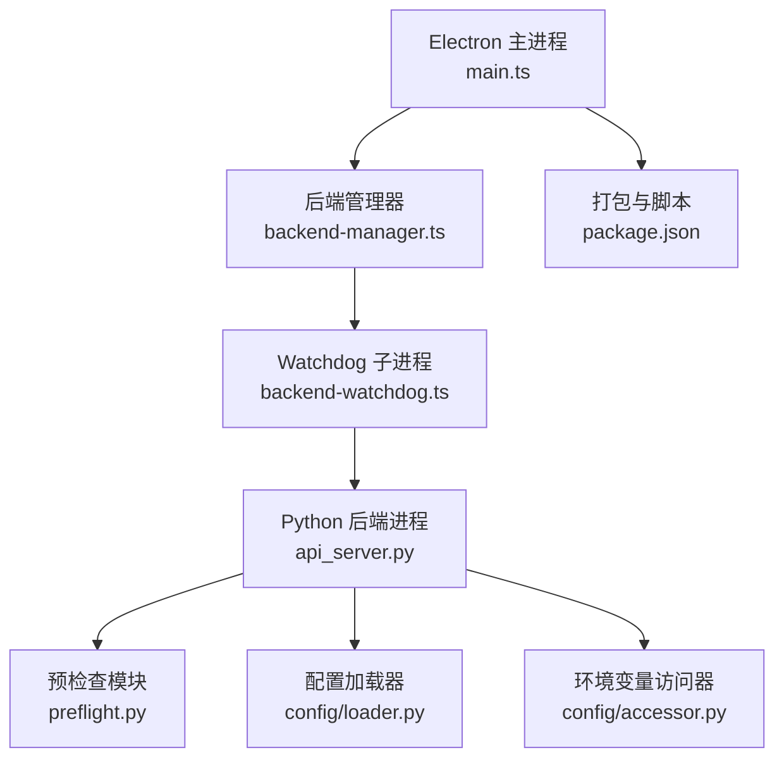
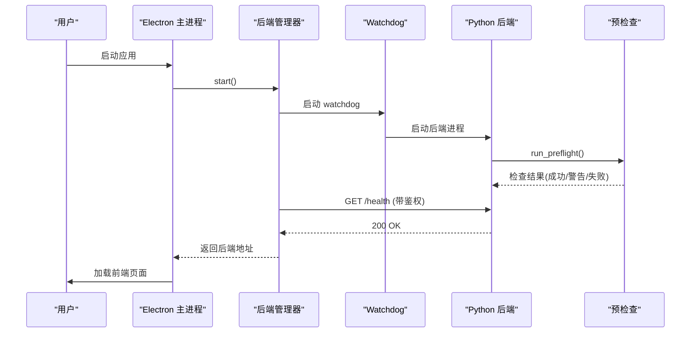
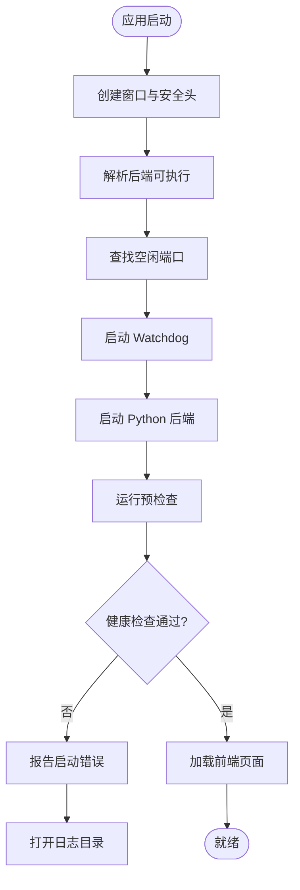
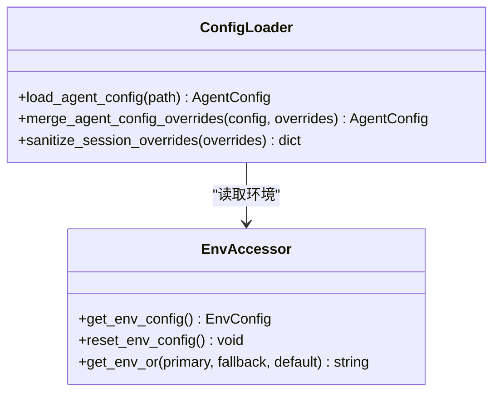
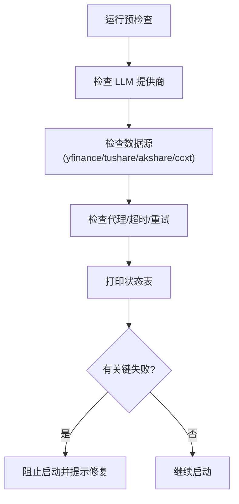
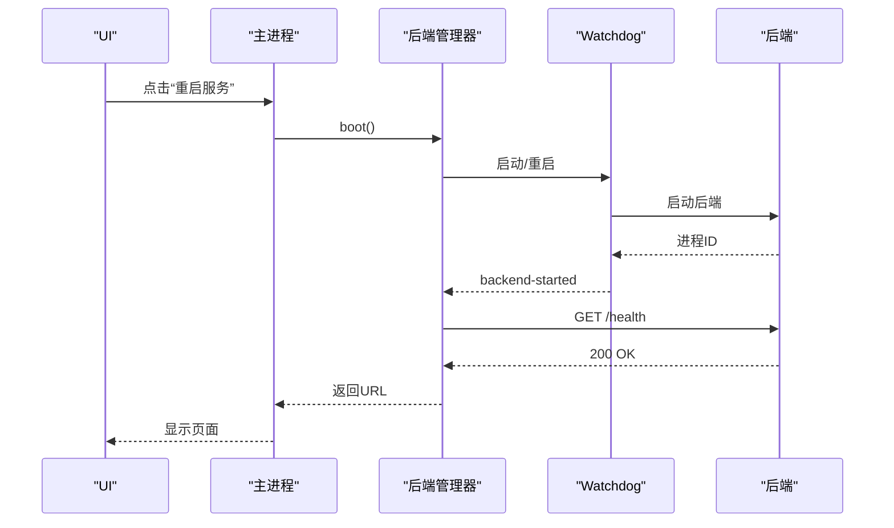
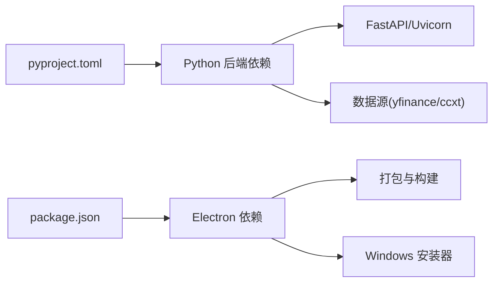

# 故障排除指南

<cite>
**本文引用的文件**
- [README.md](file://README.md)
- [pyproject.toml](file://pyproject.toml)
- [api_server.py](file://agent/api_server.py)
- [preflight.py](file://agent/src/preflight.py)
- [loader.py](file://agent/src/config/loader.py)
- [accessor.py](file://agent/src/config/accessor.py)
- [main.ts](file://desktop/electron/src/main.ts)
- [backend-manager.ts](file://desktop/electron/src/backend-manager.ts)
- [backend-watchdog.ts](file://desktop/electron/src/backend-watchdog.ts)
- [package.json](file://desktop/electron/package.json)
</cite>

## 目录
1. [简介](#简介)
2. [项目结构](#项目结构)
3. [核心组件](#核心组件)
4. [架构总览](#架构总览)
5. [详细组件分析](#详细组件分析)
6. [依赖关系分析](#依赖关系分析)
7. [性能注意事项](#性能注意事项)
8. [故障排除指南](#故障排除指南)
9. [结论](#结论)
10. [附录](#附录)

## 简介
本指南面向桌面应用（Electron 前端 + Python FastAPI 后端）的启动、运行与性能问题排查。内容覆盖：
- 常见启动问题：依赖缺失、端口冲突、权限不足、配置文件错误
- 运行时错误：崩溃日志分析、内存溢出检测、IPC 通信异常、网络请求失败
- 性能问题：瓶颈识别、内存泄漏检测、CPU 占用过高原因分析与解决
- 跨平台兼容性：操作系统差异、文件系统路径、系统 API 调用差异
- 调试信息收集与分析：日志级别、错误堆栈、性能指标、用户行为记录
- 常见问题快速修复与预防措施：开发/生产/用户环境问题处理

## 项目结构
本项目由三大部分组成：
- Electron 桌面壳层：负责进程管理、安全凭证、本地日志、菜单与 UI 交互
- Python 后端服务：FastAPI 提供 REST/SSE 接口，包含预检、配置加载、路由注册等
- 前端资源：构建产物由后端在开发或生产模式下提供

图表来源
- [main.ts:49-192](file://desktop/electron/src/main.ts#L49-L192)
- [backend-manager.ts:63-146](file://desktop/electron/src/backend-manager.ts#L63-L146)
- [backend-watchdog.ts:31-68](file://desktop/electron/src/backend-watchdog.ts#L31-L68)
- [api_server.py:127-171](file://agent/api_server.py#L127-L171)
- [preflight.py:284-337](file://agent/src/preflight.py#L284-L337)
- [loader.py:28-55](file://agent/src/config/loader.py#L28-L55)
- [accessor.py:52-93](file://agent/src/config/accessor.py#L52-L93)
- [package.json:9-22](file://desktop/electron/package.json#L9-L22)

章节来源
- [main.ts:49-192](file://desktop/electron/src/main.ts#L49-L192)
- [backend-manager.ts:63-146](file://desktop/electron/src/backend-manager.ts#L63-L146)
- [backend-watchdog.ts:31-68](file://desktop/electron/src/backend-watchdog.ts#L31-L68)
- [api_server.py:127-171](file://agent/api_server.py#L127-L171)
- [preflight.py:284-337](file://agent/src/preflight.py#L284-L337)
- [loader.py:28-55](file://agent/src/config/loader.py#L28-L55)
- [accessor.py:52-93](file://agent/src/config/accessor.py#L52-L93)
- [package.json:9-22](file://desktop/electron/package.json#L9-L22)

## 核心组件
- 桌面主进程：创建窗口、注入安全头、管理后端生命周期、打开日志目录、捕获未捕获异常
- 后端管理器：解析可执行、查找空闲端口、启动 Watchdog、健康检查、优雅关闭
- Watchdog：监控父进程存活、转发后端输出、终止进程树、跨平台清理
- 后端服务：注册路由、中间件、启动预检、提供健康端点、开发模式启动 Vite
- 预检查：校验 LLM 提供商、数据源可用性、代理与超时等
- 配置加载：读取 JSON/YAML 配置、合并覆盖、安全限制敏感键
- 环境变量访问：单例缓存、线程安全重置、兼容旧别名

章节来源
- [main.ts:65-117](file://desktop/electron/src/main.ts#L65-L117)
- [backend-manager.ts:63-146](file://desktop/electron/src/backend-manager.ts#L63-L146)
- [backend-watchdog.ts:43-101](file://desktop/electron/src/backend-watchdog.ts#L43-L101)
- [api_server.py:166-185](file://agent/api_server.py#L166-L185)
- [preflight.py:32-153](file://agent/src/preflight.py#L32-L153)
- [loader.py:28-55](file://agent/src/config/loader.py#L28-L55)
- [accessor.py:52-93](file://agent/src/config/accessor.py#L52-L93)

## 架构总览
桌面应用通过 Electron 主进程启动并管理 Python 后端。后端以 FastAPI 提供服务，启动时执行预检查，确保关键依赖可用。Electron 通过健康端点轮询后端就绪状态，并在异常时提示用户打开日志。

图表来源
- [main.ts:159-192](file://desktop/electron/src/main.ts#L159-L192)
- [backend-manager.ts:63-146](file://desktop/electron/src/backend-manager.ts#L63-L146)
- [backend-watchdog.ts:31-68](file://desktop/electron/src/backend-watchdog.ts#L31-L68)
- [api_server.py:127-171](file://agent/api_server.py#L127-L171)
- [preflight.py:284-337](file://agent/src/preflight.py#L284-L337)

## 详细组件分析

### 启动流程与健康检查
- 主进程创建窗口并注入安全头，设置本地回环授权头
- 后端管理器解析可执行路径、查找空闲端口、启动 Watchdog
- Watchdog 启动 Python 后端，转发标准输出/错误，监控父进程
- 后端启动时执行预检查，打印状态表；若关键项失败则提示无法启动
- 管理器轮询 /health，成功后将 URL 传给前端

图表来源
- [main.ts:65-117](file://desktop/electron/src/main.ts#L65-L117)
- [backend-manager.ts:63-146](file://desktop/electron/src/backend-manager.ts#L63-L146)
- [backend-watchdog.ts:31-68](file://desktop/electron/src/backend-watchdog.ts#L31-L68)
- [api_server.py:127-171](file://agent/api_server.py#L127-L171)
- [preflight.py:284-337](file://agent/src/preflight.py#L284-L337)

章节来源
- [main.ts:65-117](file://desktop/electron/src/main.ts#L65-L117)
- [backend-manager.ts:63-146](file://desktop/electron/src/backend-manager.ts#L63-L146)
- [backend-watchdog.ts:31-68](file://desktop/electron/src/backend-watchdog.ts#L31-L68)
- [api_server.py:127-171](file://agent/api_server.py#L127-L171)
- [preflight.py:284-337](file://agent/src/preflight.py#L284-L337)

### 配置与环境变量
- 配置加载支持 JSON/YAML，失败时降级为默认配置并记录警告
- 会话级覆盖会过滤敏感键（如 MCP 服务器定义），防止非受信任调用者注入命令
- 环境变量访问器使用单例缓存，线程安全；支持重置以反映运行时修改
- 兼容旧别名，便于平滑迁移

图表来源
- [loader.py:28-55](file://agent/src/config/loader.py#L28-L55)
- [loader.py:107-135](file://agent/src/config/loader.py#L107-L135)
- [accessor.py:52-93](file://agent/src/config/accessor.py#L52-L93)
- [accessor.py:116-149](file://agent/src/config/accessor.py#L116-L149)

章节来源
- [loader.py:28-55](file://agent/src/config/loader.py#L28-L55)
- [loader.py:107-135](file://agent/src/config/loader.py#L107-L135)
- [accessor.py:52-93](file://agent/src/config/accessor.py#L52-L93)
- [accessor.py:116-149](file://agent/src/config/accessor.py#L116-L149)

### 预检查与依赖诊断
- 预检查涵盖 LLM 提供商连通性、数据源可用性、代理与超时等
- 对关键失败项（如 LLM 未配置）直接提示无法启动
- 对可选依赖缺失给出“跳过”或“不可用”的状态，便于定位影响范围

图表来源
- [preflight.py:32-153](file://agent/src/preflight.py#L32-L153)
- [preflight.py:284-337](file://agent/src/preflight.py#L284-L337)

章节来源
- [preflight.py:32-153](file://agent/src/preflight.py#L32-L153)
- [preflight.py:284-337](file://agent/src/preflight.py#L284-L337)

### IPC 与进程管理
- Electron 主进程通过 IPC 触发重启、打开日志、获取凭证状态
- 后端管理器通过 HTTP 调用 /system/shutdown 优雅关闭后端
- Watchdog 监控父进程，异常退出时通知主进程并清理进程树

图表来源
- [main.ts:119-146](file://desktop/electron/src/main.ts#L119-L146)
- [backend-manager.ts:63-146](file://desktop/electron/src/backend-manager.ts#L63-L146)
- [backend-watchdog.ts:43-101](file://desktop/electron/src/backend-watchdog.ts#L43-L101)

章节来源
- [main.ts:119-146](file://desktop/electron/src/main.ts#L119-L146)
- [backend-manager.ts:63-146](file://desktop/electron/src/backend-manager.ts#L63-L146)
- [backend-watchdog.ts:43-101](file://desktop/electron/src/backend-watchdog.ts#L43-L101)

## 依赖关系分析
- Python 依赖集中在 pyproject.toml，包含 FastAPI、uvicorn、httpx、pandas、yfinance、ccxt 等
- Electron 依赖集中在 package.json，包含 electron、electron-builder、typescript 等
- 桌面打包脚本与资源嵌入在 package.json 中，支持 Windows NSIS 安装器

图表来源
- [pyproject.toml:24-69](file://pyproject.toml#L24-L69)
- [package.json:24-28](file://desktop/electron/package.json#L24-L28)
- [package.json:33-87](file://desktop/electron/package.json#L33-L87)

章节来源
- [pyproject.toml:24-69](file://pyproject.toml#L24-L69)
- [package.json:24-28](file://desktop/electron/package.json#L24-L28)
- [package.json:33-87](file://desktop/electron/package.json#L33-L87)

## 性能注意事项
- 启动阶段：预检查可能因网络或依赖导入耗时，建议在网络稳定环境运行
- 后端健康检查：轮询间隔短但超时保护，避免长时间阻塞
- 日志写入：后端输出被实时写入日志文件，注意磁盘 I/O 与日志大小
- 进程树清理：Watchdog 在退出时强制终止进程树，避免僵尸进程占用 CPU/内存
- 前端资源：开发模式启动 Vite 会增加额外进程与端口占用

[本节为通用指导，不直接分析具体文件]

## 故障排除指南

### 启动问题
- 依赖缺失
  - 现象：预检查报告“包未安装”或“跳过”，导致部分功能不可用
  - 处理：根据提示安装对应 extra 或依赖；确认 Python 版本满足要求
  - 参考：预检查输出与影响说明
  - 章节来源
    - [preflight.py:184-271](file://agent/src/preflight.py#L184-L271)
    - [pyproject.toml:105-237](file://pyproject.toml#L105-L237)

- 端口冲突
  - 现象：后端无法绑定端口或健康检查失败
  - 处理：管理器自动查找空闲端口；若仍失败，检查防火墙或占用进程
  - 参考：端口查找与健康检查逻辑
  - 章节来源
    - [backend-manager.ts:92-106](file://desktop/electron/src/backend-manager.ts#L92-L106)
    - [backend-manager.ts:261-286](file://desktop/electron/src/backend-manager.ts#L261-L286)

- 权限不足
  - 现象：无法写入日志目录或配置文件
  - 处理：确保用户有写权限；检查日志目录是否存在；必要时以管理员身份运行
  - 参考：日志目录创建与写入
  - 章节来源
    - [backend-manager.ts:94-100](file://desktop/electron/src/backend-manager.ts#L94-L100)

- 配置文件错误
  - 现象：JSON/YAML 解析失败或字段类型不合法
  - 处理：修正文件格式与字段；查看警告日志中的路径与错误详情
  - 参考：配置加载与验证
  - 章节来源
    - [loader.py:28-55](file://agent/src/config/loader.py#L28-L55)
    - [loader.py:232-259](file://agent/src/config/loader.py#L232-L259)

### 运行时错误
- 崩溃日志分析
  - 现象：应用异常退出或无响应
  - 处理：打开日志目录查看当日日志；关注 Watchdog 与后端输出
  - 参考：日志写入与错误上报
  - 章节来源
    - [main.ts:124-127](file://desktop/electron/src/main.ts#L124-L127)
    - [backend-manager.ts:288-304](file://desktop/electron/src/backend-manager.ts#L288-L304)
    - [backend-watchdog.ts:57-68](file://desktop/electron/src/backend-watchdog.ts#L57-L68)

- 内存溢出检测
  - 现象：进程缓慢变慢或 OOM
  - 处理：观察 Watchdog 是否频繁重启；检查后端输出是否有异常堆栈；减少并发任务
  - 参考：进程退出与重启逻辑
  - 章节来源
    - [backend-watchdog.ts:43-101](file://desktop/electron/src/backend-watchdog.ts#L43-L101)

- IPC 通信异常
  - 现象：主进程与后端失去联系
  - 处理：检查 IPC 通道是否断开；查看 Watchdog 消息；必要时重启服务
  - 参考：IPC 消息与父进程监控
  - 章节来源
    - [backend-watchdog.ts:70-78](file://desktop/electron/src/backend-watchdog.ts#L70-L78)
    - [backend-manager.ts:237-259](file://desktop/electron/src/backend-manager.ts#L237-L259)

- 网络请求失败
  - 现象：数据源或 LLM 提供商不可达
  - 处理：检查代理、超时、重试配置；查看预检查结果
  - 参考：预检查中对网络与代理的诊断
  - 章节来源
    - [preflight.py:32-153](file://agent/src/preflight.py#L32-L153)

### 性能问题
- 瓶颈识别
  - 方法：观察预检查耗时、健康检查轮询次数、后端输出频率
  - 处理：优化网络、减少不必要的数据源调用
  - 章节来源
    - [backend-manager.ts:261-286](file://desktop/electron/src/backend-manager.ts#L261-L286)
    - [preflight.py:284-337](file://agent/src/preflight.py#L284-L337)

- 内存泄漏检测
  - 方法：长期运行后内存持续增长；检查 Watchdog 是否频繁回收
  - 处理：定位异常任务；减少长驻对象；重启服务恢复
  - 章节来源
    - [backend-watchdog.ts:43-101](file://desktop/electron/src/backend-watchdog.ts#L43-L101)

- CPU 占用过高
  - 方法：观察进程树与任务数；检查是否重复启动后端
  - 处理：避免多实例；确保优雅关闭；清理僵尸进程
  - 章节来源
    - [backend-manager.ts:148-187](file://desktop/electron/src/backend-manager.ts#L148-L187)
    - [backend-watchdog.ts:88-117](file://desktop/electron/src/backend-watchdog.ts#L88-L117)

### 跨平台兼容性
- 操作系统差异
  - 现象：路径分隔符、进程终止命令不同
  - 处理：使用跨平台工具函数；检查 PATH 与可执行名
  - 章节来源
    - [backend-manager.ts:332-338](file://desktop/electron/src/backend-manager.ts#L332-L338)
    - [backend-watchdog.ts:103-117](file://desktop/electron/src/backend-watchdog.ts#L103-L117)

- 文件系统路径
  - 现象：日志或配置路径不存在或权限不足
  - 处理：确保目录存在；使用应用日志目录；检查用户权限
  - 章节来源
    - [backend-manager.ts:94-100](file://desktop/electron/src/backend-manager.ts#L94-L100)

- 系统 API 调用
  - 现象：taskkill 或信号处理在不同平台表现不同
  - 处理：使用封装函数；捕获异常并降级
  - 章节来源
    - [backend-manager.ts:520-537](file://desktop/electron/src/backend-manager.ts#L520-L537)
    - [backend-watchdog.ts:103-117](file://desktop/electron/src/backend-watchdog.ts#L103-L117)

### 调试信息收集与分析
- 日志级别配置
  - 方法：查看后端启动参数与日志文件；关注 Watchdog 输出
  - 章节来源
    - [api_server.py:404-415](file://agent/api_server.py#L404-L415)
    - [backend-manager.ts:288-304](file://desktop/electron/src/backend-manager.ts#L288-L304)

- 错误堆栈追踪
  - 方法：捕获未捕获异常并弹窗；查看日志中的堆栈
  - 章节来源
    - [main.ts:282-285](file://desktop/electron/src/main.ts#L282-L285)

- 性能指标收集
  - 方法：观察健康检查响应时间、预检查耗时、后端输出频率
  - 章节来源
    - [backend-manager.ts:261-286](file://desktop/electron/src/backend-manager.ts#L261-L286)
    - [preflight.py:284-337](file://agent/src/preflight.py#L284-L337)

- 用户行为记录
  - 方法：通过菜单操作与 IPC 事件追踪用户行为
  - 章节来源
    - [main.ts:119-146](file://desktop/electron/src/main.ts#L119-L146)

### 快速解决方案与预防措施
- 开发环境
  - 确保 Python 与 Node 版本匹配；安装必要依赖；使用开发模式启动前端
  - 章节来源
    - [pyproject.toml:1-23](file://pyproject.toml#L1-L23)
    - [package.json:9-22](file://desktop/electron/package.json#L9-L22)

- 生产环境
  - 使用打包产物；检查签名与完整性；确保只读根文件系统
  - 章节来源
    - [package.json:33-87](file://desktop/electron/package.json#L33-L87)

- 用户环境
  - 提供一键打开日志；引导用户检查代理与网络；必要时重启服务
  - 章节来源
    - [main.ts:124-127](file://desktop/electron/src/main.ts#L124-L127)
    - [backend-manager.ts:148-187](file://desktop/electron/src/backend-manager.ts#L148-L187)

## 结论
本指南基于代码实现梳理了桌面应用的启动、运行与性能问题的排查路径。通过预检查、健康检查、日志与进程管理，能够快速定位依赖、端口、权限、配置与网络等问题。建议在开发与生产环境中统一日志策略与依赖管理，结合跨平台工具函数提升稳定性。

[本节为总结，不直接分析具体文件]

## 附录
- 常用命令与入口
  - 后端入口：serve_main(argv)
  - 桌面脚本：build/start/test
  - 章节来源
    - [api_server.py:321-395](file://agent/api_server.py#L321-L395)
    - [package.json:9-22](file://desktop/electron/package.json#L9-L22)

- 相关文档与更新
  - 项目新闻与特性说明
  - 章节来源
    - [README.md:1-166](file://README.md#L1-L166)