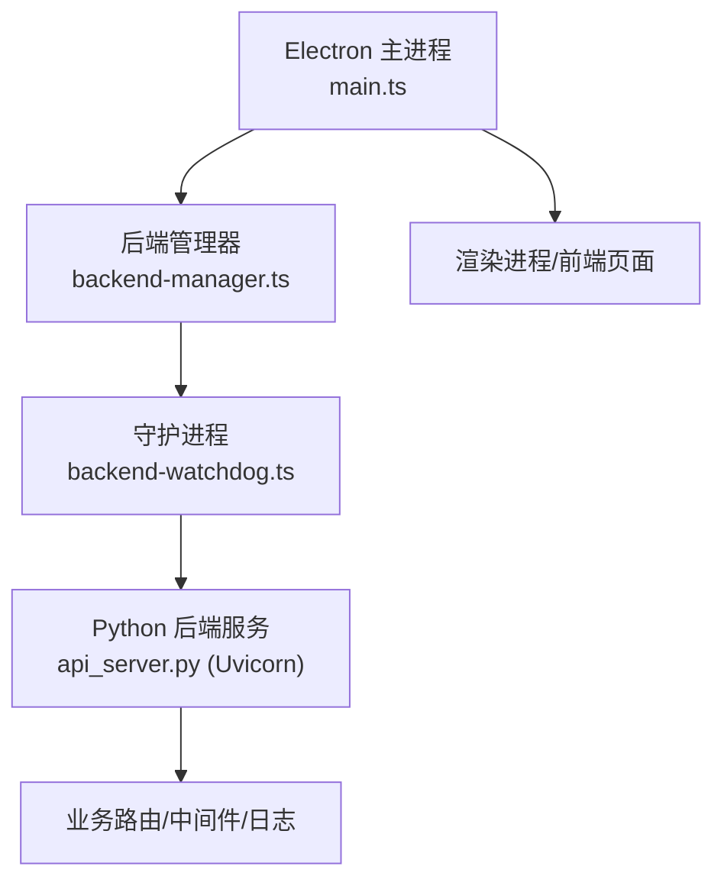
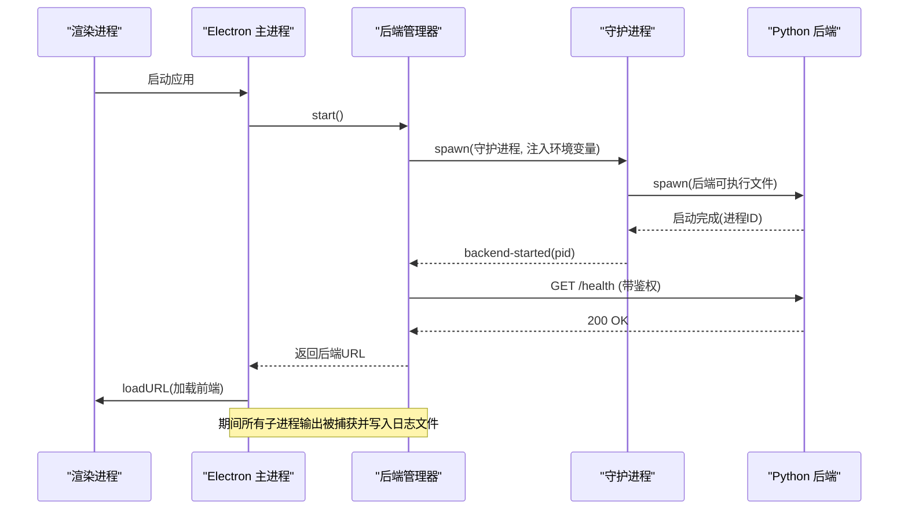
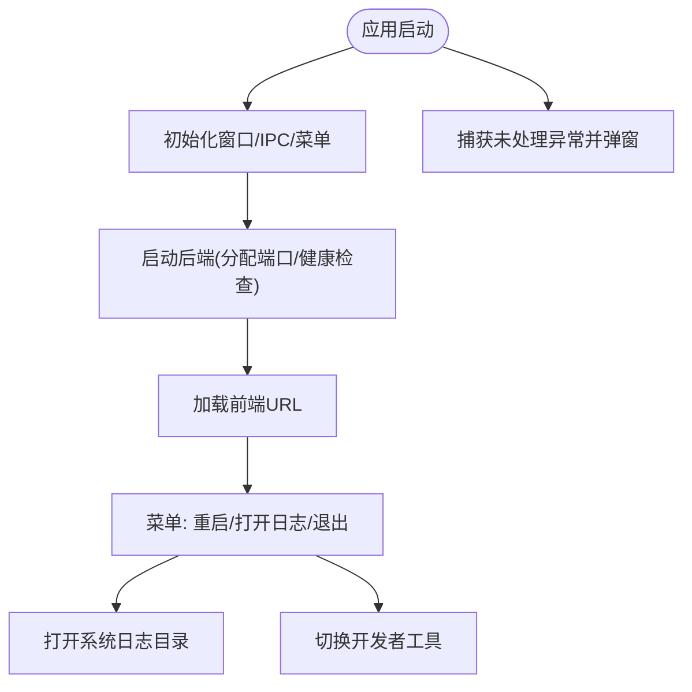
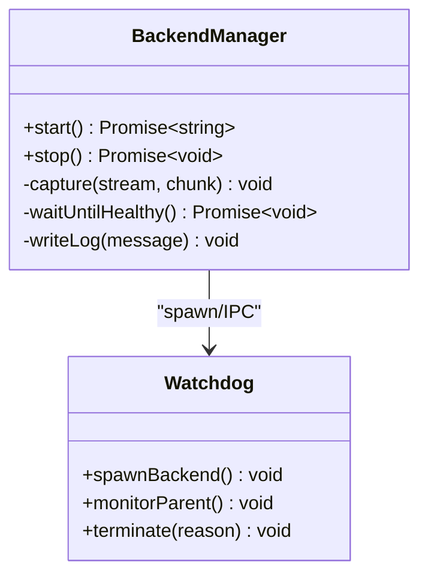
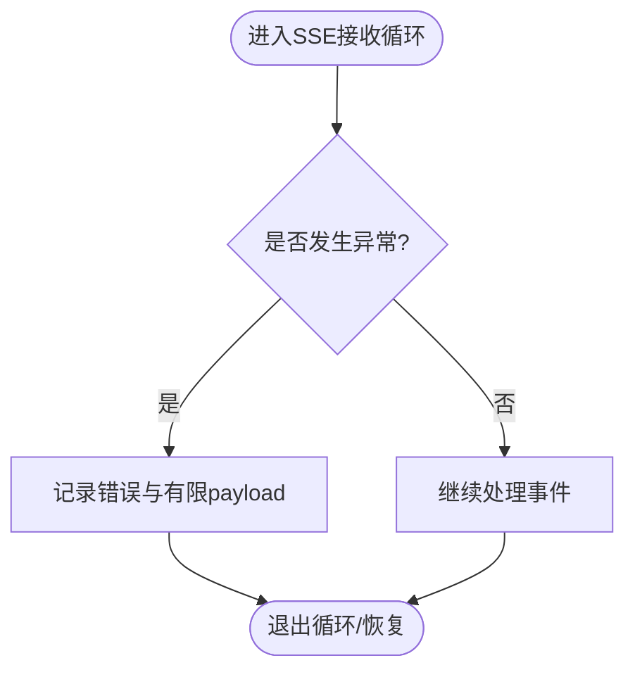

# 调试工具与日志分析

<cite>
**本文引用的文件**
- [desktop/electron/src/main.ts](file://desktop/electron/src/main.ts)
- [desktop/electron/src/backend-manager.ts](file://desktop/electron/src/backend-manager.ts)
- [desktop/electron/src/backend-watchdog.ts](file://desktop/electron/src/backend-watchdog.ts)
- [agent/api_server.py](file://agent/api_server.py)
- [agent/src/channels/signal.py](file://agent/src/channels/signal.py)
- [agent/src/agent/loop.py](file://agent/src/agent/loop.py)
- [desktop/electron/package.json](file://desktop/electron/package.json)
</cite>

## 目录
1. [简介](#简介)
2. [项目结构](#项目结构)
3. [核心组件](#核心组件)
4. [架构总览](#架构总览)
5. [详细组件分析](#详细组件分析)
6. [依赖关系分析](#依赖关系分析)
7. [性能考虑](#性能考虑)
8. [故障排查指南](#故障排查指南)
9. [结论](#结论)
10. [附录](#附录)

## 简介
本指南面向 Vibe-Trading 桌面端（Electron）与后端（Python FastAPI）的调试与日志分析，覆盖以下主题：
- Electron 主进程与渲染进程调试方法
- Chrome DevTools 高级功能在桌面端的启用与使用
- 日志级别、日志收集策略（开发/测试/生产）
- 错误堆栈分析技巧（JavaScript、原生模块、异步异常）
- 性能分析（内存快照、CPU 火焰图、网络请求）
- 远程调试（Docker、远程服务器、移动端场景）
- 实战案例（死锁检测、内存泄漏定位、性能瓶颈分析）

## 项目结构
本项目包含两个关键子系统：
- 桌面端（Electron）：负责启动、生命周期管理、子进程守护、日志落盘、菜单与 DevTools 开关。
- 后端（Python FastAPI）：提供 REST/SSE API，承载业务逻辑，支持 Uvicorn 运行与访问日志脱敏。



图表来源
- [desktop/electron/src/main.ts:65-117](file://desktop/electron/src/main.ts#L65-L117)
- [desktop/electron/src/backend-manager.ts:63-146](file://desktop/electron/src/backend-manager.ts#L63-L146)
- [desktop/electron/src/backend-watchdog.ts:31-68](file://desktop/electron/src/backend-watchdog.ts#L31-L68)
- [agent/api_server.py:321-395](file://agent/api_server.py#L321-L395)

章节来源
- [desktop/electron/src/main.ts:65-117](file://desktop/electron/src/main.ts#L65-L117)
- [desktop/electron/src/backend-manager.ts:63-146](file://desktop/electron/src/backend-manager.ts#L63-L146)
- [desktop/electron/src/backend-watchdog.ts:31-68](file://desktop/electron/src/backend-watchdog.ts#L31-L68)
- [agent/api_server.py:321-395](file://agent/api_server.py#L321-L395)

## 核心组件
- Electron 主进程：创建窗口、注册 IPC、控制菜单、打开日志目录、处理未捕获异常。
- 后端管理器：解析并启动 Python 后端，分配端口，健康检查，日志采集与轮转。
- 守护进程：隔离后端进程生命周期，监控父进程存活，统一终止树。
- Python 后端：FastAPI 应用装配、CORS、安全头、SPA 静态资源、Uvicorn 运行、访问日志脱敏。

章节来源
- [desktop/electron/src/main.ts:22-63](file://desktop/electron/src/main.ts#L22-L63)
- [desktop/electron/src/backend-manager.ts:52-146](file://desktop/electron/src/backend-manager.ts#L52-L146)
- [desktop/electron/src/backend-watchdog.ts:7-68](file://desktop/electron/src/backend-watchdog.ts#L7-L68)
- [agent/api_server.py:156-185](file://agent/api_server.py#L156-L185)

## 架构总览
下图展示了从 Electron 启动到后端就绪的完整流程，包括健康检查、日志写入与错误上报。



图表来源
- [desktop/electron/src/backend-manager.ts:63-146](file://desktop/electron/src/backend-manager.ts#L63-L146)
- [desktop/electron/src/backend-watchdog.ts:31-68](file://desktop/electron/src/backend-watchdog.ts#L31-L68)
- [agent/api_server.py:321-395](file://agent/api_server.py#L321-L395)

## 详细组件分析

### Electron 主进程调试与日志
- 启用/关闭 DevTools：在非打包模式下自动启用开发者工具；可通过菜单“查看”切换。
- 日志目录：通过菜单或 IPC 命令打开系统日志目录，便于导出与分析。
- 未捕获异常：全局捕获未处理异常并弹窗提示，便于快速定位崩溃点。
- 安全与导航：限制外部链接打开协议，仅允许 http/https；对本地后端请求注入鉴权头。



图表来源
- [desktop/electron/src/main.ts:65-117](file://desktop/electron/src/main.ts#L65-L117)
- [desktop/electron/src/main.ts:212-237](file://desktop/electron/src/main.ts#L212-L237)
- [desktop/electron/src/main.ts:282-284](file://desktop/electron/src/main.ts#L282-L284)

章节来源
- [desktop/electron/src/main.ts:65-117](file://desktop/electron/src/main.ts#L65-L117)
- [desktop/electron/src/main.ts:212-237](file://desktop/electron/src/main.ts#L212-L237)
- [desktop/electron/src/main.ts:282-284](file://desktop/electron/src/main.ts#L282-L284)

### 后端管理器与守护进程
- 端口分配：动态寻找空闲端口，避免冲突。
- 健康检查：轮询后端健康接口，超时则抛出明确错误并附带最近日志片段。
- 日志采集：将子进程 stdout/stderr 按时间戳写入每日日志文件，保留最近 N 行用于错误上下文。
- 优雅关闭：先尝试 HTTP 关闭，再向守护进程发送终止指令，必要时强制结束进程树。



图表来源
- [desktop/electron/src/backend-manager.ts:52-146](file://desktop/electron/src/backend-manager.ts#L52-L146)
- [desktop/electron/src/backend-manager.ts:261-304](file://desktop/electron/src/backend-manager.ts#L261-L304)
- [desktop/electron/src/backend-watchdog.ts:31-101](file://desktop/electron/src/backend-watchdog.ts#L31-L101)

章节来源
- [desktop/electron/src/backend-manager.ts:63-146](file://desktop/electron/src/backend-manager.ts#L63-L146)
- [desktop/electron/src/backend-manager.ts:261-304](file://desktop/electron/src/backend-manager.ts#L261-L304)
- [desktop/electron/src/backend-watchdog.ts:31-101](file://desktop/electron/src/backend-watchdog.ts#L31-L101)

### Python 后端服务（FastAPI/Uvicorn）
- 启动入口：命令行参数解析（端口、主机、开发模式），开发模式会拉起 Vite 前端热更新。
- 访问日志脱敏：安装过滤器以隐藏敏感查询参数（如 API key/ticket）。
- 静态资源：生产环境挂载前端构建产物，开发模式由 Vite 提供服务。
- 安全中间件：CORS、安全头、循环地址校验等。

```mermaid
sequenceDiagram
participant CLI as "命令行"
participant App as "FastAPI 应用"
participant Uvi as "Uvicorn"
CLI->>App : serve_main(argv)
App->>Uvi : run(host, port, log_level="info")
Uvi-->>App : 监听HTTP
App->>App : 安装访问日志脱敏过滤器
Note over App,Uvi : 生产时挂载前端静态目录; 开发时启动Vite
```

图表来源
- [agent/api_server.py:321-395](file://agent/api_server.py#L321-L395)

章节来源
- [agent/api_server.py:321-395](file://agent/api_server.py#L321-L395)

### 错误与异常追踪
- SSE 接收循环异常：捕获并记录异常，附带有限 payload 以便复现。
- Agent 循环失败路径：记录失败原因、迭代次数、回溯信息，便于定位问题阶段。
- 桌面端未捕获异常：弹窗展示堆栈，辅助快速定位。



图表来源
- [agent/src/channels/signal.py:644-673](file://agent/src/channels/signal.py#L644-L673)
- [agent/src/agent/loop.py:1273-1303](file://agent/src/agent/loop.py#L1273-L1303)
- [desktop/electron/src/main.ts:282-284](file://desktop/electron/src/main.ts#L282-L284)

章节来源
- [agent/src/channels/signal.py:644-673](file://agent/src/channels/signal.py#L644-L673)
- [agent/src/agent/loop.py:1273-1303](file://agent/src/agent/loop.py#L1273-L1303)
- [desktop/electron/src/main.ts:282-284](file://desktop/electron/src/main.ts#L282-L284)

## 依赖关系分析
- 主进程依赖后端管理器进行后端生命周期管理。
- 后端管理器依赖守护进程隔离后端进程，并通过 IPC 通信。
- 后端服务依赖 FastAPI/Uvicorn 及安全中间件。
- 前端通过浏览器加载后端 URL，受 CSP 与安全头保护。


图表来源
- [desktop/electron/src/main.ts:65-117](file://desktop/electron/src/main.ts#L65-L117)
- [desktop/electron/src/backend-manager.ts:63-146](file://desktop/electron/src/backend-manager.ts#L63-L146)
- [desktop/electron/src/backend-watchdog.ts:31-68](file://desktop/electron/src/backend-watchdog.ts#L31-L68)
- [agent/api_server.py:185-303](file://agent/api_server.py#L185-L303)

章节来源
- [desktop/electron/src/main.ts:65-117](file://desktop/electron/src/main.ts#L65-L117)
- [desktop/electron/src/backend-manager.ts:63-146](file://desktop/electron/src/backend-manager.ts#L63-L146)
- [desktop/electron/src/backend-watchdog.ts:31-68](file://desktop/electron/src/backend-watchdog.ts#L31-L68)
- [agent/api_server.py:185-303](file://agent/api_server.py#L185-L303)

## 性能考虑
- 健康检查与超时：后端管理器设置合理超时，避免长时间阻塞启动流程。
- 日志 I/O：日志按日滚动，限制最近输出行数，减少内存占用与磁盘压力。
- 进程树清理：守护进程确保在异常退出时清理子进程树，防止僵尸进程影响性能。
- 访问日志脱敏：在生产环境中减少敏感数据带来的额外开销与安全风险。

[本节为通用性能建议，不直接分析具体文件]

## 故障排查指南
- 启动失败
  - 检查后端健康接口是否可达，确认端口未被占用。
  - 查看桌面端日志目录中的当日日志，关注“WATCHDOG”和“SHUTDOWN”相关条目。
- 后端意外退出
  - 查看守护进程消息与退出码/信号，结合最近日志片段定位崩溃点。
  - 若为 Python 侧异常，检查 SSE 接收循环与 Agent 循环的错误日志。
- 权限与安全
  - 确认本地请求已注入鉴权头；外部链接仅允许 http/https。
- 日志收集
  - 通过菜单“打开日志”快速定位日志目录；打包后日志位于系统日志目录。

章节来源
- [desktop/electron/src/backend-manager.ts:261-304](file://desktop/electron/src/backend-manager.ts#L261-L304)
- [desktop/electron/src/backend-watchdog.ts:63-101](file://desktop/electron/src/backend-watchdog.ts#L63-L101)
- [agent/src/channels/signal.py:644-673](file://agent/src/channels/signal.py#L644-L673)
- [agent/src/agent/loop.py:1273-1303](file://agent/src/agent/loop.py#L1273-L1303)

## 结论
本指南基于代码库中的实际实现，提供了 Electron 与 Python 后端的调试与日志分析方法。通过主进程菜单、IPC 命令、健康检查与日志落盘，可以快速定位启动、运行与异常问题。结合访问日志脱敏与进程树管理，保障开发与生产环境的稳定性与安全性。

[本节为总结性内容，不直接分析具体文件]

## 附录

### 调试清单与最佳实践
- 开发环境
  - 启用 DevTools：非打包模式默认开启，或通过菜单切换。
  - 启动后端：命令行指定端口与主机，开发模式自动拉起 Vite。
  - 日志级别：Uvicorn 默认 info，可根据需要调整。
- 测试环境
  - 使用守护进程隔离后端，确保每次测试独立进程。
  - 健康检查失败时立即中断，避免后续用例误判。
- 生产环境
  - 禁用 DevTools，严格 CSP 与安全头。
  - 访问日志脱敏，定期归档日志文件。
  - 监控进程树与退出码，及时告警。

章节来源
- [desktop/electron/src/main.ts:212-237](file://desktop/electron/src/main.ts#L212-L237)
- [agent/api_server.py:321-395](file://agent/api_server.py#L321-L395)
- [desktop/electron/package.json:9-23](file://desktop/electron/package.json#L9-L23)

### 常见调试场景实战
- 死锁检测
  - 观察健康检查是否超时；检查守护进程是否持续收到后端退出消息。
  - 抓取最近日志片段，定位卡住的异步任务或锁竞争。
- 内存泄漏定位
  - 使用 Chrome DevTools 内存快照对比前后差异，关注长生命周期对象。
  - 检查日志中是否有大量重复错误或未释放资源。
- 性能瓶颈分析
  - 使用 CPU 火焰图分析热点函数；网络面板检查慢请求。
  - 后端侧关注 Uvicorn 访问日志与中间件耗时。

[本节为概念性指导，不直接分析具体文件]