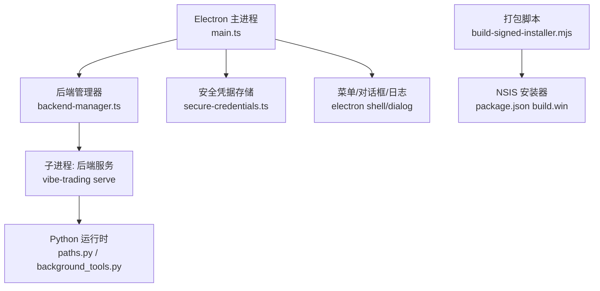
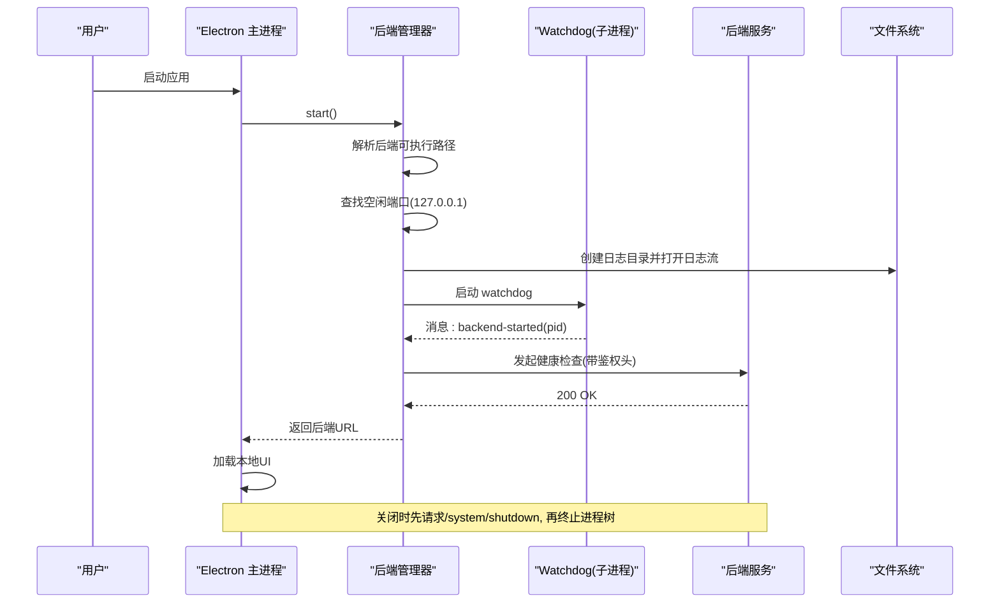
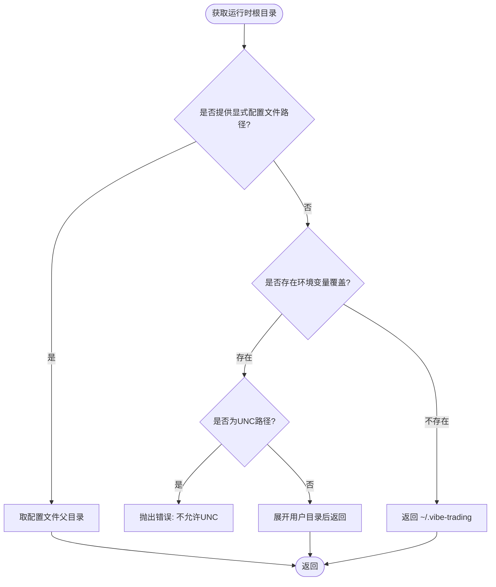
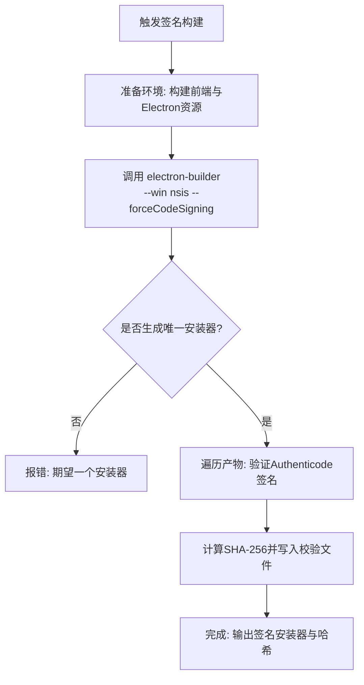
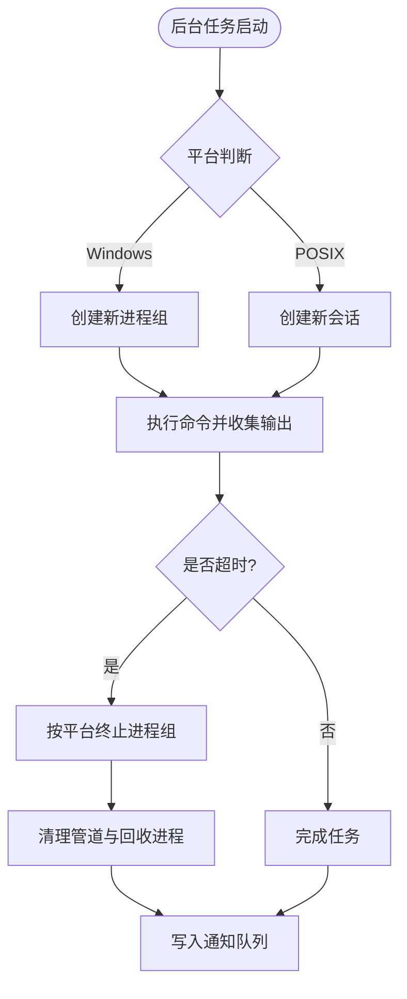
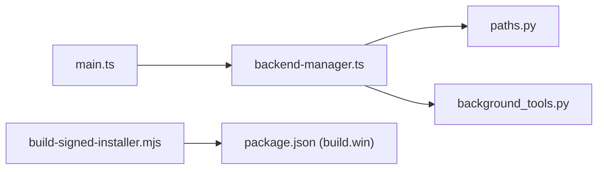

# 跨平台兼容性处理

<cite>
**本文引用的文件**
- [desktop/electron/package.json](file://desktop/electron/package.json)
- [desktop/electron/README.md](file://desktop/electron/README.md)
- [desktop/electron/WINDOWS_PACKAGING.md](file://desktop/electron/WINDOWS_PACKAGING.md)
- [desktop/electron/src/main.ts](file://desktop/electron/src/main.ts)
- [desktop/electron/src/backend-manager.ts](file://desktop/electron/src/backend-manager.ts)
- [agent/src/config/paths.py](file://agent/src/config/paths.py)
- [agent/src/tools/background_tools.py](file://agent/src/tools/background_tools.py)
- [desktop/electron/scripts/build-signed-installer.mjs](file://desktop/electron/scripts/build-signed-installer.mjs)
</cite>

## 目录
1. [简介](#简介)
2. [项目结构](#项目结构)
3. [核心组件](#核心组件)
4. [架构总览](#架构总览)
5. [详细组件分析](#详细组件分析)
6. [依赖关系分析](#依赖关系分析)
7. [性能与资源考量](#性能与资源考量)
8. [故障排查指南](#故障排查指南)
9. [结论](#结论)
10. [附录：平台差异对照与最佳实践清单](#附录平台差异对照与最佳实践清单)

## 简介
本指南聚焦于 Vibe-Trading 桌面端与后端在 Windows、macOS、Linux 上的跨平台兼容性问题，覆盖文件系统路径处理、系统 API 调用适配（对话框、文件选择、剪贴板、通知等）、打包分发（签名验证、安装程序生成、自动更新策略）以及调试与测试方法。文档基于仓库中 Electron 宿主、后端进程管理、Python 运行时路径与工具实现进行梳理，并提供可操作的流程图与时序图以辅助理解。

## 项目结构
本项目采用“前端 + 后端服务 + Electron 桌面壳”的分层架构：
- Electron 主进程负责单实例、本地后端生命周期管理、日志与菜单、安全凭据存储、国际化与加载页。
- 后端通过子进程启动并监听本地回环地址，提供健康检查与受控关闭接口。
- Python 侧提供配置路径解析、会话/运行数据目录、后台任务执行与终止等能力。
- 构建脚本负责 Windows 签名安装程序生成与校验。

图表来源
- [desktop/electron/src/main.ts:1-285](file://desktop/electron/src/main.ts#L1-L285)
- [desktop/electron/src/backend-manager.ts:1-426](file://desktop/electron/src/backend-manager.ts#L1-L426)
- [agent/src/config/paths.py:1-113](file://agent/src/config/paths.py#L1-L113)
- [agent/src/tools/background_tools.py:1-377](file://agent/src/tools/background_tools.py#L1-L377)
- [desktop/electron/scripts/build-signed-installer.mjs:1-154](file://desktop/electron/scripts/build-signed-installer.mjs#L1-L154)
- [desktop/electron/package.json:33-87](file://desktop/electron/package.json#L33-L87)

章节来源
- [desktop/electron/README.md:1-93](file://desktop/electron/README.md#L1-L93)
- [desktop/electron/package.json:1-86](file://desktop/electron/package.json#L1-L86)

## 核心组件
- Electron 主进程：单实例锁、窗口创建、IPC、菜单、日志目录、本地化、外部链接打开、权限拦截、关闭流程。
- 后端管理器：发现并启动后端、健康检查、日志采集、优雅关闭、进程树终止（Windows taskkill / POSIX kill）。
- 路径与数据目录：用户级运行时根目录、会话/运行/上传目录、工作区目录；支持环境变量覆盖与 UNC 路径限制。
- 后台任务：跨平台进程组管理、超时与取消、输出截断、通知队列。
- 打包与签名：Windows NSIS 安装器、Authenticode 签名校验、哈希生成、压缩级别控制。

章节来源
- [desktop/electron/src/main.ts:1-285](file://desktop/electron/src/main.ts#L1-L285)
- [desktop/electron/src/backend-manager.ts:1-426](file://desktop/electron/src/backend-manager.ts#L1-L426)
- [agent/src/config/paths.py:1-113](file://agent/src/config/paths.py#L1-L113)
- [agent/src/tools/background_tools.py:1-377](file://agent/src/tools/background_tools.py#L1-L377)
- [desktop/electron/scripts/build-signed-installer.mjs:1-154](file://desktop/electron/scripts/build-signed-installer.mjs#L1-L154)
- [desktop/electron/package.json:33-87](file://desktop/electron/package.json#L33-L87)

## 架构总览
下图展示了从 Electron 启动到后端就绪的完整时序，包括端口分配、健康检查、日志写入与错误上报。

图表来源
- [desktop/electron/src/backend-manager.ts:63-146](file://desktop/electron/src/backend-manager.ts#L63-L146)
- [desktop/electron/src/main.ts:159-192](file://desktop/electron/src/main.ts#L159-L192)

章节来源
- [desktop/electron/src/backend-manager.ts:63-146](file://desktop/electron/src/backend-manager.ts#L63-L146)
- [desktop/electron/src/main.ts:159-192](file://desktop/electron/src/main.ts#L159-L192)

## 详细组件分析

### 文件系统路径与大小写敏感性
- 运行时根目录：优先使用显式配置文件的父目录，其次读取环境变量覆盖，最后回退到用户家目录下的默认路径；禁止 UNC 路径作为环境变量值。
- 数据目录：会话、运行、上传与工作区均位于运行时根目录下，按需创建。
- 大小写敏感：不同操作系统对路径大小写敏感度不同，建议统一使用小写标识符或规范化路径进行比较；避免依赖大小写区分来保证安全性。
- 特殊字符与转义：路径拼接应使用标准库函数，避免手动拼接；对用户输入进行白名单与边界检查，防止路径穿越。

图表来源
- [agent/src/config/paths.py:13-34](file://agent/src/config/paths.py#L13-L34)

章节来源
- [agent/src/config/paths.py:13-34](file://agent/src/config/paths.py#L13-L34)
- [agent/src/config/paths.py:37-113](file://agent/src/config/paths.py#L37-L113)

### 系统 API 调用的平台适配
- 对话框与菜单：Electron 主进程使用原生对话框与菜单项，结合本地化文案；开发模式下启用开发者工具。
- 文件选择/打开：通过 shell.openPath/openExternal 打开系统默认位置或外部 URL；严格校验协议（仅允许 http/https）。
- 剪贴板/通知：当前代码未直接操作剪贴板或系统通知；如需扩展，应在主进程中调用对应模块并按平台差异化处理。
- 进程与信号：Windows 使用 taskkill 终止进程树；POSIX 使用进程组信号 SIGTERM/SIGKILL；后台任务工具封装了跨平台终止逻辑。

章节来源
- [desktop/electron/src/main.ts:107-116](file://desktop/electron/src/main.ts#L107-L116)
- [desktop/electron/src/main.ts:212-237](file://desktop/electron/src/main.ts#L212-L237)
- [desktop/electron/src/backend-manager.ts:520-537](file://desktop/electron/src/backend-manager.ts#L520-L537)
- [agent/src/tools/background_tools.py:35-95](file://agent/src/tools/background_tools.py#L35-L95)

### 打包与分发：签名、安装程序与更新
- Windows 安装程序：使用 NSIS 目标，支持自定义安装目录、桌面与开始菜单快捷方式；产物命名包含版本与架构。
- 签名验证：构建脚本要求证书与密码环境变量，强制开启签名并验证安装包与应用可执行文件的 Authenticode 状态；失败则中止。
- 压缩与依赖：构建阶段设置压缩级别；Python 依赖通过锁定文件安装，确保可重复构建。
- 自动更新：当前桌面壳不包含更新检查或发布源配置；如需集成，应在主进程增加更新检测与下载流程，并在各平台遵循其更新机制（如 Windows 的 AppX/MSI 更新通道或自研方案）。

图表来源
- [desktop/electron/scripts/build-signed-installer.mjs:21-79](file://desktop/electron/scripts/build-signed-installer.mjs#L21-L79)
- [desktop/electron/package.json:69-86](file://desktop/electron/package.json#L69-L86)

章节来源
- [desktop/electron/WINDOWS_PACKAGING.md:23-117](file://desktop/electron/WINDOWS_PACKAGING.md#L23-L117)
- [desktop/electron/scripts/build-signed-installer.mjs:1-154](file://desktop/electron/scripts/build-signed-installer.mjs#L1-L154)
- [desktop/electron/package.json:33-87](file://desktop/electron/package.json#L33-L87)

### 后台任务与进程组管理（跨平台）
- 启动：Windows 使用新进程组标志；POSIX 使用新会话。
- 终止：Windows 调用 taskkill /T /F；POSIX 向进程组发送 SIGTERM，必要时升级为 SIGKILL。
- 超时与取消：统一超时时间，取消请求会标记并触发强制终止；输出被截断以避免过大响应。
- 通知：维护通知队列供上层查询任务状态。

图表来源
- [agent/src/tools/background_tools.py:24-95](file://agent/src/tools/background_tools.py#L24-L95)
- [agent/src/tools/background_tools.py:141-205](file://agent/src/tools/background_tools.py#L141-L205)

章节来源
- [agent/src/tools/background_tools.py:24-95](file://agent/src/tools/background_tools.py#L24-L95)
- [agent/src/tools/background_tools.py:141-205](file://agent/src/tools/background_tools.py#L141-L205)

## 依赖关系分析
- Electron 主进程依赖后端管理器、本地化与凭据存储；后端管理器依赖 Node 子进程与网络健康检查；Python 侧提供路径与后台任务能力。
- 构建脚本依赖 electron-builder 与 PowerShell 签名工具；安装器目标由 package.json 指定。

图表来源
- [desktop/electron/src/main.ts:1-285](file://desktop/electron/src/main.ts#L1-L285)
- [desktop/electron/src/backend-manager.ts:1-426](file://desktop/electron/src/backend-manager.ts#L1-L426)
- [agent/src/config/paths.py:1-113](file://agent/src/config/paths.py#L1-L113)
- [agent/src/tools/background_tools.py:1-377](file://agent/src/tools/background_tools.py#L1-L377)
- [desktop/electron/scripts/build-signed-installer.mjs:1-154](file://desktop/electron/scripts/build-signed-installer.mjs#L1-L154)
- [desktop/electron/package.json:33-87](file://desktop/electron/package.json#L33-L87)

章节来源
- [desktop/electron/package.json:33-87](file://desktop/electron/package.json#L33-L87)

## 性能与资源考量
- 日志写入：每日滚动日志文件，限制最近输出缓存，避免内存增长。
- 健康检查：轮询间隔短、超时合理，避免阻塞 UI。
- 进程终止：Windows 使用 taskkill 快速终止进程树；POSIX 使用进程组信号减少孤儿进程。
- 构建压缩：设置压缩级别以平衡构建时间与包体大小。

[本节为通用指导，不直接分析具体文件]

## 故障排查指南
- 后端启动失败：检查健康检查超时与最近日志尾部；确认端口未被占用且防火墙允许本地回环访问。
- 凭据存储不可用：确认 Electron safeStorage 初始化成功；检查用户数据目录权限。
- 安装程序签名失败：确认证书与密码环境变量已正确设置；验证 PowerShell 可加载签名模块；查看生成的哈希文件。
- 后台任务卡死：使用取消接口强制终止；观察输出与退出码；必要时重启应用。

章节来源
- [desktop/electron/src/backend-manager.ts:261-286](file://desktop/electron/src/backend-manager.ts#L261-L286)
- [desktop/electron/src/main.ts:206-210](file://desktop/electron/src/main.ts#L206-L210)
- [desktop/electron/scripts/build-signed-installer.mjs:93-121](file://desktop/electron/scripts/build-signed-installer.mjs#L93-L121)
- [agent/src/tools/background_tools.py:206-256](file://agent/src/tools/background_tools.py#L206-L256)

## 结论
本项目在 Electron 层实现了稳健的后端生命周期管理与安全凭据隔离，Python 侧提供了跨平台的进程组管理与路径解析能力。Windows 打包流程具备严格的签名与校验机制。建议在后续迭代中补充自动更新能力，并持续完善跨平台的路径与系统 API 适配，同时加强自动化测试覆盖。

[本节为总结性内容，不直接分析具体文件]

## 附录：平台差异对照与最佳实践清单
- 路径处理
  - 使用标准库进行路径拼接与规范化；避免硬编码分隔符。
  - 对用户输入进行白名单校验与边界检查，防止路径穿越。
  - 注意大小写敏感性：比较路径前统一小写或使用平台无关的比较方法。
- 系统 API
  - 对话框与菜单：在主进程调用，保持 UI 与业务解耦。
  - 进程管理：Windows 使用 taskkill；POSIX 使用进程组信号。
  - 外部链接：仅允许 http/https；其他协议拒绝或交由系统处理。
- 打包与分发
  - Windows：使用 NSIS 安装器，强制签名与校验；生成哈希文件。
  - 更新机制：当前未内置；如需集成，需在各平台遵循其更新策略。
- 调试与测试
  - 日志：查看 Electron 日志目录与后端健康检查响应。
  - 单元测试：覆盖路径解析、后台任务终止、签名构建流程。
  - 端到端：模拟后端异常退出、端口占用、权限不足等场景。

[本节为通用指导，不直接分析具体文件]