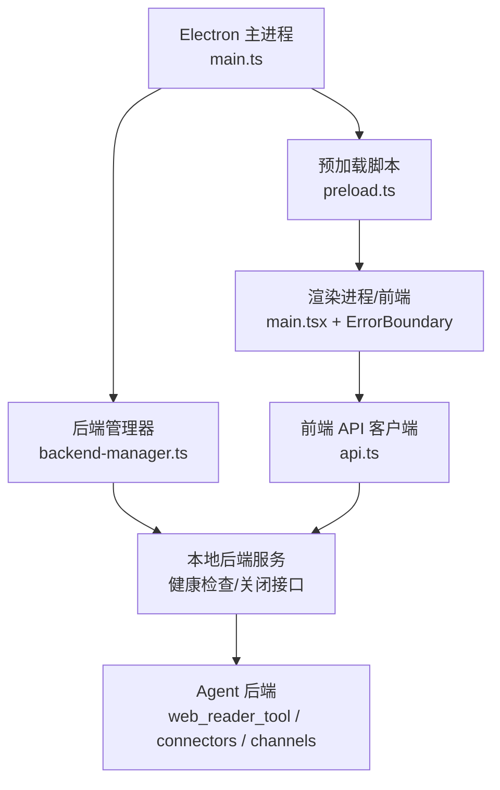
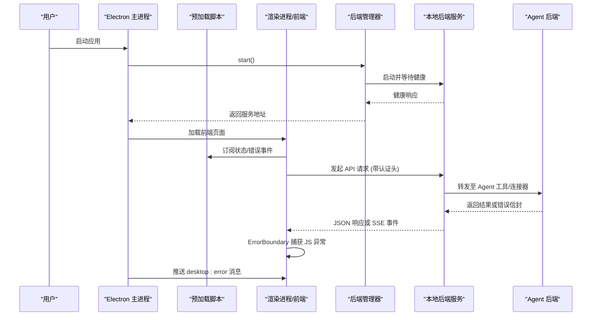
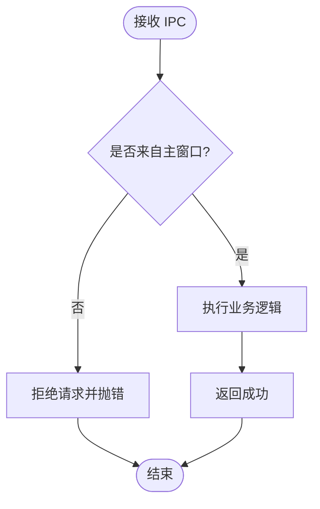
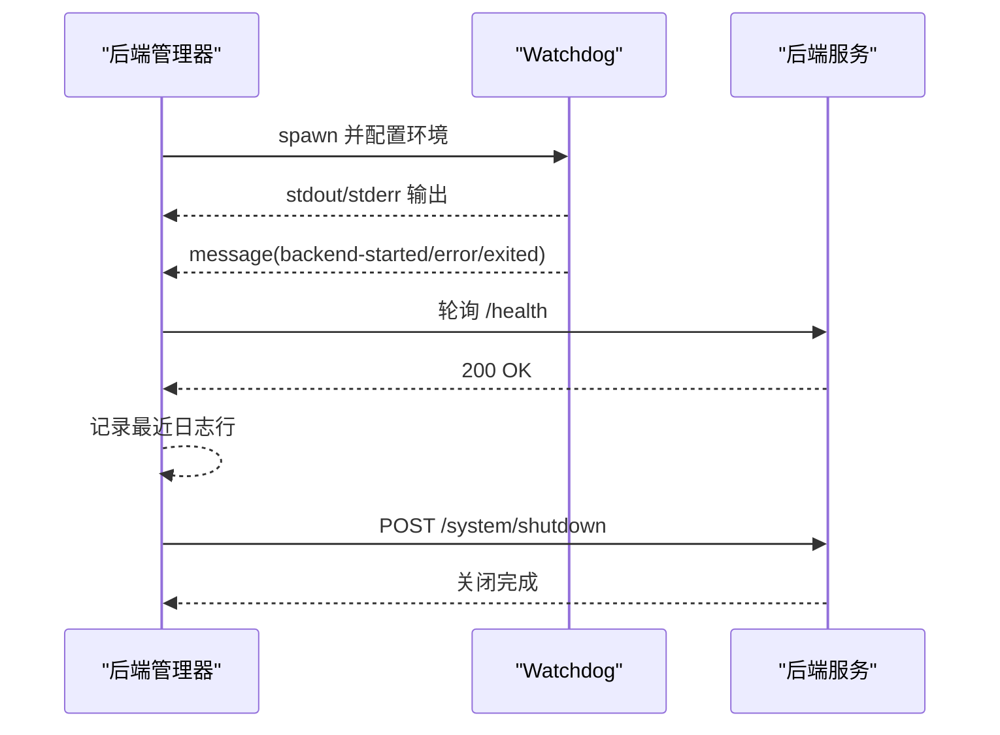
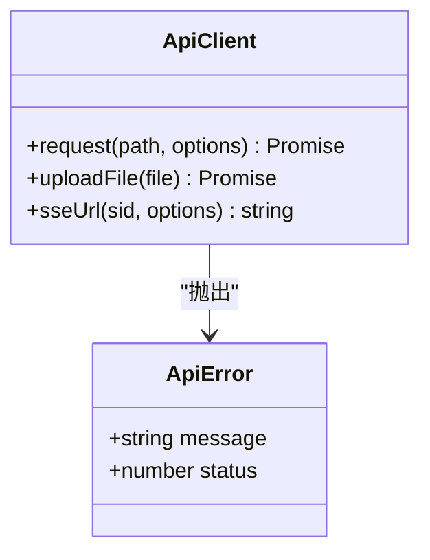
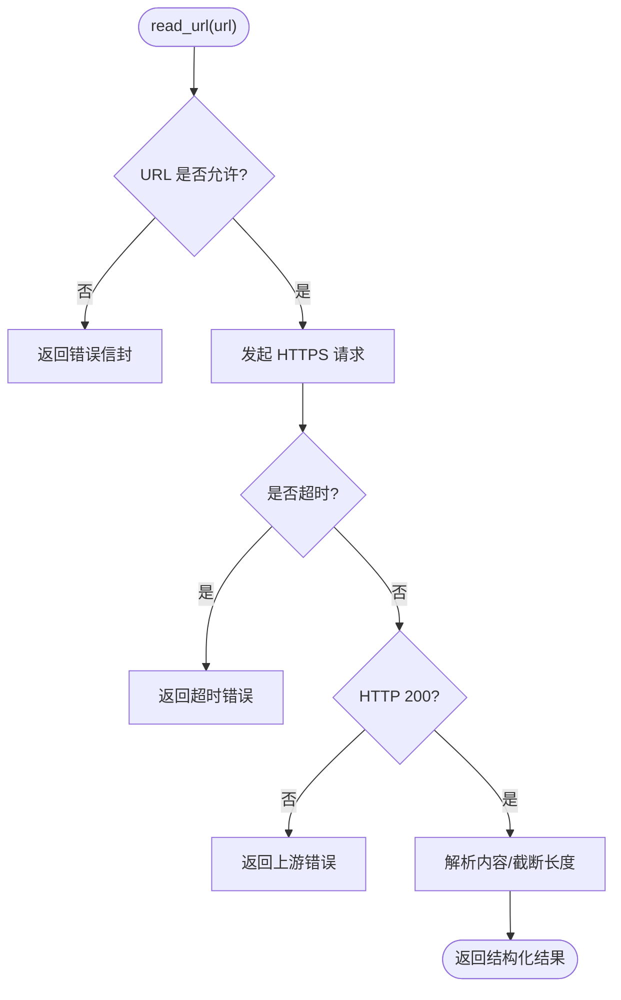
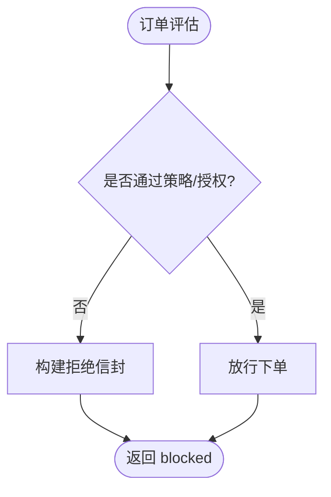
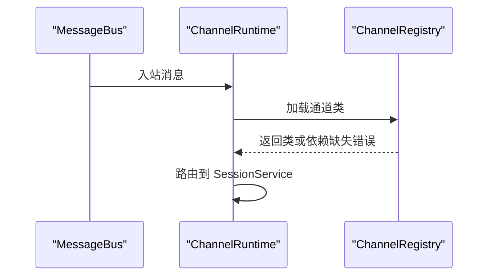
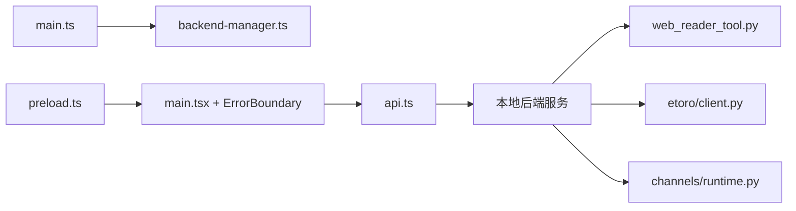

# 运行时错误排查

<cite>
**本文引用的文件**
- [desktop/electron/src/main.ts](file://desktop/electron/src/main.ts)
- [desktop/electron/src/preload.ts](file://desktop/electron/src/preload.ts)
- [desktop/electron/src/backend-manager.ts](file://desktop/electron/src/backend-manager.ts)
- [frontend/src/main.tsx](file://frontend/src/main.tsx)
- [frontend/src/components/common/ErrorBoundary.tsx](file://frontend/src/components/common/ErrorBoundary.tsx)
- [frontend/src/lib/api.ts](file://frontend/src/lib/api.ts)
- [agent/src/tools/web_reader_tool.py](file://agent/src/tools/web_reader_tool.py)
- [agent/backtest/loaders/ccxt_loader.py](file://agent/backtest/loaders/ccxt_loader.py)
- [agent/src/trading/connectors/etoro/client.py](file://agent/src/trading/connectors/etoro/client.py)
- [agent/src/live/order_guard.py](file://agent/src/live/order_guard.py)
- [agent/src/channels/runtime.py](file://agent/src/channels/runtime.py)
- [agent/src/channels/registry.py](file://agent/src/channels/registry.py)
- [agent/cli/commands/chat.py](file://agent/cli/commands/chat.py)
- [agent/tests/test_web_reader_privacy.py](file://agent/tests/test_web_reader_privacy.py)
- [agent/tests/test_sina_loader.py](file://agent/tests/test_sina_loader.py)
- [agent/tests/test_market_screener_tool.py](file://agent/tests/test_market_screener_tool.py)
</cite>

## 目录
1. [简介](#简介)
2. [项目结构](#项目结构)
3. [核心组件](#核心组件)
4. [架构总览](#架构总览)
5. [详细组件分析](#详细组件分析)
6. [依赖关系分析](#依赖关系分析)
7. [性能注意事项](#性能注意事项)
8. [故障排查指南](#故障排查指南)
9. [结论](#结论)
10. [附录](#附录)

## 简介
本指南面向运行时的崩溃与异常排查，覆盖以下关键场景：
- 内存溢出检测与缓解
- JavaScript 异常处理与前端错误边界
- C++/Python 原生模块错误定位（通过 Electron 主进程与后端守护）
- IPC 通信异常（主进程与渲染进程、消息格式、权限验证）
- 网络请求失败（HTTPS 证书、代理、防火墙、超时与限流）
- 前端页面加载失败（资源缺失、跨域限制、安全策略）
- 错误堆栈分析技巧（JS 堆栈、原生模块、异步异常）
- 性能监控工具与瓶颈识别方法

## 项目结构
本项目由三大部分组成：
- Electron 桌面端：负责启动本地后端服务、管理日志、提供 IPC 桥接与安全策略
- 前端 React 应用：负责 UI、路由、错误边界、API 调用封装
- Agent 后端（Python）：提供业务逻辑、数据加载、交易连接器、工具链等

**图表来源**
- [desktop/electron/src/main.ts:65-117](file://desktop/electron/src/main.ts#L65-L117)
- [desktop/electron/src/backend-manager.ts:63-146](file://desktop/electron/src/backend-manager.ts#L63-L146)
- [desktop/electron/src/preload.ts:3-17](file://desktop/electron/src/preload.ts#L3-L17)
- [frontend/src/main.tsx:28-35](file://frontend/src/main.tsx#L28-L35)
- [frontend/src/lib/api.ts:321-349](file://frontend/src/lib/api.ts#L321-L349)

**章节来源**
- [desktop/electron/src/main.ts:1-285](file://desktop/electron/src/main.ts#L1-L285)
- [desktop/electron/src/backend-manager.ts:1-426](file://desktop/electron/src/backend-manager.ts#L1-L426)
- [desktop/electron/src/preload.ts:1-18](file://desktop/electron/src/preload.ts#L1-L18)
- [frontend/src/main.tsx:1-36](file://frontend/src/main.tsx#L1-L36)
- [frontend/src/lib/api.ts:1-200](file://frontend/src/lib/api.ts#L1-L200)

## 核心组件
- Electron 主进程：窗口创建、IPC 注册、安全头注入、启动/停止后端、错误上报
- 后端管理器：解析可执行文件、启动子进程、健康检查、日志捕获、优雅关闭
- 预加载脚本：暴露受限 API 到渲染进程，屏蔽直接 Node 访问
- 前端入口与错误边界：React 根节点挂载、全局错误边界兜底
- 前端 API 客户端：统一请求封装、认证头注入、错误转换、SSE URL 生成
- Agent 工具与连接器：网络请求、重试与超时、错误信封、订单守卫拒绝

**章节来源**
- [desktop/electron/src/main.ts:119-146](file://desktop/electron/src/main.ts#L119-L146)
- [desktop/electron/src/backend-manager.ts:63-146](file://desktop/electron/src/backend-manager.ts#L63-L146)
- [desktop/electron/src/preload.ts:3-17](file://desktop/electron/src/preload.ts#L3-L17)
- [frontend/src/main.tsx:28-35](file://frontend/src/main.tsx#L28-L35)
- [frontend/src/components/common/ErrorBoundary.tsx:8-26](file://frontend/src/components/common/ErrorBoundary.tsx#L8-L26)
- [frontend/src/lib/api.ts:321-349](file://frontend/src/lib/api.ts#L321-L349)
- [agent/src/tools/web_reader_tool.py:61-131](file://agent/src/tools/web_reader_tool.py#L61-L131)
- [agent/src/trading/connectors/etoro/client.py:303-331](file://agent/src/trading/connectors/etoro/client.py#L303-L331)
- [agent/src/live/order_guard.py:577-616](file://agent/src/live/order_guard.py#L577-L616)

## 架构总览
下图展示从 Electron 启动到前端交互的完整链路，以及错误在何处被捕获与上报。

**图表来源**
- [desktop/electron/src/main.ts:159-192](file://desktop/electron/src/main.ts#L159-L192)
- [desktop/electron/src/backend-manager.ts:63-146](file://desktop/electron/src/backend-manager.ts#L63-L146)
- [desktop/electron/src/preload.ts:3-17](file://desktop/electron/src/preload.ts#L3-L17)
- [frontend/src/main.tsx:28-35](file://frontend/src/main.tsx#L28-L35)
- [frontend/src/lib/api.ts:321-349](file://frontend/src/lib/api.ts#L321-L349)

## 详细组件分析

### Electron 主进程与 IPC 安全
- 窗口安全策略：禁用 Node 集成、启用沙箱、仅允许安全外部链接打开
- 请求头注入：对本地后端源自动附加 Authorization 头，避免跨源泄露
- IPC 白名单：仅接受来自主窗口的请求，防止恶意渲染进程滥用
- 错误上报：启动失败或后端意外退出时，向渲染进程发送错误消息

**图表来源**
- [desktop/electron/src/main.ts:119-146](file://desktop/electron/src/main.ts#L119-L146)
- [desktop/electron/src/main.ts:240-247](file://desktop/electron/src/main.ts#L240-L247)

**章节来源**
- [desktop/electron/src/main.ts:65-117](file://desktop/electron/src/main.ts#L65-L117)
- [desktop/electron/src/main.ts:119-146](file://desktop/electron/src/main.ts#L119-L146)
- [desktop/electron/src/main.ts:240-247](file://desktop/electron/src/main.ts#L240-L247)

### 后端管理器与生命周期
- 启动流程：解析可执行路径、选择端口、设置环境变量、启动 watchdog、写入日志
- 健康检查：轮询 health 接口，超时则抛出明确错误并附带尾部日志
- 优雅关闭：先尝试 HTTP 关闭，再通知 watchdog 终止，最后强制杀死进程树
- 错误处理：watchdog 异常、早期退出、健康超时均会转换为可读错误

**图表来源**
- [desktop/electron/src/backend-manager.ts:63-146](file://desktop/electron/src/backend-manager.ts#L63-L146)
- [desktop/electron/src/backend-manager.ts:148-187](file://desktop/electron/src/backend-manager.ts#L148-L187)
- [desktop/electron/src/backend-manager.ts:261-286](file://desktop/electron/src/backend-manager.ts#L261-L286)

**章节来源**
- [desktop/electron/src/backend-manager.ts:63-146](file://desktop/electron/src/backend-manager.ts#L63-L146)
- [desktop/electron/src/backend-manager.ts:148-187](file://desktop/electron/src/backend-manager.ts#L148-L187)
- [desktop/electron/src/backend-manager.ts:261-286](file://desktop/electron/src/backend-manager.ts#L261-L286)

### 前端错误边界与 API 客户端
- 错误边界：捕获渲染阶段异常，显示友好提示，避免整页崩溃
- API 客户端：统一添加认证头、非 JSON 响应报错、401/403 特殊提示
- SSE 支持：为实时事件流提供 URL 构造，便于前端连接

**图表来源**
- [frontend/src/lib/api.ts:11-19](file://frontend/src/lib/api.ts#L11-L19)
- [frontend/src/lib/api.ts:321-349](file://frontend/src/lib/api.ts#L321-L349)
- [frontend/src/lib/api.ts:492-499](file://frontend/src/lib/api.ts#L492-L499)

**章节来源**
- [frontend/src/components/common/ErrorBoundary.tsx:8-26](file://frontend/src/components/common/ErrorBoundary.tsx#L8-L26)
- [frontend/src/lib/api.ts:321-349](file://frontend/src/lib/api.ts#L321-L349)

### Agent 网络工具与连接器
- Web Reader 工具：URL 白名单校验、超时控制、缓存标记、错误信封
- CCXT 加载器：设置请求超时与预算，避免长时间挂起
- Etoro 连接器：重试与退避、429 处理、网络异常包装

**图表来源**
- [agent/src/tools/web_reader_tool.py:24-58](file://agent/src/tools/web_reader_tool.py#L24-L58)
- [agent/src/tools/web_reader_tool.py:61-131](file://agent/src/tools/web_reader_tool.py#L61-L131)
- [agent/backtest/loaders/ccxt_loader.py:50-78](file://agent/backtest/loaders/ccxt_loader.py#L50-L78)
- [agent/src/trading/connectors/etoro/client.py:303-331](file://agent/src/trading/connectors/etoro/client.py#L303-L331)

**章节来源**
- [agent/src/tools/web_reader_tool.py:61-131](file://agent/src/tools/web_reader_tool.py#L61-L131)
- [agent/backtest/loaders/ccxt_loader.py:50-78](file://agent/backtest/loaders/ccxt_loader.py#L50-L78)
- [agent/src/trading/connectors/etoro/client.py:303-331](file://agent/src/trading/connectors/etoro/client.py#L303-L331)

### 订单守卫与拒绝信封
- 当订单违反策略或授权失效时，返回结构化拒绝信息，包含决策、原因、是否需要重新授权等
- 该信封用于上层工具链与审计记录，避免误下单

**图表来源**
- [agent/src/live/order_guard.py:577-616](file://agent/src/live/order_guard.py#L577-L616)

**章节来源**
- [agent/src/live/order_guard.py:577-616](file://agent/src/live/order_guard.py#L577-L616)

### IM 通道运行时与依赖发现
- 通道运行时将消息总线流量路由到会话服务，支持超时与轮询间隔配置
- 动态导入通道模块时，若缺少可选依赖，返回明确的依赖缺失错误

**图表来源**
- [agent/src/channels/runtime.py:1-46](file://agent/src/channels/runtime.py#L1-L46)
- [agent/src/channels/registry.py:134-159](file://agent/src/channels/registry.py#L134-L159)

**章节来源**
- [agent/src/channels/runtime.py:1-46](file://agent/src/channels/runtime.py#L1-L46)
- [agent/src/channels/registry.py:134-159](file://agent/src/channels/registry.py#L134-L159)

## 依赖关系分析
- Electron 主进程依赖后端管理器以启动本地服务；预加载脚本暴露最小化 API 给渲染进程
- 前端通过 API 客户端与本地后端交互，后端再调用 Agent 工具与连接器
- 网络层在各处均有超时、重试与错误封装，确保失败快速失败与可观测性

**图表来源**
- [desktop/electron/src/main.ts:159-192](file://desktop/electron/src/main.ts#L159-L192)
- [desktop/electron/src/backend-manager.ts:63-146](file://desktop/electron/src/backend-manager.ts#L63-L146)
- [frontend/src/main.tsx:28-35](file://frontend/src/main.tsx#L28-L35)
- [frontend/src/lib/api.ts:321-349](file://frontend/src/lib/api.ts#L321-L349)
- [agent/src/tools/web_reader_tool.py:61-131](file://agent/src/tools/web_reader_tool.py#L61-L131)
- [agent/src/trading/connectors/etoro/client.py:303-331](file://agent/src/trading/connectors/etoro/client.py#L303-L331)
- [agent/src/channels/runtime.py:1-46](file://agent/src/channels/runtime.py#L1-L46)

**章节来源**
- [desktop/electron/src/main.ts:159-192](file://desktop/electron/src/main.ts#L159-L192)
- [desktop/electron/src/backend-manager.ts:63-146](file://desktop/electron/src/backend-manager.ts#L63-L146)
- [frontend/src/lib/api.ts:321-349](file://frontend/src/lib/api.ts#L321-L349)
- [agent/src/tools/web_reader_tool.py:61-131](file://agent/src/tools/web_reader_tool.py#L61-L131)
- [agent/src/trading/connectors/etoro/client.py:303-331](file://agent/src/trading/connectors/etoro/client.py#L303-L331)
- [agent/src/channels/runtime.py:1-46](file://agent/src/channels/runtime.py#L1-L46)

## 性能注意事项
- 网络请求应设置合理超时与预算，避免长时间阻塞（如 CCXT 加载器的超时与预算配置）
- 使用重试与退避策略处理瞬时错误（如 429 限流），但需限制最大重试次数
- 前端资源按需加载与空闲回调预取，减少首屏压力
- 日志与尾部输出有助于快速定位问题，但应避免在生产环境过度打印

[本节为通用指导，不直接分析具体文件]

## 故障排查指南

### 崩溃与内存溢出检测
- Electron 主进程未捕获异常会弹出错误框，便于快速定位
- 后端管理器捕获 watchdog 异常与早期退出，并记录最近日志行
- 建议：
  - 检查系统日志目录中的桌面日志文件
  - 关注健康检查超时与后端意外退出消息
  - 在高负载场景下监控进程内存与 CPU，必要时调整超时与预算

**章节来源**
- [desktop/electron/src/main.ts:282-285](file://desktop/electron/src/main.ts#L282-L285)
- [desktop/electron/src/backend-manager.ts:127-140](file://desktop/electron/src/backend-manager.ts#L127-L140)
- [desktop/electron/src/backend-manager.ts:261-286](file://desktop/electron/src/backend-manager.ts#L261-L286)

### JavaScript 异常处理
- 前端使用错误边界捕获渲染异常，避免整页崩溃
- 建议：
  - 在关键组件外层包裹错误边界
  - 结合浏览器控制台查看堆栈信息
  - 对于异步错误，确保在 catch 中记录上下文

**章节来源**
- [frontend/src/main.tsx:28-35](file://frontend/src/main.tsx#L28-L35)
- [frontend/src/components/common/ErrorBoundary.tsx:8-26](file://frontend/src/components/common/ErrorBoundary.tsx#L8-L26)

### C++/Python 原生模块错误
- Electron 通过 watchdog 启动 Python 后端，异常会通过 stdout/stderr 与 message 通道上报
- 建议：
  - 查看桌面日志中的 WATCHDOG 与后端错误行
  - 检查环境变量与可执行路径是否正确
  - 对依赖缺失进行显式提示（通道模块的动态导入）

**章节来源**
- [desktop/electron/src/backend-manager.ts:124-140](file://desktop/electron/src/backend-manager.ts#L124-L140)
- [agent/src/channels/registry.py:134-159](file://agent/src/channels/registry.py#L134-L159)

### IPC 通信异常
- 主进程仅接受来自主窗口的 IPC 请求，非法来源将被拒绝
- 预加载脚本暴露受限 API，渲染进程通过事件订阅状态与错误
- 建议：
  - 确认 IPC 事件名称与参数类型正确
  - 检查主窗口发送者断言是否通过
  - 在渲染进程中监听 desktop:error 并提示用户

**章节来源**
- [desktop/electron/src/main.ts:119-146](file://desktop/electron/src/main.ts#L119-L146)
- [desktop/electron/src/main.ts:240-247](file://desktop/electron/src/main.ts#L240-L247)
- [desktop/electron/src/preload.ts:3-17](file://desktop/electron/src/preload.ts#L3-L17)

### 网络请求失败
- Web Reader 工具对 URL 进行白名单校验，超时与上游错误均返回结构化错误
- CCXT 加载器设置超时与预算，避免长时间挂起
- Etoro 连接器处理 429 限流与网络异常，并进行重试与退避
- 建议：
  - 检查代理配置与环境变量
  - 确认防火墙与证书无误
  - 观察错误信封中的状态码与详情

**章节来源**
- [agent/src/tools/web_reader_tool.py:24-58](file://agent/src/tools/web_reader_tool.py#L24-L58)
- [agent/src/tools/web_reader_tool.py:61-131](file://agent/src/tools/web_reader_tool.py#L61-L131)
- [agent/backtest/loaders/ccxt_loader.py:50-78](file://agent/backtest/loaders/ccxt_loader.py#L50-L78)
- [agent/src/trading/connectors/etoro/client.py:303-331](file://agent/src/trading/connectors/etoro/client.py#L303-L331)

### 前端页面加载失败
- 资源缺失或跨域限制可能导致加载失败
- 建议：
  - 检查静态资源路径与打包产物
  - 确认 CSP 与安全策略未阻止必要资源
  - 使用浏览器开发者工具查看网络与控制台错误

[本节为通用指导，不直接分析具体文件]

### 错误堆栈分析技巧
- 前端：利用浏览器控制台查看 JS 堆栈，结合错误边界捕获的消息定位
- 后端：查看桌面日志中的 WATCHDOG 与后端错误行，结合最近日志行缩小范围
- 异步操作：关注超时、重试与退避日志，确认是否因限流或网络抖动导致失败

**章节来源**
- [desktop/electron/src/backend-manager.ts:288-304](file://desktop/electron/src/backend-manager.ts#L288-L304)
- [agent/src/tools/web_reader_tool.py:124-131](file://agent/src/tools/web_reader_tool.py#L124-L131)

### 性能监控工具与瓶颈识别
- 使用调试开关输出每轮迭代的耗时与工具调用摘要
- 观察网络请求的超时与重试行为，识别慢接口
- 在前端使用性能面板分析渲染与资源加载

**章节来源**
- [agent/cli/commands/chat.py:183-216](file://agent/cli/commands/chat.py#L183-L216)

## 结论
本指南基于代码库中的实际实现，提供了从 Electron 主进程到前端与 Agent 后端的端到端运行时错误排查方法。通过合理的超时、重试、错误信封与日志记录，能够快速定位并修复崩溃、IPC 异常、网络失败与页面加载问题。建议在开发与生产环境中持续完善错误上报与监控机制，以提升系统的稳定性与可维护性。

[本节为总结，不直接分析具体文件]

## 附录
- 常见错误模式与对应位置参考：
  - 启动失败：Electron 主进程错误上报与后端健康检查超时
  - 后端意外退出：watchdog 异常与早期退出处理
  - 网络超时：Web Reader 与 CCXT 加载器的超时配置
  - 限流处理：Etoro 连接器的 429 重试与退避
  - 依赖缺失：通道模块动态导入的错误提示
  - 订单拒绝：订单守卫的结构化拒绝信封

**章节来源**
- [desktop/electron/src/main.ts:188-210](file://desktop/electron/src/main.ts#L188-L210)
- [desktop/electron/src/backend-manager.ts:127-140](file://desktop/electron/src/backend-manager.ts#L127-L140)
- [agent/src/tools/web_reader_tool.py:124-131](file://agent/src/tools/web_reader_tool.py#L124-L131)
- [agent/backtest/loaders/ccxt_loader.py:50-78](file://agent/backtest/loaders/ccxt_loader.py#L50-L78)
- [agent/src/trading/connectors/etoro/client.py:303-331](file://agent/src/trading/connectors/etoro/client.py#L303-L331)
- [agent/src/channels/registry.py:134-159](file://agent/src/channels/registry.py#L134-L159)
- [agent/src/live/order_guard.py:577-616](file://agent/src/live/order_guard.py#L577-L616)