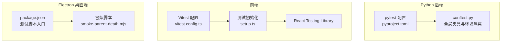
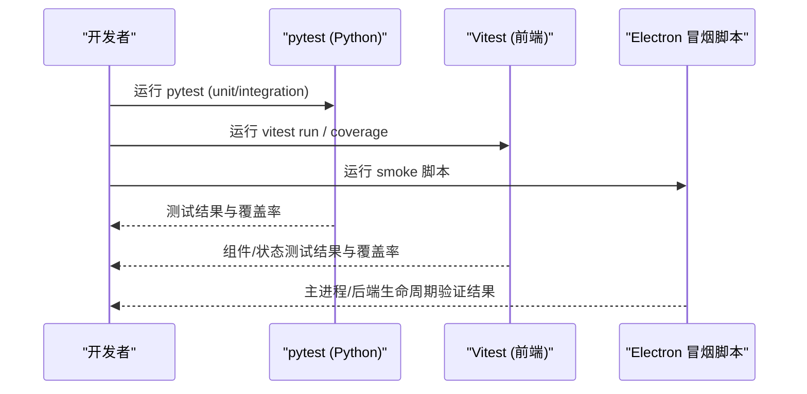
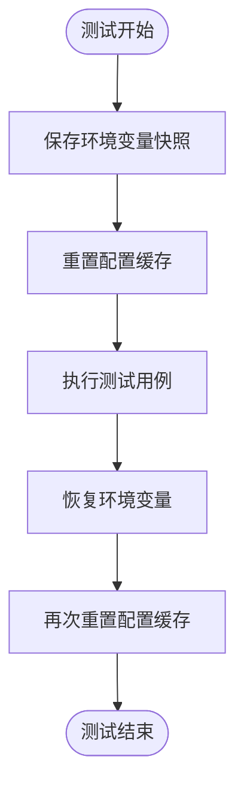
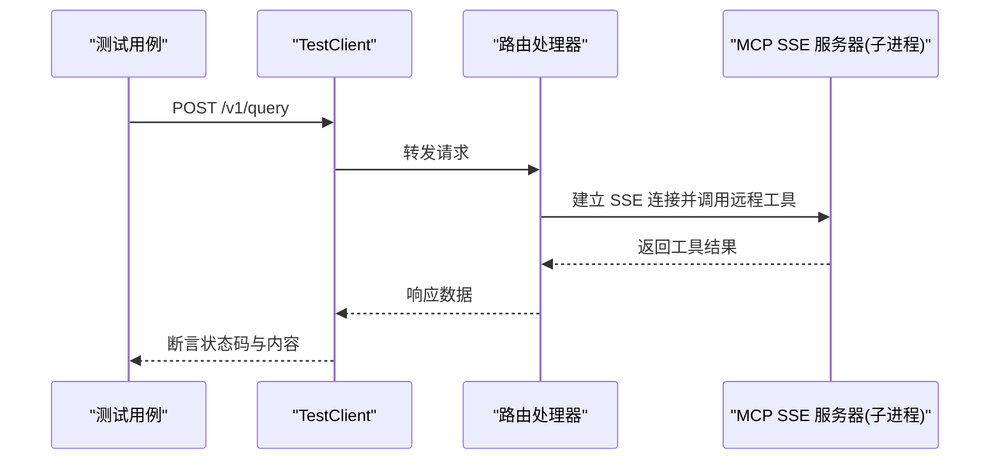
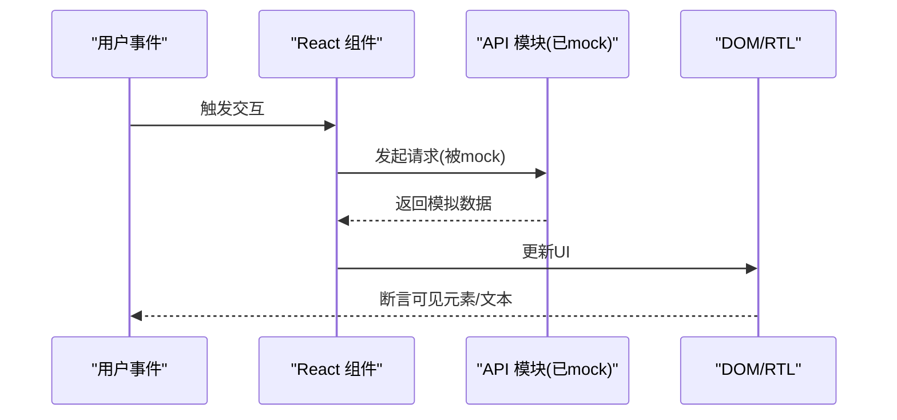
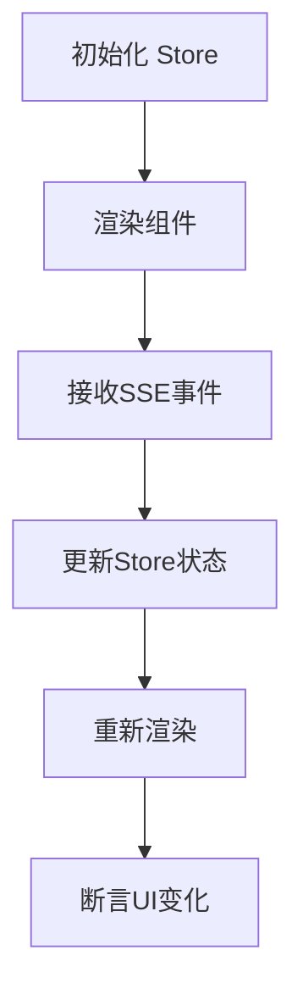
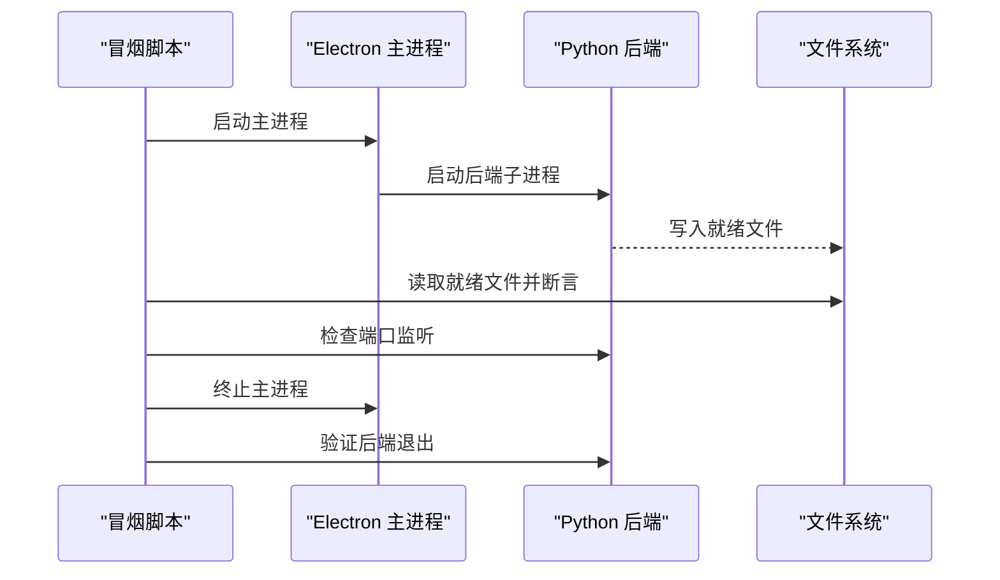
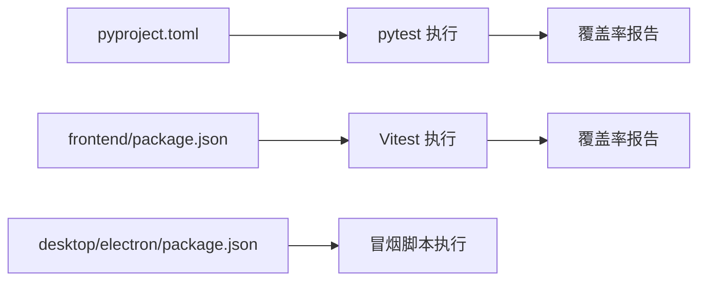

# 单元测试框架与配置

<cite>
**本文引用的文件**
- [pyproject.toml](file://pyproject.toml)
- [agent/tests/conftest.py](file://agent/tests/conftest.py)
- [frontend/package.json](file://frontend/package.json)
- [frontend/vitest.config.ts](file://frontend/vitest.config.ts)
- [frontend/src/tests/setup.ts](file://frontend/src/tests/setup.ts)
- [desktop/electron/package.json](file://desktop/electron/package.json)
- [desktop/electron/scripts/smoke-parent-death.mjs](file://desktop/electron/scripts/smoke-parent-death.mjs)
- [frontend/src/pages/__tests__/Compare.test.tsx](file://frontend/src/pages/__tests__/Compare.test.tsx)
- [frontend/src/components/chat/__tests__/RunnerStatus.test.tsx](file://frontend/src/components/chat/__tests__/RunnerStatus.test.tsx)
- [frontend/src/hooks/__tests__/useSSE.test.ts](file://frontend/src/hooks/__tests__/useSSE.test.ts)
- [agent/tests/test_mcp_sse_integration.py](file://agent/tests/test_mcp_sse_integration.py)
</cite>

## 目录
1. [简介](#简介)
2. [项目结构](#项目结构)
3. [核心组件](#核心组件)
4. [架构总览](#架构总览)
5. [详细组件分析](#详细组件分析)
6. [依赖关系分析](#依赖关系分析)
7. [性能考虑](#性能考虑)
8. [故障排查指南](#故障排查指南)
9. [结论](#结论)
10. [附录](#附录)

## 简介
本文件面向桌面应用（Electron）+ Python 后端 + TypeScript/JavaScript 前端的全栈项目，系统化说明单元测试框架的配置与实践：
- Electron 主进程与渲染进程的测试策略与环境设置
- Python 后端 pytest 的夹具、环境隔离、外部服务模拟与集成测试
- 前端 Vitest + React Testing Library 的组件测试、状态管理测试、API 调用模拟
- IPC 通信、文件操作、系统 API 调用的测试方法
- 覆盖率配置与报告生成
- 持续集成中的测试执行流程建议

## 项目结构
本项目将测试分为三个层次：
- Python 后端：pytest 驱动，集中式 conftest 提供全局夹具与环境隔离，标记 unit/integration 用例。
- 前端：Vitest + jsdom + React Testing Library，统一 setup 初始化 i18n 与浏览器 API 桩，按模块组织 __tests__。
- Electron 桌面端：通过脚本进行冒烟测试与生命周期验证，覆盖主进程与后端子进程的生命周期行为。

图表来源
- [pyproject.toml:275-281](file://pyproject.toml#L275-L281)
- [agent/tests/conftest.py:1-46](file://agent/tests/conftest.py#L1-L46)
- [frontend/vitest.config.ts:1-24](file://frontend/vitest.config.ts#L1-L24)
- [frontend/src/tests/setup.ts:1-32](file://frontend/src/tests/setup.ts#L1-L32)
- [desktop/electron/package.json:9-22](file://desktop/electron/package.json#L9-L22)
- [desktop/electron/scripts/smoke-parent-death.mjs:33-68](file://desktop/electron/scripts/smoke-parent-death.mjs#L33-L68)

章节来源
- [pyproject.toml:275-281](file://pyproject.toml#L275-L281)
- [frontend/vitest.config.ts:1-24](file://frontend/vitest.config.ts#L1-L24)
- [desktop/electron/package.json:9-22](file://desktop/electron/package.json#L9-L22)

## 核心组件
- Python pytest 配置
  - 测试路径与包导入：指定 agent/tests 为测试根目录，并将 agent 加入 pythonpath，便于直接 import src.*、backtest.*。
  - 标记体系：unit（快速、无网络）、integration（可能涉及网络）。
  - 覆盖率：source=agent，排除测试与 __init__.py，报告输出包含缺失行与跳过空文件。
- 前端 Vitest 配置
  - 运行环境：jsdom，启用 globals，使用 setupFiles 初始化 i18n 与浏览器 API 桩。
  - 覆盖率：v8 提供者，输出 text/html/lcov，仅统计 lib 与 stores。
- Electron 测试脚本
  - package.json scripts 暴露 test:* 与 smoke:* 命令，用于构建后验证本地化、后端解析、生命周期等。
  - 冒烟脚本验证主进程与后端子进程的生命周期与端口监听。

章节来源
- [pyproject.toml:275-281](file://pyproject.toml#L275-L281)
- [pyproject.toml:288-304](file://pyproject.toml#L288-L304)
- [frontend/vitest.config.ts:1-24](file://frontend/vitest.config.ts#L1-L24)
- [desktop/electron/package.json:9-22](file://desktop/electron/package.json#L9-L22)

## 架构总览
下图展示了三层测试在 CI 或本地执行时的交互关系：pytest 负责后端单元/集成测试；Vitest 负责前端组件与状态测试；Electron 冒烟脚本验证主进程与后端子进程生命周期。

图表来源
- [pyproject.toml:275-281](file://pyproject.toml#L275-L281)
- [frontend/vitest.config.ts:10-22](file://frontend/vitest.config.ts#L10-L22)
- [desktop/electron/package.json:9-22](file://desktop/electron/package.json#L9-L22)

## 详细组件分析

### Python 后端：pytest 夹具与环境隔离
- 全局夹具 _reset_env_config
  - 在每个测试前后快照并恢复 os.environ，同时重置 EnvConfig 缓存，避免环境变量与配置单例泄漏导致测试间污染。
  - 解决因 .env 写入影响后续测试的问题，确保测试隔离性。
- 测试标记与路径
  - 使用 markers 区分 unit 与 integration，便于选择性执行。
  - 测试路径与 pythonpath 配置保证可直接 import 业务模块。

图表来源
- [agent/tests/conftest.py:16-46](file://agent/tests/conftest.py#L16-L46)

章节来源
- [agent/tests/conftest.py:1-46](file://agent/tests/conftest.py#L1-L46)
- [pyproject.toml:275-281](file://pyproject.toml#L275-L281)

### Python 后端：外部服务模拟与集成测试
- 使用 TestClient 对 FastAPI 路由进行请求级测试，结合 monkeypatch 替换内部服务或环境变量。
- 集成测试示例：启动真实 MCP SSE 服务器进程，端到端验证工具注册与远程调用。

图表来源
- [agent/tests/test_mcp_sse_integration.py:1-46](file://agent/tests/test_mcp_sse_integration.py#L1-L46)

章节来源
- [agent/tests/test_mcp_sse_integration.py:1-46](file://agent/tests/test_mcp_sse_integration.py#L1-L46)

### 前端：Vitest + React Testing Library 组件测试
- 测试初始化 setup.ts
  - 引入 jest-dom 匹配器与 i18n，确保翻译键稳定可断言。
  - 提供 ResizeObserver、matchMedia 等浏览器 API 桩，适配 jsdom 环境。
- 组件测试最佳实践
  - 使用 vi.mock 对 API 模块与第三方库进行局部替换，避免真实网络与重型渲染。
  - 使用 @testing-library/react 的 render/screen/waitFor 进行异步 UI 断言。
  - 针对复杂组件（如 ECharts）进行 mock，降低测试脆弱性。

图表来源
- [frontend/src/tests/setup.ts:1-32](file://frontend/src/tests/setup.ts#L1-L32)
- [frontend/src/pages/__tests__/Compare.test.tsx:1-45](file://frontend/src/pages/__tests__/Compare.test.tsx#L1-L45)
- [frontend/src/components/chat/__tests__/RunnerStatus.test.tsx:1-49](file://frontend/src/components/chat/__tests__/RunnerStatus.test.tsx#L1-L49)

章节来源
- [frontend/vitest.config.ts:1-24](file://frontend/vitest.config.ts#L1-L24)
- [frontend/src/tests/setup.ts:1-32](file://frontend/src/tests/setup.ts#L1-L32)
- [frontend/src/pages/__tests__/Compare.test.tsx:1-45](file://frontend/src/pages/__tests__/Compare.test.tsx#L1-L45)
- [frontend/src/components/chat/__tests__/RunnerStatus.test.tsx:1-49](file://frontend/src/components/chat/__tests__/RunnerStatus.test.tsx#L1-L49)

### 前端：状态管理与 SSE 流式测试
- 状态管理测试
  - 使用 Zustand store 的 reset/getState 等方法，在 beforeEach 中清理状态，确保用例隔离。
- SSE 钩子测试
  - 自定义 MockEventSource 类，模拟服务端推送消息，验证连接、重连与事件处理逻辑。

图表来源
- [frontend/src/stores/__tests__/streaming_area.test.tsx:1-44](file://frontend/src/stores/__tests__/streaming_area.test.tsx#L1-L44)
- [frontend/src/hooks/__tests__/useSSE.test.ts:1-46](file://frontend/src/hooks/__tests__/useSSE.test.ts#L1-L46)

章节来源
- [frontend/src/stores/__tests__/streaming_area.test.tsx:1-44](file://frontend/src/stores/__tests__/streaming_area.test.tsx#L1-L44)
- [frontend/src/hooks/__tests__/useSSE.test.ts:1-46](file://frontend/src/hooks/__tests__/useSSE.test.ts#L1-L46)

### Electron：IPC、文件操作与系统 API 调用测试
- IPC 通信测试
  - 通过冒烟脚本启动 Electron 主进程，等待后端就绪文件，校验 PID、端口监听与进程存活。
  - 验证主进程终止时，后端子进程是否随之退出，确保资源释放与安全性。
- 文件操作与系统 API
  - 使用临时目录与文件系统断言，验证配置文件读写、权限与安全边界。
  - 借助 Node.js assert 与进程管理工具，检查系统级行为（如端口占用、进程树）。

图表来源
- [desktop/electron/scripts/smoke-parent-death.mjs:33-68](file://desktop/electron/scripts/smoke-parent-death.mjs#L33-L68)
- [desktop/electron/package.json:9-22](file://desktop/electron/package.json#L9-L22)

章节来源
- [desktop/electron/scripts/smoke-parent-death.mjs:33-68](file://desktop/electron/scripts/smoke-parent-death.mjs#L33-L68)
- [desktop/electron/package.json:9-22](file://desktop/electron/package.json#L9-L22)

## 依赖关系分析
- Python 层
  - pytest、pytest-cov、pytest-socket 作为开发依赖，支持覆盖率与网络限制。
  - 测试路径与标记在 pyproject.toml 中集中配置，便于统一执行。
- 前端层
  - Vitest、@testing-library/react、jsdom、@vitest/coverage-v8 构成测试栈。
  - setup.ts 提供全局初始化，减少各用例重复代码。
- Electron 层
  - package.json scripts 定义测试与冒烟任务，便于在 CI 中串联执行。

图表来源
- [pyproject.toml:267-273](file://pyproject.toml#L267-L273)
- [pyproject.toml:275-281](file://pyproject.toml#L275-L281)
- [frontend/package.json:9-16](file://frontend/package.json#L9-L16)
- [desktop/electron/package.json:9-22](file://desktop/electron/package.json#L9-L22)

章节来源
- [pyproject.toml:267-273](file://pyproject.toml#L267-L273)
- [frontend/package.json:9-16](file://frontend/package.json#L9-L16)
- [desktop/electron/package.json:9-22](file://desktop/electron/package.json#L9-L22)

## 性能考虑
- 测试隔离与并行
  - Python 侧通过自动夹具重置环境与配置缓存，避免共享状态导致的竞态与失败。
  - 前端使用 vi.mock 隔离外部依赖，减少 I/O 与网络开销。
- 覆盖率范围控制
  - 前端仅统计 lib 与 stores，避免 UI 细节噪声；Python 排除测试与 __init__.py，聚焦业务代码。
- 集成测试分级
  - 使用 markers 将耗时且依赖网络的测试归为 integration，可在 CI 中按需执行。

[本节为通用指导，不直接分析具体文件]

## 故障排查指南
- 环境变量泄漏
  - 若测试间出现 token 或配置污染，检查 conftest 的 _reset_env_config 是否正确执行，并确保未绕过该夹具。
- 前端 i18n 断言不稳定
  - 确认 setup.ts 已引入 i18n，并在用例中使用稳定的翻译键；必要时在测试中 mock useTranslation。
- Electron 冒烟失败
  - 检查就绪文件路径与超时时间；确认后端端口监听与进程存活逻辑；查看主进程与后端子进程 PID 一致性。

章节来源
- [agent/tests/conftest.py:16-46](file://agent/tests/conftest.py#L16-L46)
- [frontend/src/tests/setup.ts:1-32](file://frontend/src/tests/setup.ts#L1-L32)
- [desktop/electron/scripts/smoke-parent-death.mjs:33-68](file://desktop/electron/scripts/smoke-parent-death.mjs#L33-L68)

## 结论
本项目采用分层测试策略：Python 后端以 pytest 为核心，强调环境隔离与集成测试；前端以 Vitest + RTL 为核心，强调组件与状态的可测性与稳定性；Electron 通过冒烟脚本保障主进程与后端子进程的生命周期正确性。配合覆盖率配置与标记体系，可在本地与 CI 中高效执行与维护测试套件。

[本节为总结性内容，不直接分析具体文件]

## 附录
- 覆盖率配置要点
  - Python：source=agent，omit 测试与 __init__.py，report 显示缺失行与跳过空文件。
  - 前端：provider=v8，reporter=text/html/lcov，include 仅 lib 与 stores。
- 持续集成建议
  - 先运行前端 Vitest 与 Python pytest unit，再按需运行 integration 与 Electron 冒烟脚本。
  - 收集覆盖率报告并上传至 CI 平台，设置阈值告警。

章节来源
- [pyproject.toml:288-304](file://pyproject.toml#L288-L304)
- [frontend/vitest.config.ts:15-20](file://frontend/vitest.config.ts#L15-L20)
- [desktop/electron/package.json:9-22](file://desktop/electron/package.json#L9-L22)