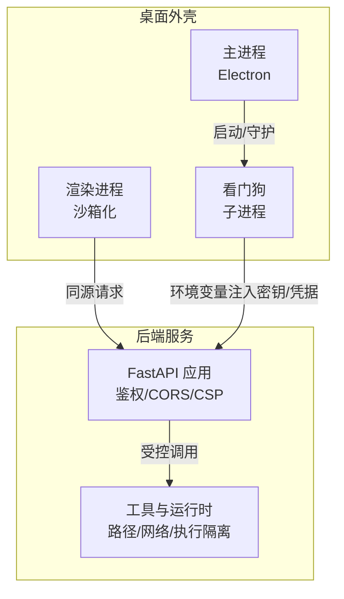
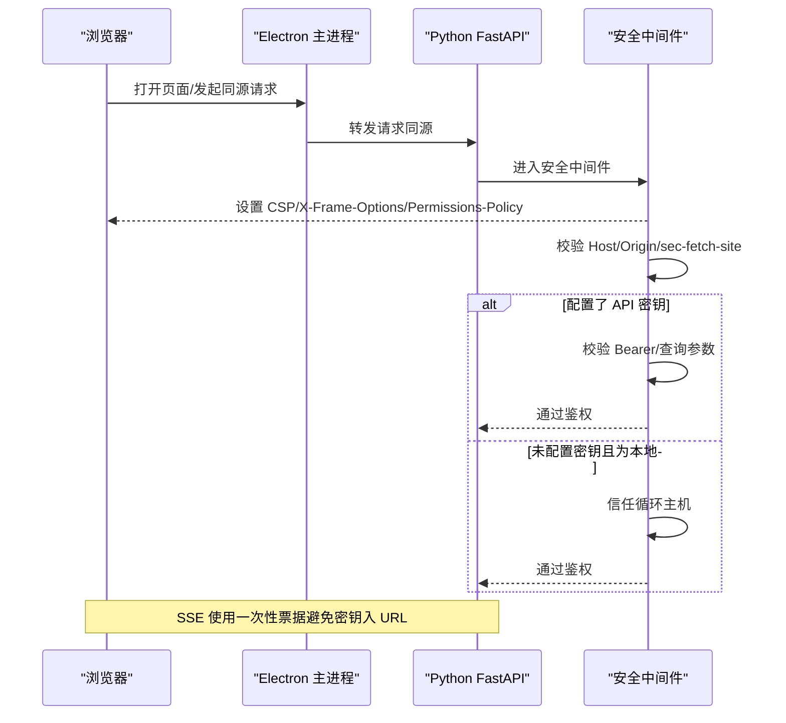
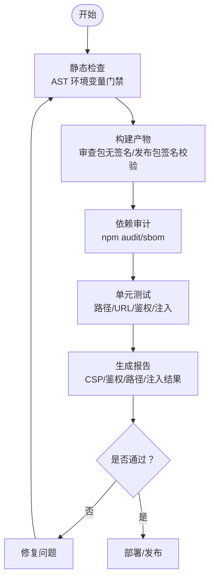
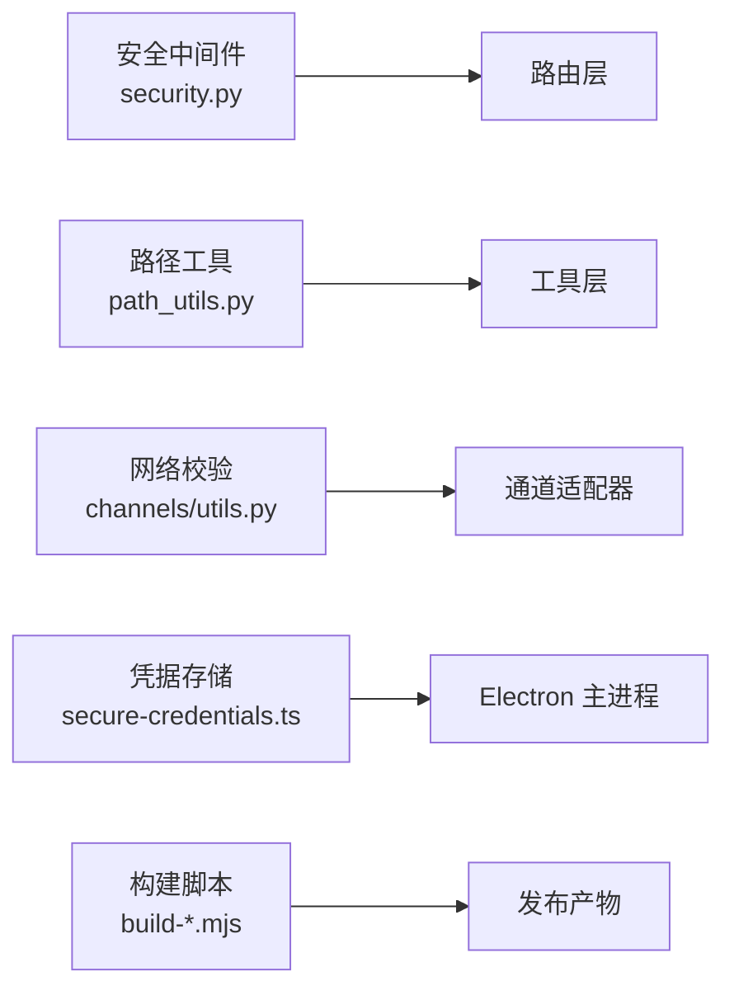

# 安全测试与验证

<cite>
**本文引用的文件**
- [agent/src/api/security.py](file://agent/src/api/security.py)
- [agent/src/security/scanner.py](file://agent/src/security/scanner.py)
- [agent/src/channels/utils.py](file://agent/src/channels/utils.py)
- [agent/src/tools/path_utils.py](file://agent/src/tools/path_utils.py)
- [desktop/electron/THREAT_MODEL.md](file://desktop/electron/THREAT_MODEL.md)
- [desktop/electron/src/secure-credentials.ts](file://desktop/electron/src/secure-credentials.ts)
- [desktop/electron/scripts/build-review-installer.mjs](file://desktop/electron/scripts/build-review-installer.mjs)
- [desktop/electron/scripts/build-signed-installer.mjs](file://desktop/electron/scripts/build-signed-installer.mjs)
- [tools/ci_env_var_gate.py](file://tools/ci_env_var_gate.py)
- [agent/tests/test_security_auth_api.py](file://agent/tests/test_security_auth_api.py)
- [agent/tests/test_path_safety.py](file://agent/tests/test_path_safety.py)
- [agent/tests/test_tool_registry_security.py](file://agent/tests/test_tool_registry_security.py)
- [agent/tests/test_packaging_dependencies.py](file://agent/tests/test_packaging_dependencies.py)
</cite>

## 目录
1. [简介](#简介)
2. [项目结构](#项目结构)
3. [核心组件](#核心组件)
4. [架构总览](#架构总览)
5. [详细组件分析](#详细组件分析)
6. [依赖关系分析](#依赖关系分析)
7. [性能考量](#性能考量)
8. [故障排查指南](#故障排查指南)
9. [结论](#结论)
10. [附录](#附录)

## 简介
本指南面向桌面应用（Electron + Python 后端）的安全测试与验证，覆盖输入验证、权限控制、数据安全、XSS/CSRF防护、漏洞扫描集成与自动化流程。文档基于仓库中现有实现进行系统化梳理，提供可操作的测试用例设计、检查清单与可视化流程图，帮助团队在开发、构建与运行各阶段持续保障安全性。

## 项目结构
本项目包含三层关键边界：
- 前端 Web UI（SPA）通过同源请求访问本地 API。
- Electron 主进程负责启动并守护 Python 后端，管理凭据加密注入与受限 IPC。
- Python 后端提供 REST/SSE 接口，内置鉴权、CORS、CSP、DNS 重绑定防护、路径与网络访问限制等安全能力。

**图示来源**
- [desktop/electron/THREAT_MODEL.md:31-53](file://desktop/electron/THREAT_MODEL.md#L31-L53)
- [agent/src/api/security.py:166-253](file://agent/src/api/security.py#L166-L253)

**章节来源**
- [desktop/electron/THREAT_MODEL.md:1-170](file://desktop/electron/THREAT_MODEL.md#L1-L170)
- [agent/src/api/security.py:1-253](file://agent/src/api/security.py#L1-L253)

## 核心组件
- 认证与访问控制：共享密钥鉴权、SSE 一次性票据、跨站请求拒绝、循环主机白名单、CORS 严格白名单。
- 内容安全策略：默认仅允许同源资源，文档页对 CDN 做最小化放宽；支持 Report-Only 回滚开关。
- 输入与路径校验：URL 目标校验（禁止内网/私有地址）、用户文件根目录白名单、UNC/双斜杠拒绝、路径穿越检测。
- 外部内容扫描：提示词注入模式匹配、聊天模板控制令牌“去毒”、安全告警元数据注入。
- 凭据安全存储：Electron safeStorage 加密、只允许白名单键、原子写入、迁移清理明文。
- 构建与签名：审查安装包强制无签名、发布包签名校验与哈希记录。
- CI 门禁：AST 扫描限制环境变量读取范围，防止敏感信息泄露。

**章节来源**
- [agent/src/api/security.py:26-253](file://agent/src/api/security.py#L26-L253)
- [agent/src/security/scanner.py:1-220](file://agent/src/security/scanner.py#L1-L220)
- [agent/src/channels/utils.py:146-228](file://agent/src/channels/utils.py#L146-L228)
- [agent/src/tools/path_utils.py:304-353](file://agent/src/tools/path_utils.py#L304-L353)
- [desktop/electron/src/secure-credentials.ts:1-240](file://desktop/electron/src/secure-credentials.ts#L1-L240)
- [desktop/electron/scripts/build-review-installer.mjs:42-75](file://desktop/electron/scripts/build-review-installer.mjs#L42-L75)
- [desktop/electron/scripts/build-signed-installer.mjs:112-153](file://desktop/electron/scripts/build-signed-installer.mjs#L112-L153)
- [tools/ci_env_var_gate.py:51-90](file://tools/ci_env_var_gate.py#L51-L90)

## 架构总览
下图展示从浏览器到后端的完整鉴权与安全头处理流程，包括 CORS、CSP、SSE 票据与跨站请求拒绝。

**图示来源**
- [agent/src/api/security.py:166-253](file://agent/src/api/security.py#L166-L253)
- [agent/src/api/security.py:300-340](file://agent/src/api/security.py#L300-L340)
- [agent/src/api/security.py:463-504](file://agent/src/api/security.py#L463-L504)

## 详细组件分析

### 输入验证测试
- 用户输入清洗与命令注入防护
  - 外部文本扫描：识别指令覆盖、系统提示泄露、角色冒充、密钥外泄、工具滥用等模式，并在返回载荷中附加安全告警。
  - 聊天模板控制令牌“去毒”：插入零宽空格破坏 token 匹配，防止伪造角色边界。
  - 建议测试点：构造包含上述模式的输入，验证是否被标记或改写；验证多次运行幂等性。

- 路径遍历攻击防护
  - 用户文件/文档/运行目录均通过白名单根目录校验，拒绝 UNC、双斜杠、路径穿越。
  - 建议测试点：传入“../”、“\\server\share”、“//server/share”等，应被拒绝；正常相对路径需归一化后仍落在允许根内。

- URL 目标校验
  - 仅允许 http/https，解析域名并检查 IP，禁止私有/环回/多播等不可路由地址；可选宽松环回模式。
  - 建议测试点：指向内网地址、localhost、100.64/10 等，均应被拒绝；合法公网地址应放行。

**章节来源**
- [agent/src/security/scanner.py:16-77](file://agent/src/security/scanner.py#L16-L77)
- [agent/src/security/scanner.py:107-143](file://agent/src/security/scanner.py#L107-L143)
- [agent/src/security/scanner.py:145-220](file://agent/src/security/scanner.py#L145-L220)
- [agent/src/tools/path_utils.py:304-353](file://agent/src/tools/path_utils.py#L304-L353)
- [agent/tests/test_path_safety.py:32-124](file://agent/tests/test_path_safety.py#L32-L124)
- [agent/src/channels/utils.py:146-228](file://agent/src/channels/utils.py#L146-L228)

### 权限控制测试
- 文件系统访问权限
  - 所有文件路径必须落入允许的导入根或上传根；媒体目录固定位于 uploads 下；运行时子目录位于 data/runtime。
  - 建议测试点：尝试读写非允许根的文件；验证媒体目录创建与归属；验证上传路径规范化。

- 网络请求权限
  - 通道适配器统一通过 validate_url_target 校验目标地址，阻止私网/环回/多播。
  - 建议测试点：构造指向内网服务的 URL；验证 DNS 解析后的 IP 是否被拦截。

- 系统 API 调用权限
  - 工具注册表默认不暴露 shell 工具，需显式开启；后端对危险操作要求强鉴权。
  - 建议测试点：在未启用 shell 工具时，确认相关工具不可用；在启用后，确认需要额外授权。

**章节来源**
- [agent/src/channels/utils.py:27-43](file://agent/src/channels/utils.py#L27-L43)
- [agent/src/channels/utils.py:146-228](file://agent/src/channels/utils.py#L146-L228)
- [agent/tests/test_tool_registry_security.py:1-27](file://agent/tests/test_tool_registry_security.py#L1-L27)
- [agent/src/api/security.py:556-563](file://agent/src/api/security.py#L556-L563)

### 数据安全测试
- 敏感信息加密存储
  - Electron 使用 safeStorage 加密凭据，仅允许白名单键；写入采用临时文件+rename 的原子操作；迁移时删除明文字段。
  - 建议测试点：验证加密可用性；检查文件权限；验证迁移后明文消失；尝试写入非白名单键应失败。

- 传输安全
  - 后端强制同源访问，CSP 限制脚本/样式/连接来源；SSE 使用一次性票据，避免密钥出现在 URL。
  - 建议测试点：检查响应头 CSP/Referrer-Policy/Permissions-Policy；验证跨站请求被拒；验证 SSE 票据一次有效。

- 内存中敏感数据处理
  - 密钥仅在内存与子进程环境中传递，不落盘；日志中对查询参数中的敏感值进行脱敏。
  - 建议测试点：验证日志不包含 api_key/ticket 明文；检查进程间通信不暴露密钥。

**章节来源**
- [desktop/electron/src/secure-credentials.ts:12-44](file://desktop/electron/src/secure-credentials.ts#L12-L44)
- [desktop/electron/src/secure-credentials.ts:68-164](file://desktop/electron/src/secure-credentials.ts#L68-L164)
- [desktop/electron/src/secure-credentials.ts:166-219](file://desktop/electron/src/secure-credentials.ts#L166-L219)
- [agent/src/api/security.py:177-253](file://agent/src/api/security.py#L177-L253)
- [agent/src/api/security.py:300-340](file://agent/src/api/security.py#L300-L340)

### XSS 与 CSRF 防护测试
- 脚本注入防护
  - CSP 默认仅允许同源脚本与样式；文档页对 CDN 做最小化放宽；禁止 frame-ancestors/base-uri/form-action 跨域。
  - 建议测试点：抓取 /health 与 /docs 的 CSP 头，验证差异；尝试加载外部脚本应被阻断。

- 跨站请求伪造防护
  - 拒绝 sec-fetch-site=cross-site 的请求；Origin 必须匹配当前站点或为可信循环主机；CORS 不允许通配符。
  - 建议测试点：构造跨站 Origin 请求；验证被拒绝；检查 CORS 配置不含 "*"。

- 内容安全策略验证
  - 支持 Report-Only 模式用于灰度回滚；文档页例外不得泄漏至应用页。
  - 建议测试点：切换 Report-Only 观察行为；验证 /docs 与 /redoc 的 CSP 仅允许 jsdelivr。

**章节来源**
- [agent/src/api/security.py:180-253](file://agent/src/api/security.py#L180-L253)
- [agent/src/api/security.py:69-103](file://agent/src/api/security.py#L69-L103)
- [agent/tests/test_sse_ticket_and_headers.py:167-200](file://agent/tests/test_sse_ticket_and_headers.py#L167-L200)

### 安全漏洞扫描工具集成
- 静态代码分析
  - 通过 AST 扫描限制环境变量的读取位置，仅允许在配置层读取，其他位置视为违规。
  - 建议测试点：在非允许路径读取 os.environ 应触发告警；在允许路径读取应通过。

- 依赖包安全检查
  - 打包依赖回归测试确保可选依赖不会成为核心安装依赖；npm audit/sbom 用于前端依赖治理。
  - 建议测试点：验证 pyproject.toml 与 requirements 一致性；检查 npm audit 无已知漏洞。

- 运行时安全监控
  - 构建产物签名校验与哈希记录；审查安装包强制无签名，发布包需签名并通过 Authenticode 校验。
  - 建议测试点：验证安装包签名状态；核对 SHA-256 摘要；异常时阻断发布。

**章节来源**
- [tools/ci_env_var_gate.py:51-90](file://tools/ci_env_var_gate.py#L51-L90)
- [agent/tests/test_packaging_dependencies.py:1-46](file://agent/tests/test_packaging_dependencies.py#L1-L46)
- [desktop/electron/scripts/build-review-installer.mjs:42-75](file://desktop/electron/scripts/build-review-installer.mjs#L42-L75)
- [desktop/electron/scripts/build-signed-installer.mjs:112-153](file://desktop/electron/scripts/build-signed-installer.mjs#L112-L153)

### 安全测试自动化流程

**图示来源**
- [tools/ci_env_var_gate.py:51-90](file://tools/ci_env_var_gate.py#L51-L90)
- [desktop/electron/scripts/build-review-installer.mjs:42-75](file://desktop/electron/scripts/build-review-installer.mjs#L42-L75)
- [desktop/electron/scripts/build-signed-installer.mjs:112-153](file://desktop/electron/scripts/build-signed-installer.mjs#L112-L153)
- [agent/tests/test_security_auth_api.py:743-788](file://agent/tests/test_security_auth_api.py#L743-L788)
- [agent/tests/test_path_safety.py:32-124](file://agent/tests/test_path_safety.py#L32-L124)

## 依赖关系分析
- 模块耦合
  - 安全中间件集中处理鉴权、CORS、CSP、日志脱敏，被各路由复用。
  - 路径与网络校验工具被多个工具与通道适配器复用，形成统一入口。
  - Electron 凭据存储与威胁模型约束主进程与子进程边界，减少密钥泄露面。

- 外部依赖与集成点
  - FastAPI 安全组件（HTTPBearer、Security）。
  - 操作系统安全存储（safeStorage）。
  - 构建工具链（Authenticode、PowerShell 命令）。

**图示来源**
- [agent/src/api/security.py:1-253](file://agent/src/api/security.py#L1-L253)
- [agent/src/tools/path_utils.py:304-353](file://agent/src/tools/path_utils.py#L304-L353)
- [agent/src/channels/utils.py:146-228](file://agent/src/channels/utils.py#L146-L228)
- [desktop/electron/src/secure-credentials.ts:68-164](file://desktop/electron/src/secure-credentials.ts#L68-L164)
- [desktop/electron/scripts/build-signed-installer.mjs:112-153](file://desktop/electron/scripts/build-signed-installer.mjs#L112-L153)

**章节来源**
- [agent/src/api/security.py:1-253](file://agent/src/api/security.py#L1-L253)
- [agent/src/tools/path_utils.py:304-353](file://agent/src/tools/path_utils.py#L304-L353)
- [agent/src/channels/utils.py:146-228](file://agent/src/channels/utils.py#L146-L228)
- [desktop/electron/src/secure-credentials.ts:68-164](file://desktop/electron/src/secure-credentials.ts#L68-L164)
- [desktop/electron/scripts/build-signed-installer.mjs:112-153](file://desktop/electron/scripts/build-signed-installer.mjs#L112-L153)

## 性能考量
- 安全中间件开销：CSP/Headers 设置与鉴权校验为轻量级操作，影响可忽略。
- 路径与网络校验：正则与 socket.getaddrinfo 可能带来少量延迟，建议在批量处理时缓存解析结果。
- 凭据加密：safeStorage 加解密为系统级调用，频率低，性能影响可控。
- 构建签名：Authenticode 校验耗时较高，应在 CI 中按需执行并缓存结果。

[本节为通用指导，无需特定文件引用]

## 故障排查指南
- 鉴权失败
  - 现象：401/403 错误；SSE 票据无效。
  - 排查：检查 API_KEY 配置、循环主机信任、sec-fetch-site/Origin 校验、票据有效期。
  - 参考：[agent/src/api/security.py:463-504](file://agent/src/api/security.py#L463-L504)、[agent/src/api/security.py:591-622](file://agent/src/api/security.py#L591-L622)

- 路径访问被拒
  - 现象：ValueError 提示超出允许根。
  - 排查：确认 VIBE_TRADING_ALLOWED_FILE_ROOTS、UNC/双斜杠、路径穿越输入。
  - 参考：[agent/tests/test_path_safety.py:32-124](file://agent/tests/test_path_safety.py#L32-L124)

- URL 目标被拦截
  - 现象：resolve 后判定为私有/环回/多播。
  - 排查：检查 allow_loopback 标志、DNS 解析结果、hostname 合法性。
  - 参考：[agent/src/channels/utils.py:146-228](file://agent/src/channels/utils.py#L146-L228)

- 凭据迁移失败
  - 现象：加密不可用或文件格式不支持。
  - 排查：检查 safeStorage 可用性、文件版本、键白名单、迁移逻辑。
  - 参考：[desktop/electron/src/secure-credentials.ts:84-95](file://desktop/electron/src/secure-credentials.ts#L84-L95)、[desktop/electron/src/secure-credentials.ts:139-153](file://desktop/electron/src/secure-credentials.ts#L139-L153)

- 构建签名异常
  - 现象：签名状态不符合预期或哈希不一致。
  - 排查：确认 PowerShell 环境、签名工具可用、SHA-256 计算正确。
  - 参考：[desktop/electron/scripts/build-signed-installer.mjs:112-153](file://desktop/electron/scripts/build-signed-installer.mjs#L112-L153)

**章节来源**
- [agent/src/api/security.py:463-504](file://agent/src/api/security.py#L463-L504)
- [agent/src/api/security.py:591-622](file://agent/src/api/security.py#L591-L622)
- [agent/tests/test_path_safety.py:32-124](file://agent/tests/test_path_safety.py#L32-L124)
- [agent/src/channels/utils.py:146-228](file://agent/src/channels/utils.py#L146-L228)
- [desktop/electron/src/secure-credentials.ts:84-95](file://desktop/electron/src/secure-credentials.ts#L84-L95)
- [desktop/electron/src/secure-credentials.ts:139-153](file://desktop/electron/src/secure-credentials.ts#L139-L153)
- [desktop/electron/scripts/build-signed-installer.mjs:112-153](file://desktop/electron/scripts/build-signed-installer.mjs#L112-L153)

## 结论
本项目在输入验证、权限控制、数据安全、XSS/CSRF 防护与构建签名等方面具备完善的安全机制。通过系统化的测试与自动化门禁，可有效降低常见安全风险。建议持续完善测试覆盖率、强化依赖治理与日志脱敏，并将安全指标纳入发布质量门槛。

[本节为总结性内容，无需特定文件引用]

## 附录
- 常用安全测试清单
  - 输入验证：路径穿越、UNC/双斜杠、URL 目标、提示词注入模式。
  - 权限控制：文件根白名单、网络访问限制、工具注册表开关。
  - 数据安全：凭据加密、传输安全、日志脱敏。
  - XSS/CSRF：CSP 头、跨站请求拒绝、CORS 白名单。
  - 构建与发布：审查包无签名、发布包签名校验、依赖审计。

[本节为补充说明，无需特定文件引用]