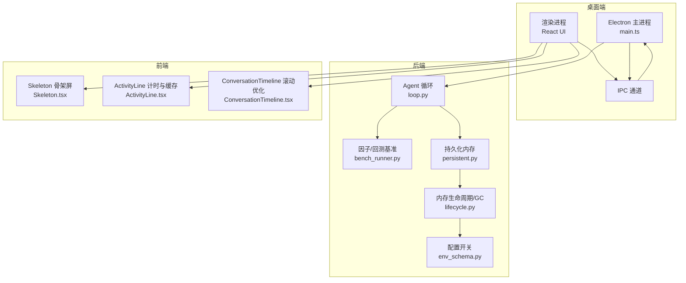
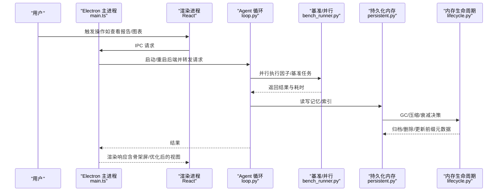
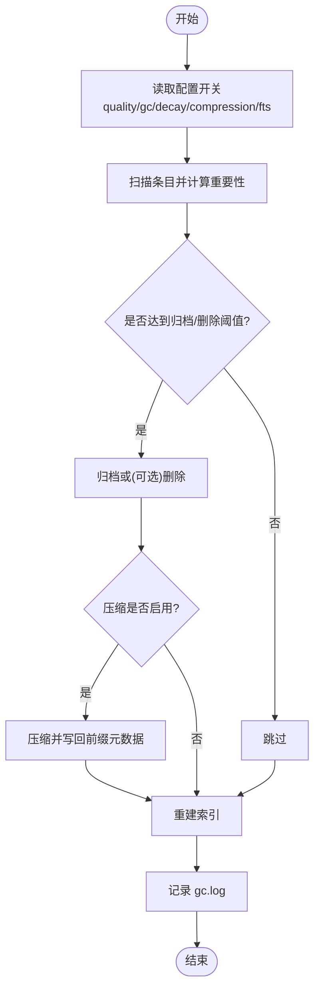
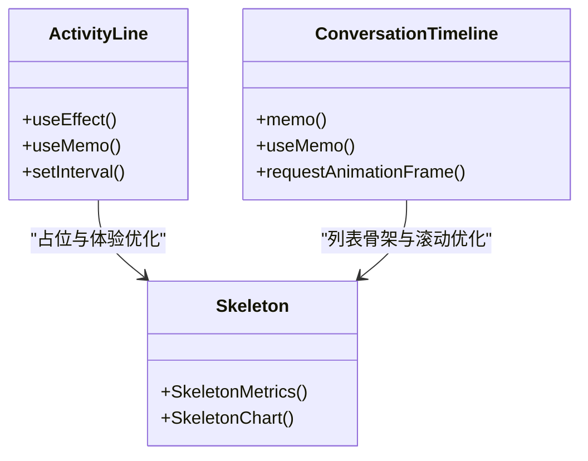
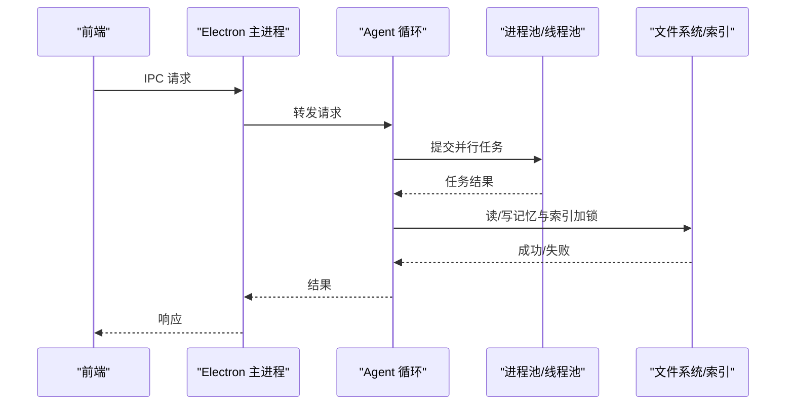
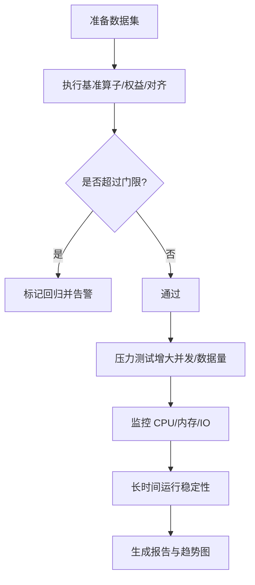
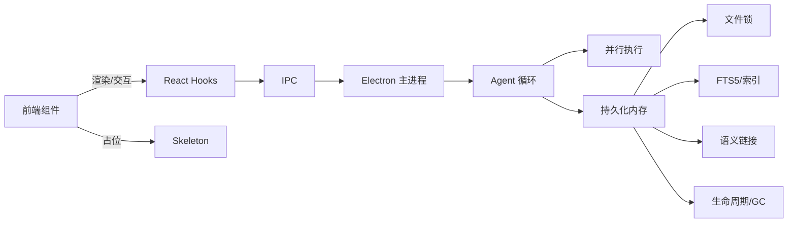

# 性能测试与优化

<cite>
**本文引用的文件**
- [bench_performance.py](file://agent/scripts/bench_performance.py)
- [main.ts](file://desktop/electron/src/main.ts)
- [lifecycle.py](file://agent/src/memory/lifecycle.py)
- [persistent.py](file://agent/src/memory/persistent.py)
- [env_schema.py](file://agent/src/config/env_schema.py)
- [test_signal_alignment_perf.py](file://agent/tests/test_signal_alignment_perf.py)
- [bench_runner.py](file://agent/src/factors/bench_runner.py)
- [loop.py](file://agent/src/agent/loop.py)
- [Skeleton.tsx](file://frontend/src/components/common/Skeleton.tsx)
- [ActivityLine.tsx](file://frontend/src/components/chat/ActivityLine.tsx)
- [ConversationTimeline.tsx](file://frontend/src/components/chat/ConversationTimeline.tsx)
</cite>

## 目录
1. [简介](#简介)
2. [项目结构](#项目结构)
3. [核心组件](#核心组件)
4. [架构总览](#架构总览)
5. [详细组件分析](#详细组件分析)
6. [依赖关系分析](#依赖关系分析)
7. [性能考量](#性能考量)
8. [故障排查指南](#故障排查指南)
9. [结论](#结论)
10. [附录](#附录)

## 简介
本指南面向桌面应用（Electron + React）与后端（Python Agent）的性能测试与优化，覆盖以下主题：
- 内存使用测试：内存泄漏检测、内存占用监控、垃圾回收行为分析
- 渲染性能测试：React 组件重渲染优化、图表渲染性能、大量数据处理性能
- 并发处理能力测试：多进程通信性能、IPC 调用延迟、资源竞争测试
- 基准测试与压力测试：负载测试、稳定性测试、长时间运行测试
- 性能监控工具：Chrome DevTools、Electron 内置调试器、Python 性能分析工具
- 性能优化建议与最佳实践，以及性能回归检测机制

## 项目结构
本项目由三部分组成：
- Electron 主进程与渲染进程（桌面端入口、IPC、安全策略、日志等）
- Python Agent 后端（因子计算、回测引擎、内存生命周期管理、并行执行等）
- React 前端（UI、图表、骨架屏、性能相关钩子与优化）

**图示来源**
- [main.ts:1-285](file://desktop/electron/src/main.ts#L1-L285)
- [loop.py:2677-2713](file://agent/src/agent/loop.py#L2677-L2713)
- [bench_runner.py:208-247](file://agent/src/factors/bench_runner.py#L208-L247)
- [persistent.py:1-654](file://agent/src/memory/persistent.py#L1-L654)
- [lifecycle.py:1-421](file://agent/src/memory/lifecycle.py#L1-L421)
- [env_schema.py:559-604](file://agent/src/config/env_schema.py#L559-L604)
- [Skeleton.tsx:1-23](file://frontend/src/components/common/Skeleton.tsx#L1-L23)
- [ActivityLine.tsx:86-134](file://frontend/src/components/chat/ActivityLine.tsx#L86-L134)
- [ConversationTimeline.tsx:1-39](file://frontend/src/components/chat/ConversationTimeline.tsx#L1-L39)

**章节来源**
- [main.ts:1-285](file://desktop/electron/src/main.ts#L1-L285)
- [Skeleton.tsx:1-23](file://frontend/src/components/common/Skeleton.tsx#L1-L23)

## 核心组件
- 内存生命周期管理：质量评分、重要性衰减、垃圾回收（GC）、压缩与索引重建
- 持久化内存：文件级锁、去重窗口、FTS5 搜索、语义链接扩展
- 并发与并行：线程池与进程池执行工具调用与因子基准任务
- 前端渲染优化：memo、useMemo、requestAnimationFrame、骨架屏占位
- 基准与压测：算子/权益计算基准、信号对齐性能门控、并行工作进程数控制

**章节来源**
- [lifecycle.py:1-421](file://agent/src/memory/lifecycle.py#L1-L421)
- [persistent.py:1-654](file://agent/src/memory/persistent.py#L1-L654)
- [loop.py:2677-2713](file://agent/src/agent/loop.py#L2677-L2713)
- [bench_runner.py:208-247](file://agent/src/factors/bench_runner.py#L208-L247)
- [ActivityLine.tsx:86-134](file://frontend/src/components/chat/ActivityLine.tsx#L86-L134)
- [ConversationTimeline.tsx:1-39](file://frontend/src/components/chat/ConversationTimeline.tsx#L1-L39)

## 架构总览
下图展示了从 Electron 主进程到 Agent 后端的整体交互，包括 IPC、并行执行、内存管理与前端渲染优化点。

**图示来源**
- [main.ts:1-285](file://desktop/electron/src/main.ts#L1-L285)
- [loop.py:2677-2713](file://agent/src/agent/loop.py#L2677-L2713)
- [bench_runner.py:208-247](file://agent/src/factors/bench_runner.py#L208-L247)
- [persistent.py:1-654](file://agent/src/memory/persistent.py#L1-L654)
- [lifecycle.py:1-421](file://agent/src/memory/lifecycle.py#L1-L421)

## 详细组件分析

### 内存使用测试：泄漏检测、占用监控、GC 行为分析
- 内存泄漏检测
  - 通过 Electron 主进程启用 DevTools 并在开发模式下打开开发者工具，结合 Chrome DevTools 的“Memory”面板进行堆快照对比，定位未释放引用与闭包泄漏。
  - 在渲染进程中关注定时器清理与事件监听移除，避免长驻内存对象累积。
- 内存占用监控
  - 使用 Node.js 的 process.memoryUsage 与 V8 堆统计，结合 Electron 的 devtools 进行采样；对关键路径（如大数组、DataFrame）进行分阶段测量。
  - 前端侧可通过 React Profiler 观察组件树渲染成本与状态变更导致的额外分配。
- 垃圾回收行为分析
  - 后端内存模块提供基于重要性的衰减与阈值驱动的 GC 流程，支持归档与可选删除，并记录 gc.log。
  - 持久化层包含文件级锁与去重窗口，减少重复写入与并发冲突带来的内存抖动。
  - 配置开关允许按需开启质量评分、衰减、GC、压缩与 FTS5 索引，便于在不同环境平衡性能与功能。

**图示来源**
- [lifecycle.py:183-317](file://agent/src/memory/lifecycle.py#L183-L317)
- [persistent.py:200-315](file://agent/src/memory/persistent.py#L200-L315)
- [env_schema.py:559-604](file://agent/src/config/env_schema.py#L559-L604)

**章节来源**
- [lifecycle.py:1-421](file://agent/src/memory/lifecycle.py#L1-L421)
- [persistent.py:1-654](file://agent/src/memory/persistent.py#L1-L654)
- [env_schema.py:559-604](file://agent/src/config/env_schema.py#L559-L604)

### 渲染性能测试：React 组件重渲染优化、图表渲染、大数据处理
- 组件重渲染优化
  - 使用 memo 包裹列表型组件以减少不必要的重渲染。
  - 使用 useMemo 缓存计算密集型派生数据（如活动摘要、时间线高亮索引）。
  - 使用 requestAnimationFrame 节流滚动计算，降低高频回调造成的布局抖动。
- 图表渲染性能
  - 在数据加载期间展示骨架屏（Skeleton），避免阻塞渲染；图表区域预留高度，提升感知性能。
  - 对大规模时序数据采用分页、降采样与增量更新策略。
- 大量数据处理性能
  - 将重型计算下沉至后端（Agent），前端仅负责展示与交互；必要时使用 Web Worker 或分片处理。
  - 前端侧避免在渲染周期内创建大对象，复用实例与缓冲。

**图示来源**
- [ActivityLine.tsx:86-134](file://frontend/src/components/chat/ActivityLine.tsx#L86-L134)
- [ConversationTimeline.tsx:1-39](file://frontend/src/components/chat/ConversationTimeline.tsx#L1-L39)
- [Skeleton.tsx:1-23](file://frontend/src/components/common/Skeleton.tsx#L1-L23)

**章节来源**
- [ActivityLine.tsx:86-134](file://frontend/src/components/chat/ActivityLine.tsx#L86-L134)
- [ConversationTimeline.tsx:1-39](file://frontend/src/components/chat/ConversationTimeline.tsx#L1-L39)
- [Skeleton.tsx:1-23](file://frontend/src/components/common/Skeleton.tsx#L1-L23)

### 并发处理能力测试：多进程通信、IPC 延迟、资源竞争
- 多进程通信性能
  - Electron 主进程通过 IPC 与渲染进程通信，注意消息体积与频率，避免阻塞 UI 线程。
  - 后端使用线程池与进程池并行执行工具调用与基准任务，合理设置 worker 数量以避免上下文切换开销。
- IPC 调用延迟
  - 在 Electron 中为 IPC 增加超时与重试策略；对关键路径进行端到端时延测量（前端发起 -> 主进程转发 -> 后端处理 -> 返回渲染）。
- 资源竞争测试
  - 持久化内存使用文件级锁防止并发写冲突；在高并发场景下评估锁等待时间与吞吐。
  - 对共享资源（如索引、FTS5 索引、语义链接）进行并发访问测试，确保一致性。

**图示来源**
- [main.ts:119-146](file://desktop/electron/src/main.ts#L119-L146)
- [loop.py:2677-2713](file://agent/src/agent/loop.py#L2677-L2713)
- [persistent.py:41-73](file://agent/src/memory/persistent.py#L41-L73)

**章节来源**
- [main.ts:119-146](file://desktop/electron/src/main.ts#L119-L146)
- [loop.py:2677-2713](file://agent/src/agent/loop.py#L2677-L2713)
- [persistent.py:41-73](file://agent/src/memory/persistent.py#L41-L73)

### 基准测试与压力测试：负载、稳定性、长时间运行
- 基准测试
  - 算子与权益计算基准：对比向量化与循环路径，评估加速比与单次调用耗时。
  - 信号对齐性能门控：以中位数耗时作为回归门限，确保优化效果稳定。
- 压力测试
  - 通过增大数据规模与并发度，验证系统在高负载下的稳定性与资源占用。
  - 对 IPC 与后端并行执行进行压测，观察 CPU、内存与 I/O 瓶颈。
- 长时间运行测试
  - 持续运行基准与业务路径，监控内存增长趋势与 GC 频率，识别潜在泄漏。
  - 结合日志与指标（gc.log、性能门控输出）进行趋势分析。

**图示来源**
- [bench_performance.py:19-116](file://agent/scripts/bench_performance.py#L19-L116)
- [test_signal_alignment_perf.py:445-463](file://agent/tests/test_signal_alignment_perf.py#L445-L463)
- [bench_runner.py:208-247](file://agent/src/factors/bench_runner.py#L208-L247)

**章节来源**
- [bench_performance.py:19-116](file://agent/scripts/bench_performance.py#L19-L116)
- [test_signal_alignment_perf.py:445-463](file://agent/tests/test_signal_alignment_perf.py#L445-L463)
- [bench_runner.py:208-247](file://agent/src/factors/bench_runner.py#L208-L247)

## 依赖关系分析
- 前端依赖 React 生态（hooks、memo、useMemo）与 Tailwind 样式，骨架屏用于加载态占位。
- Electron 主进程依赖 IPC、安全策略与日志路径，负责后端生命周期管理。
- Agent 后端依赖并行执行库、内存模块与配置开关，实现高性能计算与资源治理。
- 内存模块内部依赖文件锁、FTS5 索引与语义链接，形成检索与压缩闭环。

**图示来源**
- [Skeleton.tsx:1-23](file://frontend/src/components/common/Skeleton.tsx#L1-L23)
- [main.ts:1-285](file://desktop/electron/src/main.ts#L1-L285)
- [loop.py:2677-2713](file://agent/src/agent/loop.py#L2677-L2713)
- [persistent.py:1-654](file://agent/src/memory/persistent.py#L1-L654)
- [lifecycle.py:1-421](file://agent/src/memory/lifecycle.py#L1-L421)

**章节来源**
- [main.ts:1-285](file://desktop/electron/src/main.ts#L1-L285)
- [persistent.py:1-654](file://agent/src/memory/persistent.py#L1-L654)
- [lifecycle.py:1-421](file://agent/src/memory/lifecycle.py#L1-L421)

## 性能考量
- 内存
  - 合理使用持久化内存的 GC 与压缩，避免频繁全量扫描；在 dry_run 模式下先评估影响再执行。
  - 前端避免在渲染周期内创建大对象，使用骨架屏与懒加载降低首屏压力。
- 渲染
  - 使用 memo/useMemo 减少不必要重渲染；滚动计算使用 requestAnimationFrame 节流。
  - 图表数据分页与降采样，避免一次性绘制海量节点。
- 并发
  - 根据 CPU 核数与任务特性调整并行 worker 数量；对 IO 密集任务优先线程池，CPU 密集任务考虑进程池。
  - IPC 消息尽量小且批量化，避免频繁小消息造成主线程阻塞。
- 基准与回归
  - 建立性能门控（如信号对齐中位数 < 50ms），在 CI 中自动拦截回归。
  - 定期运行基准与压测，输出趋势报告，识别退化点。

[本节为通用指导，不直接分析具体文件]

## 故障排查指南
- 内存问题
  - 检查 GC 日志（gc.log）与配置开关，确认归档/删除策略是否生效。
  - 使用 DevTools Memory 面板对比堆快照，定位未释放对象与循环引用。
- 渲染卡顿
  - 使用 React Profiler 分析重渲染热点；检查是否有未在 useEffect 中清理的定时器或监听器。
  - 对长列表使用虚拟滚动或分页，减少 DOM 节点数量。
- 并发与 IPC
  - 检查文件锁超时与重试逻辑，避免死锁；在高并发下评估锁粒度与持有时间。
  - 对 IPC 链路进行时延测量，定位瓶颈（前端、主进程、后端、I/O）。

**章节来源**
- [lifecycle.py:329-346](file://agent/src/memory/lifecycle.py#L329-L346)
- [persistent.py:41-73](file://agent/src/memory/persistent.py#L41-L73)
- [main.ts:119-146](file://desktop/electron/src/main.ts#L119-L146)

## 结论
本项目在内存管理、渲染优化与并发执行方面具备完善的实现与可观测性。通过基准测试与性能门控，可有效检测回归；通过 GC 与压缩策略，可持续控制内存占用。建议在 CI 中集成性能回归检测，并结合 DevTools 与日志进行持续优化。

[本节为总结，不直接分析具体文件]

## 附录
- 性能监控工具使用要点
  - Chrome DevTools：Memory 面板（堆快照、Allocation instrumentation）、Performance 面板（火焰图、帧率）、Network 面板（IPC/HTTP 延迟）
  - Electron 内置调试器：在主进程与渲染进程分别启用，结合断点与变量监视定位问题
  - Python 性能分析：使用 cProfile、line_profiler 分析后端热点；结合基准脚本与测试门控输出趋势
- 最佳实践清单
  - 前端：memo/useMemo、requestAnimationFrame、骨架屏、懒加载、分页/降采样
  - 后端：并行参数调优、文件锁与去重窗口、GC/压缩策略、日志与指标采集
  - 测试：基准门控、压力测试、长时间运行、回归检测

[本节为补充信息，不直接分析具体文件]