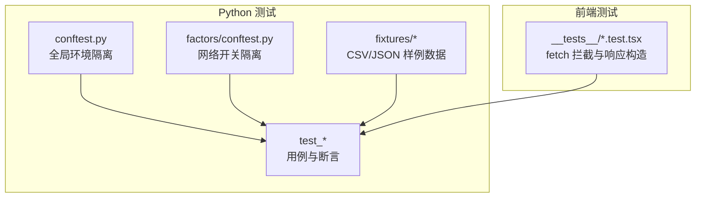
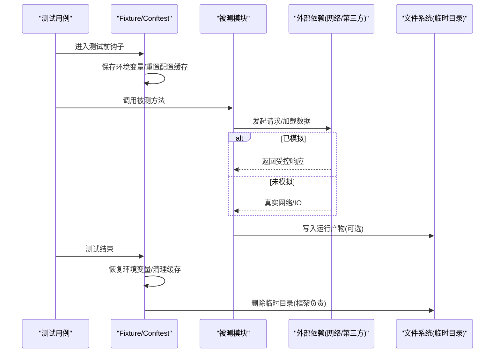
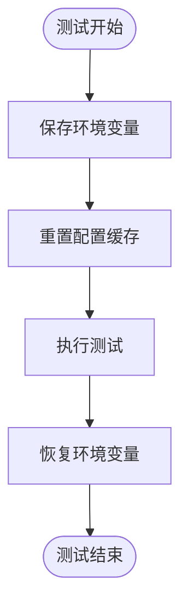
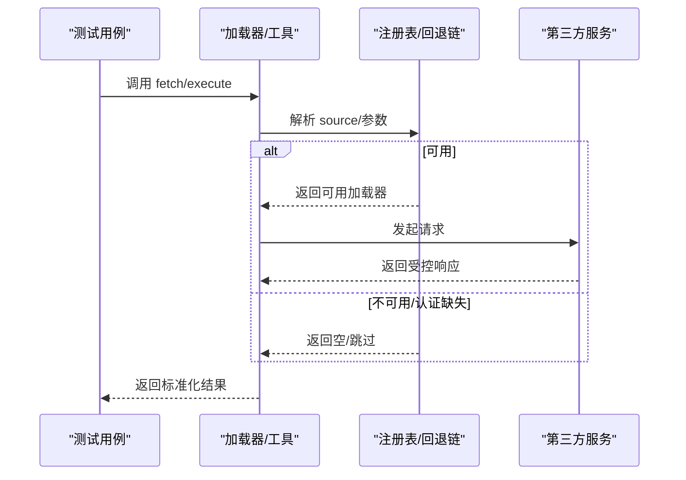
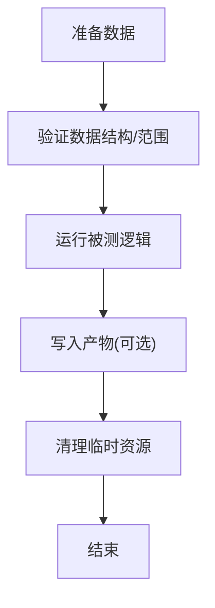
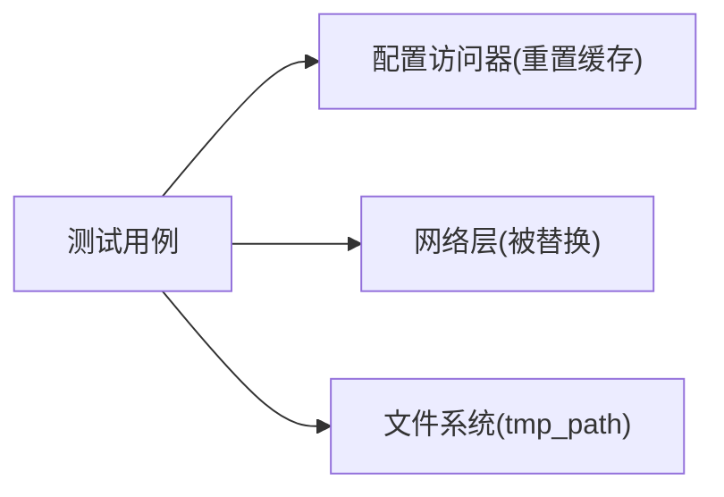

# 测试数据管理

<cite>
**本文引用的文件**
- [agent/tests/conftest.py](file://agent/tests/conftest.py)
- [agent/tests/factors/conftest.py](file://agent/tests/factors/conftest.py)
- [agent/tests/fixtures/negative_close_bars.csv](file://agent/tests/fixtures/negative_close_bars.csv)
- [agent/tests/test_registry.py](file://agent/tests/test_registry.py)
- [agent/tests/test_fmp_loader.py](file://agent/tests/test_fmp_loader.py)
- [agent/tests/test_futu_loader.py](file://agent/tests/test_futu_loader.py)
- [agent/tests/test_security_scanner.py](file://agent/tests/test_security_scanner.py)
- [agent/tests/test_session_service_lifecycle.py](file://agent/tests/test_session_service_lifecycle.py)
- [agent/tests/test_technical_indicator_tool.py](file://agent/tests/test_technical_indicator_tool.py)
- [agent/tests/test_validation.py](file://agent/tests/test_validation.py)
- [agent/tests/test_engine_robustness.py](file://agent/tests/test_engine_robustness.py)
- [agent/src/tools/autopilot_tool.py](file://agent/src/tools/autopilot_tool.py)
- [frontend/src/pages/__tests__/SettingsQVeris.test.tsx](file://frontend/src/pages/__tests__/SettingsQVeris.test.tsx)
</cite>

## 目录
1. [简介](#简介)
2. [项目结构](#项目结构)
3. [核心组件](#核心组件)
4. [架构总览](#架构总览)
5. [详细组件分析](#详细组件分析)
6. [依赖关系分析](#依赖关系分析)
7. [性能考虑](#性能考虑)
8. [故障排查指南](#故障排查指南)
9. [结论](#结论)
10. [附录](#附录)

## 简介
本指南面向测试数据管理，覆盖模拟数据生成策略、测试数据库与环境隔离、外部服务模拟、数据生命周期管理以及工厂模式实践。内容基于代码库中现有测试实现与约定进行归纳，帮助读者在不直接阅读源码的情况下理解并复用这些模式。

## 项目结构
仓库在 agent 与 frontend 两侧均包含测试相关代码：
- Python 侧（agent）：集中使用 pytest fixtures、monkeypatch、临时目录与固定样例数据，配合网络禁用与配置重置实现强隔离的测试环境。
- 前端侧（frontend）：通过拦截 fetch 构造 JSON 响应，模拟后端 API 行为。

图表来源
- [agent/tests/conftest.py:16-45](file://agent/tests/conftest.py#L16-L45)
- [agent/tests/factors/conftest.py:16-35](file://agent/tests/factors/conftest.py#L16-L35)
- [agent/tests/fixtures/negative_close_bars.csv:1-15](file://agent/tests/fixtures/negative_close_bars.csv#L1-L15)
- [frontend/src/pages/__tests__/SettingsQVeris.test.tsx:123-142](file://frontend/src/pages/__tests__/SettingsQVeris.test.tsx#L123-L142)

章节来源
- [agent/tests/conftest.py:16-45](file://agent/tests/conftest.py#L16-L45)
- [agent/tests/factors/conftest.py:16-35](file://agent/tests/factors/conftest.py#L16-L35)
- [agent/tests/fixtures/negative_close_bars.csv:1-15](file://agent/tests/fixtures/negative_close_bars.csv#L1-L15)
- [frontend/src/pages/__tests__/SettingsQVeris.test.tsx:123-142](file://frontend/src/pages/__tests__/SettingsQVeris.test.tsx#L123-L142)

## 核心组件
- 环境隔离与配置重置：每个测试前后自动恢复进程环境与配置缓存，避免跨测试污染。
- 网络隔离：因子类测试默认禁用网络，确保纯函数式输入输出。
- 固定样例数据：提供真实边界样例（如非正收盘价），用于验证异常路径与容错逻辑。
- 外部服务模拟：通过 monkeypatch 或模块替换，拦截第三方调用，返回可控结果。
- 临时目录与产物清理：使用临时目录承载运行产物，并在测试结束后由框架清理。
- 前端 API 模拟：拦截 fetch，按路由返回 JSON，模拟后端配置与状态接口。

章节来源
- [agent/tests/conftest.py:16-45](file://agent/tests/conftest.py#L16-L45)
- [agent/tests/factors/conftest.py:16-35](file://agent/tests/factors/conftest.py#L16-L35)
- [agent/tests/fixtures/negative_close_bars.csv:1-15](file://agent/tests/fixtures/negative_close_bars.csv#L1-L15)
- [agent/tests/test_fmp_loader.py:147-164](file://agent/tests/test_fmp_loader.py#L147-L164)
- [agent/tests/test_futu_loader.py:245-278](file://agent/tests/test_futu_loader.py#L245-L278)
- [agent/tests/test_security_scanner.py:55-90](file://agent/tests/test_security_scanner.py#L55-L90)
- [agent/tests/test_engine_robustness.py:625-660](file://agent/tests/test_engine_robustness.py#L625-L660)
- [frontend/src/pages/__tests__/SettingsQVeris.test.tsx:123-142](file://frontend/src/pages/__tests__/SettingsQVeris.test.tsx#L123-L142)

## 架构总览
下图展示测试数据在“准备—执行—清理”的生命周期，以及与外部依赖的交互方式。

图表来源
- [agent/tests/conftest.py:16-45](file://agent/tests/conftest.py#L16-L45)
- [agent/tests/test_engine_robustness.py:625-660](file://agent/tests/test_engine_robustness.py#L625-L660)

## 详细组件分析

### 随机数据与真实数据模拟
- 随机数据：在测试中通过伪随机数生成器构造面板数据（因子、收益率等），保证可重复性。
- 真实数据模拟：使用固定 CSV/JSON 样例（如负收盘价、SEC 公司事实样例），覆盖边界条件与合规校验。
- 典型用法：以 DataFrame/Series 形式构造 OHLCV、因子矩阵、事件序列，作为回测或统计检验的输入。

章节来源
- [agent/tests/test_validation.py:1-48](file://agent/tests/test_validation.py#L1-L48)
- [agent/tests/fixtures/negative_close_bars.csv:1-15](file://agent/tests/fixtures/negative_close_bars.csv#L1-L15)

### 边界条件数据构造
- 非正价格：使用真实负价/零价样本，验证价格过滤与异常处理。
- 空/极小数据集：构造空列表、单行数据，验证健壮性。
- 时间边界：构造含边界日期的时间序列，验证训练/测试集划分不重复计数。

章节来源
- [agent/tests/fixtures/negative_close_bars.csv:1-15](file://agent/tests/fixtures/negative_close_bars.csv#L1-L15)
- [agent/tests/test_engine_robustness.py:625-660](file://agent/tests/test_engine_robustness.py#L625-L660)

### 测试数据库与环境隔离
- 进程级隔离：在每个测试前后快照并恢复 os.environ，同时重置配置缓存，避免跨测试泄漏。
- 网络隔离：因子测试默认禁用网络，防止隐式 IO 影响稳定性。
- 临时目录：使用 tmp_path 存放运行产物，测试结束后由 pytest 清理。

图表来源
- [agent/tests/conftest.py:16-45](file://agent/tests/conftest.py#L16-L45)
- [agent/tests/factors/conftest.py:16-35](file://agent/tests/factors/conftest.py#L16-L35)

章节来源
- [agent/tests/conftest.py:16-45](file://agent/tests/conftest.py#L16-L45)
- [agent/tests/factors/conftest.py:16-35](file://agent/tests/factors/conftest.py#L16-L35)
- [agent/tests/test_engine_robustness.py:625-660](file://agent/tests/test_engine_robustness.py#L625-L660)

### 外部服务模拟（API 响应、网络拦截、第三方替代）
- 数据加载器注册表与回退链：用假加载器模拟可用/不可用/初始化失败场景，验证选择与降级逻辑。
- 第三方客户端：通过 monkeypatch 替换网络层或 SDK，返回预设响应，验证错误路径与限流策略。
- 前端 API：拦截 fetch，按路径返回不同 JSON，模拟配置读取/更新与状态查询。

图表来源
- [agent/tests/test_registry.py:1-54](file://agent/tests/test_registry.py#L1-L54)
- [agent/tests/test_fmp_loader.py:147-164](file://agent/tests/test_fmp_loader.py#L147-L164)
- [agent/tests/test_futu_loader.py:245-278](file://agent/tests/test_futu_loader.py#L245-L278)
- [frontend/src/pages/__tests__/SettingsQVeris.test.tsx:123-142](file://frontend/src/pages/__tests__/SettingsQVeris.test.tsx#L123-L142)

章节来源
- [agent/tests/test_registry.py:1-54](file://agent/tests/test_registry.py#L1-L54)
- [agent/tests/test_fmp_loader.py:147-164](file://agent/tests/test_fmp_loader.py#L147-L164)
- [agent/tests/test_futu_loader.py:245-278](file://agent/tests/test_futu_loader.py#L245-L278)
- [frontend/src/pages/__tests__/SettingsQVeris.test.tsx:123-142](file://frontend/src/pages/__tests__/SettingsQVeris.test.tsx#L123-L142)

### 测试数据的生命周期管理
- 数据准备：在 fixture 或测试内构造最小必要数据；对需要持久化的产物写入 tmp_path。
- 数据清理：依赖 pytest 的 tmp_path 自动清理；必要时显式删除文件或目录。
- 数据复用：将通用面板/行情数据封装为局部函数或 fixture，供多个用例共享。

图表来源
- [agent/tests/test_engine_robustness.py:625-660](file://agent/tests/test_engine_robustness.py#L625-L660)

章节来源
- [agent/tests/test_engine_robustness.py:625-660](file://agent/tests/test_engine_robustness.py#L625-L660)

### 测试数据工厂模式（构建器、验证、关系维护）
- 构建器：在测试内定义小型工厂函数，批量生成 TradeRecord、面板数据、OHLCV 等，减少样板代码。
- 验证：对生成的数据进行基本约束检查（如日期顺序、字段完整性）。
- 关系维护：保持实体间关联一致（如事件与标的、因子与收益矩阵对齐）。

章节来源
- [agent/tests/test_validation.py:1-48](file://agent/tests/test_validation.py#L1-L48)

### 最佳实践
- 数据隔离：通过 conftest 的环境快照与网络禁用，确保测试互不影响。
- 性能优化：限制数据规模、复用固定样例、避免不必要的网络调用。
- 可维护性：将样例数据与构造逻辑集中在 fixtures 与辅助函数中，便于统一修改。

章节来源
- [agent/tests/conftest.py:16-45](file://agent/tests/conftest.py#L16-L45)
- [agent/tests/factors/conftest.py:16-35](file://agent/tests/factors/conftest.py#L16-L35)

## 依赖关系分析
- 测试对配置系统的依赖：通过重置配置缓存，避免历史值污染。
- 测试对网络层的依赖：通过 monkeypatch 替换网络调用，确保确定性。
- 测试对文件系统的依赖：使用临时目录存储中间产物，降低耦合。

图表来源
- [agent/tests/conftest.py:16-45](file://agent/tests/conftest.py#L16-L45)
- [agent/tests/test_security_scanner.py:55-90](file://agent/tests/test_security_scanner.py#L55-L90)
- [agent/tests/test_engine_robustness.py:625-660](file://agent/tests/test_engine_robustness.py#L625-L660)

章节来源
- [agent/tests/conftest.py:16-45](file://agent/tests/conftest.py#L16-L45)
- [agent/tests/test_security_scanner.py:55-90](file://agent/tests/test_security_scanner.py#L55-L90)
- [agent/tests/test_engine_robustness.py:625-660](file://agent/tests/test_engine_robustness.py#L625-L660)

## 性能考虑
- 控制数据规模：在单元测试中使用小规模面板，集成测试再放大。
- 避免真实网络：优先使用 mock/fixture，仅在必要时启用网络。
- 复用计算结果：对昂贵计算的结果进行缓存或在 fixture 中预计算。

[本节为通用指导，无需特定文件引用]

## 故障排查指南
- 环境变量泄漏：若出现“token 不正确”等问题，确认是否使用了自动 fixture 重置环境；必要时显式清理。
- 网络误用：因子测试默认禁网，若仍发生网络请求，检查是否覆盖了 socket 禁用或引入了新路径。
- 产物目录缺失：当验证阶段先于产物目录创建时，需确保写入逻辑具备自创建能力。

章节来源
- [agent/tests/conftest.py:16-45](file://agent/tests/conftest.py#L16-L45)
- [agent/tests/factors/conftest.py:16-35](file://agent/tests/factors/conftest.py#L16-L35)
- [agent/tests/test_engine_robustness.py:625-660](file://agent/tests/test_engine_robustness.py#L625-L660)

## 结论
该项目的测试数据管理围绕“强隔离、可重复、易维护”展开：通过环境快照与网络禁用保障隔离，借助固定样例与随机种子保证可重复，利用 fixtures 与工厂函数提升可维护性。对外部服务的全面模拟使测试稳定且快速，临时目录机制简化了产物清理。遵循上述实践可在复杂交易系统中建立可靠的测试数据体系。

[本节为总结性内容，无需特定文件引用]

## 附录
- 常用模式速查
  - 环境隔离：使用自动 fixture 保存/恢复环境变量并重置配置缓存。
  - 网络隔离：在因子测试中禁用网络，避免隐式 IO。
  - 外部模拟：monkeypatch 替换网络/SDK，返回受控响应。
  - 固定样例：将边界数据放入 fixtures，便于回归验证。
  - 临时产物：使用 tmp_path 存放运行产物，测试后自动清理。

[本节为补充说明，无需特定文件引用]