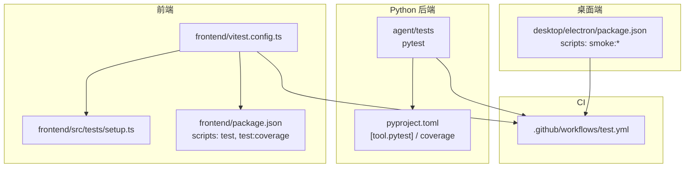
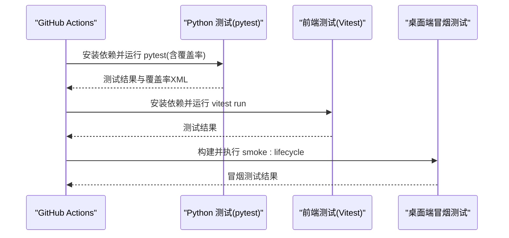
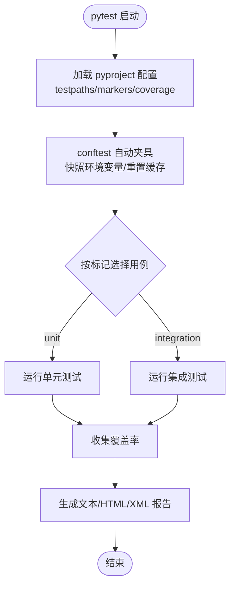
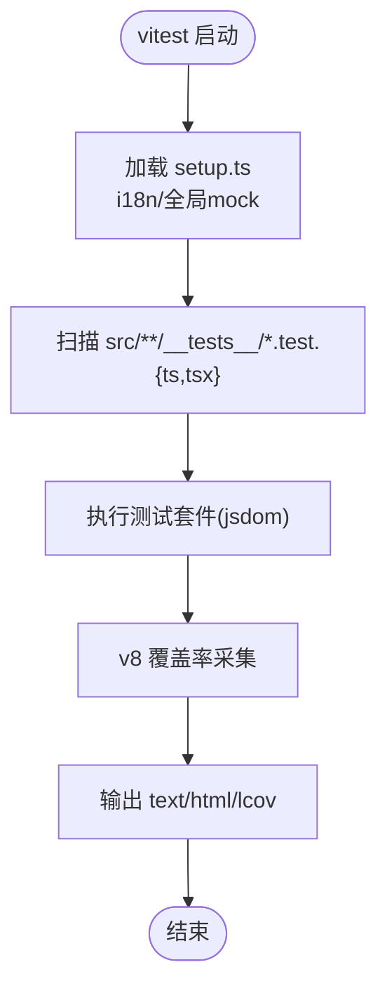
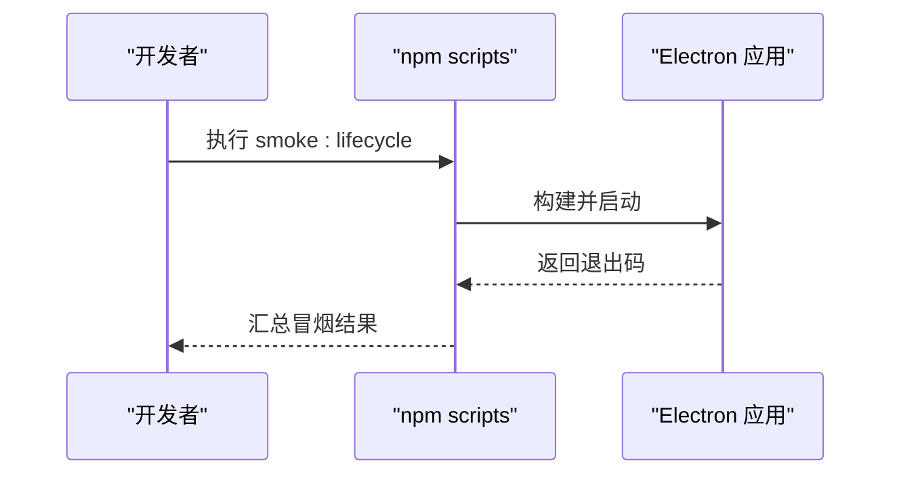
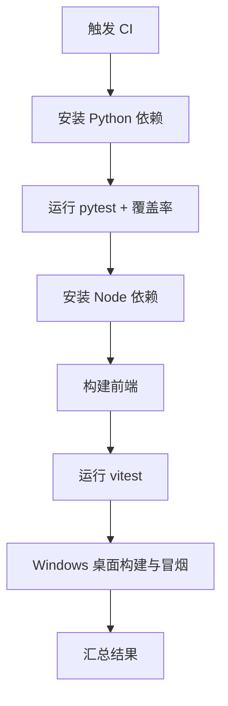
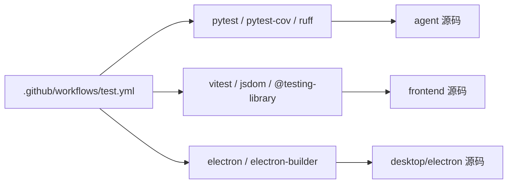

# 测试策略与实践

<cite>
**本文引用的文件**
- [pyproject.toml](file://pyproject.toml)
- [frontend/package.json](file://frontend/package.json)
- [desktop/electron/package.json](file://desktop/electron/package.json)
- [.github/workflows/test.yml](file://.github/workflows/test.yml)
- [agent/tests/conftest.py](file://agent/tests/conftest.py)
- [frontend/vitest.config.ts](file://frontend/vitest.config.ts)
- [frontend/src/tests/setup.ts](file://frontend/src/tests/setup.ts)
</cite>

## 目录
1. [简介](#简介)
2. [项目结构](#项目结构)
3. [核心组件](#核心组件)
4. [架构总览](#架构总览)
5. [详细组件分析](#详细组件分析)
6. [依赖分析](#依赖分析)
7. [性能考虑](#性能考虑)
8. [故障排查指南](#故障排查指南)
9. [结论](#结论)
10. [附录](#附录)

## 简介
本指南面向桌面应用（Electron + Vite/React 前端 + Python 后端）的测试策略与最佳实践，覆盖单元测试、集成测试、端到端测试、数据准备与管理、覆盖率与质量门禁、持续集成流水线、性能与压力测试、安全测试等。内容基于仓库现有配置与脚本进行系统化梳理，帮助团队建立稳定、可维护、可度量的测试体系。

## 项目结构
本项目采用多模块结构：
- Python 后端与量化引擎位于 agent 目录，使用 pytest 组织测试，并通过 pyproject 统一配置测试路径、标记、覆盖率与代码风格。
- 前端位于 frontend 目录，使用 Vite + React + Vitest 进行单元与组件测试，提供 jsdom 环境与全局初始化脚本。
- 桌面客户端位于 desktop/electron 目录，使用 Electron 构建，提供生命周期与本地化冒烟测试脚本。
- CI 在 .github/workflows/test.yml 中编排 Python、前端与桌面端的构建与测试流程。

图表来源
- [pyproject.toml:275-304](file://pyproject.toml#L275-L304)
- [frontend/vitest.config.ts:1-24](file://frontend/vitest.config.ts#L1-L24)
- [frontend/package.json:9-16](file://frontend/package.json#L9-L16)
- [desktop/electron/package.json:9-22](file://desktop/electron/package.json#L9-L22)
- [.github/workflows/test.yml:67-88](file://.github/workflows/test.yml#L67-L88)

章节来源
- [pyproject.toml:275-304](file://pyproject.toml#L275-L304)
- [frontend/vitest.config.ts:1-24](file://frontend/vitest.config.ts#L1-L24)
- [frontend/package.json:9-16](file://frontend/package.json#L9-L16)
- [desktop/electron/package.json:9-22](file://desktop/electron/package.json#L9-L22)
- [.github/workflows/test.yml:67-88](file://.github/workflows/test.yml#L67-L88)

## 核心组件
- Python 测试框架与配置
  - 使用 pytest 作为测试运行器，通过 pyproject 指定测试路径、标记与覆盖率规则。
  - 提供自动隔离环境变量的 fixture，避免测试间污染。
- 前端测试框架与配置
  - 使用 Vitest 作为测试运行器，jsdom 环境，集中式 setup 文件初始化 i18n 与全局 mock。
  - 通过 package.json 暴露 test 与 test:coverage 脚本。
- 桌面端测试
  - 通过 npm scripts 执行本地化、后端解析、生命周期与父进程死亡等冒烟测试。
- CI 流水线
  - 在 GitHub Actions 中并行执行 Python 测试、前端构建与测试、桌面端构建与冒烟测试。

章节来源
- [pyproject.toml:275-304](file://pyproject.toml#L275-L304)
- [agent/tests/conftest.py:1-46](file://agent/tests/conftest.py#L1-L46)
- [frontend/vitest.config.ts:1-24](file://frontend/vitest.config.ts#L1-L24)
- [frontend/src/tests/setup.ts:1-32](file://frontend/src/tests/setup.ts#L1-L32)
- [desktop/electron/package.json:9-22](file://desktop/electron/package.json#L9-L22)
- [.github/workflows/test.yml:67-88](file://.github/workflows/test.yml#L67-L88)

## 架构总览
下图展示测试在 CI 中的执行顺序与职责划分：Python 测试、前端测试与桌面端冒烟测试分别在不同阶段执行，并产出覆盖率报告与构建产物。

图表来源
- [.github/workflows/test.yml:67-88](file://.github/workflows/test.yml#L67-L88)
- [.github/workflows/test.yml:128-165](file://.github/workflows/test.yml#L128-L165)

## 详细组件分析

### Python 后端测试（pytest）
- 测试组织与入口
  - 测试路径由 pyproject 指定为 agent/tests，pythonpath 指向 agent，便于直接导入业务模块。
  - 通过 markers 区分 unit 与 integration，便于选择性执行。
- 环境隔离
  - conftest.py 提供 autouse fixture，在每个测试前后快照并恢复 os.environ，同时重置 EnvConfig 缓存，避免跨测试污染。
- 覆盖率
  - 使用 coverage 统计 agent 源码覆盖率，排除测试与 __init__.py，支持生成缺失行报告与阈值控制。
- 建议
  - 将网络相关用例标记为 integration，并在 CI 中按需启用或跳过。
  - 对数据库/外部服务调用使用 fixtures 或 mock，确保单元测试快速且稳定。

图表来源
- [pyproject.toml:275-304](file://pyproject.toml#L275-L304)
- [agent/tests/conftest.py:16-46](file://agent/tests/conftest.py#L16-L46)

章节来源
- [pyproject.toml:275-304](file://pyproject.toml#L275-L304)
- [agent/tests/conftest.py:1-46](file://agent/tests/conftest.py#L1-L46)

### 前端测试（Vitest + React Testing Library）
- 测试框架与环境
  - 使用 Vitest 作为运行器，jsdom 作为浏览器环境模拟。
  - 通过 setupFiles 引入全局初始化脚本，完成 i18n 初始化与常见 API 的 polyfill/mock。
- 测试范围与覆盖率
  - include 限定 src/**/__tests__ 下的测试文件。
  - 覆盖率 provider 为 v8，输出 text/html/lcov，仅统计 lib 与 stores 目录，排除测试与 tests 目录。
- 建议
  - 组件测试优先使用 React Testing Library 的断言与交互方法。
  - 对外部依赖（如 ECharts ResizeObserver、matchMedia）在 setup 中集中 mock，保证测试稳定性。

图表来源
- [frontend/vitest.config.ts:1-24](file://frontend/vitest.config.ts#L1-L24)
- [frontend/src/tests/setup.ts:1-32](file://frontend/src/tests/setup.ts#L1-L32)

章节来源
- [frontend/vitest.config.ts:1-24](file://frontend/vitest.config.ts#L1-L24)
- [frontend/src/tests/setup.ts:1-32](file://frontend/src/tests/setup.ts#L1-L32)
- [frontend/package.json:9-16](file://frontend/package.json#L9-L16)

### 桌面端测试（Electron 冒烟测试）
- 测试脚本
  - 通过 npm scripts 提供 test:locales、test:backend-resolution、smoke:parent-death、smoke:lifecycle 等命令，用于验证本地化资源、后端解析与生命周期。
- 建议
  - 将关键路径（如 IPC、进程守护、权限校验）纳入 smoke 测试集，确保每次构建后基础能力可用。
  - 在 Windows 平台单独执行生命周期与父进程死亡测试，以覆盖平台差异。

图表来源
- [desktop/electron/package.json:9-22](file://desktop/electron/package.json#L9-L22)

章节来源
- [desktop/electron/package.json:9-22](file://desktop/electron/package.json#L9-L22)

### 持续集成（CI）流水线
- Python 测试
  - 安装锁定依赖，验证可选 extras 可导入，执行 pytest 并生成覆盖率 XML。
- 前端测试
  - 安装 Node 与依赖，构建前端，运行 vitest。
- 桌面端测试
  - 在 Windows 上构建 Electron 并执行 smoke:lifecycle。
- 建议
  - 将覆盖率阈值与失败门控加入 CI，未达标时阻断合并。
  - 将慢速集成测试与网络相关测试分离到独立 job，提高反馈速度。

图表来源
- [.github/workflows/test.yml:1-165](file://.github/workflows/test.yml#L1-L165)

章节来源
- [.github/workflows/test.yml:1-165](file://.github/workflows/test.yml#L1-L165)

## 依赖分析
- Python 层
  - pytest、pytest-cov、pytest-socket 作为开发依赖；coverage 用于覆盖率统计；ruff 用于代码风格检查。
- 前端层
  - vitest、@testing-library/react、jsdom、@vitest/coverage-v8 用于测试与覆盖率。
- 桌面层
  - electron、electron-builder 用于打包与运行；自定义脚本用于冒烟测试。

图表来源
- [pyproject.toml:267-273](file://pyproject.toml#L267-L273)
- [frontend/package.json:40-56](file://frontend/package.json#L40-L56)
- [desktop/electron/package.json:24-28](file://desktop/electron/package.json#L24-L28)
- [.github/workflows/test.yml:67-88](file://.github/workflows/test.yml#L67-L88)

章节来源
- [pyproject.toml:267-273](file://pyproject.toml#L267-L273)
- [frontend/package.json:40-56](file://frontend/package.json#L40-L56)
- [desktop/electron/package.json:24-28](file://desktop/electron/package.json#L24-L28)
- [.github/workflows/test.yml:67-88](file://.github/workflows/test.yml#L67-L88)

## 性能考虑
- 单元测试
  - 保持无网络、无外部依赖的快速测试；使用 fixtures 与 mock 替代真实 I/O。
- 集成测试
  - 对数据库与外部服务使用轻量替代（内存数据库、本地代理），减少等待与抖动。
- 前端渲染
  - 在 jsdom 中合理 mock ResizeObserver、matchMedia 等，避免布局重排导致的性能问题。
- 桌面端
  - 冒烟测试聚焦关键路径，避免全量 UI 自动化带来的不稳定与耗时。
- CI 优化
  - 将慢任务拆分到独立 job，利用缓存（pip/npm）加速安装，必要时并行执行。

## 故障排查指南
- 环境变量泄漏
  - 若出现测试间状态污染，确认是否使用了 conftest 提供的自动夹具进行环境隔离。
- 可选依赖缺失导致跳过
  - CI 会显式安装 openbb、statsmodels/arch 等可选依赖，确保对应测试不被静默跳过。
- 前端测试环境不一致
  - 检查 setup.ts 是否正确初始化 i18n 与全局 mock，确保 jsdom 行为一致。
- 桌面端冒烟失败
  - 检查 Windows 平台构建产物与依赖，确认 electron 版本与脚本路径正确。

章节来源
- [agent/tests/conftest.py:16-46](file://agent/tests/conftest.py#L16-L46)
- [.github/workflows/test.yml:35-49](file://.github/workflows/test.yml#L35-L49)
- [frontend/src/tests/setup.ts:1-32](file://frontend/src/tests/setup.ts#L1-L32)
- [desktop/electron/package.json:9-22](file://desktop/electron/package.json#L9-L22)

## 结论
本项目已具备完善的测试基础设施：Python 侧使用 pytest 与覆盖率工具，前端侧使用 Vitest 与 jsdom，桌面端提供冒烟测试脚本，CI 串联各层测试并产出报告。建议在现有基础上逐步完善：
- 明确 unit/integration 边界，提升单测速度与稳定性。
- 扩展集成测试覆盖面（IPC、数据库、外部服务）。
- 引入覆盖率阈值与质量门禁，结合 CI 阻断低质量变更。
- 补充性能与安全测试用例，形成闭环质量保障。

## 附录
- 常用命令
  - Python 测试与覆盖率：参考 pyproject 配置与 CI 步骤。
  - 前端测试与覆盖率：参考 frontend/package.json 脚本与 vitest 配置。
  - 桌面端冒烟测试：参考 desktop/electron/package.json 脚本。
- 覆盖率阈值与门禁
  - 可在 CI 中增加覆盖率阈值检查，未达标则失败。
- 外部服务模拟
  - 建议使用本地代理或内存数据库，避免真实网络与第三方依赖影响测试稳定性。