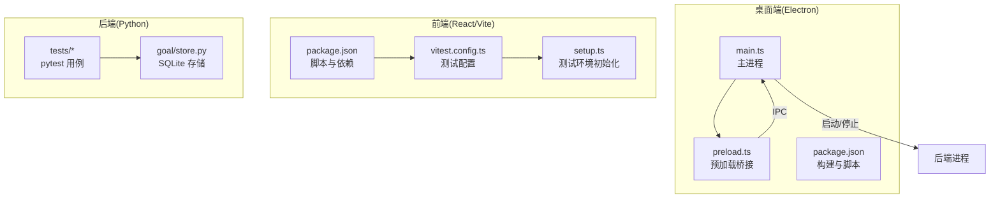
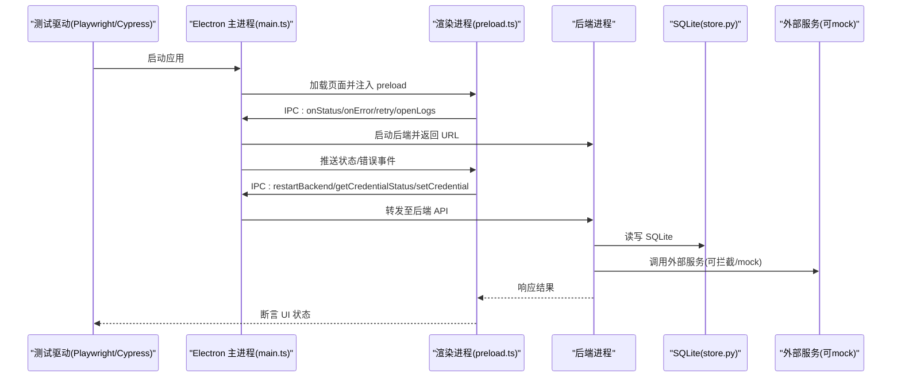
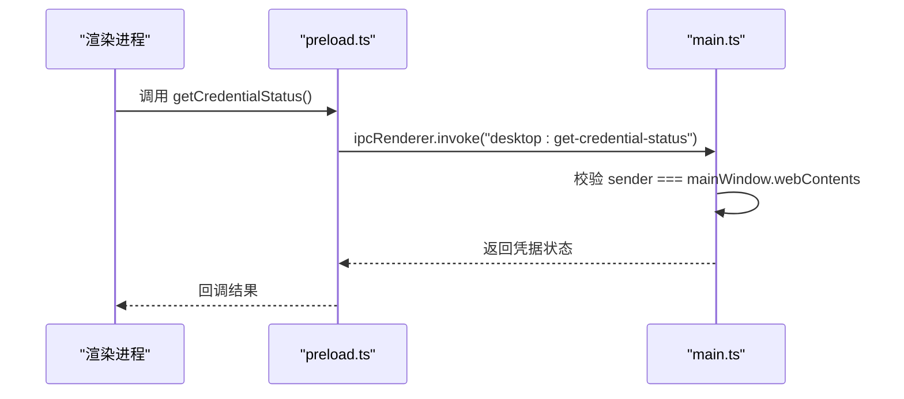
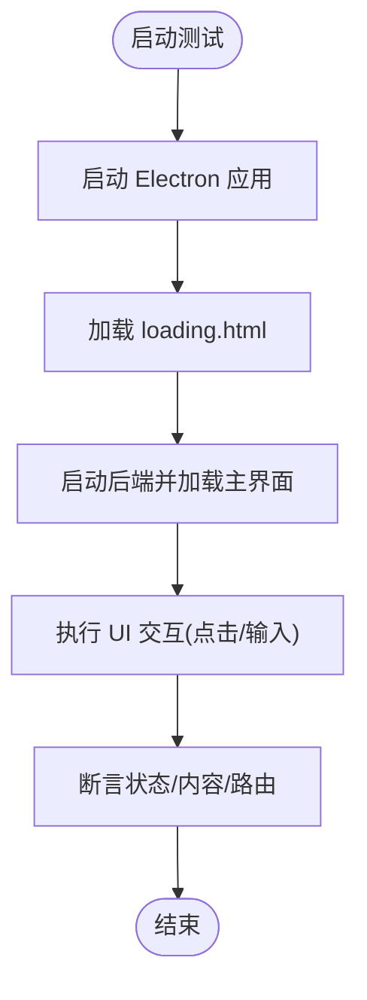
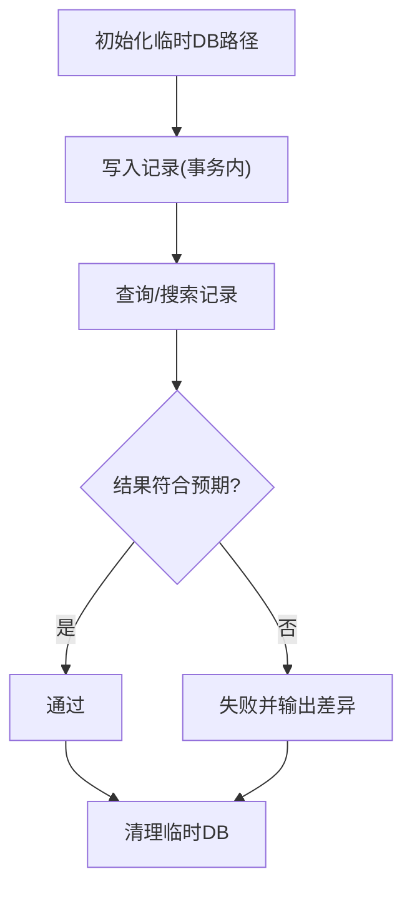
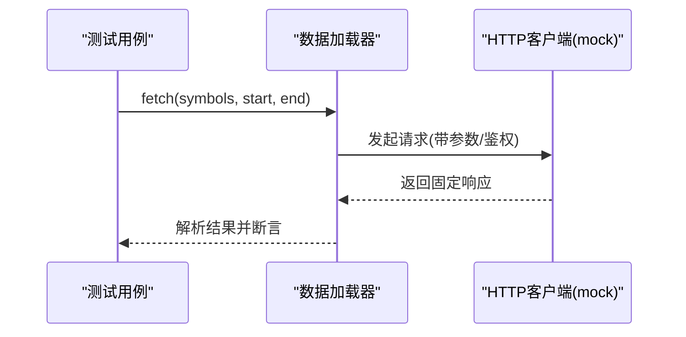
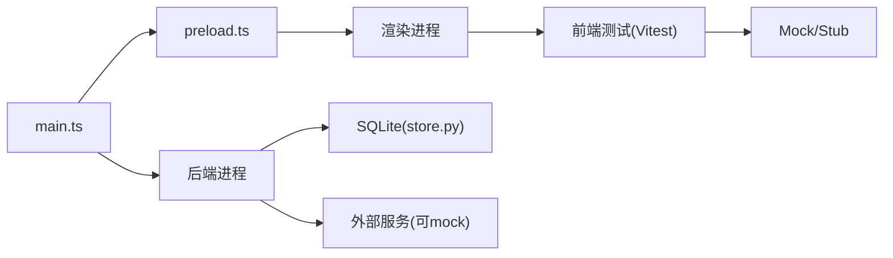

# 集成测试实现

<cite>
**本文引用的文件**
- [desktop/electron/package.json](file://desktop/electron/package.json)
- [desktop/electron/src/main.ts](file://desktop/electron/src/main.ts)
- [desktop/electron/src/preload.ts](file://desktop/electron/src/preload.ts)
- [frontend/package.json](file://frontend/package.json)
- [frontend/vitest.config.ts](file://frontend/vitest.config.ts)
- [frontend/src/tests/setup.ts](file://frontend/src/tests/setup.ts)
- [agent/src/goal/store.py](file://agent/src/goal/store.py)
- [agent/tests/test_session_search.py](file://agent/tests/test_session_search.py)
- [agent/tests/test_eastmoney_loader.py](file://agent/tests/test_eastmoney_loader.py)
- [agent/tests/test_fmp_loader.py](file://agent/tests/test_fmp_loader.py)
- [agent/tests/mcp_http_test_helpers.py](file://agent/tests/mcp_http_test_helpers.py)
</cite>

## 目录
1. [简介](#简介)
2. [项目结构](#项目结构)
3. [核心组件](#核心组件)
4. [架构总览](#架构总览)
5. [详细组件分析](#详细组件分析)
6. [依赖关系分析](#依赖关系分析)
7. [性能考虑](#性能考虑)
8. [故障排查指南](#故障排查指南)
9. [结论](#结论)
10. [附录](#附录)

## 简介
本指南面向桌面端（Electron）应用的端到端集成测试，覆盖以下目标：
- 使用 Playwright 或 Cypress 对 Electron 应用进行启动、页面交互与窗口管理测试。
- 针对主进程与渲染进程的 IPC 通信进行测试，包括消息传递、事件处理与错误处理。
- 针对 SQLite 数据库的测试配置、数据持久化与事务行为进行验证。
- 对外部服务（API/网络）进行模拟与拦截，确保第三方依赖不影响测试稳定性。
- 提供完整测试场景示例，涵盖用户工作流、错误恢复与性能边界。
- 给出测试数据的准备与管理策略。

本仓库已具备前端单元测试基础设施（Vitest + jsdom），以及后端 Python 测试生态（pytest）。桌面端脚本中已有若干冒烟测试脚本用于生命周期与本地化等基础验证。本文将在此基础上，补充端到端集成测试方案与落地建议。

## 项目结构
本项目由三大部分组成：
- 桌面端（Electron）：负责应用壳、主进程、预加载脚本、后端进程管理与 IPC 暴露。
- 前端（React/Vite）：业务界面，包含基于 Vitest 的单元测试与测试环境初始化。
- 后端（Python Agent）：业务逻辑、工具链、数据存储（SQLite）、外部数据源加载器与 API。

图表来源
- [desktop/electron/src/main.ts:1-285](file://desktop/electron/src/main.ts#L1-L285)
- [desktop/electron/src/preload.ts:1-18](file://desktop/electron/src/preload.ts#L1-L18)
- [desktop/electron/package.json:1-86](file://desktop/electron/package.json#L1-L86)
- [frontend/vitest.config.ts:1-24](file://frontend/vitest.config.ts#L1-L24)
- [frontend/src/tests/setup.ts:1-32](file://frontend/src/tests/setup.ts#L1-L32)
- [agent/src/goal/store.py:1-55](file://agent/src/goal/store.py#L1-L55)

章节来源
- [desktop/electron/package.json:1-86](file://desktop/electron/package.json#L1-L86)
- [frontend/package.json:1-58](file://frontend/package.json#L1-L58)

## 核心组件
- 桌面端主进程（main.ts）
  - 创建 BrowserWindow、设置安全策略、注入预加载脚本、注册 IPC 通道、启动/停止后端进程、处理关闭流程与错误上报。
  - 通过 webRequest 为本地后端请求自动注入鉴权头，限制导航到受信任来源。
- 预加载桥接（preload.ts）
  - 向渲染进程暴露受限 API（状态订阅、错误订阅、重试、打开日志、重启后端、凭据管理等）。
- 前端测试环境（vitest.config.ts、setup.ts）
  - 使用 jsdom 环境、全局 mocks（ResizeObserver、matchMedia）、i18n 初始化、测试范围与覆盖率配置。
- 后端 SQLite 存储（goal/store.py）
  - 以 SQLite 作为研究目标的持久化存储，支持会话/审计/证据等数据结构，路径可通过环境变量覆盖。
- 后端测试（pytest）
  - 大量 HTTP 层 mock、临时目录隔离、并发与配置覆盖测试，适合扩展端到端场景。

章节来源
- [desktop/electron/src/main.ts:1-285](file://desktop/electron/src/main.ts#L1-L285)
- [desktop/electron/src/preload.ts:1-18](file://desktop/electron/src/preload.ts#L1-L18)
- [frontend/vitest.config.ts:1-24](file://frontend/vitest.config.ts#L1-L24)
- [frontend/src/tests/setup.ts:1-32](file://frontend/src/tests/setup.ts#L1-L32)
- [agent/src/goal/store.py:1-55](file://agent/src/goal/store.py#L1-L55)

## 架构总览
下图展示端到端集成测试在桌面端的执行路径：测试驱动 Electron 启动 → 渲染进程通过预加载桥调用 IPC → 主进程协调后端进程与 UI → 后端访问 SQLite 与外部服务（可被 mock）。

图表来源
- [desktop/electron/src/main.ts:1-285](file://desktop/electron/src/main.ts#L1-L285)
- [desktop/electron/src/preload.ts:1-18](file://desktop/electron/src/preload.ts#L1-L18)
- [agent/src/goal/store.py:1-55](file://agent/src/goal/store.py#L1-L55)

## 详细组件分析

### 桌面端 IPC 通信测试要点
- 主进程暴露的 IPC 通道
  - desktop:retry / desktop:open-logs / desktop:restart-backend / desktop:get-credential-status / desktop:set-credential
  - 事件推送：desktop:status / desktop:error
- 预加载桥将上述能力暴露给渲染进程，供 UI 调用。
- 安全校验：所有 IPC 均会校验发送者是否为主窗口的 WebContents，防止跨上下文滥用。

图表来源
- [desktop/electron/src/preload.ts:1-18](file://desktop/electron/src/preload.ts#L1-L18)
- [desktop/electron/src/main.ts:119-146](file://desktop/electron/src/main.ts#L119-L146)

章节来源
- [desktop/electron/src/main.ts:119-146](file://desktop/electron/src/main.ts#L119-L146)
- [desktop/electron/src/preload.ts:1-18](file://desktop/electron/src/preload.ts#L1-L18)

### 页面交互与窗口管理测试
- 窗口创建与安全策略
  - 启用 contextIsolation、禁用 nodeIntegration、沙箱模式；仅允许特定协议的外部链接打开。
  - 对本地后端请求自动注入 Authorization 头，限制导航到同源。
- 测试建议
  - 使用 Playwright 的 Electron 浏览器类型或 Cypress 的 Electron 插件启动应用。
  - 断言窗口尺寸、标题、菜单项可见性；验证 loading 页面到主界面的过渡。
  - 触发“重启后端”、“打开日志”等动作，断言状态提示与系统行为。

图表来源
- [desktop/electron/src/main.ts:65-117](file://desktop/electron/src/main.ts#L65-L117)
- [desktop/electron/src/main.ts:148-192](file://desktop/electron/src/main.ts#L148-L192)

章节来源
- [desktop/electron/src/main.ts:65-117](file://desktop/electron/src/main.ts#L65-L117)
- [desktop/electron/src/main.ts:148-192](file://desktop/electron/src/main.ts#L148-L192)

### 数据库操作测试（SQLite）
- 存储位置与环境变量
  - 默认数据库路径位于运行时根目录下的 sessions.db，可通过环境变量覆盖。
- 测试策略
  - 使用临时目录作为数据库路径，确保测试隔离。
  - 验证写入、查询、更新、删除等操作的原子性与一致性。
  - 结合 FTS5 搜索索引，验证跨会话检索能力。
- 参考用例
  - 会话搜索索引的插入与检索、FTS5 可用性降级处理。

图表来源
- [agent/src/goal/store.py:1-55](file://agent/src/goal/store.py#L1-L55)
- [agent/tests/test_session_search.py:13-40](file://agent/tests/test_session_search.py#L13-L40)

章节来源
- [agent/src/goal/store.py:1-55](file://agent/src/goal/store.py#L1-L55)
- [agent/tests/test_session_search.py:13-40](file://agent/tests/test_session_search.py#L13-L40)

### 外部服务集成测试（API 调用模拟与网络拦截）
- 数据加载器测试
  - 通过 patch/mock 替换 HTTP 客户端，构造固定响应，验证参数组装、URL 拼接、异常分支与批量容错。
- MCP 测试辅助
  - 提供 HTTP/SSE/Streamable HTTP 的假服务器与诊断信息，便于端到端验证。
- 建议
  - 对所有外部依赖使用 stub/mock，保证测试确定性。
  - 对关键路径（如认证、限流、超时）编写回归用例。

图表来源
- [agent/tests/test_eastmoney_loader.py:166-191](file://agent/tests/test_eastmoney_loader.py#L166-L191)
- [agent/tests/test_fmp_loader.py:113-144](file://agent/tests/test_fmp_loader.py#L113-L144)
- [agent/tests/mcp_http_test_helpers.py:36-56](file://agent/tests/mcp_http_test_helpers.py#L36-L56)

章节来源
- [agent/tests/test_eastmoney_loader.py:166-191](file://agent/tests/test_eastmoney_loader.py#L166-L191)
- [agent/tests/test_fmp_loader.py:113-144](file://agent/tests/test_fmp_loader.py#L113-L144)
- [agent/tests/mcp_http_test_helpers.py:36-56](file://agent/tests/mcp_http_test_helpers.py#L36-L56)

### 前端测试环境与配置
- 使用 Vitest + jsdom 运行组件级测试，统一 i18n、全局 API mock、定时器与重连逻辑验证。
- 覆盖率统计与测试范围控制，避免污染生产代码。
- 建议在端到端测试中复用这些 mock 策略，减少耦合。

章节来源
- [frontend/vitest.config.ts:1-24](file://frontend/vitest.config.ts#L1-L24)
- [frontend/src/tests/setup.ts:1-32](file://frontend/src/tests/setup.ts#L1-L32)
- [frontend/package.json:1-58](file://frontend/package.json#L1-L58)

## 依赖关系分析
- 桌面端依赖
  - main.ts 依赖 BackendManager、SecureCredentialStore、locales 等模块，并通过 IPC 与渲染进程通信。
  - package.json 定义了构建、打包与冒烟测试脚本。
- 前端依赖
  - vitest.config.ts 与 setup.ts 构成测试基座，配合 React Testing Library 进行组件测试。
- 后端依赖
  - goal/store.py 提供 SQLite 存储；测试通过 pytest 组织，广泛使用 monkeypatch 与临时目录。

图表来源
- [desktop/electron/src/main.ts:1-285](file://desktop/electron/src/main.ts#L1-L285)
- [desktop/electron/src/preload.ts:1-18](file://desktop/electron/src/preload.ts#L1-L18)
- [agent/src/goal/store.py:1-55](file://agent/src/goal/store.py#L1-L55)

章节来源
- [desktop/electron/package.json:1-86](file://desktop/electron/package.json#L1-L86)
- [frontend/package.json:1-58](file://frontend/package.json#L1-L58)

## 性能考虑
- 端到端测试应最小化真实 I/O：优先使用内存数据库或临时文件，缩短启动时间。
- 合理设置等待策略：避免硬编码 sleep，采用事件驱动（如状态推送、页面就绪）提升稳定性。
- 并行执行：按功能域拆分测试套件，利用 CI 并行加速。
- 资源回收：确保每次测试后清理临时目录、关闭连接、重置全局状态。

## 故障排查指南
- 启动失败
  - 检查主进程错误上报通道（desktop:error）与日志路径，确认后端启动与端口占用情况。
- IPC 拒绝
  - 若收到“Desktop request rejected”，检查发送者是否为当前主窗口 WebContents。
- 凭据不可用
  - 当 SecureCredentialStore 未初始化时，相关 IPC 会抛出错误；需在测试前完成初始化。
- 数据库问题
  - 确认数据库路径可写、权限正确；必要时切换到临时路径以避免冲突。
- 外部服务不稳定
  - 使用 mock/stub 替代真实网络请求，确保测试可重复执行。

章节来源
- [desktop/electron/src/main.ts:206-210](file://desktop/electron/src/main.ts#L206-L210)
- [desktop/electron/src/main.ts:240-247](file://desktop/electron/src/main.ts#L240-L247)
- [agent/src/goal/store.py:1-55](file://agent/src/goal/store.py#L1-L55)

## 结论
本指南基于现有代码库的前端测试基础设施与后端测试实践，提出了完整的桌面端集成测试方案。通过 Playwright 或 Cypress 驱动 Electron，结合 IPC 通道、SQLite 存储与外部服务 mock，可实现稳定、可维护的端到端测试。建议在 CI 中分层执行：单元/组件测试快速反馈，端到端测试覆盖关键用户路径与错误恢复场景。

## 附录
- 推荐测试框架与工具
  - Playwright：原生支持 Electron，具备强大的定位与网络拦截能力。
  - Cypress：通过 Electron 插件也可实现桌面端自动化，生态丰富。
- 测试数据策略
  - 使用临时目录与固定种子数据，确保幂等与可重现。
  - 对敏感信息使用环境变量注入，避免硬编码。
- 持续集成建议
  - 分层测试：单元/组件/端到端分离执行。
  - 缓存依赖与构建产物，缩短流水线时间。
  - 生成报告与截图/视频，便于失败定位。