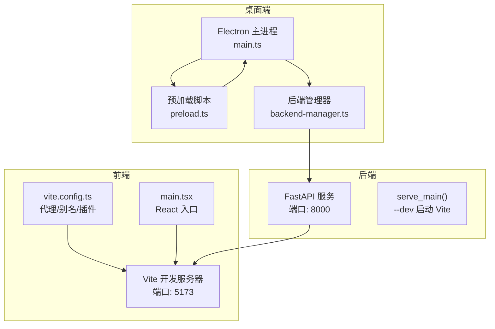
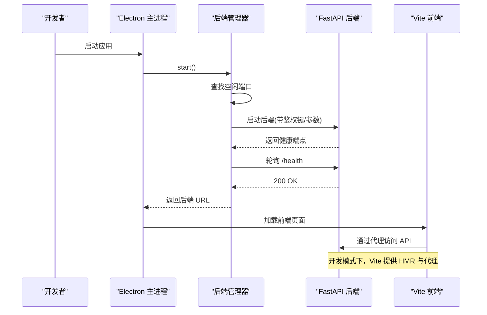
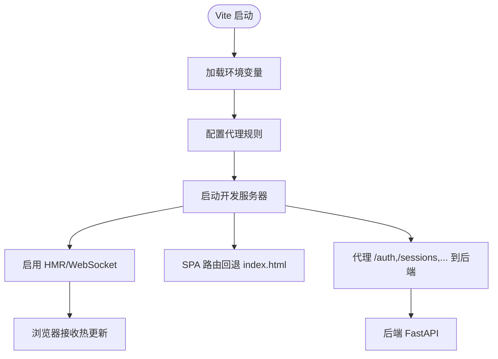
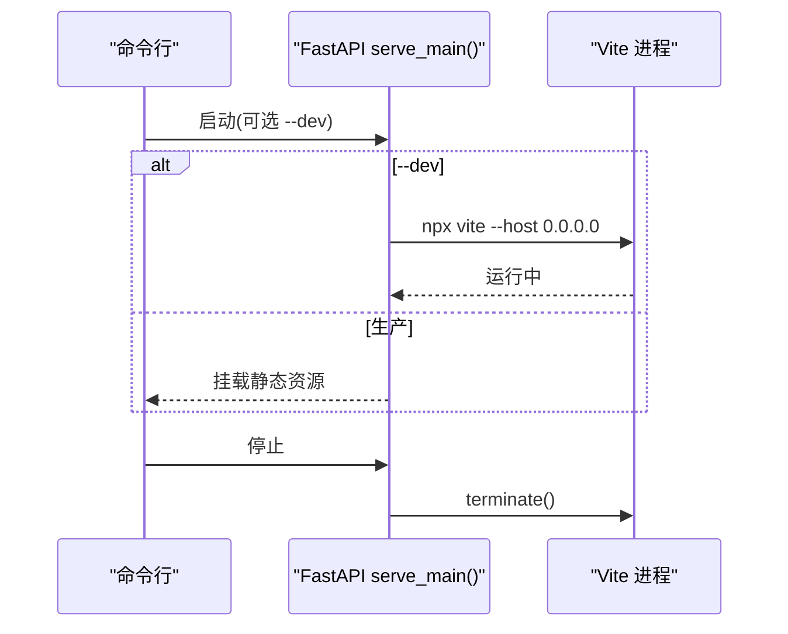
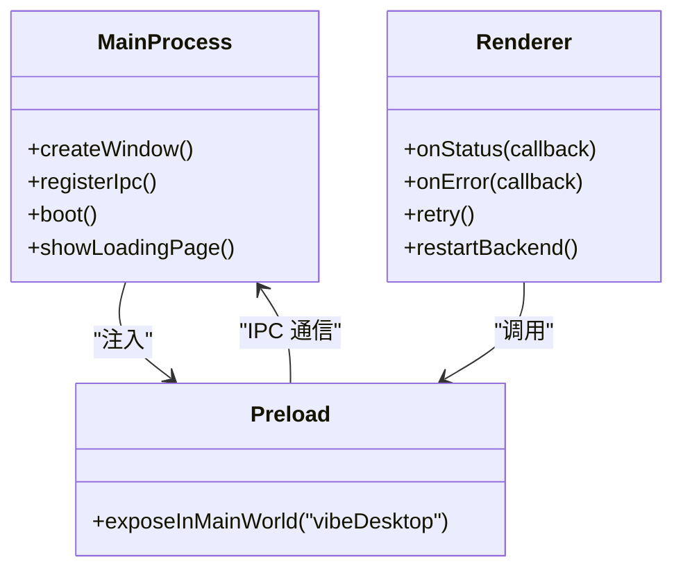
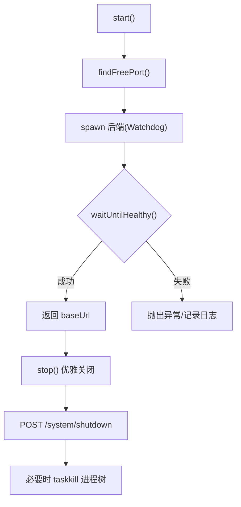
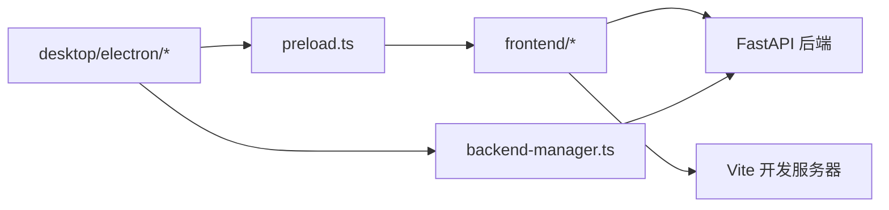

# 热重载开发

<cite>
**本文引用的文件**
- [vite.config.ts](file://frontend/vite.config.ts)
- [package.json（前端）](file://frontend/package.json)
- [main.tsx（前端入口）](file://frontend/src/main.tsx)
- [api_server.py](file://agent/api_server.py)
- [main.ts（Electron 主进程）](file://desktop/electron/src/main.ts)
- [preload.ts（预加载脚本）](file://desktop/electron/src/preload.ts)
- [backend-manager.ts](file://desktop/electron/src/backend-manager.ts)
- [package.json（Electron 桌面端）](file://desktop/electron/package.json)
</cite>

## 目录
1. [简介](#简介)
2. [项目结构](#项目结构)
3. [核心组件](#核心组件)
4. [架构总览](#架构总览)
5. [详细组件分析](#详细组件分析)
6. [依赖关系分析](#依赖关系分析)
7. [性能考虑](#性能考虑)
8. [故障排除指南](#故障排除指南)
9. [结论](#结论)
10. [附录](#附录)

## 简介
本指南聚焦于 Vibe-Trading 在 Electron + Vite + Python FastAPI 组合下的“热重载开发体验”。内容覆盖：
- Electron 开发模式下的源码监听与后端启动流程
- TypeScript/JavaScript 变更检测、模块热更新、静态资源自动刷新
- Vite 开发服务器配置（React 组件热重载、样式实时更新、API 接口代理与模拟）
- 主进程与渲染进程的协调机制（IPC、状态保持、数据同步策略）
- 构建系统优化（增量编译、缓存、并行处理）
- 开发服务器启动流程（依赖检查、端口占用检测、健康检查）
- 常见问题排查与最佳实践

## 项目结构
本项目采用多子工程组织：
- frontend：基于 Vite 的 React 前端，提供开发服务器、HMR、SPA 路由与 API 代理。
- agent：Python FastAPI 后端服务，支持本地开发时拉起 Vite 前端。
- desktop/electron：Electron 桌面壳层，负责启动后端、管理生命周期、注入安全上下文并桥接 IPC。

图表来源
- [vite.config.ts:22-57](file://frontend/vite.config.ts#L22-L57)
- [api_server.py:360-415](file://agent/api_server.py#L360-L415)
- [main.ts:49-192](file://desktop/electron/src/main.ts#L49-L192)
- [backend-manager.ts:63-146](file://desktop/electron/src/backend-manager.ts#L63-L146)

章节来源
- [vite.config.ts:22-57](file://frontend/vite.config.ts#L22-L57)
- [api_server.py:360-415](file://agent/api_server.py#L360-L415)
- [main.ts:49-192](file://desktop/electron/src/main.ts#L49-L192)
- [backend-manager.ts:63-146](file://desktop/electron/src/backend-manager.ts#L63-L146)

## 核心组件
- 前端 Vite 开发服务器：提供 React HMR、样式热更新、静态资源刷新；通过代理将 API 请求转发到后端。
- 后端 FastAPI 服务：默认监听本地回环地址；开发模式下可拉起 Vite 前端。
- Electron 主进程：创建窗口、注入预加载脚本、启动/守护后端、健康检查、错误上报。
- 后端管理器：解析可执行路径、选择端口、启动 Watchdog、日志采集、优雅关闭。
- 预加载脚本：暴露安全的桌面能力给渲染进程（状态、错误、重启等）。

章节来源
- [vite.config.ts:22-57](file://frontend/vite.config.ts#L22-L57)
- [api_server.py:360-415](file://agent/api_server.py#L360-L415)
- [main.ts:49-192](file://desktop/electron/src/main.ts#L49-L192)
- [backend-manager.ts:63-146](file://desktop/electron/src/backend-manager.ts#L63-L146)
- [preload.ts:1-18](file://desktop/electron/src/preload.ts#L1-L18)

## 架构总览
下图展示了从 Electron 启动到前后端联调的完整链路，包括端口分配、健康检查、HMR 与代理。

图表来源
- [backend-manager.ts:63-146](file://desktop/electron/src/backend-manager.ts#L63-L146)
- [api_server.py:360-415](file://agent/api_server.py#L360-L415)
- [main.ts:159-192](file://desktop/electron/src/main.ts#L159-L192)
- [vite.config.ts:22-57](file://frontend/vite.config.ts#L22-L57)

## 详细组件分析

### 前端 Vite 开发服务器与热重载
- React 组件热重载：启用 @vitejs/plugin-react，实现组件级 HMR。
- 样式实时更新：Tailwind + PostCSS 在开发模式下即时编译。
- API 接口代理与模拟：通过 server.proxy 将特定前缀请求转发至后端；对 SPA 路由提供 index.html 回退，避免浏览器导航 404。
- 环境变量：通过 loadEnv 读取 VITE_API_URL 控制代理目标。

图表来源
- [vite.config.ts:22-57](file://frontend/vite.config.ts#L22-L57)

章节来源
- [vite.config.ts:22-57](file://frontend/vite.config.ts#L22-L57)
- [package.json（前端）:9-15](file://frontend/package.json#L9-L15)
- [main.tsx:1-36](file://frontend/src/main.tsx#L1-L36)

### 后端 FastAPI 开发模式与 Vite 联动
- 当传入 --dev 时，后端会拉起 Vite 开发服务器（默认 5173），并在退出时终止该进程。
- 生产模式则直接挂载已构建的前端静态资源。

图表来源
- [api_server.py:360-415](file://agent/api_server.py#L360-L415)

章节来源
- [api_server.py:360-415](file://agent/api_server.py#L360-L415)

### Electron 主进程与渲染进程的热重载协调
- 主进程负责创建窗口、注入 preload、设置安全策略、打开调试工具（开发模式）、菜单项触发重启后端。
- 通过 IPC 暴露重试、打开日志、重启后端、凭据管理等能力。
- 渲染进程通过 window.vibeDesktop 调用这些能力，实现状态提示与错误上报。

图表来源
- [main.ts:65-146](file://desktop/electron/src/main.ts#L65-L146)
- [preload.ts:1-18](file://desktop/electron/src/preload.ts#L1-L18)

章节来源
- [main.ts:65-146](file://desktop/electron/src/main.ts#L65-L146)
- [preload.ts:1-18](file://desktop/electron/src/preload.ts#L1-L18)

### 后端管理器：端口检测、健康检查与优雅关闭
- 端口占用检测：使用临时 TCP 服务器绑定 0 端口获取空闲端口。
- 健康检查：轮询后端 /health，直至成功或超时。
- 优雅关闭：先发送 shutdown 请求，再尝试通知 watchdog 终止后端进程树。

图表来源
- [backend-manager.ts:63-146](file://desktop/electron/src/backend-manager.ts#L63-L146)
- [backend-manager.ts:148-187](file://desktop/electron/src/backend-manager.ts#L148-L187)
- [backend-manager.ts:261-286](file://desktop/electron/src/backend-manager.ts#L261-L286)
- [backend-manager.ts:413-429](file://desktop/electron/src/backend-manager.ts#L413-L429)

章节来源
- [backend-manager.ts:63-146](file://desktop/electron/src/backend-manager.ts#L63-L146)
- [backend-manager.ts:148-187](file://desktop/electron/src/backend-manager.ts#L148-L187)
- [backend-manager.ts:261-286](file://desktop/electron/src/backend-manager.ts#L261-L286)
- [backend-manager.ts:413-429](file://desktop/electron/src/backend-manager.ts#L413-L429)

### 构建系统与性能优化
- 前端分包：按 react/react-dom/react-router 与 echarts 拆分 vendor 包，提升缓存命中与并行加载。
- 增量编译：Vite 默认基于 ESBuild/Rollup 的增量编译，配合 HMR 实现秒级反馈。
- 并行处理：Node 事件循环与 Vite 插件管线天然并行化；大型依赖按需懒加载（如图表组件）。

章节来源
- [vite.config.ts:68-78](file://frontend/vite.config.ts#L68-L78)
- [package.json（前端）:9-15](file://frontend/package.json#L9-L15)

## 依赖关系分析
- 前端依赖 Vite 与 React 插件，通过代理与后端解耦。
- 后端在开发模式下依赖 Vite 进程，在生产模式直接提供静态资源。
- Electron 主进程依赖后端管理器，后者负责后端生命周期与健康检查。
- 预加载脚本作为安全边界，仅暴露必要能力给渲染进程。

图表来源
- [vite.config.ts:22-57](file://frontend/vite.config.ts#L22-L57)
- [api_server.py:360-415](file://agent/api_server.py#L360-L415)
- [backend-manager.ts:63-146](file://desktop/electron/src/backend-manager.ts#L63-L146)
- [preload.ts:1-18](file://desktop/electron/src/preload.ts#L1-L18)

章节来源
- [vite.config.ts:22-57](file://frontend/vite.config.ts#L22-L57)
- [api_server.py:360-415](file://agent/api_server.py#L360-L415)
- [backend-manager.ts:63-146](file://desktop/electron/src/backend-manager.ts#L63-L146)
- [preload.ts:1-18](file://desktop/electron/src/preload.ts#L1-L18)

## 性能考虑
- 使用 HMR 减少全量刷新，优先局部更新组件与样式。
- 合理分包 vendor 代码，提高缓存命中率。
- 开发时仅加载必要功能，图表等重型模块按需导入。
- 后端健康检查与端口检测避免阻塞启动流程。
- 日志输出限制最近条数，避免内存增长。

[本节为通用指导，不直接分析具体文件]

## 故障排除指南
- 文件监听失败
  - 现象：修改 TS/JS/CSS 后无热更新。
  - 排查：确认 Vite 开发服务器是否运行；检查代理路径是否正确；确认浏览器未缓存旧资源。
  - 参考：[vite.config.ts:22-57](file://frontend/vite.config.ts#L22-L57)

- 编译错误导致 HMR 中断
  - 现象：控制台报错，页面不更新。
  - 排查：修复 TypeScript/JS 语法错误；查看 Vite 控制台输出；必要时重启 dev 服务器。
  - 参考：[package.json（前端）:9-15](file://frontend/package.json#L9-L15)

- 浏览器缓存问题
  - 现象：更新后仍显示旧版本。
  - 排查：硬刷新；清除缓存；检查 Service Worker（如有）；确保代理返回最新资源。
  - 参考：[vite.config.ts:22-57](file://frontend/vite.config.ts#L22-L57)

- 端口占用
  - 现象：后端无法启动或 Vite 无法绑定端口。
  - 排查：使用空闲端口检测逻辑；结束占用进程；调整端口配置。
  - 参考：[backend-manager.ts:413-429](file://desktop/electron/src/backend-manager.ts#L413-L429)

- 后端健康检查超时
  - 现象：Electron 启动后长时间停留在加载页。
  - 排查：检查后端是否启动成功；查看健康端点；确认鉴权头传递正确。
  - 参考：[backend-manager.ts:261-286](file://desktop/electron/src/backend-manager.ts#L261-L286)

- 主进程崩溃或后端意外退出
  - 现象：弹出错误对话框或状态提示。
  - 排查：查看日志目录；通过菜单“重启服务”恢复；检查 Watchdog 消息。
  - 参考：[main.ts:206-210](file://desktop/electron/src/main.ts#L206-L210)
  - 参考：[backend-manager.ts:237-259](file://desktop/electron/src/backend-manager.ts#L237-L259)

- 代理 404 或 SPA 路由失效
  - 现象：浏览器直接访问 /runs/{id} 出现 404。
  - 排查：确认 vite.config 中对 SPA 路由的 index.html 回退配置。
  - 参考：[vite.config.ts:44-56](file://frontend/vite.config.ts#L44-L56)

章节来源
- [vite.config.ts:22-57](file://frontend/vite.config.ts#L22-L57)
- [package.json（前端）:9-15](file://frontend/package.json#L9-L15)
- [backend-manager.ts:261-286](file://desktop/electron/src/backend-manager.ts#L261-L286)
- [backend-manager.ts:413-429](file://desktop/electron/src/backend-manager.ts#L413-L429)
- [main.ts:206-210](file://desktop/electron/src/main.ts#L206-L210)
- [backend-manager.ts:237-259](file://desktop/electron/src/backend-manager.ts#L237-L259)

## 结论
本项目通过 Vite 的 HMR、FastAPI 的开发模式联动以及 Electron 的主进程管理，实现了高效的“保存即见”开发体验。合理的代理配置、健康检查与端口检测保障了启动稳定性；按需分包与增量编译提升了性能。遵循本文的排障步骤与最佳实践，可显著降低开发过程中的摩擦成本。

[本节为总结性内容，不直接分析具体文件]

## 附录
- 常用命令
  - 前端开发：npm run dev（启动 Vite）
  - 后端开发：python api_server.py --port 8000 --dev（拉起 Vite 前端）
  - 桌面端打包：参考 electron package.json scripts
- 关键配置位置
  - 前端代理与别名：vite.config.ts
  - 后端开发模式：api_server.py
  - 主进程与 IPC：main.ts、preload.ts
  - 后端生命周期：backend-manager.ts

章节来源
- [package.json（前端）:9-15](file://frontend/package.json#L9-L15)
- [api_server.py:360-415](file://agent/api_server.py#L360-L415)
- [package.json（Electron 桌面端）:9-23](file://desktop/electron/package.json#L9-L23)
- [vite.config.ts:22-57](file://frontend/vite.config.ts#L22-L57)
- [main.ts:49-192](file://desktop/electron/src/main.ts#L49-L192)
- [preload.ts:1-18](file://desktop/electron/src/preload.ts#L1-L18)
- [backend-manager.ts:63-146](file://desktop/electron/src/backend-manager.ts#L63-L146)