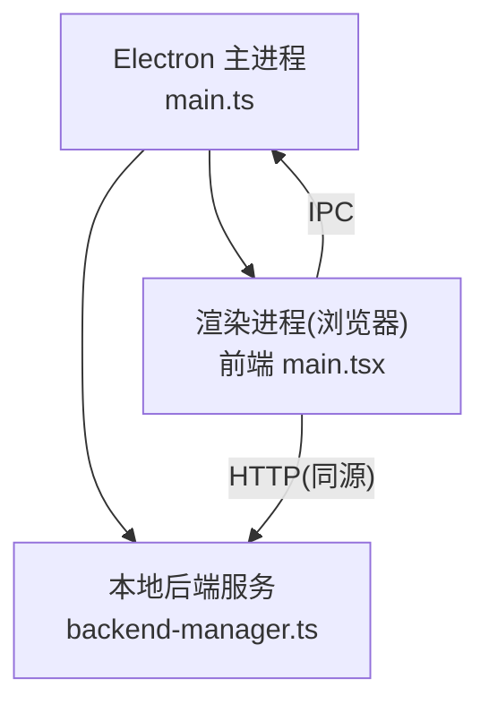
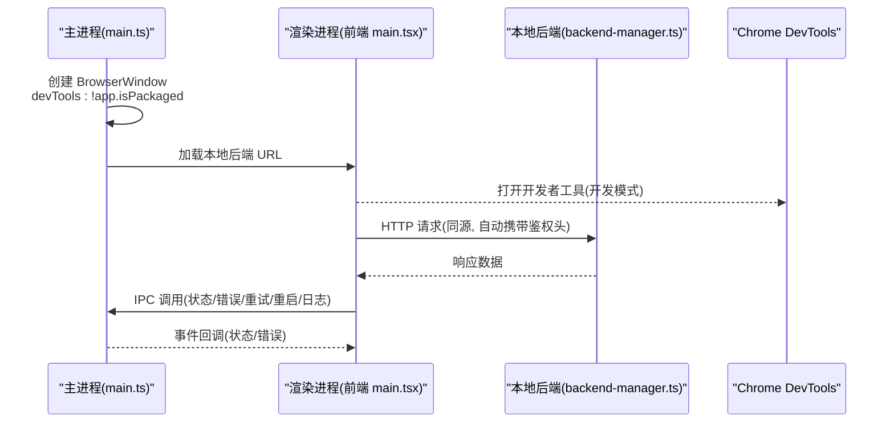
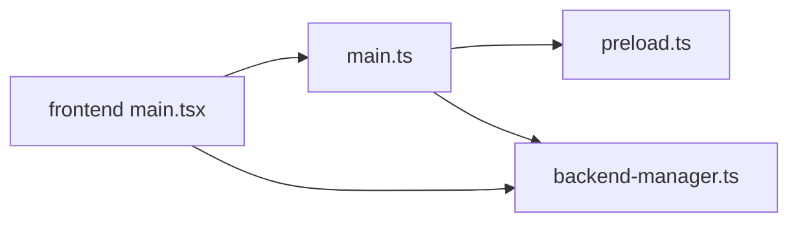

# Chrome DevTools 调试

<cite>
**本文引用的文件**
- [desktop/electron/src/main.ts](file://desktop/electron/src/main.ts)
- [desktop/electron/src/preload.ts](file://desktop/electron/src/preload.ts)
- [desktop/electron/src/backend-manager.ts](file://desktop/electron/src/backend-manager.ts)
- [desktop/electron/package.json](file://desktop/electron/package.json)
- [frontend/src/main.tsx](file://frontend/src/main.tsx)
</cite>

## 目录
1. [简介](#简介)
2. [项目结构](#项目结构)
3. [核心组件](#核心组件)
4. [架构总览](#架构总览)
5. [详细组件分析](#详细组件分析)
6. [依赖关系分析](#依赖关系分析)
7. [性能考虑](#性能考虑)
8. [故障排查指南](#故障排查指南)
9. [结论](#结论)
10. [附录](#附录)

## 简介
本指南面向在 Electron 桌面应用中调试 Vibe-Trading 的开发者，聚焦于如何在主进程与渲染进程中启用并高效使用 Chrome DevTools，涵盖断点调试、网络请求监控、控制台技巧、IPC 通信调试以及性能分析（内存快照、CPU/渲染性能）等。文档基于仓库中的 Electron 壳层与前端入口代码，提供可操作的步骤与最佳实践。

## 项目结构
Vibe-Trading 的桌面端由 Electron 壳层（TypeScript）承载一个本地后端服务（Python FastAPI），并通过浏览器窗口加载前端 React 应用。关键路径：
- Electron 主进程：负责创建窗口、启动本地后端、注入安全上下文与 IPC。
- Preload 脚本：通过 contextBridge 暴露安全的 API 给渲染进程。
- 前端入口：React 应用初始化与路由挂载。

图表来源
- [desktop/electron/src/main.ts:65-117](file://desktop/electron/src/main.ts#L65-L117)
- [desktop/electron/src/preload.ts:1-18](file://desktop/electron/src/preload.ts#L1-L18)
- [desktop/electron/src/backend-manager.ts:63-146](file://desktop/electron/src/backend-manager.ts#L63-L146)
- [frontend/src/main.tsx:28-35](file://frontend/src/main.tsx#L28-L35)

章节来源
- [desktop/electron/src/main.ts:65-117](file://desktop/electron/src/main.ts#L65-L117)
- [desktop/electron/src/preload.ts:1-18](file://desktop/electron/src/preload.ts#L1-L18)
- [desktop/electron/src/backend-manager.ts:63-146](file://desktop/electron/src/backend-manager.ts#L63-L146)
- [frontend/src/main.tsx:28-35](file://frontend/src/main.tsx#L28-L35)

## 核心组件
- 主进程窗口配置与 DevTools 开关：在非打包模式下启用开发者工具，便于开发期调试。
- 预加载脚本：向渲染进程暴露受限的桌面能力（状态、错误、重试、日志、重启后端、凭据管理）。
- 后端管理器：启动本地后端、健康检查、日志捕获、优雅关闭与进程守护。
- 前端入口：React 应用初始化，挂载路由与错误边界。

章节来源
- [desktop/electron/src/main.ts:65-117](file://desktop/electron/src/main.ts#L65-L117)
- [desktop/electron/src/preload.ts:1-18](file://desktop/electron/src/preload.ts#L1-L18)
- [desktop/electron/src/backend-manager.ts:63-146](file://desktop/electron/src/backend-manager.ts#L63-L146)
- [frontend/src/main.tsx:28-35](file://frontend/src/main.tsx#L28-L35)

## 架构总览
下图展示了从主进程到渲染进程再到本地后端的完整调用链，包括 DevTools 的启用位置与 IPC/HTTP 通信路径。

图表来源
- [desktop/electron/src/main.ts:65-117](file://desktop/electron/src/main.ts#L65-L117)
- [desktop/electron/src/backend-manager.ts:63-146](file://desktop/electron/src/backend-manager.ts#L63-L146)
- [frontend/src/main.tsx:28-35](file://frontend/src/main.tsx#L28-L35)

## 详细组件分析

### 主进程与 DevTools 启用
- 开发者工具开关：在主进程创建窗口时，根据是否打包决定是否启用 devTools。开发模式下可通过菜单或快捷键打开。
- 安全策略：禁用 Node 集成、启用沙箱与上下文隔离，仅通过 preload 暴露必要能力。
- 菜单项：非打包模式提供“切换开发者工具”菜单项，便于快速打开。

实用要点
- 开发环境运行后，使用菜单“视图 -> 切换开发者工具”或在窗口中按快捷键打开 DevTools。
- 生产构建默认关闭 DevTools，避免安全风险。

章节来源
- [desktop/electron/src/main.ts:65-117](file://desktop/electron/src/main.ts#L65-L117)
- [desktop/electron/src/main.ts:212-238](file://desktop/electron/src/main.ts#L212-L238)

### 渲染进程调试
- 前端入口挂载 React 应用，可在 Sources 面板设置断点，逐步执行 JavaScript。
- 利用 Network 面板查看对本地后端的 HTTP 请求（同源），确认鉴权头与响应体。
- 使用 Console 面板输出日志、检查变量、执行表达式。

断点建议
- 在路由切换、数据获取、UI 更新的关键函数处设置断点。
- 对异步流程（Promise/async-await）使用条件断点，过滤特定场景。

章节来源
- [frontend/src/main.tsx:28-35](file://frontend/src/main.tsx#L28-L35)

### IPC 通信调试
- 主进程通过 ipcMain 监听来自渲染进程的 IPC 消息，处理重试、打开日志、重启后端、凭据管理等。
- 预加载脚本通过 contextBridge 暴露方法，渲染进程调用这些方法触发 IPC。

调试步骤
- 在 DevTools 的 Console 中调用暴露的方法（如重试、重启后端），观察主进程日志与状态变化。
- 在 Network 面板筛选同源请求，确认 IPC 触发的后端操作结果。

章节来源
- [desktop/electron/src/preload.ts:1-18](file://desktop/electron/src/preload.ts#L1-L18)
- [desktop/electron/src/main.ts:119-146](file://desktop/electron/src/main.ts#L119-L146)

### 本地后端生命周期与健康检查
- 主进程启动本地后端，选择空闲端口，写入日志，等待健康检查通过后加载 UI。
- 后端异常退出时，主进程捕获并通知渲染进程显示错误。

调试要点
- 关注后端启动日志与最近输出，定位启动失败原因。
- 使用 Health 接口验证后端就绪状态。

章节来源
- [desktop/electron/src/backend-manager.ts:63-146](file://desktop/electron/src/backend-manager.ts#L63-L146)
- [desktop/electron/src/backend-manager.ts:261-286](file://desktop/electron/src/backend-manager.ts#L261-L286)

### 网络请求监控
- 所有对本地后端的 HTTP 请求均在同源下发送，主进程自动注入鉴权头，无需页面直接持有密钥。
- 在 DevTools 的 Network 面板可查看请求头、响应体、耗时与错误。

优化建议
- 对大响应体使用分页或流式传输。
- 缓存静态资源，减少重复请求。

章节来源
- [desktop/electron/src/main.ts:85-98](file://desktop/electron/src/main.ts#L85-L98)

### 控制台调试技巧
- 使用 Console 面板进行日志过滤（按级别、来源）、错误追踪（堆栈信息）、变量检查（作用域与闭包）。
- 结合断点与条件表达式，精准定位问题。

章节来源
- [frontend/src/main.tsx:28-35](file://frontend/src/main.tsx#L28-L35)

## 依赖关系分析
- 主进程依赖 Electron API 创建窗口、管理菜单、处理 IPC。
- 预加载脚本桥接主进程与渲染进程的安全通道。
- 后端管理器封装本地进程启动、健康检查与日志。
- 前端应用通过 HTTP 与 IPC 与主进程及后端交互。

图表来源
- [desktop/electron/src/main.ts:65-117](file://desktop/electron/src/main.ts#L65-L117)
- [desktop/electron/src/preload.ts:1-18](file://desktop/electron/src/preload.ts#L1-L18)
- [desktop/electron/src/backend-manager.ts:63-146](file://desktop/electron/src/backend-manager.ts#L63-L146)
- [frontend/src/main.tsx:28-35](file://frontend/src/main.tsx#L28-L35)

章节来源
- [desktop/electron/src/main.ts:65-117](file://desktop/electron/src/main.ts#L65-L117)
- [desktop/electron/src/preload.ts:1-18](file://desktop/electron/src/preload.ts#L1-L18)
- [desktop/electron/src/backend-manager.ts:63-146](file://desktop/electron/src/backend-manager.ts#L63-L146)
- [frontend/src/main.tsx:28-35](file://frontend/src/main.tsx#L28-L35)

## 性能考虑
- 内存快照：在 Performance 面板录制内存分配，识别泄漏与高占用对象。
- CPU 分析：录制 CPU 火焰图，定位热点函数与阻塞调用。
- 渲染性能：使用 Rendering 面板检查重绘与回流，优化布局与样式。
- 网络性能：分析请求耗时与缓存命中，减少冗余请求。

[本节为通用指导，不直接分析具体文件]

## 故障排查指南
常见问题与解决思路
- 无法打开 DevTools：确认当前为非打包模式；检查菜单项是否存在。
- 后端启动失败：查看主进程日志与最近输出，检查端口占用与健康检查。
- IPC 调用无效：确认预加载脚本已正确暴露方法，主进程已注册对应处理器。
- 网络请求被拒绝：检查同源策略与 CSP，确保请求目标为本地后端。

章节来源
- [desktop/electron/src/main.ts:212-238](file://desktop/electron/src/main.ts#L212-L238)
- [desktop/electron/src/backend-manager.ts:261-286](file://desktop/electron/src/backend-manager.ts#L261-L286)
- [desktop/electron/src/preload.ts:1-18](file://desktop/electron/src/preload.ts#L1-L18)

## 结论
通过在 Electron 主进程中启用 DevTools，并结合渲染进程的断点调试、网络监控与控制台技巧，可以高效定位与修复问题。同时，利用 IPC 与本地后端的生命周期管理，确保调试过程覆盖端到端链路。遵循安全策略与最佳实践，可在开发与生产环境中平衡调试便利性与安全性。

[本节为总结性内容，不直接分析具体文件]

## 附录
- 开发环境启动命令参考：参见 package.json 中的脚本。
- 日志位置：主进程将后端输出写入用户日志目录，可通过菜单“打开日志”访问。

章节来源
- [desktop/electron/package.json:9-23](file://desktop/electron/package.json#L9-L23)
- [desktop/electron/src/main.ts:124-127](file://desktop/electron/src/main.ts#L124-L127)