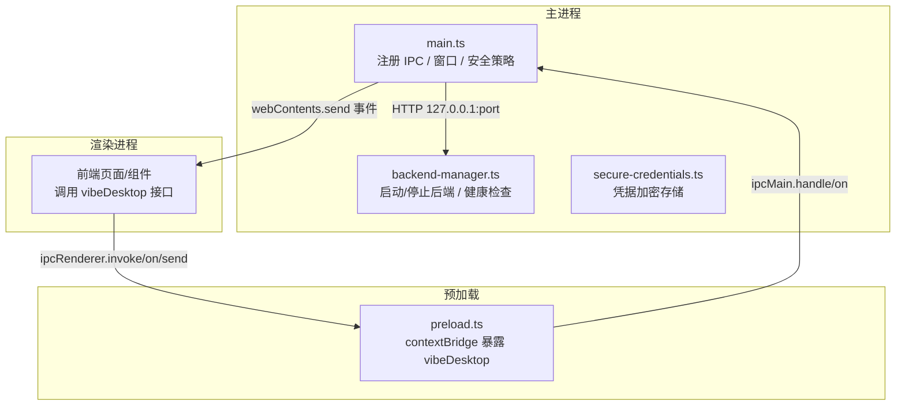
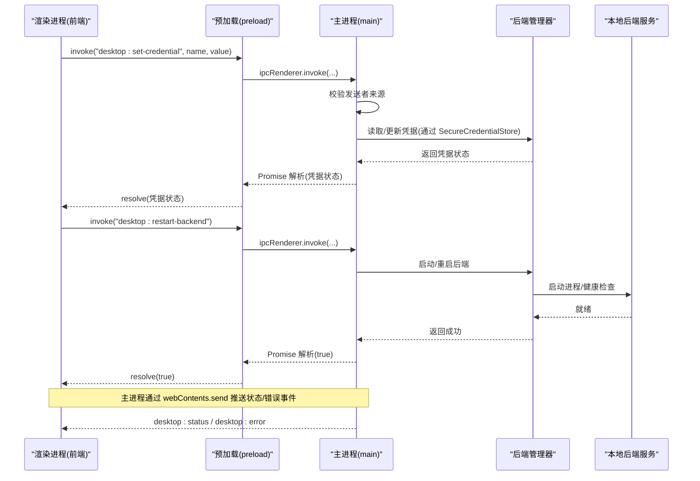
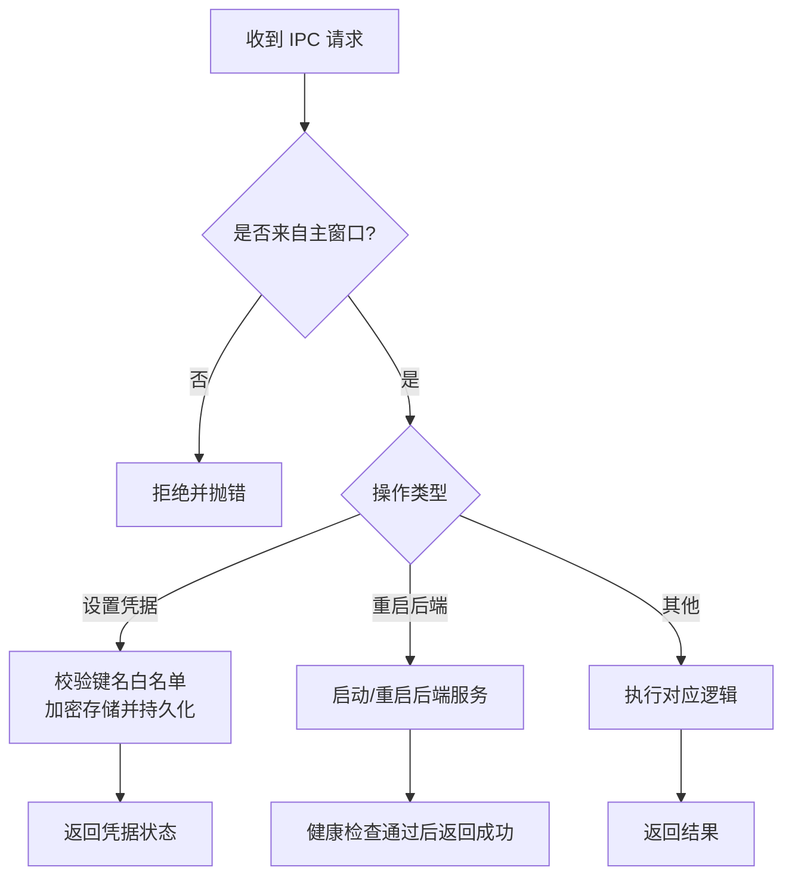
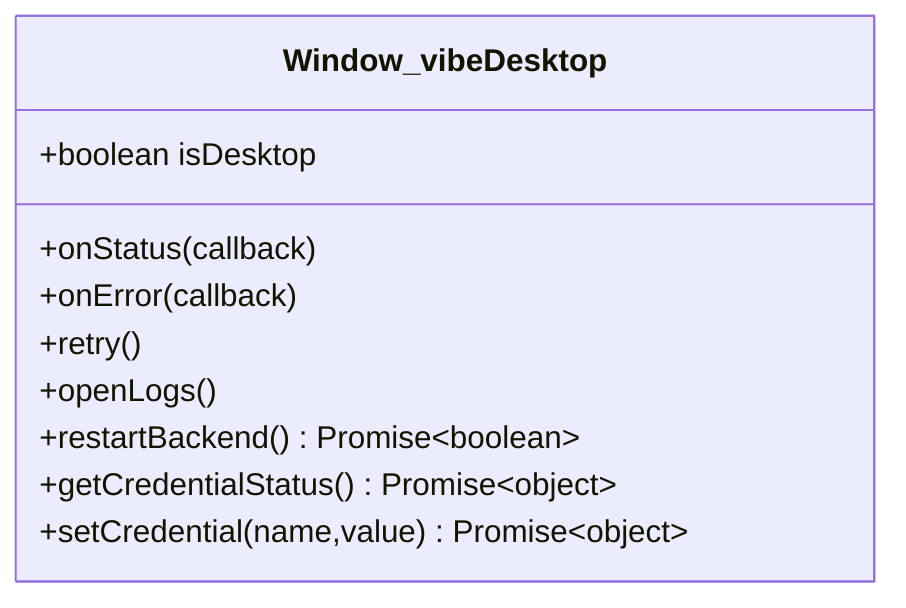
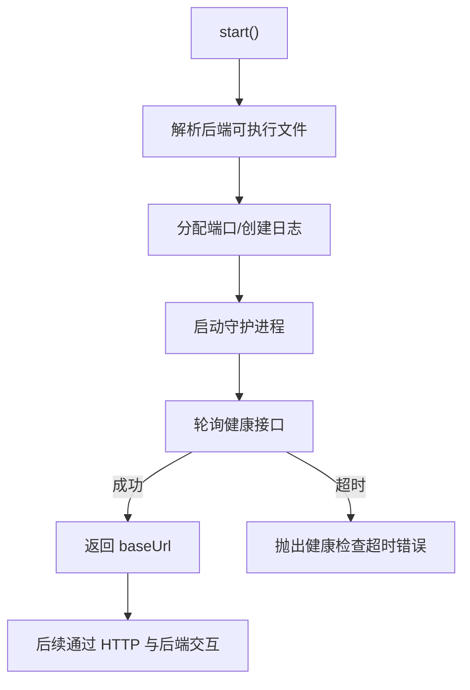
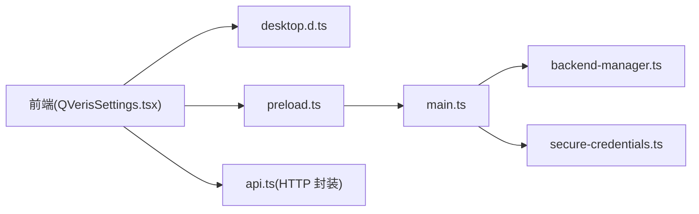

# IPC 通信调试

<cite>
**本文引用的文件**
- [main.ts](file://desktop/electron/src/main.ts)
- [preload.ts](file://desktop/electron/src/preload.ts)
- [backend-manager.ts](file://desktop/electron/src/backend-manager.ts)
- [secure-credentials.ts](file://desktop/electron/src/secure-credentials.ts)
- [package.json](file://desktop/electron/package.json)
- [QVerisSettings.tsx](file://frontend/src/components/settings/QVerisSettings.tsx)
- [api.ts](file://frontend/src/lib/api.ts)
- [desktop.d.ts](file://frontend/src/desktop.d.ts)
</cite>

## 目录
1. [简介](#简介)
2. [项目结构](#项目结构)
3. [核心组件](#核心组件)
4. [架构总览](#架构总览)
5. [详细组件分析](#详细组件分析)
6. [依赖关系分析](#依赖关系分析)
7. [性能与可观测性](#性能与可观测性)
8. [故障排除指南](#故障排除指南)
9. [结论](#结论)
10. [附录：调试清单与最佳实践](#附录调试清单与最佳实践)

## 简介
本指南聚焦于 Electron 主进程与渲染进程之间的 IPC 通信调试，围绕本项目中基于 contextBridge + ipcMain/ipcRenderer 的安全通道展开。内容涵盖消息监听器设置、事件触发跟踪、响应处理调试；异步调用（Promise）链式调试、错误处理流程、超时排查；安全机制（权限验证、来源检查、数据校验）的调试方法；以及性能优化与常见问题的定位与解决。

## 项目结构
本项目采用“主进程 + 预加载脚本 + 渲染进程”的分层架构：
- 主进程负责窗口生命周期、后端服务管理、IPC 路由与安全校验。
- 预加载脚本通过 contextBridge 暴露最小化 API 到渲染进程。
- 渲染进程通过 window.vibeDesktop 调用 IPC，并订阅状态/错误事件。

图表来源
- [main.ts:65-146](file://desktop/electron/src/main.ts#L65-L146)
- [preload.ts:1-17](file://desktop/electron/src/preload.ts#L1-L17)
- [backend-manager.ts:63-145](file://desktop/electron/src/backend-manager.ts#L63-L145)

章节来源
- [main.ts:65-146](file://desktop/electron/src/main.ts#L65-L146)
- [preload.ts:1-17](file://desktop/electron/src/preload.ts#L1-L17)
- [backend-manager.ts:63-145](file://desktop/electron/src/backend-manager.ts#L63-L145)
- [package.json:8-22](file://desktop/electron/package.json#L8-L22)

## 核心组件
- 主进程 IPC 路由与安全校验：集中定义所有桌面端能力入口，严格校验发送者来源。
- 预加载桥接：仅暴露必要方法，避免直接暴露 ipcRenderer。
- 后端管理器：启动本地后端服务、健康检查、日志采集、优雅关闭。
- 凭据存储：使用系统级安全存储加密保存敏感配置，限制允许写入的键集合。
- 前端集成：在设置页等场景调用 vibeDesktop 进行凭据持久化与服务重启。

章节来源
- [main.ts:119-146](file://desktop/electron/src/main.ts#L119-L146)
- [preload.ts:1-17](file://desktop/electron/src/preload.ts#L1-L17)
- [backend-manager.ts:63-145](file://desktop/electron/src/backend-manager.ts#L63-L145)
- [secure-credentials.ts:68-137](file://desktop/electron/src/secure-credentials.ts#L68-L137)
- [QVerisSettings.tsx:160-175](file://frontend/src/components/settings/QVerisSettings.tsx#L160-L175)

## 架构总览
下图展示了从渲染进程发起 IPC 到主进程处理并返回结果的完整时序，包括事件推送与异步 Promise 响应。

图表来源
- [preload.ts:3-16](file://desktop/electron/src/preload.ts#L3-L16)
- [main.ts:119-146](file://desktop/electron/src/main.ts#L119-L146)
- [backend-manager.ts:63-145](file://desktop/electron/src/backend-manager.ts#L63-L145)

## 详细组件分析

### 主进程 IPC 路由与安全
- 事件与处理器
  - 同步事件：重试、打开日志等通过 on 注册。
  - 异步请求：重启后端、获取/设置凭据通过 handle 注册，返回 Promise 结果。
- 安全校验
  - 所有处理器均先校验发送者是否为主窗口 WebContents，拒绝非法来源。
  - 对凭据写入进行白名单校验，防止任意键写入。
- 错误与状态上报
  - 启动失败或异常时向渲染进程推送错误事件。
  - 后端启动/就绪/关闭等状态通过事件推送。

图表来源
- [main.ts:119-146](file://desktop/electron/src/main.ts#L119-L146)
- [secure-credentials.ts:105-137](file://desktop/electron/src/secure-credentials.ts#L105-L137)

章节来源
- [main.ts:119-146](file://desktop/electron/src/main.ts#L119-L146)
- [secure-credentials.ts:105-137](file://desktop/electron/src/secure-credentials.ts#L105-L137)

### 预加载桥接与渲染进程调用
- 暴露的最小 API
  - 事件订阅：onStatus、onError
  - 无返回值调用：retry、openLogs
  - 异步调用：restartBackend、getCredentialStatus、setCredential
- 类型声明
  - 前端通过 desktop.d.ts 获得类型提示，确保调用参数与返回值正确。

图表来源
- [preload.ts:3-16](file://desktop/electron/src/preload.ts#L3-L16)
- [desktop.d.ts:1-22](file://frontend/src/desktop.d.ts#L1-L22)

章节来源
- [preload.ts:3-16](file://desktop/electron/src/preload.ts#L3-L16)
- [desktop.d.ts:1-22](file://frontend/src/desktop.d.ts#L1-L22)
- [QVerisSettings.tsx:160-175](file://frontend/src/components/settings/QVerisSettings.tsx#L160-L175)

### 后端管理与健康检查
- 启动流程
  - 解析可执行路径与环境，分配端口，创建日志文件。
  - 启动守护进程，收集 stdout/stderr，并通过 IPC 汇报后端 PID/退出原因。
  - 轮询健康接口直至就绪，超时则抛出错误。
- 关闭流程
  - 尝试优雅关闭后端，等待退出；必要时强制终止进程树。
- 可观测性
  - 将最近输出保留为环形缓冲区，便于诊断。

图表来源
- [backend-manager.ts:63-145](file://desktop/electron/src/backend-manager.ts#L63-L145)
- [backend-manager.ts:261-286](file://desktop/electron/src/backend-manager.ts#L261-L286)

章节来源
- [backend-manager.ts:63-145](file://desktop/electron/src/backend-manager.ts#L63-L145)
- [backend-manager.ts:261-286](file://desktop/electron/src/backend-manager.ts#L261-L286)

### 凭据安全存储
- 白名单控制：仅允许写入受控环境变量键。
- 加密存储：使用系统安全存储加密保存值，落盘为临时文件后原子替换。
- 迁移能力：支持从 .env 与旧 JSON 字段迁移至新格式。
- 环境注入：启动后端时将解密后的值注入子进程环境变量。

章节来源
- [secure-credentials.ts:12-44](file://desktop/electron/src/secure-credentials.ts#L12-L44)
- [secure-credentials.ts:68-137](file://desktop/electron/src/secure-credentials.ts#L68-L137)
- [secure-credentials.ts:139-164](file://desktop/electron/src/secure-credentials.ts#L139-L164)
- [backend-manager.ts:108-123](file://desktop/electron/src/backend-manager.ts#L108-L123)

## 依赖关系分析
- 主进程依赖
  - Electron API：app、BrowserWindow、ipcMain、shell、nativeTheme 等。
  - 内部模块：BackendManager、SecureCredentialStore、本地化消息。
- 预加载依赖
  - contextBridge、ipcRenderer 用于安全地暴露 API。
- 前端依赖
  - 通过 window.vibeDesktop 调用 IPC；HTTP 请求统一封装在 api.ts。

图表来源
- [QVerisSettings.tsx:160-175](file://frontend/src/components/settings/QVerisSettings.tsx#L160-L175)
- [preload.ts:1-17](file://desktop/electron/src/preload.ts#L1-L17)
- [main.ts:119-146](file://desktop/electron/src/main.ts#L119-L146)
- [backend-manager.ts:63-145](file://desktop/electron/src/backend-manager.ts#L63-L145)
- [secure-credentials.ts:68-137](file://desktop/electron/src/secure-credentials.ts#L68-L137)
- [api.ts:65-93](file://frontend/src/lib/api.ts#L65-L93)

章节来源
- [QVerisSettings.tsx:160-175](file://frontend/src/components/settings/QVerisSettings.tsx#L160-L175)
- [preload.ts:1-17](file://desktop/electron/src/preload.ts#L1-L17)
- [main.ts:119-146](file://desktop/electron/src/main.ts#L119-L146)
- [backend-manager.ts:63-145](file://desktop/electron/src/backend-manager.ts#L63-L145)
- [secure-credentials.ts:68-137](file://desktop/electron/src/secure-credentials.ts#L68-L137)
- [api.ts:65-93](file://frontend/src/lib/api.ts#L65-L93)

## 性能与可观测性
- 日志与追踪
  - 主进程按天滚动记录后端 stdout/stderr，并保留最近若干行用于快速定位问题。
  - 启动/就绪/关闭等关键节点通过事件推送给渲染进程，便于 UI 展示与监控。
- 健康检查与超时
  - 启动后端后轮询健康接口，设置合理超时，避免长时间阻塞。
- 资源释放
  - 关闭流程包含优雅关闭与强制终止，确保进程树清理，避免僵尸进程。
- 网络与内存
  - 通过上下文隔离与最小化暴露面降低攻击面与内存占用。
  - 前端 HTTP 请求统一封装，便于添加超时、重试与错误归一化。

章节来源
- [backend-manager.ts:94-100](file://desktop/electron/src/backend-manager.ts#L94-L100)
- [backend-manager.ts:124-145](file://desktop/electron/src/backend-manager.ts#L124-L145)
- [backend-manager.ts:148-187](file://desktop/electron/src/backend-manager.ts#L148-L187)
- [backend-manager.ts:261-286](file://desktop/electron/src/backend-manager.ts#L261-L286)
- [api.ts:65-93](file://frontend/src/lib/api.ts#L65-L93)

## 故障排除指南

### 常见问题与定位步骤
- 无法设置凭据
  - 现象：调用 setCredential 报错或无效。
  - 排查：
    - 确认键名在白名单内。
    - 检查主进程是否已初始化凭据存储。
    - 查看主进程日志与错误事件。
  - 参考
    - [secure-credentials.ts:12-44](file://desktop/electron/src/secure-credentials.ts#L12-L44)
    - [secure-credentials.ts:105-137](file://desktop/electron/src/secure-credentials.ts#L105-L137)
    - [main.ts:137-145](file://desktop/electron/src/main.ts#L137-L145)

- 重启后端失败
  - 现象：invoke restartBackend 返回失败或卡住。
  - 排查：
    - 检查端口是否被占用（findFreePort）。
    - 查看健康检查是否超时。
    - 观察守护进程消息与退出码。
  - 参考
    - [backend-manager.ts:63-145](file://desktop/electron/src/backend-manager.ts#L63-L145)
    - [backend-manager.ts:261-286](file://desktop/electron/src/backend-manager.ts#L261-L286)

- 渲染进程未收到状态/错误事件
  - 现象：UI 不更新或错误未显示。
  - 排查：
    - 确认预加载是否正确暴露 onStatus/onError。
    - 确认主进程是否在适当时机发送事件。
    - 检查浏览器控制台是否有跨域或权限拦截。
  - 参考
    - [preload.ts:5-10](file://desktop/electron/src/preload.ts#L5-L10)
    - [main.ts:178-210](file://desktop/electron/src/main.ts#L178-L210)

- 安全校验导致请求被拒
  - 现象：主进程拒绝非主窗口来源的请求。
  - 排查：
    - 确认调用来自主窗口 WebContents。
    - 检查是否存在多窗口/iframe 场景导致 sender 不一致。
  - 参考
    - [main.ts:240-242](file://desktop/electron/src/main.ts#L240-L242)

- 前端 HTTP 请求错误
  - 现象：API 调用返回 4xx/5xx。
  - 排查：
    - 查看统一错误处理逻辑，提取 detail/message/error。
    - 检查鉴权头是否正确注入。
  - 参考
    - [api.ts:65-93](file://frontend/src/lib/api.ts#L65-L93)

### 调试技巧清单
- 事件监听器设置
  - 在预加载层打印 onStatus/onError 回调触发时间戳，确认事件到达。
  - 在主进程 handle/on 入口处打印入参与来源信息，确认路由命中。
- 异步调用调试
  - 对 invoke 返回的 Promise 增加 then/catch 日志，区分成功与失败分支。
  - 对后端健康检查循环增加间隔与剩余时间日志，定位超时点。
- 错误处理流程跟踪
  - 捕获并记录所有 throw 的 Error 对象，附带堆栈与上下文。
  - 对守护进程 exit 事件记录 code/signal 与最近输出片段。
- 超时问题排查
  - 调整健康检查超时阈值，观察不同阈值下的成功率。
  - 检查系统资源占用与磁盘 IO，避免 I/O 阻塞导致健康检查失败。
- 安全机制调试
  - 对凭据写入进行白名单校验日志，记录被拒绝的键名。
  - 对来源校验失败的路径记录 sender 信息，辅助定位多窗口问题。

章节来源
- [preload.ts:5-10](file://desktop/electron/src/preload.ts#L5-L10)
- [main.ts:119-146](file://desktop/electron/src/main.ts#L119-L146)
- [backend-manager.ts:124-145](file://desktop/electron/src/backend-manager.ts#L124-L145)
- [backend-manager.ts:261-286](file://desktop/electron/src/backend-manager.ts#L261-L286)
- [secure-credentials.ts:105-137](file://desktop/electron/src/secure-credentials.ts#L105-L137)
- [api.ts:65-93](file://frontend/src/lib/api.ts#L65-L93)

## 结论
本项目通过严格的 IPC 路由与安全校验、最小化的预加载暴露面、健壮的后端管理与健康检查，构建了可靠的桌面端通信体系。调试时应重点关注：
- 事件链路是否完整（渲染→预加载→主进程→后端→事件回推）。
- 异步调用的 Promise 链路与错误分支。
- 安全校验与数据来源合法性。
- 日志与健康检查提供的可观测性。

遵循本文的调试方法与排障清单，可高效定位并解决 IPC 相关的问题。

## 附录：调试清单与最佳实践
- 启用开发工具
  - 打包前启用 DevTools，便于断点与网络面板。
- 日志与监控
  - 关注主进程日志文件与最近输出片段。
  - 在关键路径添加结构化日志（时间戳、来源、入参、耗时）。
- 安全与权限
  - 始终校验 IPC 发送者来源。
  - 对凭据写入进行白名单校验。
  - 避免在渲染进程直接访问 Node API。
- 性能优化
  - 合理设置健康检查超时与重试次数。
  - 减少不必要的 IPC 调用频率，合并批量操作。
  - 注意内存泄漏：及时移除事件监听器，避免长生命周期闭包持有大对象。
- 常见陷阱
  - 多窗口场景下 sender 不一致导致拒绝。
  - 端口冲突导致启动失败。
  - 凭据键名不在白名单导致写入失败。
  - 前端未正确处理 Promise 拒绝导致静默失败。