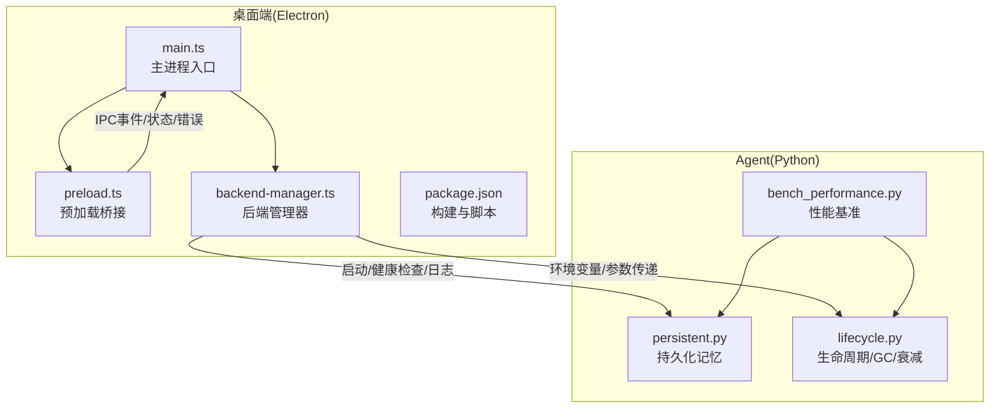
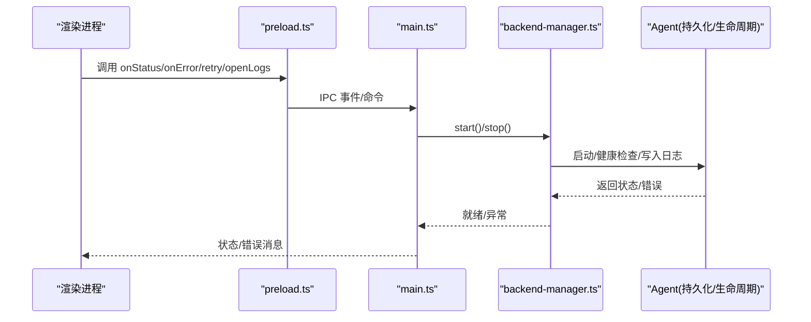
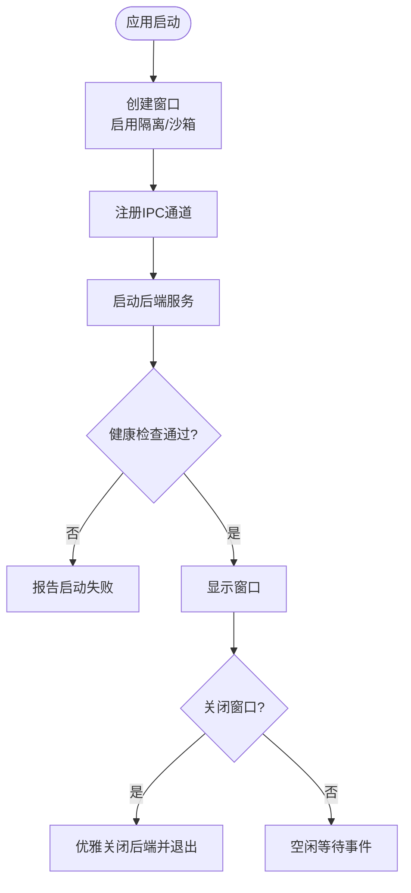
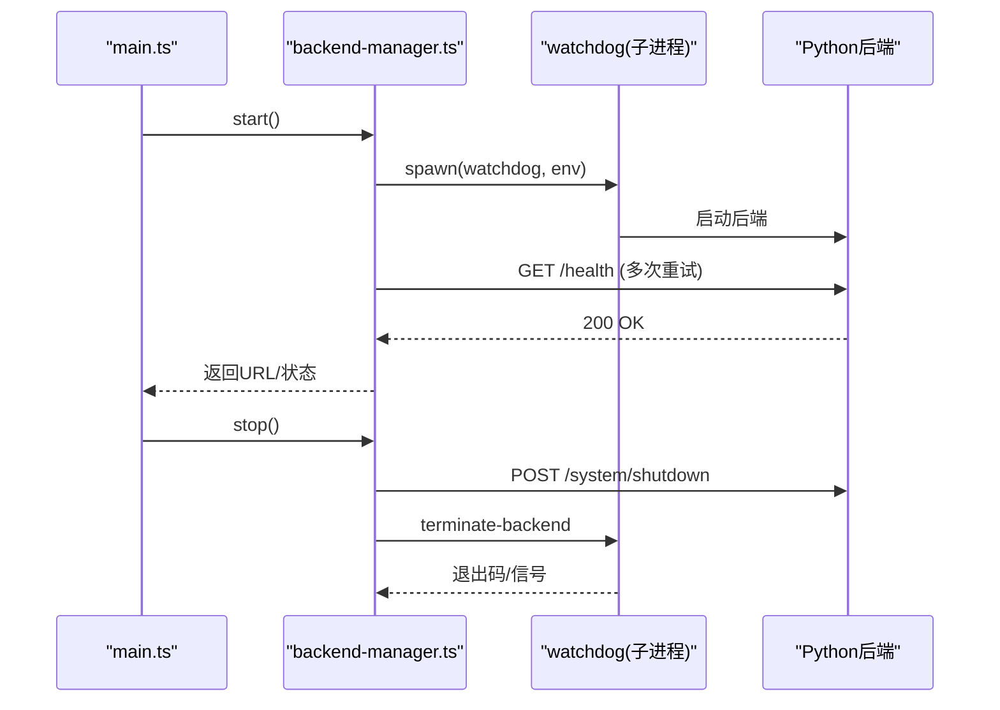
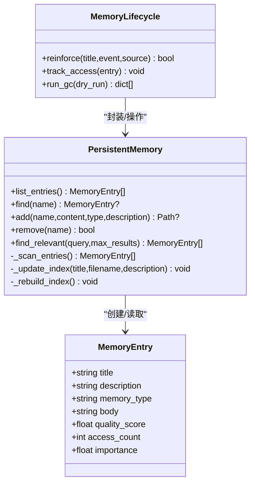
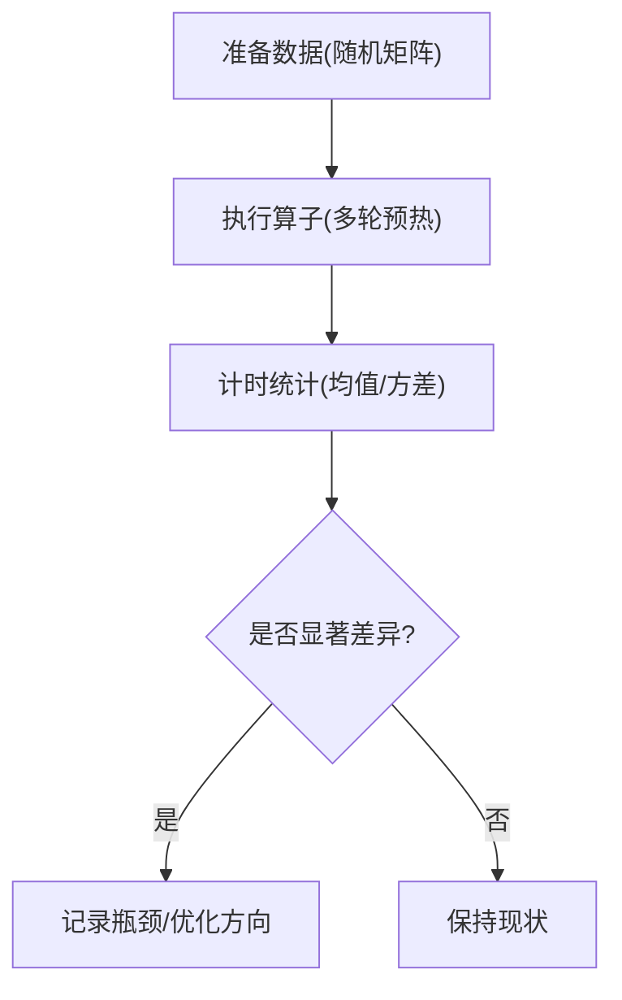
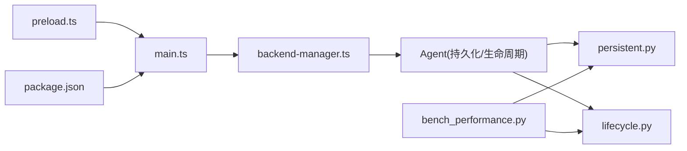

# 内存与性能调试

<cite>
**本文引用的文件**
- [desktop/electron/src/main.ts](file://desktop/electron/src/main.ts)
- [desktop/electron/src/preload.ts](file://desktop/electron/src/preload.ts)
- [desktop/electron/src/backend-manager.ts](file://desktop/electron/src/backend-manager.ts)
- [desktop/electron/package.json](file://desktop/electron/package.json)
- [agent/src/memory/persistent.py](file://agent/src/memory/persistent.py)
- [agent/src/memory/lifecycle.py](file://agent/src/memory/lifecycle.py)
- [agent/scripts/bench_performance.py](file://agent/scripts/bench_performance.py)
- [agent/tests/test_memory_gc.py](file://agent/tests/test_memory_gc.py)
- [agent/tests/test_memory_lifecycle.py](file://agent/tests/test_memory_lifecycle.py)
</cite>

## 目录
1. [简介](#简介)
2. [项目结构](#项目结构)
3. [核心组件](#核心组件)
4. [架构总览](#架构总览)
5. [详细组件分析](#详细组件分析)
6. [依赖关系分析](#依赖关系分析)
7. [性能考量](#性能考量)
8. [故障排查指南](#故障排查指南)
9. [结论](#结论)
10. [附录](#附录)

## 简介
本指南面向在 Vibe-Trading Desktop（Electron）与 Python Agent 中从事内存管理与性能调试的工程师。内容覆盖：
- Electron 主进程与渲染进程的内存分配、隔离策略与生命周期管理
- 垃圾回收机制与内存泄漏检测思路（含堆快照对比、对象引用分析、增长趋势监控）
- 性能分析工具使用（CPU 性能分析、渲染性能监控、网络请求优化）
- 长时间运行任务分析、资源占用监控、响应时间优化
- 内存泄漏检测与修复策略（常见泄漏模式、自动化工具、回归测试）
- 结合本项目代码的实战要点与最佳实践

## 项目结构
本项目由三大部分构成，围绕“桌面壳 + 后端服务 + 持久化记忆”展开：
- Electron 桌面壳：负责启动/守护 Python 后端、安全地暴露 IPC 能力、控制窗口与菜单
- Python Agent：提供交易研究、回测、数据加载等能力；包含基于文件的持久化记忆系统（质量评分、衰减、GC）
- 前端与脚本：用于构建、打包与基准测试

图表来源
- [desktop/electron/src/main.ts:49-192](file://desktop/electron/src/main.ts#L49-L192)
- [desktop/electron/src/preload.ts:1-18](file://desktop/electron/src/preload.ts#L1-L18)
- [desktop/electron/src/backend-manager.ts:63-146](file://desktop/electron/src/backend-manager.ts#L63-L146)
- [agent/src/memory/persistent.py:200-315](file://agent/src/memory/persistent.py#L200-L315)
- [agent/src/memory/lifecycle.py:71-186](file://agent/src/memory/lifecycle.py#L71-L186)
- [agent/scripts/bench_performance.py:19-134](file://agent/scripts/bench_performance.py#L19-L134)

章节来源
- [desktop/electron/src/main.ts:49-192](file://desktop/electron/src/main.ts#L49-L192)
- [desktop/electron/src/backend-manager.ts:63-146](file://desktop/electron/src/backend-manager.ts#L63-L146)
- [agent/src/memory/persistent.py:200-315](file://agent/src/memory/persistent.py#L200-L315)
- [agent/src/memory/lifecycle.py:71-186](file://agent/src/memory/lifecycle.py#L71-L186)
- [agent/scripts/bench_performance.py:19-134](file://agent/scripts/bench_performance.py#L19-L134)

## 核心组件
- Electron 主进程（main.ts）
  - 创建 BrowserWindow，启用 contextIsolation、sandbox、禁用 nodeIntegration，限制外部导航与安全头注入
  - 注册 IPC 通道，处理重启后端、打开日志、凭据管理等操作
  - 启动/关闭后端服务，捕获异常并上报
- 预加载脚本（preload.ts）
  - 通过 contextBridge 暴露最小 API 给渲染进程，屏蔽底层 IPC 细节
- 后端管理器（backend-manager.ts）
  - 解析可执行路径、选择端口、启动 watchdog 子进程、健康检查、优雅关闭、日志采集
  - 向子进程注入认证密钥与环境变量，确保本地通信安全
- 持久化记忆（persistent.py）
  - 基于文件的跨会话存储，支持去重、分词检索、FTS5 索引、语义链接、重要性衰减
  - 提供 add/find/remove/list 等操作，维护 MEMORY.md 索引与最近哈希表
- 生命周期与 GC（lifecycle.py）
  - 质量评分更新、访问追踪、Ebbinghaus 衰减、容量阈值下的归档/压缩
  - 通过环境变量开关功能（质量、GC、衰减）
- 性能基准（bench_performance.py）
  - 算子与权益计算的性能对比，验证向量化 vs 循环路径

章节来源
- [desktop/electron/src/main.ts:65-146](file://desktop/electron/src/main.ts#L65-L146)
- [desktop/electron/src/preload.ts:1-18](file://desktop/electron/src/preload.ts#L1-L18)
- [desktop/electron/src/backend-manager.ts:63-146](file://desktop/electron/src/backend-manager.ts#L63-L146)
- [agent/src/memory/persistent.py:200-315](file://agent/src/memory/persistent.py#L200-L315)
- [agent/src/memory/lifecycle.py:71-186](file://agent/src/memory/lifecycle.py#L71-L186)
- [agent/scripts/bench_performance.py:19-134](file://agent/scripts/bench_performance.py#L19-L134)

## 架构总览
下图展示 Electron 主进程、预加载桥、后端管理器与 Python Agent 的交互流程，以及内存管理的生命周期。

图表来源
- [desktop/electron/src/preload.ts:1-18](file://desktop/electron/src/preload.ts#L1-L18)
- [desktop/electron/src/main.ts:119-146](file://desktop/electron/src/main.ts#L119-L146)
- [desktop/electron/src/backend-manager.ts:63-146](file://desktop/electron/src/backend-manager.ts#L63-L146)

## 详细组件分析

### Electron 主进程与渲染进程内存模型
- 安全默认值
  - 启用 contextIsolation、sandbox，禁用 nodeIntegration，降低渲染进程攻击面与意外全局污染风险
  - 仅通过 preload 暴露必要 API，减少跨域/跨上下文泄露
- 窗口与导航
  - 限制 will-navigate 到受信任来源，外部链接通过 shell.openExternal 打开
  - 对本地后端请求注入 Authorization 头，避免敏感信息外泄
- 生命周期
  - ready-to-show 显示窗口，close 时触发优雅关闭（通知后端停止）
  - 未捕获异常弹窗提示，便于快速定位崩溃点

图表来源
- [desktop/electron/src/main.ts:65-117](file://desktop/electron/src/main.ts#L65-L117)
- [desktop/electron/src/main.ts:148-192](file://desktop/electron/src/main.ts#L148-L192)
- [desktop/electron/src/main.ts:249-255](file://desktop/electron/src/main.ts#L249-L255)

章节来源
- [desktop/electron/src/main.ts:65-117](file://desktop/electron/src/main.ts#L65-L117)
- [desktop/electron/src/main.ts:148-192](file://desktop/electron/src/main.ts#L148-L192)
- [desktop/electron/src/main.ts:249-255](file://desktop/electron/src/main.ts#L249-L255)

### 后端管理器（进程守护与健康检查）
- 启动流程
  - 解析可执行路径（打包产物或开发环境），选择空闲端口，创建日志流
  - 启动 watchdog 子进程，注入环境变量（认证密钥、工作目录、参数等）
  - 轮询健康接口直至成功或超时
- 关闭流程
  - 先尝试优雅关闭后端，再终止 watchdog，必要时强制杀死进程树
- 日志与诊断
  - 捕获 stdout/stderr，保留最近输出用于错误上报

图表来源
- [desktop/electron/src/backend-manager.ts:63-146](file://desktop/electron/src/backend-manager.ts#L63-L146)
- [desktop/electron/src/backend-manager.ts:148-187](file://desktop/electron/src/backend-manager.ts#L148-L187)
- [desktop/electron/src/backend-manager.ts:261-286](file://desktop/electron/src/backend-manager.ts#L261-L286)

章节来源
- [desktop/electron/src/backend-manager.ts:63-146](file://desktop/electron/src/backend-manager.ts#L63-L146)
- [desktop/electron/src/backend-manager.ts:148-187](file://desktop/electron/src/backend-manager.ts#L148-L187)
- [desktop/electron/src/backend-manager.ts:261-286](file://desktop/electron/src/backend-manager.ts#L261-L286)

### 持久化记忆与垃圾回收
- 数据结构与复杂度
  - MemoryEntry 表示单条记忆，包含标题、描述、正文、质量分数、访问计数、重要性等
  - 扫描所有 .md 文件生成条目列表，时间复杂度 O(N)，N 为条目数
  - 检索优先走 FTS5 索引，否则回退到分词扫描，加权排序后取 Top-K
- 去重与限流
  - 滑动窗口内基于内容哈希的去重，防止重复写入导致内存/磁盘膨胀
  - 限制索引行数与正文长度，避免过大对象驻留内存
- 衰减与重要性
  - 基于 Ebbinghaus 遗忘曲线计算重要性，结合访问次数加成
- GC 策略
  - 低重要性条目归档至 archive/，支持 dry-run 预览
  - 旧条目按层级进行压缩（daily/digest），减少体积与 I/O 压力

图表来源
- [agent/src/memory/persistent.py:126-147](file://agent/src/memory/persistent.py#L126-L147)
- [agent/src/memory/persistent.py:200-315](file://agent/src/memory/persistent.py#L200-L315)
- [agent/src/memory/lifecycle.py:71-186](file://agent/src/memory/lifecycle.py#L71-L186)

章节来源
- [agent/src/memory/persistent.py:126-147](file://agent/src/memory/persistent.py#L126-L147)
- [agent/src/memory/persistent.py:200-315](file://agent/src/memory/persistent.py#L200-L315)
- [agent/src/memory/lifecycle.py:71-186](file://agent/src/memory/lifecycle.py#L71-L186)

### 性能基准与瓶颈识别
- 算子基准
  - 对比新旧实现（如 ts_rank、ts_argmax、decay_linear），统计平均耗时
- 权益计算基准
  - 对比向量化与循环路径，评估速度提升倍数
- 建议
  - 将热点路径替换为向量化实现
  - 使用批处理与缓存减少重复计算
  - 通过环境变量控制是否启用加速库（如 bottleneck）

图表来源
- [agent/scripts/bench_performance.py:19-134](file://agent/scripts/bench_performance.py#L19-L134)

章节来源
- [agent/scripts/bench_performance.py:19-134](file://agent/scripts/bench_performance.py#L19-L134)

## 依赖关系分析
- Electron 层依赖
  - main.ts 依赖 backend-manager 管理后端生命周期
  - preload.ts 通过 contextBridge 暴露最小 API
  - package.json 定义构建脚本与打包配置
- Agent 层依赖
  - lifecycle 依赖 persistent 提供的读写能力
  - 检索路径可选择 FTS5 索引或分词扫描
  - 基准脚本依赖 agent 内部模块进行性能测量

图表来源
- [desktop/electron/src/main.ts:49-192](file://desktop/electron/src/main.ts#L49-L192)
- [desktop/electron/src/preload.ts:1-18](file://desktop/electron/src/preload.ts#L1-L18)
- [desktop/electron/package.json:9-22](file://desktop/electron/package.json#L9-L22)
- [agent/src/memory/persistent.py:200-315](file://agent/src/memory/persistent.py#L200-L315)
- [agent/src/memory/lifecycle.py:71-186](file://agent/src/memory/lifecycle.py#L71-L186)
- [agent/scripts/bench_performance.py:19-134](file://agent/scripts/bench_performance.py#L19-L134)

章节来源
- [desktop/electron/src/main.ts:49-192](file://desktop/electron/src/main.ts#L49-L192)
- [desktop/electron/src/preload.ts:1-18](file://desktop/electron/src/preload.ts#L1-L18)
- [desktop/electron/package.json:9-22](file://desktop/electron/package.json#L9-L22)
- [agent/src/memory/persistent.py:200-315](file://agent/src/memory/persistent.py#L200-L315)
- [agent/src/memory/lifecycle.py:71-186](file://agent/src/memory/lifecycle.py#L71-L186)
- [agent/scripts/bench_performance.py:19-134](file://agent/scripts/bench_performance.py#L19-L134)

## 性能考量
- 渲染进程
  - 使用 DevTools 的 Performance 面板录制帧率、布局抖动与脚本耗时
  - 避免在渲染进程中执行重型计算，尽量委托给主进程或后端
- 主进程
  - 合理拆分任务，避免阻塞事件循环
  - 使用 child_process 或 worker_threads 隔离长任务
- 后端服务
  - 关注健康检查失败与日志尾部输出，及时定位启动问题
  - 利用基准脚本对比不同实现的性能差异
- 持久化记忆
  - 启用 FTS5 索引提升检索性能
  - 使用 GC 归档与压缩控制磁盘与内存占用
  - 控制索引行数与正文长度，避免大对象常驻内存

[本节为通用指导，不直接分析具体文件]

## 故障排查指南
- 启动失败
  - 检查后端健康检查超时与 watchdog 退出码
  - 查看日志尾部输出，确认端口占用与权限问题
- 内存泄漏迹象
  - 观察渲染进程堆快照随时间的增长趋势
  - 检查是否有未释放的事件监听器、定时器或闭包引用
- 持久化异常
  - 检查文件锁获取是否超时
  - 校验 frontmatter 字段类型与范围（如 quality_score 钳制）
- 性能退化
  - 运行基准脚本对比新旧路径
  - 分析热点函数与 I/O 瓶颈

章节来源
- [desktop/electron/src/backend-manager.ts:261-286](file://desktop/electron/src/backend-manager.ts#L261-L286)
- [agent/src/memory/persistent.py:42-73](file://agent/src/memory/persistent.py#L42-L73)
- [agent/src/memory/persistent.py:200-315](file://agent/src/memory/persistent.py#L200-L315)
- [agent/scripts/bench_performance.py:19-134](file://agent/scripts/bench_performance.py#L19-L134)

## 结论
- Electron 侧通过严格的安全默认值与最小化 IPC 暴露，降低内存与安全风险
- 后端管理器提供健壮的进程守护与健康检查，便于定位启动与运行期问题
- 持久化记忆系统具备质量评分、衰减与 GC，有效抑制内存与磁盘增长
- 基准脚本帮助识别热点路径，推动向量化与缓存优化
- 建议结合 DevTools 与日志系统进行持续的性能监控与回归测试

[本节为总结性内容，不直接分析具体文件]

## 附录
- 常用调试技巧
  - 渲染进程：Performance 面板、内存快照对比、对象引用分析
  - 主进程：Node Inspector、日志采样、事件循环阻塞检测
  - 后端：健康检查、日志尾部、环境变量开关（质量/GC/衰减）
- 自动化回归
  - 将基准脚本纳入 CI，比较关键路径耗时变化
  - 对持久化 GC 行为进行断言测试（归档/压缩/干跑）

章节来源
- [agent/tests/test_memory_gc.py:75-229](file://agent/tests/test_memory_gc.py#L75-L229)
- [agent/tests/test_memory_lifecycle.py:183-331](file://agent/tests/test_memory_lifecycle.py#L183-L331)
- [agent/scripts/bench_performance.py:19-134](file://agent/scripts/bench_performance.py#L19-L134)