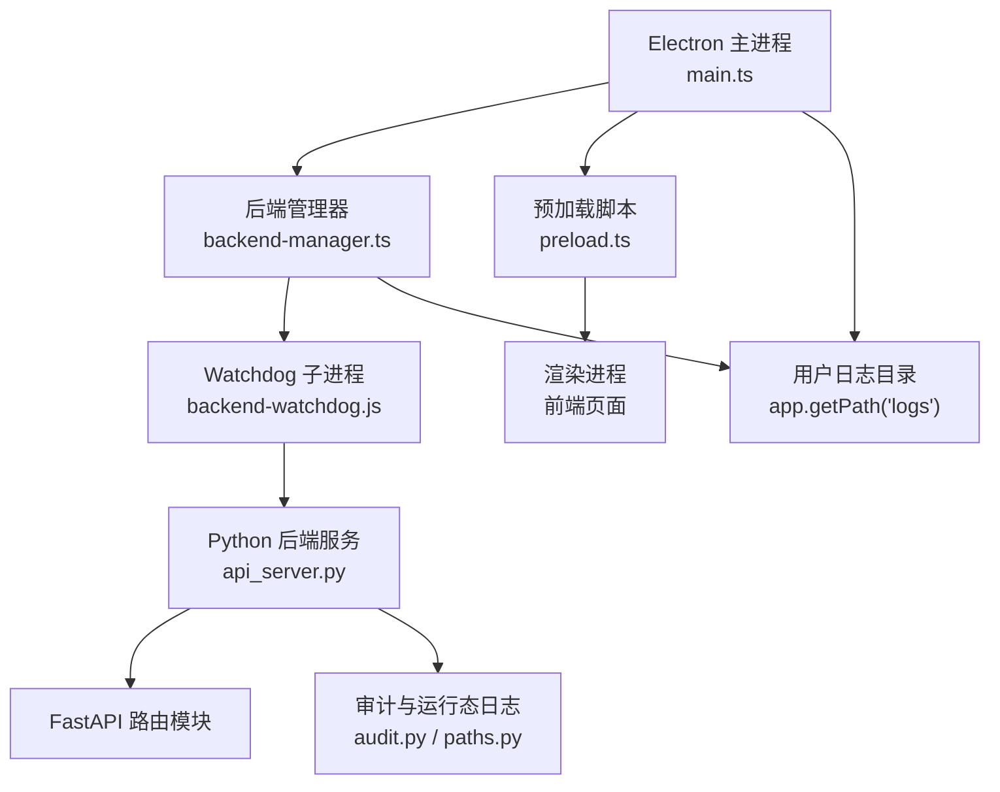
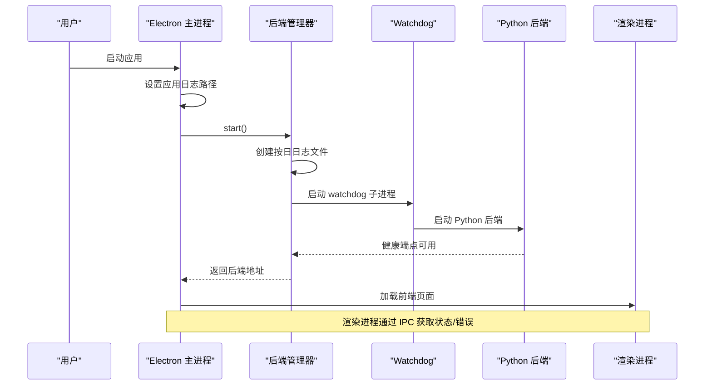
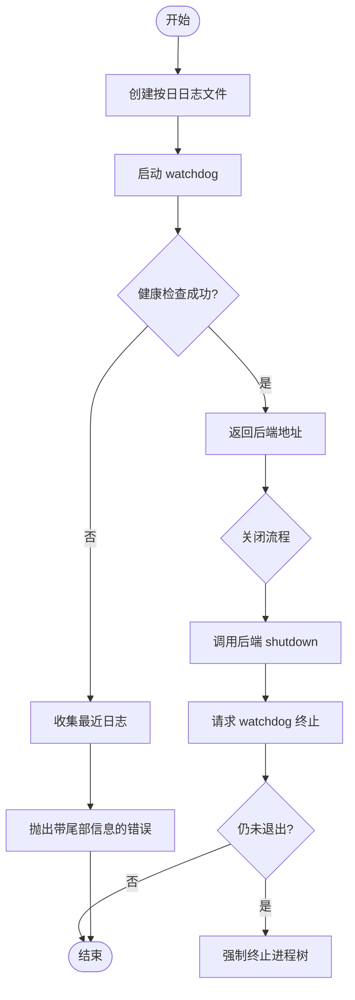
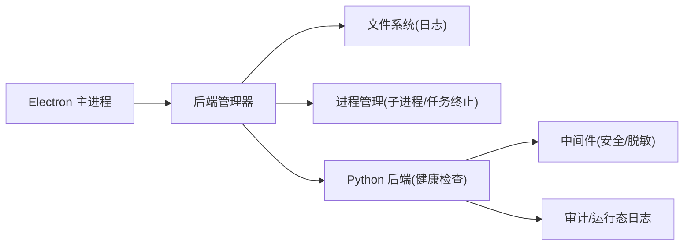

# 日志收集与故障排查

<cite>
**本文引用的文件**
- [main.ts](file://desktop/electron/src/main.ts)
- [preload.ts](file://desktop/electron/src/preload.ts)
- [backend-manager.ts](file://desktop/electron/src/backend-manager.ts)
- [THREAT_MODEL.md](file://desktop/electron/THREAT_MODEL.md)
- [api_server.py](file://agent/api_server.py)
- [audit.py](file://agent/src/live/audit.py)
- [paths.py](file://agent/src/live/paths.py)
- [llm.py](file://agent/src/providers/llm.py)
- [chat_log.py](file://agent/cli/components/chat_log.py)
- [chat.py](file://agent/cli/commands/chat.py)
</cite>

## 目录
1. [简介](#简介)
2. [项目结构](#项目结构)
3. [核心组件](#核心组件)
4. [架构总览](#架构总览)
5. [详细组件分析](#详细组件分析)
6. [依赖关系分析](#依赖关系分析)
7. [性能考量](#性能考量)
8. [故障排查指南](#故障排查指南)
9. [结论](#结论)
10. [附录](#附录)

## 简介
本指南面向 Vibe-Trading 桌面应用（Electron）与其后端服务（Python FastAPI），系统化说明日志系统架构、日志级别配置与使用、日志存储位置与轮转策略、远程上报机制，以及故障排查方法（错误堆栈分析、异常捕获、崩溃报告）、日志分析技巧与常见问题定位。目标是帮助开发者与运维人员快速定位问题、降低排障成本。

## 项目结构
本项目由三大部分构成：
- Electron 主进程与渲染进程：负责 UI、本地安全能力、后端生命周期管理、日志采集与展示入口。
- Python 后端服务：提供 REST API、SSE 事件流、回测与交易执行等能力，内置访问日志脱敏与启动健康检查。
- CLI/工具链：用于调试开关、聊天日志渲染等辅助功能。

图表来源
- [main.ts:49-63](file://desktop/electron/src/main.ts#L49-L63)
- [backend-manager.ts:63-146](file://desktop/electron/src/backend-manager.ts#L63-L146)
- [api_server.py:321-395](file://agent/api_server.py#L321-L395)
- [paths.py:1-41](file://agent/src/live/paths.py#L1-L41)

章节来源
- [main.ts:49-63](file://desktop/electron/src/main.ts#L49-L63)
- [backend-manager.ts:63-146](file://desktop/electron/src/backend-manager.ts#L63-L146)
- [api_server.py:321-395](file://agent/api_server.py#L321-L395)
- [paths.py:1-41](file://agent/src/live/paths.py#L1-L41)

## 核心组件
- Electron 主进程：设置应用日志路径、创建窗口、注册 IPC、启动后端、处理关闭流程、全局未捕获异常提示。
- 后端管理器：发现并启动 Python 后端、分配端口、写入按日切分的日志、采集子进程标准输出/错误、健康检查、优雅关闭与强制终止。
- Python 后端：FastAPI 应用装配、中间件与安全头、访问日志脱敏、健康端点、生命周期钩子。
- 审计与运行态：交易审计日志、运行时根目录约定、关键状态持久化。
- 调试与日志开关：CLI 调试摘要开关、环境变量控制详细日志。

章节来源
- [main.ts:22-63](file://desktop/electron/src/main.ts#L22-L63)
- [backend-manager.ts:52-146](file://desktop/electron/src/backend-manager.ts#L52-L146)
- [api_server.py:156-185](file://agent/api_server.py#L156-L185)
- [audit.py:74-116](file://agent/src/live/audit.py#L74-L116)
- [paths.py:1-41](file://agent/src/live/paths.py#L1-L41)
- [chat.py:183-216](file://agent/cli/commands/chat.py#L183-L216)

## 架构总览
下图展示了从 Electron 启动到后端就绪的完整链路，包括日志落盘、健康检查与错误上报。

图表来源
- [main.ts:49-63](file://desktop/electron/src/main.ts#L49-L63)
- [backend-manager.ts:63-146](file://desktop/electron/src/backend-manager.ts#L63-L146)
- [api_server.py:321-395](file://agent/api_server.py#L321-L395)

## 详细组件分析

### Electron 主进程日志与崩溃处理
- 日志路径：调用应用日志目录接口，便于统一查看。
- 启动流程：初始化安全凭据、创建窗口、注册 IPC、显示加载页、启动后端。
- 关闭流程：拦截窗口关闭事件，先通知后端优雅关闭，再退出。
- 崩溃处理：全局未捕获异常弹窗提示，附带堆栈信息。
- 菜单与快捷操作：提供“打开日志”、“重启服务”等入口。

章节来源
- [main.ts:49-63](file://desktop/electron/src/main.ts#L49-L63)
- [main.ts:102-146](file://desktop/electron/src/main.ts#L102-L146)
- [main.ts:212-237](file://desktop/electron/src/main.ts#L212-L237)
- [main.ts:278-285](file://desktop/electron/src/main.ts#L278-L285)

### 渲染进程日志通道
- 预加载脚本暴露 IPC 通道，允许渲染进程订阅状态与错误消息，支持重试、打开日志、重启后端等操作。
- 渲染进程可通过这些通道将用户可见的错误与状态反馈到界面。

章节来源
- [preload.ts:1-18](file://desktop/electron/src/preload.ts#L1-L18)

### 后端管理器日志与轮转
- 日志文件：按天生成 desktop-YYYYMMDD.log，追加写入。
- 日志内容：包含时间戳、来源（OUT/ERR）、watchdog 消息、后端启动/退出信息。
- 最近输出缓存：保留最近若干行用于错误诊断。
- 健康检查：轮询后端健康端点，超时则抛出带尾部日志的错误。
- 优雅关闭：先调用后端 shutdown 接口，再请求 watchdog 终止进程树，最后强制 kill。

图表来源
- [backend-manager.ts:63-146](file://desktop/electron/src/backend-manager.ts#L63-L146)
- [backend-manager.ts:148-187](file://desktop/electron/src/backend-manager.ts#L148-L187)
- [backend-manager.ts:261-304](file://desktop/electron/src/backend-manager.ts#L261-L304)

章节来源
- [backend-manager.ts:63-146](file://desktop/electron/src/backend-manager.ts#L63-L146)
- [backend-manager.ts:148-187](file://desktop/electron/src/backend-manager.ts#L148-L187)
- [backend-manager.ts:261-304](file://desktop/electron/src/backend-manager.ts#L261-L304)

### Python 后端日志与访问日志脱敏
- 启动与生命周期：lifespan 钩子执行前置检查、迁移、调度器与通道运行时启停。
- 访问日志：安装脱敏过滤器，避免在访问日志中泄露敏感查询参数。
- 健康端点：供 Electron 健康检查使用。
- 开发模式：可选启动前端开发服务器；生产模式提供静态资源。

章节来源
- [api_server.py:127-160](file://agent/api_server.py#L127-L160)
- [api_server.py:166-185](file://agent/api_server.py#L166-L185)
- [api_server.py:321-395](file://agent/api_server.py#L321-L395)

### 审计与运行态日志
- 审计日志：以追加方式记录关键动作，确保可追溯性。
- 运行时根目录：所有 live 相关状态位于运行时根下的 live 子目录，权限严格控制。
- fsync 失败降级：首次失败仅警告一次，后续静默，保证下游交易链路不被阻塞。

章节来源
- [audit.py:74-116](file://agent/src/live/audit.py#L74-L116)
- [paths.py:1-41](file://agent/src/live/paths.py#L1-L41)

### 调试日志与环境变量
- CLI 调试摘要：可通过命令切换调试摘要开关，或在启动时设置环境变量启用更详细日志。
- LLM 提供者 .env 解析：日志中包含解析槽位标签（不含绝对路径与用户名），便于诊断配置来源而不泄露隐私。

章节来源
- [chat.py:183-216](file://agent/cli/commands/chat.py#L183-L216)
- [llm.py:855-893](file://agent/src/providers/llm.py#L855-L893)

## 依赖关系分析
- Electron 主进程依赖后端管理器进行后端生命周期管理。
- 后端管理器依赖操作系统进程管理与文件系统，负责日志落盘与健康检查。
- Python 后端依赖 FastAPI 生态，提供安全中间件与访问日志脱敏。
- 审计与运行态模块依赖运行时根目录约定，确保数据一致性与安全性。

图表来源
- [backend-manager.ts:63-146](file://desktop/electron/src/backend-manager.ts#L63-L146)
- [api_server.py:166-185](file://agent/api_server.py#L166-L185)
- [paths.py:1-41](file://agent/src/live/paths.py#L1-L41)

章节来源
- [backend-manager.ts:63-146](file://desktop/electron/src/backend-manager.ts#L63-L146)
- [api_server.py:166-185](file://agent/api_server.py#L166-L185)
- [paths.py:1-41](file://agent/src/live/paths.py#L1-L41)

## 性能考量
- 日志写入采用追加模式并按日切分，减少单文件过大带来的 IO 压力。
- 最近输出缓存限制行数，避免内存膨胀。
- 健康检查使用短超时与轮询，避免阻塞启动流程。
- 访问日志脱敏在日志层完成，避免额外网络开销。
- 审计日志 fsync 失败降级，保障交易链路稳定性。

[本节为通用指导，不直接分析具体文件]

## 故障排查指南

### 常见故障与定位步骤
- 后端启动失败
  - 现象：Electron 启动后无法加载前端或提示后端不可用。
  - 排查：查看按日日志文件，关注 watchdog 消息与健康检查超时；检查端口占用与后端可执行文件路径。
  - 参考：后端管理器健康检查与错误尾部日志。

- 后端意外退出
  - 现象：运行中后端进程消失，UI 提示异常。
  - 排查：查看 watchdog 退出码与信号；检查后端标准输出/错误；确认父进程存活与 IPC 断开情况。
  - 参考：watchdog 退出处理与意外退出回调。

- 访问日志泄露风险
  - 现象：访问日志中出现敏感参数。
  - 排查：确认已安装访问日志脱敏过滤器；检查请求 URL 是否包含密钥或票据。
  - 参考：后端启动时安装脱敏过滤器。

- 审计日志损坏或序列断裂
  - 现象：审计链校验失败。
  - 排查：检查审计日志完整性与序列号；必要时归档并重建。
  - 参考：审计日志旋转与校验逻辑。

- 配置来源不明导致行为异常
  - 现象：LLM 或其他模块未按预期读取配置。
  - 排查：查看 .env 解析日志中的槽位标签；确认优先级与覆盖关系。
  - 参考：.env 解析与日志脱敏。

章节来源
- [backend-manager.ts:261-304](file://desktop/electron/src/backend-manager.ts#L261-L304)
- [backend-manager.ts:131-146](file://desktop/electron/src/backend-manager.ts#L131-L146)
- [api_server.py:404-415](file://agent/api_server.py#L404-L415)
- [audit.py:74-116](file://agent/src/live/audit.py#L74-L116)
- [llm.py:855-893](file://agent/src/providers/llm.py#L855-L893)

### 错误堆栈分析与异常捕获
- Electron 主进程未捕获异常：弹窗显示堆栈，便于快速复制与搜索。
- 后端健康检查失败：错误信息包含最近日志尾部，便于定位启动阶段问题。
- 审计日志 fsync 失败：首次警告，后续静默，避免影响交易链路。

章节来源
- [main.ts:278-285](file://desktop/electron/src/main.ts#L278-L285)
- [backend-manager.ts:261-304](file://desktop/electron/src/backend-manager.ts#L261-L304)
- [audit.py:74-116](file://agent/src/live/audit.py#L74-L116)

### 崩溃报告与日志收集
- 崩溃报告：主进程未捕获异常弹窗，建议截图或复制堆栈。
- 日志收集：通过菜单或 IPC 打开应用日志目录，收集当日 desktop-YYYYMMDD.log。
- 威胁模型要点：标准输出与错误追加至每用户 Electron 日志；启动等待健康成功；异常退出携带有限日志尾部。

章节来源
- [main.ts:212-237](file://desktop/electron/src/main.ts#L212-L237)
- [THREAT_MODEL.md:105-122](file://desktop/electron/THREAT_MODEL.md#L105-L122)

### 日志分析工具与技巧
- 过滤与搜索：按时间戳、来源（OUT/ERR）、关键字（如 error、timeout、health）筛选。
- 模式匹配：匹配健康检查失败、端口不可用、进程退出码等模式。
- 统计分析：统计错误出现频率、峰值时段，结合业务指标定位瓶颈。
- 审计日志：核对序列号连续性，发现断裂即告警。

[本节为通用指导，不直接分析具体文件]

### 常见问题与恢复策略
- 端口冲突：更换端口或释放占用；检查防火墙与代理设置。
- 后端可执行文件缺失：确认打包路径或 PATH 环境；优先使用显式覆盖。
- 配置覆盖顺序：按优先级检查 .env 槽位与环境变量；避免误覆盖。
- 审计日志损坏：停止写入，归档当前文件，重建新日志；必要时回滚到备份。

章节来源
- [backend-manager.ts:63-146](file://desktop/electron/src/backend-manager.ts#L63-L146)
- [api_server.py:321-395](file://agent/api_server.py#L321-L395)
- [llm.py:855-893](file://agent/src/providers/llm.py#L855-L893)

## 结论
本项目的日志体系围绕 Electron 主进程、后端管理器与 Python 后端构建，实现了按日切分、健康检查、访问日志脱敏与审计日志持久化。通过清晰的日志位置、结构化内容与完善的异常捕获，能够快速定位问题并恢复服务。建议在生产环境中结合监控与告警，对健康检查失败、审计日志断裂、访问日志异常等进行主动发现与处置。

## 附录

### 日志级别配置与使用方法
- 调试日志：通过 CLI 命令切换调试摘要，或设置环境变量启用更详细日志。
- 警告与错误：后端管理器与审计模块在异常场景输出警告与错误；访问日志默认 info 级别，敏感字段已脱敏。
- 分类输出：主进程与应用日志位于应用日志目录；后端标准输出/错误经后端管理器统一写入按日日志。

章节来源
- [chat.py:183-216](file://agent/cli/commands/chat.py#L183-L216)
- [backend-manager.ts:63-146](file://desktop/electron/src/backend-manager.ts#L63-L146)
- [api_server.py:404-415](file://agent/api_server.py#L404-L415)

### 日志文件位置与格式
- 位置：应用日志目录（Electron 提供），按日生成 desktop-YYYYMMDD.log。
- 格式：时间戳 + 来源（OUT/ERR）+ 内容；watchdog 消息包含进程信息与退出码。
- 轮转：按日切分，无复杂压缩策略；审计日志为追加 JSONL，具备序列校验。

章节来源
- [backend-manager.ts:63-146](file://desktop/electron/src/backend-manager.ts#L63-L146)
- [paths.py:1-41](file://agent/src/live/paths.py#L1-L41)

### 远程日志上报机制
- 当前实现未包含远程上报；如需上报，可在后端管理器或后端服务中集成日志聚合 SDK，注意脱敏与限流。
- 建议在上报前进行敏感字段过滤，并控制上报频率与大小。

[本节为通用指导，不直接分析具体文件]