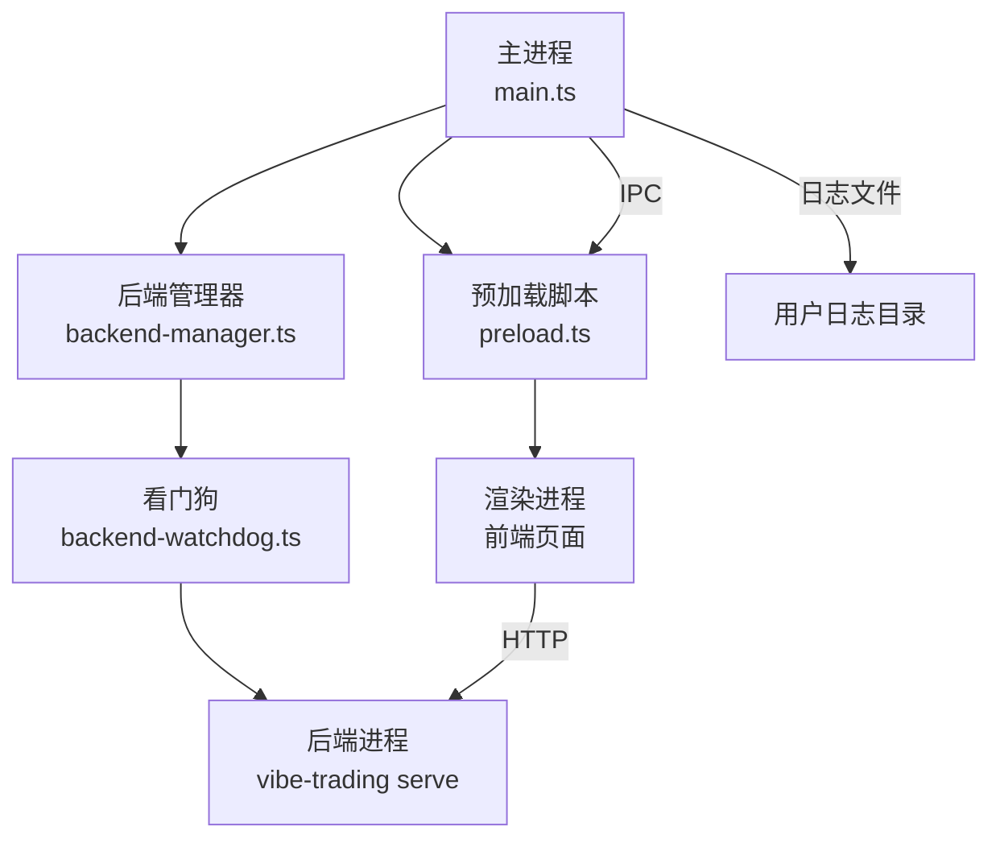
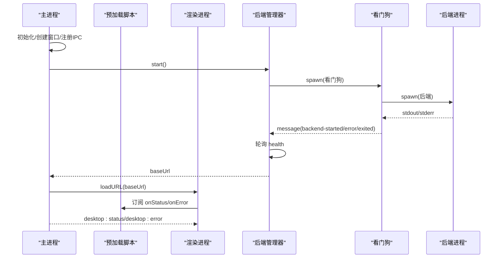
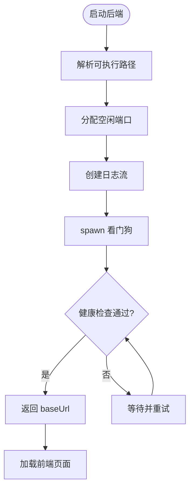
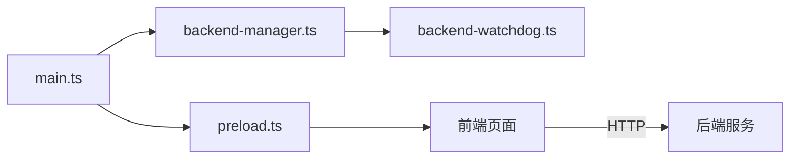

# 调试工具与技巧

<cite>
**本文引用的文件**
- [main.ts](file://desktop/electron/src/main.ts)
- [preload.ts](file://desktop/electron/src/preload.ts)
- [backend-manager.ts](file://desktop/electron/src/backend-manager.ts)
- [backend-watchdog.ts](file://desktop/electron/src/backend-watchdog.ts)
- [package.json](file://desktop/electron/package.json)
- [README.md](file://desktop/electron/README.md)
- [ErrorBoundary.tsx](file://frontend/src/components/common/ErrorBoundary.tsx)
- [main.tsx](file://frontend/src/main.tsx)
</cite>

## 目录
1. [简介](#简介)
2. [项目结构](#项目结构)
3. [核心组件](#核心组件)
4. [架构总览](#架构总览)
5. [详细组件分析](#详细组件分析)
6. [依赖关系分析](#依赖关系分析)
7. [性能考虑](#性能考虑)
8. [故障排查指南](#故障排查指南)
9. [结论](#结论)
10. [附录](#附录)

## 简介
本指南面向使用 Electron 构建的桌面应用，聚焦于 Chrome DevTools 在主进程、渲染进程与 IPC 通信中的调试实践。结合本项目的主进程启动流程、后端子进程管理、日志落盘与错误上报机制，提供断点调试、条件断点、异步调试策略、性能分析与内存诊断、日志收集与分析、IPC 消息跟踪等实战方法，并给出常见问题的定位思路与最佳实践。

## 项目结构
Electron 桌面壳层由主进程、预加载脚本与后端管理器组成；前端为 React 应用，通过本地 HTTP 访问后端服务。关键入口与职责如下：
- 主进程：创建窗口、注册 IPC、启动后端、处理生命周期与菜单、安全限制与导航控制。
- 预加载脚本：在隔离上下文暴露最小 API 给渲染进程，用于状态订阅、重试、打开日志、重启后端与凭据操作。
- 后端管理器：发现并启动后端进程（带看门狗），轮询健康检查，捕获标准输出到日志文件，异常时通知渲染进程。
- 看门狗：监控父进程存活，转发后端事件，统一终止进程树。
- 前端：React 根入口与错误边界，配合全局错误提示。

图示来源
- [main.ts:65-117](file://desktop/electron/src/main.ts#L65-L117)
- [preload.ts:1-18](file://desktop/electron/src/preload.ts#L1-L18)
- [backend-manager.ts:63-146](file://desktop/electron/src/backend-manager.ts#L63-L146)
- [backend-watchdog.ts:31-68](file://desktop/electron/src/backend-watchdog.ts#L31-L68)

章节来源
- [main.ts:1-285](file://desktop/electron/src/main.ts#L1-L285)
- [package.json:1-86](file://desktop/electron/package.json#L1-L86)
- [README.md:1-93](file://desktop/electron/README.md#L1-L93)

## 核心组件
- 主进程（main.ts）
  - 单实例锁、窗口创建、安全配置（contextIsolation、nodeIntegration=false、sandbox）、开发模式开启 DevTools。
  - 注册 IPC 通道：重试、打开日志、重启后端、凭据状态查询与设置。
  - 启动后端、加载 UI、菜单集成“开发者工具”切换。
- 预加载脚本（preload.ts）
  - 暴露 vibeDesktop API：onStatus/onError/retry/openLogs/restartBackend/getCredentialStatus/setCredential。
- 后端管理器（backend-manager.ts）
  - 解析可执行路径、选择空闲端口、写入按天分片的日志、启动看门狗、健康检查、优雅关闭与强制回收。
- 看门狗（backend-watchdog.ts）
  - 监控父进程、转发后端事件、统一终止进程树、清理环境敏感变量。
- 前端（main.tsx, ErrorBoundary.tsx）
  - React 根挂载、错误边界兜底展示。

章节来源
- [main.ts:49-146](file://desktop/electron/src/main.ts#L49-L146)
- [preload.ts:1-18](file://desktop/electron/src/preload.ts#L1-L18)
- [backend-manager.ts:52-187](file://desktop/electron/src/backend-manager.ts#L52-L187)
- [backend-watchdog.ts:1-167](file://desktop/electron/src/backend-watchdog.ts#L1-L167)
- [ErrorBoundary.tsx:1-27](file://frontend/src/components/common/ErrorBoundary.tsx#L1-L27)
- [main.tsx:1-36](file://frontend/src/main.tsx#L1-L36)

## 架构总览
下图展示了从主进程启动到后端就绪、再到渲染进程加载 UI 的完整时序，以及 IPC 与日志流的关键节点。

图示来源
- [main.ts:159-192](file://desktop/electron/src/main.ts#L159-L192)
- [backend-manager.ts:63-146](file://desktop/electron/src/backend-manager.ts#L63-L146)
- [backend-watchdog.ts:31-68](file://desktop/electron/src/backend-watchdog.ts#L31-L68)

## 详细组件分析

### 主进程调试要点
- 启用 DevTools
  - 开发模式下自动启用浏览器开发者工具，便于在渲染进程断点调试。
  - 菜单中提供“开发者工具”切换项，便于打包后临时开启。
- 关键断点位置
  - ready 钩子：国际化、主题、凭据存储初始化、窗口创建、IPC 注册、加载页、启动后端。
  - createWindow：webPreferences 安全开关、权限拦截、请求头注入、外部链接白名单、导航拦截。
  - registerIpc：所有 IPC 通道入口，适合对请求来源做断点校验。
  - boot/bootInternal：后端启动、健康检查、错误上报。
- 条件断点建议
  - 在 IPC 处理器内对 event.sender 进行断点，验证是否来自主窗口。
  - 在 will-navigate 与 setWindowOpenHandler 中对 URL origin 进行条件断点，排查非法跳转。
- 异步调试策略
  - 对 bootPromise 链式调用设置断点，观察并行任务完成顺序。
  - 对 fetch 健康检查循环设置条件断点，关注超时与重试间隔。

章节来源
- [main.ts:49-146](file://desktop/electron/src/main.ts#L49-L146)
- [main.ts:159-210](file://desktop/electron/src/main.ts#L159-L210)
- [main.ts:212-238](file://desktop/electron/src/main.ts#L212-L238)

### 预加载与渲染进程调试
- 暴露 API 的最小化原则
  - 仅暴露必要能力：状态订阅、错误订阅、重试、打开日志、重启后端、凭据操作。
- 调试建议
  - 在渲染进程控制台直接调用 vibeDesktop.onStatus/onError，观察主进程推送的消息内容与时机。
  - 在 onStatus 回调中设置断点，追踪后端启动阶段的状态流转。
  - 在 onError 回调中设置断点，捕获启动失败或后端意外退出的错误信息。

章节来源
- [preload.ts:1-18](file://desktop/electron/src/preload.ts#L1-L18)

### 后端管理与看门狗调试
- 后端发现与启动
  - 支持环境变量覆盖、打包资源路径、源码目录发现、PATH 回退。
  - 选择空闲端口，写入按天分片日志，注入认证密钥与环境变量。
- 健康检查与错误上报
  - 轮询 /health，超时抛出错误并通过 IPC 通知渲染进程。
  - 记录最近 N 行输出，便于快速定位启动失败原因。
- 优雅关闭与强制回收
  - 先尝试 POST /system/shutdown，等待退出；否则向看门狗发送 terminate-backend；最后必要时 taskkill 进程树。
- 看门狗职责
  - 监控父进程存活，转发后端事件，统一终止进程树，清理敏感环境变量。

图示来源
- [backend-manager.ts:63-146](file://desktop/electron/src/backend-manager.ts#L63-L146)
- [backend-manager.ts:261-286](file://desktop/electron/src/backend-manager.ts#L261-L286)

章节来源
- [backend-manager.ts:52-187](file://desktop/electron/src/backend-manager.ts#L52-L187)
- [backend-manager.ts:310-411](file://desktop/electron/src/backend-manager.ts#L310-L411)
- [backend-watchdog.ts:31-101](file://desktop/electron/src/backend-watchdog.ts#L31-L101)

### IPC 通信调试
- 通道清单
  - 事件：desktop:status、desktop:error
  - 命令：desktop:retry、desktop:open-logs
  - 调用：desktop:restart-backend、desktop:get-credential-status、desktop:set-credential
- 调试建议
  - 在 main 进程的 ipcMain 处理器处设置断点，检查 event.sender 与参数类型。
  - 在 preload 的 ipcRenderer 调用处设置断点，确认消息格式与返回值。
  - 对 onStatus/onError 回调设置断点，观察主进程推送的消息内容与触发时机。
- 安全校验
  - 所有 IPC 处理器均校验 sender 是否为主窗口，防止恶意页面劫持。

章节来源
- [main.ts:119-146](file://desktop/electron/src/main.ts#L119-L146)
- [preload.ts:1-18](file://desktop/electron/src/preload.ts#L1-L18)

### 前端错误边界与全局错误
- 错误边界
  - 捕获渲染层异常，展示友好提示，避免整页崩溃。
- 调试建议
  - 在 ErrorBoundary 的 getDerivedStateFromError 与 render 分支设置断点，观察错误对象与降级渲染逻辑。
  - 结合浏览器控制台过滤 console.error/console.warn，聚焦业务错误。

章节来源
- [ErrorBoundary.tsx:1-27](file://frontend/src/components/common/ErrorBoundary.tsx#L1-L27)
- [main.tsx:1-36](file://frontend/src/main.tsx#L1-L36)

## 依赖关系分析
- 模块耦合
  - 主进程依赖后端管理器与本地化模块，负责窗口与 IPC。
  - 后端管理器依赖文件系统、网络与健康检查，封装进程生命周期。
  - 看门狗依赖进程监控与信号处理，确保后端进程树正确回收。
- 外部依赖
  - Electron API：app、BrowserWindow、ipcMain/ipcRenderer、shell、nativeTheme。
  - Node.js 内置：child_process、fs、net、path、crypto。
- 潜在风险
  - 若 IPC 未严格校验 sender，可能导致任意页面触发敏感操作。
  - 若健康检查超时过长，影响用户体验；过短则误判后端未就绪。

图示来源
- [main.ts:1-285](file://desktop/electron/src/main.ts#L1-L285)
- [preload.ts:1-18](file://desktop/electron/src/preload.ts#L1-L18)
- [backend-manager.ts:1-426](file://desktop/electron/src/backend-manager.ts#L1-L426)
- [backend-watchdog.ts:1-167](file://desktop/electron/src/backend-watchdog.ts#L1-L167)

章节来源
- [package.json:1-86](file://desktop/electron/package.json#L1-L86)
- [README.md:1-93](file://desktop/electron/README.md#L1-L93)

## 性能考虑
- CPU 性能分析
  - 在渲染进程使用 Performance 面板录制关键交互（如页面加载、图表渲染），识别长任务与阻塞点。
  - 在主进程对后端启动与健康检查循环设置采样点，评估轮询开销。
- 内存泄漏检测
  - 使用 Memory 面板拍摄堆快照，对比前后差异，定位未释放引用（如定时器、监听器）。
  - 关注 IPC 回调与事件订阅的生命周期，确保在组件卸载时移除监听。
- 渲染性能优化
  - 减少重排与重绘，合理使用虚拟列表与懒加载。
  - 将耗时计算移至 Web Worker 或主进程，避免阻塞 UI 线程。
- 后端进程资源
  - 观察看门狗日志，统计后端启动耗时与退出原因，定位瓶颈。
  - 合理设置健康检查超时与重试间隔，避免频繁请求造成抖动。

[本节为通用指导，不直接分析具体文件]

## 故障排查指南
- 启动失败
  - 现象：渲染进程收到 desktop:error 消息。
  - 排查：查看主进程日志目录下的当日日志，关注后端启动、健康检查与错误堆栈。
  - 动作：通过菜单“打开日志”快速定位文件；必要时重启后端。
- 后端意外退出
  - 现象：desktop:status 显示后端准备完成，随后出现错误消息。
  - 排查：查看看门狗与后端标准输出，确认退出码与信号；检查端口占用与权限。
  - 动作：重启后端；若频繁退出，检查依赖库与运行环境。
- IPC 被拒绝
  - 现象：调用 setCredential 等方法时报错。
  - 排查：确认 sender 是否为主窗口；检查参数类型是否符合预期。
  - 动作：修正调用方，确保仅主窗口触发敏感操作。
- 导航被拦截
  - 现象：点击链接无法在当前窗口打开。
  - 排查：检查 will-navigate 与 setWindowOpenHandler 的白名单逻辑。
  - 动作：确认目标 URL 协议与 origin 是否在允许范围内。
- 前端错误边界触发
  - 现象：页面显示错误提示。
  - 排查：在 ErrorBoundary 断点处查看错误对象；结合控制台过滤错误信息。
  - 动作：修复组件异常；必要时增加更细粒度的错误边界。

章节来源
- [main.ts:119-146](file://desktop/electron/src/main.ts#L119-L146)
- [main.ts:206-210](file://desktop/electron/src/main.ts#L206-L210)
- [backend-manager.ts:261-286](file://desktop/electron/src/backend-manager.ts#L261-L286)
- [ErrorBoundary.tsx:1-27](file://frontend/src/components/common/ErrorBoundary.tsx#L1-L27)

## 结论
通过合理利用 Chrome DevTools 与项目内置的 IPC、日志与健康检查机制，可以高效定位主进程、渲染进程与后端服务的各类问题。建议在开发阶段充分利用断点、条件断点与性能面板，在生产阶段依靠日志与错误上报快速恢复。遵循最小权限与严格校验原则，保障 IPC 安全与系统稳定性。

## 附录
- 常用调试入口
  - 主进程：ready、createWindow、registerIpc、bootInternal。
  - 渲染进程：vibeDesktop API 调用、错误边界。
  - 后端：健康检查、日志文件、看门狗事件。
- 最佳实践
  - 始终校验 IPC 发送者来源。
  - 使用条件断点缩小问题范围。
  - 将关键路径纳入性能录制与内存快照对比。
  - 保持日志分级与滚动策略，避免磁盘压力。

[本节为总结性内容，不直接分析具体文件]