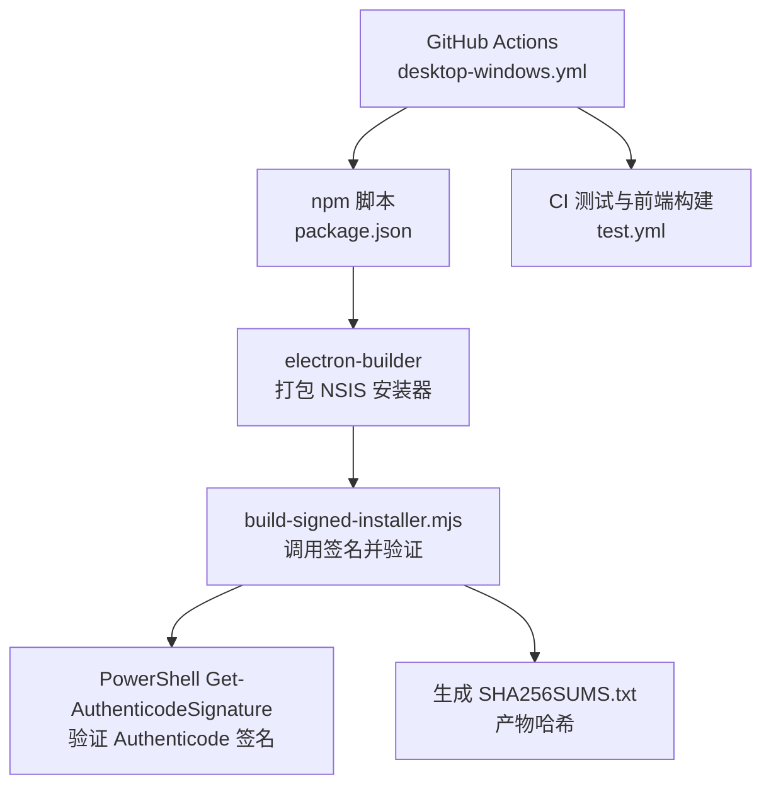
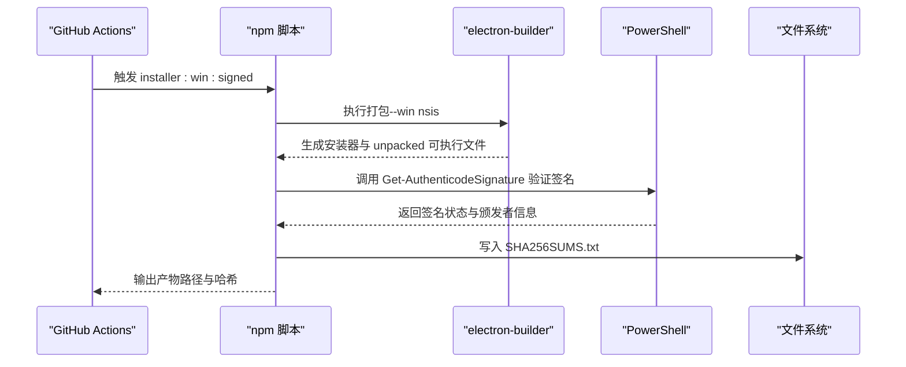
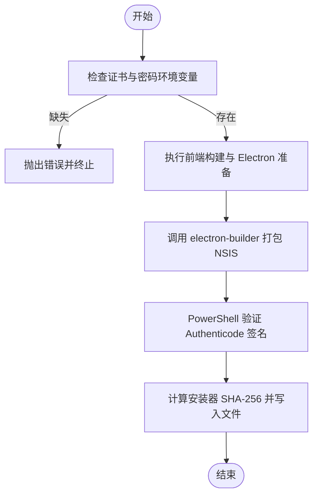
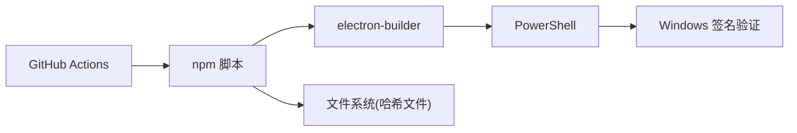

# 代码签名

<cite>
**本文引用的文件**
- [desktop/electron/scripts/build-signed-installer.mjs](file://desktop/electron/scripts/build-signed-installer.mjs)
- [desktop/electron/scripts/build-review-installer.mjs](file://desktop/electron/scripts/build-review-installer.mjs)
- [desktop/electron/package.json](file://desktop/electron/package.json)
- [desktop/electron/WINDOWS_PACKAGING.md](file://desktop/electron/WINDOWS_PACKAGING.md)
- [.github/workflows/desktop-windows.yml](file://.github/workflows/desktop-windows.yml)
- [.github/workflows/test.yml](file://.github/workflows/test.yml)
- [agent/src/api/security.py](file://agent/src/api/security.py)
- [SECURITY.md](file://SECURITY.md)
</cite>

## 目录
1. [简介](#简介)
2. [项目结构](#项目结构)
3. [核心组件](#核心组件)
4. [架构总览](#架构总览)
5. [详细组件分析](#详细组件分析)
6. [依赖关系分析](#依赖关系分析)
7. [性能与可靠性考虑](#性能与可靠性考虑)
8. [故障排除指南](#故障排除指南)
9. [结论](#结论)
10. [附录](#附录)

## 简介
本指南围绕仓库中已实现的桌面端 Windows 打包与签名流程，提供从证书管理、构建集成到验证与排障的完整说明。当前仓库实现了：
- Windows 平台的 Authenticode 签名（通过 electron-builder + PowerShell 验证）
- CI/CD 中的无签名“审查”构建与带签名的发布构建分离
- 产物完整性校验（SHA-256）
- API 安全头与访问控制（与分发可信度相关的安全基线）

对于 macOS 代码签名与公证、Linux GPG 签名，仓库未包含实现；本节提供通用实践建议，便于后续扩展。

## 项目结构
与代码签名直接相关的目录与文件集中在桌面 Electron 工程与 GitHub Actions 工作流中：
- desktop/electron/scripts：签名脚本与审查构建脚本
- desktop/electron/package.json：Electron Builder 配置与 npm scripts
- .github/workflows：Windows 桌面构建与通用 CI
- agent/src/api/security.py：API 安全头与鉴权（与软件可信运行环境相关）
- SECURITY.md：安全策略与官方渠道声明

图表来源
- [.github/workflows/desktop-windows.yml:16-95](file://.github/workflows/desktop-windows.yml#L16-L95)
- [desktop/electron/package.json:9-22](file://desktop/electron/package.json#L9-L22)
- [desktop/electron/scripts/build-signed-installer.mjs:27-79](file://desktop/electron/scripts/build-signed-installer.mjs#L27-L79)

章节来源
- [.github/workflows/desktop-windows.yml:16-95](file://.github/workflows/desktop-windows.yml#L16-L95)
- [desktop/electron/package.json:9-22](file://desktop/electron/package.json#L9-L22)
- [desktop/electron/scripts/build-signed-installer.mjs:27-79](file://desktop/electron/scripts/build-signed-installer.mjs#L27-L79)

## 核心组件
- 签名与验证脚本：负责在受控环境中执行 electron-builder 打包，并使用系统 PowerShell 对产物进行 Authenticode 签名验证，同时输出 SHA-256 校验文件。
- 审查构建脚本：显式剥离签名凭据，强制生成无签名安装器用于本地或 CI 审查。
- 工作流编排：定义 Windows 构建任务、依赖安装、审查构建与产物记录。
- API 安全基线：为服务端响应设置严格的安全头与跨域策略，降低客户端被劫持风险，增强整体可信度。

章节来源
- [desktop/electron/scripts/build-signed-installer.mjs:1-79](file://desktop/electron/scripts/build-signed-installer.mjs#L1-L79)
- [desktop/electron/scripts/build-review-installer.mjs:1-35](file://desktop/electron/scripts/build-review-installer.mjs#L1-L35)
- [.github/workflows/desktop-windows.yml:16-95](file://.github/workflows/desktop-windows.yml#L16-L95)
- [agent/src/api/security.py:180-253](file://agent/src/api/security.py#L180-L253)

## 架构总览
下图展示 Windows 桌面应用从源码到可分发包的签名流水线，包括环境变量注入、构建、签名验证与完整性记录。

图表来源
- [desktop/electron/scripts/build-signed-installer.mjs:27-79](file://desktop/electron/scripts/build-signed-installer.mjs#L27-L79)
- [desktop/electron/scripts/build-signed-installer.mjs:93-121](file://desktop/electron/scripts/build-signed-installer.mjs#L93-L121)
- [desktop/electron/scripts/build-signed-installer.mjs:149-153](file://desktop/electron/scripts/build-signed-installer.mjs#L149-L153)

## 详细组件分析

### Windows Authenticode 签名与验证
- 环境变量要求：需要证书链接与密码（支持 WIN_CSC_LINK/CSC_LINK 与对应密码变量），否则构建失败。
- 构建步骤：先执行前端构建与 Electron 准备，再调用 electron-builder 以 NSIS 目标打包。
- 签名验证：使用 PowerShell 的 Get-AuthenticodeSignature 检查安装器与 unpacked 可执行文件的签名有效性，并打印颁发者主题。
- 完整性记录：计算安装器 SHA-256 并写入 release/SHA256SUMS.txt。

图表来源
- [desktop/electron/scripts/build-signed-installer.mjs:10-24](file://desktop/electron/scripts/build-signed-installer.mjs#L10-L24)
- [desktop/electron/scripts/build-signed-installer.mjs:27-44](file://desktop/electron/scripts/build-signed-installer.mjs#L27-L44)
- [desktop/electron/scripts/build-signed-installer.mjs:69-79](file://desktop/electron/scripts/build-signed-installer.mjs#L69-L79)
- [desktop/electron/scripts/build-signed-installer.mjs:93-121](file://desktop/electron/scripts/build-signed-installer.mjs#L93-L121)
- [desktop/electron/scripts/build-signed-installer.mjs:149-153](file://desktop/electron/scripts/build-signed-installer.mjs#L149-L153)

章节来源
- [desktop/electron/scripts/build-signed-installer.mjs:10-79](file://desktop/electron/scripts/build-signed-installer.mjs#L10-L79)
- [desktop/electron/scripts/build-signed-installer.mjs:93-121](file://desktop/electron/scripts/build-signed-installer.mjs#L93-L121)
- [desktop/electron/scripts/build-signed-installer.mjs:149-153](file://desktop/electron/scripts/build-signed-installer.mjs#L149-L153)

### 审查构建（无签名）
- 目的：用于本地或 CI 审查，确保产物在未签名状态下也能正确构建与启动。
- 机制：删除所有签名相关环境变量，禁用自动发现，强制压缩级别，仅执行打包不签名。
- 适用场景：开发调试、回归测试、发布前人工复核。

章节来源
- [desktop/electron/scripts/build-review-installer.mjs:10-35](file://desktop/electron/scripts/build-review-installer.mjs#L10-L35)
- [desktop/electron/WINDOWS_PACKAGING.md:47-57](file://desktop/electron/WINDOWS_PACKAGING.md#L47-L57)

### CI/CD 集成
- Windows 桌面构建任务：安装 Python/Node，构建前端与 Electron，执行审查构建，记录产物哈希。
- 通用 CI：依赖锁定校验、语法检查、测试套件执行，保障代码质量与可复现性。
- 注意：审查构建明确禁用签名，避免误发未签名产物。

章节来源
- [.github/workflows/desktop-windows.yml:16-95](file://.github/workflows/desktop-windows.yml#L16-L95)
- [.github/workflows/test.yml:26-71](file://.github/workflows/test.yml#L26-L71)

### API 安全头与访问控制（与可信分发相关）
- 内容安全策略（CSP）、X-Content-Type-Options、X-Frame-Options、Permissions-Policy、Referrer-Policy 等响应头默认启用，减少浏览器侧攻击面。
- CORS 白名单解析与额外来源追加，禁止危险通配符。
- SSE 票据机制：短生命周期、一次性票据，避免长密钥泄露。
- 本地回环信任与 Docker 网关 IP 白名单，限制非本地访问。

章节来源
- [agent/src/api/security.py:180-253](file://agent/src/api/security.py#L180-L253)
- [agent/src/api/security.py:300-341](file://agent/src/api/security.py#L300-L341)
- [agent/src/api/security.py:463-504](file://agent/src/api/security.py#L463-L504)

## 依赖关系分析
- electron-builder：负责打包 NSIS 安装器，并在 Windows 平台调用系统签名能力。
- PowerShell：提供 Get-AuthenticodeSignature 命令用于签名验证。
- Node.js 工具链：npm 脚本协调构建与签名流程。
- GitHub Actions：编排构建环境、依赖安装与产物记录。

图表来源
- [desktop/electron/package.json:9-22](file://desktop/electron/package.json#L9-L22)
- [desktop/electron/scripts/build-signed-installer.mjs:27-79](file://desktop/electron/scripts/build-signed-installer.mjs#L27-L79)
- [.github/workflows/desktop-windows.yml:16-95](file://.github/workflows/desktop-windows.yml#L16-L95)

章节来源
- [desktop/electron/package.json:9-22](file://desktop/electron/package.json#L9-L22)
- [desktop/electron/scripts/build-signed-installer.mjs:27-79](file://desktop/electron/scripts/build-signed-installer.mjs#L27-L79)
- [.github/workflows/desktop-windows.yml:16-95](file://.github/workflows/desktop-windows.yml#L16-L95)

## 性能与可靠性考虑
- 压缩级别：审查与签名构建均使用较高压缩级别以控制构建时间。
- 依赖锁定：Python 与前端依赖采用锁文件与哈希校验，提升构建可复现性与安全性。
- 并行化：CI 中多阶段任务（测试、前端构建、桌面构建）可独立执行，缩短总体耗时。
- 产物校验：每次签名构建均生成 SHA-256 校验文件，便于下游验证与审计。

章节来源
- [desktop/electron/scripts/build-signed-installer.mjs:38-44](file://desktop/electron/scripts/build-signed-installer.mjs#L38-L44)
- [desktop/electron/scripts/build-review-installer.mjs:22-24](file://desktop/electron/scripts/build-review-installer.mjs#L22-L24)
- [.github/workflows/test.yml:26-33](file://.github/workflows/test.yml#L26-L33)
- [desktop/electron/scripts/build-signed-installer.mjs:72-79](file://desktop/electron/scripts/build-signed-installer.mjs#L72-L79)

## 故障排除指南
- 缺少证书或密码：构建脚本会抛出错误，需确保环境变量正确设置。
- PowerShell 不可用：若无法加载 Get-AuthenticodeSignature，将提示找不到可用的 PowerShell 宿主。
- 多产物匹配失败：脚本期望唯一安装器与唯一顶层可执行文件，数量不符将报错。
- 审查构建误用：审查构建明确无签名，不得发布给用户。
- 依赖锁定失败：Python 或前端依赖锁不一致会导致构建失败，需更新锁文件或修复版本冲突。
- 安全头导致页面空白：CSP 严格模式可能阻止某些资源加载，可通过报告模式临时排查。

章节来源
- [desktop/electron/scripts/build-signed-installer.mjs:10-24](file://desktop/electron/scripts/build-signed-installer.mjs#L10-L24)
- [desktop/electron/scripts/build-signed-installer.mjs:123-147](file://desktop/electron/scripts/build-signed-installer.mjs#L123-L147)
- [desktop/electron/scripts/build-signed-installer.mjs:55-67](file://desktop/electron/scripts/build-signed-installer.mjs#L55-L67)
- [desktop/electron/WINDOWS_PACKAGING.md:47-57](file://desktop/electron/WINDOWS_PACKAGING.md#L47-L57)
- [.github/workflows/test.yml:26-33](file://.github/workflows/test.yml#L26-L33)
- [agent/src/api/security.py:193-205](file://agent/src/api/security.py#L193-L205)

## 结论
本项目在 Windows 平台实现了完整的 Authenticode 签名与验证流程，并通过 CI/CD 将签名与审查构建解耦，确保发布物的可信与可审计。配合严格的 API 安全头与依赖锁定，整体提升了软件分发与运行的可信度。未来可扩展至 macOS 代码签名与公证、Linux GPG 签名，形成跨平台一致的分发安全体系。

## 附录

### 平台签名机制概览（通用实践）
- Windows（Authenticode）
  - 获取企业或个人 EV/DV 证书，导入构建机证书存储
  - 通过 electron-builder 或 signtool 对 EXE/MSI 签名
  - 使用 Get-AuthenticodeSignature 验证签名与颁发者
  - 可选：添加 RFC 3161 时间戳服务，确保证书过期后仍可验证
- macOS（代码签名与公证）
  - 使用 Developer ID 证书对二进制与包签名
  - 通过 xcrun altool 或 codesign 完成签名
  - 使用 notarytool 提交 Apple 公证，结合 stapler 离线打点
- Linux（GPG）
  - 使用 GPG 私钥对 RPM/DEB/源码包签名
  - 发布公钥至密钥服务器，供用户导入验证
  - 结合仓库元数据（如 Release.gpg、InRelease）实现完整性与来源认证

[本节为通用实践说明，不直接引用具体代码文件]

### 最佳实践建议
- 证书管理
  - 使用硬件令牌或云 KMS 存储私钥，最小化暴露面
  - 定期轮换证书，监控有效期与吊销状态
  - 在 CI 中以机密变量注入证书与密码，避免落盘
- 构建与发布
  - 区分审查构建与发布构建，严禁混用
  - 固定依赖版本与哈希，确保可复现构建
  - 对所有可执行产物进行完整性校验（SHA-256）
- 验证与审计
  - 在 CI 中增加签名验证步骤，失败即阻断发布
  - 保留签名日志与哈希文件，便于事后审计
  - 对用户侧提供校验指引（如下载页显示哈希）
- 安全基线
  - 服务端启用严格 CSP、HSTS（由反向代理设置）、权限策略
  - 限制跨域与本地回环访问，防止中间人攻击
  - 对敏感参数进行日志脱敏，避免密钥泄露

[本节为通用实践说明，不直接引用具体代码文件]