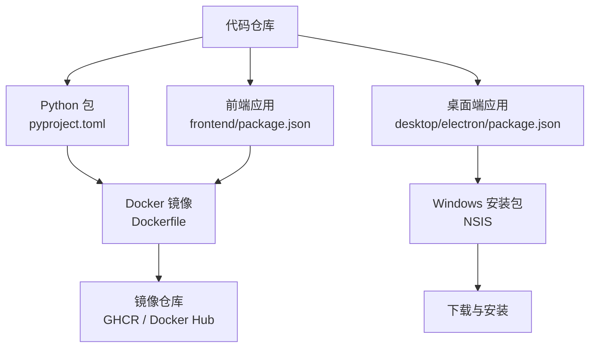
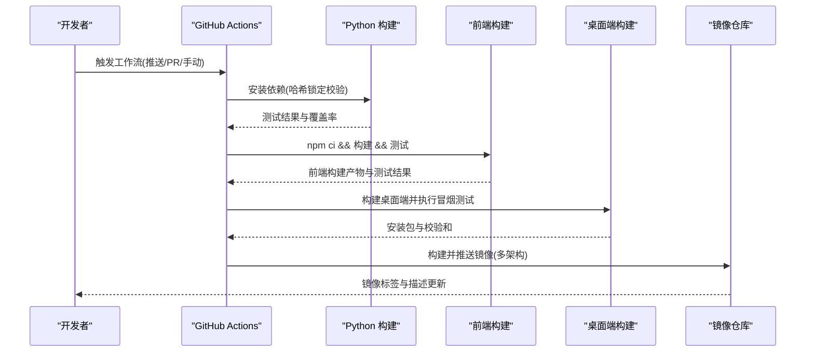
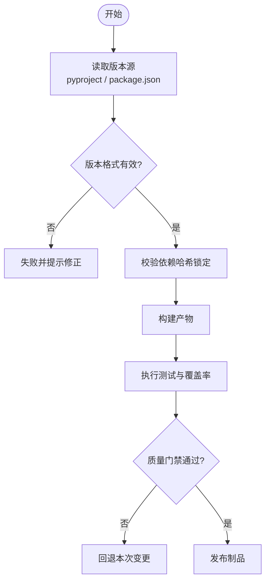
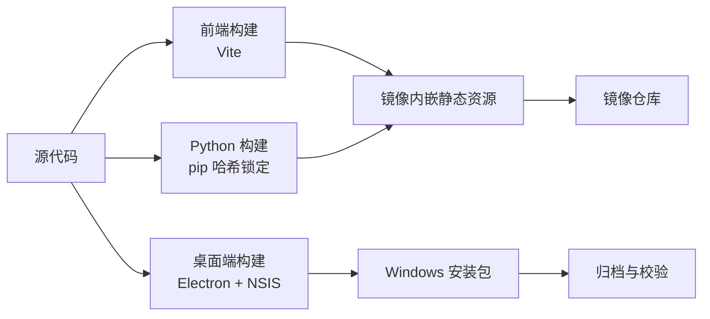
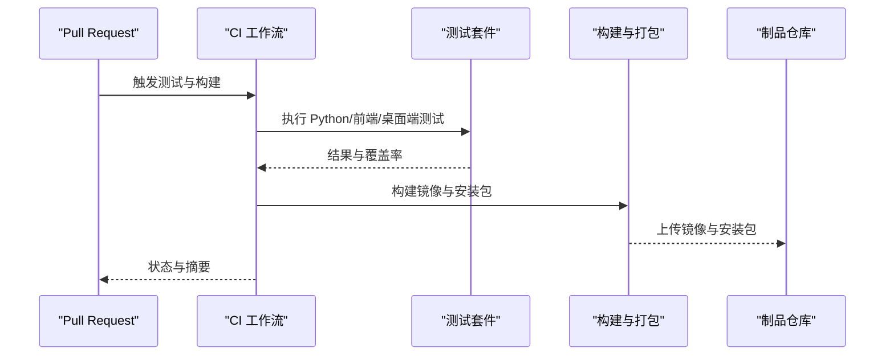
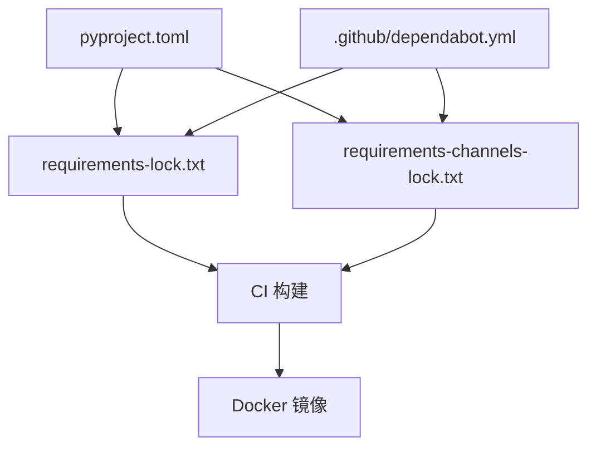

# 发布管理

<cite>
**本文引用的文件**
- [pyproject.toml](file://pyproject.toml)
- [Dockerfile](file://Dockerfile)
- [docker-compose.yml](file://docker-compose.yml)
- [.github/workflows/test.yml](file://.github/workflows/test.yml)
- [.github/workflows/docker-build.yml](file://.github/workflows/docker-build.yml)
- [.github/workflows/desktop-windows.yml](file://.github/workflows/desktop-windows.yml)
- [agent/cli/_version.py](file://agent/cli/_version.py)
- [frontend/package.json](file://frontend/package.json)
- [desktop/electron/package.json](file://desktop/electron/package.json)
- [requirements-lock.txt](file://requirements-lock.txt)
- [requirements-channels-lock.txt](file://requirements-channels-lock.txt)
- [.github/dependabot.yml](file://.github/dependabot.yml)
</cite>

## 目录
1. [简介](#简介)
2. [项目结构](#项目结构)
3. [核心组件](#核心组件)
4. [架构总览](#架构总览)
5. [详细组件分析](#详细组件分析)
6. [依赖关系分析](#依赖关系分析)
7. [性能与可维护性考虑](#性能与可维护性考虑)
8. [故障排查指南](#故障排查指南)
9. [结论](#结论)
10. [附录](#附录)

## 简介
本指南面向 Vibe-Trading 项目的发布管理工作，覆盖版本策略、多平台并行构建、CI/CD 流水线、发布渠道与回滚机制、以及发布后监控与审计。仓库已具备完善的容器化构建、双通道制品分发（GitHub Container Registry 与 Docker Hub）、前端/后端/桌面端多产物构建与测试门禁，为稳定发布提供了坚实基础。

## 项目结构
- Python 包与 CLI：通过 pyproject 定义包名、版本、入口脚本与可选依赖；CLI 版本从包元数据或 pyproject 中读取，保证单一来源。
- 前端：基于 Vite + React，提供独立构建与测试流程。
- 桌面端：Electron 打包 Windows NSIS 安装包，包含后端最小运行时与签名/校验步骤。
- 容器镜像：多阶段构建，前端静态资源与 Python 虚拟环境分离，运行态仅携带必要库与字体。
- CI/CD：GitHub Actions 负责测试、安全门禁、桌面端打包与 Docker 镜像构建推送。
- 依赖锁定：Python 主依赖与渠道 SDK 分别使用哈希锁定的 requirements-lock 与 requirements-channels-lock，确保可重复构建。

**图示来源**
- [Dockerfile:1-119](file://Dockerfile#L1-L119)
- [pyproject.toml:1-104](file://pyproject.toml#L1-L104)
- [frontend/package.json:1-58](file://frontend/package.json#L1-L58)
- [desktop/electron/package.json:1-86](file://desktop/electron/package.json#L1-L86)

**章节来源**
- [pyproject.toml:1-104](file://pyproject.toml#L1-L104)
- [Dockerfile:1-119](file://Dockerfile#L1-L119)
- [frontend/package.json:1-58](file://frontend/package.json#L1-L58)
- [desktop/electron/package.json:1-86](file://desktop/electron/package.json#L1-L86)

## 核心组件
- 版本管理
  - Python 包版本在 pyproject 中声明，CLI 运行时动态读取，避免硬编码导致漂移。
  - 前端与桌面端各自维护版本号，便于按模块发布与追踪。
- 构建与制品
  - 前端静态资源由 Node 构建并嵌入镜像。
  - Python 依赖通过哈希锁定安装，渠道 SDK 单独锁定，避免“幽灵”依赖。
  - 桌面端在 Windows 上生成 NSIS 安装包并输出校验和。
- 质量门禁
  - CI 执行 Python 语法检查、依赖哈希验证、单元测试与覆盖率收集。
  - 前端构建与单元测试纳入 CI。
  - 桌面端生命周期与凭据存储冒烟测试。
- 制品分发
  - Docker 镜像同时推送到 GHCR 与 Docker Hub，支持多架构（amd64/arm64）。
  - 桌面安装包在本地构建并记录 SHA256，用于审核与归档。

**章节来源**
- [agent/cli/_version.py:1-47](file://agent/cli/_version.py#L1-L47)
- [.github/workflows/test.yml:1-165](file://.github/workflows/test.yml#L1-L165)
- [.github/workflows/docker-build.yml:1-129](file://.github/workflows/docker-build.yml#L1-L129)
- [.github/workflows/desktop-windows.yml:1-95](file://.github/workflows/desktop-windows.yml#L1-L95)

## 架构总览
下图展示了从代码提交到制品分发的端到端流程，包括测试门禁、依赖锁定校验、前端/后端构建、桌面端打包与镜像推送。

**图示来源**
- [.github/workflows/test.yml:1-165](file://.github/workflows/test.yml#L1-L165)
- [.github/workflows/docker-build.yml:1-129](file://.github/workflows/docker-build.yml#L1-L129)
- [.github/workflows/desktop-windows.yml:1-95](file://.github/workflows/desktop-windows.yml#L1-L95)

## 详细组件分析

### 版本管理策略
- 语义化版本控制
  - Python 包版本在 pyproject 中集中声明，CLI 通过 importlib.metadata 或解析 pyproject 获取，确保“单一事实来源”。
  - 前端与桌面端各自维护版本，便于按模块迭代与发布。
- 变更日志维护
  - 建议在每次合并 PR 时更新 CHANGELOG（可在根目录新增），并在发布前由维护者核对。当前仓库未内置自动生成工具，可通过模板化 PR 模板与发布清单约束。
- 兼容性矩阵管理
  - Python 版本范围在 pyproject 中限定，CI 在多个 Python/Node 版本与操作系统上执行关键用例，确保兼容性与回归防护。
  - 依赖升级通过 Dependabot 按月批量处理次要/补丁更新，重大版本需单独评审迁移。

**图示来源**
- [agent/cli/_version.py:1-47](file://agent/cli/_version.py#L1-L47)
- [requirements-lock.txt:1-200](file://requirements-lock.txt#L1-L200)
- [requirements-channels-lock.txt:1-200](file://requirements-channels-lock.txt#L1-L200)
- [.github/workflows/test.yml:1-165](file://.github/workflows/test.yml#L1-L165)

**章节来源**
- [pyproject.toml:1-104](file://pyproject.toml#L1-L104)
- [agent/cli/_version.py:1-47](file://agent/cli/_version.py#L1-L47)
- [.github/dependabot.yml:1-103](file://.github/dependabot.yml#L1-L103)

### 多平台并行构建流程
- 构建环境隔离
  - Docker 多阶段构建：前端构建阶段与 Python 构建阶段分离，运行阶段仅包含必要运行时库与字体，减小攻击面与镜像体积。
  - 桌面端在 Windows 专用 Runner 上构建，避免跨平台差异导致的不可复现问题。
- 依赖同步
  - Python 主依赖与渠道 SDK 分别使用哈希锁定文件，CI 与 Docker 构建均强制要求哈希匹配，防止“漂移依赖”。
  - 前端使用 npm ci 与 lock 文件保证一致安装。
- 产物管理
  - 前端静态资源复制到镜像中，API 服务直接作为静态文件服务器。
  - 桌面端产出 NSIS 安装包，并生成 SHA256SUMS 用于归档与校验。

**图示来源**
- [Dockerfile:1-119](file://Dockerfile#L1-L119)
- [requirements-lock.txt:1-200](file://requirements-lock.txt#L1-L200)
- [requirements-channels-lock.txt:1-200](file://requirements-channels-lock.txt#L1-L200)
- [.github/workflows/desktop-windows.yml:1-95](file://.github/workflows/desktop-windows.yml#L1-L95)

**章节来源**
- [Dockerfile:1-119](file://Dockerfile#L1-L119)
- [requirements-lock.txt:1-200](file://requirements-lock.txt#L1-L200)
- [requirements-channels-lock.txt:1-200](file://requirements-channels-lock.txt#L1-L200)
- [.github/workflows/desktop-windows.yml:1-95](file://.github/workflows/desktop-windows.yml#L1-L95)

### 发布流水线设计（CI/CD）
- 代码审查
  - 通过 Pull Request 流程进行审查；Dependabot 自动提出依赖更新，建议将重大版本升级作为独立 PR 评审。
- 自动化测试
  - Python 单元测试、覆盖率报告；前端 Vitest 测试；桌面端生命周期与凭据存储冒烟测试。
- 质量门禁
  - 依赖哈希锁定校验；语法编译检查；测试通过率与覆盖率阈值（可按需配置）。
- 制品归档
  - Docker 镜像推送到 GHCR 与 Docker Hub，附带镜像标签与描述更新。
  - 桌面安装包生成并记录 SHA256，便于归档与分发。

**图示来源**
- [.github/workflows/test.yml:1-165](file://.github/workflows/test.yml#L1-L165)
- [.github/workflows/docker-build.yml:1-129](file://.github/workflows/docker-build.yml#L1-L129)
- [.github/workflows/desktop-windows.yml:1-95](file://.github/workflows/desktop-windows.yml#L1-L95)

**章节来源**
- [.github/workflows/test.yml:1-165](file://.github/workflows/test.yml#L1-L165)
- [.github/workflows/docker-build.yml:1-129](file://.github/workflows/docker-build.yml#L1-L129)
- [.github/workflows/desktop-windows.yml:1-95](file://.github/workflows/desktop-windows.yml#L1-L95)

### 发布渠道管理
- 内测版
  - 使用带特定标签的 Docker 镜像（如 v0.1.13-beta），部署到内部环境；桌面端安装包通过内部渠道分发。
- 公测版
  - 在公开镜像仓库中标记为候选版本（如 v0.1.13-rc1），允许外部用户拉取与反馈。
- 正式版
  - 使用最终标签（如 v0.1.13），更新 Docker Hub 描述，通知用户升级。
- 执行要点
  - 所有渠道均需通过相同的质量门禁；不同渠道仅通过标签区分，避免分支碎片化。

**章节来源**
- [.github/workflows/docker-build.yml:1-129](file://.github/workflows/docker-build.yml#L1-L129)
- [desktop/electron/package.json:1-86](file://desktop/electron/package.json#L1-L86)

### 发布回滚机制
- 版本回退
  - 通过切换镜像标签或桌面安装包版本实现快速回滚；保留历史制品以便回退。
- 热修复发布
  - 针对紧急缺陷创建 hotfix 分支，走相同 CI 流程，产出带 hotfix 标记的制品。
- 紧急修复流程
  - 优先恢复服务可用性（回退到上一稳定版本），随后在稳定分支上修复并重新发布。

**章节来源**
- [.github/workflows/docker-build.yml:1-129](file://.github/workflows/docker-build.yml#L1-L129)
- [.github/workflows/desktop-windows.yml:1-95](file://.github/workflows/desktop-windows.yml#L1-L95)

### 发布监控与审计
- 下载统计
  - 镜像仓库提供下载计数；桌面安装包可通过分发站点统计下载量。
- 错误报告
  - 服务端健康检查端点（/live）可用于存活探测；结合日志系统收集异常。
- 用户反馈收集
  - 通过 Issues 与文档站点反馈渠道收集问题；桌面端凭据存储冒烟测试保障安全性。

**章节来源**
- [Dockerfile:1-119](file://Dockerfile#L1-L119)
- [.github/workflows/desktop-windows.yml:1-95](file://.github/workflows/desktop-windows.yml#L1-L95)

## 依赖关系分析
- 依赖锁定与隔离
  - Python 主依赖与渠道 SDK 分别锁定，CI 与 Docker 构建均要求哈希匹配，确保可重复构建。
- 依赖升级策略
  - Dependabot 按月批量处理次要/补丁更新；重大版本升级需单独评审与迁移计划。
- 风险点
  - 某些依赖存在严格上限（如 pandas <3.0.0、websockets 被上层限制），升级时需评估兼容性。

**图示来源**
- [pyproject.toml:1-104](file://pyproject.toml#L1-L104)
- [requirements-lock.txt:1-200](file://requirements-lock.txt#L1-L200)
- [requirements-channels-lock.txt:1-200](file://requirements-channels-lock.txt#L1-L200)
- [.github/dependabot.yml:1-103](file://.github/dependabot.yml#L1-L103)

**章节来源**
- [requirements-lock.txt:1-200](file://requirements-lock.txt#L1-L200)
- [requirements-channels-lock.txt:1-200](file://requirements-channels-lock.txt#L1-L200)
- [.github/dependabot.yml:1-103](file://.github/dependabot.yml#L1-L103)

## 性能与可维护性考虑
- 构建缓存
  - 使用 GitHub Actions 缓存 pip 与 npm 依赖，缩短构建时间。
- 镜像优化
  - 多阶段构建减少运行态体积；仅安装必要的系统库与字体。
- 可维护性
  - 依赖锁定与哈希校验提升可重复性；Dependabot 降低依赖维护成本。
  - 桌面端与前端独立版本，便于模块化迭代。

[本节为通用指导，不直接分析具体文件]

## 故障排查指南
- 依赖安装失败
  - 检查 requirements-lock 与 requirements-channels-lock 是否完整且哈希匹配；必要时重新生成锁定文件。
- 前端构建失败
  - 确认 Node 版本与 lock 文件一致；清理缓存后重试。
- 桌面端打包失败
  - 检查 Windows Runner 环境与签名设置；查看冒烟测试输出定位问题。
- 镜像健康检查失败
  - 确认服务端口与健康端点可达；检查系统库与字体是否正确安装。

**章节来源**
- [requirements-lock.txt:1-200](file://requirements-lock.txt#L1-L200)
- [requirements-channels-lock.txt:1-200](file://requirements-channels-lock.txt#L1-L200)
- [Dockerfile:1-119](file://Dockerfile#L1-L119)
- [.github/workflows/desktop-windows.yml:1-95](file://.github/workflows/desktop-windows.yml#L1-L95)

## 结论
本项目已具备完善的版本管理、多平台构建、质量门禁与制品分发能力。通过依赖锁定、哈希校验与 CI 自动化，确保了构建的可重复性与发布的稳定性。建议在此基础上补充变更日志规范与发布清单，进一步完善发布治理。

[本节为总结性内容，不直接分析具体文件]

## 附录
- 常用命令参考
  - 本地构建前端：npm ci && npm run build
  - 本地运行 Python 服务：vibe-trading serve --host 0.0.0.0 --port 8899
  - 构建 Docker 镜像：docker build -t vibe-trading:latest .
  - 桌面端打包：npm run installer:win:review
- 环境变量与配置
  - OLLAMA_BASE_URL 等环境变量用于连接本地或远程服务。
  - 持久化卷用于保存会话、运行结果与用户上传。

**章节来源**
- [docker-compose.yml:1-90](file://docker-compose.yml#L1-L90)
- [Dockerfile:1-119](file://Dockerfile#L1-L119)
- [desktop/electron/package.json:1-86](file://desktop/electron/package.json#L1-L86)