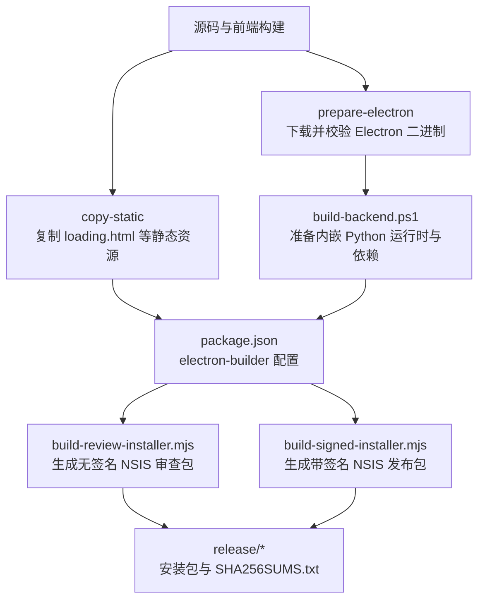
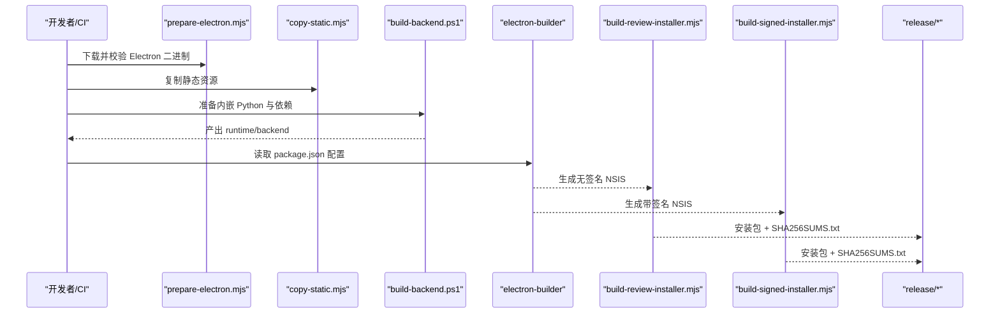
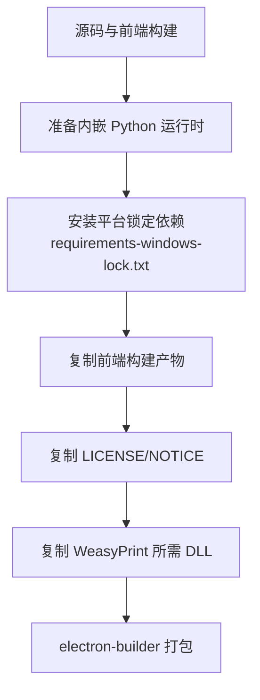
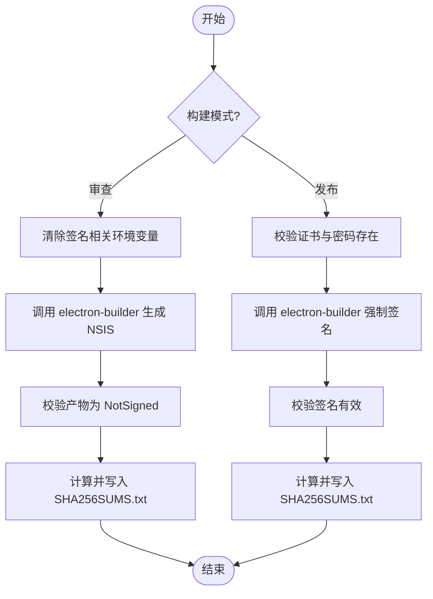
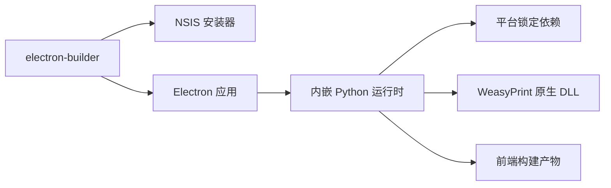

# 安装包生成

<cite>
**本文引用的文件**
- [desktop/electron/README.md](file://desktop/electron/README.md)
- [desktop/electron/WINDOWS_PACKAGING.md](file://desktop/electron/WINDOWS_PACKAGING.md)
- [desktop/electron/package.json](file://desktop/electron/package.json)
- [desktop/electron/scripts/build-review-installer.mjs](file://desktop/electron/scripts/build-review-installer.mjs)
- [desktop/electron/scripts/build-signed-installer.mjs](file://desktop/electron/scripts/build-signed-installer.mjs)
- [desktop/electron/scripts/build-backend.ps1](file://desktop/electron/scripts/build-backend.ps1)
- [desktop/electron/scripts/prepare-electron.mjs](file://desktop/electron/scripts/prepare-electron.mjs)
- [desktop/electron/scripts/copy-static.mjs](file://desktop/electron/scripts/copy-static.mjs)
- [desktop/electron/requirements-windows-lock.txt](file://desktop/electron/requirements-windows-lock.txt)
</cite>

## 目录
1. [简介](#简介)
2. [项目结构](#项目结构)
3. [核心组件](#核心组件)
4. [架构总览](#架构总览)
5. [详细组件分析](#详细组件分析)
6. [依赖关系分析](#依赖关系分析)
7. [性能与体积优化](#性能与体积优化)
8. [测试与质量保证](#测试与质量保证)
9. [故障排查指南](#故障排查指南)
10. [结论](#结论)

## 简介
本文件面向“Vibe-Trading Desktop（非官方社区构建）”的安装包生成流程，聚焦 Windows 平台的 NSIS 安装包。仓库当前仅包含 Windows 打包层：基于 Electron Builder + NSIS，内嵌受校验的 CPython 运行时、生产前端资源、最小化 Python 依赖集以及 WeasyPrint PDF 所需的原生 DLL 子集。macOS 与 Linux 的 DMG/PKG、AppImage/DEB/RPM 在本仓库中未实现；如需扩展，可参考现有脚本与配置模式进行新增。

## 项目结构
Windows 安装包的构建由一组 Node.js 脚本与 PowerShell 脚本协同完成，核心职责如下：
- 准备 Electron 运行环境并校验来源与完整性
- 构建并复制静态资源
- 组装内嵌 Python 运行时、安装锁定依赖、拷贝前端产物与许可证
- 调用 Electron Builder 生成 NSIS 安装包（支持审查用无签名与发布用带签名两种模式）
- 输出制品与校验和

图表来源
- [desktop/electron/scripts/prepare-electron.mjs:1-75](file://desktop/electron/scripts/prepare-electron.mjs#L1-L75)
- [desktop/electron/scripts/copy-static.mjs:1-8](file://desktop/electron/scripts/copy-static.mjs#L1-L8)
- [desktop/electron/scripts/build-backend.ps1:1-320](file://desktop/electron/scripts/build-backend.ps1#L1-L320)
- [desktop/electron/package.json:33-87](file://desktop/electron/package.json#L33-L87)
- [desktop/electron/scripts/build-review-installer.mjs:1-143](file://desktop/electron/scripts/build-review-installer.mjs#L1-L143)
- [desktop/electron/scripts/build-signed-installer.mjs:1-154](file://desktop/electron/scripts/build-signed-installer.mjs#L1-L154)

章节来源
- [desktop/electron/README.md:11-35](file://desktop/electron/README.md#L11-L35)
- [desktop/electron/WINDOWS_PACKAGING.md:23-50](file://desktop/electron/WINDOWS_PACKAGING.md#L23-L50)

## 核心组件
- Electron 准备器：下载指定版本 Electron 并校验哈希，确保离线可重复构建
- 静态资源复制：将 loading.html 等静态资源复制到 dist 供打包使用
- 后端运行时装配：拉取固定版本的嵌入式 Python，安装平台锁定的 Python 依赖，拷贝前端产物与许可证，裁剪测试代码，注入 WeasyPrint 所需 DLL
- 打包器：通过 electron-builder 生成 NSIS 安装包，支持审查（无签名）与发布（强制签名）两种流水线
- 安全与合规：对关键二进制与依赖进行哈希校验，禁止自动发现证书，强制签名验证

章节来源
- [desktop/electron/scripts/prepare-electron.mjs:1-75](file://desktop/electron/scripts/prepare-electron.mjs#L1-L75)
- [desktop/electron/scripts/copy-static.mjs:1-8](file://desktop/electron/scripts/copy-static.mjs#L1-L8)
- [desktop/electron/scripts/build-backend.ps1:1-320](file://desktop/electron/scripts/build-backend.ps1#L1-L320)
- [desktop/electron/package.json:33-87](file://desktop/electron/package.json#L33-L87)
- [desktop/electron/scripts/build-review-installer.mjs:1-143](file://desktop/electron/scripts/build-review-installer.mjs#L1-L143)
- [desktop/electron/scripts/build-signed-installer.mjs:1-154](file://desktop/electron/scripts/build-signed-installer.mjs#L1-L154)

## 架构总览
下图展示从源码到最终 NSIS 安装包的完整流程，包括资源准备、运行时装配、打包与签名校验。

图表来源
- [desktop/electron/scripts/prepare-electron.mjs:1-75](file://desktop/electron/scripts/prepare-electron.mjs#L1-L75)
- [desktop/electron/scripts/copy-static.mjs:1-8](file://desktop/electron/scripts/copy-static.mjs#L1-L8)
- [desktop/electron/scripts/build-backend.ps1:1-320](file://desktop/electron/scripts/build-backend.ps1#L1-L320)
- [desktop/electron/package.json:33-87](file://desktop/electron/package.json#L33-L87)
- [desktop/electron/scripts/build-review-installer.mjs:1-143](file://desktop/electron/scripts/build-review-installer.mjs#L1-L143)
- [desktop/electron/scripts/build-signed-installer.mjs:1-154](file://desktop/electron/scripts/build-signed-installer.mjs#L1-L154)

## 详细组件分析

### Windows NSIS 安装包
- 目标与范围：仅 x64 架构，NSIS 安装器，不包含可选 IM/渠道扩展与券商特定依赖
- 用户交互选项：
  - 允许选择安装目录
  - 创建桌面快捷方式
  - 创建开始菜单快捷方式
  - 非一键安装（提供向导界面）
- 压缩级别：构建时通过环境变量覆盖为 7，平衡构建时间与体积
- 产物命名：包含版本号与架构信息，便于识别

章节来源
- [desktop/electron/package.json:69-86](file://desktop/electron/package.json#L69-L86)
- [desktop/electron/WINDOWS_PACKAGING.md:23-50](file://desktop/electron/WINDOWS_PACKAGING.md#L23-L50)

### 资源文件打包过程
- 应用文件：Electron 主进程与渲染进程产物（dist 目录）
- 运行时依赖：内嵌 Python 3.12.10 嵌入版，按平台锁定依赖安装
- 配置文件与许可证：LICENSE、NOTICE 被复制到安装包资源目录
- 前端资源：生产构建产物被复制到运行时目录，供后端加载
- 原生依赖：WeasyPrint PDF 所需的 GTK/Pango/Cairo 等 DLL 子集被精确复制

图表来源
- [desktop/electron/scripts/build-backend.ps1:1-320](file://desktop/electron/scripts/build-backend.ps1#L1-L320)
- [desktop/electron/package.json:51-68](file://desktop/electron/package.json#L51-L68)
- [desktop/electron/requirements-windows-lock.txt:1-10](file://desktop/electron/requirements-windows-lock.txt#L1-L10)

章节来源
- [desktop/electron/scripts/build-backend.ps1:1-320](file://desktop/electron/scripts/build-backend.ps1#L1-L320)
- [desktop/electron/package.json:51-68](file://desktop/electron/package.json#L51-L68)

### 自定义安装逻辑
- 预安装检查：
  - 校验 Electron 二进制哈希
  - 校验 Python 嵌入包与 GTK 安装器哈希
  - 校验前端构建产物存在
  - 校验 Python 依赖满足元数据
- 后安装配置：
  - 在首次启动时迁移明文凭据至 safeStorage，并删除明文字段
  - 设置环境变量与路径以定位后端与原生 DLL
- 卸载清理：
  - 通过系统卸载程序移除安装目录与快捷方式
  - 注意：safeStorage 中的凭据需由应用自身管理清理策略

章节来源
- [desktop/electron/scripts/prepare-electron.mjs:1-75](file://desktop/electron/scripts/prepare-electron.mjs#L1-L75)
- [desktop/electron/scripts/build-backend.ps1:1-320](file://desktop/electron/scripts/build-backend.ps1#L1-L320)
- [desktop/electron/WINDOWS_PACKAGING.md:74-86](file://desktop/electron/WINDOWS_PACKAGING.md#L74-L86)

### 签名与发布控制
- 审查模式（无签名）：
  - 禁用证书自动发现
  - 强制所有产物状态为 NotSigned
  - 生成 SHA256SUMS.txt
- 发布模式（带签名）：
  - 要求提供证书与密码环境变量
  - 启用 forceCodeSigning
  - 验证安装包与应用可执行文件的签名有效性
  - 生成 SHA256SUMS.txt

图表来源
- [desktop/electron/scripts/build-review-installer.mjs:1-143](file://desktop/electron/scripts/build-review-installer.mjs#L1-L143)
- [desktop/electron/scripts/build-signed-installer.mjs:1-154](file://desktop/electron/scripts/build-signed-installer.mjs#L1-L154)

章节来源
- [desktop/electron/scripts/build-review-installer.mjs:1-143](file://desktop/electron/scripts/build-review-installer.mjs#L1-L143)
- [desktop/electron/scripts/build-signed-installer.mjs:1-154](file://desktop/electron/scripts/build-signed-installer.mjs#L1-L154)

## 依赖关系分析
- 构建期依赖：
  - Electron Builder（含 dmg-builder、squirrel-windows 等插件，但当前仅使用 nsis）
  - TypeScript 编译与静态资源复制脚本
- 运行时依赖：
  - 内嵌 Python 3.12.10 嵌入版
  - 平台锁定依赖集合（requirements-windows-lock.txt），通过 --require-hashes 安装
  - WeasyPrint 所需的 GTK/Pango/Cairo 等原生 DLL 子集
- 外部集成点：
  - GitHub 官方 Electron 分发源
  - Python.org 嵌入版分发源
  - GTK-for-Windows-Runtime-Installer 发行源

图表来源
- [desktop/electron/package.json:24-35](file://desktop/electron/package.json#L24-L35)
- [desktop/electron/scripts/build-backend.ps1:1-320](file://desktop/electron/scripts/build-backend.ps1#L1-L320)
- [desktop/electron/requirements-windows-lock.txt:1-10](file://desktop/electron/requirements-windows-lock.txt#L1-L10)

章节来源
- [desktop/electron/package.json:24-35](file://desktop/electron/package.json#L24-L35)
- [desktop/electron/scripts/build-backend.ps1:1-320](file://desktop/electron/scripts/build-backend.ps1#L1-L320)
- [desktop/electron/requirements-windows-lock.txt:1-10](file://desktop/electron/requirements-windows-lock.txt#L1-L10)

## 性能与体积优化
- 压缩级别：构建时设置压缩等级为 7，平衡构建时间与安装包体积
- 依赖裁剪：
  - 仅安装平台锁定依赖，排除可选 IM/渠道扩展
  - 删除第三方包中的 test/tests 目录以减少体积
- 资源精简：
  - 仅复制 WeasyPrint 所需的最小 DLL 子集
  - 不引入可选 broker 或聊天适配器
- 缓存与离线：
  - 预缓存 Electron 二进制与 Python/GTK 安装器，支持断点重试与哈希校验
  - 通过锁定文件保证可重复构建

章节来源
- [desktop/electron/WINDOWS_PACKAGING.md:23-50](file://desktop/electron/WINDOWS_PACKAGING.md#L23-L50)
- [desktop/electron/scripts/build-backend.ps1:220-253](file://desktop/electron/scripts/build-backend.ps1#L220-L253)
- [desktop/electron/scripts/build-backend.ps1:192-237](file://desktop/electron/scripts/build-backend.ps1#L192-L237)
- [desktop/electron/scripts/prepare-electron.mjs:1-75](file://desktop/electron/scripts/prepare-electron.mjs#L1-L75)

## 测试与质量保证
- 本地/CI 流程建议：
  - 构建前端与 Electron 资源
  - 准备 Electron 与后端运行时
  - 运行生命周期冒烟测试（本地化、后端解析、优雅关闭、父进程死亡路径）
  - 生成审查安装包并校验签名状态
  - 生成发布安装包并校验签名有效性
- 静默安装与升级：
  - NSIS 支持命令行参数（如 /S 静默），可在 CI 或用户脚本中使用
  - 升级安装可通过覆盖安装实现；建议在应用层处理配置迁移与数据兼容
- 卸载验证：
  - 使用系统卸载程序卸载后，确认安装目录与快捷方式已清理
  - 检查 safeStorage 中凭据是否按策略清理（由应用负责）

章节来源
- [desktop/electron/README.md:54-62](file://desktop/electron/README.md#L54-L62)
- [desktop/electron/WINDOWS_PACKAGING.md:23-50](file://desktop/electron/WINDOWS_PACKAGING.md#L23-L50)
- [desktop/electron/scripts/build-review-installer.mjs:1-143](file://desktop/electron/scripts/build-review-installer.mjs#L1-L143)
- [desktop/electron/scripts/build-signed-installer.mjs:1-154](file://desktop/electron/scripts/build-signed-installer.mjs#L1-L154)

## 故障排查指南
- Electron 下载失败或哈希不匹配：
  - 检查网络与代理设置
  - 确认 checksums.json 中存在对应条目
  - 查看 prepare-electron.mjs 的重试日志
- Python 依赖安装失败：
  - 确认 requirements-windows-lock.txt 存在且未被篡改
  - 检查 pip 版本与哈希校验行为
- WeasyPrint PDF 功能异常：
  - 确认 GTK 安装器与 DLL 子集已正确复制
  - 检查 PATH 与 WEASYPRINT_DLL_DIRECTORIES 环境变量
- 签名相关问题：
  - 审查模式：确保未泄露证书环境变量
  - 发布模式：确认证书与密码环境变量正确传入，且 forceCodeSigning 生效
- 前端资源缺失：
  - 确认 frontend/dist 已构建并存在于预期路径

章节来源
- [desktop/electron/scripts/prepare-electron.mjs:1-75](file://desktop/electron/scripts/prepare-electron.mjs#L1-L75)
- [desktop/electron/scripts/build-backend.ps1:1-320](file://desktop/electron/scripts/build-backend.ps1#L1-L320)
- [desktop/electron/scripts/build-signed-installer.mjs:1-154](file://desktop/electron/scripts/build-signed-installer.mjs#L1-L154)

## 结论
本仓库提供了成熟的 Windows NSIS 安装包生成方案，具备严格的来源校验、依赖锁定与签名控制，适合在 CI 中稳定构建审查与发布制品。当前未包含 macOS 与 Linux 安装包；若需扩展，可参照现有脚本结构与 electron-builder 配置，新增 dmg/pkg 或 AppImage/DEB/RPM 目标，并复用依赖锁定与资源复制策略。对于高级安装逻辑（注册表项、文件关联、更复杂的卸载清理），可在 NSIS 脚本或应用启动阶段扩展实现。