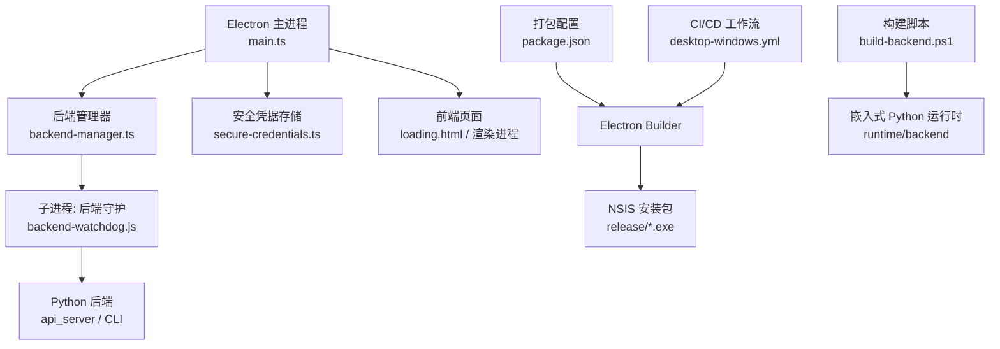
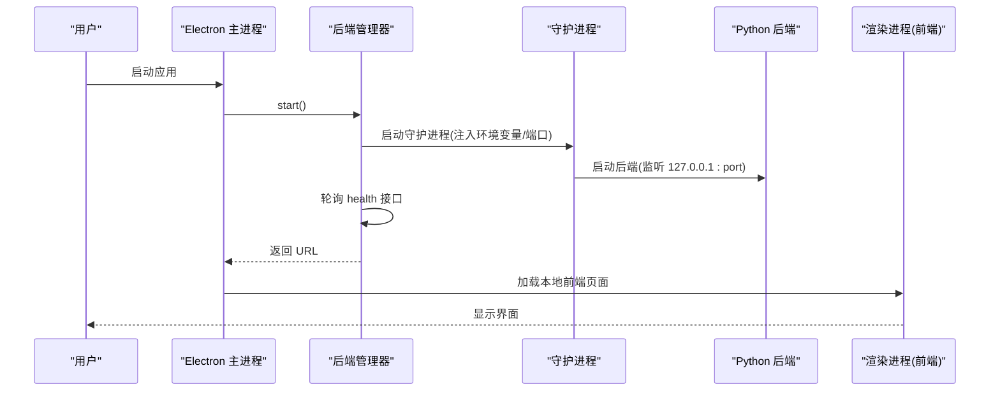
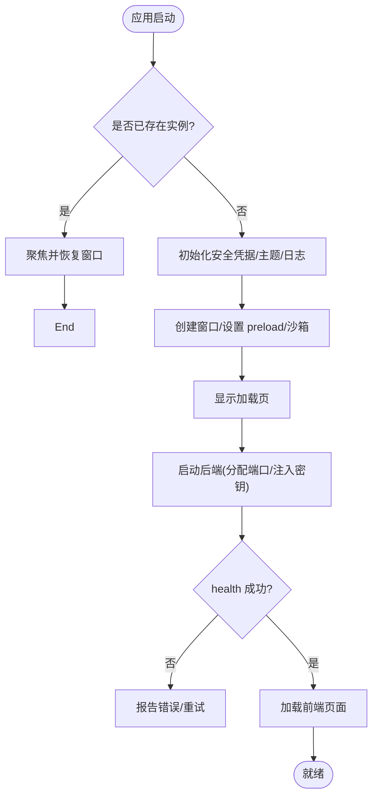
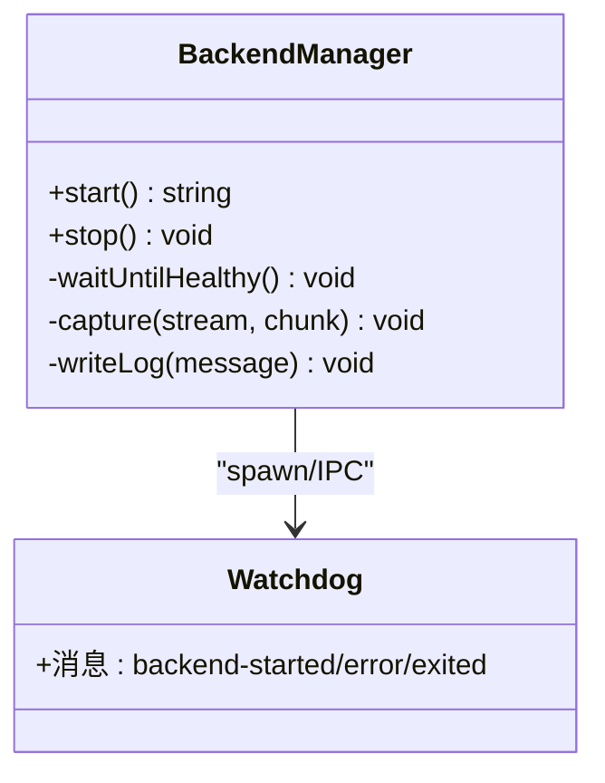
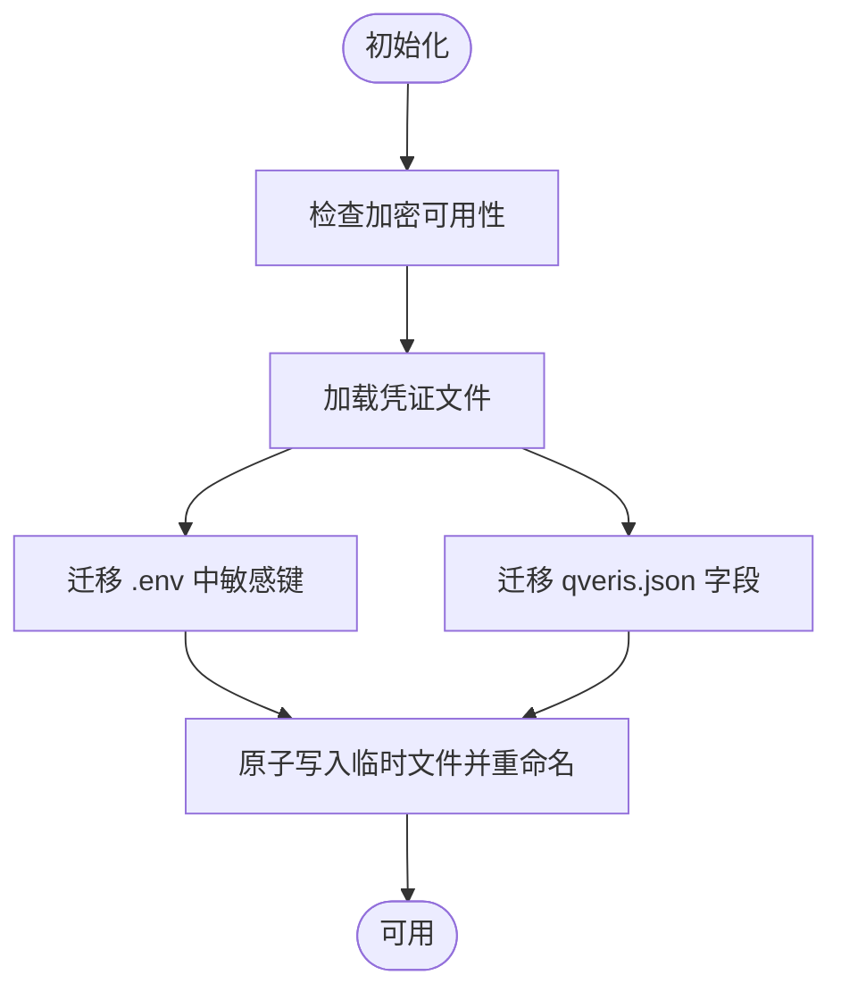
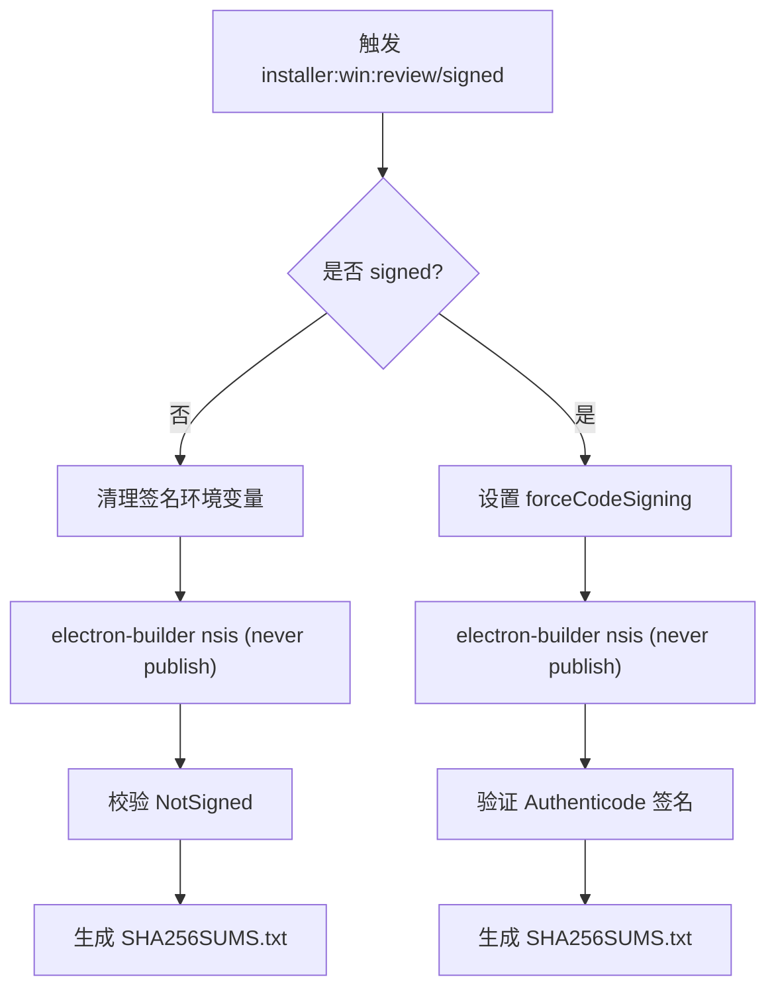
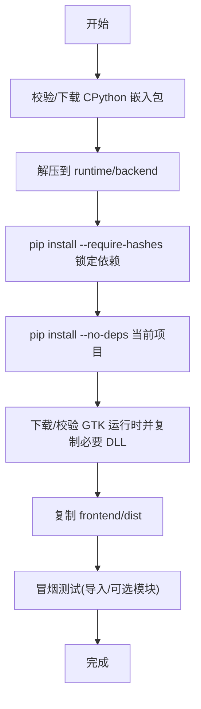
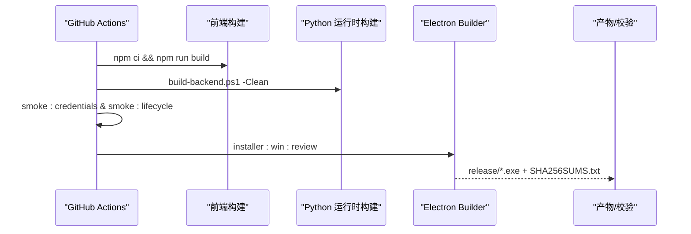
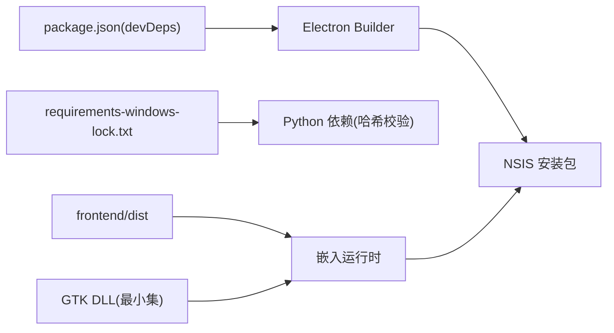

# 打包与分发

<cite>
**本文引用的文件**
- [desktop/electron/package.json](file://desktop/electron/package.json)
- [desktop/electron/README.md](file://desktop/electron/README.md)
- [desktop/electron/WINDOWS_PACKAGING.md](file://desktop/electron/WINDOWS_PACKAGING.md)
- [desktop/electron/src/main.ts](file://desktop/electron/src/main.ts)
- [desktop/electron/src/backend-manager.ts](file://desktop/electron/src/backend-manager.ts)
- [desktop/electron/src/secure-credentials.ts](file://desktop/electron/src/secure-credentials.ts)
- [desktop/electron/scripts/build-signed-installer.mjs](file://desktop/electron/scripts/build-signed-installer.mjs)
- [desktop/electron/scripts/build-review-installer.mjs](file://desktop/electron/scripts/build-review-installer.mjs)
- [desktop/electron/scripts/prepare-electron.mjs](file://desktop/electron/scripts/prepare-electron.mjs)
- [desktop/electron/scripts/build-backend.ps1](file://desktop/electron/scripts/build-backend.ps1)
- [.github/workflows/desktop-windows.yml](file://.github/workflows/desktop-windows.yml)
- [desktop/electron/requirements-windows-lock.txt](file://desktop/electron/requirements-windows-lock.txt)
</cite>

## 目录
1. [简介](#简介)
2. [项目结构](#项目结构)
3. [核心组件](#核心组件)
4. [架构总览](#架构总览)
5. [详细组件分析](#详细组件分析)
6. [依赖关系分析](#依赖关系分析)
7. [性能考虑](#性能考虑)
8. [故障排除指南](#故障排除指南)
9. [结论](#结论)
10. [附录](#附录)

## 简介
本指南面向生产环境，提供桌面应用（Electron + Python 后端）在 Windows、macOS、Linux 的打包与分发完整流程。重点覆盖：
- 跨平台构建流程与平台特定配置
- 代码签名与完整性校验、信任链验证
- 自动更新系统（版本检测、增量更新、回滚机制）
- 安装包制作（资源打包、配置文件生成、安装脚本）
- CI/CD 集成与多平台并行构建、产物管理
- 调试与测试方法（模拟器/真机、兼容性）
- 故障排除与常见问题

说明：当前仓库已实现 Windows 平台的 Electron 打包、签名与完整性校验；macOS/Linux 的打包策略可参考本节“通用原则”与“CI/CD 扩展建议”。

## 项目结构
桌面端由 Electron 宿主进程与内嵌 Python 后端组成。Electron 负责单实例、本地端口绑定、安全注入认证密钥、等待后端健康检查后加载前端页面，并管理生命周期与日志。Windows 打包通过 Electron Builder 生成 NSIS 安装包，附带受校验的 CPython 运行时与最小化依赖集。

图示来源
- [desktop/electron/src/main.ts:1-285](file://desktop/electron/src/main.ts#L1-L285)
- [desktop/electron/src/backend-manager.ts:1-426](file://desktop/electron/src/backend-manager.ts#L1-L426)
- [desktop/electron/package.json:33-87](file://desktop/electron/package.json#L33-L87)
- [desktop/electron/scripts/build-backend.ps1:1-320](file://desktop/electron/scripts/build-backend.ps1#L1-L320)
- [.github/workflows/desktop-windows.yml:1-95](file://.github/workflows/desktop-windows.yml#L1-L95)

章节来源
- [desktop/electron/README.md:1-93](file://desktop/electron/README.md#L1-L93)
- [desktop/electron/package.json:1-86](file://desktop/electron/package.json#L1-L86)

## 核心组件
- Electron 主进程：单实例锁、本地端口选择、注入认证密钥、等待后端健康、菜单与错误处理、国际化加载页。
- 后端管理器：解析后端可执行路径、启动守护进程、健康检查、优雅关闭、日志捕获、异常退出上报。
- 安全凭据存储：使用 safeStorage 加密保存敏感键，迁移 .env/qveris.json，限制允许写入的键集合。
- 打包与签名：review 模式生成未签名安装包并校验未签名状态；signed 模式启用强制签名并验证 Authenticode 签名与 SHA-256。
- 嵌入式 Python 运行时：下载并校验 CPython 压缩包、安装锁定依赖、复制 PDF 所需 GTK DLL、拷贝前端产物、运行冒烟测试。
- CI/CD：在干净 Windows 镜像上构建前端、组装运行时、运行冒烟测试、生成 review 安装包并记录哈希。

章节来源
- [desktop/electron/src/main.ts:1-285](file://desktop/electron/src/main.ts#L1-L285)
- [desktop/electron/src/backend-manager.ts:1-426](file://desktop/electron/src/backend-manager.ts#L1-L426)
- [desktop/electron/src/secure-credentials.ts:1-240](file://desktop/electron/src/secure-credentials.ts#L1-L240)
- [desktop/electron/scripts/build-signed-installer.mjs:1-154](file://desktop/electron/scripts/build-signed-installer.mjs#L1-L154)
- [desktop/electron/scripts/build-review-installer.mjs:1-143](file://desktop/electron/scripts/build-review-installer.mjs#L1-L143)
- [desktop/electron/scripts/prepare-electron.mjs:1-75](file://desktop/electron/scripts/prepare-electron.mjs#L1-L75)
- [desktop/electron/scripts/build-backend.ps1:1-320](file://desktop/electron/scripts/build-backend.ps1#L1-L320)
- [.github/workflows/desktop-windows.yml:1-95](file://.github/workflows/desktop-windows.yml#L1-L95)

## 架构总览
下图展示从 Electron 启动到后端就绪、再到 UI 加载的关键时序。

图示来源
- [desktop/electron/src/main.ts:148-192](file://desktop/electron/src/main.ts#L148-L192)
- [desktop/electron/src/backend-manager.ts:63-146](file://desktop/electron/src/backend-manager.ts#L63-L146)

## 详细组件分析

### Electron 主进程与生命周期
- 单实例锁：防止重复启动，聚焦已有窗口。
- 安全请求头：对本地后端同源请求注入 Authorization 令牌，不暴露给页面 JS。
- 导航保护：阻止离开本地后端源，仅允许安全的 https/http 外部链接。
- 启动流程：初始化安全凭据、创建窗口、显示加载页、启动后端、健康检查通过后加载前端。
- 关闭流程：先尝试调用后端 shutdown 接口，再终止守护进程树，确保无残留进程。

图示来源
- [desktop/electron/src/main.ts:35-63](file://desktop/electron/src/main.ts#L35-L63)
- [desktop/electron/src/main.ts:65-117](file://desktop/electron/src/main.ts#L65-L117)
- [desktop/electron/src/main.ts:148-192](file://desktop/electron/src/main.ts#L148-L192)
- [desktop/electron/src/main.ts:249-255](file://desktop/electron/src/main.ts#L249-L255)

章节来源
- [desktop/electron/src/main.ts:1-285](file://desktop/electron/src/main.ts#L1-L285)

### 后端管理与守护进程
- 后端解析：优先使用环境变量覆盖，其次查找打包后的 backend/python.exe 或 Scripts/vibe-trading.exe，开发模式下按标记目录查找 .venv。
- 端口分配：随机空闲端口，绑定 127.0.0.1。
- 健康检查：轮询 health 接口，超时失败并输出最近日志片段。
- 优雅关闭：POST system/shutdown，等待退出，必要时通过 taskkill 终止进程树。
- 日志：按天写入 desktop-YYYYMMDD.log，保留最近输出用于错误上下文。

图示来源
- [desktop/electron/src/backend-manager.ts:52-146](file://desktop/electron/src/backend-manager.ts#L52-L146)
- [desktop/electron/src/backend-manager.ts:148-187](file://desktop/electron/src/backend-manager.ts#L148-L187)
- [desktop/electron/src/backend-manager.ts:261-286](file://desktop/electron/src/backend-manager.ts#L261-L286)

章节来源
- [desktop/electron/src/backend-manager.ts:1-426](file://desktop/electron/src/backend-manager.ts#L1-L426)

### 安全凭据存储
- 加密存储：使用 safeStorage 加密敏感键，持久化为 versioned JSON，权限 0o600。
- 白名单：仅允许写入预定义的环境变量名（如各类 API Key）。
- 迁移：首次启动将 .env 与 qveris.json 中的敏感字段迁移至安全存储，并从原位置移除明文。
- 注入：启动后端时以环境变量形式注入解密值，不返回给渲染进程。

图示来源
- [desktop/electron/src/secure-credentials.ts:68-123](file://desktop/electron/src/secure-credentials.ts#L68-L123)
- [desktop/electron/src/secure-credentials.ts:166-219](file://desktop/electron/src/secure-credentials.ts#L166-L219)

章节来源
- [desktop/electron/src/secure-credentials.ts:1-240](file://desktop/electron/src/secure-credentials.ts#L1-L240)

### Windows 打包与签名
- Review 模式：禁用所有签名相关环境变量，强制关闭证书自动发现，构建 NSIS 安装包并校验产物为 NotSigned，同时生成 SHA-256SUMS.txt。
- Signed 模式：要求 WIN_CSC_LINK/WIN_CSC_KEY_PASSWORD（或 CSC_* 回退），启用 forceCodeSigning，构建后使用 Get-AuthenticodeSignature 验证应用与安装包的签名有效性，并输出 SHA-256。
- 压缩级别：通过 ELECTRON_BUILDER_COMPRESSION_LEVEL=7 控制构建时间。

图示来源
- [desktop/electron/scripts/build-review-installer.mjs:1-143](file://desktop/electron/scripts/build-review-installer.mjs#L1-L143)
- [desktop/electron/scripts/build-signed-installer.mjs:1-154](file://desktop/electron/scripts/build-signed-installer.mjs#L1-L154)
- [desktop/electron/package.json:21-24](file://desktop/electron/package.json#L21-L24)

章节来源
- [desktop/electron/WINDOWS_PACKAGING.md:1-153](file://desktop/electron/WINDOWS_PACKAGING.md#L1-L153)
- [desktop/electron/scripts/build-signed-installer.mjs:1-154](file://desktop/electron/scripts/build-signed-installer.mjs#L1-L154)
- [desktop/electron/scripts/build-review-installer.mjs:1-143](file://desktop/electron/scripts/build-review-installer.mjs#L1-L143)

### 嵌入式 Python 运行时构建
- 固定版本：下载并校验 CPython 3.12.10 嵌入包，解压到 runtime/backend。
- 依赖锁定：使用 requirements-windows-lock.txt 以 --require-hashes 安装基础依赖，再以 --no-deps 安装当前项目，避免版本漂移。
- PDF 支持：下载并校验 GTK 运行时，仅复制 WeasyPrint 所需的 DLL 与字体等最小集合。
- 前端产物：将 frontend/dist 复制到运行时 Lib/frontend/dist。
- 冒烟测试：验证 api_server/cli/weasyprint 导入与可选模块缺失，确保最小依赖边界。

图示来源
- [desktop/electron/scripts/build-backend.ps1:13-65](file://desktop/electron/scripts/build-backend.ps1#L13-L65)
- [desktop/electron/scripts/build-backend.ps1:185-218](file://desktop/electron/scripts/build-backend.ps1#L185-L218)
- [desktop/electron/scripts/build-backend.ps1:192-254](file://desktop/electron/scripts/build-backend.ps1#L192-L254)
- [desktop/electron/scripts/build-backend.ps1:351-384](file://desktop/electron/scripts/build-backend.ps1#L351-L384)

章节来源
- [desktop/electron/scripts/build-backend.ps1:1-320](file://desktop/electron/scripts/build-backend.ps1#L1-L320)

### 自动更新系统
- 现状：桌面层不包含内置更新器或发布源配置；Python CLI 提供自更新能力（vibe-trading update），通过 PyPI 检查最新版本并使用相同解释器升级 wheel 安装。
- 适用场景：适用于通过 pip 安装的 CLI 环境；对于 Electron 打包的应用，需结合平台分发渠道（如应用商店或自定义更新服务器）实现增量更新与回滚。
- 建议方案：
  - 版本检测：维护一个可信的更新清单（JSON），包含版本号、下载地址、增量补丁信息、签名摘要。
  - 增量更新：基于差异包（如 xdelta/sbsdiff）下载补丁，校验签名与哈希后替换目标文件。
  - 回滚机制：更新前备份旧版本，失败时自动回滚；支持手动回滚入口。
  - 安全校验：对所有更新包进行签名验证与完整性校验。

章节来源
- [desktop/electron/README.md:99-114](file://desktop/electron/README.md#L99-L114)
- [agent/cli/commands/update.py:1-67](file://agent/cli/commands/update.py#L1-L67)
- [agent/tests/test_cli_update.py:81-298](file://agent/tests/test_cli_update.py#L81-L298)

### 安装包制作与配置
- 资源打包：通过 extraResources 将后端运行时、许可证与声明文件打包进应用。
- 语言支持：配置 electronLanguages 以支持多语言加载页与菜单。
- 安装选项：NSIS 非一键安装、允许更改安装目录、创建桌面与开始菜单快捷方式。
- 产物命名：artifactName 包含版本与架构，便于识别。

章节来源
- [desktop/electron/package.json:33-87](file://desktop/electron/package.json#L33-L87)

### CI/CD 集成与产物管理
- 触发条件：当涉及桌面、前端、代理或 pyproject.toml 变更时触发。
- 构建步骤：安装 Node/Python，构建前端，安装桌面依赖，验证凭据存储，组装 Python 运行时，运行冒烟测试，构建 review 安装包，验证父进程死亡清理，记录 SHA-256。
- 产物：生成未签名安装包与 SHA256SUMS.txt，供评审与归档。

图示来源
- [.github/workflows/desktop-windows.yml:1-95](file://.github/workflows/desktop-windows.yml#L1-L95)

章节来源
- [.github/workflows/desktop-windows.yml:1-95](file://.github/workflows/desktop-windows.yml#L1-L95)

## 依赖关系分析
- 构建期依赖：Electron、Electron Builder、TypeScript 等位于 devDependencies。
- 运行时依赖：Python 依赖通过 requirements-windows-lock.txt 锁定并校验哈希；前端静态资源通过构建产物注入。
- 外部依赖：PDF 渲染需要 GTK 运行时 DLL，脚本仅复制最小必要集合。

图示来源
- [desktop/electron/package.json:24-28](file://desktop/electron/package.json#L24-L28)
- [desktop/electron/requirements-windows-lock.txt:1-200](file://desktop/electron/requirements-windows-lock.txt#L1-L200)
- [desktop/electron/scripts/build-backend.ps1:192-237](file://desktop/electron/scripts/build-backend.ps1#L192-L237)

章节来源
- [desktop/electron/package.json:1-86](file://desktop/electron/package.json#L1-L86)
- [desktop/electron/requirements-windows-lock.txt:1-200](file://desktop/electron/requirements-windows-lock.txt#L1-L200)

## 性能考虑
- 构建时间：通过压缩级别 7 平衡体积与构建速度。
- 运行时体积：仅安装必要依赖与 PDF 所需 DLL，删除测试目录以减少体积。
- 启动延迟：后端健康检查轮询间隔短，快速反馈；日志滚动避免过大文件。
- 内存与 CPU：前端沙箱与上下文隔离减少攻击面与开销；后端按需加载。

[本节为通用指导，无需具体文件引用]

## 故障排除指南
- 无法找到后端：检查环境变量覆盖、打包路径解析逻辑、PATH 中是否存在可执行文件。
- 端口不可用：确认本机未被占用；查看健康检查超时与最近日志。
- 凭据加密不可用：确认操作系统会话支持 safeStorage；检查迁移过程是否成功。
- 签名失败：确保提供正确的证书与密码；检查 PowerShell 是否能加载 Get-AuthenticodeSignature。
- PDF 渲染失败：确认 GTK DLL 已正确复制且 PATH/WEASYPRINT_DLL_DIRECTORIES 设置正确。
- CI 构建失败：核对 Python/Node 版本、缓存依赖、网络访问与工件路径。

章节来源
- [desktop/electron/src/backend-manager.ts:261-286](file://desktop/electron/src/backend-manager.ts#L261-L286)
- [desktop/electron/src/secure-credentials.ts:84-95](file://desktop/electron/src/secure-credentials.ts#L84-L95)
- [desktop/electron/scripts/build-signed-installer.mjs:123-147](file://desktop/electron/scripts/build-signed-installer.mjs#L123-L147)
- [desktop/electron/scripts/build-backend.ps1:351-384](file://desktop/electron/scripts/build-backend.ps1#L351-L384)

## 结论
本项目在 Windows 平台实现了完整的 Electron 打包、签名与完整性校验流程，并通过严格的依赖锁定与最小化运行时保障安全性与可复现性。自动更新功能在 CLI 层可用，桌面端可按需接入平台化更新通道。建议在 macOS/Linux 复用相同的依赖锁定与安全策略，并结合各自平台工具（如 notarization、AppImage/Flatpak）完善打包与分发。

[本节为总结，无需具体文件引用]

## 附录

### 跨平台构建要点
- Windows：使用 Electron Builder + NSIS，配合 review/signed 两种构建模式；依赖锁定与 PDF 支持已在脚本中固化。
- macOS：建议使用 Electron Builder 的 mas/dmg 目标，启用代码签名与公证；Python 后端可通过 PyInstaller 或内嵌方式打包。
- Linux：建议使用 AppImage/Flatpak/Snap 等格式；保持依赖锁定与最小化依赖策略一致。

[本节为通用指导，无需具体文件引用]

### 安全最佳实践
- 代码签名：生产构建必须启用强制签名并验证签名状态。
- 完整性校验：所有二进制与更新包均需计算并校验哈希。
- 信任链：确保证书有效且由受信任 CA 签发；定期轮换证书。
- 最小权限：仅授予必要的文件系统与网络访问权限。

[本节为通用指导，无需具体文件引用]