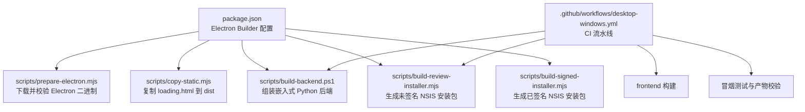
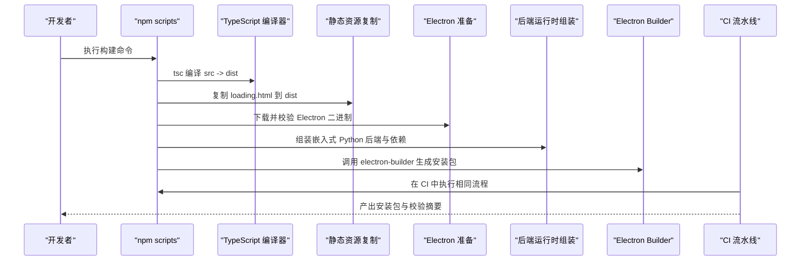
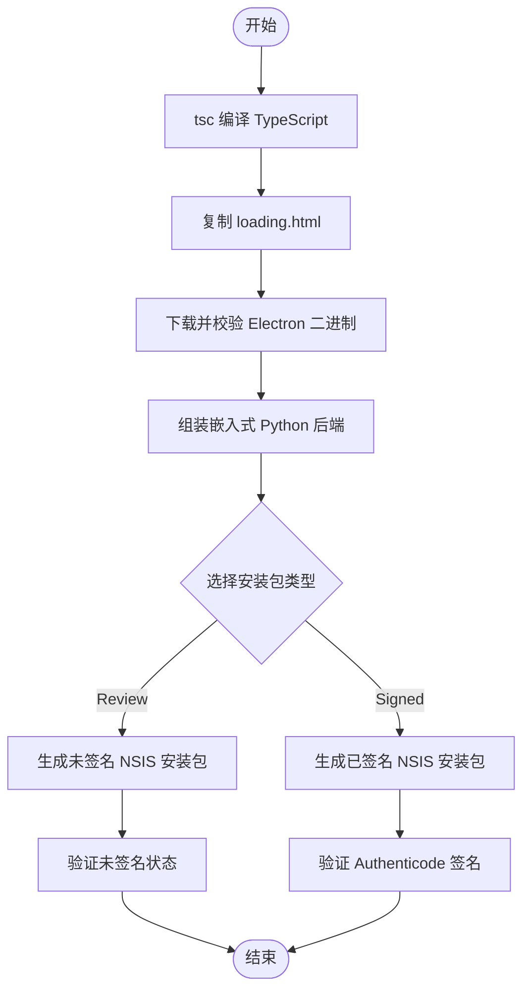
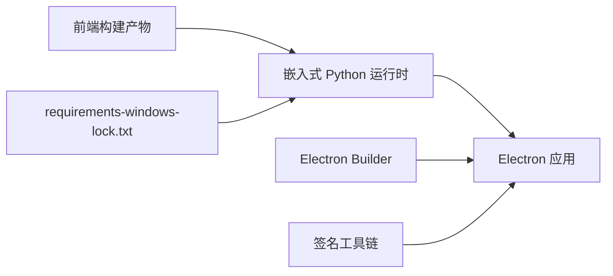

# 构建配置

<cite>
**本文引用的文件**
- [desktop/electron/package.json](file://desktop/electron/package.json)
- [desktop/electron/tsconfig.json](file://desktop/electron/tsconfig.json)
- [desktop/electron/scripts/prepare-electron.mjs](file://desktop/electron/scripts/prepare-electron.mjs)
- [desktop/electron/scripts/copy-static.mjs](file://desktop/electron/scripts/copy-static.mjs)
- [desktop/electron/scripts/build-backend.ps1](file://desktop/electron/scripts/build-backend.ps1)
- [desktop/electron/scripts/build-review-installer.mjs](file://desktop/electron/scripts/build-review-installer.mjs)
- [desktop/electron/scripts/build-signed-installer.mjs](file://desktop/electron/scripts/build-signed-installer.mjs)
- [.github/workflows/desktop-windows.yml](file://.github/workflows/desktop-windows.yml)
- [desktop/electron/requirements-windows-lock.txt](file://desktop/electron/requirements-windows-lock.txt)
- [desktop/electron/README.md](file://desktop/electron/README.md)
- [desktop/electron/WINDOWS_PACKAGING.md](file://desktop/electron/WINDOWS_PACKAGING.md)
</cite>

## 目录
1. [简介](#简介)
2. [项目结构](#项目结构)
3. [核心组件](#核心组件)
4. [架构总览](#架构总览)
5. [详细组件分析](#详细组件分析)
6. [依赖关系分析](#依赖关系分析)
7. [性能与优化](#性能与优化)
8. [故障排查指南](#故障排查指南)
9. [结论](#结论)
10. [附录](#附录)

## 简介
本文件面向桌面端 Electron 应用的构建配置，聚焦于 Electron Builder 的配置项、多平台构建策略（当前仓库实现以 Windows 为主）、构建脚本工作流（TypeScript 编译、静态资源复制、Electron 环境准备、Python 后端打包）、环境变量与参数定制方法，以及构建优化与常见问题诊断。文档基于仓库中实际存在的配置文件与脚本进行说明，确保可追溯与可复现。

## 项目结构
桌面端构建相关的关键位置与职责：
- desktop/electron/package.json：定义应用标识、产品名称、压缩级别、asar、语言包、输出目录、打包资源、Windows NSIS 目标与安装器选项等。
- desktop/electron/tsconfig.json：TypeScript 编译目标、模块系统、输出目录与严格模式等。
- desktop/electron/scripts/*：构建辅助脚本，包括 Electron 二进制缓存下载校验、静态资源复制、Windows 后端运行时组装、签名与非签名安装包生成等。
- .github/workflows/desktop-windows.yml：CI 中的桌面 Windows 构建流程，包含前端构建、依赖安装、后端运行时组装、生命周期冒烟测试与 NSIS 安装包生成。
- desktop/electron/requirements-windows-lock.txt：Windows 嵌入式 Python 运行时的哈希锁定依赖清单。
- desktop/electron/README.md 与 WINDOWS_PACKAGING.md：构建说明、安全边界、签名要求与本地验证记录。

图表来源
- [desktop/electron/package.json:33-87](file://desktop/electron/package.json#L33-L87)
- [desktop/electron/scripts/prepare-electron.mjs:1-75](file://desktop/electron/scripts/prepare-electron.mjs#L1-L75)
- [desktop/electron/scripts/copy-static.mjs:1-8](file://desktop/electron/scripts/copy-static.mjs#L1-L8)
- [desktop/electron/scripts/build-backend.ps1:1-320](file://desktop/electron/scripts/build-backend.ps1#L1-L320)
- [desktop/electron/scripts/build-review-installer.mjs:1-143](file://desktop/electron/scripts/build-review-installer.mjs#L1-L143)
- [desktop/electron/scripts/build-signed-installer.mjs:1-154](file://desktop/electron/scripts/build-signed-installer.mjs#L1-L154)
- [.github/workflows/desktop-windows.yml:1-95](file://.github/workflows/desktop-windows.yml#L1-L95)

章节来源
- [desktop/electron/package.json:1-86](file://desktop/electron/package.json#L1-L86)
- [desktop/electron/tsconfig.json:1-16](file://desktop/electron/tsconfig.json#L1-L16)
- [desktop/electron/README.md:1-93](file://desktop/electron/README.md#L1-L93)
- [desktop/electron/WINDOWS_PACKAGING.md:1-153](file://desktop/electron/WINDOWS_PACKAGING.md#L1-L153)

## 核心组件
- 应用标识与元数据
  - appId：用于唯一标识应用，便于更新与系统集成。
  - productName：安装器与应用显示名称。
  - version：版本号，参与产物命名。
- 压缩与归档
  - compression：打包压缩级别（normal）。
  - asar：启用 ASAR 归档，提升加载性能与保护源码。
  - artifactName：产物命名模板，包含版本与架构信息。
- 资源与语言
  - files：仅打包 dist 与 package.json，控制体积。
  - extraResources：将后端运行时、许可证与声明文件打包进应用。
  - electronLanguages：内置多语言支持（阿拉伯语、英式英语、美式英语、日语、韩语、简体中文）。
- 输出目录与 Electron 分发
  - directories.output：产物输出目录 release。
  - electronDist：Electron 二进制缓存目录 .cache/electron-dist。
- 平台特定配置（当前为 Windows）
  - win.target：NSIS x64 安装器。
  - nsis：交互选项（非一键安装、允许选择安装路径、创建桌面与开始菜单快捷方式）。
- TypeScript 编译
  - tsconfig：ES2022、CommonJS、strict、sourceMap、输出至 dist。

章节来源
- [desktop/electron/package.json:33-87](file://desktop/electron/package.json#L33-L87)
- [desktop/electron/tsconfig.json:1-16](file://desktop/electron/tsconfig.json#L1-L16)

## 架构总览
构建流程从 npm scripts 触发，依次执行 TypeScript 编译、静态资源复制、Electron 二进制准备、后端运行时组装，最后调用 Electron Builder 生成安装包。CI 通过 GitHub Actions 自动化执行上述步骤并进行冒烟测试与产物校验。

图表来源
- [desktop/electron/package.json:9-22](file://desktop/electron/package.json#L9-L22)
- [desktop/electron/scripts/prepare-electron.mjs:1-75](file://desktop/electron/scripts/prepare-electron.mjs#L1-L75)
- [desktop/electron/scripts/copy-static.mjs:1-8](file://desktop/electron/scripts/copy-static.mjs#L1-L8)
- [desktop/electron/scripts/build-backend.ps1:1-320](file://desktop/electron/scripts/build-backend.ps1#L1-L320)
- [.github/workflows/desktop-windows.yml:41-68](file://.github/workflows/desktop-windows.yml#L41-L68)

## 详细组件分析

### Electron Builder 配置详解
- 应用标识与产品名
  - appId 与 productName 决定应用身份与安装器显示名称。
- 压缩与归档
  - compression 设置为 normal；可通过环境变量覆盖压缩级别（见后文“环境变量”）。
  - asar 启用，减少文件数量并提高启动速度。
- 资源打包
  - files 限制打包范围，避免冗余。
  - extraResources 将 backend、LICENSE、NOTICE 打包入应用，供运行时使用。
- 多语言
  - electronLanguages 指定内置语言，影响 UI 文本与加载页本地化。
- 输出与缓存
  - directories.output 指向 release；electronDist 指向 .cache/electron-dist，加速重复构建。
- Windows 平台
  - win.target 指定 NSIS x64；nsis 配置交互行为。

章节来源
- [desktop/electron/package.json:33-87](file://desktop/electron/package.json#L33-L87)

### 构建脚本工作流程
- TypeScript 编译
  - 使用 tsc 将 src 下的 TypeScript 编译为 CommonJS 并输出到 dist，开启 sourceMap 与严格模式。
- 静态资源复制
  - 将 loading.html 复制到 dist，确保 Electron 启动时可用。
- Electron 环境准备
  - 下载对应版本的 Electron 二进制到 .cache/electron-dist，并使用官方 checksums.json 校验完整性，失败则重试。
- 后端运行时组装（Windows）
  - 下载并校验嵌入的 Python 3.12.10 压缩包，解压到 runtime/backend。
  - 安装哈希锁定的 Windows 依赖到 site-packages，再安装当前项目代码（无依赖解析），清理测试目录与不必要的可选模块。
  - 复制 WeasyPrint PDF 所需的 GTK 原生 DLL 子集与字体，拷贝前端构建产物到运行时。
  - 执行冒烟测试验证后端导入与 PDF 能力，生成依赖清单与大小统计。
- 安装包生成
  - review：生成未签名 NSIS 安装包，强制禁用所有签名环境变量，并验证产物未签名。
  - signed：生成已签名 NSIS 安装包，要求提供证书与密码，启用强制代码签名，并验证 Authenticode 签名状态。

图表来源
- [desktop/electron/scripts/copy-static.mjs:1-8](file://desktop/electron/scripts/copy-static.mjs#L1-L8)
- [desktop/electron/scripts/prepare-electron.mjs:1-75](file://desktop/electron/scripts/prepare-electron.mjs#L1-L75)
- [desktop/electron/scripts/build-backend.ps1:1-320](file://desktop/electron/scripts/build-backend.ps1#L1-L320)
- [desktop/electron/scripts/build-review-installer.mjs:1-143](file://desktop/electron/scripts/build-review-installer.mjs#L1-L143)
- [desktop/electron/scripts/build-signed-installer.mjs:1-154](file://desktop/electron/scripts/build-signed-installer.mjs#L1-L154)

章节来源
- [desktop/electron/tsconfig.json:1-16](file://desktop/electron/tsconfig.json#L1-L16)
- [desktop/electron/scripts/copy-static.mjs:1-8](file://desktop/electron/scripts/copy-static.mjs#L1-L8)
- [desktop/electron/scripts/prepare-electron.mjs:1-75](file://desktop/electron/scripts/prepare-electron.mjs#L1-L75)
- [desktop/electron/scripts/build-backend.ps1:1-320](file://desktop/electron/scripts/build-backend.ps1#L1-L320)
- [desktop/electron/scripts/build-review-installer.mjs:1-143](file://desktop/electron/scripts/build-review-installer.mjs#L1-L143)
- [desktop/electron/scripts/build-signed-installer.mjs:1-154](file://desktop/electron/scripts/build-signed-installer.mjs#L1-L154)

### 环境变量与构建参数定制
- 签名相关（Windows）
  - WIN_CSC_LINK / CSC_LINK：代码签名证书路径或内容。
  - WIN_CSC_KEY_PASSWORD / CSC_KEY_PASSWORD：证书密码。
  - CSC_IDENTITY_AUTO_DISCOVERY：是否自动发现签名身份（review 构建强制关闭，signed 构建开启）。
- 压缩级别
  - ELECTRON_BUILDER_COMPRESSION_LEVEL：覆盖默认压缩级别（例如设为 7 以平衡构建时间与体积）。
- 开发期后端定位
  - VIBE_TRADING_EXECUTABLE：开发模式下指定要使用的后端可执行文件路径。
- CI 与缓存
  - GitHub Actions 中设置 Node 与 Python 缓存，加速依赖安装与构建。

章节来源
- [desktop/electron/scripts/build-signed-installer.mjs:10-44](file://desktop/electron/scripts/build-signed-installer.mjs#L10-L44)
- [desktop/electron/scripts/build-review-installer.mjs:10-35](file://desktop/electron/scripts/build-review-installer.mjs#L10-L35)
- [desktop/electron/README.md:86-97](file://desktop/electron/README.md#L86-L97)
- [.github/workflows/desktop-windows.yml:52-63](file://.github/workflows/desktop-windows.yml#L52-L63)

### 多平台构建配置
- 当前仓库实现聚焦 Windows 平台：
  - 使用 NSIS 生成 x64 安装器。
  - 通过 PowerShell 脚本组装嵌入式 Python 运行时与 PDF 渲染依赖。
  - 提供 review（未签名）与 signed（已签名）两种安装包生成流程。
- macOS/Linux：
  - 仓库中未发现针对 macOS 或 Linux 的 Electron Builder 平台配置与脚本；如需扩展，可在 package.json 的 build.win 同级添加 build.mac 与 build.linux 配置，并补充相应平台的后端运行时与依赖处理脚本。

章节来源
- [desktop/electron/package.json:69-86](file://desktop/electron/package.json#L69-L86)
- [desktop/electron/WINDOWS_PACKAGING.md:1-153](file://desktop/electron/WINDOWS_PACKAGING.md#L1-L153)

## 依赖关系分析
- 前端构建产物被复制到嵌入式 Python 运行时，供后端服务加载。
- Python 依赖通过 requirements-windows-lock.txt 以哈希锁定方式安装，确保可复现与安全性。
- Electron Builder 作为开发期依赖，不参与最终应用体积。
- 签名工具链（PowerShell Get-AuthenticodeSignature）用于验证与签署安装包与可执行文件。

图表来源
- [desktop/electron/scripts/build-backend.ps1:185-218](file://desktop/electron/scripts/build-backend.ps1#L185-L218)
- [desktop/electron/requirements-windows-lock.txt:1-200](file://desktop/electron/requirements-windows-lock.txt#L1-L200)
- [desktop/electron/scripts/build-signed-installer.mjs:93-121](file://desktop/electron/scripts/build-signed-installer.mjs#L93-L121)

章节来源
- [desktop/electron/scripts/build-backend.ps1:185-218](file://desktop/electron/scripts/build-backend.ps1#L185-L218)
- [desktop/electron/requirements-windows-lock.txt:1-200](file://desktop/electron/requirements-windows-lock.txt#L1-L200)
- [desktop/electron/scripts/build-signed-installer.mjs:93-121](file://desktop/electron/scripts/build-signed-installer.mjs#L93-L121)

## 性能与优化
- 增量构建
  - TypeScript 的 tsc 支持增量编译，结合 tsconfig 的 strict 与 sourceMap 可兼顾质量与调试体验。
  - 前端构建产物复用（CI 中缓存 node_modules 与构建缓存）。
- 并行与缓存
  - CI 中启用 Node 与 pip 缓存，减少依赖安装时间。
  - Electron 二进制下载到 .cache/electron-dist 并校验，避免重复下载。
- 压缩与体积
  - 使用 asar 减少文件数量；compression 可调整为更高压缩级别（如 7）以减小体积，但会增加构建时间。
  - 后端运行时清理测试目录与可选模块，降低体积。
- 构建稳定性
  - Electron 下载具备重试机制与进度报告；Python 与 GTK 依赖均进行 SHA-256 校验，确保可复现。

章节来源
- [desktop/electron/scripts/prepare-electron.mjs:23-65](file://desktop/electron/scripts/prepare-electron.mjs#L23-L65)
- [desktop/electron/scripts/build-backend.ps1:220-253](file://desktop/electron/scripts/build-backend.ps1#L220-L253)
- [desktop/electron/WINDOWS_PACKAGING.md:47-57](file://desktop/electron/WINDOWS_PACKAGING.md#L47-L57)
- [.github/workflows/desktop-windows.yml:52-63](file://.github/workflows/desktop-windows.yml#L52-L63)

## 故障排查指南
- 缺少前端构建产物
  - 现象：后端组装脚本报错提示 frontend/dist 缺失。
  - 解决：先在前端目录执行 npm ci 与 npm run build，确保 index.html 存在。
- 哈希锁定依赖安装失败
  - 现象：pip install --require-hashes 失败。
  - 解决：检查 requirements-windows-lock.txt 是否与当前环境与网络一致；必要时在 Windows 上重新生成该锁定文件。
- Electron 二进制校验失败
  - 现象：checksum 不匹配或下载失败。
  - 解决：确认网络可达与代理设置；脚本会重试多次；若仍失败，清理 .cache/electron-dist 后重试。
- 签名构建失败
  - 现象：缺少证书或密码，或签名验证失败。
  - 解决：设置 WIN_CSC_LINK/WIN_CSC_KEY_PASSWORD（或 CSC_LINK/CSC_KEY_PASSWORD），并确保 PowerShell 能加载 Get-AuthenticodeSignature；检查证书有效性。
- 安装包未签名或意外签名
  - 现象：review 构建产物出现签名或 signed 构建未签名。
  - 解决：review 构建会删除所有签名环境变量并强制关闭自动发现；signed 构建会启用 forceCodeSigning 并验证签名状态。

章节来源
- [desktop/electron/scripts/build-backend.ps1:110-117](file://desktop/electron/scripts/build-backend.ps1#L110-L117)
- [desktop/electron/scripts/build-backend.ps1:185-196](file://desktop/electron/scripts/build-backend.ps1#L185-L196)
- [desktop/electron/scripts/prepare-electron.mjs:61-65](file://desktop/electron/scripts/prepare-electron.mjs#L61-L65)
- [desktop/electron/scripts/build-signed-installer.mjs:13-19](file://desktop/electron/scripts/build-signed-installer.mjs#L13-L19)
- [desktop/electron/scripts/build-review-installer.mjs:10-23](file://desktop/electron/scripts/build-review-installer.mjs#L10-L23)

## 结论
本项目采用 Electron Builder 对桌面端应用进行打包，当前实现聚焦 Windows 平台，提供了完整的 TypeScript 编译、静态资源复制、Electron 二进制准备、嵌入式 Python 后端组装与 NSIS 安装包生成流程。通过哈希锁定依赖、签名校验与冒烟测试，确保了构建的可复现性与安全性。如需扩展到 macOS/Linux，可在现有基础上补充对应平台配置与脚本。

## 附录
- 常用命令参考
  - 本地开发：npm start（构建并启动 Electron）。
  - 准备 Electron：npm run prepare:electron。
  - 生成未签名安装包：npm run installer:win:review。
  - 生成已签名安装包：npm run installer:win:signed（需证书与密码）。
  - 生命周期冒烟测试：npm run smoke:lifecycle。
- 关键路径
  - 产物目录：desktop/electron/release。
  - Electron 二进制缓存：desktop/electron/.cache/electron-dist。
  - 后端运行时：desktop/electron/runtime/backend。

章节来源
- [desktop/electron/package.json:9-22](file://desktop/electron/package.json#L9-L22)
- [desktop/electron/WINDOWS_PACKAGING.md:23-50](file://desktop/electron/WINDOWS_PACKAGING.md#L23-L50)
- [desktop/electron/README.md:37-58](file://desktop/electron/README.md#L37-L58)